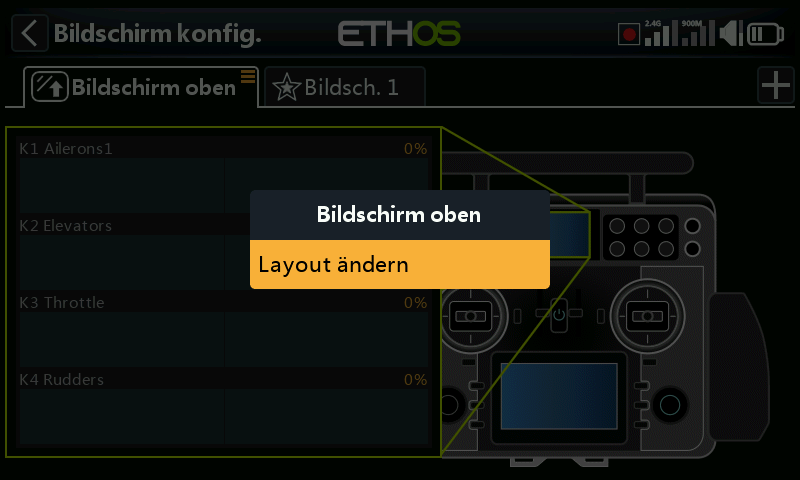
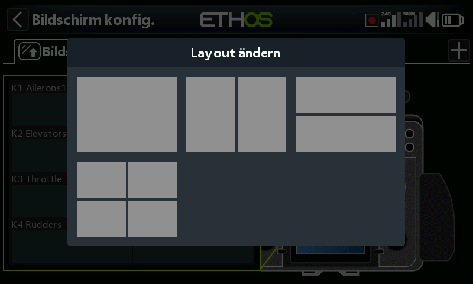

# Hauptbildschirme verwalten

Bildschirme können in ihrem Layout geändert, als Hauptbildschirm festgelegt, neu angeordnet oder gelöscht werden. Der Dialog zur Bildschirmverwaltung wird durch langes Berühren des Bildschirmreiters oder durch langes Drücken der Eingabetaste aufgerufen.

## Verwaltung des oberen Bildschirms (nur XE-Serie)

Bei der XE-Serie lässt sich das Layout des oberen Bildschirms ändern. Der Dialog zur Bildschirmverwaltung wird durch langes Berühren des Bildschirm-Reiters oder durch langes Drücken der Eingabetaste (Enter) aufgerufen.

A dialog will open allowing you to select from 4 different top screen layouts.
