# Konfigurieren des Hauptbildschirms

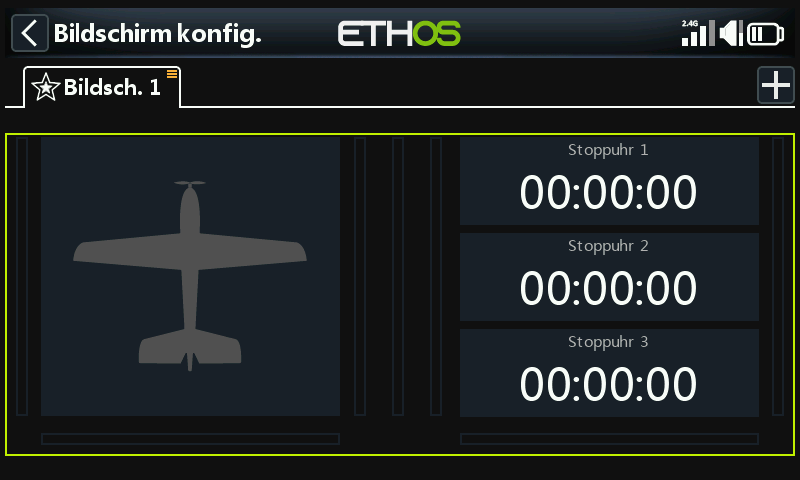

Die grüne Umrandung zeigt an, dass wir uns im Konfigurationsmodus befinden. Ein Widget kann durch Antippen konfiguriert werden.

## Konfigurieren Sie die Modellbitmap

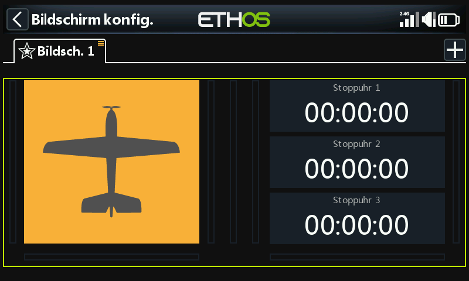

Tippen Sie auf das Modell-Bitmap-Widget, um in den Bearbeitungsmodus zu wechseln.

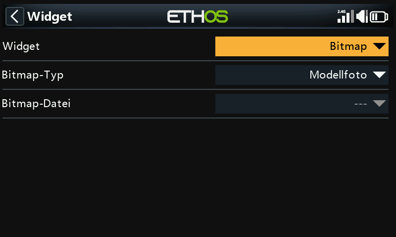

Standardmäßig ist beim Bitmap-Widget auf dem Hauptbildschirm der „Bitmap-Typ“ auf „Modell-Bitmap“ eingestellt. Die Bitmap kann hier nicht ausgewählt werden, sondern wird unter „Modell / [Modell-Konfig](../model-setup/model-edit.md).“ oder im Assistenten für neue Modelle konfiguriert. Die Modell-Bitmap muss sich im Ordner „/[bitmaps/model](../system-setup/file-manager.md)“ befinden.

Standardmäßig zeigen die drei Widgets auf der rechten Seite die drei Stoppuhren an.

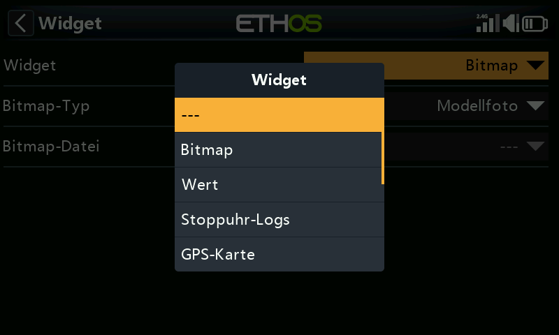

Sie können so konfiguriert werden, dass andere Parameter angezeigt werden, indem Sie jedes Widget auswählen und anschließend den Widget-Typ im Dialogfeld ändern. Weitere Details finden Sie unten.

Benutzerdefinierte Lua-Widgets werden ebenfalls in der Liste angezeigt.

## Beispiel für Widgets auf dem Hauptbildschirm

Im obigen Beispiel zeigt das Widget „Modell-Bitmap“ links das unter „Modell / Modell bearbeiten / Bild“ konfigurierte Modellbild an. Das obere Widget rechts zeigt die Empfängerbatteriespannung an, das mittlere den RSSI-Wert und das untere „Gas aktiv“. Dieses Status-Widget ist im Thread „FrSky – ETHOS Lua Script Programming“ auf rcgroups verfügbar.

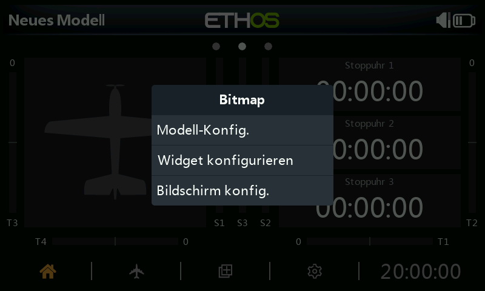

Tippen Sie auf ein beliebiges Widget auf den Hauptbildschirmen, um einen Dialog aufzurufen, über den Sie zu Modell / Bearbeiten gelangen, um die Modell-Bitmap zu konfigurieren, oder um das Widget zu konfigurieren, oder um zur Hauptfunktion [Bildschirme konfigurieren](index.md) zu gelangen.

### Top screen widgets (XE series only)

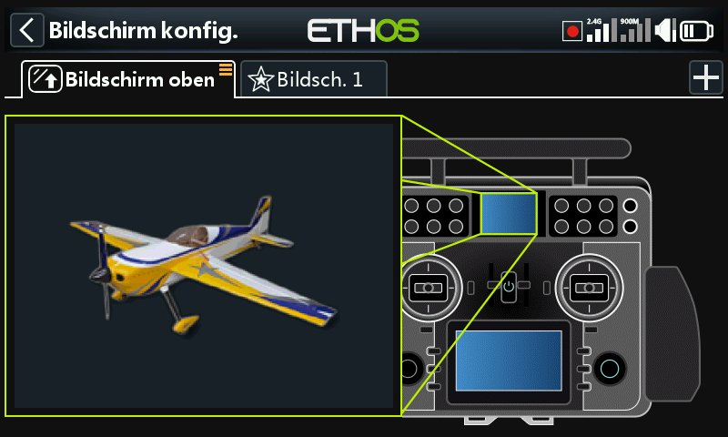

Bei den Sendern der XE-Serie ist das standardmäßige Widget für den oberen Bildschirmbereich vom Typ „Bitmap“ und auf „Modell-Bitmap“ eingestellt. Die Bitmap selbst kann hier nicht ausgewählt werden; ihre Konfiguration erfolgt unter „Modell/Modell bearbeiten“ oder über die Assistenten für neue Modelle. Die Modell-Bitmap muss im Ordner/bitmaps/model\` abgelegt sein.

Um das Widget zu ändern, tippen Sie auf das Modell-Bitmap-Widget, um in den Bearbeitungsmodus zu wechseln. Bitte orientieren Sie sich an den unten aufgeführten Standard-Widgets, um ein anderes Widget für die Anzeige auf dem oberen Bildschirm auszuwählen.

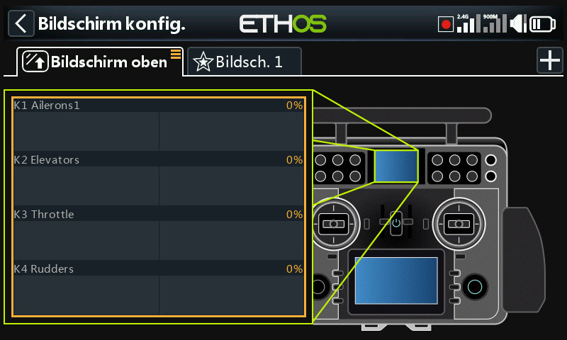

Im obigen Beispiel wurde das Widget „Kanäle“ ausgewählt.

## Standard-Widgets

### Bitmap

Wird verwendet, um eine ausgewählte Bitmap anzuzeigen.

Im obigen Beispiel zeigt das Widget die Modell-Bitmap an, die sich in /bitmaps/model befinden muss.

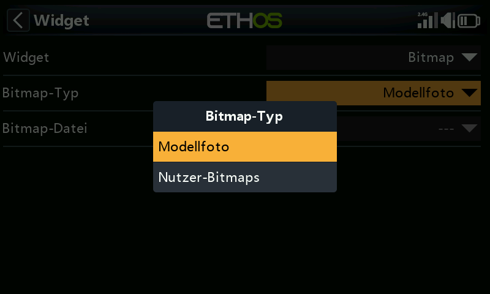

Das Widget kann auch eine Benutzer-Bitmap anzeigen, die sich in /bitmaps/user befinden muss.

### Wert

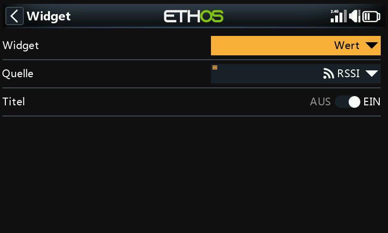

Das Widget Wert zeigt einfach den Wert der ausgewählten Quelle an.

#### Option Min/Max

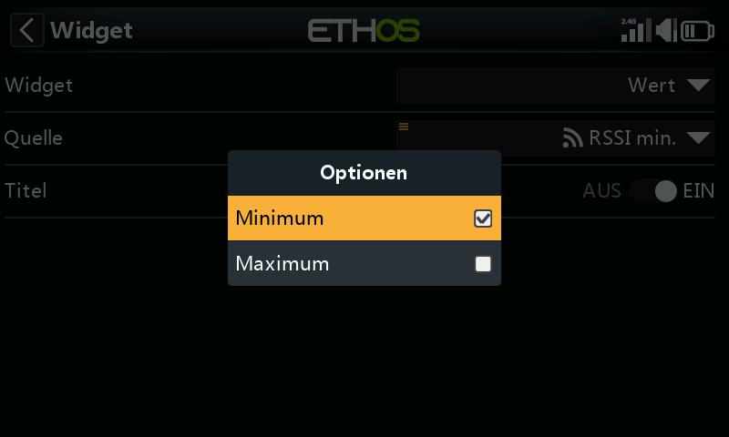

Bei der Anzeige von Telemetriewerten können Sie durch langes Drücken auf den Sensor nach der Auswahl den Minimal- oder Maximalwert anzeigen lassen.

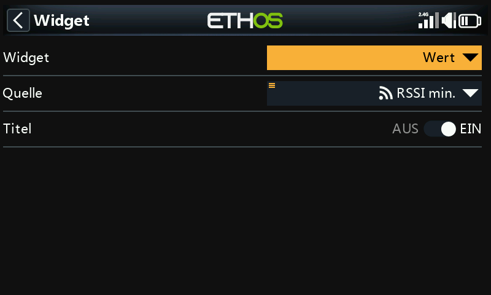

In diesem Beispiel wird der kleinste Wert von RSSI im Werte-Widget angezeigt.

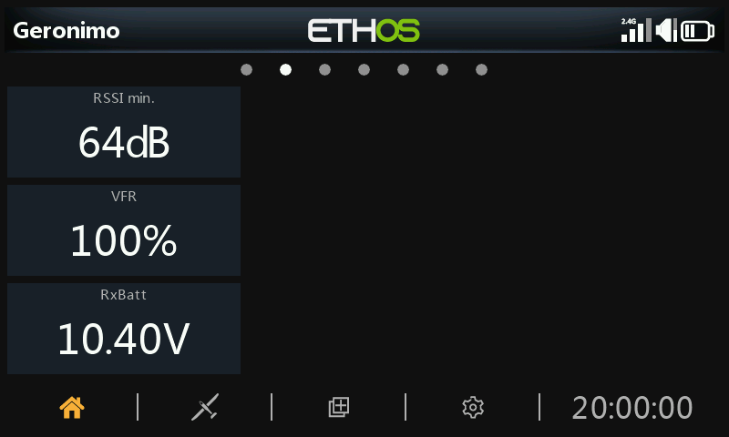

### Stoppuhr-Protokolle

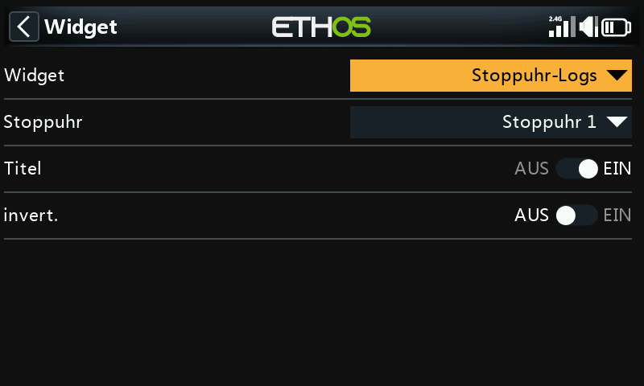

Die zu protokollierende Stoppuhr kann ausgewählt werden. Invertieren setzt den neuesten Eintrag an den Anfang des Protokolls.

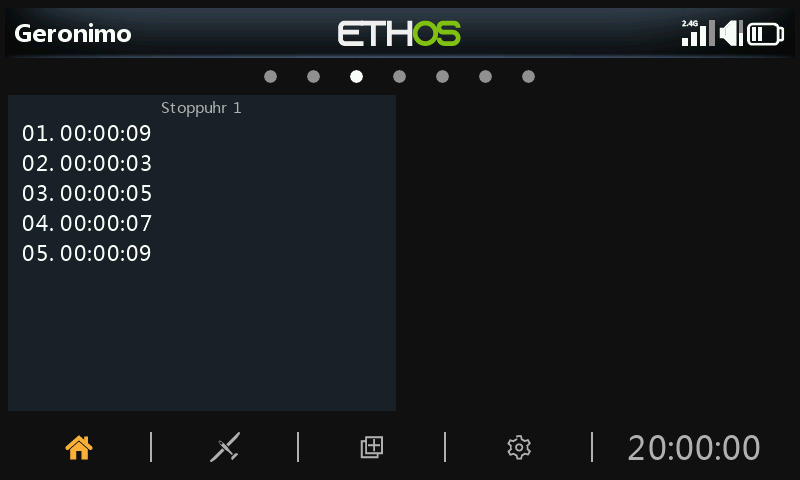

Die Zeitgeberprotokolle enthalten ein Protokoll der Zeitgeberwerte. Die Zeitgeberwerte werden geschrieben, wenn der Zeitgeber zurückgesetzt wird.

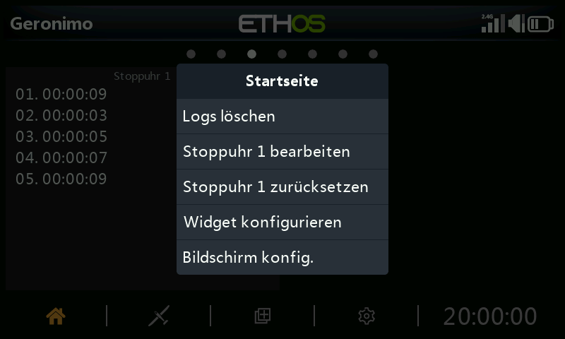

Drücken Sie lange auf das Widget, um „Protokolle löschen“, Stoppuhr(en) bearbeiten, Stoppuhr(en) zurücksetzen oder das Widget oder die Bildschirme zu konfigurieren.

### GPS-Karte

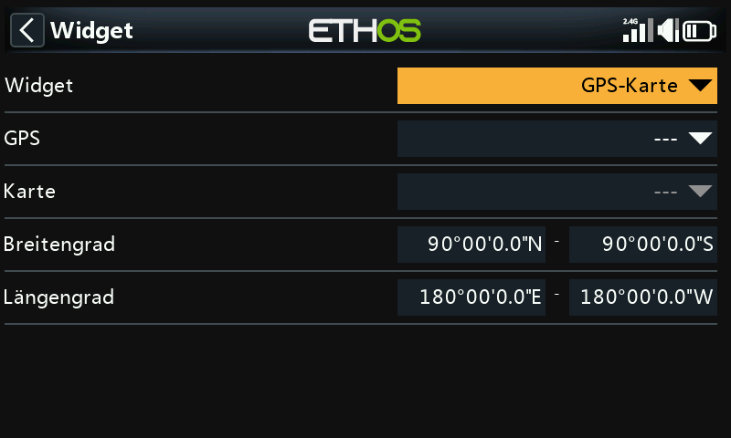

Dieses Widget unterstützt die Anzeige einer GPS-Karte. Bitte lesen Sie den X20 Ethos Thread auf rcgroups für weitere Details, insbesondere Beitrag [#8854](https://www.rcgroups.com/forums/showpost.php?p=47392275&postcount=8854).

### LiPo

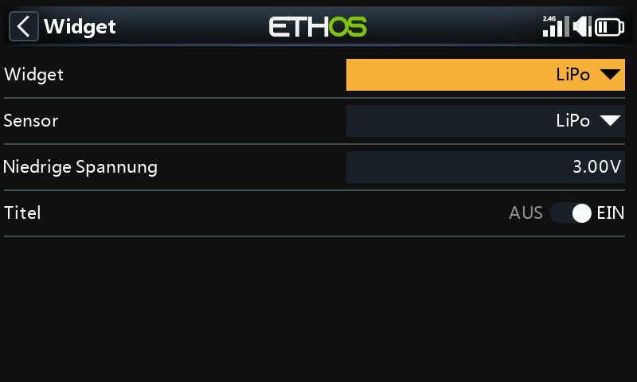

Das Lipo-Widget zeigt Lipo-Spannungsinformationen von Sensoren wie FLVS ADV an.

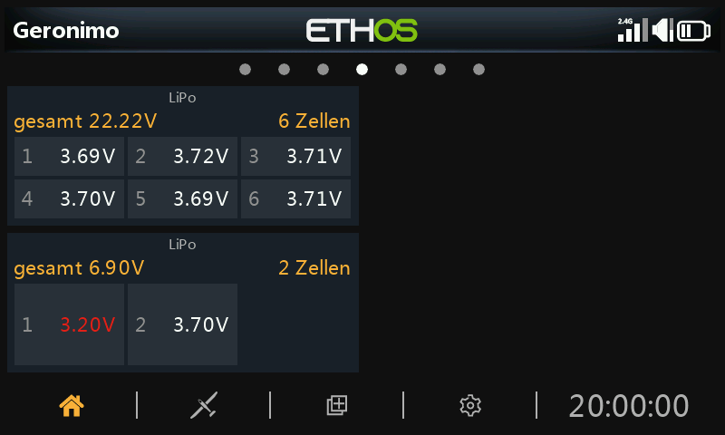

Das Lipo-Widget zeigt die Gesamtspannung des Akkus und die Anzahl der Zellen sowie die Spannungen der einzelnen Zellen an.

Liegt die niedrigste Zellenspannung unter dem Schwellenwert für „Niedrige Spannung“, werden die Spannungen in Rot angezeigt. Im zweiten Lipo-Widget oben wurde der Schwellenwert für die niedrige Spannung auf 3,3 V gesetzt, was dazu führt, dass der Wert in Rot angezeigt wird.

### Kanäle

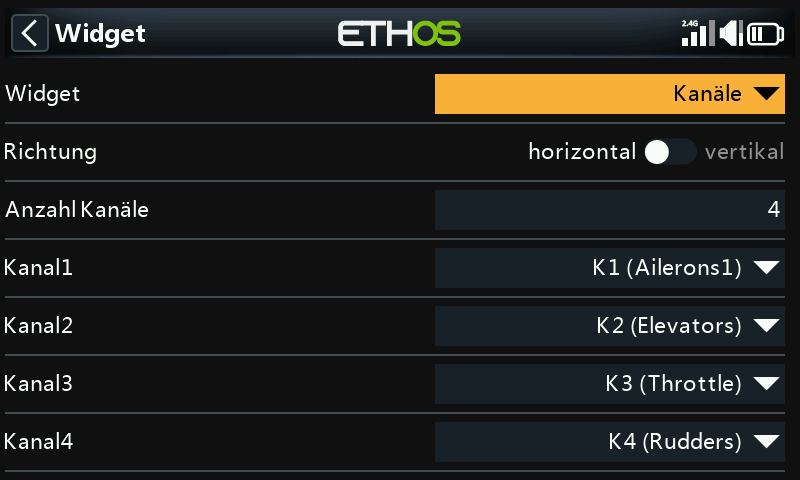

Das Kanäle-Widget ermöglicht die Darstellung von bis zu 8 Kanälen im Balkendiagrammformat, entweder mit horizontalen oder vertikalen Balken.

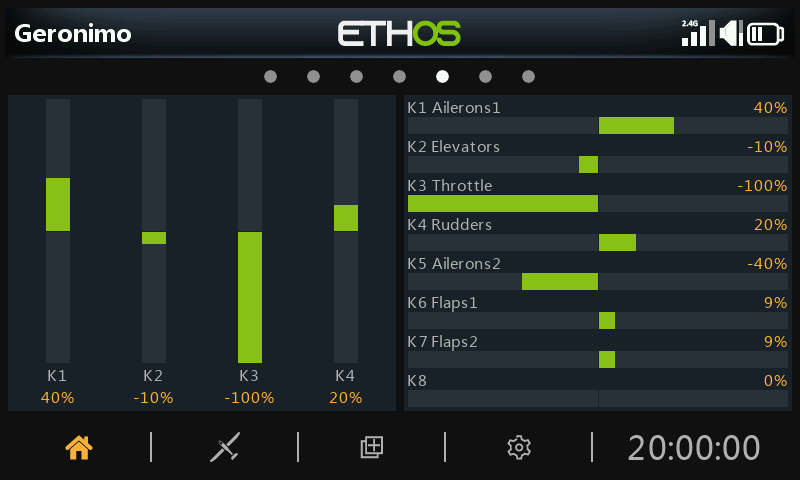

Das obige Beispiel zeigt zwei Kanäle-Widgets, von denen das Linke 4 Kanäle in vertikaler Richtung und das Rechte 8 Kanäle in horizontaler Richtung anzeigt.

### Liniendiagramm

#### Einrichtung

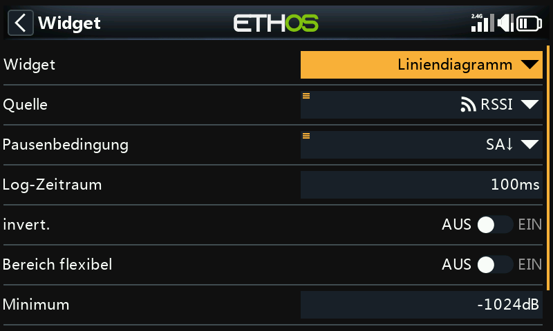

Mit dem Liniendiagramm-Widget kann die ausgewählte Quelle dargestellt werden.

Beachten Sie, dass das Widget seine Daten bei einem „Flug zurücksetzen“ zurücksetzt.

##### Quelle

Wählen Sie die Quelle aus, die aufgezeichnet werden soll.

##### Bedingung für die Pause

Wählen Sie die Quelle aus, die als Pausensteuerung verwendet werden soll. Wenn Sie keine Reserven haben, können Sie das Liniendiagramm auch anhalten und fortsetzen, indem Sie auf das Widget tippen, während es läuft.

##### Zeitraum protokollieren

Der Protokollierungszeitraum kann eingestellt werden. Bei einem Zeitraum von 500 ms deckt das Diagramm etwa 6 Minuten ab, bevor es anfängt, die Seite zu verlassen, während 1 s etwa 12 Minuten abdeckt.

##### Invert.

Das Log-Diagramm kann invertiert werden.

##### Bereich flexibel

Wenn die Bereichsautomatik eingeschaltet ist, wird die vertikale Achse entsprechend der Eingabe skaliert. Wenn der automatische Bereich ausgeschaltet ist, wird die vertikale Achse entsprechend den Einstellungen Min und Max skaliert. Im obigen Beispiel wurde für das obere Widget der automatische Bereich eingestellt, und das Diagramm zeigt bisher einen Quellenschwankungsbereich von +26 % bis -22 %.

##### Min/Max

Im obigen Beispiel ist für das untere Widget der automatische Bereich ausgeschaltet, und es wird ein fester Bereich von -100 % bis +100 % verwendet.

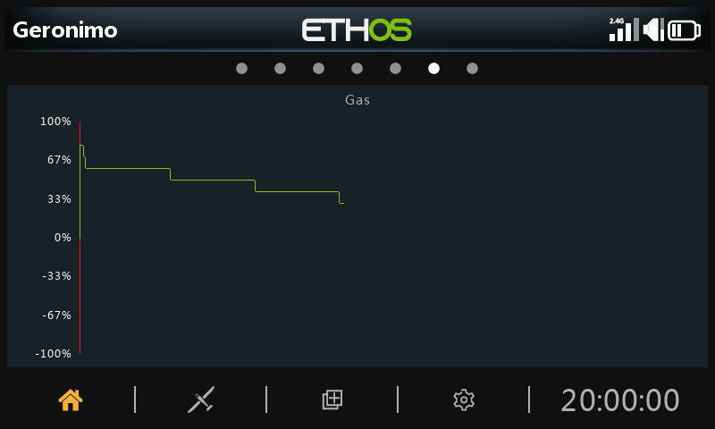

#### Optionen zur Laufzeit

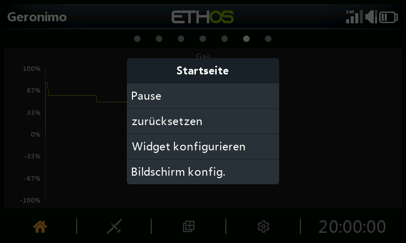

Wenn Sie auf das Liniendiagramm tippen, während es läuft, wird ein Dialogfeld angezeigt, in dem Sie Folgendes tun können:

- Pausieren oder Fortsetzen der Aufzeichnung
- das Diagramm zurückzusetzen und neu zu starten
- Konfigurieren Sie die Widget-Einstellungen
- Gehen Sie zum Menü 'Bildschirme konfigurieren'.

### Text

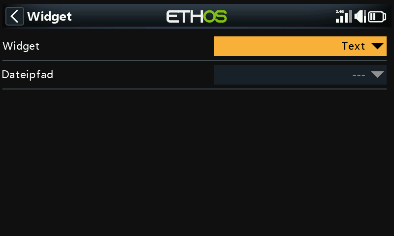

Das Text-Widget zeigt den Inhalt einer Textdatei an. Das Markdown-Format wird unterstützt.

Die Textdatei sollte sich in einem Ordner namens documents/user befinden.

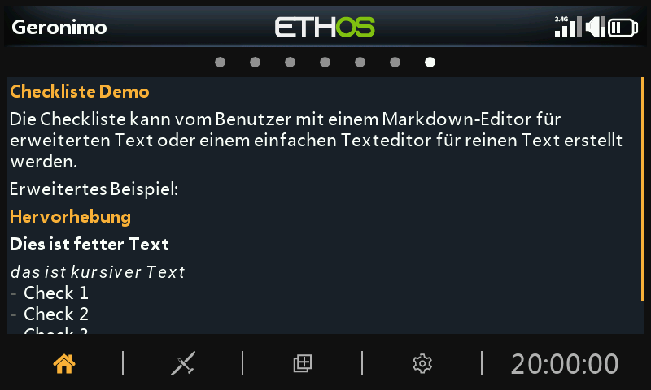

Der Inhalt der Datei wird im Text-Widget angezeigt.
