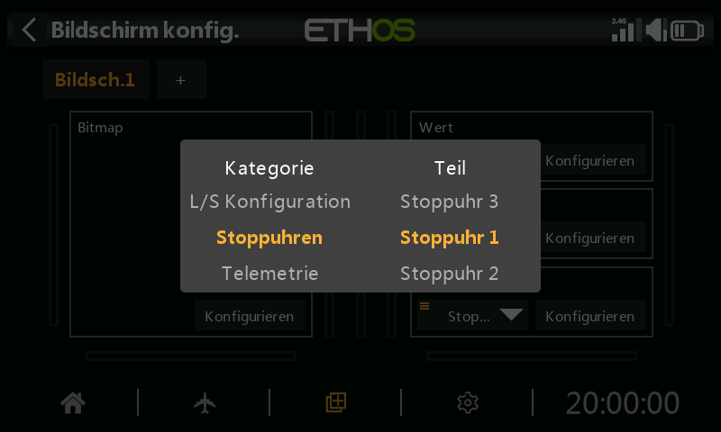
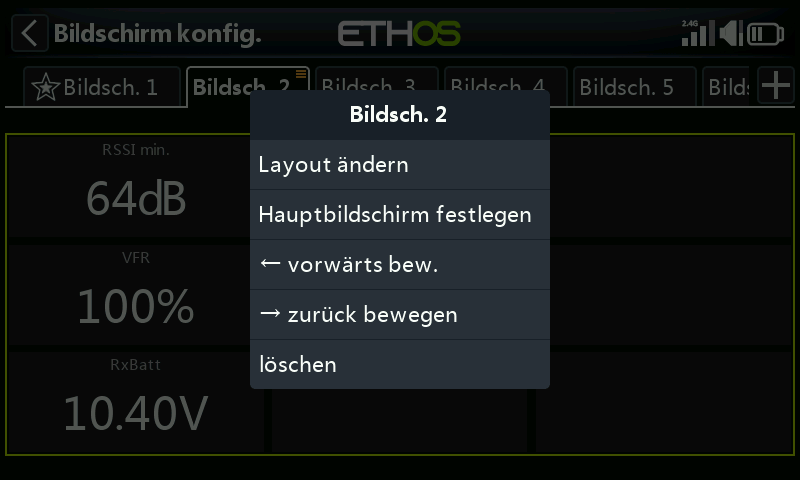

# Anzeigen

Der Startbildschirm besteht aus einem oder mehreren **Anzeigebildschirmen**, die jeweils aus
**Widgets** aufgebaut sind, die Sie selbst platzieren und konfigurieren. Ein Druck auf `DISP` öffnet den
Anzeigeeditor für den aktuellen Bildschirm.

Es stehen bis zu **acht** Bildschirme zur Verfügung, die jeweils auf einem von
**dreizehn** Layouts basieren (mit bis zu **neun** Widget-Feldern). Widgets können
Telemetriewerte anzeigen, aber auch jede von siebzehn weiteren Informationskategorien —
Modell-/Senderstatus, Timer, Kanäle und mehr. Konfigurierte Bildschirme erreichen Sie
per Wischgeste oder mit `PAGE` auf/ab; die obere und die untere Leiste bleiben
auf jedem Bildschirm sichtbar, außer bei einem Vollbild-Layout.

## Ein Widget hinzufügen

Jeder Bildschirm ist ein Raster; durch Antippen eines leeren Feldes öffnen Sie die Widget-Auswahl.
Die Widgets reichen von einfachen Text- und Zahlenanzeigen bis hin zu Instrumenten, Diagrammen und
vollständigen Telemetrieprotokollen. Nach dem Platzieren öffnet erneutes Antippen eines Widgets dasselbe
Optionsmenü, mit dem Sie es in der Größe ändern, verschieben oder entfernen können:

Wählen Sie die widgeteigenen Einstellungen aus, wird ein widgetspezifisches Konfigurationsformular geöffnet.
Das Feld **Quelle** — also der Wert, den das Widget anzeigt — verwendet dieselbe
[Quellenauswahl](../getting-started/user-interface-and-navigation.md#choosing-a-source)
wie überall sonst in Ethos:

## Widget-Typen {: #widget-types }

**Value** — ein einzelner Zahlen- oder Telemetriewert, als Text dargestellt:

Die meisten Quellen lassen sich zusätzlich auf einen laufenden **Min**- oder **Max**-Wert reduzieren — wählen Sie
dazu die Quelle aus, drücken Sie lange darauf und wählen Sie Min oder Max — nützlich zum Beispiel
für den schlechtesten RSSI-Wert während eines Fluges:

Nach dem Platzieren wird der Wert als einfache Anzeige auf dem Bildschirm dargestellt:

**Bitmap** — zeigt ein festes Bild an (z. B. ein Modellfoto) oder mehrere
Bilder, die je nach Wert einer Quelle gewechselt werden (z. B. ein Akkusymbol, das sich
mit der Spannung ändert):

**LiPo** — eine speziell für Akkus ausgelegte Anzeige, die einen Sensor wie das
FLVSS ausliest: Gesamtspannung des Akkupacks, Zellenzahl und jede einzelne Zellenspannung.
Wird die eingestellte Schwelle **Low voltage** unterschritten, wechselt die Anzeige auf
Rot — im folgenden Beispiel löst eine Schwelle von 3,3 V bei der niedrigsten Zelle aus:

**Channels** — bis zu 8 Ausgangskanäle als Balkendiagramm, waagerecht oder
senkrecht:

**Line Chart** — stellt den Wert einer Quelle über die Zeit dar und wird bei einem Flight
Reset zurückgesetzt:

- **Source** — der Wert, der aufgezeichnet wird.
- **Pause condition** — eine Quelle, die die Aufzeichnung anhält bzw. fortsetzt (oder tippen Sie einfach
  auf das laufende Widget, falls dafür keine Quelle frei ist).
- **Log period** — das Abtastintervall; 500 ms decken etwa 6 Minuten ab,
  bevor gescrollt wird, 1 s etwa 12 Minuten.
- **Inverted** — spiegelt das Diagramm senkrecht.
- **Auto range** — skaliert die senkrechte Achse automatisch passend zu den Daten;
  ist die Option ausgeschaltet, werden stattdessen feste **Min**-/**Max**-Werte verwendet (z. B. ein konstanter
  Bereich von −100 %…+100 %).

Durch Antippen eines laufenden Diagramms erscheinen **Pause/resume**, **Reset** (löschen und
neu starten), **Configure widget** oder der Sprung zu **Bildschirme konfigurieren**:

**Text** — gibt den Inhalt einer Markdown-Textdatei wieder (gelesen aus
`documents/user/` — siehe [Datei-Manager](../system-setup/file-manager.md#top-level-folders)):

**Timer Log** — ein scrollbares Protokoll der bisherigen Werte eines ausgewählten Timers, das
bei jedem Zurücksetzen dieses Timers geschrieben wird (nützlich, um den Verbrauch der Flugakkus
über einen Flugtag hinweg zu verfolgen); mit **Reverse** steht der neueste Eintrag oben:

Ein langer Druck auf einen Eintrag (oder auf das Widget) bietet **Clear logs**, das Bearbeiten bzw. Zurücksetzen des
zugehörigen Timers oder den Sprung zur Widget- bzw. Bildschirmkonfiguration:

**GPS Map** — stellt die aktuelle GPS-Position als Spur dar, für Modelle mit einem GPS-Sensor
(weitere Einzelheiten speziell zu diesem Widget finden Sie im Thread *FrSky - ETHOS Lua Script Programming*
auf rcgroups, Beitrag #8854):

## Optionen auf Bildschirmebene

Über die einzelnen Widgets hinaus verfügt jeder Bildschirm über eigene Einstellungen — die Rastergröße des Layouts,
den Hintergrund und die Frage, welche Bildschirme im `PAGE`-Durchlauf enthalten sind:

Ein vollständig konfigurierter Startbildschirm vereint mehrere Widgets zu einem Layout, das alles
auf einen Blick zeigt:

Siehe [Weitere Anzeigen](additional-displays.md) zum Hinzufügen weiterer Bildschirme
über den Standard hinaus und [Benutzerdefinierte Widgets](custom-widgets.md) für
Lua-skriptbasierte Widgets jenseits der integrierten Auswahl.
