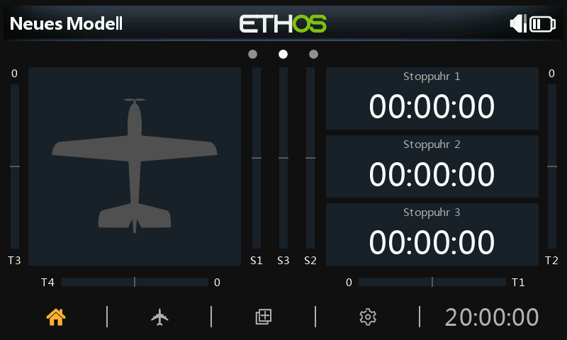

# Bildschirme konfigurieren

Die Hauptansichten werden über die Funktion „Bildschirme konfigurieren“ auf der obersten Ebene angepasst und konfiguriert, die über das Symbol „Mehrere Bildschirme“ in der unteren Menüleiste aufgerufen wird.

Die Hauptansichten können vom Benutzer konfiguriert werden, indem Widgets ausgewählt werden, um die gewünschten Informationen wie Telemetrie, Funkstatus usw. anzuzeigen. Es kann bis zu acht benutzerdefinierten Bildschirme geben. Der Benutzer kann aus fünfzehn verschiedenen Konfigurationen von Bildschirm-Widgets für jeden neuen Bildschirm mit bis zu neun Zellen für die Anzeige von Widgets wählen. Die Widgets können Telemetriewerte, aber auch Informationen aus siebzehn anderen Kategorien anzeigen. Sobald die Bildschirme mit Widgets konfiguriert sind, kann auf sie mit einer Touch-Wisch-Geste oder den Navigationssteuerelementen „Seite auf/ab“ zugegriffen werden. Die obere und untere Leiste mit ihren aktiven Symbolen bleiben auf allen Bildschirmen (außer dem Vollbild) angezeigt.

Standardmäßig zeigt der Hauptbildschirm (erster Bildschirm) links ein großes Widget zur Darstellung der Modell-Bitmap und rechts drei Widgets zur Anzeige von drei Stoppuhren an. Diese Widgets können neu konfiguriert werden, um andere Parameter anzuzeigen, oder das gesamte Bildschirm-Layout kann durch einen neu definierten Bildschirm mit einer anderen Anzahl von Zellen oder einem anderen Zellen-Layout ersetzt werden.

Durch Antippen des Symbols „Mehrere Bildschirme“ in der Mitte der unteren Leiste des Hauptbildschirms wird der erste Bildschirm zur Konfiguration der Bildschirme aufgerufen.
