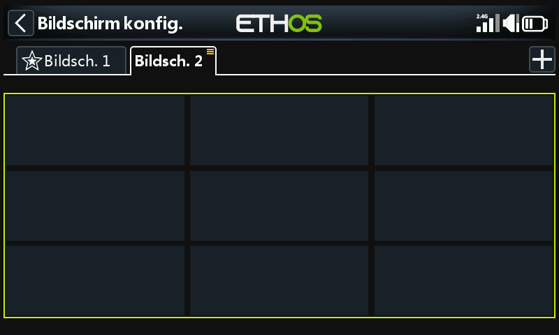

# **Hinzufügen** **von weiteren** **Bildschirme****n**

Tippen Sie auf die Schaltfläche „+“ neben „Bildschirm1“, um einen weiteren Bildschirm hinzuzufügen.

Es öffnet sich ein Dialog, in dem Sie aus 15 verschiedenen Layouts (einschließlich Vollbildmodus und vier Startbildschirmen) mit bis zu 9 Widgets auswählen können. Sie können auch jeden beliebigen Bildschirm als Startbildschirm festlegen.

In diesem Beispiel wurde ein Bildschirm mit 9 Widgets ausgewählt. Tippen Sie auf ein beliebiges Widget, um es wie oben beschrieben zu konfigurieren.
