# Operationen

## Abschnitt „Geräte“

Die FrSky Suite unterstützt drei Arten von FrSky-Geräten: Ethos-Fernsteuerungen, ECOS-Fernsteuerungen und Aegis-Flugsteuerungen. Einzelheiten hierzu finden Sie in den jeweiligen Abschnitten weiter unten.

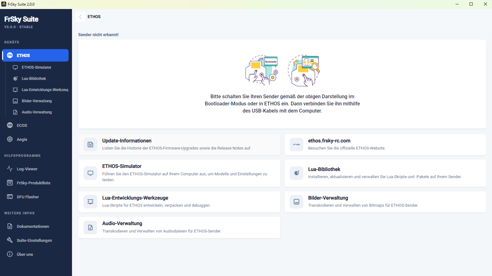

Die FrSky Suite öffnet sich standardmäßig im Bereich „Ethos-Geräte“ und zeigt die oben abgebildete Ansicht, falls beim Start kein Ethos-Sender erkannt wurde.

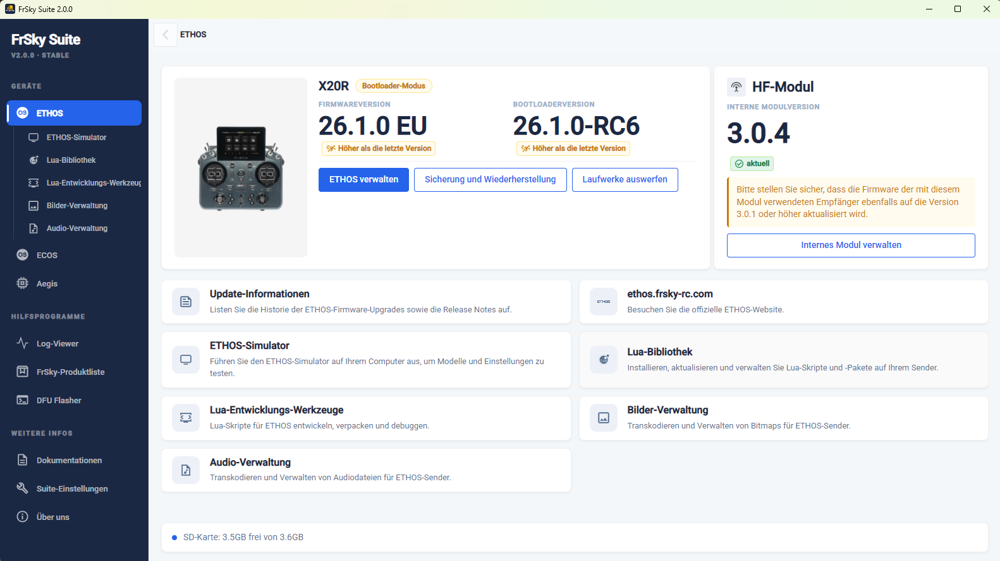

Sie können den Sender im Bootloader-Modus oder im eingeschalteten Zustand im „FrSky Suite“-Modus anschließen. Weitere Informationen finden Sie im Abschnitt „Modi für die [USB-Verbindung zum PC](../getting-started/usb-connection-modes.md)“.

Sobald ein Ethos-Sender erkannt wurde, werden dessen Details wie im obigen Beispiel aufgeführt. Die Statusmeldung „Radio connection not detected“ wurde durch „Connected to X20R“ ersetzt, um anzuzeigen, dass eine X20R angeschlossen ist.

#### Senderinformation

##### Verbunden

Die aktuellen Firmware- und Bootloader-Versionen werden aufgelistet, versehen mit roten „Veraltet“- oder grünen „Aktuell“-Markierungen.

Darunter bestätigt eine Meldung die Kompatibilität von Firmware und Bootloader. Wenn Sie beispielsweise nur die Firmware aktualisiert haben, erhalten Sie möglicherweise eine Meldung, dass die Firmware eine neuere Bootloader-Version erfordert.

Der Status des HF-Moduls wird neben dem Bereich „Senderinformationen“ angezeigt; bitte beachten Sie hierzu den Abschnitt über das HF-Modul weiter unten.

##### Datensicherung und Wiederherstellung

Vor der Durchführung von Updates ist es ratsam, auf die Option „[Sicherung und Wiederherstellung](operation.md)“ zu klicken, um [Sicherungskopien ](operation.md)des aktuellen Zustands Ihres Senders zu erstellen.

##### Laufwerke auswerfen

Nach Überprüfung der Statusinformationen des Senders kann die Verbindung durch Klicken auf die Schaltfläche „Laufwerke auswerfen“ getrennt werden.

##### Ethos verwalten

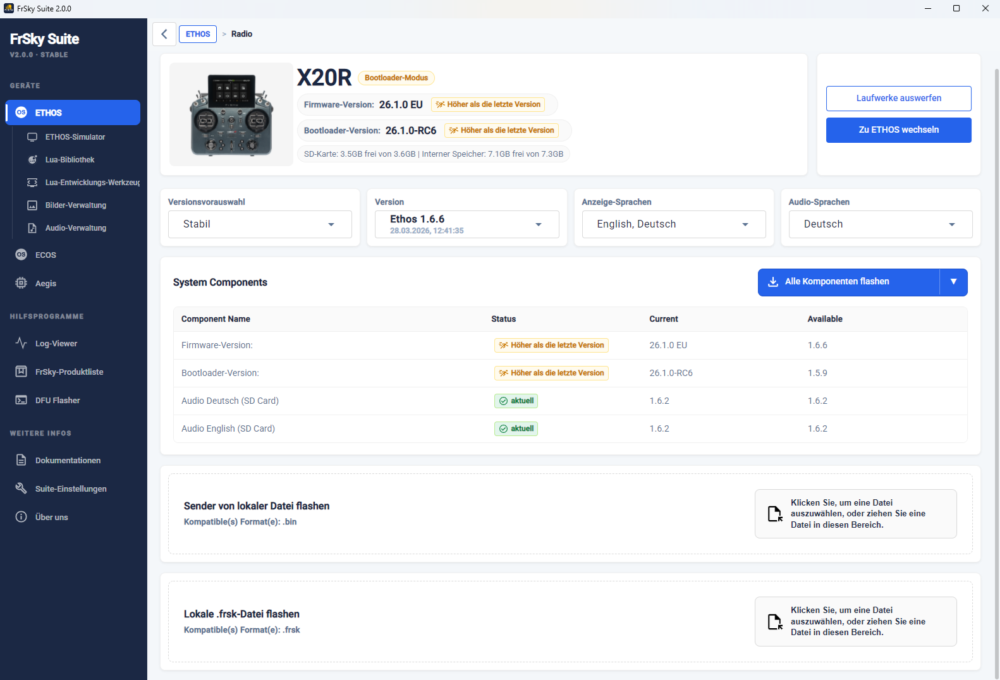

Klicken Sie auf die Schaltfläche „Ethos verwalten“, um die Aktualisierungsseite zu öffnen.

Das obige Beispiel zeigt, dass ein X20R im Bootloader-Modus verbunden ist. Bei Bedarf können Sie auf die Schaltfläche „Zu Ethos wechseln“ klicken, um den Modus zu wechseln – etwa um einen Empfänger oder ein Modul zu flashen. Im Allgemeinen müssen Sie sich keine Gedanken über den aktuellen Modus machen, da die Suite bei Bedarf automatisch zwischen den Modi umschaltet.

Die Versionen von Firmware, Bootloader und Audiodateien (entweder auf der SD-Karte oder im internen Speicher des Senders) werden angezeigt. Die Firmware-Version von Ethos, des Bootloader werden als höher als die letzte Version ausgewiesen und die Audiodateien sind auf dem aktuellen Stand.

Bitte beachten Sie, dass die Systemdateien im Flash-Speicher nun zusammen mit der Firmware aktualisiert werden, sodass sie nicht mehr separat verwaltet werden müssen.

##### Durchführen von Updates

##### Installation von  Vorabversionen (Pre-release)

Wenn Sie auf Vorabversionen der Firmware aktualisieren möchten, müssen Sie die Servereinstellung unter „Suite-Einstellungen“ von „FrSky Server“ auf „GitHub“ ändern. Bitte beachten Sie hierzu den Abschnitt „[Serverstandort](operation.md)“ weiter unten.

##### Auswählen der Update-Optionen

Wenn der Sender nicht auf dem neuesten Stand ist, müssen Sie:

1. Wählen Sie die gewünschte Release-Version aus, indem Sie zunächst den gewünschten Zweig, z. B. „Stabil“ oder „Testversion“, und anschließend die gewünschte Version sowie die Anzeige- und Audiosprachen auswählen.
2. Anschließend können Sie „Alle Komponenten schreiben“, indem Sie auf die Schaltfläche „Alle Komponenten schreiben“ klicken.
3. Alternativ öffnet mit ein Klick auf den Pfeil nach unten  auf der rechten Seite eine Dropdown-Liste mit weiteren Optionen: das Schreiben veralteter Komponenten, das ausschließliche Schreiben der Firmware und der Systemdateien (die für den Betrieb der Firmware erforderlich sind) oder das separate Schreiben des Bootloaders bzw. der Audiodateien.

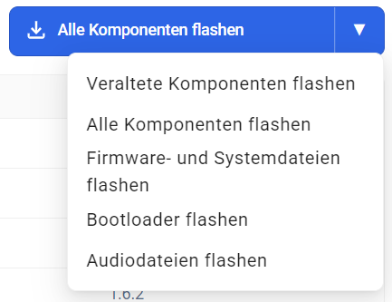

##### Durchführen der Updates

Sobald Sie den gewünschten Umfang des Updates ausgewählt haben, klicken Sie auf die gewählte Option, um fortzufahren. Im obigen Beispiel haben wir die Option „Firmware und Systemdateien schreiben“ ausgewählt.

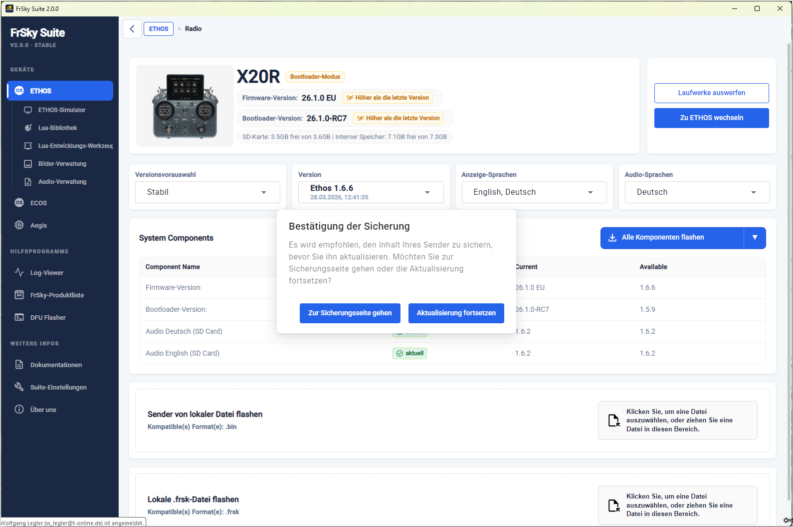

Nachdem Sie auf die Option „Firmware und Systemdateien schreiben“ geklickt haben, werden Sie aufgefordert, zunächst die Backup-Seite aufzurufen und eine vollständige Sicherung durchzuführen, bevor Sie fortfahren. Bitte beachten Sie hierzu den Abschnitt „[Sicherung & Wiederherstellung](operation.md)“.

Dies ist besonders wichtig, da Ihre Modelldateien nach dem Update beim Laden automatisch auf die neue Version aktualisiert werden. Es handelt sich dabei um einen irreversiblen Vorgang: Sobald die Modelle aktualisiert wurden, lassen sie sich nicht mehr laden, falls Sie sich entscheiden, die Firmware Ihres Senders auf eine frühere Version zurückzusetzen (Downgrade). Nach einem solchen Downgrade müssen Sie Ihre Modelle und sonstigen Daten aus Ihren Backups wiederherstellen.

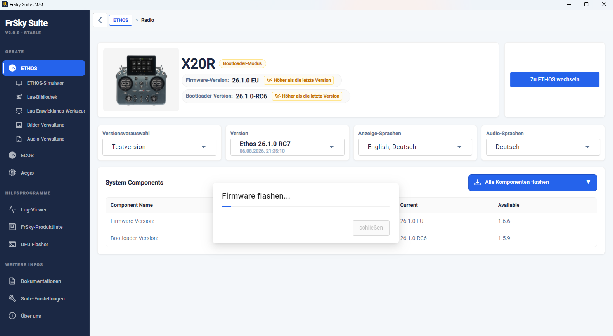

Kehren Sie nach der Erstellung einer Sicherung zur Seite „Ethos verwalten“ zurück, klicken Sie auf die Option „Firmware- und Systemdateien schreiben“ und wählen Sie anschließend die Option „Aktualisierung fortsetzen“ aus.

Falls Ihr internes HF-Modul nicht über die Version 3.0.1 oder neuer verfügt, müssen Sie das HF-Modul aktualisieren, bevor Sie mit der Installation von Version 1.6.0 oder neuer fortfahren können. Klicken Sie auf der Startseite auf „Internes Modul verwalten“, um das interne HF-Modul zu aktualisieren, und kehren Sie anschließend zu dieser Seite zurück, um fortzufahren.

Ein Fortschrittsbalken wird sowohl auf der Seite als auch im Sender angezeigt.

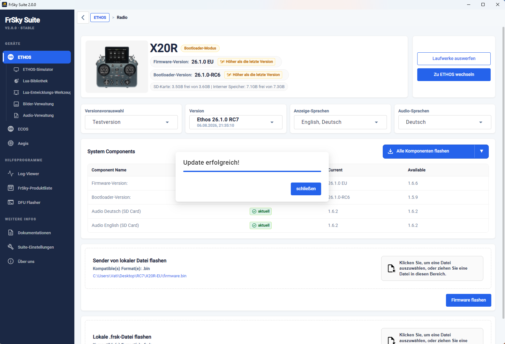

Nach Abschluss wird die Meldung „Update erfolgreich“ angezeigt. Die Firmware-Version wird nun als aktuell angezeigt.

Auf ähnliche Weise können die alternativen Optionen ausgeführt werden, um veraltete Komponenten, den Bootloader oder die Audiodateien einzeln zu schreiben.

Es ist immer ratsam, die Laufwerke vor dem Abziehen des USB-Kabels manuell über die Schaltfläche „Laufwerke auswerfen“ auszuwerfen.

##### Sender von einer lokaler Datei flashen

##### Lokale .frsk-Datei flashen

##### Laufwerke auswerfen

Klicken Sie auf die Schaltfläche „Laufwerke auswerfen“, um den Sender zu trennen.

#### HF-Module

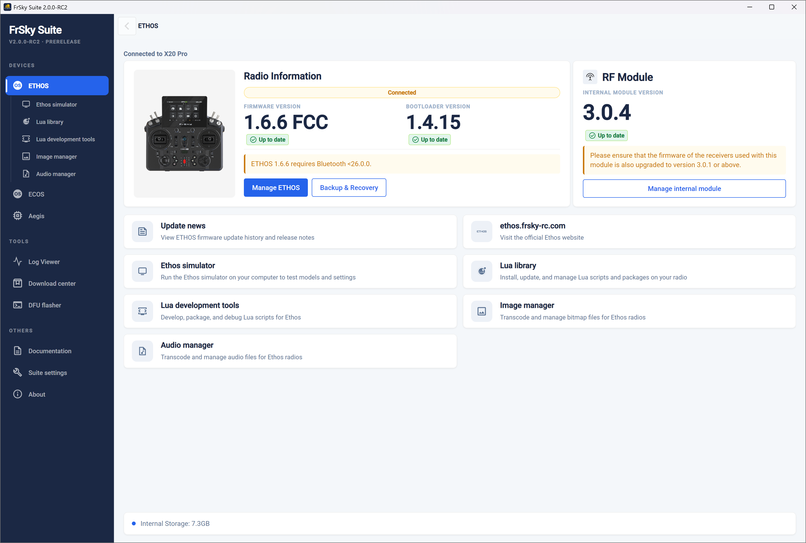

Der HF-Modul-Manager wird verwendet, um die Firmware des HF-Moduls zu aktualisieren.

##### Internes Modul verwalten

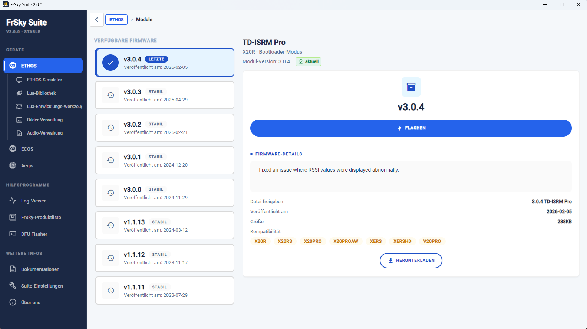

Wählen Sie die gewünschte Version aus (normalerweise die neueste). Die Firmware-Details für die ausgewählte Version werden im rechten Bereich angezeigt.

Klicken Sie auf „Flash“, um die Firmware auf das interne HF-Modul zu schreiben.

Nach Abschluss erscheint das Dialogfeld „FRSK wurde erfolgreich geflasht“.

Sicherung und Wiederherstellung

Über die Funktion „Sicherung und Wiederherstellung“ lässt sich eine Sicherung der auf dem Sender gespeicherten Modelle und Einstellungen auf einem Datenträger ablegen; ebenso kann eine zuvor erstelltes Sicherung auf den Sender zurückgespielt werden. Da die Modelldaten nicht abwärtskompatibel sind, müssen bei einem Downgrade auf eine ältere Firmware die entsprechenden Modelldateien vom PC wiederhergestellt werden.

##### Warnung!

Die Wiederherstellung stellt die Firmware NICHT wieder her! Nach der Wiederherstellung Ihrer Modelle und Einstellungen müssen Sie die Firmware weiterhin über die Suite neu aufspielen, und zwar mit der Version, die zu Ihrer Sicherung passt. Bitte beachten Sie hierzu den obenstehenden Abschnitt „[Aktualisierung der Firmware](../system-setup/file-manager.md)“.

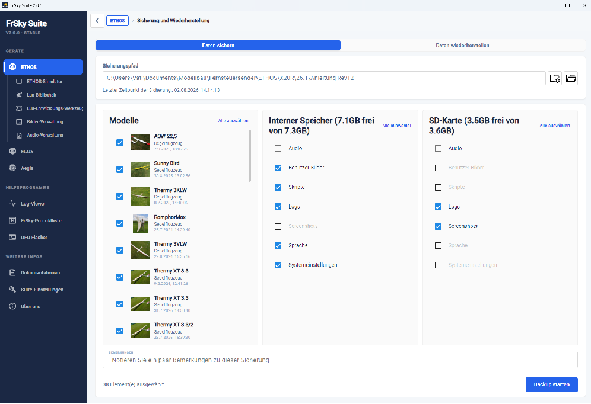

##### Speicherort der Sicherung

Klicken Sie auf das Ordnersymbol, um den gewünschten Speicherort für die Sicherung zu suchen und auszuwählen. Der Sicherungspfad wird für jeden Sendertyp gespeichert.

Das Datum und die Uhrzeit der letzten Sicherung werden unter dem Speicherort angezeigt.

##### Start der Sicherung

Wählen Sie die Modelle und die zu sichernden Bereiche des „internen Speichers“ aus und fügen Sie entsprechende Anmerkungen hinzu.

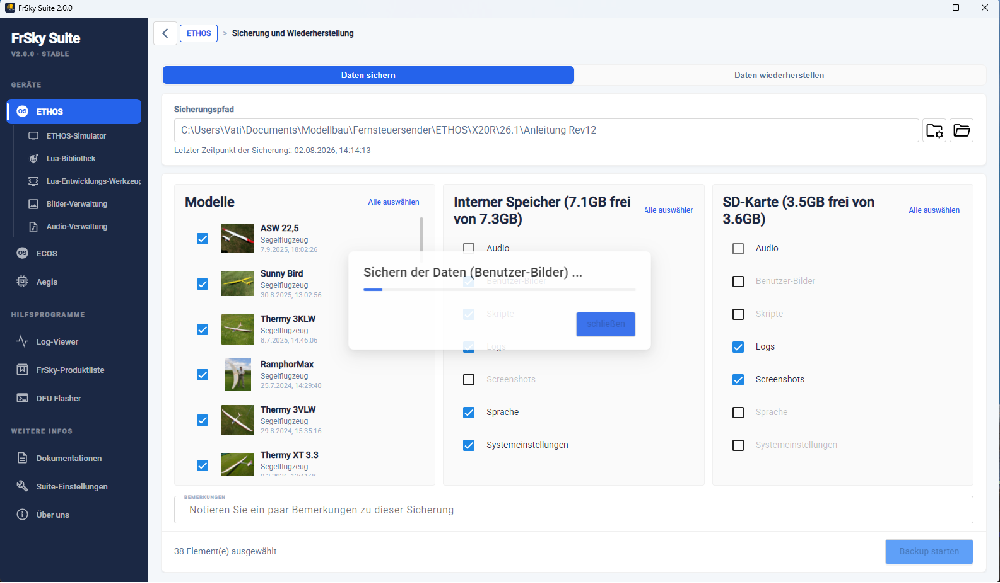

Klicken Sie auf „Backup starten“, um eine Sicherung der ausgewählten Modelldateien und Speicherbereiche auf dem Sender zu erstellen. Die aktuelle Ethos-Version wird beim Erstellen der Sicherung festgehalten.

##### Daten wiederherstellen

Klicken Sie auf „Daten wiederherstellen“, um zuvor gesicherte Modelldateien auf dem Sender wiederherzustellen. Dies kann erforderlich sein, wenn die Firmware des Senders auf eine ältere Version zurückgesetzt wird.

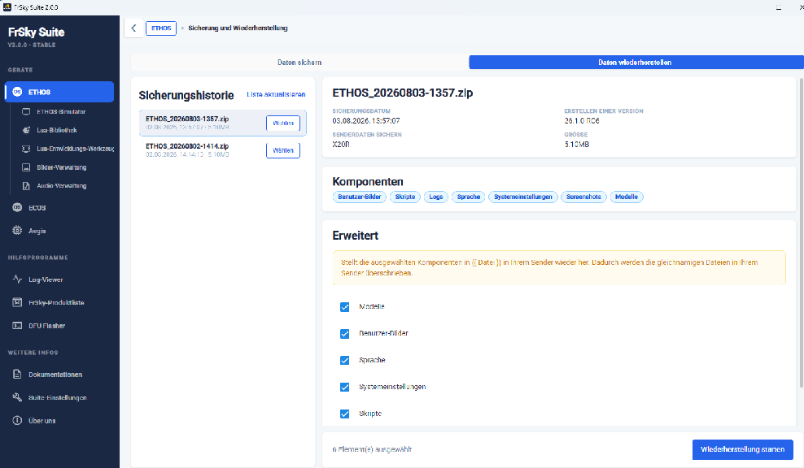

##### Sicherungshistorie

Der Sicherungsverlauf listet alle am ausgewählten Sicherungsort gefundenen Sicherungen auf. Wählen Sie eine davon aus, um deren Sicherungsdaten zu überprüfen.

Im rechten Bereich werden Details wie das Backup-Datum, die Ethos-Version zum Zeitpunkt der Erstellung, den Sicherungs-Sendertyp, die Datei-Größe sowie die gespeicherten Anmerkungen zur Sicherung angezeigt.

Die gesicherten Komponenten werden ebenfalls aufgelistet.

##### Wiederherstellung

Die unter „Erweitert“ ausgewählten Komponenten werden auf dem Sender wiederhergestellt. Beachten Sie, dass vorhandene Dateien mit demselben Namen während des Wiederherstellungsvorgangs überschrieben werden.

Klicken Sie auf „Wiederherstellung starten“, um die ausgewählten Sicherungsdateien auf dem Sender wiederherzustellen.

#### Aktuelle Meldungen

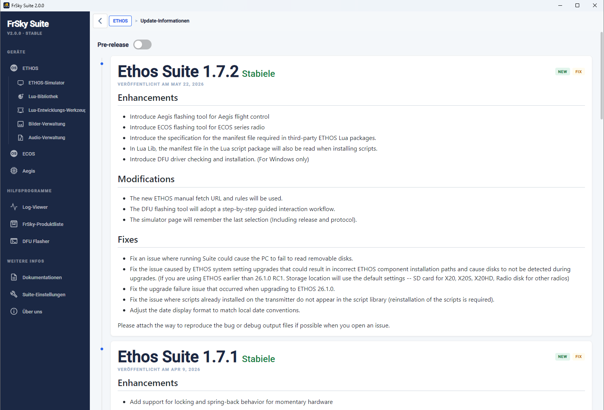

Klicken Sie auf „Update-Informationen“, um den Verlauf der Ethos-Firmware-Updates und die Versionshinweise anzuzeigen.

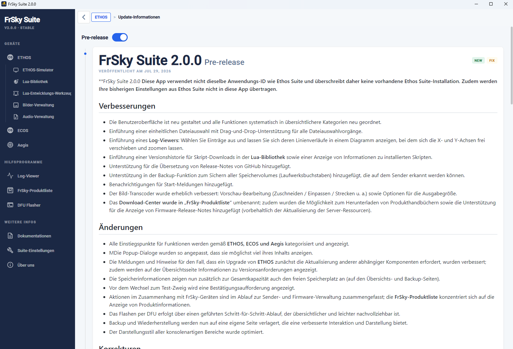

Aktivieren Sie oben auf der Seite die Option „Pre-release“, um Vorabversionen in den Update-Verlauf und die Versionshinweise der Ethos-Firmware einzubeziehen.

#### ethos.frsky-rc.com

Klicken Sie auf die Schaltfläche „ethos.frsky-rc.com“, um die offizielle Ethos-Website zu besuchen.

Die Website umfasst die folgenden Kategorien:

- eine Ethos-Einführung
        - ein „Erste Schritte“-Bereich mit Informationen zum Ethos-Update-Prozess sowie Download-Links für die FrSky Suite usw.
        - ein Bereich zur Nutzung von Ethos, der wichtige Anleitungen, FAQs und ein Ticketsystem für den Support umfasst
        - das „Ethos Resource Centre“, das Modellvorlagen, Lua-Skripte, Widgets usw. umfasst.
        - der Prozess der Zusammenarbeit mit Dritten und die Einzelheiten zur Anwendung

### Ethos-Simulator

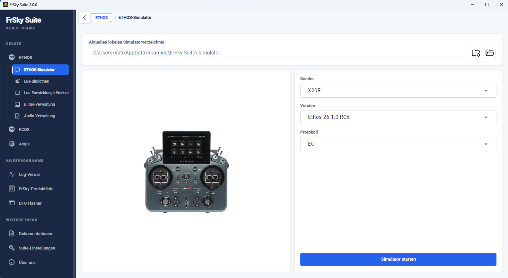

Mit dem Ethos-Simulator können Sie die Funktionen des Senders erkunden sowie Funktionalitäten oder geplante Modellerweiterungen testen, ohne den eigentlichen Sender zu benötigen. Zudem ermöglicht er es Ihnen, neue Versionen auszuprobieren, bevor Sie ein Update auf Ihrem Sender durchführen.

Wählen Sie zunächst den zu simulierenden Sendertyp, die gewünschte Ethos-Version und das HF-Protokoll aus. Klicken Sie anschließend auf „Simulator starten“.

Bitte beachten Sie, dass Nightlies-Vorabversionen nur angeboten werden, wenn auf der Registerkarte „Suite-Einstellungen“ „GitHub“ als [Serverstandort](operation.md) ausgewählt wurde.

#### Einfache Einrichtung

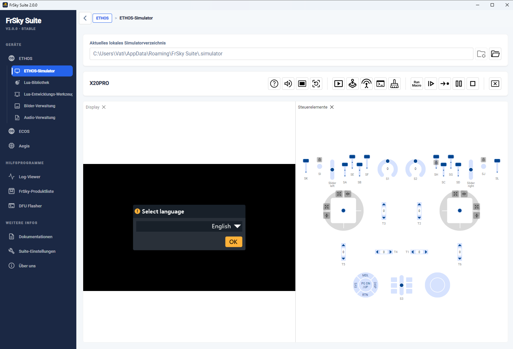

Wenn keine gültigen Senderdaten gefunden werden, wird eine Initialisierungssequenz gestartet.

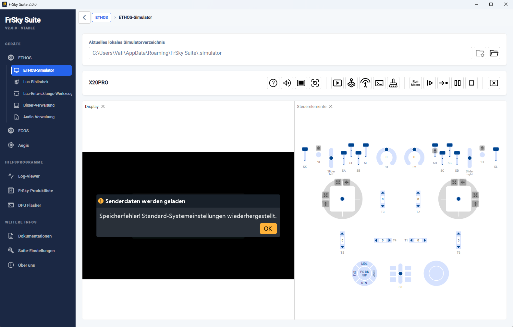

Für einen schnellen Überblick nutzen Sie einfach den Wizard für neue Modelle, der nach einem Klick auf „OK“ startet. So können Sie den Simulator mit minimalem Aufwand erkunden oder Ethos testen, bevor Sie sich für einen FrSky-Sender entscheiden.

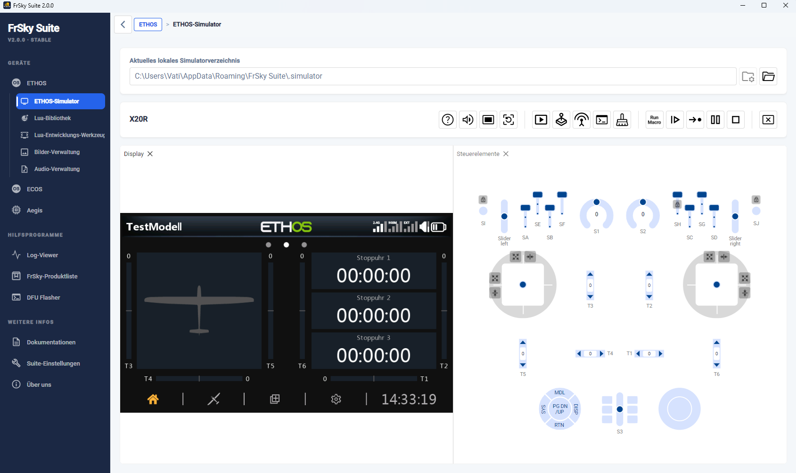

Im obigen Beispiel wurde der Wizard für neue Modelle abgeschlossen und das Modell „TestModel“ benannt.

Das „Display“-Panel auf der linken Seite bildet das LCD des Senders nach, während das „[Steuerelemente](operation.md)“-Panel die Hardware-Bedienelemente des gewählten Senders nachahmt.

Im oberen Bereich des Fensters wird das „aktuelle lokale Dateiverzeichnis“ angezeigt.

#### Empfohlene Konfiguration

Am besten ist es, die Konfiguration Ihres Senders im Simulator nachzubilden. Dadurch stehen Ihnen dieselben Funktionen wie am Sender zur Verfügung, sodass Sie Verbesserungen an Ihren Modellen einfach testen können, ohne Ihre Flug- oder Modellbauumgebung zu beeinträchtigen, bis alles wie geplant funktioniert.

Alternativ können Sie ein völlig neues Modell erstellen und testen – etwa auf der Grundlage einer Ihrer Vorlagen oder durch Klonen und anschließendes Anpassen eines bestehenden Modells. Diese Vorgehensweisen maximieren die Wiederverwendbarkeit, ohne dass ein Modell von Grund auf neu programmiert werden muss. Nach der Fertigstellung lässt sich die Modelldatei im .bin-Format aus dem Ordner „/models“ im Simulator-Verzeichnis in den Ordner „/models“ auf dem Sender kopieren – vorausgesetzt, der Simulator läuft nicht mit einer neueren Ethos-Firmware-Version.

Die empfohlenen Einrichtungsschritte sind:

1. Erstellen Sie ein Backup Ihres Senders mithilfe der [Sicherung- und Wiederherstellungsfunktion](operation.md) der Suite.

2. Es empfiehlt sich, zunächst den Wizard für neue Modelle für ein einfaches Modell zu durchlaufen. So lässt sich dieses Setup leichter finden und durch Ihr Sender-Backup ersetzen. Bitte beachten Sie hierzu den obigen Abschnitt „Einfaches Setup“.

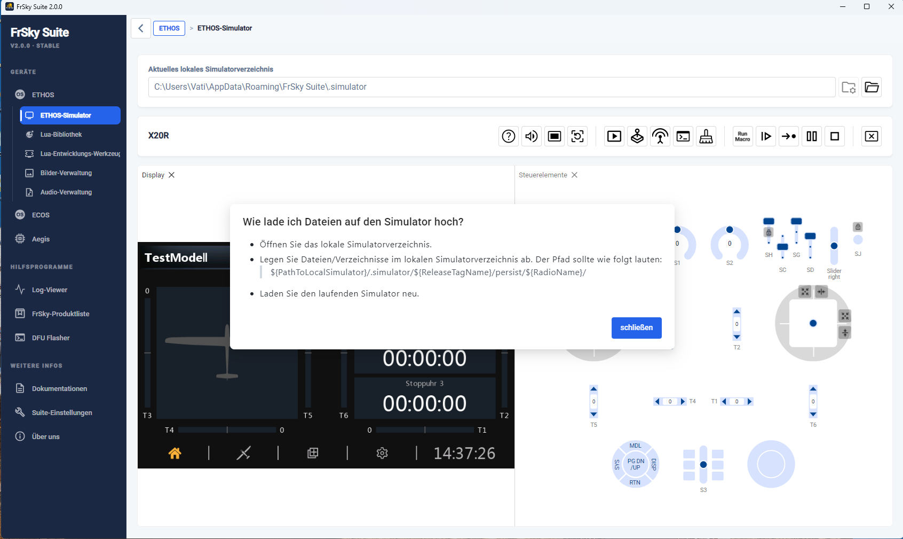

3. Ermitteln Sie den Dateipfad des Simulators, indem Sie auf das Hilfesymbol klicken . Das Pop-up-Hilfefenster erläutert die Dateipfadstruktur des Simulators (siehe oben).

Das „aktuelle lokale Simulatorverzeichnis“ wird ebenfalls oben im Fenster angezeigt.

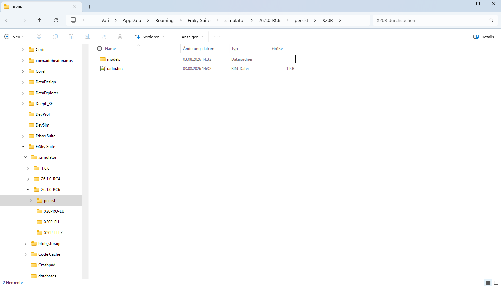

4. Suchen Sie mithilfe des Windows-Explorers den Ordner des gewählten Sendertys innerhalb der Dateipfadstruktur des Simulators und navigieren Sie dorthin. Eine Beispielstruktur ist oben dargestellt.

5. Wichtig: Schließen Sie die FrSky Suite, bevor Sie fortfahren.

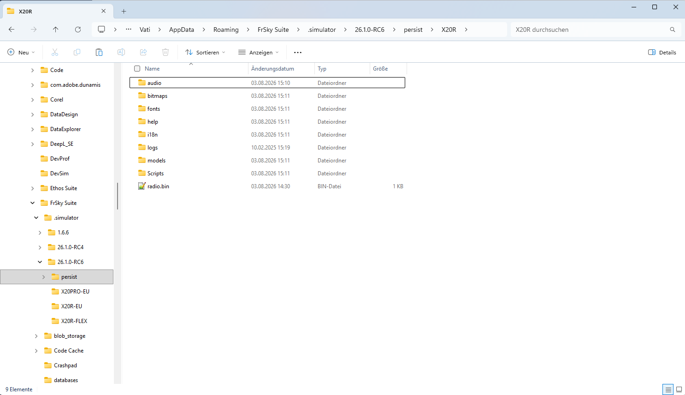

Ersetzen Sie im Ordner des ausgewählten Senders den vorhandenen Inhalt (d. h. den Ordner „models“ und die Datei „radio.bin“) durch Ihre Sicherung. (Wenn Sie den Ordner „models“ beibehalten, werden dessen Inhalte mit den Modellen aus Ihrer Sicherung zusammengeführt.) Oben sehen Sie eine Beispielstruktur, die Ihnen sehr bekannt vorkommen dürfte, da sie der Struktur Ihres Senders entspricht.

6. Starten Sie die FrSky Suite und den Simulator neu.

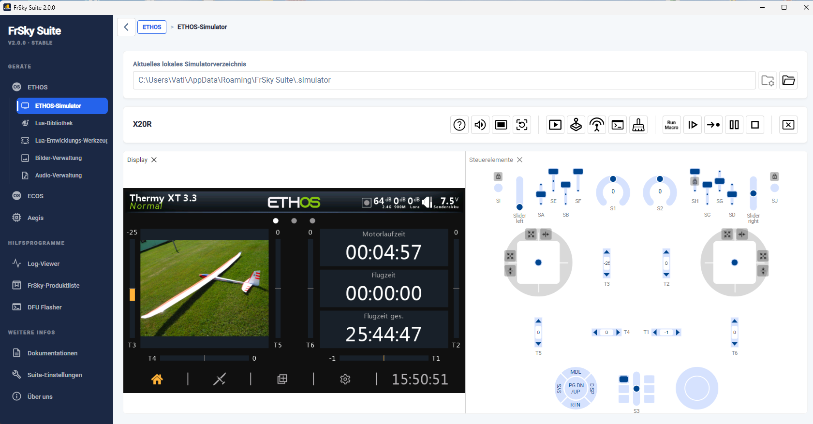

Es sollte mit dem Modell beginnen, das auf Ihrem Sender aktiv war, als Sie das Backup erstellt haben. In diesem Beispiel war eine Spitfire das aktive Modell.

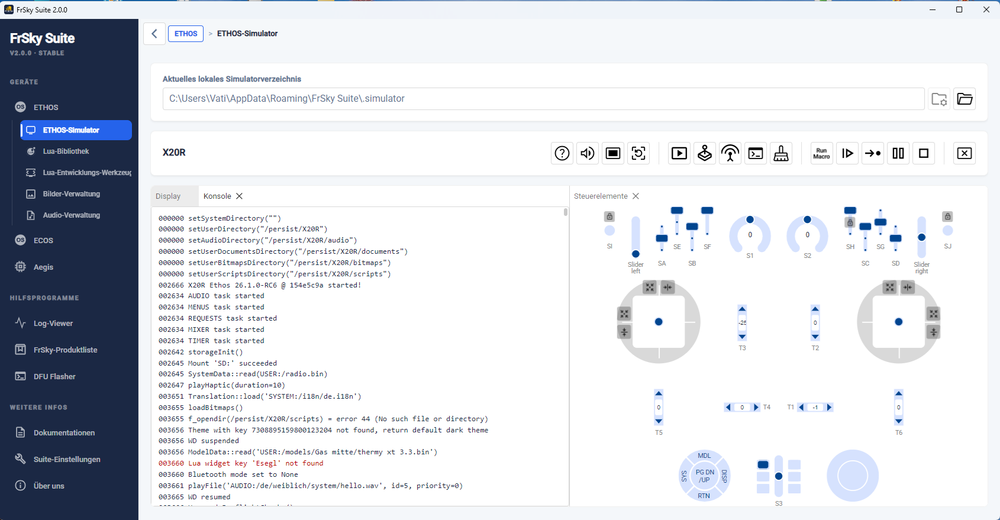

7. Öffnen Sie das Steuerelemente-Panel, indem Sie auf das Symbol „Steuerelemente-Panel öffnen“ klicken. Es öffnet sich neben dem Anzeige-Panel.

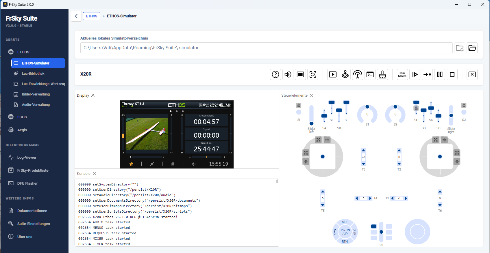

8. Ziehen Sie den Reiter des „Steuerelemente“-Bereichs nach unten an den unteren Rand des Suite-Fensters, bis ganz unten über beide Bereiche hinweg ein schmaler, schattierter Balken erscheint. Der „Steuerelemente“-Bereich sollte nun die untere Hälfte des Simulators einnehmen; dies erleichtert das Lesen längerer Zeilen im Protokoll, während die Bereiche „Display“ und „Steuerelemente“ weiterhin sichtbar bleiben. Die Steuerelemente sind hilfreich, um den Startvorgang des Simulators zu überprüfen sowie Ereignisse und Fehlermeldungen zu überwachen.

### Simulator-Taskleiste

Die Simulator-Taskleiste verfügt über die folgenden Steuerelemente:

##### General

	Hilfe

	Lautsprecher stumm schalten/aufheben

	Simulator neu laden

##### Steuerelemente

	Display-Panel öffnen (ahmt das LCD des Senders nach)

	Bedienfeld öffnen (ahmt die Steuerelemente des Senders nach)

	Öffnet das Konsolenfenster, das ein Textprotokoll der Simulatorausführung      ausgibt.

	Konsolenausgabe löschen

##### Makro-Steuerelemente

	Makro ausführen – Fragt nach dem Pfad zu Ihren Makros, listet anschließend alle gefundenen Makros auf und bietet an, eines oder mehrere davon auszuführen.

	Die Ausführung des geladenen Makros wird gestartet.

	Führt jeweils eine Zeile des Makros aus.

	Das Makro pausiert.

    Makroausführung beenden

##### Exit

	Schließt den Simulator.

#### Steuerelemente

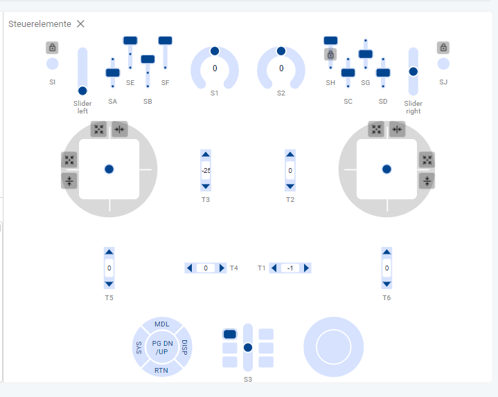

Das Bedienfeld „Steuerelemente“ bildet die Bedienelemente des gewählten Sendertyps nach.

##### Steruerknüppel

Die Knüppel lassen sich durch Ziehen mit der Maus bedienen. Beim Bedienen ist es hilfreich, die Bewegung der Knüppel einzuschränken oder zu begrenzen.

	Zentriert den Steuerknüppel automatisch auf einer oder beiden Achsen.

	Beschränkt den Steuerknüppel auf eine rein vertikale Bewegung.

	Beschränkt den Steuerknüppel auf eine rein horizontale Bewegung.

##### Tastschalter und Taster

	Durch das Anklicken dieses Symbols wird es markiert und der Taster wird in einen Taster mit Rastfunktion umgewandelt. Diese Funktion kann bei der Fehlersuche sehr hilfreich sein. Durch erneutes Anklicken dieses Symbols wird die Umwandlung rückgängig gemacht.

### Lua-Bibliothek

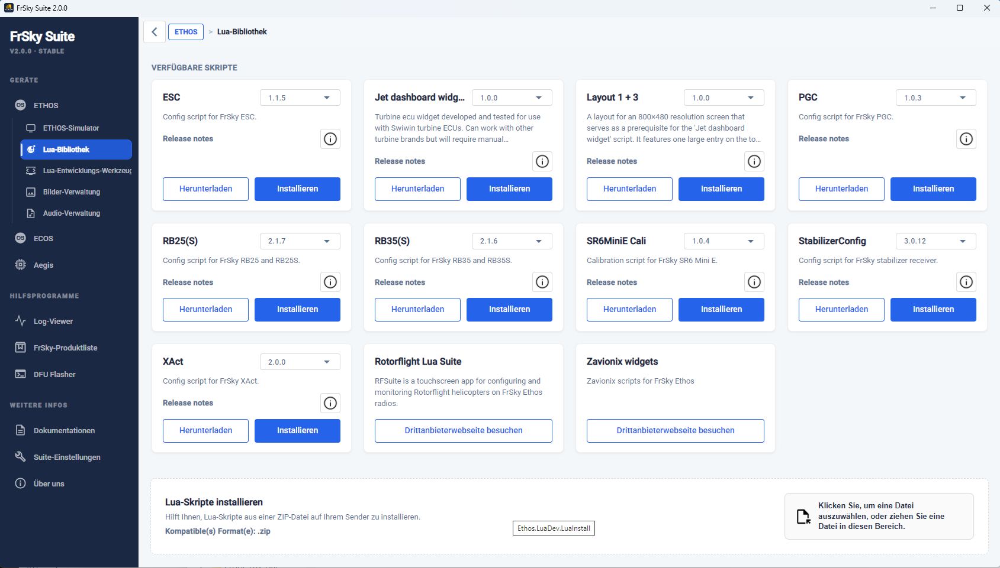

Es kann auch Lua-Skripte von einer lokalen ZIP-Datei auf Ihrem Sender installieren.

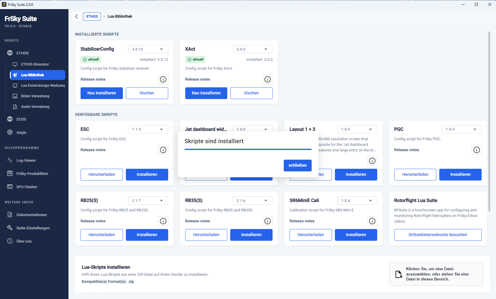

Sobald Sie einige Skripte auf dem Funkgerät installiert haben, zeigt das Lua-Bibliotheks-Tool die installierten Skripte im linken Bereich und die Remote-Bibliothek im rechten Bereich an.

### Lua-Entwicklungswerkzeuge

In diesem Bereich können Sie die Ethos-Lua-Dokumentation einsehen, auf Lua-Demo-Skripte zugreifen, ein Lua-Paket vorbereiten sowie ein Terminal für das Debugging nutzen.

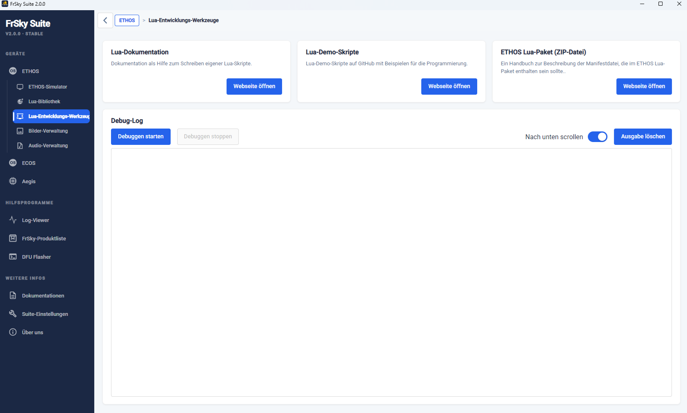

#### Lua-Dokumentation

Bietet einen Link zum Ethos-Lua-Referenzhandbuch.

Bitte beachten Sie auch den Thread  [FrSky - ETHOS Lua Script Programming](https://www.rcgroups.com/forums/showthread.php?4018791-FrSky-ETHOS-Lua-Script-Programming) auf rcgroups für weitere Informationen sowie Benutzer-Skripte und -Widgets.

#### Lua Demo Scripte

Diese Schaltfläche öffnet die Webseite der Ethos-Feedback-Community auf GitHub, auf der Links zu einigen Lua-Demo-Skripten mit Programmierbeispielen zu finden sind.

#### Ethos-Lua-Paket (ZIP-Datei

Diese Schaltfläche öffnet die Webseite, auf der beschrieben wird, wie ein ETHOS-Lua-Skript-ZIP-Paket erstellt wird, das vom Lua-Library-Installer korrekt erkannt und installiert werden kann.

#### Debug

Die Debug-Funktion stellt ein Debug-Protokollfenster zur Anzeige von Lua-Debug-Traces bereit, die an die USB-Seriell-Schnittstelle gesendet werden, während sich das Funkgerät im Serial-Modus befindet.

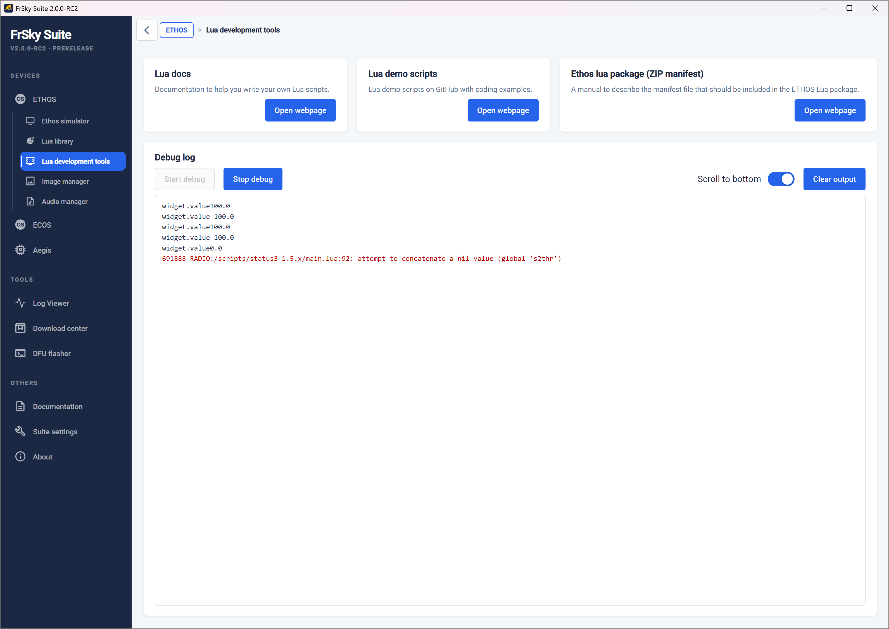

1. Zunächst verbinden Sie den Sender wie gewohnt mit der Suite.

2. Wechseln Sie in den Ethos-Modus. Sie können Ihr Lua-Skript nun direkt am Sender bearbeiten – unter Verwendung des Windows Explorers oder macOS Finders sowie Ihres bevorzugten Code-Editors.

3. Öffnen Sie den Reiter „Lua Entwicklungs-Werkzeug“.

4. Klicken Sie auf „Debuggen starten“; dadurch wird der Sender in den „Debug-Modus“ – also den seriellen Modus – versetzt.

5. Ihr Sender startet neu und initialisiert die Lua-Skripte erneut. Alle Textausgaben der in Ihrem Modell aktiven Lua-Skripte werden über den seriellen Modus an das integrierte Terminalfenster der Suite gesendet.

6. Wenn ein Problem oder ein Fehler festgestellt wurde, wird das Entwicklertool verwendet, um durch Klicken auf „Debuggen stoppen“ in den Ethos-Modus zurückzukehren.

7. Das Lua-Skript kann erneut bearbeitet werden.

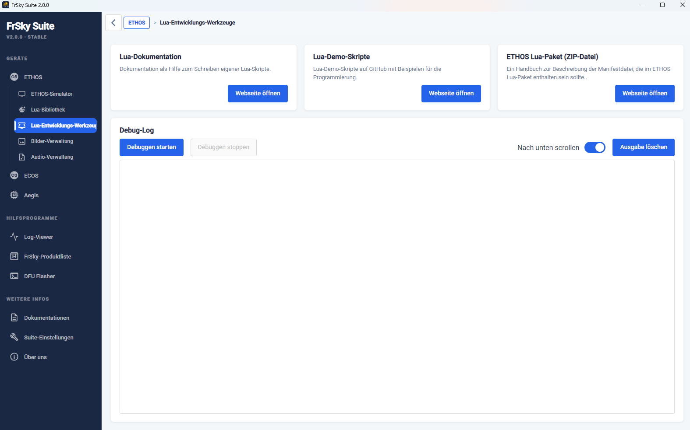

8. Der im obigen Beispiel aufgezeigte Fehler wurde behoben, und der ordnungsgemäße Betrieb ist bestätigt.

### Bilder-Verwaltung

In der Bilderverwaltung lässt sich ein Bild zuschneiden und in der Größe anpassen, bevor es in das Ethos-Format transkodiert wird.

Abmessungen:	Wie vom Benutzer festgelegt, wobei das Seitenverhältnis beibehalten werden kann.

Format:	32bit BMP

Farbraum:	RGB

Alpha Kanal:	Alpha wird nur bei Bedarf hinzugefügt, sofern die Option aktiviert ist.

Beachten Sie, dass Vollbild-Bilder für das X20 eine Auflösung von 800 x 480 Pixeln und für das X18 von 480 x 320 Pixeln haben.

Bitte beachten Sie den Abschnitt „[Bitmaps](../system-setup/file-manager.md)“ im Dateimanager bezüglich der Regeln für die Dateibenennung.

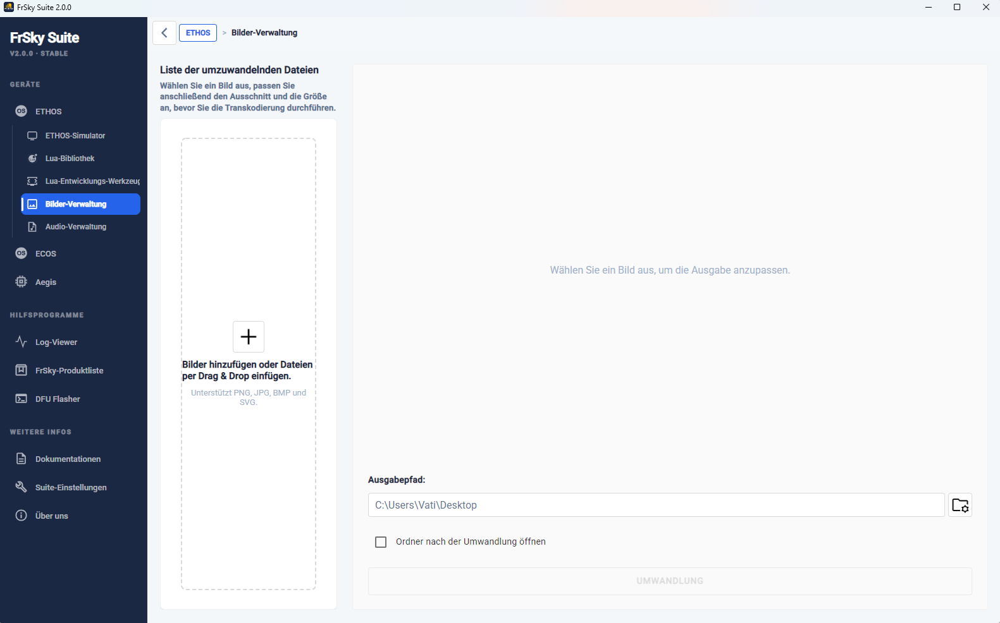

#### Liste der Bilder, welche umkodiert werden soll

Erstellen Sie im linken Bereich die Liste der zu umkodierten Bilder.  
  
Mit der Schaltfläche „Alle löschen“ wird die Liste geleert.

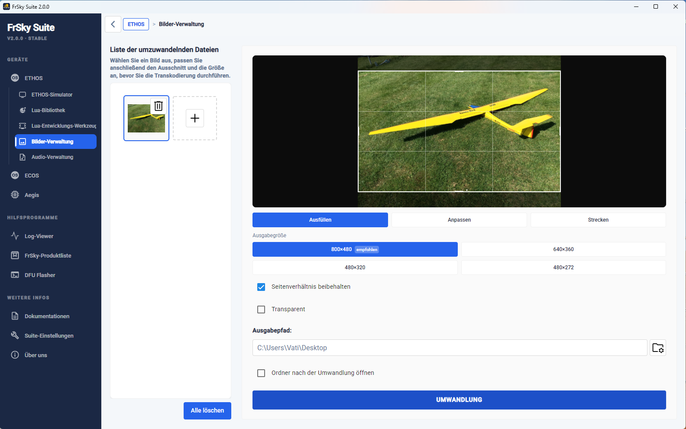

#### Auflösungseinstellungen

Geben Sie die gewünschte Bildgröße ein oder wählen Sie diese aus. Im Allgemeinen passt Ethos die Bildgröße automatisch an.

#### Transparent

Fügt aus Gründen der Transparenz nur dann einen Alpha-Kanal hinzu, wenn dieser noch nicht vorhanden ist.

#### Ordner für Umkodierte öffnen

Es besteht die Möglichkeit, das Verzeichnis (den Ordner) nach der Umkodierung zu öffnen.

#### Umkodieren

Der Bilder-Manager wandelt Bilder in die gewünschte Größe und unter Anwendung der gewählten Option (Ausfüllen/Einpassen/Strecken) um und speichert das bzw. die Bilder am gewählten Ausgabepfad.

Hinweis: Alle Änderungen, die oberhalb von „Ausgabepfad“ vorgenommen werden, beziehen sich auf das aktuell ausgewählte Bild. Selbst wenn Sie zu einem anderen Bild in der Liste auf der linken Seite wechseln und anschließend zurückkehren, bleiben diese Änderungen erhalten, bis das Bild umkodiert und exportiert wird.

###         Audio Verwaltung

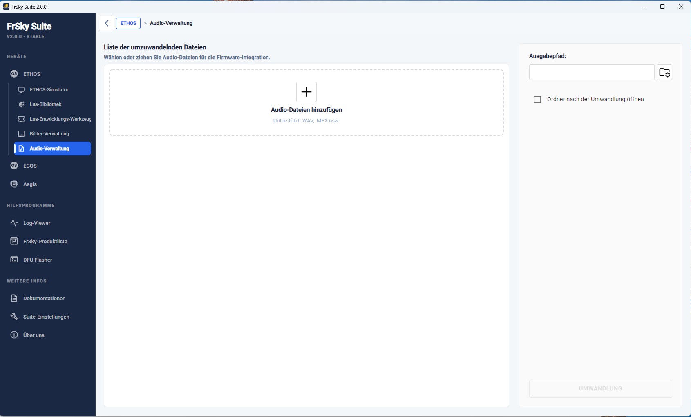

In der Audio-Verwaltung konvertiert Sie Ihre Audiodateien in das folgende Format:

Format:	PCM linear

Sample Rate:	32kHz

Audiokanäle:	1 (mono)

Bits pro Abtastwert:	16 Bit, Little-Endian (pcm\_s16le)

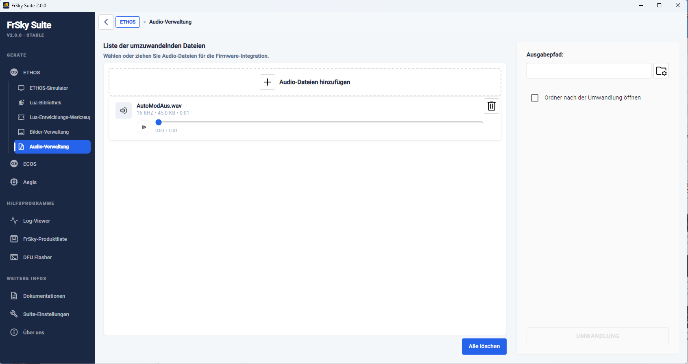

#### Zu transkodierende Liste

Erstellen Sie im linken Bereich die Liste der zu transkodierenden Audiodateien.

Die Schaltfläche „Alle löschen“ leert die Liste.

#### Ausgabepfad

Geben Sie den gewünschten Ausgabeordner ein oder navigieren Sie zu diesem.

#### Umkodieren

Der Audio-Manager wandelt Audiodateien in die gewünschte Größe um und speichert die Datei(en) am gewählten Ausgabepfad.

#### Optionen

Schließlich gibt es eine Option, das Verzeichnis (den Ordner) nach der Konvertierung zu öffnen.

### ECOS

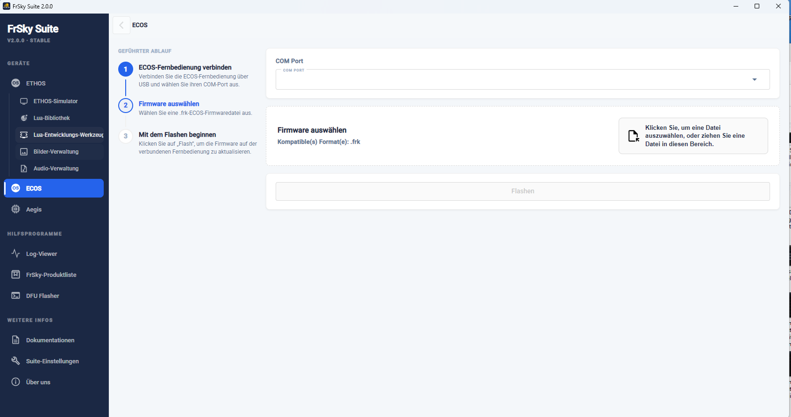

ECOS ist ein völlig neues, vereinfachtes Betriebssystem, das von FrSky entwickelt und mit dem Sender FrSky EX14 eingeführt wurde. Es handelt sich um eine schlanke Einsteigerversion, die auf dem ETHOS-Betriebssystem mit Farb-Touchscreen basiert und speziell für preiswerte Fernsteuerungen mit Schwarz-Weiß-Display entwickelt wurde – ideal für Einsteiger und Bildungsprogramme.

Laden Sie die Bedienungsanleitung des Senders aus dem Download-Bereich von frsky-rc.com herunter, um Informationen zum ECOS-System zu erhalten.

#### COM-Port

Verbinden Sie Ihr ECOS-Funkgerät mit einem USB-Kabel mit Ihrem PC. Wählen Sie den entsprechenden COM-Port aus. (Möglicherweise müssen Sie dies im Geräte-Manager überprüfen.)

#### Firmware auswählen

Laden Sie über den untenstehende „Download-Center“ das gewünschte Firmware-Update für Ihren ECOS-Sender herunter. Entpacken Sie die heruntergeladene Datei und ermitteln Sie die benötigte Version (EU, FCC oder SRRC). Wählen Sie die entsprechende Datei aus oder ziehen Sie sie in den dafür vorgesehenen Bereich auf der Seite.

#### Flashen

Nachdem Sie oben die COM-Port-Datei ausgewählt haben, klicken Sie auf „Flash“, um die Datei auf das Funkgerät zu schreiben.

### Aegis

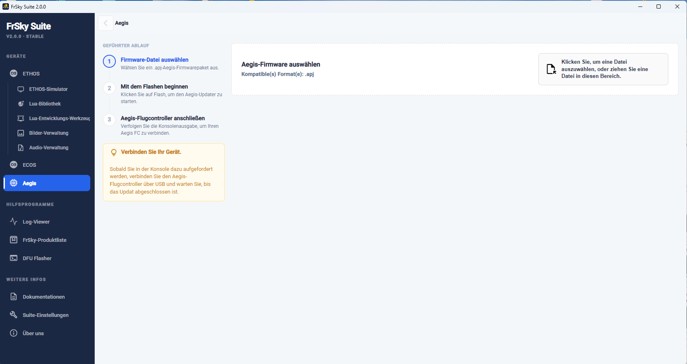

Aegis ist ein neuer Flight Controller von FrSky.  
  
Befolgen Sie die Anweisungen auf der Aegis-Seite, um den Flight Controller zu aktualisieren.

## Tools

### Log viewer

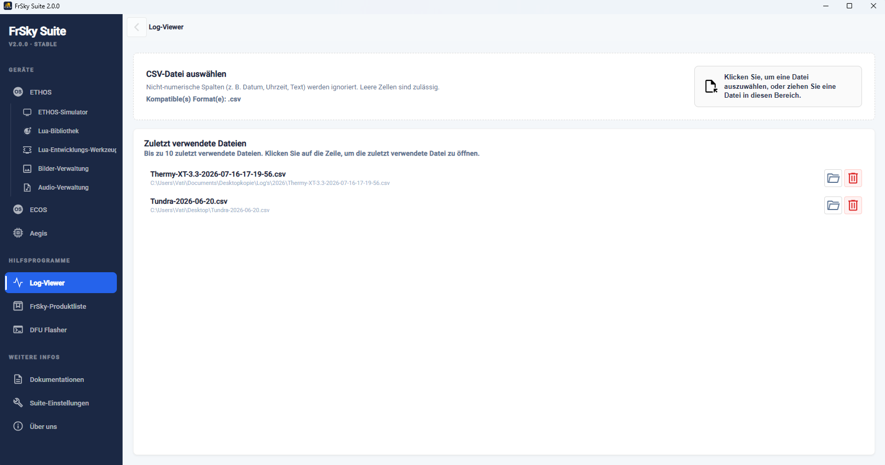

Der Log-Viewer dient zur Anzeige von Log-Dateien, die von Ethos erstellt werden, wenn die Spezialfunktion „Logs schreiben“ aktiviert ist.

#### CSV-Datei auswählen

Wählen Sie die anzuzeigende CSV-Protokolldatei aus.

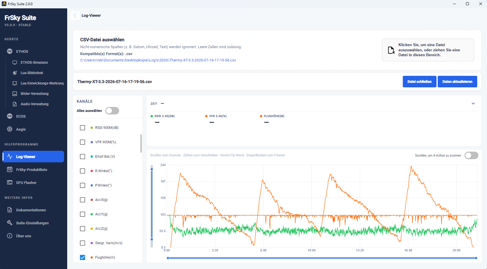

Das gesamte Protokoll wird geladen und angezeigt.

#### Kanäle

Wählen Sie auf der linken Seite die gewünschten Kanäle aus, die angezeigt werden sollen.

#### Anzeige

Mit diesen Bedienelementen können Sie den interessierenden Bereich fokussieren:

Scrollen, um die x-Achse (Zeit) zu zoomen

Strg + Scrollen, um die y-Achse zu zoomen (oder „Zoom-Richtung tauschen“ umschalten)

Klicken und ziehen, um das Diagramm zu verschieben

Mit dem Mauszeiger über einen Punkt fahren, um die jeweiligen Werte an dieser Stelle abzulesen (Doppelklick zum Fixieren)

#### Daten aktualisieren

Klicken Sie auf „Daten aktualisieren“, um die Datei neu zu laden. Dadurch wird auch der Cursor freigegeben, falls Sie ihn fixiert haben.

### FrSky Produktliste

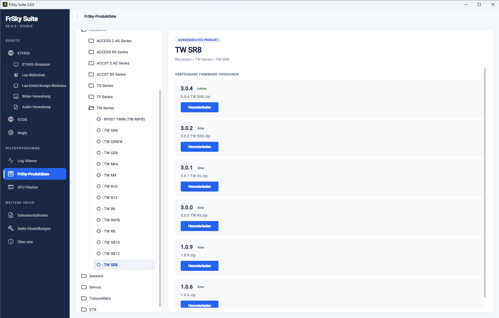

Wählen Sie in der Produktliste das zu flashende Gerät aus. Im obigen Beispiel wurde ein TW SR8-Empfänger ausgewählt. Das Download-Center listet daraufhin die verfügbaren „Assets“ (Versionen) auf.

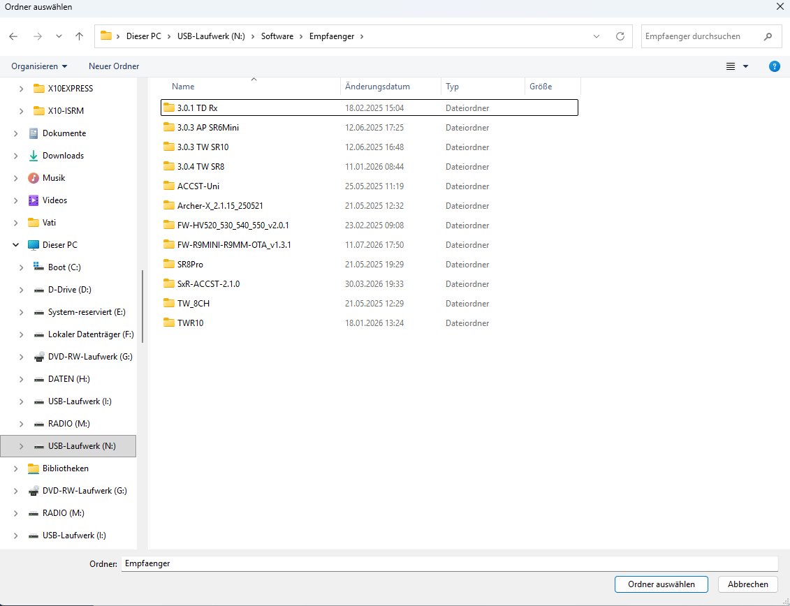

Wenn Sie auf die Schaltfläche „Herunterladen“ klicken, wird ein Suchfenster geöffnet, in dem Sie den Zielordner auswählen und die Datei herunterladen können.

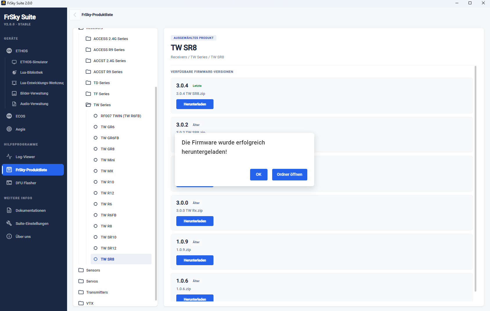

Die Datei wurde erfolgreich heruntergeladen.

### DFU Flasher

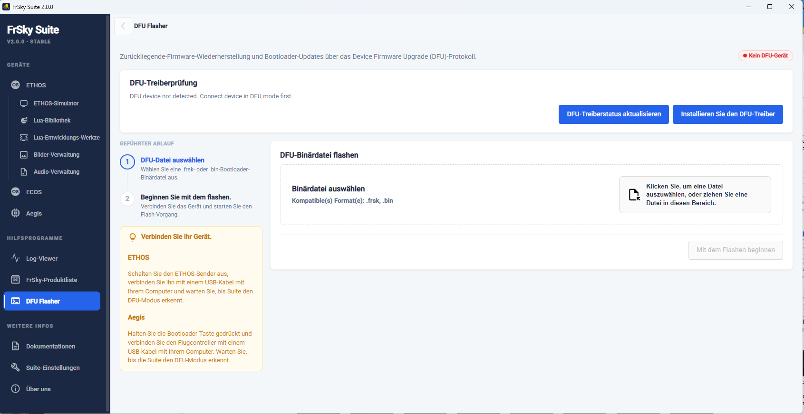

Klicken Sie auf den Reiter „DFU Flasher“.

Verbinden Sie Ihren **ausgeschaltete****n** Sender über ein USB-Kabel mit dem PC. Es sollte die grüne Meldung „DFU device connected“ (DFU-Gerät verbunden) erscheinen.  
Klicken Sie auf die Schaltfläche „Binärdatei auswählen“, um zu der heruntergeladenen Bootloader-Datei zu navigieren und diese auszuwählen. Die FrSky Suite prüft die ausgewählte Datei und zeigt deren Version sowie Eignung an.  
  
Klicken Sie auf die Schaltfläche „Start flashing“, um den ausgewählten Bootloader zu flashen. Nach Abschluss des Vorgangs wird der Erfolg gemeldet.

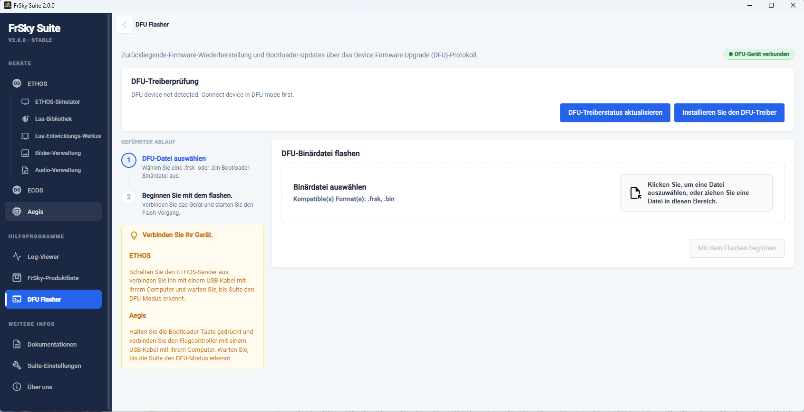

Bei der roten Fehlermeldung „No DFU device“ müssen Sie den korrekten DFU-Treiber installieren. Sie können die Schaltflächen „Refresh DFU driver status“ und „Install DFU driver“ verwenden, um einen DFU-Treiber zu installieren.

Auf den meisten PCs mit Windows 10 oder neueren Versionen verbinden sich die Tandem-Systeme über den Standard-USB-DFU-Treiber von Windows und sind bereit für das Flashen des Bootloaders. Allerdings ersetzen Windows-Updates Treiber häufig durch generische Treiber, die möglicherweise nicht mit dem USB-Modul funktionieren.

Überprüfen Sie im Geräte-Manager, ob Ihr DFU-Gerät (d. h. Ihr Sender) erkannt wird und funktioniert. Wenn FrSky Suite keinen DFU-Treiber installieren konnte, besteht eine andere Möglichkeit darin, zu prüfen, ob der Impulse Driver Fixer zur Korrektur des Treibers verwendet werden kann. Es kann heruntergeladen werden von [https://impulserc.com/pages/downloads](https://impulserc.com/pages/downloads). Weitere Informationen finden Sie auch in diesem Beitrag [Ethos Suite Update](https://www.rcgroups.com/forums/showpost.php?p=48919119&postcount=15884) zum Ethos-Suite-Update.

Hinweis für Horus-X10-Nutzer: Windows 10 installiert standardmäßig nicht den für Horus-Systeme erforderlichen USB-Treiber für den STM32-Bootloader. Dieser muss mithilfe eines Programms wie dem „Impulse Driver Fixer“ oder „Zadig“ installiert werden.

### Reparatur-Tool

Das Reparatur-Tool ist für die Sender X18/S, TW Lite, XE sowie X20 Pro/R/RS vorgesehen. Falls Ihr Sender nicht auf den NAND-Speicher zugreifen kann oder sich die Einstellungen nicht speichern lassen, formatiert dieses Tool den internen Speicher neu.

## Bereich „Weitere Infos“

### Dokumentation

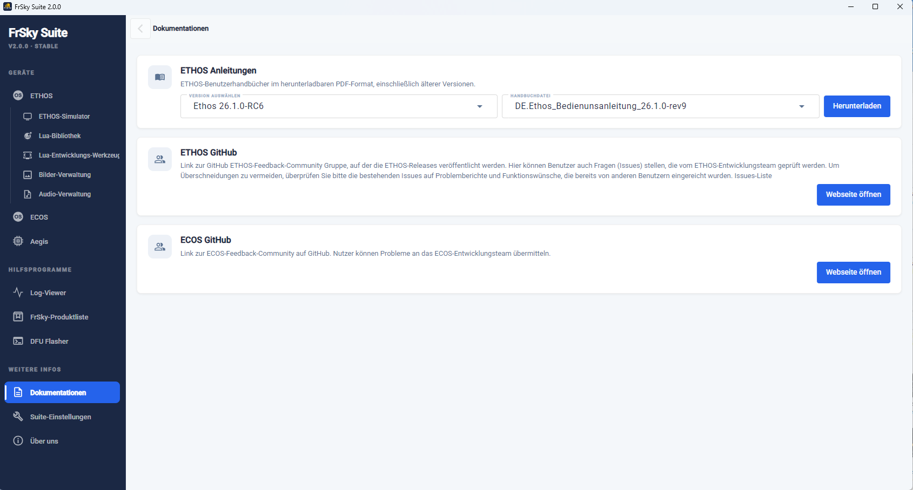

Der Dokumentationsbereich enthält Links zu den Ethos-Handbüchern und zur Ethos-Feedback-Community auf GitHub.

#### Ethos-Anleitungen

Das aktuelle Ethos-Handbuch kann hier heruntergeladen werden.

#### Ethos Github

Über die Schaltfläche gelangen Sie zur Webseite der Ethos-Feedback-Community auf GitHub; dort können Sie auf Ethos-Releases zugreifen oder ein Problem (Issue) melden, falls Sie einen Fehler gefunden haben. Bitte durchsuchen Sie jedoch die bereits vorhandenen Einträge, bevor Sie einen neuen Beitrag erstellen, um Doppelungen zu vermeiden.

#### Ecos Github

Über die Schaltfläche gelangen Sie zur Webseite der Ecos-Feedback-Community auf GitHub; dort können Sie auf Ecos-Releases zugreifen oder ein Problem (Issue) melden, falls Sie einen Fehler gefunden haben. Bitte durchsuchen Sie jedoch die bereits vorhandenen Einträge, bevor Sie einen neuen Beitrag erstellen, um Doppelungen zu vermeiden.

### Suite-Einstellungen

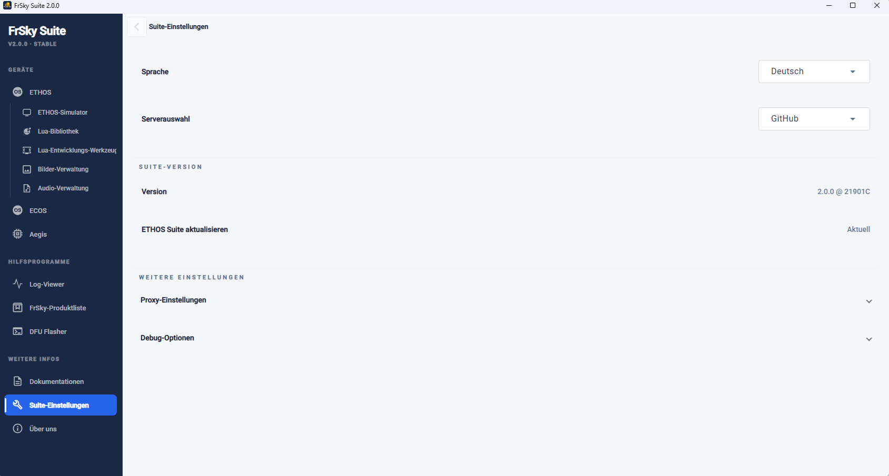

##### Sprache

Als Sprache für die Suite kann zwischen Tschechisch, Deutsch, Englisch, Spanisch, Französisch, Hebräisch, Italienisch, Niederländisch, Norwegisch, Portugiesisch, Slowenisch und Chinesisch gewählt werden.

##### Serverstandort

Als Serverstandort kann entweder GitHub oder der FrSky-Server gewählt werden. Für die Suite-Version v1.6.0 wurde der Server (ausnahmsweise) auf den FrSky-Server zurückgesetzt. Änderungen werden nach der Bearbeitung gespeichert.

#### Suite-Version

##### Version

The current Suite version is displayed.

##### ETHOS Suite aktualisieren

Es wird „Aktuell“ angezeigt, wenn der aktuelle Stand vorliegt; andernfalls klicken Sie auf die Schaltfläche, um nach Updates für die Suite zu suchen.

#### Weitere Einstellungen

##### Proxy

Proxy-Einstellungen können hier aktualisiert werden.

##### Debug-Optionen

- Ein Popup-Dialog bei Auftreten eines schwerwiegenden Fehlers kann aktiviert oder deaktiviert werden.
- Der Suite-Debug-Modus protokolliert alle Spuren (nicht nur die Abstürze) in der Suite.
- Öffnen Sie den Ordner „logs“, um die Absturzprotokolle zu überprüfen.

### Über uns

Zeigt die Versions- und Copyright-Informationen an.
