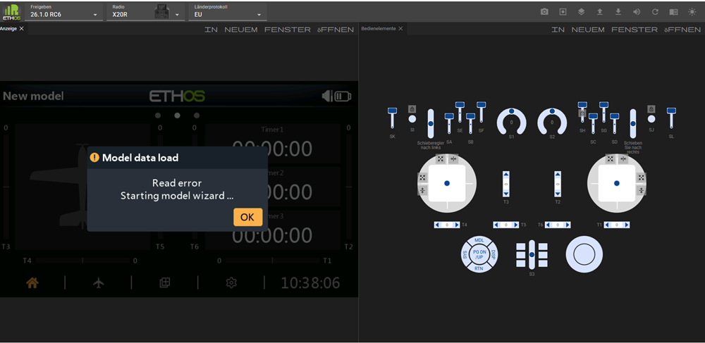
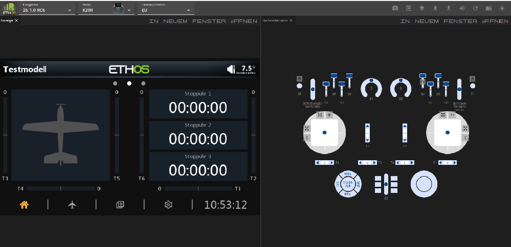
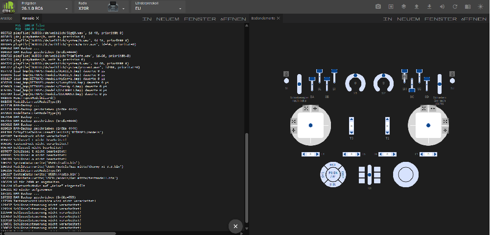
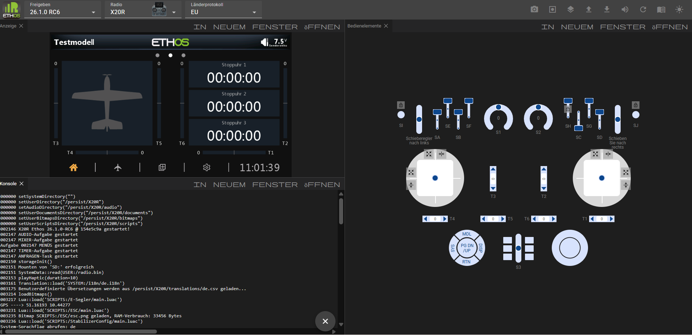
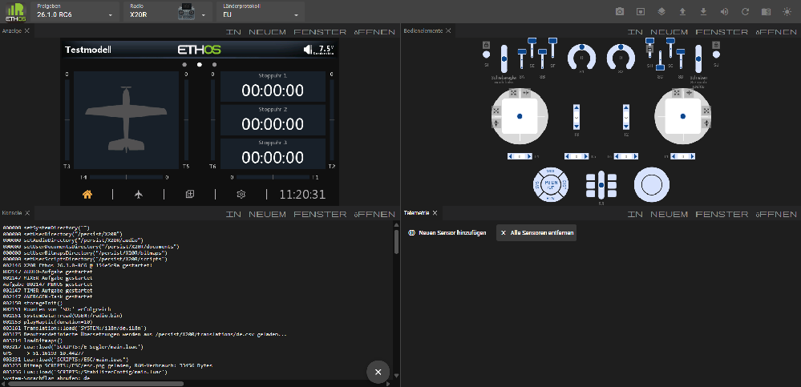
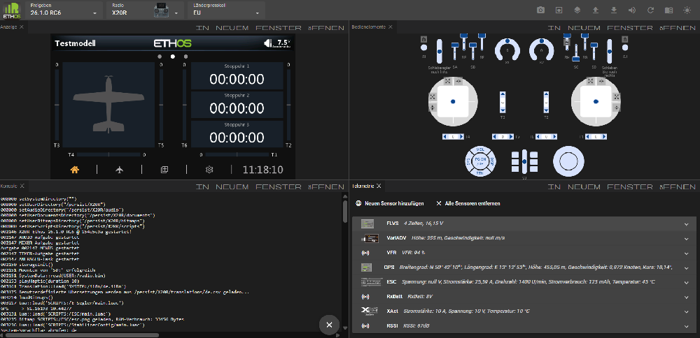
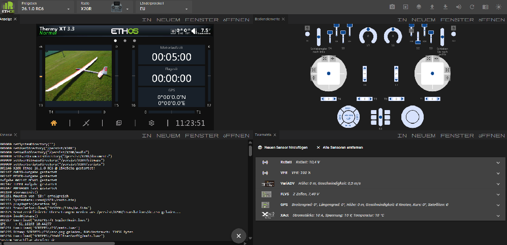
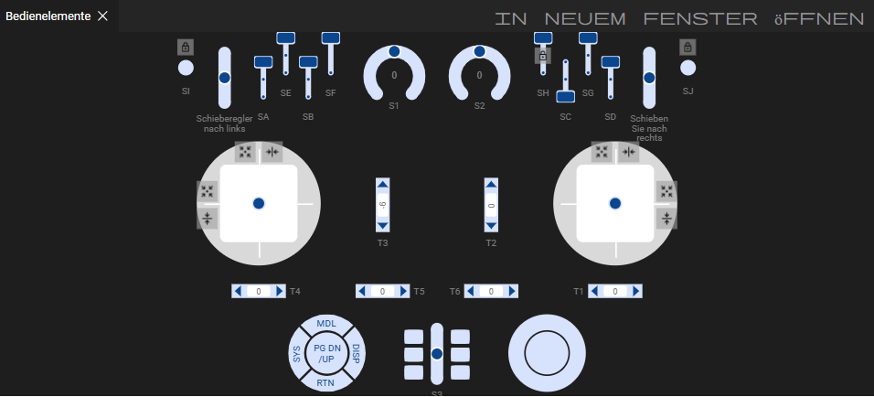

# Ethos Web Simulator

Der Ethos-Websimulator basiert auf WebAssembly (kurz Wasm) – einer portablen Lösung, die den Einsatz im Web ermöglicht. Das bedeutet, dass er direkt im Browser läuft und keine Installation auf dem PC erfordert. Als Browser wird Chrome empfohlen.

Mit dem Ethos-Web-Simulator können Sie die Funktionen des Senders erkunden sowie Funktionalitäten oder geplante Modellerweiterungen testen, ohne den eigentlichen Sender zur Hand zu haben. Zudem können Sie ganz einfach neue Versionen ausprobieren, bevor Sie Ihren Sender aktualisieren.

Der Websimulator ist unter folgender Adresse zu finden: [https://ethos-simulator.frsky-rc.com/](https://ethos-simulator.frsky-rc.com/)

Die standardmäßigen Voreinstellungen sind das Release 26.1.0-RC6 (zum Zeitpunkt der Erstellung dieses Textes), der Sender X20 Pro und das FCC-Protokoll. Wählen Sie zunächst die Anzeigesprache aus.

Beim ersten Laden werden keine gültigen Modelldaten gefunden; daher wird der Wizard für neue Modelle gestartet.

Schließen Sie den Wizard ab, um ein grundlegendes Testmodell zu konfigurieren.

Wenn die Standard-Release-Version und der Sender nicht den gewünschten Einstellungen entsprechen, wählen Sie die gewünschte Ethos-Release-Version, den zu simulierenden Sendertyp sowie das HF-Protokoll aus.

Klicken Sie auf das Panels-Symbol in der oberen Menüleiste und wählen Sie die Konsole aus.

Die Konsole erscheint neben dem Anzeigebereich.

Klicken Sie auf die Titelleiste der Konsole und ziehen Sie sie nach unten. Bewegen Sie die Maus, bis die Konsole den unteren linken Quadranten einnimmt.

Die Konsole ist nützlich, um die Startsequenz des Simulators zu bestätigen sowie Ereignisse und Fehlermeldungen zu überwachen.

Klicken Sie erneut auf das Symbol „Bereiche“ und wiederholen Sie den Vorgang für den Bereich „Telemetrie“, indem Sie ihn in den unteren rechten Quadranten verschieben.

Klicken Sie im Telemetrie-Bereich wiederholt auf „Neuen Sensor hinzufügen“ und fügen Sie die Sensoren hinzu, auf die Sie in Ihren Simulationen zugreifen möchten.

Um Ihre Sensoren für zukünftige Sitzungen zu speichern, klicken Sie auf das Symbol  und wählen Sie „Telemetrieeinstellungen speichern“. Die Telemetrieeinstellungen werden in einer Datei namens „telemetry.json“ in Ihrem Download-Ordner gespeichert. Verschieben Sie diese Datei an einen geeigneten Speicherort. Klicken Sie in nachfolgenden Simulatorsitzungen auf das Symbol „Hochladen“ und wählen Sie „JSON-Telemetriedatei hochladen“. Navigieren Sie anschließend zu Ihrer gespeicherten Datei „telemetry.json“.

Sie können nun mit der Simulation beginnen. Der Browser merkt sich Ihre Panel-Anordnung, sodass Sie diese nicht immer wieder neu einrichten müssen.

### Empfohlene Konfiguration

Am besten ist es, die Konfiguration Ihres Senders im Simulator nachzubilden. Dadurch stehen Ihnen dieselben Funktionen wie am Sender zur Verfügung, sodass Sie Verbesserungen an Ihren Modellen einfach testen können, ohne Ihre Flug- oder Modellbauumgebung zu beeinträchtigen, bis alles wie geplant funktioniert.

Die empfohlenen Einrichtungsschritte sind:

1. Erstellen Sie ein Backup Ihres Radios mithilfe der [Sicherungs- und Wiederherstellungsfunktion](operation.md) der Suite.

2. Wählen Sie im Menü „Upload“ die Option „Upload a radio backup“ aus und navigieren Sie zu Ihrer gespeicherten Backup-Datei. (Siehe die untenstehenden Menüs.)

3. Es sollte mit dem Modell beginnen, das auf Ihrem Sender aktiv war, als Sie das Backup erstellt haben. In diesem Beispiel war ein Thermy XT 3.3-Segelflugzeug das aktive Modell.

In Ihrer gewohnten Senderumgebung können Sie nun ein völlig neues Modell erstellen und testen – etwa indem Sie auf einer Ihrer Vorlagen aufbauen oder ein bestehendes Modell klonen und anpassen. Diese Vorgehensweisen maximieren die Wiederverwendbarkeit, ohne dass Sie ein Modell von Grund auf neu programmieren müssen. Sobald das Modell fertiggestellt ist, nutzen Sie die Option „Modelldatei herunterladen“, um die .bin-Datei in Ihren Download-Ordner zu speichern. Kopieren Sie diese anschließend auf Ihren Sender.

### Simulator-Taskleiste

Die Taskleiste des Simulators verfügt über die folgenden Bedienelemente:

	Screenshot (werden im Ordner Download gespeichert)

	Aufnahme starten (zeichnet ein Makro auf)

	Bereiche (listet Bereiche auf, die noch nicht geöffnet wurden)

	Hochladen… (siehe Menü unten)

	Download ... (siehe Menü unten)

	Audio ein/aus

	Simulator neu starten

	Dokumentation (enthält einen Link zum aktuellen Handbuch)

	Hintergrundmodus hell/dunkel

##### Upload-Menü

	Laden Sie eine Modelldatei (.bin) in den Simulator.

	Laden Sie ein Sender-Backup (.bin) in den Simulator

	Laden Sie ein Audiopaket (.zip) in den Simulator.

	Laden Sie ein Lua-Plugin (.zip) in den Simulator.

	Laden Sie eine CSV-Übersetzungsdatei (.csv) in den Simulator.

	Laden Sie eine JSON-Telemetriedatei (.json) in den Simulator.

	Makro starten (.zip)

##### Download-Menü

	Speichern Sie die aktuelle Modelldatei (.bin).

	Aktuelles Modell bearbeiten

	Bearbeiten Sie die aktuelle Modelldatei (JSON)

	Screenshot speichern (Zielordner auswählen, als .png speichern)

	Sender-Backup speichern (.zip)

	Telemetrieeinstellungen speichern (.json)

##### Bedienelementefeld

Das Bedienelementefeld „Bedienelemente“ bildet die Bedienelemente des gewählten Senders nach.

###### Steuerknüppel

Die Steuerknüppel lassen sich durch Ziehen mit der Maus bedienen. Beim Bedienen ist es hilfreich, die Bewegung der Knüppel einzuschränken oder zu begrenzen.

	Zentriert den Steuerknüppel automatisch auf einer oder beiden Achsen.

	Beschränkt den Steuerknüppel auf eine rein vertikale Bewegung.

	Beschränkt den Steuerknüppel auf eine rein horizontale Bewegung.

###### Tastschalter und Taster

	Durch das Anklicken dieses Symbols wird es markiert und der Taster wird in einen Taster mit Rastfunktion umgewandelt. Diese Funktion kann bei der Fehlersuche sehr hilfreich sein. Durch erneutes Anklicken dieses Symbols wird die Umwandlung rückgängig gemacht.

**Beachte:** auch nach einen Neustart bleibt die Umwandlung in einen Taster mit Rastfunktion erhalten.
