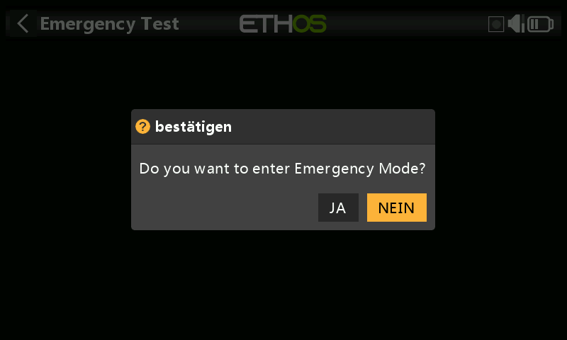
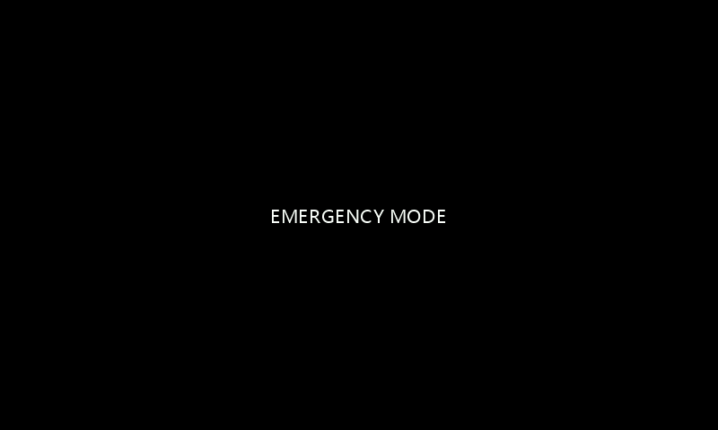

# Notfall-Modus (Emergency Mode)

Der Notfallmodus ist die Reaktion des Senders auf ein unerwartetes Ereignis wie das Zurücksetzen des Watchdogs. Der Watchdog ist ein Zeitgeber, der von verschiedenen Teilen von Ethos ständig neu gestartet wird. Wenn ein Fehler jeglicher Art verhindert, dass der Watchdog-Timer neu gestartet werden kann, läuft die Zeit ab und führt zu einem Hardware-Reset des Senders. In diesem Notfallmodus startet der Sender extrem schnell neu, ohne die normalen Startprüfungen, damit Sie so schnell wie möglich wieder die Kontrolle über Ihr Modell erhalten. Auf die SD-Karte oder eMMC wird im Notfallmodus nicht zugegriffen.

Im Notfallmodus stehen nur die wesentlichen Funktionen zur Steuerung Ihres Modells zur Verfügung, jedoch keine der übergeordneten Funktionen. Der Bildschirm wird leer und zeigt die Worte 'EMERGENCY MODE' an, begleitet von einem 300ms langen Piepton, der sich alle 3 Sekunden wiederholt. Sprachalarme, Skripte, Protokollierung usw. werden nicht mehr ausgeführt. Wenn der Notfallmodus eintritt, sollten Sie natürlich so schnell wie möglich landen.

Die häufigste Ursache für den Notfallmodus ist ein Ausfall der SD-Karte.

## Test des Notfallmodus

In einigen Fällen kann es für die Benutzer hilfreich sein, den Notfallmodus testen zu können.

Zum Testen des Notfallmodus kann ein Systemtool hinzugefügt werden. Tippen Sie auf das Symbol Notfalltest, um den Test zu starten.

In diesem Dialogfeld werden Sie um Bestätigung gebeten, um fortzufahren.

Der Sender wechselt in den Notfallmodus.
