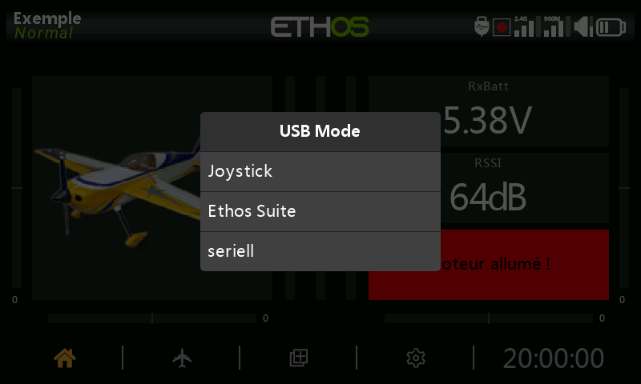

# Modi für USB-Verbindung zum PC

## Modus „Ausgeschaltet“

- Schließen Sie den Sender im ausgeschalteten Zustand über ein USB-Kabel an einen PC an, um den Bootloader im DFU-Modus zu flashen.

## Bootloader-Modus

- Der Sender wird in den Bootloader-Modus versetzt, indem es mit gedrückter Eingabetaste eingeschaltet wird. Die Statusmeldung „Bootloader“ wird auf dem Bildschirm angezeigt.
- Der Sender kann dann über ein USB-Datenkabel an einen PC angeschlossen werden. Die Statusmeldung ändert sich in 'USB connected' und der PC sollte zwei angeschlossene externe Laufwerke anzeigen. Das erste ist für den Flash-Speicher des Senders, das zweite ist der Inhalt der SD-Karte oder eMMC.
- Dieser Modus wird zum Lesen und Schreiben von Dateien auf die SD-Karte oder eMMC und/oder den Flash-Speicher des Senders verwendet.
- Dieser Modus kann auch verwendet werden, um eine Verbindung zur Ethos Suite herzustellen, um den Sender zu aktualisieren. Siehe [Bootloader-Modus](#Lesezeichen 5) im Abschnitt Ethos Suite.

## Modus „Eingeschaltet“

- Wenn das Funkgerät im eingeschalteten Zustand über ein USB-Datenkabel mit einem PC verbunden ist, wird der folgende Optionsdialog angezeigt:

- Im Joystick-Modus kann der Sender für die Steuerung von RC-Simulatoren konfiguriert werden.
- Im Ethos Suite Modus wechselt der Sender in den 'Ethos Modus' für die Kommunikation mit Ethos Suite. Bitte lesen Sie den Abschnitt [Ethos-Modus](#Lesezeichen 6) im Abschnitt Ethos Suite.

- Im seriellen Modus werden LUA-Fehlersuch-Spuren an USB-Serial gesendet, falls vorhanden. Die Registerkarte „LUA Development Tools“ in der Ethos Suite verfügt über ein integriertes Terminalfenster zur Anzeige der Fehler. Die Baudrate beträgt 115200bps. Ein geeigneter Windows Virtual COM Port Treiber kann [hier](https://www.st.com/en/development-tools/stsw-stm32102.html) gefunden werden.
