# Benutzeroberfläche und Navigation

Ethos lässt sich vollständig mit dem rechten **Drehwähler** bedienen (drehen,
um die Markierung zu bewegen, drücken für `ENT`) sowie mit der Taste `RTN`,
um ein Menü wieder zu verlassen — der Touchscreen ist, sofern vorhanden,
lediglich eine Abkürzung für dieselben Aktionen und keine eigenständige
Bedienweise. `MDL`, `DISP` und `SYS` führen direkt zu Model Setup, Einstellung
Ansichten bzw. System Setup (dieselben drei Kacheln wie in der unteren Leiste);
durch langes Drücken der `RTN`-Taste kehren Sie aus jedem Untermenü direkt zum
Startbildschirm zurück.

## Reset Menü

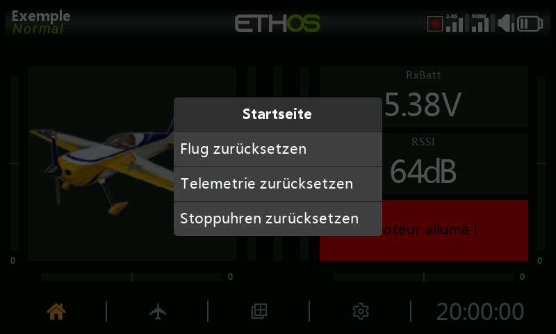

Durch langes Drücken der `ENT`-Taste auf dem Startbildschirm wird ein
Rücksetzmenü aufgerufen:

- **Flug zurücksetzen** — setzt die Telemetrie, die Timer und die
  Funktionsschalter zurück und führt anschließend die
  Vorflug-[Checkliste](../model-setup/checklist.md) erneut aus.
- **Telemetrie zurücksetzen** — setzt nur die Telemetriedaten zurück.
- **Stoppuhren zurücksetzen** — setzt nur die Stoppuhren zurück.
- **Touchscreen sperren** — ebenfalls erreichbar, indem Sie im Startbildschirm
  `ENT` und `PAGE` gleichzeitig 1 Sekunde lang drücken, oder als Auslöser einer
  [Spezialfunktion](../model-setup/special-functions.md).

## Bearbeitung von Steuerelementen

**Funktionselemente hinzufügen** — eine Stoppuhr, ein Logischer Schalter, eine
Spezialfunktion, eine Kurve oder eine Variable wird durch Antippen der
Schaltfläche **+** neben den Spaltenüberschriften im jeweiligen Menü erstellt.
Bei einem Sender ohne Touchscreen markieren Sie ein vorhandenes Element,
drücken `ENT` und wählen im Menü **Hinzufügen** — dieselbe Möglichkeit steht
auch bei Sendern mit Touchscreen zur Verfügung.

### Virtuelle Tastatur

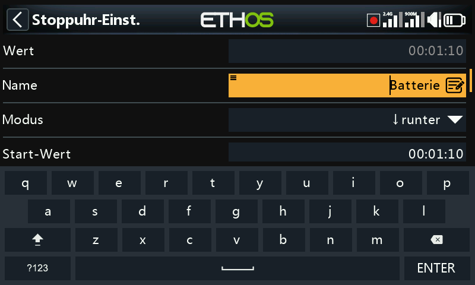

Beim Berühren eines Textfeldes (oder Drücken von `ENT` darauf) öffnet sich die
Bildschirmtastatur. Die Rücktaste löscht links vom Cursor; `PAGE` löscht nach
rechts und, sobald der Cursor das Textende erreicht hat, weiter von links.
Ein Berühren des Feldes selbst setzt den Cursor an diese Position — oder
verwenden Sie `SYS`/`DISP`, um ihn ohne Touchscreen nach links/rechts zu
bewegen. Die Taste **?123**/**abc** schaltet auf das numerische Tastenfeld um
(das auch Sonderzeichen enthält):

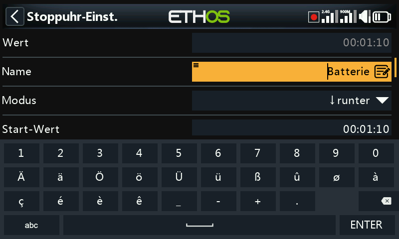

Bei einem **Sender ohne Touchscreen** wechselt ein Druck auf `ENT` in einem
Textfeld direkt in den Bearbeitungsmodus: Drehen Sie den Drehwähler, um durch
Kleinbuchstaben, Großbuchstaben, Ziffern und schließlich Sonderzeichen zu
blättern, und drücken Sie `ENT`, um das jeweilige Zeichen einzufügen. `MDL`
schaltet die Groß-/Kleinschreibung des Zeichens unmittelbar rechts vom Cursor
um (und jedes danach eingegebene Zeichen behält diese Schreibweise, bis erneut
umgeschaltet wird). `PAGE` löscht rechts vom Cursor; `SYS`/`DISP` bewegen ihn
nach links/rechts.

## Zahlenwerte ändern

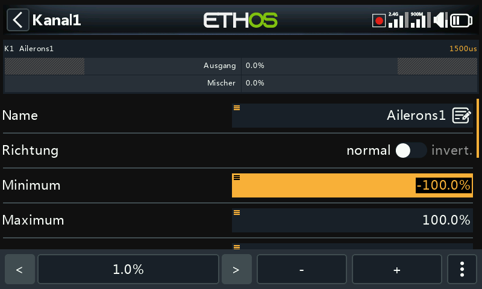

Beim Berühren eines numerischen Feldes öffnet sich am unteren Bildschirmrand
eine Bedienleiste: **`<`**/**`>`** ändern die Schrittweite (im Wechsel zwischen
den Dekaden — z. B. 0,01/0,1/1,0/10,0), **`-`**/**`+`** (oder der Drehwähler)
verändern den Wert um diese Schrittweite, und **Mehr** öffnet weitere Optionen:

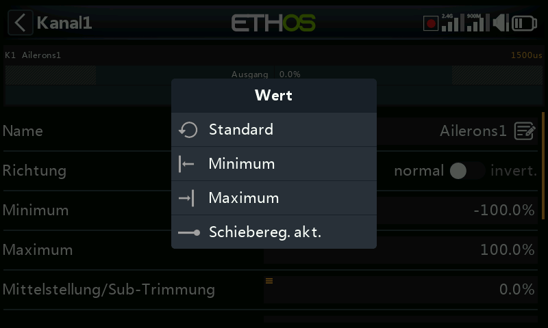

- Zum Standardwert des Feldes springen
- Auf Minimum / auf Maximum setzen
- Die Schrittsteuerung durch einen **Schieberegler** ersetzen

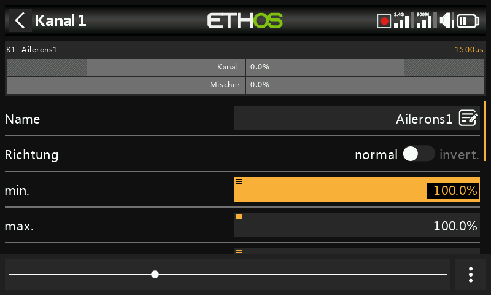

Der Schieberegler (ebenfalls mit dem Drehwähler verstellbar) ist bei groben
Änderungen schneller; **Schieberegler deaktivieren** kehrt zur Schrittsteuerung
zurück. Telemetrie-Bereichswerte werden auf dieselbe Weise bearbeitet:

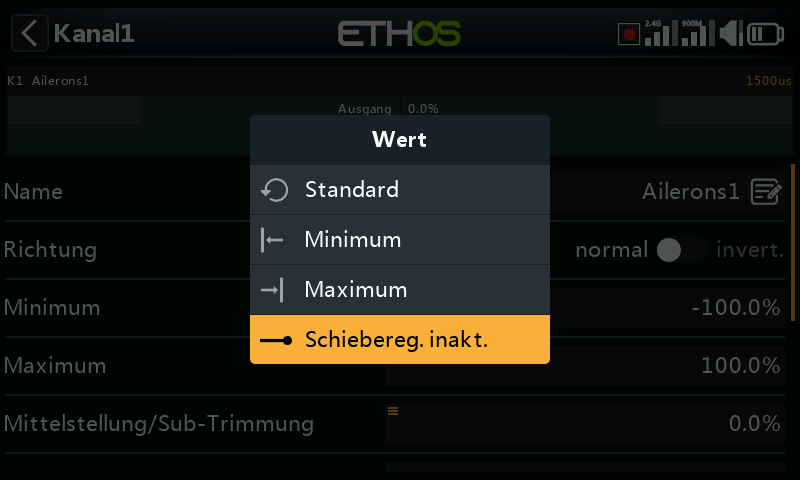

## Funktion Optionen {: #the-options-feature }

Nahezu überall dort, wo ein Wert oder eine [Quelle](#choosing-a-source)
erwartet wird, öffnet ein langer Druck auf `ENT` einen Dialog **Optionen** —
das kleine Menüsymbol („Hamburger“) in der oberen linken Ecke eines Feldes
zeigt an, dass diese Funktion verfügbar ist.

### Wertoptionen

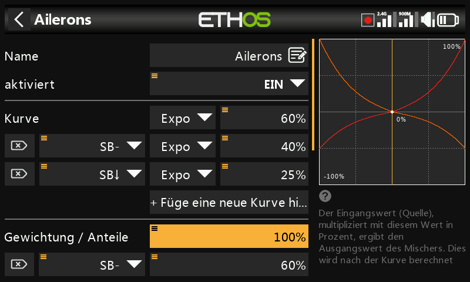

Der Dialog mit den Wertoptionen benennt den zu bearbeitenden Parameter und
bietet die Wahl zwischen einem festen Minimum/Maximum und der Steuerung über
eine **Quelle** (z. B. ein Poti, um den Wert im Flug zu verändern). Verwendet
das Feld bereits eine Quelle, bietet derselbe lange Druck stattdessen an, den
aktuellen Wert dieser Quelle in einen festen Wert umzuwandeln:

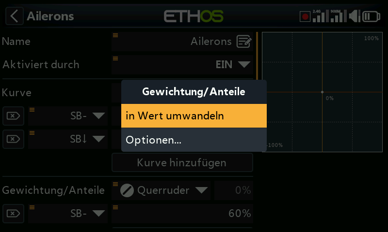

### Eine Quelle auswählen {: #choosing-a-source }

Die Auswahl von **Quelle wählen** öffnet eine zweispaltige Auswahlliste —
zuerst eine **Kategorie** (Analoggeber, Schalter, Logische Schalter,
Trimmungen, Kanäle, eine Gyro-Achse, ein Trainer-Kanal, eine Stoppuhr, ein
Telemetriesensor oder einige Sonderwerte), danach das konkrete Element daraus:

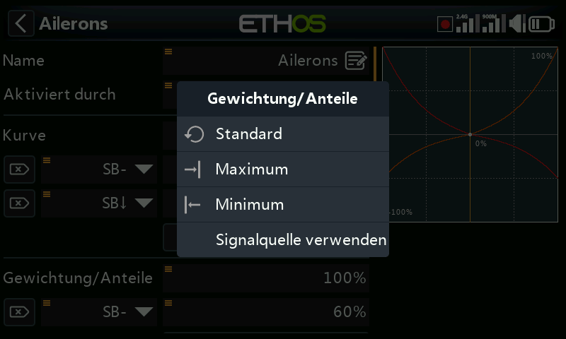

Sobald eine Quelle festgelegt ist, öffnet derselbe lange Druck Optionen, die
sich nach der Art der Quelle richten:

**Jede Quelle** —

- **Invertieren** — negiert die Quelle (z. B. aktiv, wenn ein Schalter *nicht*
  oben ist, statt wenn er oben ist).
- **Flanke** — löst einmalig bei einem Übergang aus (falsch→wahr oder
  wahr→falsch), statt während des gesamten Zustands aktiv zu bleiben;
  dargestellt mit dem Präfix `†` vor der Quelle. Verfügbar bei Schaltern
  allgemein sowie speziell bei der Auslösebedingung des
  [Logischen Schalters „Sticky“](../model-setup/logical-switches.md).

**Knüppel-Quellen** — Optionen im Stil von Kalibrierung/Subtrimmung:

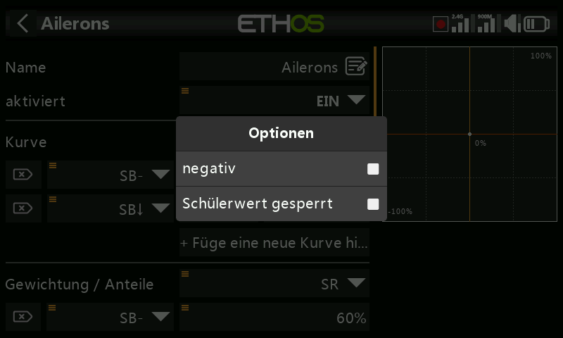

**Schalter-Quellen** —

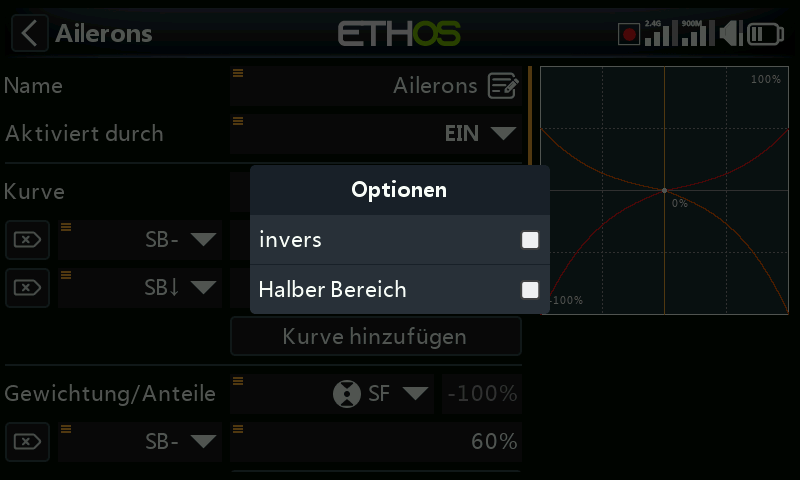
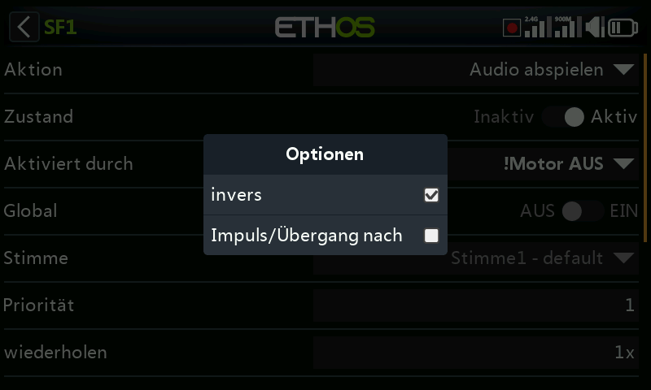

- **Negativ** — invertiert die Schalterwirkung.
- **HalfRange** — ändert bei einem 2-Positionen-Schalter oder einem Logischen
  Schalter den Ausgangsbereich von ±100 % auf 0–100 %.

**Trimm-Quellen** —

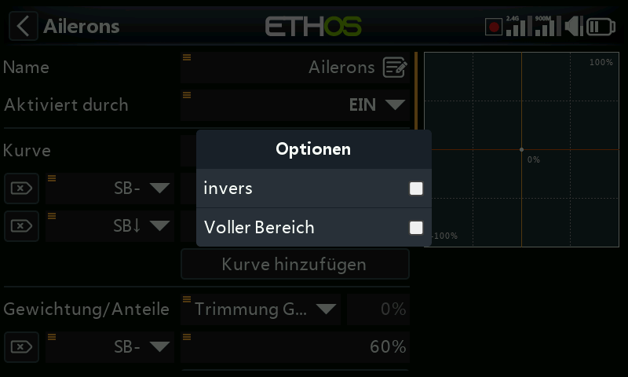

- **Negativ** — invertiert die Trimmwirkung (nützlich innerhalb der Aktionen
  eines freien Mischers).
- **Voller Bereich** — Trimmungen liegen standardmäßig bei ±25 %; als Quelle
  kann dies auf ±100 % erweitert werden.
- **Schülereingaben ignorieren** — schließt bei einem [Logischen
  Schalter](../model-setup/logical-switches.md) Bewegungen des Schülereingangs
  vom Auslösen des Schalters aus. Typische Anwendung: die eigene
  Knüppelbewegung des *Lehrers* erkennen (z. B. um sofort einzugreifen, wenn
  der Schüler einen Fehler macht), ohne dass die Knüppeleingaben des Schülers
  den Schalter ebenfalls auslösen.

**Variablen-Quellen** —

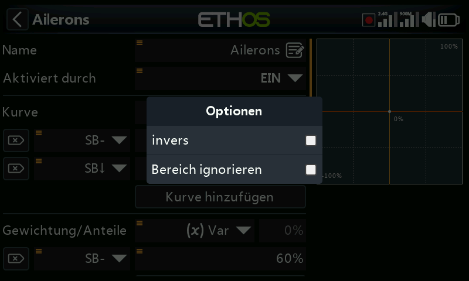

- **Negativ** — negiert den Wert der Variablen für diese Verwendung.
- **Bereich ignorieren** — manche Felder haben asymmetrische Bereiche (z. B.
  Min/Max bei den Ausgängen, die von −150–0 % bzw. 0–150 % reichen). Sofern
  eine als Quelle dieses Feldes verwendete
  [Variable](../model-setup/variables.md) nicht genau denselben Bereich
  besitzt, aktivieren Sie diese Option, um die automatische
  Bereichsumrechnung von Ethos zu überspringen und unerwartete Werte zu
  vermeiden.

**Telemetriesensor-Quellen** — reduzieren die Quelle auf ihr laufendes Minimum
oder Maximum statt auf den momentanen Messwert (manche Sensoren bieten darüber
hinaus weitere sensorspezifische Optionen):

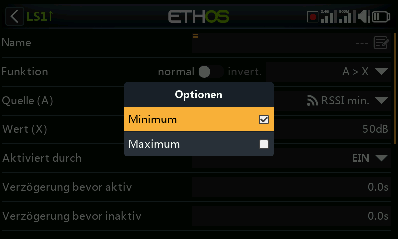
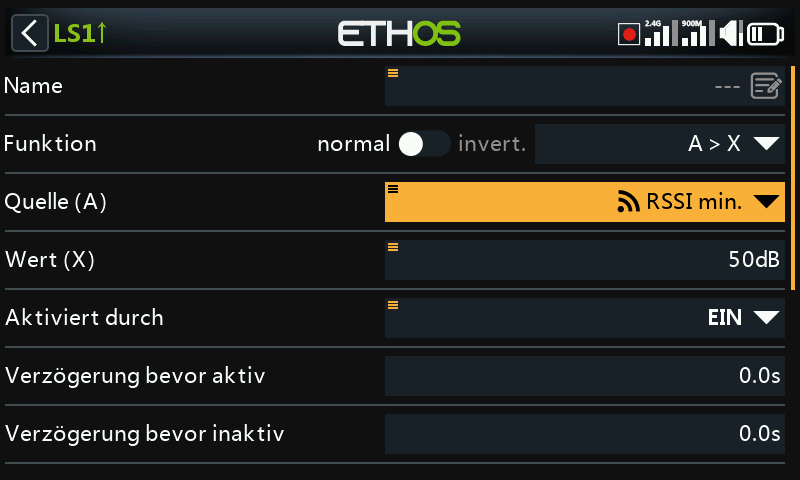
