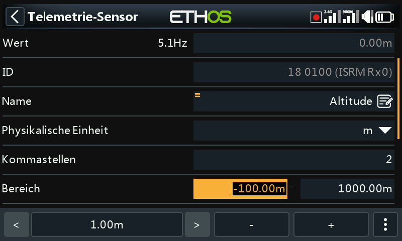

# Benutzeroberfläche und Navigation

Die Sender verfügt über einen Touchscreen, wodurch die Benutzeroberfläche recht intuitiv ist. Durch Berühren der Registerkarten „Model Setup“ (Flugzeugsymbol), „[Einstellung Ansichten](../displays/index.md)“ (Symbol für mehrere Bildschirme) und „System Setup“ (Zahnradsymbol) gelangen Sie direkt zu den Funktionen, die in den entsprechenden Abschnitten des Handbuchs beschrieben sind. Sie können auch über die Tasten \[MDL\], \[DISP\] und \[SYS\] aufgerufen werden.

Alternativ kann der Drehwähler verwendet werden, um die Markierung auf die gewünschte Kachel oder den gewünschten Parameter zu setzen und dann die Eingabetaste zu drücken, um sie auszuwählen.

Durch langes Drücken der \[RTN\]-Taste kehren Sie aus jedem Untermenü zum Startbildschirm zurück.

Wenn Sie die Systemzeit rechts in der unteren Leiste antippen, gelangen Sie in den Bereich Datum & Uhrzeit, wo Sie die Uhrzeit und das Datum einstellen können.

Wenn Sie die Lautsprecher- oder Batteriesymbole in der oberen Leiste berühren, werden die entsprechenden Bedienfelder Ton & Vibr. und Batterie angezeigt

## Reset Menü

Durch langes Drücken der \[ENT\]-Taste auf den Startbildschirmen wird ein Rücksetzmenü aufgerufen:

### Flug zurücksetzen

„Flug zurücksetzen“ setzt die Telemetrie, die Stoppuhren und die Funktionsschalter zurück. Beachten Sie, dass nach einem „Reset-Flug“ Vorflugprüfungen durchgeführt werden.

### Telemetrie zurücksetzen

Setzt die Telemetrie zurück und löscht alle Warnmeldungen (rote Punkte) zu „Sensor verloren“ oder „Sensorkonflikt“. Bitte beachten Sie den Abschnitt „Warnmeldungen zu Sensor verloren / Konflikt“.

### Stoppuhren zurücksetzen

Setzt die Stoppuhren zurück

## Touchscreen sperren

Der LCD-Touchscreen kann gesperrt werden, um eine versehentliche Bedienung zu verhindern, indem Sie im Startbildschirm \[ENT\] und \[Page\] gleichzeitig 1 Sekunde lang drücken. Diese Funktion ist auch als Spezialfunktion (SF) verfügbar.

## Bearbeitung von Steuerelementen

Sie können ein neues Funktionselement wie einen Stoppuhr, einen Logikschalter, eine Spezialfunktion, eine Kurve oder eine Variable erstellen, indem Sie auf das Symbol „+“ neben den Spaltenüberschriften im entsprechenden Hauptmenü tippen.

Bei Sender ohne Touchscreen scrollen Sie mit dem Drehgeber zur Taste „+“ und drücken Sie dann ENT.

### Virtuelle Tastatur

Auf Touchscreen-Sendern bietet Ethos eine virtuelle Tastatur zum Bearbeiten von Textfeldern.

Berühren Sie einfach ein beliebiges Textfeld (oder klicken Sie auf \[ENT\]), um die Tastatur aufzurufen.

Tippen Sie auf die Rücktaste (über der Eingabetaste = ), um Zeichen links vom Cursor zu löschen. Drücken Sie die \[Page\]-Taste, um Zeichen rechts vom Cursor zu löschen. Sobald Sie das Ende auf der rechten Seite erreicht haben, beginnt die \[Page\]-Taste mit dem Löschen der restlichen Zeichen links vom Cursor.

Berühren Sie das Textfeld, um den Cursor an diese Position zu bewegen. Alternativ können Sie auch die Taste \[SYS\] drücken, um den Cursor nach links zu bewegen, oder die Taste \[DISP\], um ihn nach rechts zu bewegen.

Tippen Sie auf die Taste '?123' oder 'abc', um zwischen dem alphanumerischen und dem numerischen Tastenfeld umzuschalten. Außerdem gibt es eine Feststelltaste für die Eingabe von Großbuchstaben.

#### Sender ohne Touchscreen

Bei Sender ohne Touchscreen drücken Sie die \[ENT\]-Taste auf einem beliebigen Textfeld, um in den Bearbeitungsmodus zu gelangen.

Drehen Sie den Drehgeber, um durch die Groß- und Kleinbuchstaben und die Ziffern zu blättern, gefolgt von den Sonderzeichen. Drücken Sie \[ENT\], um das Zeichen einzufügen. Mit der Taste \[MDL\] wird die Groß-/Kleinschreibung des Zeichens unmittelbar rechts vom Cursor geändert. Alle folgenden Zeichen bleiben in der neuen Groß-/Kleinschreibung, bis die Groß-/Kleinschreibung erneut geändert wird.

Drücken Sie die Taste \[Page (Seite)\], um die Zeichen rechts vom Cursor zu löschen.

Drücken Sie die Taste \[SYS\], um den Cursor nach links zu bewegen, oder die Taste \[DISP\], um ihn nach rechts zu bewegen.

### Zahlenwerte ändern

Wenn Sie einen Zahlenwert berühren, erscheint am unteren Rand des Bildschirms ein Dialogfeld mit den Steuerelementen für den Zahlenwert:

a) Die Tasten '<' und '>' zum Ändern der Schrittweite zwischen dem Minimum (je nach Bedarf) und dem Anstieg in Dekaden, z.B. 0,01%, 0,1%, 1,0% oder 10,0%.

b) Die Tasten '-' und '+' erhöhen oder verringern den Wert um die gewählte Schrittweite. Zur Einstellung des Wertes kann auch der Drehgeber verwendet werden.

c) eine Schaltfläche „  “ auf der rechten Seite steht für zusätzliche Optionen, siehe unten.

Die Schaltfläche „ “ auf der rechten Seite öffnet einen weiteren Dialog für zusätzliche Optionen:

d) den Standardwert

e) auf das Minimum setzen

f) auf das Maximum gesetzt

g) die Bedienelemente durch einen Schieberegler ersetzen, siehe unten

Mit dem Schieberegler lässt sich der Wert schnell einstellen. Das Drehrad kann ebenfalls zur Feineinstellung verwendet werden.

Um zu den Zifferntasten zurückzukehren, wählen Sie „Schiebereg. inaktiv“.

Ein weiteres Beispiel ist ein Telemetriebereichswert, der auf ähnliche Weise bearbeitet werden kann. Mit den Symbolen < und > kann man die Schrittweite in 10er-Schritten ändern.

### Funktion Optionen

Ethos verfügt über eine sehr leistungsfähige „Optionen“-Funktion. Fast überall, wo ein Wert oder eine Quelle erwartet wird, führt ein langer Druck auf die Enter-Taste zu einem Optionsdialog.

Felder mit dieser Funktion sind an dem Menüsymbol (Hamburger-Symbol) in der linken oberen Ecke des Feldes zu erkennen.

Für Einstellungen auf Sender-Ebene – wie Hauptlautstärke, Lautsprecher-Stummschaltung, Vario-Lautstärke, Display-Helligkeit und Display-Helligkeit im Ruhemodus – können Sie keine modellabhängige Quelle (wie einen Logikschalter, Funktionsschalter oder Flugphasen) auswählen.

#### Wert-Optionen

Das Dialogfeld „Werteoptionen“ zeigt an, welcher Parameter konfiguriert wird. In diesem Beispiel haben Sie die Wahl, die Gewichtung/Anteile auf Maximum, 0 (Standard) oder Minimum einzustellen, oder eine Quelle zu verwenden. Die Verwendung einer Quelle, z. B. eines Potis, würde eine Anpassung der Gewichtung/Anteile im Flug ermöglichen.

Wenn Sie die Eingabetaste in einem Wertefeld lange drücken, das bereits geändert wurde, um eine Quelle zu verwenden, wird ein Dialogfeld angezeigt, in dem Sie den aktuellen Wert der Quelle in einen festen Wert umwandeln können.

Wenn Sie auf „Optionen“ klicken, werden Optionen für die Quelle angezeigt (siehe unten).

#### Optionen für die Quelle

#### Quelloption für Logikschalter

##### Invers

Mit der Funktion „invers“ kann eine Quelle, z. B. eine Schalterstellung, negiert oder invertiert werden. Anstatt aktiv zu sein, wenn der Schalter SA oben ist, wäre er beispielsweise aktiv, wenn der Schalter SA NICHT oben ist, d. h. entweder in der mittleren oder in der unteren Position

##### Impuls/Übergang nach

Sie können die Option „Impuls/Übergang nach“ wählen, wenn Sie eine einmalige Aktion benötigen, wenn die Quelle von FALSCH nach WAHR oder von WAHR  nach FALSCH übergeht. Es wird nur auf den Übergang reagiert, nicht auf den Zustand „Wahr“ oder „Falsch“.

Ein '┼'-Zeichen wird als Präfix vor der Quelle angezeigt, um die Edge-Option anzuzeigen.

Bitte beachten Sie, dass die Option „Flanke“ bei Schaltern verfügbar ist, aber vom Kontext abhängt. Sie ist auch für die Auslösebedingungen des SR FlipFlop-Logik-schalters verfügbar.

##### Quellenoption für Schalter

###### Invers

Mit der Option „invers“ kann die Schaltfunktion umgekehrt werden.

###### Halber Bereich

Die Option „Halber Bereich“ ist verfügbar, wenn ein 2-POS-Schalter oder ein Logikschalter als Quelle verwendet wird. Der Bereich wird zu \[0-100%\] anstelle von \[-100%-100%\].

##### Quelle für den Gaseingabe

- Wenn „positiv“ aktiviert ist, wird nur die positive Hälfte des Eingangssignals in den Mischer eingespeist.
- Wenn „negativ“ aktiviert ist, wird nur die negative Hälfte des Eingangsreglers in den Mischer eingespeist.

Die beiden oben genannten Optionen werden häufig in Oberflächenmodellen verwendet, bei denen der Auslöser sowohl die Drosselklappe (positive Hälfte) als auch die Bremse (negative Hälfte) betätigt.

- Aktivieren Sie „invers“, um die Eingabesteuerung umzukehren.
- Durch Aktivieren von „Schülerwert gesperrt“ wird verhindert, dass der Schülersender den Mischer beeinflusst. Weitere Informationen finden Sie im Abschnitt „Eingaben des Schülers ignorieren“.

##### Quellenoption für Trimmungen

invers

Die Option „Invertieren“ ermöglicht es, die Trimmung umzukehren, was bei Mischer-Aktionen nützlich ist.

Voller Bereich

Standardmäßig haben Trimmungen einen Bereich von +/- 25 %. Bei Verwendung als Quelle können die Trimmungen optional auf den vollen Bereich +/- 100 % geändert werden (drücken Sie lange die Eingabetaste auf der Trimmung).

##### Eingaben des Schülers ignorieren

Bei Logikschaltern kann diese Option so eingestellt sein, dass Quellen, die vom Schülereingang kommen, ignoriert werden. Eine typische Anwendung ist, wenn ein Logikschalter so konfiguriert ist, dass er die Bewegung der Steuerknüppel des Trainers (z. B. des Höhenruderknüppels) erkennt, um ein sofortiges Eingreifen zu ermöglichen, wenn etwas schiefläuft. Diese Option wird benötigt, um zu verhindern, dass die Knüppeleingaben der Schüler den Logikschalter auslösen.

#### Var Optionen

##### invers

Wenn Sie die Option invers aktivieren, wird der Var-Wert in diesem Fall negativ.

##### Bereich ignorieren

Einige Parameter haben asymmetrische Bereiche, wie beispielsweise die Min/Max-Parameter im Abschnitt „Kanäle“, die Bereiche von (-150 % bis 0 %) bzw. (0 % bis +150 %) haben. Wenn VARs als Quelle für die Anpassung der Min/Max-Parameter verwendet werden, muss der Var-Bereich ignoriert werden, um unerwartete Werte aufgrund der Bereichsumwandlung zu vermeiden, es sei denn, der Var hat einen identischen Bereich.

#### Sensor-Optionen

Bei einer Telemetriequelle kann über den Optionsdialog der Maximal- oder Minimalwert verwendet werden.

Einige Sensoren verfügen über zusätzliche, für den jeweiligen Sensor spezifische Optionen.
