# Batteriekapazitätswarnung

Warnung anhand der **verbrauchten Kapazität** (mAh) statt der Spannung –
ein direkteres Maß dafür, wie viel des Akkupacks tatsächlich verbraucht
ist. Je nach vorhandener Hardware gibt es zwei Wege dorthin.

## Variante A: ein ESC der Neuron-Serie

Die ESCs der FrSky Neuron-Serie melden den Verbrauch direkt – ein
berechneter Sensor ist dafür nicht nötig. Stellen Sie in den
[Empfängeroptionen den Telemetrieanschluss](../system-setup/devices.md)
auf die Option S.Port, verbinden Sie den Telemetrieanschluss des Neuron
ESC über ein S.Port-Kabel mit Ihrem Empfänger und aktivieren Sie die
Option [„Sensoren suchen“](../model-setup/telemetry.md#discovering-sensors) –
der Sensor, der Sie interessiert, ist **ESC Consumption**.

1. Fügen Sie einen neuen [logischen
   Schalter](../model-setup/logical-switches.md) hinzu, um `ESC
   Consumption` zu überwachen; er wird WAHR/aktiv, wenn der Verbrauch
   z. B. 900 mAh übersteigt – ungefähr 60 % eines Akkupacks, der mit
   noch etwa 30 % Restkapazität landen soll.
2. Fügen Sie eine [Spezialfunktion „AUDIO
   abspielen“](../model-setup/special-functions.md) hinzu, als aktive
   Bedingung den neuen Schalter, mit einem Schritt **Wert ansagen** für
   `ESC Consumption`.

Als zusätzliche Sicherheitsmaßnahme melden die Neuron-Regler außerdem
**ESC Voltage** – richten Sie einen zweiten logischen Schalter genauso
ein wie unter [Warnung bei niedriger
Akkuspannung](low-battery-warning.md) beschrieben (4 Sekunden lang unter
3,4 V pro Zelle – also z. B. 13,6 V bei einem 4S-Akku), mit einer eigenen
Funktion „AUDIO abspielen“, die sich alle 5 Sekunden wiederholt.

## Variante B: Stromsensor + berechneter Sensor

Meldet der Regler keinen Verbrauch, erledigt ein Stromsensor (z. B.
FrSky FASxxx) in Kombination mit einem [berechneten Sensor
**Consumption**](../model-setup/telemetry.md#calculated-sensors) dieselbe
Aufgabe.

### 1. Anschließen und Sensoren suchen

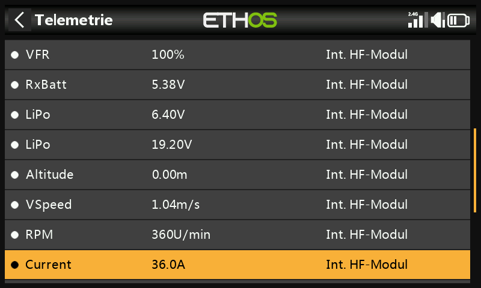

Schließen Sie die S.Port-Leitung des Stromsensors an und starten Sie die
Sensorsuche – er erscheint als **Current**. Stellen Sie dessen **Range**
passend zum Sensor ein (z. B. 0–100 A bei einem FAS100):

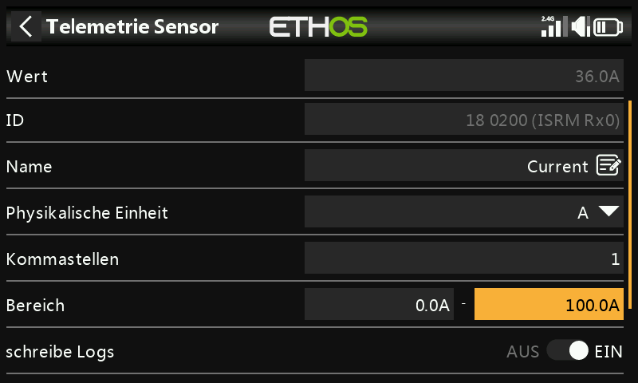

### 2. Den berechneten Sensor „Consumption“ anlegen

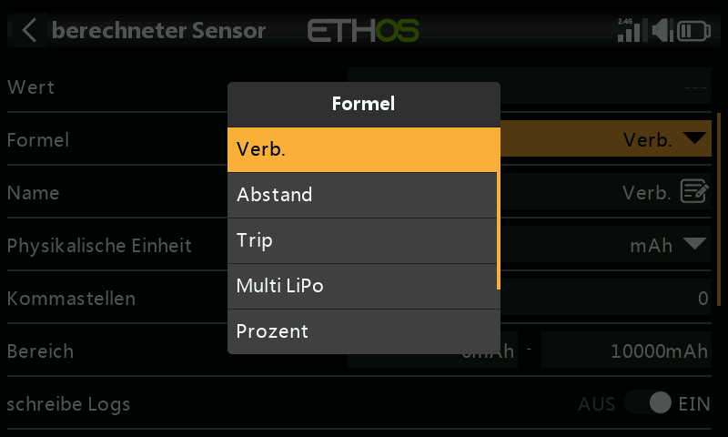
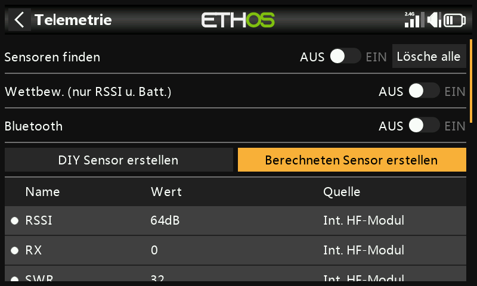

Wählen Sie in der Telemetrie **Create Calculated Sensor** →
**Consumption**. Setzen Sie die Einheit auf `mAh` und **Range** auf die
Kapazität des Akkus (z. B. 2800 mAh); **Source** auf `Current`.

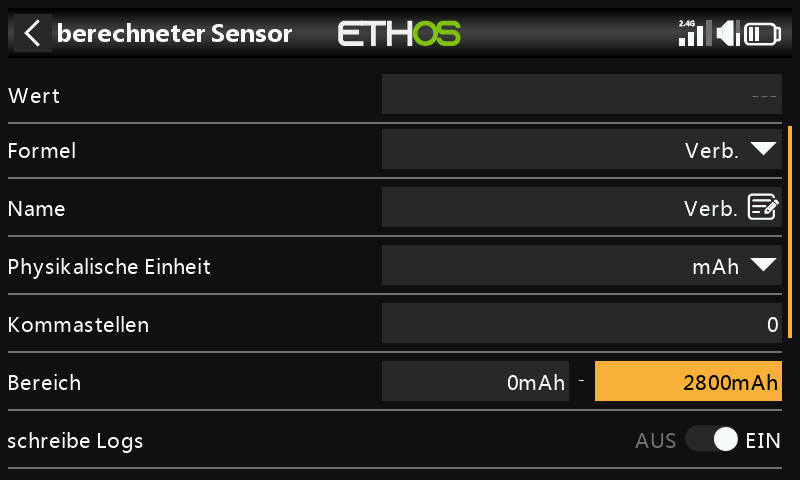
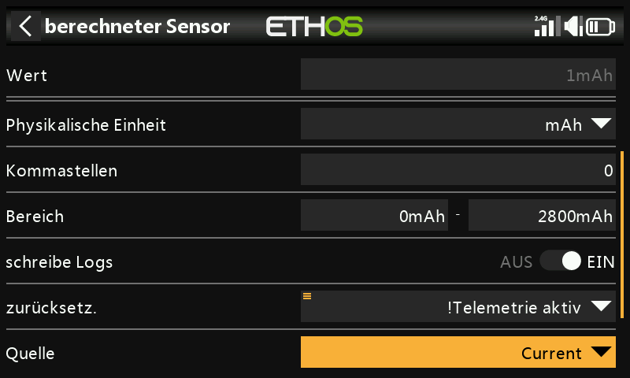

Stellen Sie **Reset** auf das Systemereignis `!Telemetry Active` – wählen
Sie **Telemetry Active**, drücken Sie lange die `ENT`-Taste und wählen
Sie **Invert** – damit der laufende Gesamtwert automatisch zurückgesetzt
wird, sobald die Telemetrie abreißt (das Modell also ausgeschaltet wird).

### 3. Ansagen bei Zwischenschritten

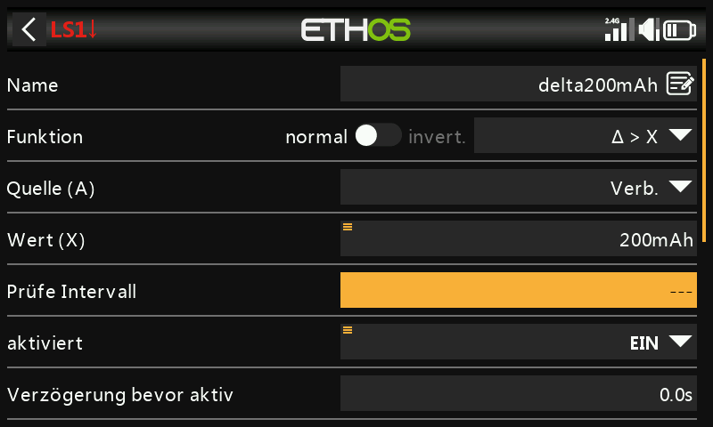

Fügen Sie einen logischen Schalter mit der Funktion **Δ > X** auf
`Consumption` hinzu, der bei jedem festen Zuwachs auslöst – zum Beispiel
alle 200 mAh, ein praktischer Teilbetrag eines 2800-mAh-Akkus.

!!! tip
    Setzen Sie **Check interval** auf `---` (unendlich), damit der Wert
    unbegrenzt weiter bis zur nächsten Schwelle aufsummiert wird, statt
    nach einem festen Zeitfenster zurückgesetzt zu werden. Geben Sie
    **Min Duration** beim Testen einen kleinen Wert ungleich null – bei
    0,0 ist die Auslösung zu kurz, um sie auf dem Bildschirm zu sehen.

Fügen Sie eine Funktion „AUDIO abspielen“ mit diesem Schalter als aktiver
Bedingung hinzu, mit einem Schritt „Wert ansagen“ für `Consumption`:

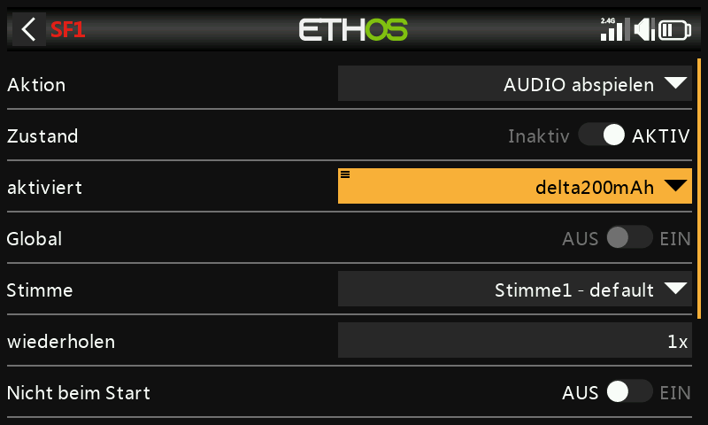
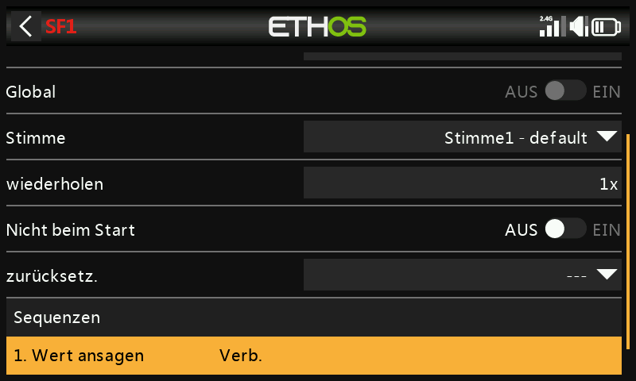

### 4. Warnung bei geringer Restkapazität

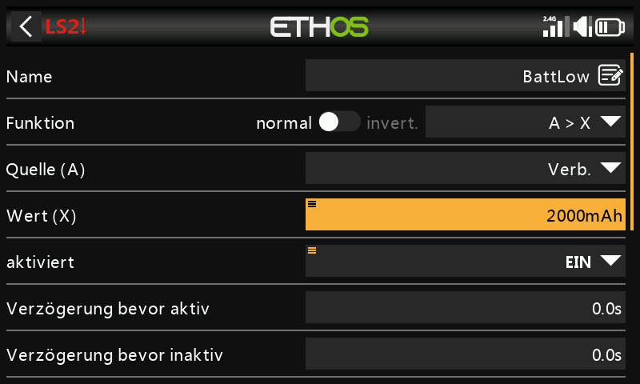

Ein zweiter logischer Schalter löst einmalig aus, sobald eine feste
Schwelle für geringe Restkapazität überschritten wird – z. B. 2000 mAh
von einem 2800-mAh-Akku – kombiniert mit einer Funktion „AUDIO
abspielen“, die sich alle 10 Sekunden wiederholt, bis das Modell
zurückgesetzt wird:

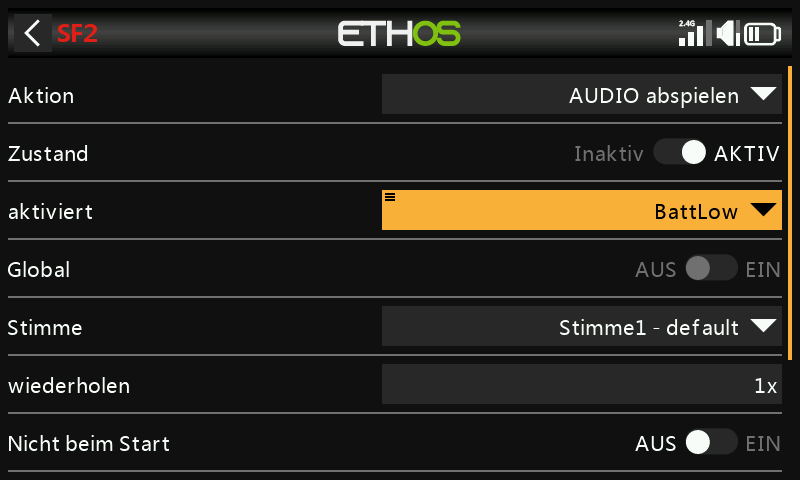
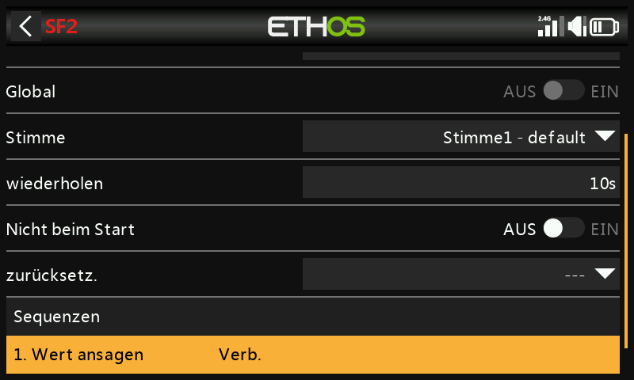
