# Butterfly-Mischer (Krähe)

Die Butterfly-Bremsstellung (auch „Krähenstellung“ genannt) steuert die
Sinkgeschwindigkeit, vor allem bei Seglern: Die Querruder fahren ein
Stück nach oben, während die Wölbklappen weit nach unten ausschlagen.
Dadurch entsteht ein erheblicher Widerstand — ideal, um den Landeanflug
zu kontrollieren. Diese Anleitung geht von einem Segler aus, dessen
Klappenkanäle bereits vorhanden sind (angelegt vom Assistenten unter
[Modellauswahl](../model-setup/model-select.md)), und verwendet den
Gasknüppel als Bremseingang: kein Butterfly bei Knüppel oben, zunehmend
mehr, je weiter der Knüppel nach unten bewegt wird, mit einer
Höhenruderkompensation, damit der Segler beim Ausfahren der
Krähenstellung nicht aufbäumt.

## 1. Den standardmäßigen Klappenmischer deaktivieren

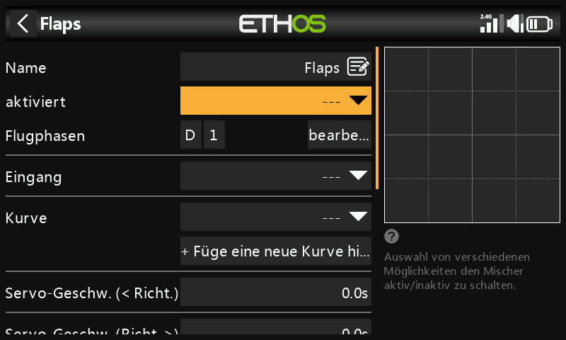

Setzen Sie beim vom Assistenten erstellten Klappenmischer das Feld
**aktiviert** auf `---` — er wird nicht verwendet.

## 2. Den Butterfly-Mischer anlegen

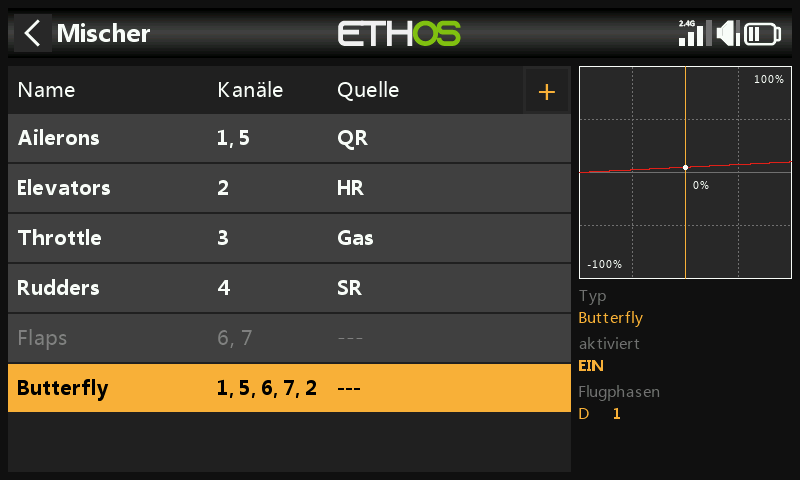

Tippen Sie auf eine beliebige Mischerzeile und wählen Sie **Mischer
hinzufügen** → **Butterfly** aus der
[Mischerbibliothek](../model-setup/mixes.md#mix-libraries). Der Mischer
wird nach dem (nun deaktivierten) Klappenmischer eingefügt.

## 3. Den Eingang konfigurieren

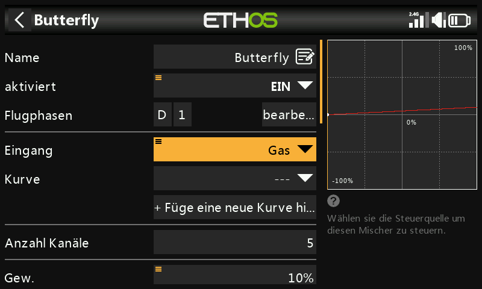

Setzen Sie **Eingang** auf **Gas**. Da Gas bei Knüppel oben
normalerweise den Maximalwert liefert, Butterfly bei Knüppel oben aber 0
sein muss, drücken Sie lange die `ENT`-Taste auf Gas und wählen Sie
**Invertieren**:

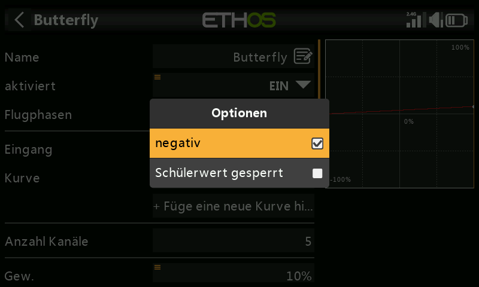
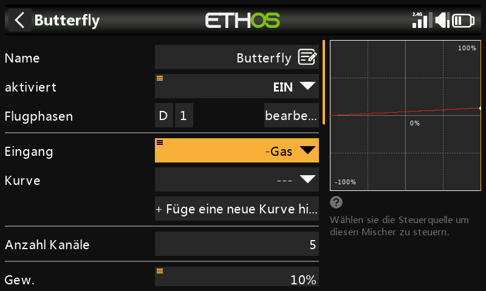

Der Eingang liefert nun 0, wenn der Knüppel ganz oben steht, und das Feld
zeigt zur Bestätigung der Invertierung `-Throttle` an. Setzen Sie das
Feld **aktiviert** auf eine Lande-Flugphase (oder einen anderen
Schalter), falls Butterfly nicht immer verfügbar sein soll.

## 4. Eine Kurve mit Totzone hinzufügen

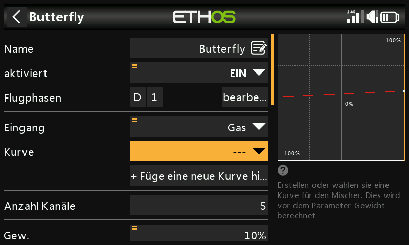

Eine kleine Totzone am Nullende des Knüppels verhindert ein
versehentliches Ausfahren durch geringe Knüppelbewegungen nahe dem
Endanschlag. Fügen Sie eine benutzerdefinierte 3-Punkt-Kurve hinzu (z. B.
mit dem Namen „Crowdb“) und schalten Sie den **einfachen Modus** aus,
damit die X-Punkte verschoben werden können:

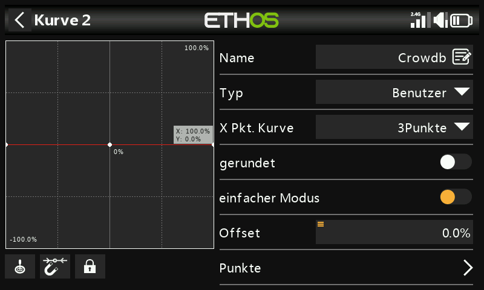
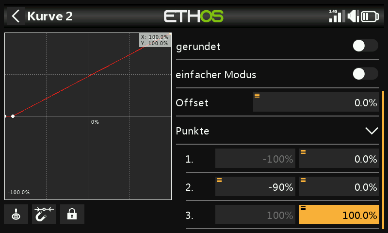

!!! note
    Wenn Sie dem Butterfly-Mischer eine eigene Kurve hinzufügen, entfällt
    dessen interner 0–100-Offset (der sonst automatisch angewendet wird)
    — die Kurve selbst muss diese 0–100-Umrechnung nun nachbilden. In
    diesem Beispiel bleibt der Ausgang bei 0 %, bis der Gasknüppel −90 %
    erreicht, und steigt dann linear auf 100 % an:

    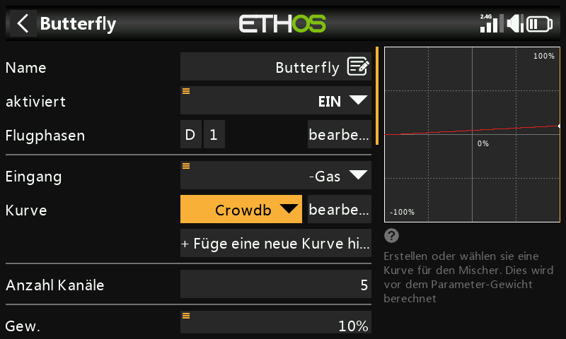

## 5. Querruder und Wölbklappen konfigurieren

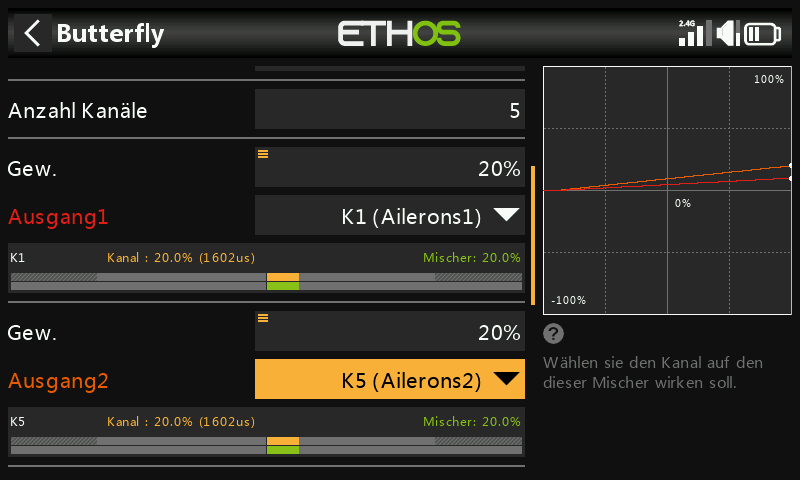

Üblich ist ein geringer Querruderausschlag nach oben (z. B. 20 %) in
Verbindung mit einem großen Klappenausschlag. Wölbklappen benötigen in
der Regel deutlich mehr Weg nach unten als nach oben — das erreicht man
meistens dadurch, dass die Servohebel der Klappen in der Anlenkung selbst
um 20–30° aus der Neutralstellung versetzt werden, wodurch die Klappen
bei Servo-Neutralstellung etwa halb nach unten stehen:

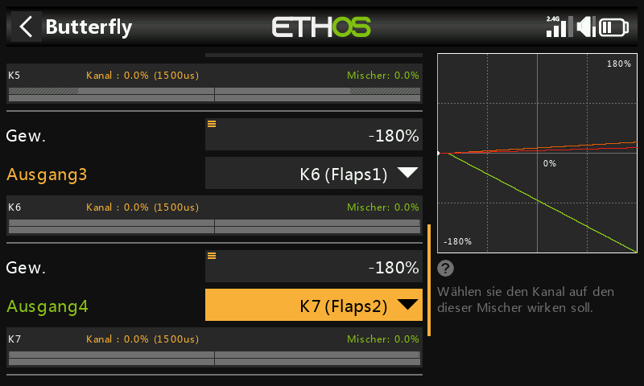
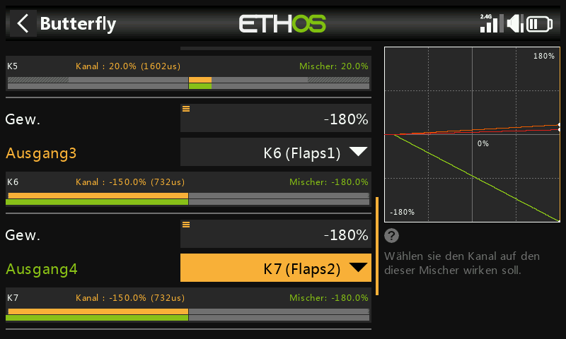

Stellen Sie die Gewichtung des Klappenmischers hoch ein (z. B. −180 %),
um den maximalen Weg zu erhalten; der tatsächliche mechanische Weg wird
über die Min/Max-Werte in den
[Ausgängen](../model-setup/outputs.md) festgelegt.

!!! tip
    Um ein Übersteuern der Servos zu vermeiden, beginnen Sie bei den
    Min/Max-Werten der Ausgänge zurückhaltend (z. B. ±30 %) und
    erweitern Sie sie beim endgültigen Einstellen vorsichtig, wobei Sie
    auf mechanische Blockierungen achten.

## 6. Einen Offset-Mischer „Klappen Neutral“ hinzufügen

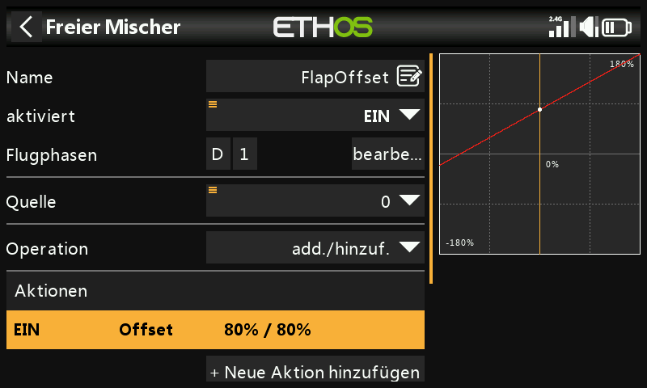

Da die versetzten Servohebel die Klappen bei Servo-Neutralstellung um
etwa 20–30 % ausgelenkt lassen, bringt ein **Offset-Mischer** sie für den
normalen Flug wieder in die tatsächliche Neutralstellung des Flügels.
Beginnen Sie mit einem Offset von 80 % (der noch abgestimmt wird) und
zwei Ausgangskanälen, die den beiden Klappenkanälen zugeordnet sind:

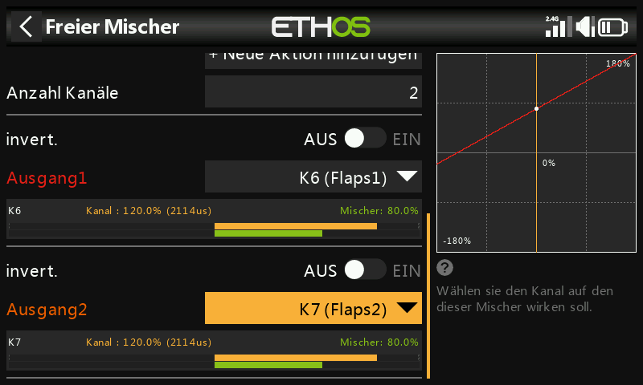
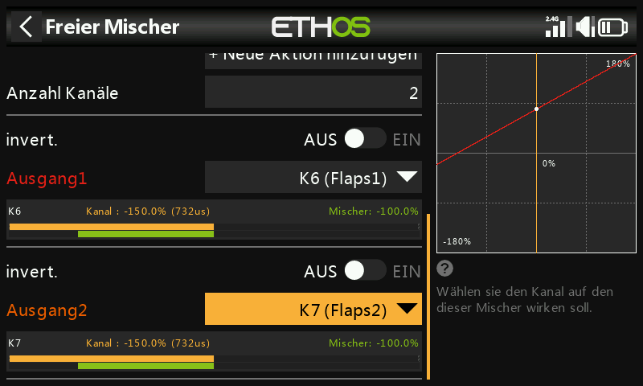

Prüfen Sie bei ganz nach oben gestelltem Gasknüppel (Butterfly-Mischer
inaktiv), dass die Werte des Klappenmischers auf dem Offset (80 %)
liegen; wenn Sie den Klappenknüppel bis zum vollen Ausschlag bewegen,
sollte sich der Mischerausgang um die gesamte Gewichtung ändern (z. B.
von 80 % auf −100 %, also 180 % Hub). Die tatsächlichen Wegbegrenzungen
stimmen Sie in den Ausgängen über Min/Max oder eine Kurve fein ab.

## 7. Kompensationskurve und Mischer für das Höhenruder hinzufügen {: #7-add-the-elevator-compensation-curve-and-mix }

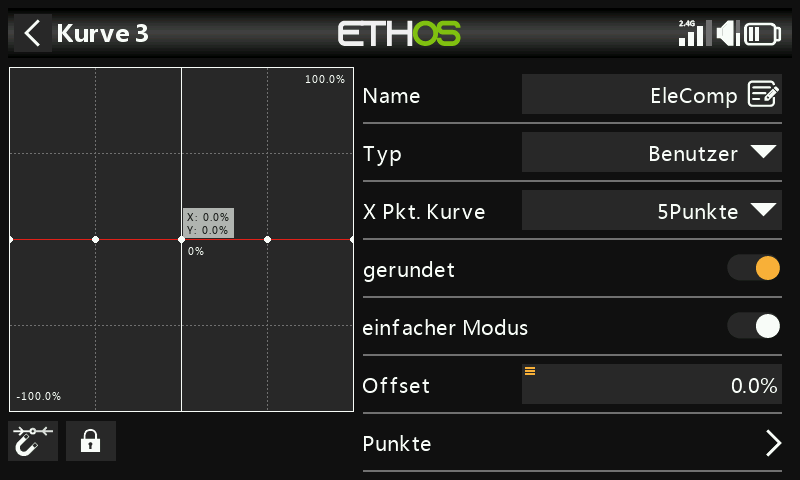
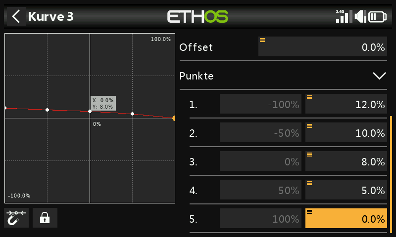

Da die erforderliche Kompensation nicht linear ist, verwenden Sie eine
Kurve anstelle einer festen Gewichtung. Legen Sie eine
benutzerdefinierte 5-Punkt-Kurve an (z. B. „EleComp“) — dieses Beispiel
beginnt mit 12 %/10 %/8 %/5 %/0 % über die Punkte hinweg; ohne bekannten
Ausgangswert für Ihr Modell müssen diese Werte im Flug ermittelt werden.

Wandeln Sie diese Kurve anschließend in einen Wert um, der als
**Gewichtung** eines Mischers nutzbar ist: Fügen Sie einen
[Freien Mischer](../model-setup/mixes.md#mix-libraries) („EleCompx“) mit
Gas als Quelle und der zugewiesenen EleComp-Kurve hinzu und legen Sie den
Ausgang auf einen hohen, ungenutzten Kanal (z. B. CH20):

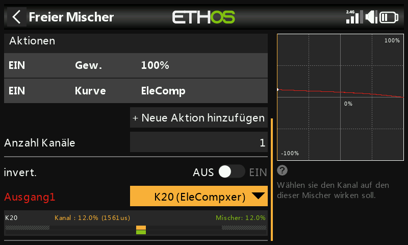

Drücken Sie zurück im Butterfly-Mischer lange die `ENT`-Taste auf der
**Gewichtung** des Höhenruderausgangs, wählen Sie **Quelle verwenden**
und anschließend CH20 (EleCompx) aus der Kategorie „Kanäle“:

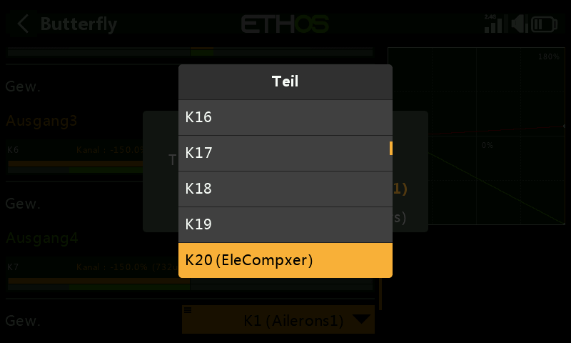
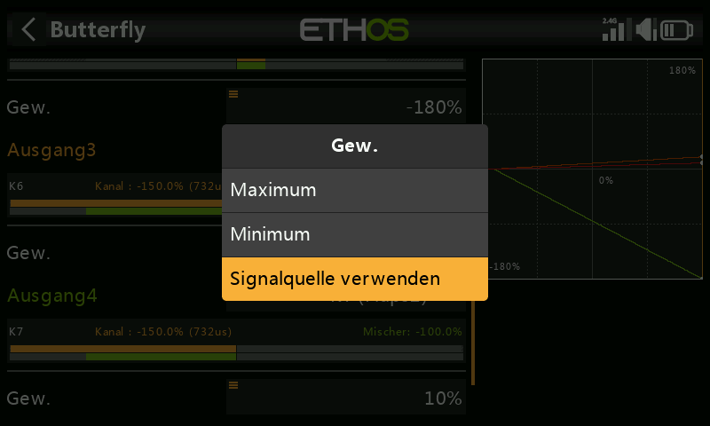

Der Butterfly-Mischer ist nun vollständig konfiguriert:

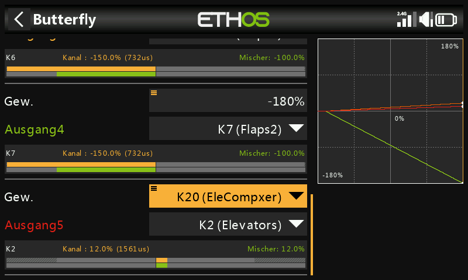

## 8. Mit der Kanalansicht überprüfen

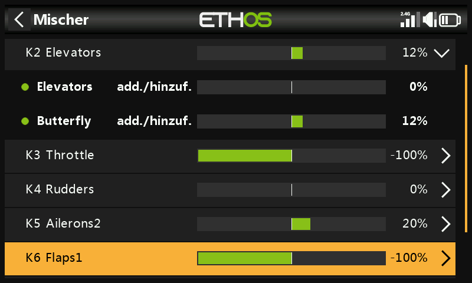

Wechseln Sie beim Höhenruder zur
[Ansicht nach Kanal](../model-setup/mixes.md#per-channel-view), um zu
beobachten, wie sich alle beteiligten Mischer (Knüppeleingabe +
Butterfly-Kompensation) gemeinsam ändern, während Sie den Gas- bzw.
Bremsknüppel bewegen — das ist zur Fehlersuche deutlich übersichtlicher
als die einfache Tabellenansicht.

!!! tip
    Angaben zum erforderlichen Höhenruderweg im Verhältnis zum
    Klappenausschlag (vom Hersteller des Modells oder aus
    Community-Quellen) sind sehr hilfreich, bevor Sie die Startwerte der
    Kompensationskurve festlegen. Fehlen solche Angaben, beginnen Sie mit
    wenigen Millimetern Höhenruderweg bei voll ausgefahrenen Klappen und
    verfeinern Sie die Werte von dort aus.
