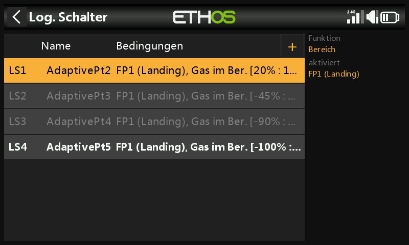
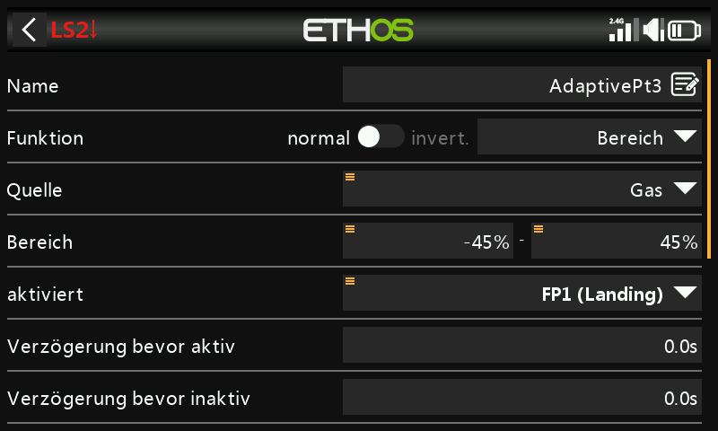
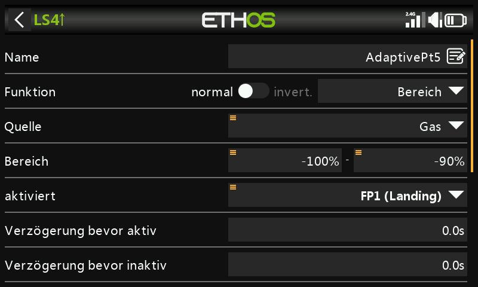
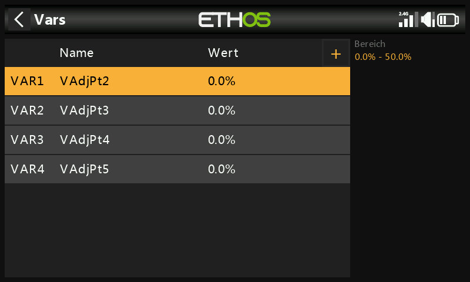
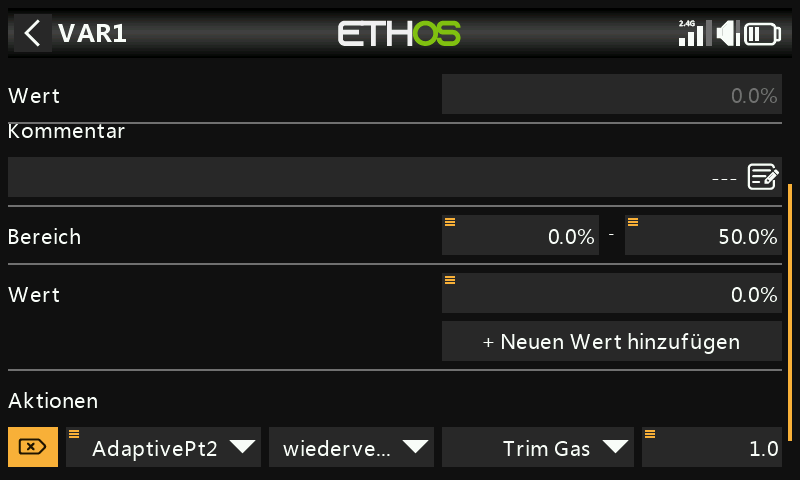
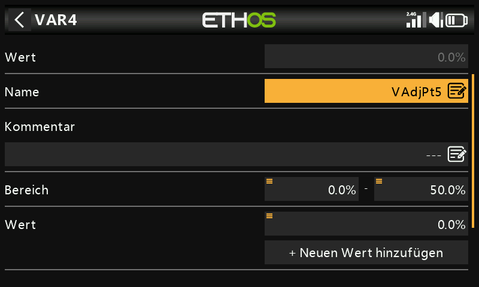
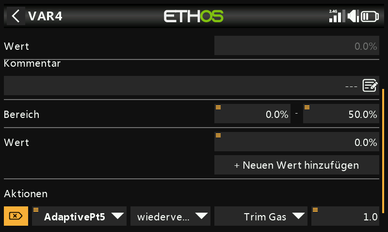
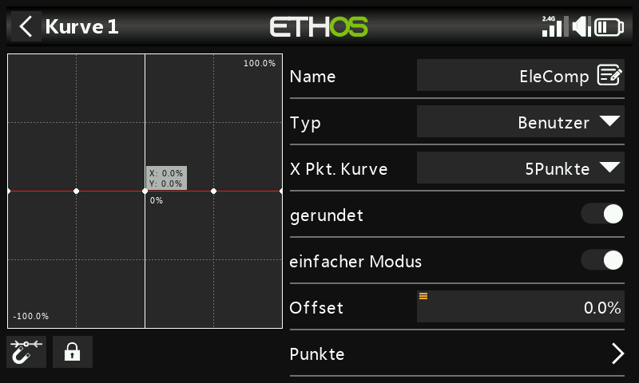
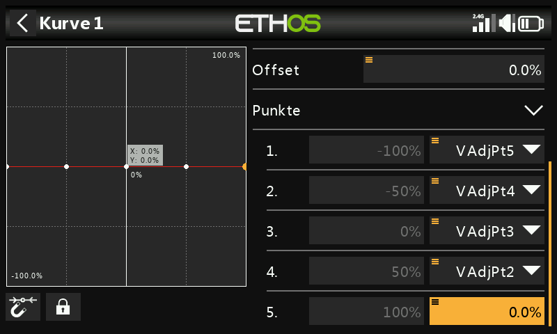

# Im Flug einstellbare Kompensationskurve

## Warum

Das Ausfahren der Klappen verändert die Profilwölbung — Hochdecker neigen
zum "Aufbäumen", Tiefdecker zum Absacken — und erfordert eine
Höhenruderkorrektur, die nicht linear zum Klappenausschlag verläuft, also
eine Kurve statt eines festen Offsets. Diese Anleitung nutzt
[Vars](../model-setup/variables.md), um die Punkte einer
Kompensationskurve **im Flug** einstellbar zu machen — über eine
umgewidmete Gastrimmung, gesteuert davon, welchem Kurvenpunkt der
Klappenknüppel gerade am nächsten ist. Sie baut auf dem Schritt zur
Höhenruderkompensation aus [Anleitung:
Butterfly-Mischer](butterfly-mixer.md) auf.

## 1. Kurventyp wählen

Eine [benutzerdefinierte Kurve](../model-setup/curves.md) mit 5 Punkten
reicht für eine sanfte Kompensation aus, ohne unnötig komplex zu werden.
Punkt 5 (ganz rechts, Klappenknüppel vollständig oben / keine Klappen)
bleibt immer auf Null fixiert — ohne ausgefahrene Klappen ist keine
Kompensation nötig. Die anderen 4 Punkte werden über Vars einstellbar
gemacht. Da der Klappenknüppel häufig zwischen zwei definierten Punkten
steht, müssen in dieser Überlappungszone beide benachbarten Punkte
gemeinsam einstellbar sein.

## 2. Überlappende Bereiche berechnen

Punkt-zu-Punkt-Bereiche (mit freundlicher Genehmigung übernommen von Mike
Shellims "Crow-aware adaptive elevator trim" für OpenTX auf rc-soar.com —
leicht erweitert, sodass der Bereich von Pt2 bis +100 % reicht; die
Begründung dafür steht in [Schritt 6](#6-apply-the-curve)):

| Bereich Klappenknüppel | Aktive Punkte |
|---|---|
| +100 % bis +45 % | nur Pt2 |
| +45 % bis +20 % | Pt2 und Pt3 |
| +20 % bis −20 % | nur Pt3 |
| −20 % bis −45 % | Pt3 und Pt4 |
| −45 % bis −90 % | nur Pt4 |
| −90 % bis −100 % | nur Pt5 |

## 3. Logische Schalter konfigurieren

Vier [logische Schalter](../model-setup/logical-switches.md), die jeweils
die Funktion **Bereich** auf dem Klappenknüppel (Gasknüppel) verwenden und
aktiv sind, solange sich der Knüppel in der Zone des jeweiligen Punktes
befindet:

- `AdaptivePt2` — Bereich 20 % bis 100 % (gezielt bis 100 % erweitert,
  damit Pt2 auch ohne ausgefahrene Klappen eingestellt werden kann —
  siehe Schritt 6).

  

- `AdaptivePt3` — Bereich −45 % bis 45 %.

  

- `AdaptivePt4` — Bereich −90 % bis −20 %.

  

- `AdaptivePt5` — Bereich −100 % bis −90 %.

  

## 4. Vars für die Einstellung anlegen

Vier [Vars](../model-setup/variables.md), `VAdjPt2`–`VAdjPt5`, jeweils mit
dem Bereich 0–50 % (bei Bedarf erweitern) und einer Aktion mit
**umgewidmeter Gastrimmung** — Schrittweite 1,0 %, als Aktivierungsbedingung
der jeweils passende logische Schalter:

Da immer nur ein logischer Schalter aktiv ist (in den Überlappungszonen
höchstens zwei), stellt dieselbe physische Trimmung je nach Klappenstellung
gefahrlos unterschiedliche Vars ein.

## 5. Kompensationskurve definieren

Eine neue benutzerdefinierte Kurve mit 5 Punkten (z. B. "EleComp") mit
aktivierter Option **Smooth**. Auf den Punkten 1–4 jeweils `ENT` lang
drücken und über **Quelle verwenden** `VAdjPt5`…`VAdjPt2` zuweisen
(Punkt 5 bleibt gemäß Schritt 1 fest auf 0).

## 6. Kurve anwenden {: #6-apply-the-curve }

Diese Kurve wird genau an der Stelle verwendet, an der [Anleitung:
Butterfly-Mischer](butterfly-mixer.md#7-add-the-elevator-compensation-curve-and-mix)
seine EleComp-Kurve in den Mischer für die Höhenruderkompensation einbindet.

Wenn möglich, sollte man von realen Daten ausgehen (Herstellerangaben,
Beiträge aus der Community), wie viel Höhenruderweg ein bestimmter
Klappenausschlag erfordert; andernfalls sind wenige Millimeter Kompensation
bei vollem Klappenausschlag ein sinnvoller Ausgangspunkt.

!!! tip "Vorgehen beim Abstimmen"
    Mit kleinen Klappenausschlägen und kleinen Trimmschritten beginnen.
    `AdaptivePt2` lässt sich **ganz ohne ausgefahrene Klappen** abstimmen —
    kurz etwas Klappe geben, wieder zurücknehmen und jeweils ein wenig
    Kompensation eindrehen, statt unter Zeitdruck gegen ein aufbäumendes
    oder absackendes Modell antrimmen zu müssen. Zur Kontrolle erneut
    etwas Klappe geben und bei Bedarf nachjustieren. Sobald Pt2 passt,
    zum nächsten Punkt in Knüppelmittelstellung übergehen — war für Pt2
    eine große Trimmänderung nötig, lohnt es sich zu landen und die
    verbleibenden Punkte jeweils etwas größer als den vorherigen
    einzustellen, statt blind zu raten.
