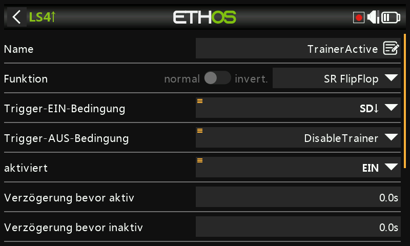
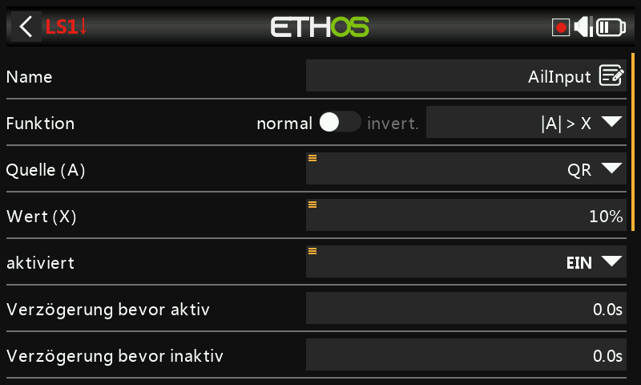
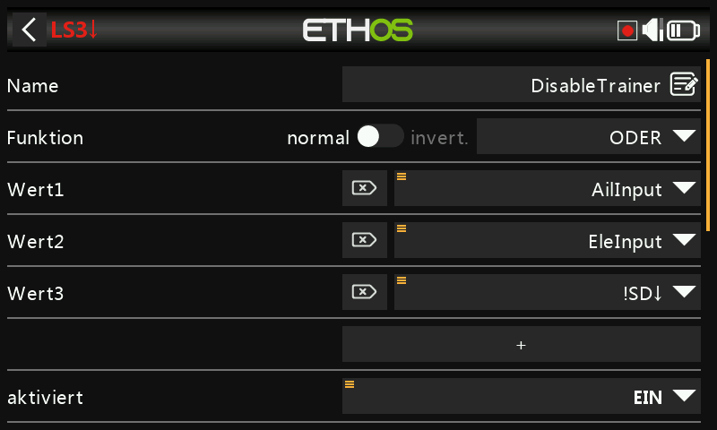

# Sofortige Steuerübernahme für die Trainer-Funktion

Eine nützliche Erweiterung der [Trainer](../model-setup/trainer.md)-Funktion:
Statt allein über einen Schalter kann der Lehrer die Kontrolle sofort
zurückholen, indem er einfach den Querruder- oder Höhenruderknüppel
bewegt — er muss im Problemfall nicht erst den Trainer-Schalter suchen.

Der Trainer-Schalter startet die Sitzung nach wie vor; die Trainer-Funktion
selbst wird von einem [Sticky-Logikschalter](../model-setup/logical-switches.md#sticky)
gesteuert, der entweder durch Ausschalten des Schalters **oder** durch
Erkennen einer Knüppelbewegung des Lehrers beendet wird.

## 1. Logischer Schalter zur Querruder-Erkennung

Ein logischer Schalter mit **|A| > X** auf dem Querruderknüppel, wahr,
sobald dieser um mehr als 10 % aus der Mittelstellung in eine der beiden
Richtungen bewegt wird. Drücken Sie lange auf die Querruder-Quelle und
wählen Sie **Trainer-Eingang ignorieren**, damit die Querruderbewegung des
*Schülers* (die über die Trainer-Verbindung eintrifft) den Schalter nicht
ebenfalls auslöst:

## 2. Logischer Schalter zur Höhenruder-Erkennung

Dasselbe Schema, angewendet auf den Höhenruderknüppel.

## 3. Logischer Schalter zum Abbrechen

Ein **OR**-Logikschalter, der wahr ist, wenn entweder der Querruder- oder
der Höhenruder-Erkennungsschalter wahr ist **oder** der Trainer-Schalter
(z. B. SD) nicht unten steht — d. h. sowohl „Lehrer hat einen Knüppel
bewegt“ als auch „Trainer-Schalter ausgeschaltet“ beendet die Sitzung.

## 4. Sticky-Logikschalter zur Trainer-Freigabe

Ein **Sticky**-Logikschalter: **Trigger ON** ist der Trainer-Schalter (SD
unten), **Trigger OFF** ist der Abbruch-Schalter aus Schritt 3. Verwenden
Sie diesen Sticky-Schalter — nennen Sie ihn `TrainerActive` — anstelle des
reinen Schalters als Aktivierungsbedingung der Trainer-Funktion.

## 5. Akustische Rückmeldung

Fügen Sie [Sonderfunktionen „Play Audio“](../model-setup/special-functions.md)
hinzu, die ansagen, wenn `TrainerActive` wahr wird und wenn der Zustand
wieder aufgehoben wird. So erhalten beide Piloten einen eindeutigen
akustischen Hinweis darauf, wann genau die Kontrolle wechselt.
