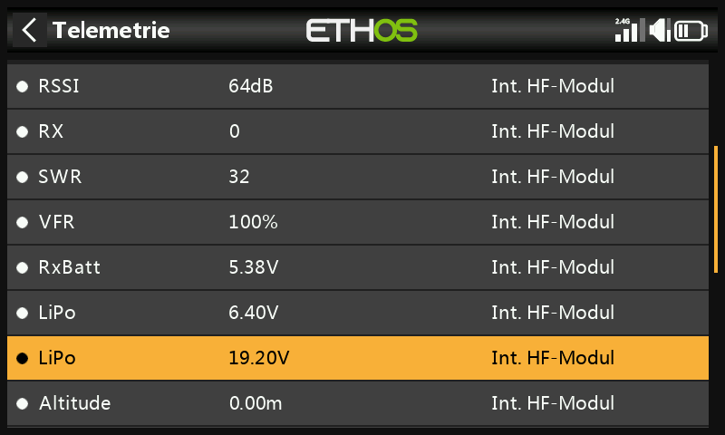
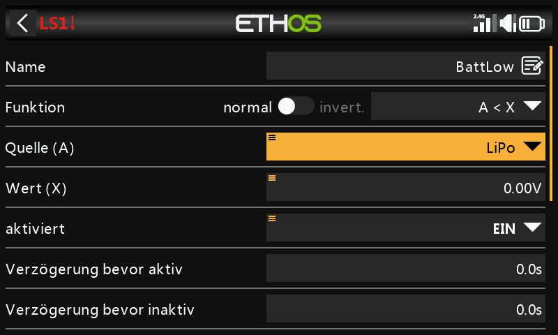
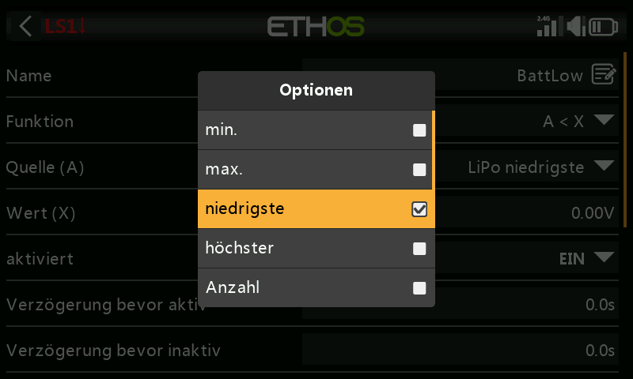
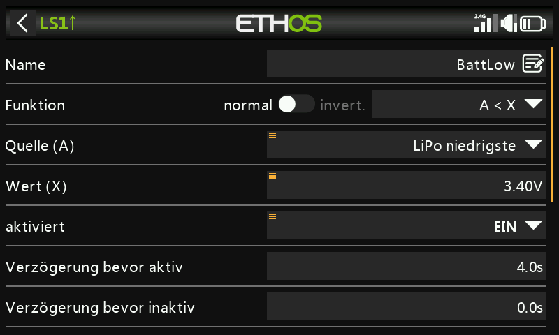
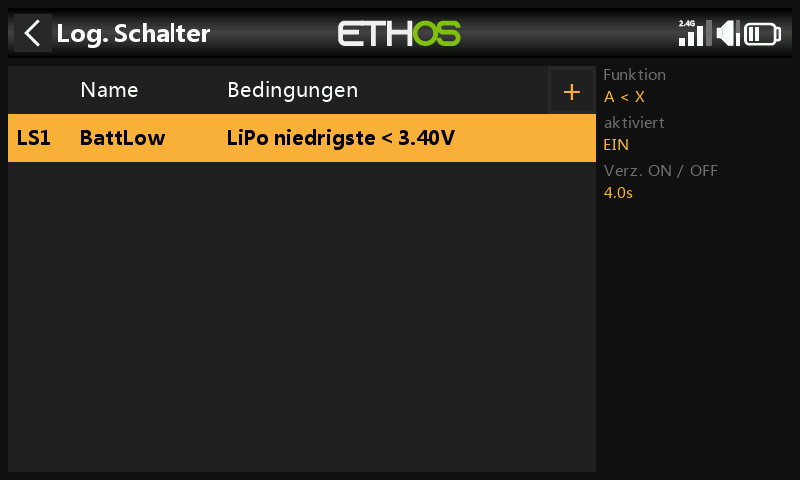
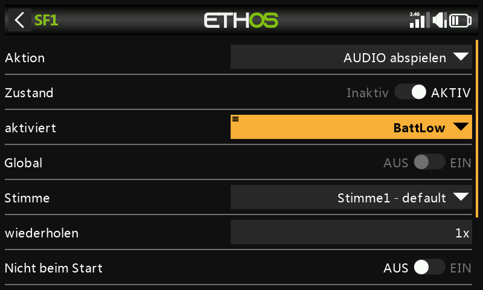
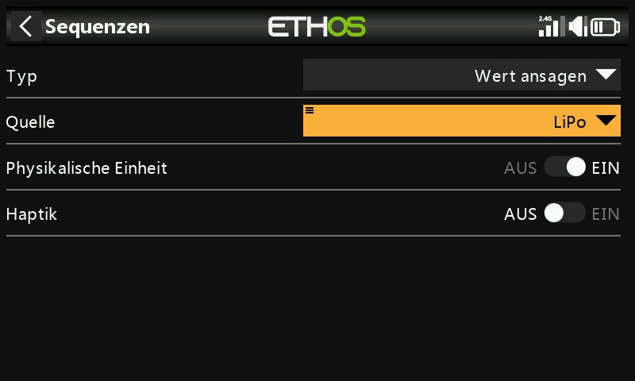
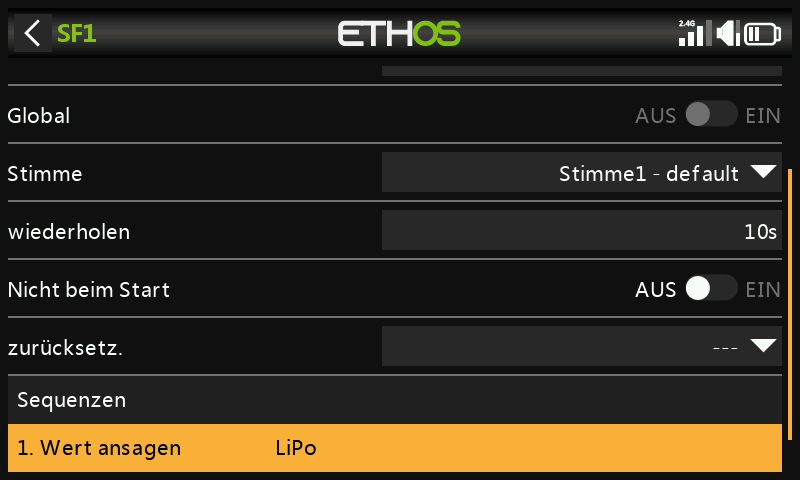

# Warnung bei niedriger Akkuspannung

Die Batteriespannung **unter Last** zu überwachen und einen Alarm auszulösen, wenn sie unter einen bestimmten Schwellenwert fällt, ist zuverlässiger, als sich auf einen festen Timer zu verlassen — mit einem Batteriespannungssensor wie dem FrSky FLVSS ist das problemlos möglich.

## 1. Sensor anschließen und finden

Setzen Sie in den [Empfängeroptionen den Telemetrieanschluss](../system-setup/devices.md) auf die Option **S.Port**, schließen Sie den FLVSS über ein S.Port-Kabel an Ihren Empfänger an und aktivieren Sie anschließend die Option **Sensoren finden** unter [Telemetrie](../model-setup/telemetry.md) — der LiPo-Sensor erscheint dann neben den bereits gefundenen Sensoren.

## 2. Logischen Schalter hinzufügen

Fügen Sie einen neuen [logischen Schalter](../model-setup/logical-switches.md) hinzu und wählen Sie den Lipo-Sensor als Quelle. Wenn der Lipo-Sensor markiert ist, drücken Sie lange die `ENT`-Taste, um einen Optionsdialog aufzurufen, in dem Sie auswählen, welcher seiner Werte verwendet werden soll:

- Minimale Akku-Packspannung / maximale Akku-Packspannung
- **Niedrigste Zellenspannung** / höchste Zellenspannung
- Zellenanzahl
- Einzelne Zellenspannungen (nur als Quelle auswählbar, wenn der Sensor tatsächlich an einen gebundenen Empfänger angeschlossen und ein Lipo angeschlossen ist)

Wählen Sie **niedrigste** (Zellenspannung) — den Wert, auf den es bei einem LVC-artigen Schutz ankommt.

Stellen Sie den Wert auf z. B. **3,4V** und die **Verzögerung bevor aktiv** auf **4 Sekunden**. Der logische Schalter wird WAHR/aktiv, wenn die niedrigste Zellenspannung 4 Sekunden oder länger unter 3,4 V pro Zelle bleibt. (Ein Schwellenwert von 3,4 V *unter Last* wird sich auf etwa 3,7 V erholen, wenn keine Last mehr anliegt — der Schwellenwert bildet also einen echten Spannungseinbruch ab und nicht nur kurzzeitige Störungen.)

## 3. Spezialfunktion hinzufügen

Fügen Sie eine [Spezialfunktion „AUDIO abspielen“](../model-setup/special-functions.md) hinzu, setzen Sie **aktiviert** auf den Logikschalter `BattLow`, wählen Sie die Stimme, die Sie verwenden möchten, und fügen Sie unter **Sequenz** einen **Wert ansagen**-Befehl für die LiPo-Gesamtspannung hinzu:

Mit **wiederholen** auf 10 Sekunden wird die Lipo-Spannung alle 10 Sekunden angesagt, solange die niedrigste Zelle unter dem Schwellenwert von 3,4 V für 4 Sekunden bleibt.
