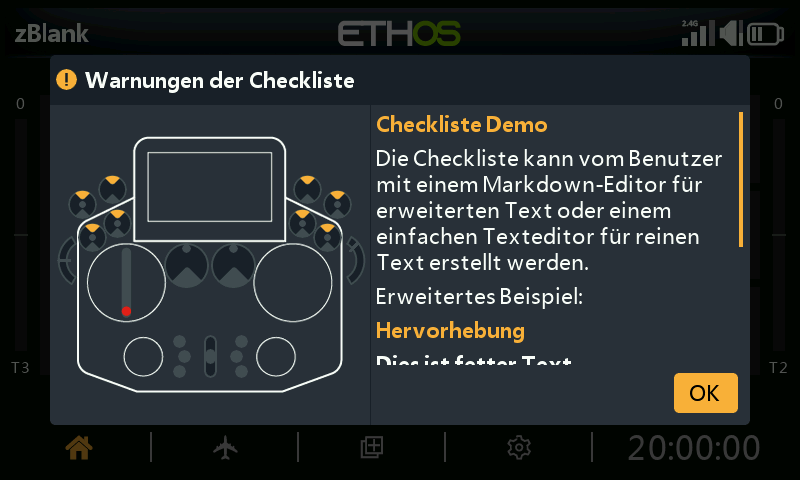

# Benutzerdefinierte Text-Checkliste



Die Funktion [Checkliste](../model-setup/checklist.md) kann beim Start
automatisch einen eigenen Text anzeigen – als reinen Text oder
Markdown-formatiert – und zwar bei jedem Laden des betreffenden Modells.

## 1. Checklistentext erstellen

**Reiner Text** – schreiben Sie ihn in einem beliebigen Texteditor
(Notepad++ oder auch MS Word, als reiner Text gespeichert) und speichern Sie
ihn als `<Modellname>.txt` ab.

**Erweiterter Text (Markdown)** – Ethos unterstützt Markdown-Formatierung,
z. B. `##` für eine Überschrift, `**fett**` für fetten Text. Verwenden Sie
einen beliebigen Texteditor (wobei Sie die Markdown-Syntax von Hand eingeben)
oder einen speziellen Markdown-Editor (Nextpad, MarkText usw.) und speichern
Sie die Datei als `<Modellname>.md` ab.

```markdown
## Emphasis
**this is bold text**
*this is italic text*
```

## 2. Datei auf den Sender kopieren

Kopieren Sie die Datei in denselben Ordner `models/`, in dem sich auch die
`.bin`-Datei des Modells befindet (siehe
[Dateimanager](../system-setup/file-manager.md#top-level-folders)), und werfen
Sie die Laufwerke des Senders sicher aus, bevor Sie ihn abstecken.

## 3. Ergebnis prüfen

Laden Sie das Modell – der Checklistentext erscheint nun automatisch als Teil
der Startprüfungen und lässt sich scrollen, falls er länger als eine
Bildschirmseite ist.
