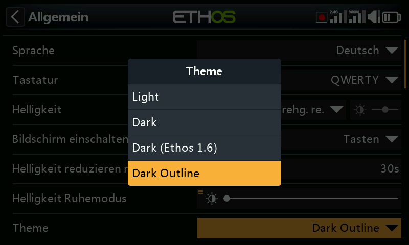
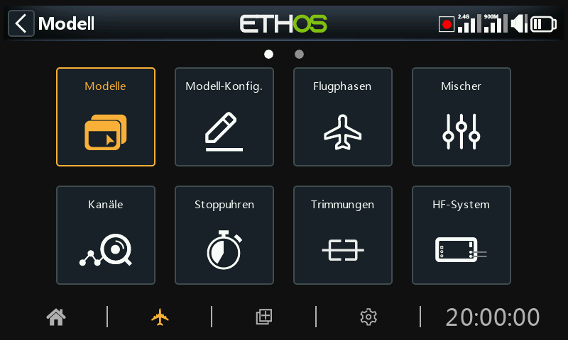

# Alternative Lua-Anzeigefarben

Alternative Anzeigefarben (Themes) für das Display können mithilfe eines Lua-Skripts installiert werden. Vier Beispiele finden sich im Ordner \`lua/examples/theme\` im Branch \`26.1\` des Ethos-Feedback-Community-Repositorys auf GitHub.

| Dunkel (Ethos 1.6) | Farben aus Ethos 1.6.6 |
| --- | --- |
| Dunkle Umrandung | Farben aus dem standardmäßigen „Dunkel“-Theme, jedoch mit Umriss-Fokusstil  
(2 px Rahmenbreite) |
| Dunkel (Kopie) | Farben aus dem standardmäßigen dunklen Design (auskommentiert) |
| Hell (Kopie) | Farben aus dem standardmäßigen hellen Design (auskommentiert) |

Um diese Themes zu installieren, beziehen Sie sich bitte auf die oben angegebene „Speicherort der ETHOS Lua-Beispielskriptdateien“, laden Sie die Datei „theme/main.lua“ herunter und speichern Sie diese in einem Ordner namens „theme“ innerhalb des Skript-Ordners auf Ihrer SD-Karte oder eMMC; alternativ können Sie ein Download-Tool verwenden, um den gesamten Ordner „theme“ herunterzuladen. Wenn Sie den Sender neu starten, werden die alternativen Themes installiert und stehen in der Dropdown-Liste „System / Allgemein / [Grundfarben](../system-setup/general.md)“ zur Verfügung.

Die Beispieldatei für Themes enthält auskommentierte Kopien der standardmäßigen hellen und dunklen Themes, die Sie an Ihre Vorlieben anpassen können.

Nach der Installation erscheinen zwei zusätzliche Themes in der Optionsliste unter System / Allgemein / Theme. Das erste ist die Farbe „Dark (Ethos1.6)“ mit den Farben und Schattierungen von Ethos 1.6.

Das zweite zusätzliche Design verwendet Umrisse zur Hervorhebung des Fokus anstelle der standardmäßigen invertierten Hervorhebung.
