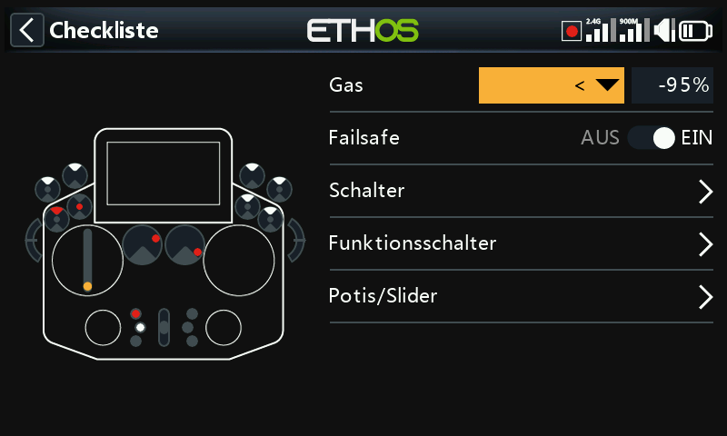
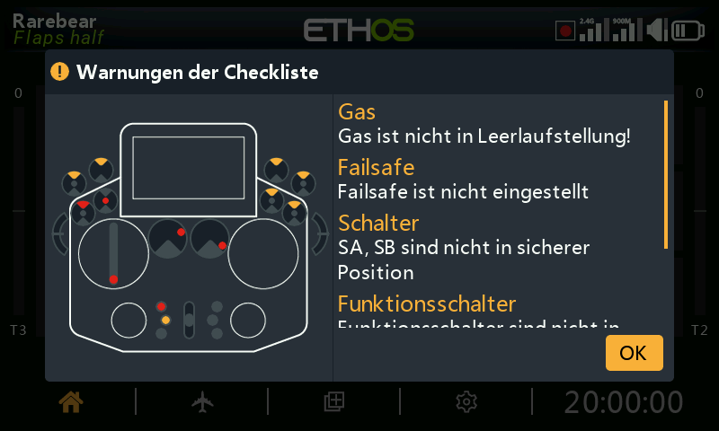
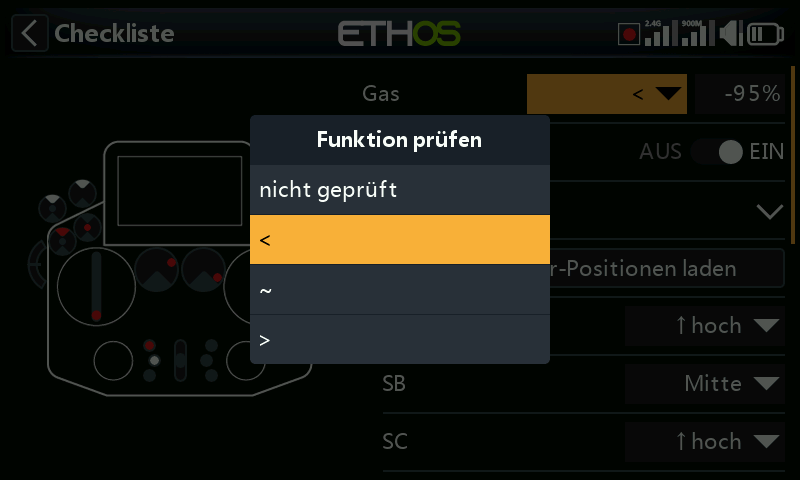
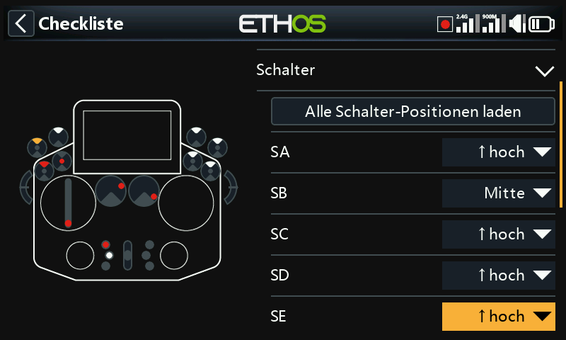
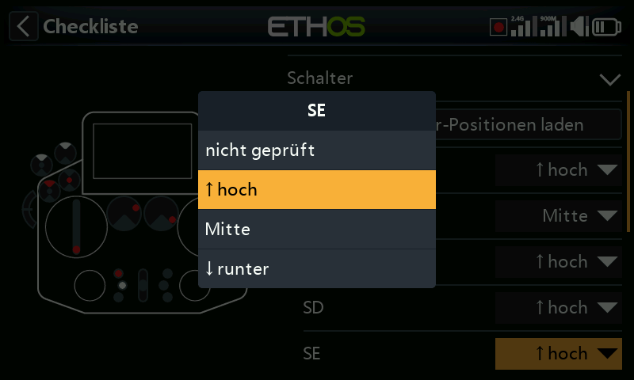
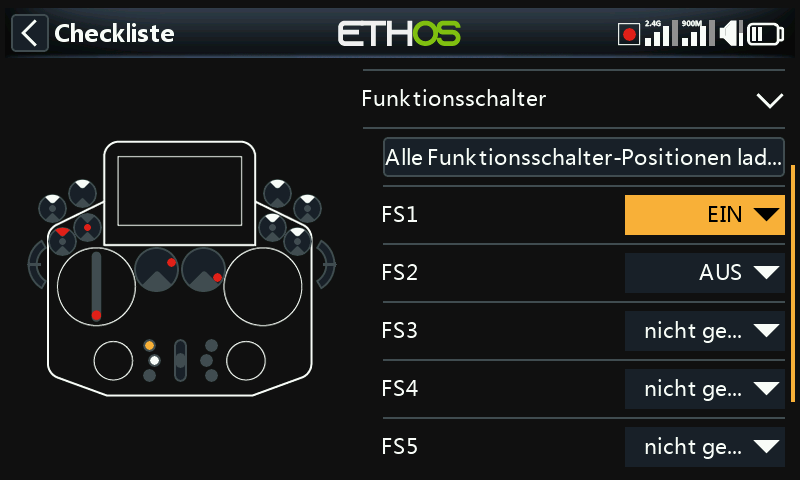
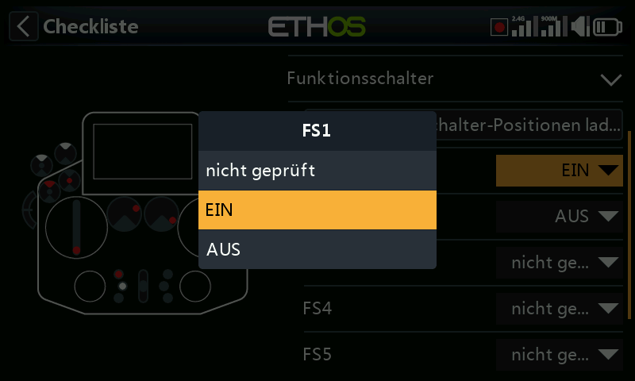
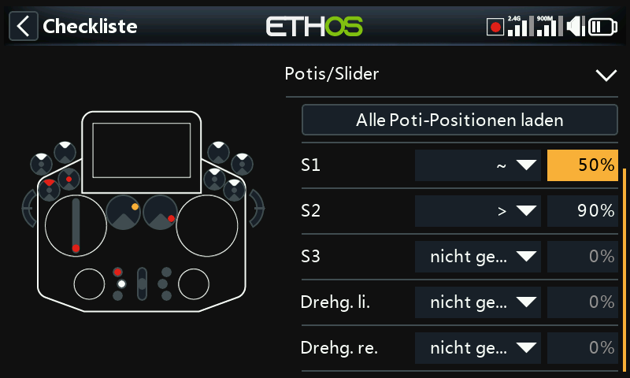
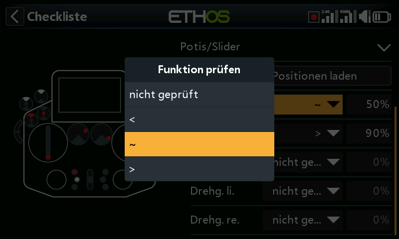

# Checkliste

Eine Reihe von Sicherheitsprüfungen vor dem Flug, die beim Einschalten des
Senders und/oder beim Laden eines Modells ausgeführt werden. Zu den
integrierten Prüfungen gehören Stummschaltung, nicht gesetztes Failsafe,
Schalter- und Geberstellungen sowie Sender- und RTC-Batterie — die
Schalterprüfung zeigt an, in welche Richtung jeder Schalter bewegt werden
muss, gekennzeichnet durch rote Punkte auf dem Warnbildschirm:

!!! note
    Sowohl `OK` als auch `RTN` überspringen die Vorflugprüfungen
    vollständig, unabhängig davon, was die Warnung auf dem Bildschirm
    nahelegt.

## Gasprüfung

Aktivieren Sie die Prüfung und wählen Sie einen Operator — `<` (kleiner
als), `~` (ungefähr gleich) oder `>` (größer als) — im Vergleich zu einem
Wert; es wird gewarnt, wenn sich der Gasknüppel außerhalb des von diesem
Vergleich zugelassenen Bereichs befindet.

## Failsafe-Prüfung

Warnt, wenn für das aktuelle Modell kein [Failsafe](rf-system.md#failsafe)
gesetzt wurde.

!!! tip
    Es wird dringend empfohlen, diese Prüfung aktiviert zu lassen.

## Schalterprüfung

Für jeden Schalter kann eine bestimmte Stellung beim Start verlangt werden
(Schalter mit eigenen Namen aus [Systemeinstellungen →
Hardware](../system-setup/hardware.md#switches-settings) werden mit diesen
Namen angezeigt). **Alle Schalterstellungen laden** übernimmt die
*aktuellen* physischen Stellungen als Sollstellungen für jeden Schalter,
der nicht mit **Keine Prüfung** gekennzeichnet ist.

## Prüfung der Funktionsschalter

Dasselbe Prinzip gilt für die sechs
[Funktionsschalter](model-edit.md#function-switches). **Alle
Funktionsschalterstellungen laden** funktioniert genauso wie oben
beschrieben.

## Prüfung der Potis / Schieberegler

Verlangt beim Start bestimmte Stellungen der Potis bzw. Schieberegler,
und zwar einzeln für jedes Bedienelement (`~`/`<`/`>`, wie bei der
Gasprüfung). **Alle Potistellungen laden** übernimmt die aktuellen
Stellungen automatisch — prüfen Sie anschließend die automatisch
gewählten Operatoren sorgfältig, da `~` gegenüber `<`/`>` möglicherweise
nicht dem entspricht, was Sie tatsächlich beabsichtigt haben.

## Benutzerdefinierter Text

Zeigt eine Datei mit einfachem oder erweitertem Text als Teil der
Startcheckliste an, sobald sie für das Modell eingerichtet ist. Die
vollständige Einrichtung finden Sie unter [Anleitung: Benutzerdefinierte
Text-Checkliste](../how-to/user-defined-checklist.md).
