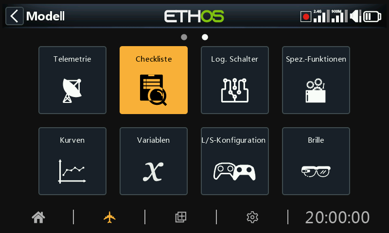

# Checkliste

Die Checklistenfunktion bietet eine Reihe von Vorflugkontrollen. Dabei handelt es sich um eine Gruppe von Sicherheitsfunktionen, die beim Einschalten des Funkgeräts und/oder beim Laden eines Modells aus der Modellliste wirksam werden.

Zu den Standardprüfungen gehören: Sender ist im Stummen Modus, Failsafe nicht gesetzt, Schalter und Potis prüfen, Sender mit schwachem Akku, RTC-Batterie schwach, usw. Die Schalterprüfung zeigt die Richtung an, in die der Schalter bewegt werden sollte, siehe die roten Punkte im Beispiel des Warnbildschirms oben.

Bitte beachten Sie, dass im Gegensatz zur obigen Warnung die OK- oder RTN-Taste die Vorflug-Checks überspringt.

Zusätzliche Checks können unten eingestellt werden.

## Gasstellung prüfen

Um die Gasprüfung zu aktivieren, wählen Sie den zu verwendenden Operator. Die Optionen sind '<' kleiner als, '~' ungefähr gleich, oder '>' größer als. Der Vorflug-Check warnt Sie, wenn der Gasknüppel außerhalb des im Wert-Parameter eingestellten Werts liegt.

## Failsafe-Prüfung

Wenn diese Option aktiviert ist, werden Sie gewarnt, wenn Failsafe für das aktuelle Modell nicht eingestellt wurde. Es ist sehr ratsam, dies aktiviert zu lassen!

## Schalter prüfen

Für jeden Schalter können Sie festlegen, ob der Sender diese Schalter in den gewünschten vordefinierten Positionen anfordert. Wenn den Schaltern in System / Hardware / 'Schaltereinstellungen' benutzerdefinierte Namen gegeben wurden, werden diese Namen angezeigt.

Mit der Option „Alle Schalter-Stellungen laden“ können Sie die gewünschten Positionen aus den aktuellen Schalterpositionen auslesen, mit Ausnahme derjenigen, die mit „nicht geprüft“ markiert sind.

Die Kontrollmöglichkeiten sind oben dargestellt.

## Funktionsschalter prüfen

Für jeden Funktionsschalter können Sie festlegen, ob das Funkgerät die Schalter in die gewünschten vordefinierten Positionen bringen soll. Die Optionen sind oben dargestellt.

Die Option „Alle Funktionsschalter-Positionen laden“ kann verwendet werden, um die gewünschten Positionen aus den aktuellen Funktionsschalterpositionen zu lesen, mit Ausnahme derjenigen, die mit „nicht geprüft“ markiert sind.

## Potis / Sliders prüfen

Legt fest, ob der Sender die Potis und Schieberegler beim Einschalten in vordefinierten Positionen anfordert. Die gewünschten Potiwerte können für jedes Poti eingegeben werden.

Mit der Option „Alle Poti-Stellungen laden“ können die gewünschten Positionen aus den aktuellen Potentiometern gelesen werden, mit Ausnahme derjenigen, die mit „nicht geprüft“ markiert sind. Es muss sorgfältig geprüft werden, ob die automatisch gewählten Operatoren wie gewünscht sind (d.h. '~' vs. '<' oder '>').

Alternativ können die Prüffunktionen auch einzeln eingestellt werden (d. h. '~' gegenüber '<' oder '>').

## Benutzerdefinierter Text

Die Funktion Checkliste kann auch benutzerdefinierten Text anzeigen. Bei dem Text kann es sich um reinen Text oder erweiterten Text handeln.

Sobald die Textdatei für ein bestimmtes Modell installiert ist und dieses Modell geladen wird, zeigt das Funkgerät die Checkliste als Teil der Startroutine an. Bitte lesen Sie im Abschnitt „Anleitung“ nach, wie Sie eine benutzerdefinierte Text-Checkliste einrichten.
