# Kurven

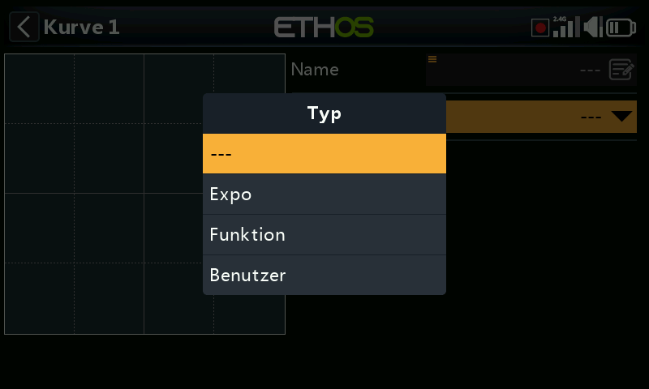

Wiederverwendbare Übertragungskurven für [Mischer](mixes.md#anatomy-of-a-mix) oder
[Ausgänge](outputs.md#editing-a-channel) — das integrierte Expo steht in beiden
direkt zur Verfügung, alles Weiterführende wird hier definiert (oder über
**Kurve hinzufügen**, das direkt aus beiden Bearbeitungsbildschirmen erreichbar
ist). Bis zu 50 Kurven sind verfügbar; standardmäßig existiert keine davon (Expo
ist unabhängig davon immer integriert). Mit **+** wird eine Kurve hinzugefügt;
durch Antippen einer vorhandenen Kurve erscheinen
**Bearbeiten**/**Verschieben**/**Kopieren-Einfügen**/**Klonen**/**Löschen**.

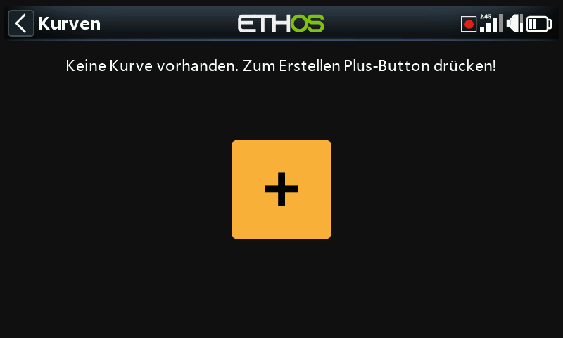

## Kurventypen

- **Expo** — Standardwert 40; positive Werte machen die Reaktion um die
  Mittelstellung weicher, negative Werte machen sie schärfer. Eine weichere
  Reaktion um die Knüppelmitte hilft, Übersteuerung zu vermeiden, insbesondere
  bei weniger erfahrenen Piloten.

  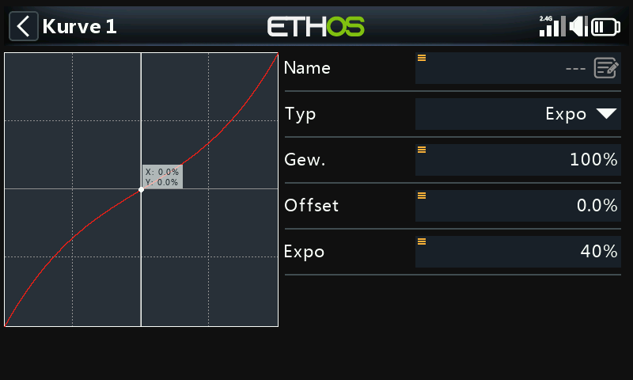

- **Funktion** — ein kleiner Satz fester mathematischer Formen:

  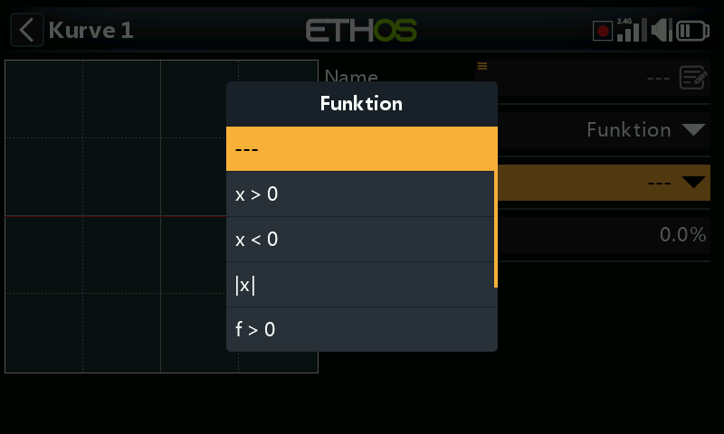

  - **x > 0** — gibt die Quelle im positiven Bereich unverändert weiter; im
    negativen Bereich wird 0 ausgegeben.

    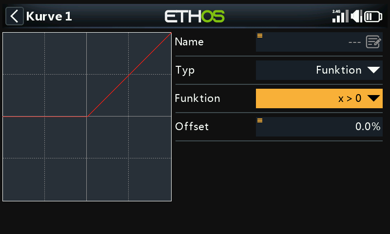

  - **x < 0** — das Spiegelbild: gibt im negativen Bereich weiter, im positiven
    Bereich 0.

    

  - **|x|** — gibt die Quelle als Absolutwert weiter (immer positiv).

    

  - **f > 0** — gibt 100 % aus, solange die Quelle positiv ist, und 0, solange
    sie negativ ist (ein harter Umschalter, keine Durchleitung).

    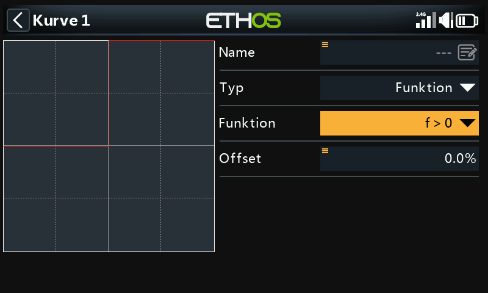

  - **f < 0** — gibt −100 % aus, solange die Quelle negativ ist, und 0, solange
    sie positiv ist.

    

  - **|f|** — gibt −100 % im negativen und +100 % im positiven Bereich aus.

    

  Jeder Kurventyp — auch Funktion — besitzt zudem einen **Offset**, der die Kurve
  auf der Y-Achse nach oben oder unten verschiebt (eine Nachkommastelle
  Genauigkeit, wie bei Y-Werten generell):

  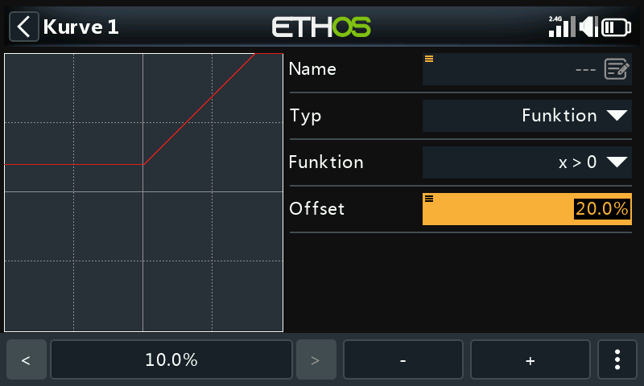

- **Benutzerdefiniert** — eine punktbasierte Kurve, standardmäßig mit 5 Punkten,
  maximal 21.

  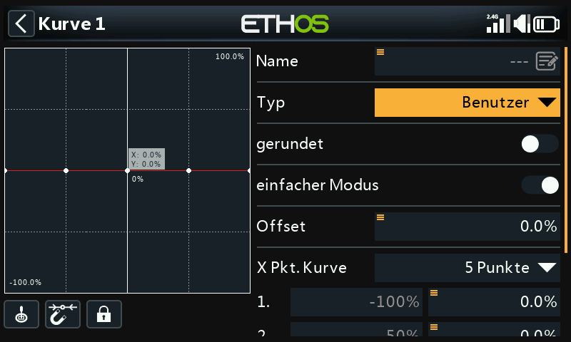

  - **Glätten** — legt eine glatte Kurve durch alle Punkte statt gerader
    Teilstrecken zwischen ihnen.

    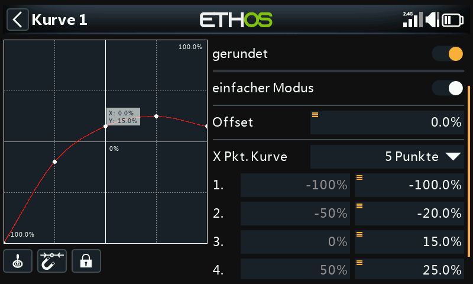

  - **Einfacher Modus** — **Ein** beschränkt die Bearbeitung auf gleichmäßig
    verteilte Y-Koordinaten (X ist fest); **Aus** erlaubt die Bearbeitung von X
    und Y je Punkt, ausgenommen die Endpunkte bei −100 %/+100 %, die gesperrt
    sind, da die Kurve stets den gesamten Signalbereich abdecken muss.

    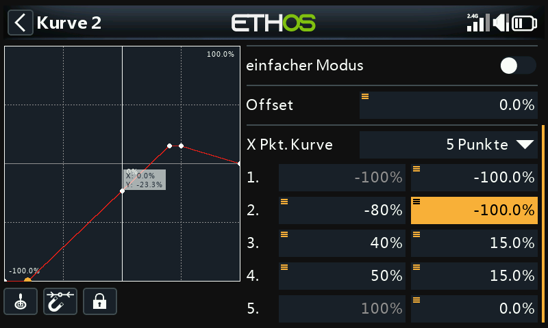

  **Bedienelemente des Editors** (gleiches Schema wie beim [Editor für
  Ausgleichskurven der Ausgänge](outputs.md#balance-channels)):

  - **Quelle** — standardmäßig die eigene(n) Mischerquelle(n) der Kurve, oder
    **Automatischer Analogeingang**, um den zuerst bewegten
    Steuerknüppel/Schieberegler/Potentiometer zu übernehmen.
  - Einrasten auf den nächstgelegenen Punkt beim Drehgeber sowie ein Schalter
    **Sperren**, um die Eingaben einzufrieren, während die resultierende Bewegung
    der Ruderfläche beobachtet wird.
  - Ein Live-Cursor zeigt den aktuellen Eingangswert, der die Kurve ansteuert, um
    ihn vor dem Anpassen mit einem Punkt in Deckung zu bringen.

## Eine Kurve über eine Var ansteuern

Sowohl der **Offset** einer Funktionskurve als auch ein einzelner Punkt einer
**benutzerdefinierten** Kurve können anstelle eines festen Werts von einer
[Var](variables.md) angesteuert werden — und diese Var lässt sich wiederum über
eine umgewidmete Trimmung im Flug verstellen:

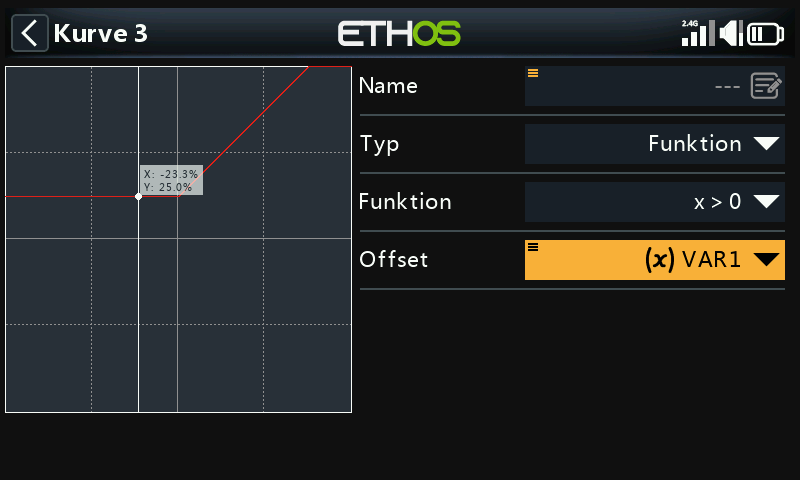
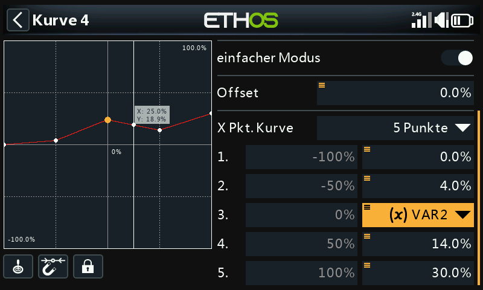

Siehe [Variablen](variables.md) und [Anleitung: Im Flug verstellbare
Kompensationskurve](../how-to/in-flight-compensation-curve.md) für ein
vollständig durchgearbeitetes Beispiel dieses Musters.
