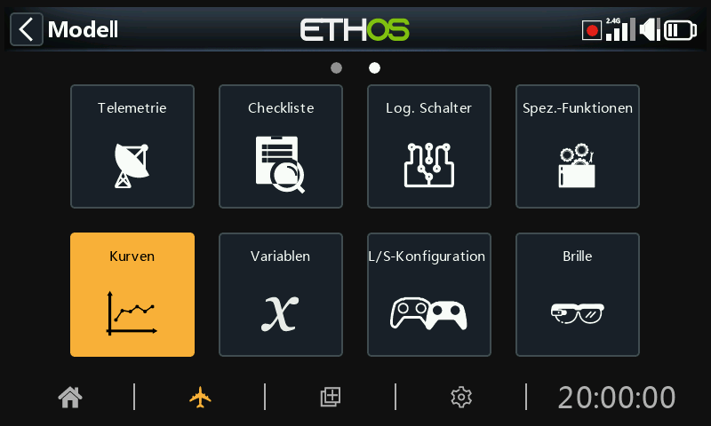
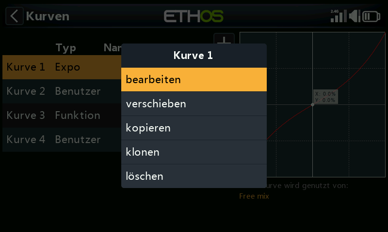
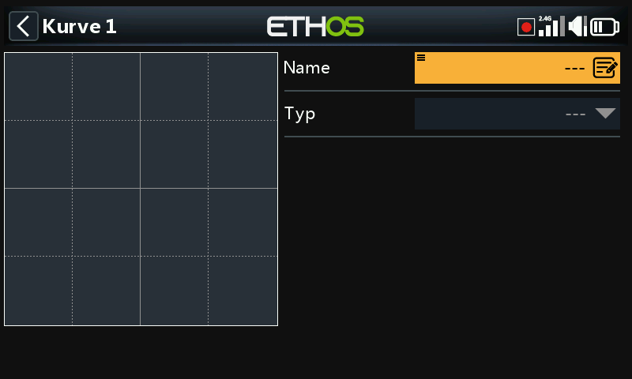
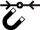
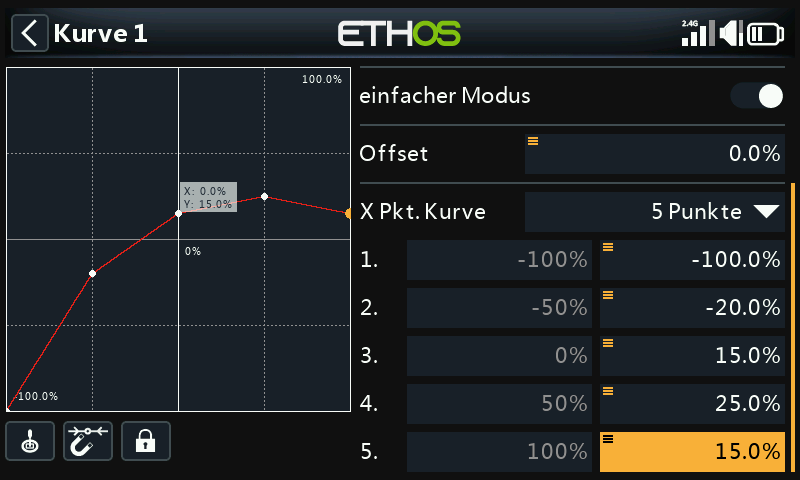

# Kurven

Kurven können verwendet werden, um das Regelverhalten in den Mischern oder Kanäle zu ändern. Während die Standard-Expo-Kurve direkt in diesen Abschnitten verfügbar ist, wird dieser Abschnitt verwendet, um benutzerdefinierte Kurven zu definieren, die erforderlich sein könnten. Die Funktion „Kurve hinzufügen“ kann auch direkt von dem Editierbildschirmen der Mischer und Kanäle aus aufgerufen werden.

Es sind 50 Kurven verfügbar.

Es gibt keine Standardkurven (außer Expo, das integriert ist). Tippen Sie auf die Schaltfläche „+“, um eine neue Kurve hinzuzufügen.

Sobald die Kurven definiert sind, erscheint durch Antippen einer Kurve ein Popup-Menü, über das Sie diese Kurve bearbeiten, verschieben, kopieren/einfügen, klonen oder löschen können.

Auf dem Startbildschirm können Sie Ihre Kurve benennen und den Kurventyp auswählen.

Die verfügbaren Kurventypen sind:

## Expo

Die Standard-Exponentialkurve hat einen Wert von 40.

Ein positiver Wert macht die Reaktion um 0 herum weicher, während ein negativer Wert die Reaktion um 0 herum schärfer macht. Das Abschwächen der Reaktion um die Knüppelmitte herum hilft, eine Übersteuerung des Modells zu vermeiden, insbesondere für Anfänger.

## Funktion

Die folgenden mathematischen Funktionskurven sind verfügbar:

### x > 0

Wenn der Quellenwert positiv ist, folgt der Kurvenausgang der Quelle.

Wenn der Quellenwert negativ ist, ist der Kurvenausgang 0.

#### Offset

Beachten Sie, dass alle Kurven einen positiven oder negativen Offset haben können, der die Kurve auf der Y-Achse nach oben oder unten verschiebt. Kurvenversatz und Y-Wert haben eine Genauigkeit von einer Dezimalstelle.

### x < 0

Wenn der Quellenwert negativ ist, folgt der Kurvenausgang der Quelle.

Ist der Quellenwert positiv, so ist der Kurvenausgang 0.

### |x|

Der Kurvenausgang folgt der Quelle, ist aber immer positiv (auch „Absolutwert“ genannt).

### f > 0

Wenn der Quellwert negativ ist, ist der Kurvenausgang 0.

Wenn der Quellwert positiv ist, beträgt der Kurvenausgang 100 %.

### f < 0

Wenn der Quellwert negativ ist, beträgt der Kurvenausgang -100%.

Wenn der Quellwert positiv ist, ist der Kurvenausgang 0.

### |f|

Wenn der Quellwert negativ ist, beträgt die Kurvenausgabe -100%.

Wenn der Quellwert positiv ist, wird die Kurve zu +100% ausgegeben.

## Benutzer

### Anzahl der Punkte

Die standardmäßige benutzerdefinierte Kurve hat 5 Punkte. Sie können zwischen 2 und 21 Punkte in Ihrer Kurve haben.

  Die in den Mischern der Kurve konfigurierte(n) Quelle(n) kann/können verwendet werden, oder optional jeder andere geeignete Analogeingang. Wenn Sie die Option „Automatischer Analogeingang“ wählen, wird der erste Knüppel, Schieberegler oder Regler, den Sie bewegen, als Quelle für X verwendet.

##### Menü-Tasten

Wenn diese Option ausgewählt ist, wird automatisch der nächstgelegene Kurvenpunkt auf der X-Achse für die Einstellung mit dem Drehgeber ausgewählt.

Der Eingang muss so eingestellt werden, dass der X-Wert auf einen Kurvenpunkt ausgerichtet ist, bevor die Einstellung vorgenommen wird.

 Durch Tippen auf dieses Symbol oder Drücken der EINGABE-Taste im Diagrammbearbeitungsmodus können Sie den Sperrmodus ein- und ausschalten. Wenn dieser Modus aktiviert ist, werden alle Eingaben gesperrt, so dass Sie die Steuerknüppeleingabe loslassen können und die Steuerflächen beobachten können, während Sie Ihre Kurve anpassen.

Zur Unterstützung bei der Einrichtung ist der Cursor aktiv und zeigt den Wert des Eingangs an, der die Kurve steuert.

Kurvenversatz und Y-Wert haben eine Genauigkeit von einer Dezimalstelle.

### Gerundet

Wenn diese Option aktiviert ist, wird eine gerundete Kurve durch alle Punkte erstellt.

### Einfacher Modus = Ein

Der einfache Modus hat äquidistante Festwerte auf der X-Achse und erlaubt nur die Programmierung der Y-Koordinaten für die Kurve.

### Einfacher Modus = Aus

#### Punkte

Bei ausgeschaltetem „Einfachen Modus“ können sowohl die X- als auch die Y-Koordinaten konfiguriert werden (siehe Beispiel oben).  Beachten Sie, dass die -100% und +100% X-Koordinaten für die Endpunkte der Kurve nicht bearbeitet werden können, da die Kurve den gesamten Signalbereich abdecken muss.

## Funktionskurven-Offset Änderung im Flug

Das obige Beispiel zeigt den Offset-Parameter einer Kurve vom Typ „Funktion“, die von einer Var gesteuert wird, die möglicherweise während des Fluges durch eine neu zugewiesene Trimmung angepasst werden könnte.

## Änderung des Kurvenpunkts im Flug

In diesem Beispiel wird der mittlere Kurvenpunkt von einer Var gesteuert, die wiederum im Flug durch eine neu zugewiesene Trimmung angepasst werden kann. Bitte lesen Sie den Abschnitt [VARs ](variables.md)für weitere Details.
