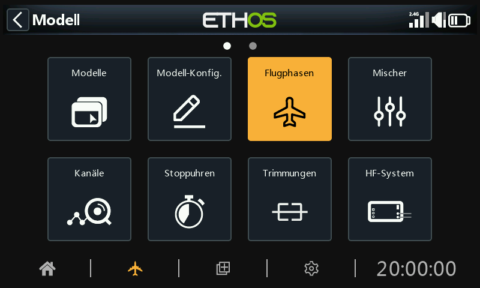
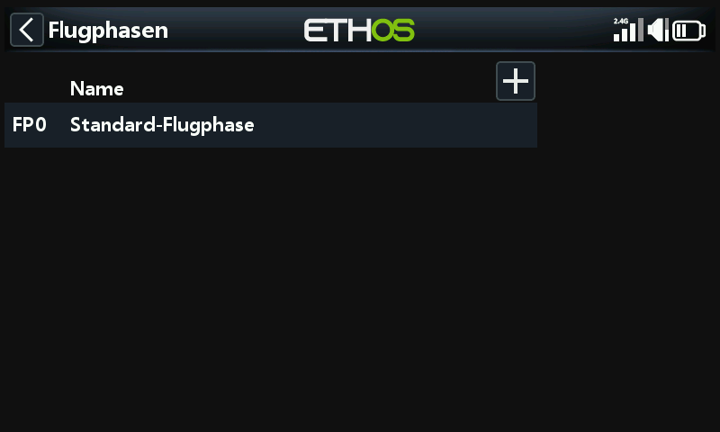
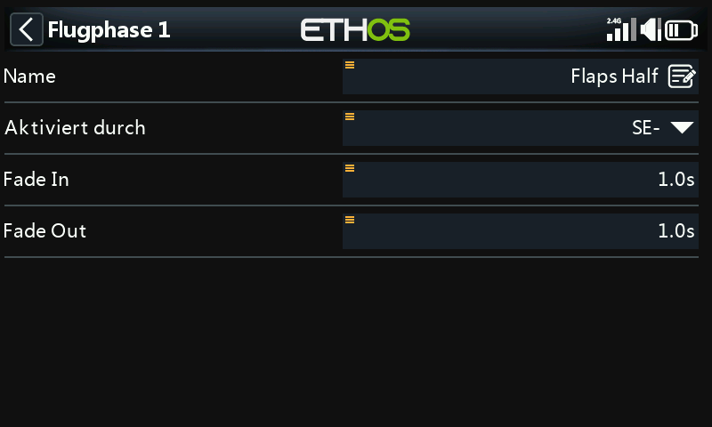
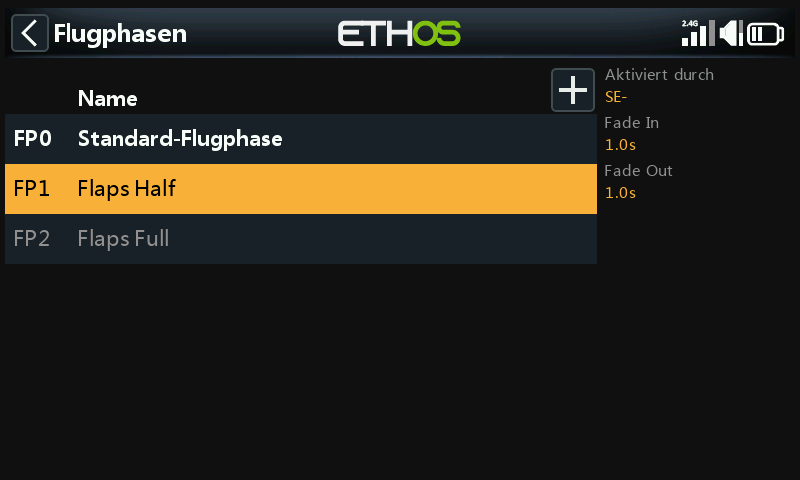
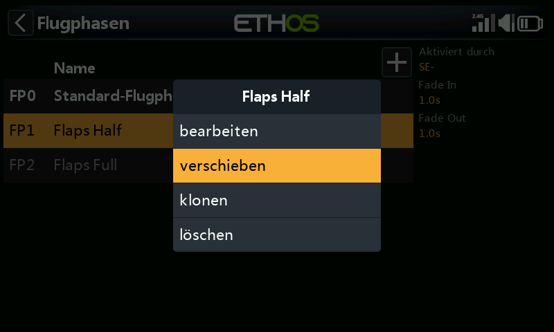
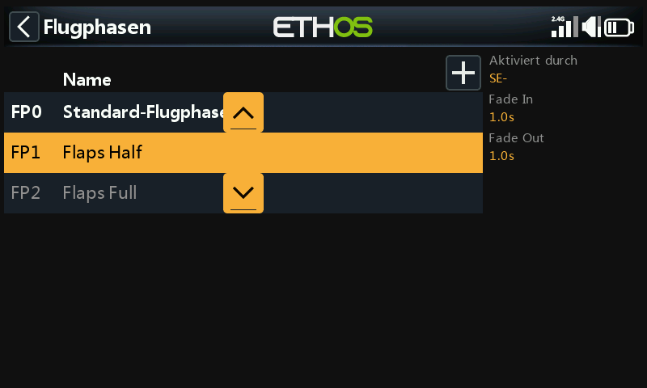

# Flugphasen

Flugphasen bieten eine unglaubliche Flexibilität bei der Einrichtung eines Modells, da sie es ermöglichen, Modelle für bestimmte Aufgaben oder ein bestimmtes Flugverhalten per Schalter einzustellen. Beispielsweise können Segelflugzeuge so eingestellt werden, dass sie über Schalter wählbare Phasen wie Start, Reiseflug, Geschwindigkeit und Thermik haben. Motorflugzeuge können Flugphasen für normalen Präzisionsflug, Start und Landung mit halb oder ganz ausgefahrenen Klappen haben. Bei Hubschraubern gibt es Phasen wie Normal für das Anfahren und Starten/Landen, Drehzahl 1 für Kunstflug und Drehzahl 2 für 3D.

Die Flugphasen nehmen dem Piloten einen großen Teil der Schalt- und Trimmarbeit ab. Die große Stärke der Flugphasen besteht darin, dass sie unabhängige Trimmungen unterstützen und auch zur Aktivierung von Vars und Mischer verwendet werden können. Zusammen ermöglichen diese Funktionen eine große Flexibilität. In der [Einführung in die Flugphasen](../tutorials/basic-fixed-wing.md) im Abschnitt Tutorials finden Sie Beispiele für die Anwendung dieser Funktionen.

Der Standard-Flugphase FM0 ist bis zur Konfiguration inaktiv. Tippen Sie auf die Schaltfläche „+“, um einen neuen Flugphase  hinzuzufügen. Pro Modell können bis zu 20 Flugphasen vorhanden sein.

## Name

Ermöglicht die Benennung der Flugphase.

## Aktiver Zustand

Beim Hinzufügen einer Flugphase ist der aktive Standardzustand inaktiv, d. h. '---'. Flugphasen können durch Schalter- oder Tastenpositionen, Funktionsschalter, Logikschalter, ein Systemereignis wie Gasabschaltung oder -haltung oder Trimmpositionen gesteuert werden.

Beachten Sie, dass der Standard-Flugphase keinen Parameter „Aktive Bedingung“ hat, da dies die Flugphase ist, der immer aktiv ist, wenn keine andere Flugphase aktiv ist. Die erste Flugphase, bei dem der Schalter auf EIN steht, ist die aktive Flugphase. Beachten Sie, dass immer nur eine Flugphase aktiv ist.

Die aktive Flugphase ist fett gedruckt.

## Einblendung, Ausblendung (Fade In, Fade Out)

Die Zeiten, die für reibungslose Übergänge zwischen den Flugphasen zugewiesen werden. Im Beispiel wird jeweils eine Sekunde zugewiesen. Bitte beachten Sie, dass das Ein- und Ausblenden der Flugphasen nur funktioniert, wenn der Mischer flugphasenabhängig ist.

Nach der Programmierung werden die ausgewählten Flugphasen in den Mischern angezeigt. Es können bis zu 19 zusätzliche Flugphase programmiert werden. Wie bei den meisten Funktionen in ETHOS kann der Benutzer beschreibende Namen für die Flugphasen programmieren, wie z.B. Cruise, Speed, Thermik oder Normal, Start, Landung.

Bitte beachten Sie, dass beim Hinzufügen einer neuen Flugphase zu einem Modell alle Mischer, die Flugphasen verwenden, auf korrekte Funktion überprüft werden müssen, da die neue Flugphase standardmäßig in allen Mischern, die Flugphasen verwenden, aktiv ist. Dies ist z.B. ein Problem, wenn ein Lock-Mix verwendet wird, um einen bestimmten Kanal in einer bestimmten FM zu sperren.

## Flugphasenverwaltung

Tippen Sie auf einer Flugphase, um ein Menü aufzurufen, in dem Sie Flugphasen bearbeiten, verschieben, klonen oder löschen können. Neue Flugphasen können durch Tippen auf die Schaltfläche „+“ in der Überschrift hinzugefügt werden.

Eine geklonte FP erbt die Flugphasen-Einstellungen des Elternteils in den Mischern, so dass sich die Mischer gleich verhalten und auch aktiv sind (oder nicht), wenn die geklonte FP aktiv ist. Der neue Klon sollte als letzter FP hinzugefügt werden, damit er nicht mit einem bestehenden FP kollidiert.

Sie können die Option „Verschieben“ verwenden, um die Priorität einer Flugphase zu ändern. Die Priorität der Flugphase ist in aufsteigender Reihenfolge, und der erste, dessen Schalter eingeschaltet ist, ist der aktive.
