# Brille

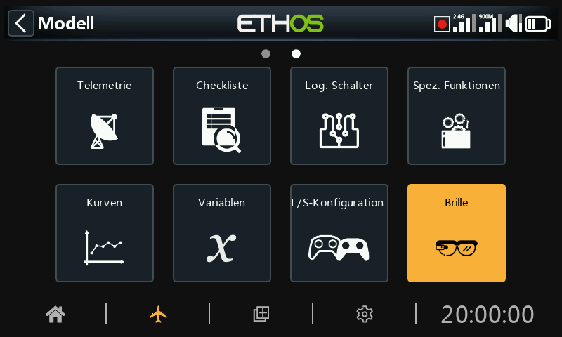

Über das Menü „Brille“ lassen sich ActiveLook-Brillen verbinden und konfigurieren, sodass der Träger Flugdaten, Telemetriedaten und FPV-Videos in Echtzeit als Head-up-Display auf der Brille anzeigen kann.

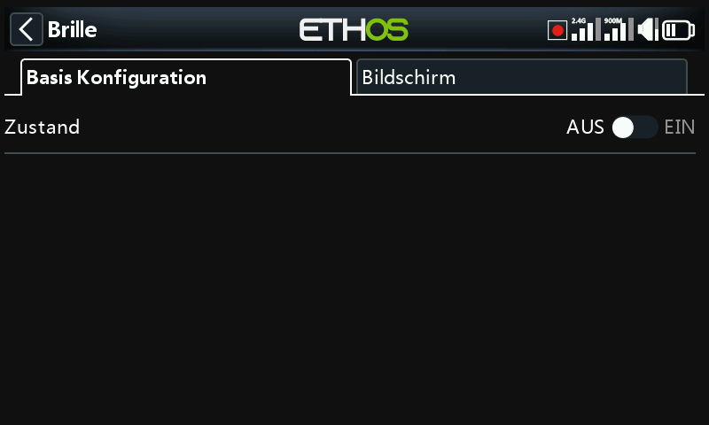

Das Brillen-Menü besteht aus zwei Registerkarten: „Basis Konfiguration“ für die Verbindungskonfiguration und „Bildschirm“ für die Konfiguration des Head-up-Displays.

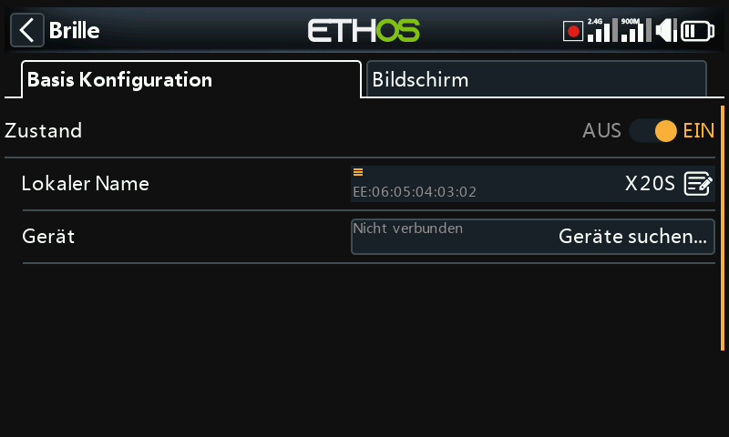

## Basis Konfiguration

### Zustand

Die Brillenfunktion kann aktiviert/deaktiviert werden.

### Lokaler Name

#### Lokale Adresse

Dies ist die lokale Bluetooth-Adresse des Senders.

Dies ist der lokale Bluetooth-Name, der auf verbundenen Geräten angezeigt wird. Standardmäßig wird das Name des Sendermodells verwendet, dieser Name kann hier jedoch geändert werden.

### Gerät

#### Suchen

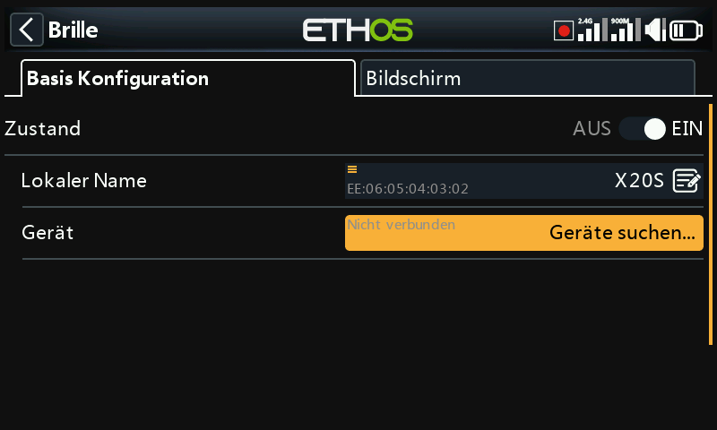

Tippen Sie auf „Geräte suchen“, um den Sender in den Bluetooth-Suchmodus zu versetzen.

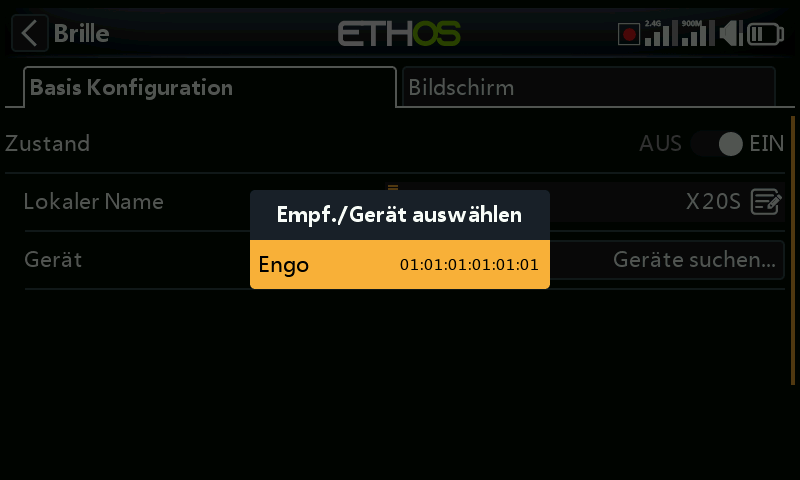

Die gefundenen Geräte werden in einem Popup-Dialog angezeigt, in dem Sie aufgefordert werden, eines der gefundenen Geräte auszuwählen. Wählen Sie die Bluetooth-Adresse aus, die zu der zu verwendenden Brille passt.

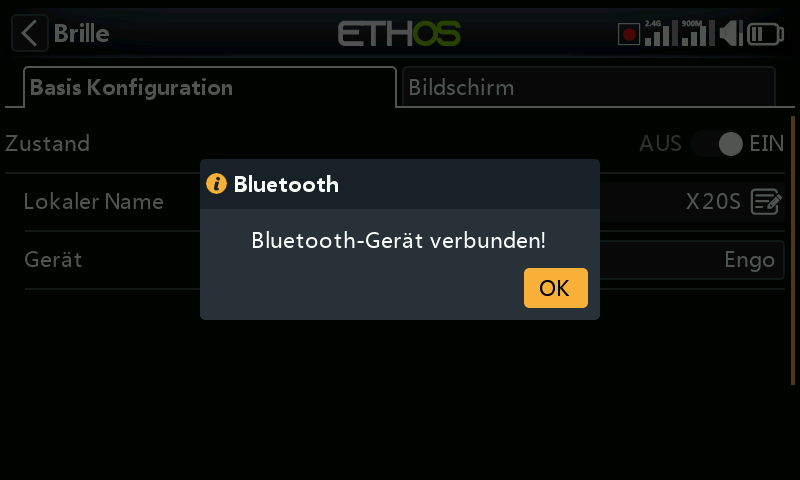

Das ausgewählte Bluetooth-Gerät wurde verbunden.

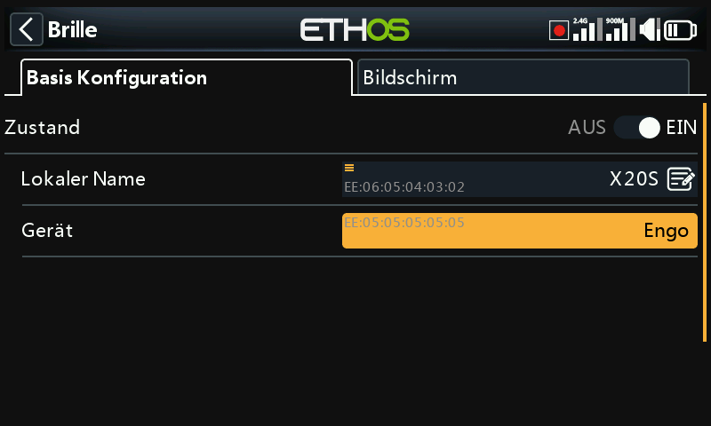

Sobald das Brillengerät gefunden und verbunden wurde, wird die Bluetooth-Adresse der Brille in der Gerätezeile angezeigt.

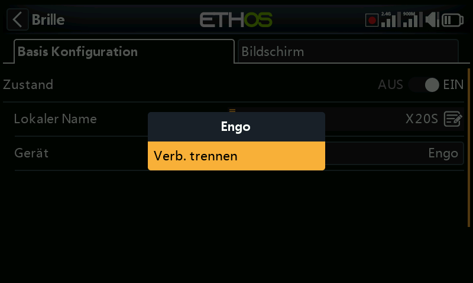

#### Verb. trennen

Auf dem Gerät eine App aufrufen, um die Option „Trennen“ anzuzeigen.

## Bildschirm

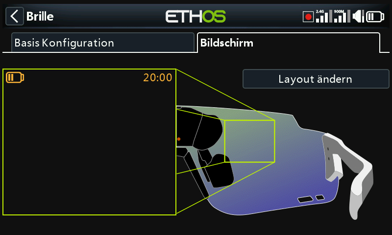

Über die Registerkarte „Bildschirm“ kann das Head-up-Display konfiguriert werden.

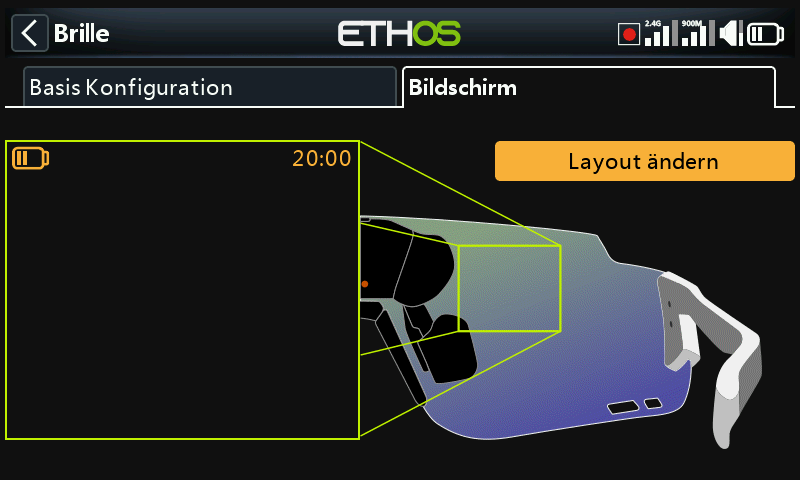

Tippen Sie auf die Schaltfläche „Layout ändern“, um den Dialog zur Layoutauswahl zu öffnen.

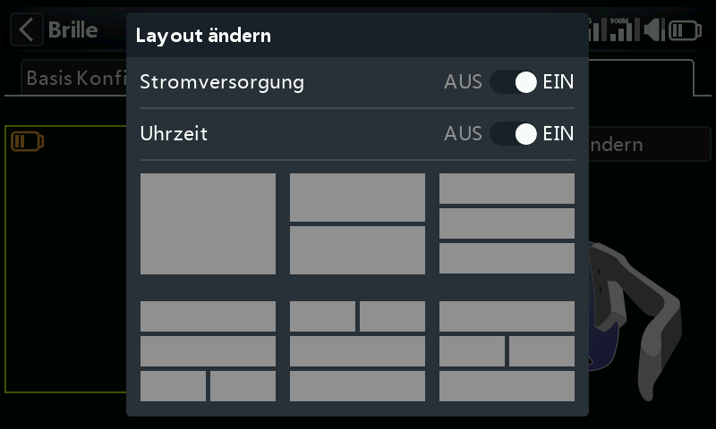

Wählen Sie im Menü das gewünschte Layout aus den 6 Optionen aus.

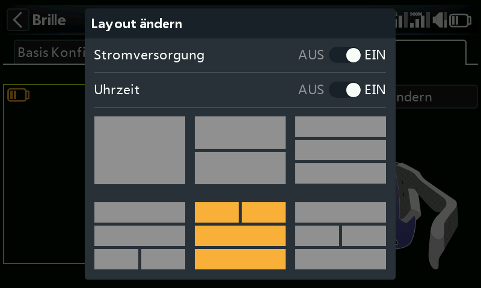

Für dieses Beispiel wurde die Nummer 5 gewählt.

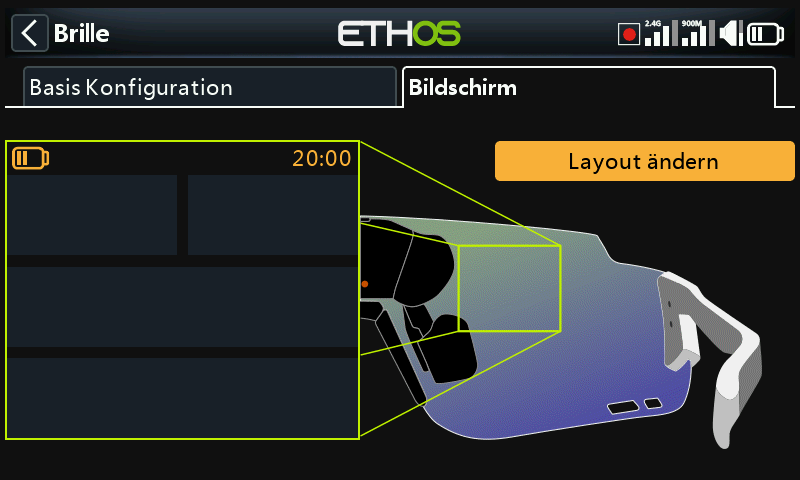

Layout 5 ist bereit zur Konfiguration.

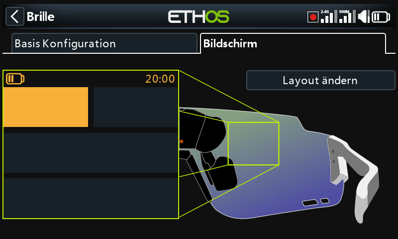

Wählen Sie Widget 1 für die Einrichtung aus.

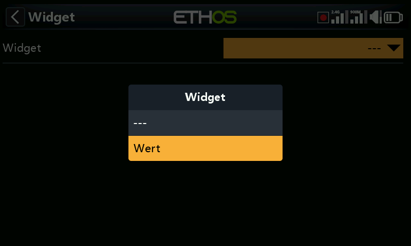

Derzeit stehen nur Werte-Widgets zur Auswahl.

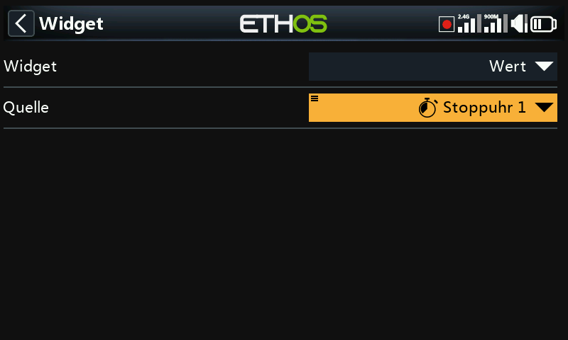

In diesem Beispiel wurde Stoppuhr 1 zur Anzeige ausgewählt.

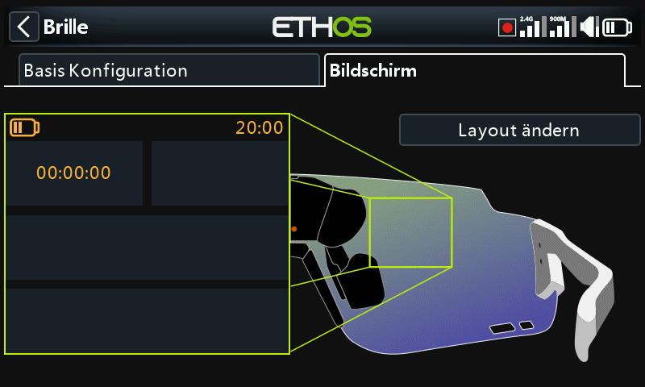

Widget 1 wurde so konfiguriert, dass es Stoppuhr 1 anzeigt.

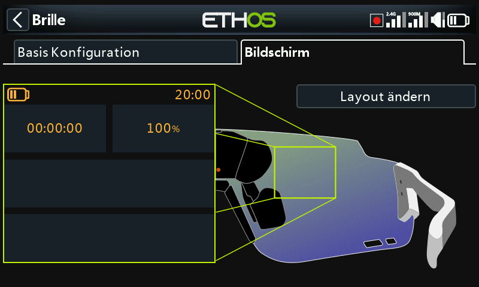

Und Widget 2 wurde so konfiguriert, dass es VFR Min anzeigt.
