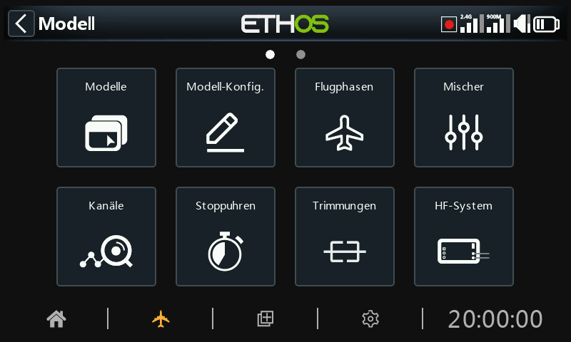

# Übersicht

Berühren Sie im System-Setup eine Kachel, um den ausgewählten Bereich zu konfigurieren, oder verwenden Sie den Drehwähler, um die Markierung auf die gewünschte Kachel zu bewegen, und drücken Sie dann Enter. Sie können nach links wischen, um auf die zweite Seite der Funktionen zuzugreifen, oder die Markierung mit dem Drehwähler auf die zweite Seite verschieben. Alternativ können Sie auch die Seitentaste verwenden, um zwischen den Seiten zu wechseln.

## Modelle

Die Option „Modellauswahl“ wird verwendet, um Modelle zu erstellen, auszuwählen, hinzuzufügen, zu klonen oder zu löschen. Sie dient auch dazu, benutzerspezifische Modellkategorie-Ordner zu erstellen und zu verwalten.

## Modell -Konfig.

Die Option „Modell bearbeiten“ dient zur Bearbeitung der grundlegenden Parameter des Modells, wie sie vom Assistenten eingerichtet wurden, und wird hauptsächlich zur Bearbeitung des Modellnamens oder -bildes verwendet. Sie dient auch zur Konfiguration der Funktionsschalter, die modellspezifisch sind.

## Flugphasen

Flugphasen ermöglichen es, Modelle für schaltbare, spezifische Aufgaben oder Flugverhalten einzustellen. Bei Segelflugzeugen können zum Beispiel Flugphasen wie Start, Reiseflug, Geschwindigkeit und Thermik eingestellt werden. Motorflugzeuge können Flugphasen für Normalflug, Start und Landung haben. Bei Hubschraubern gibt es Modi wie z.B. Normal für das Anfahren und Starten/Landen, Drehzahl1 für Kunstflug und Drehzahl 2 für 3D.

## Mischer

Im Bereich „Mischer“ werden die Steuerfunktionen des Modells konfiguriert. Hier kann jede der vielen Eingangsquellen beliebig kombiniert und auf einen der Ausgangskanäle abgebildet werden.

In diesem Bereich kann die Quelle auch konditioniert werden, indem Gewichte/Raten und Offsets definiert und Kurven (z. B. Expo) hinzugefügt werden. Die Mischung kann einem Schalter und/oder Flugphase unterworfen werden, und es kann eine Langsam-Funktion hinzugefügt werden.

## Kanäle

Der Bereich Kanäle ist die Schnittstelle zwischen der „Logik“ des Setups und der realen Welt mit Servos, Anlenkungen und Ruder sowie Mischer und Sensoren. In den Mixern haben wir festgelegt, was unsere verschiedenen Steuerungen tun sollen. In diesem Abschnitt können diese rein logischen Ausgänge an die mechanischen Eigenschaften des Modells angepasst werden. Hier konfigurieren wir die minimalen und maximalen Auslenkungen, die Servo- oder Kanalumkehrung und passen den Servo- oder Kanalmittelpunkt mit der PPM-Mittenanpassung an oder fügen mit Subtrim einen Offset hinzu. Wir können auch eine Kurve definieren, um Probleme mit dem realen Ansprechverhalten zu korrigieren. So kann beispielsweise eine Kurve verwendet werden, um sicherzustellen, dass die linken und rechten Klappen genau nachgeführt werden.

## Stoppuhren

Im Abschnitt Stoppuhren können die acht verfügbaren Stoppuhren konfiguriert werden.

## Trimmungen

Im Bereich Trimmungen können Sie den Trimmbereich und die Trimmschrittweite konfigurieren oder ein benutzerdefiniertes Trimmverhalten für jeden der 4 Steuerknüppel festlegen. Außerdem lassen sich hier Kreuztrimmungen und Soforttrimmungen konfigurieren. Einige Modelle verfügen über zwei zusätzliche Trimmtaster T5 und T6, die für Anpassungen während des Fluges sehr nützlich sind. Zusätzliche Trimmungen können nach Bedarf konfiguriert werden.

## HF-System

In diesem Abschnitt werden die Sender-ID' und die internen und/oder externen RF-Module konfiguriert. Hier werden auch die Bindung des Empfängers vorgenommen und die Empfängeroptionen konfiguriert.

Die „Sender-ID des Eigentümers“ ist eine 8-stellige ID, die einen eindeutigen Zufallscode enthält, der auf Wunsch geändert werden kann. Diese ID wird bei der Registrierung eines Empfängers zur „Registrierungs-ID“. Geben Sie denselben Code in das Feld „Sender-ID des Eigentümers“ Ihrer anderen Sender ein, mit denen Sie die Smart Share-Funktion nutzen möchten. Dies muss vor der Erstellung des Modells geschehen, für das Sie die Funktion nutzen möchten.

## Telemetrie

Die Telemetrie dient dazu, Informationen vom Modell an den RC-Piloten zu übermitteln. Diese Informationen können recht umfangreich sein und umfassen RSSI (Empfängersignalstärke) und VFR (gültige Framerate), verschiedene Spannungen und Ströme sowie alle anderen Sensorausgaben wie GPS-Position, Höhe usw.

Beachten Sie, dass die Telemetrie-Bildschirme als Hauptansichten im Abschnitt „[Bildschirme konfigurieren](../displays/index.md)“ eingerichtet sind.

## Checkliste

Der Abschnitt Checkliste wird verwendet, um Startwarnungen zu definieren, z. B. für die anfängliche Drosselklappenposition, ob Failsafe konfiguriert ist, die Positionen der Potis und Schieberegler sowie die anfänglichen Schalterpositionen.

## Logische Schalter

Logikschalter sind vom Benutzer programmierte virtuelle Schalter. Sie sind keine physischen Schalter, die man von einer Position in eine andere umlegen kann, aber sie können genauso wie jeder physische Schalter als Programmauslöser verwendet werden. Sie werden ein- und ausgeschaltet, indem die Bedingungen der Programmierung ausgewertet werden. Sie können eine Vielzahl von Eingängen verwenden, z. B. physische Schalter, andere logische Schalter und andere Quellen wie Telemetriewerte, Kanalmischer-Werte, Stoppuhr-Werte oder Vars. Sie können sogar Werte verwenden, die von einem LUA-Modellskript zurückgegeben werden.

## Spezialfunktionen

Hier können mit Hilfe von Schaltern Sonderfunktionen wie Trainermodus, Soundtrack-Wiedergabe, Sprachausgabe von Variablen, Datenprotokollierung usw. ausgelöst werden. Mit den Sonderfunktionen lassen sich modellspezifische Funktionen konfigurieren.

## Kurven

Benutzerdefinierte Kurven können bei der Eingabeformatierung, in den Mischern oder in den Kanalausgängen verwendet werden. Es stehen 50 Kurven zur Verfügung, die von verschiedenen Typen sein können (zwischen 2 und 21 Punkten, mit festen oder benutzerdefinierten x-Koordinaten).

Eine typische Anwendung in den Mischungen ist die Verwendung einer Expo-Kurve, um das Ansprechverhalten in der Mitte des Knüppels abzuschwächen. Eine Kurve kann auch verwendet werden, um eine Klappen-Höhenruder-Kompensationsmischung zu glätten, damit sich das Flugzeug nicht „aufschaukelt“, wenn Klappen eingesetzt werden.

Im Abschnitt „Kanäle“ kann eine Ausgleichskurve verwendet werden, um eine genaue Synchronisation der linken und rechten Klappen sicherzustellen.

## Vars

Variablen (Vars) können verwendet werden, um die Einstellungsparameter eines Modells so zu benennen und zu speichern, dass sie an anderer Stelle in der Senderprogrammierung, einschließlich der Mischer, referenziert werden können. Vars kann man sich als Container vorstellen, die Informationen enthalten.

## Lehrer/Schüler

Im Bereich Lehrer/Schüler wird der Sender als Lehrer oder Schüler in einem Lehrer/Schüler-Setup eingestellt. Die Verbindung zum Lehrer kann über Bluetooth oder ein Kabel erfolgen.

## LUA

Diese Seite wird verwendet, um LUA-Quellen und -Aufgaben auf einer Modellbasis zu verwalten.
