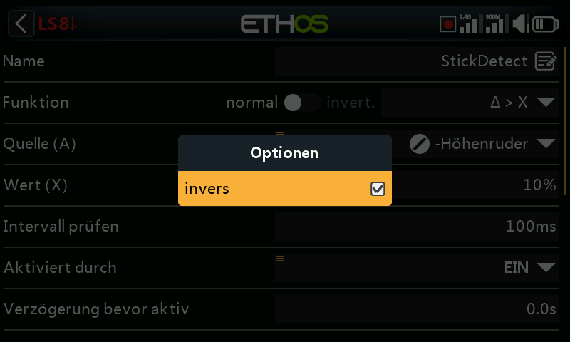

# Logische Schalter

Logische Schalter sind vom Benutzer programmierte *virtuelle* Schalter —
keine physischen Bedienelemente, die Sie umlegen können, aber sie können
wie jeder physische Schalter als Programmauslöser verwendet werden. Jeder
logische Schalter vergleicht die programmierte Bedingung mit seinen
Eingängen (andere Schalter, Telemetriewerte, Mischwerte, Timerwerte,
Kreisel- und Trainerkanäle und weitere) und wird dadurch WAHR oder FALSCH.
Es werden bis zu 100 logische Schalter unterstützt; es gibt keine
Standard-Logikschalter. Mit **+** fügen Sie einen hinzu; die Beschriftung
eines definierten Schalters in der Menüüberschrift ist grün, wenn sein
Zustand WAHR ist, und rot, wenn er FALSCH ist. Durch Antippen eines
vorhandenen Schalters erscheint ein Popup-Menü mit
**bearbeiten**/**verschieben**/**kopieren-einfügen**/**klonen**/**löschen**.

## Funktion

Alle Funktionen können normale oder invertierte Ausgänge haben.

- **A ~ X** — WAHR, wenn der Wert der ausgewählten Quelle `A` *ungefähr*
  gleich (innerhalb von etwa 10 %) mit `X`, einem benutzerdefinierten Wert,
  ist. In den meisten Fällen ist es besser, die Funktion „Ungefähr gleich“
  zu verwenden als die Funktion „Genau gleich“ —

  

  — denn bei `A = X` kann der tatsächliche Telemetriewert um einen Zielwert
  von 8,4 V herum etwa von 8,5 V auf 8,35 V springen, so dass er nie genau
  8,4 V erreicht, die Bedingung nie erfüllt ist und der logische Schalter
  nie einschaltet.
- **A = X** — WAHR nur dann, wenn der Wert von `A` 'genau' gleich `X` ist.
- **A > X** / **A < X** — WAHR, wenn `A` größer bzw. kleiner ist als `X`.
- **|A| > X** / **|A| < X** — wie oben, jedoch wird der absolute Wert von
  `A` verglichen (absolut bedeutet, dass nicht berücksichtigt wird, ob `A`
  positiv oder negativ ist).
- **Δ > X** — WAHR, wenn die Änderung des Wertes (Delta) der Quelle `A`
  innerhalb des **Prüfintervalls** mindestens `X` erreicht. Wird das
  Prüfintervall auf `---` gesetzt, so wird das Prüfintervall unendlich.

  
  

- **|Δ| > X** — wie oben, jedoch mit dem absoluten Wert der Änderung.
- **Bereich** — WAHR, wenn der Wert der Quelle `A` innerhalb des
  angegebenen Bereichs liegt.

  

- **UND** — WAHR nur dann, wenn alle aufgeführten Quellen (Wert 1 … Wert(n))
  WAHR sind.

  

- **ODER** — WAHR, wenn mindestens eine der aufgeführten Quellen WAHR ist.

  

- **XOR** (Exklusiv-ODER) — WAHR, wenn *nur eine* der aufgeführten Quellen
  WAHR ist.

  

- **Taktgenerator** — schaltet kontinuierlich ein und aus: eingeschaltet
  für die Zeit **Laufzeit aktiv**, ausgeschaltet für die Zeit **Laufzeit
  inaktiv**.

  

- **SR FlipFlop** — eine Verriegelung (SR-Flip-Flop); siehe
  [unten](#sticky).
- **Impuls/Übergang** — ein Momentanimpuls; siehe [unten](#edge).

### Sticky

Verriegelt auf **WAHR**, sobald die **Trigger-EIN-Bedingung** erfüllt ist,
und hält seinen Wert, bis er durch die erfüllte **Trigger-AUS-Bedingung**
auf FALSCH gezwungen wird — optional gesteuert durch den Parameter
**aktiviert** (solange diese Bedingung FALSCH ist, wird der
Logikschalterausgang ebenfalls auf FALSCH gehalten; die SR-FlipFlop-Funktion
arbeitet dabei im Hintergrund weiter und die verriegelte Bedingung wird zum
Ausgang durchgeschaltet, sobald die aktive Bedingung wieder WAHR wird —
vorbehaltlich aller Verzögerungen).

Seit Ethos 1.6.2 akzeptieren beide Trigger-Eingänge zusätzlich die Option
**Impuls/Übergang nach** (Flanke) — dazu lange die `ENT`-Taste bei der
Trigger-Bedingung drücken und die Option auswählen, angezeigt mit
vorangestelltem `†` — was eine deutlich feinere Konfiguration ermöglicht:

- **Trigger EIN `SA` (keine Verzögerung)** — verriegelt in dem Moment auf
  WAHR, in dem SA auf EIN geht.
- **Trigger EIN `SA` (Verzögerung = 1 s)** — verriegelt 1 Sekunde,
  nachdem SA auf EIN gegangen ist, auf WAHR, *sofern* SA während dieser
  Verzögerung auf EIN bleibt.
- **Trigger EIN `†SA` (Verzögerung = 1 s)** — schaltet 1 Sekunde, nachdem
  SA auf EIN gegangen ist, von WAHR auf FALSCH um, **auch wenn** SA während
  dieser Verzögerung nicht auf EIN bleibt (die Flanke ist bereits
  aufgetreten; die Verzögerung bestimmt lediglich den zeitlichen Ablauf).

Die Trigger-AUS-Bedingung verhält sich in umgekehrter Richtung genauso.
Die Verzögerungen wirken **nach** der aktiven Bedingung — eine Änderung der
aktiven Bedingung startet die Verzögerungszeit also erneut, bevor der
verriegelte Wert wieder den Ausgang erreicht. Wechseln beide
Triggerbedingungseingänge gleichzeitig von FALSCH auf WAHR, so ändert der
SR-FlipFlop-Ausgang einmal seinen Zustand. Bitte beachten Sie auch die
[Gemeinsamen Parameter](#shared-parameters) weiter unten.

### Edge

Ein Momentanschalter, der für die in **Dauer** angegebene Zeitspanne WAHR
wird, sobald seine Trigger-Bedingung erfüllt ist. **während** besteht aus
zwei Teilen `[t1:t2]` und legt genau fest, wann dies geschieht:

- **Flanke steigend, während = 0,0 s** — löst in dem Moment aus, in dem die
  Trigger-EIN-Bedingung von FALSCH auf WAHR übergeht.

  
  

- **Flanke steigend, während ≥ 0,0 s (z. B. 5,0 s)** — löst 5 Sekunden
  nach dem Übergang der Trigger-EIN-Bedingung auf WAHR aus; alle weiteren
  'Einschaltimpulse' während der Periode t1 werden ignoriert.

  
  

- **Fallende Flanke, während = 0,0 s** — löst in dem Moment aus, in dem die
  Trigger-EIN-Bedingung von WAHR auf FALSCH übergeht.
- **Fallende Flanke, während ≥ 0,0 s (z. B. 3,0 s)** — löst beim Übergang
  von WAHR auf FALSCH aus, jedoch nur, wenn die Bedingung zuvor mindestens
  3 Sekunden lang WAHR war.
- **Impuls (sowohl t1 als auch t2 gesetzt)** — löst nur aus, wenn die
  Trigger-EIN-Bedingung innerhalb dieses Fensters von FALSCH auf WAHR und
  wieder auf FALSCH wechselt (z. B. nach mindestens 2, aber spätestens
  nach 5 Sekunden).

## Gemeinsame Parameter {: #shared-parameters }

- **Aktiviert durch** — steuert den Ausgang des Logikschalters auf dieselbe
  Weise wie oben beim SR FlipFlop beschrieben. Auswählbar sind: EIN,
  Schalterstellungen, Funktionsschalter, Logik-Schalter, Trimm-Positionen,
  Telemetrie, Flugmodi oder ein System-Ereignis (Gasstellung halten, Motor
  aus, Gas aktiv, Telemetrie aktiv, RSSI niedrig, Trainer aktiv, Flug
  zurücksetzen).
- **Verzögerung bevor aktiv** / **Verzögerung bevor inaktiv** — bestimmt
  die Zeit, für die die Logikschalterbedingungen WAHR (bzw. FALSCH) sein
  müssen, bevor der Logikschalterausgang folgt; die Verzögerung kann bis zu
  60,0 s betragen. Nicht relevant für Taktgenerator und Impuls/Übergang…
  (Siehe [Anleitung: Warnung bei Akkukapazität](../how-to/battery-capacity-warning.md)
  für eine Verzögerung, mit der ein Spannungseinbruch entprellt wird.)
- **Bestätigung vor Aktivierung** / **vor Inaktivität** — fordert eine
  Bestätigung des Benutzers an, bevor der Zustand tatsächlich geändert wird
  (mit einer Option zum Abbrechen für Situationen, in denen der
  Bestätigungsdialog zu häufig angezeigt wird) — praktisch, bevor man etwas
  Gefährliches beginnt, z. B. zur Bestätigung, bevor ein Fahrzeug per
  Fernsteuerung ausgeschaltet wird.

  
  

- **Min. Laufzeit** — sobald der Logikschalter WAHR wird, bleibt er
  mindestens für diese Zeit WAHR. Beim Standardwert `---` wird der
  Logikschalter unter Umständen nur für einen Verarbeitungszyklus des
  Mischers WAHR, was zu kurz ist, um gesehen zu werden — die Bezeichnung
  wird dann in der Statuszeile nicht fett.
- **Max. Laufzeit** — ist eine maximale Dauer festgelegt, wechselt der
  Logikschalter nach dieser Zeit automatisch wieder auf FALSCH. Beide
  Zeiten können bis zu 60,0 s betragen.
- **Kommentar** — freier Text zur Erläuterung der Verwendung oder Funktion.
  Der Kommentar wird angezeigt, wenn ein Logikschalter zu einem
  Werte-Widget hinzugefügt wird.

## Verwendung mit Telemetrie

Das System-Ereignis **Telemetrie aktiv** (oder ein Schalter, dessen Quelle
ein Telemetriesensor ist und der nur aktiv ist, solange dieser Sensor Daten
liefert) deckt Bedingungen der Art „wird derzeit Telemetrie empfangen“ ab.

!!! warning
    Wenn ein [Mischer](mixes.md) über einen telemetriebasierten logischen
    Schalter freigegeben wird, muss eine **zweite** Aktion mit demselben
    Logikschalter **invertiert** hinzugefügt werden, um sicherzustellen,
    dass der Mischer auch bei Ausfall der Telemetrie gültige Werte enthält —
    denken Sie daran, dass bei einem inaktiven Mischer der Kanalausgang auf
    Neutral = 0 % = 1500 µs steht bzw. auf **Halbgas** bei einem Gaskanal.
    Alternativ können Sie eine **Offset**-Aktion verwenden, die bereits über
    getrennte Werte für aktiv und inaktiv verfügt — z. B. deckt die Quelle
    **0** (der spezielle Wert) mit einem so eingestellten Offset, dass der
    Mischer +100 % liefert, während `LS3` aktiv ist, und −100 %, während er
    inaktiv ist, beide Fälle in einer einzigen Aktion ab.

## Vergleich von Quellen

Eine Quelle wird normalerweise mit einem festen Wert verglichen, es können
aber auch zwei Quellen *desselben* Typs direkt miteinander verglichen
werden — z. B. zwei Timer, zwei Spannungen oder zwei Drehzahlsensoren.

## Trainer-Eingaben vom Slave ignorieren

Die [Optionen](../getting-started/user-interface-and-navigation.md#choosing-a-source)
einer Quelle können Trainer-Eingaben von einem angeschlossenen
Schüler-Sender (Slave) ausschließen — dies wird typischerweise bei einem
logischen Schalter verwendet, der die Knüppelbewegung des **Lehrers**
überwacht (z. B. um sofort eingreifen zu können, wenn etwas schiefgeht),
ohne dass auch die Eingaben des Schülers ihn auslösen. Häufig wird dies mit
einem Trainer-Schalter kombiniert, der die aktive Bedingung des Lehrers
freigibt.
