# Logische Schalter

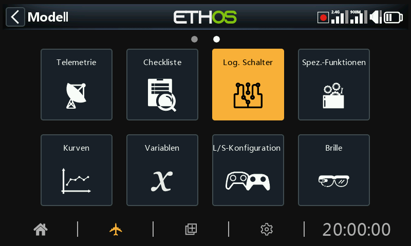

Logische Schalter sind vom Benutzer programmierte virtuelle Schalter. Sie sind keine physischen Schalter, die Sie von einer Position in eine andere umlegen können, aber sie können, wie jeder physische Schalter, als Programmauslöser verwendet werden. Sie werden ein- und ausgeschaltet (logisch ausgedrückt werden sie WAHR oder FALSCH), indem die Eingangsbedingungen mit der Programmierung für den logischen Schalter verglichen werden. Sie können eine Vielzahl von Eingängen verwenden, z. B. physische Bedienelemente und Schalter, andere logische Schalter und andere Quellen wie Telemetriewerte, Mischwerte, Stoppuhrwerte, Kreisel- und Trainerkanäle. Sie können sogar Werte verwenden, die von einem LUA-Modellskript zurückgegeben werden (muss unterstützt werden).

Es werden bis zu 100 logische Schalter unterstützt.

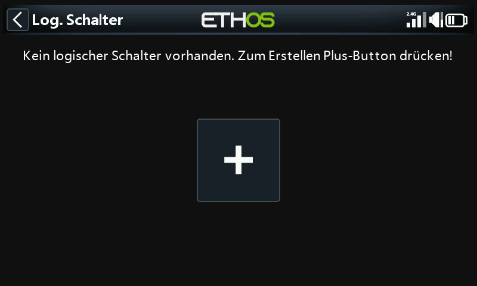

Es gibt keine Standard-Logikschalter. Markieren Sie die Schaltfläche „+“ oder tippen darauf, um einen Logikschalter hinzuzufügen.

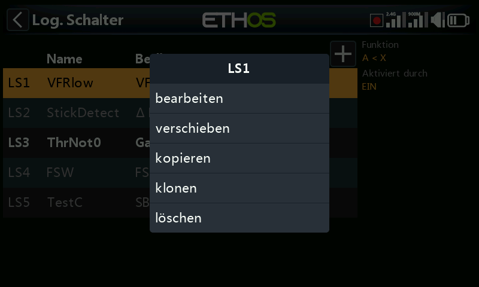

Sobald Logikschalter definiert wurden, wird durch Antippen eines Logikschalters das oben gezeigte Popup-Menü angezeigt, über das Sie diesen Schalter bearbeiten, verschieben, kopieren/einfügen, klonen oder löschen können.

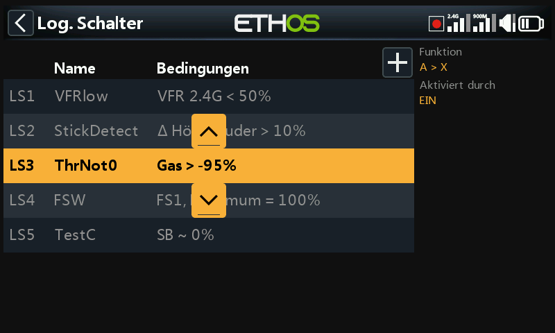

Wenn Sie „verschieben“ wählen, werden Pfeiltasten angezeigt, mit denen Sie den Logikschalter nach oben oder unten verschieben können.

## Hinzufügen von Logischen Schaltern

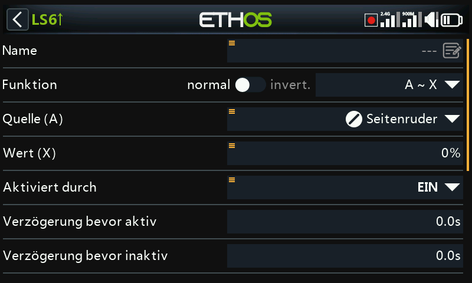

Beachten Sie, dass die Beschriftung des Logikschalters in der Menüüberschrift grün ist, wenn der Zustand des Logikschalters WAHR ist, oder rot, wenn er FALSCH ist.

### Name

Ermöglicht die Benennung des Logikschalters.

### Funktion

Die verfügbaren Funktionen sind unten aufgeführt. Bitte beachten Sie, dass alle Funktionen normale oder invertierte Ausgänge haben können. Bitte beachten Sie auch den Abschnitt „Gemeinsame Parameter“ sowie die Abschnitte „Telemetrie“ und „Vergleich von Quellen“ im Anschluss an die nachstehenden Funktionsbeschreibungen.

#### A ~ X

Die Bedingung ist WAHR, wenn der Wert der ausgewählten Quelle 'A' ungefähr gleich (innerhalb von etwa 10 %) mit 'X', einem benutzerdefinierten Wert, ist.

In den meisten Fällen ist es besser, die Funktion „Ungefähr gleich“ zu verwenden als die Funktion „Genau gleich“.

#### A = X

Die Bedingung ist WAHR, wenn der Wert der ausgewählten Quelle 'A' 'genau' gleich 'X', einem benutzerdefinierten Wert, ist.

Bei der Verwendung der Funktion „Genau gleich“ ist Vorsicht geboten. Wenn beispielsweise getestet wird, ob eine Spannung gleich einer Einstellung von 8,4 V ist, kann der tatsächliche Telemetriewert von 8,5 V auf 8,35 V springen, so dass die Bedingung nie erfüllt ist und der logische Schalter nie eingeschaltet wird.

#### A > X

Die Bedingung ist WAHR, wenn der Wert der ausgewählten Quelle 'A' größer ist als 'X', ein benutzerdefinierter Wert.

#### A < X

Die Bedingung ist WAHR, wenn der Wert der ausgewählten Quelle 'A' kleiner ist als 'X', ein benutzerdefinierter Wert.

#### |A| > X

Die Bedingung ist WAHR, wenn der absolute Wert der ausgewählten Quelle 'A' größer ist als 'X', ein benutzerdefinierter Wert. (Absolut bedeutet, dass nicht berücksichtigt wird, ob 'A' positiv oder negativ ist, und nur der Wert verwendet wird).

#### |A| < X

Die Bedingung ist WAHR, wenn der absolute Wert der ausgewählten Quelle 'A' kleiner ist als 'X', ein benutzerdefinierter Wert. (Absolut bedeutet, dass nicht berücksichtigt wird, ob 'A' positiv oder negativ ist, und nur der Wert verwendet wird).

#### ∆ > X

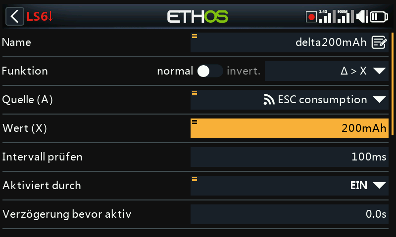

Die Bedingung ist wahr, wenn die Änderung des Wertes 'd' (d. h. Delta) der ausgewählten Quelle 'A' größer oder gleich dem benutzerdefinierten Wert 'X' innerhalb des 'Prüfintervalls' ist. Wird das 'Prüfintervall' auf '---' gesetzt, so wird das Prüfintervall unendlich.

Ein Beispiel für die Verwendung der Delta-Funktion finden Sie in diesem Abschnitt.

#### |∆| > X

Die Bedingung ist WAHR, wenn der absolute Wert der Änderung '|Δ|' in der ausgewählten Quelle 'A' größer oder gleich dem benutzerdefinierten Wert 'X' ist (absolut bedeutet, dass es keine Rolle spielt, ob 'A' positiv oder negativ ist). Wenn das 'Prüfintervall' auf '---' gesetzt wird, dann wird das Prüfintervall unendlich.

#### Bereich

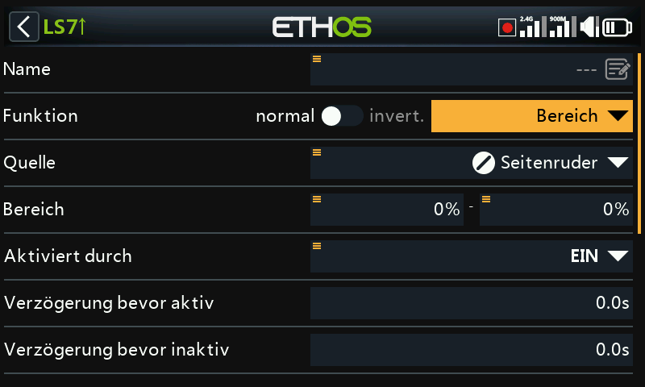

Die Bedingung ist WAHR, wenn der Wert der ausgewählten Quelle 'A' innerhalb des angegebenen Bereichs liegt.

#### AND

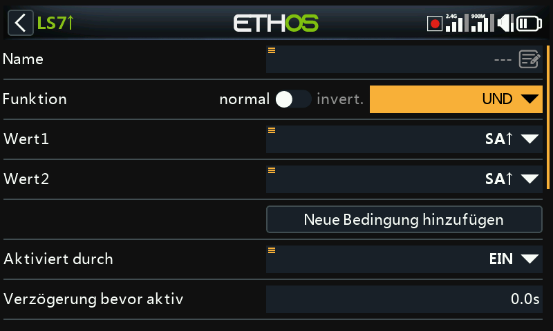

Die Funktion UND kann bis zu 9 Werte haben. Die Bedingung ist WAHR, wenn alle in Wert (1), Wert (2) ... ausgewählten Quellen WAHR sind (d. h. EIN).

#### ODER

Die Bedingung ist WAHR, wenn mindestens eine oder mehrere der in Wert 1, Wert 2 ... Wert(n) ausgewählten Quellen wahr (d. h. EIN) sind.

#### XOR (Exklusiv-ODER)

Die Bedingung ist WAHR, wenn **nur eine** der in Wert 1, Wert 2 ... Wert(n) ausgewählten Quellen wahr (d. h. EIN) ist.

#### Taktgenerator

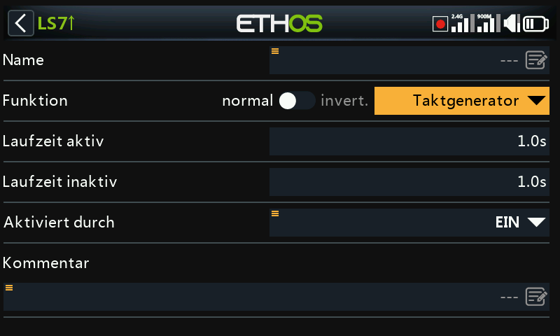

Der logische Schalter schaltet kontinuierlich ein und aus. Er schaltet für die Zeit „Laufzeit aktiv“ ein und für die Zeit „Laufzeit inaktiv“ aus.

#### SR FlipFlop

Oder mit Impuls/Übergang nach (┼) -Optionen:

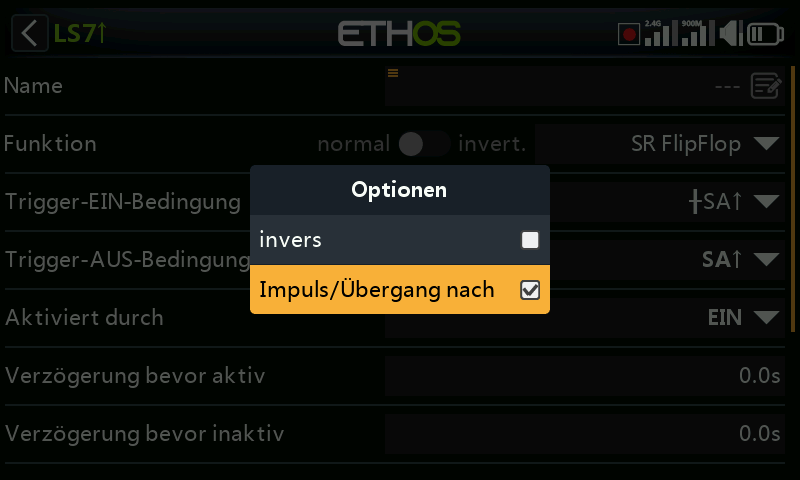

Für die Option Impuls/Übergang drücken Sie lange die \[Ent\]-Taste bei der Bedingung Trigger EIN oder Trigger AUS und wählen es dann.

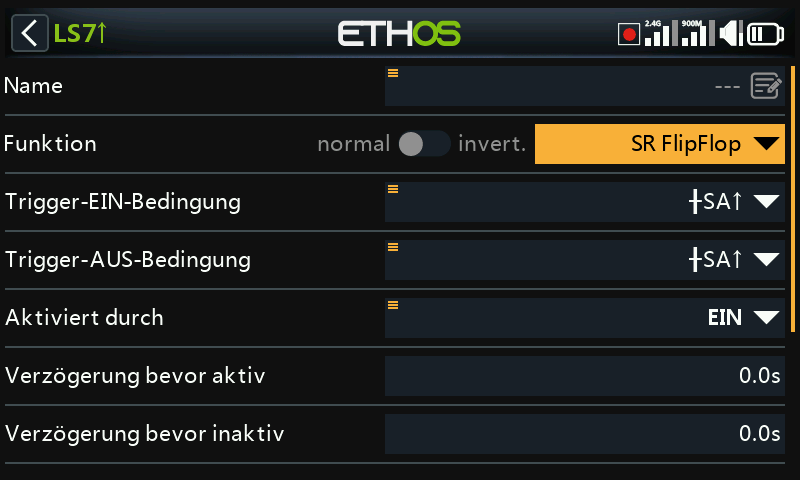

Der SR FlipFlop-Logikschalter hat eine Verriegelungsfunktion, die auch als SR-Flip-Flop (SR = Set / Reset) bezeichnet wird. Seine Funktionsweise ähnelt der eines JK-Flipflops, sodass sein Ausgang immer eindeutige Zustände aufweist. Er verriegelt EIN (d.h. wird WAHR), wenn die Trigger-EIN-Bedingungen erfüllt sind, und hält seinen Wert, bis er zu FALSCH gezwungen wird, wenn die Trigger-AUS-Bedingungen erfüllt sind. Dies kann durch den optionalen Parameter „aktiviert“ gesteuert werden. Das heißt, wenn die aktive Bedingung WAHR ist, dann folgt der SR FlipFlop-Ausgang der verriegelten Bedingung der SR FlipFlop-Funktion, vorbehaltlich der Verzögerungen. Ist die aktive Bedingung jedoch FALSCH, wird der logische Schaltausgang ebenfalls auf FALSCH gehalten.

**Hinweis:** Die SR FlipFlop-Funktion wurde in Ethos 1.6.2 um die Option „Impuls/Übergang nach“ (Flanke) an den Trigger-Eingängen erweitert, was eine enorme Flexibilität bei der Konfiguration ermöglicht. Um den korrekten Betrieb zu gewährleisten, sollten sorgfältige Tests durchgeführt werden

Auslösebedingung EIN

Wenn die Trigger-EIN-Bedingung z. B. SA↑ (keine Verzögerung) ist, dann schaltet der SR FlipFlop-Ausgang von FALSCH auf WAHR sobald SA auf EIN geht.

Wenn die Trigger-EIN-Bedingung SA↑ (Verzögerung=1s) ist, schaltet der SR FlipFlop-Ausgang 1 Sekunde, nachdem SA auf EIN gegangen ist, von FALSCH auf WAHR um, sofern SA während dieser Verzögerung auf EIN bleibt.

Wenn die Trigger-EIN-Bedingung Impuls/Übergang nach (┼)>SA↑ (Verzögerung=1s) ist, schaltet der SR FlipFlop-Ausgang 1 Sekunde, nachdem SA auf EIN gegangen ist, von WAHR auf FALSCH um, auch wenn SA während dieser Verzögerung nicht auf EIN bleibt.

**Auslösebedingung** **AUS**

Lautet die Trigger-Aus-Bedingung beispielsweise SB↑ (keine Verzögerung), dann schaltet der SR FlipFlop-Ausgang von WAHR auf FALSCH, sobald SB auf EIN geht.

Lautet die Trigger-Aus-Bedingung SB↑ (Verzögerung=1s), dann schaltet der SR FlipFlop-Ausgang 1 Sekunde, nachdem SB auf EIN gegangen ist, von WAHR auf FALSCH, sofern SB während dieser Verzögerung auf EIN bleibt.

Wenn der Trigger OFF <Impuls/Übergang nach Flanke (┼)>SB↑ (Verzögerung=1s) ist, dann wird der SR FlipFlop 1 Sekunde nachdem SB auf EIN gegangen ist, von WAHR auf FALSCH umschalten, auch wenn SB während dieser Verzögerung nicht auf EIN bleibt.

Aktiver Bedingungen

Beachten Sie, dass die SR FlipFlop-Funktion weiterhin arbeitet, auch wenn ihr Ausgang durch den Eingang „Aktive Bedingung“ gesteuert wird. Sobald die aktive Bedingung wieder WAHR wird, wird die verriegelte Bedingung des SR FlipFlop zum Ausgang durchgeschaltet, vorbehaltlich aller Verzögerungen.

Toggle function

Wenn beide Triggerbedingungseingänge gleichzeitig von FALSCH auf WAHR umgeschaltet werden, ändert der SR FlipFlop-Ausgang einmal seinen Zustand.

Hinweis: Bitte beachten Sie auch den Abschnitt „Allgemeine Parameter“ weiter unten.

#### Impuls/Übergang...

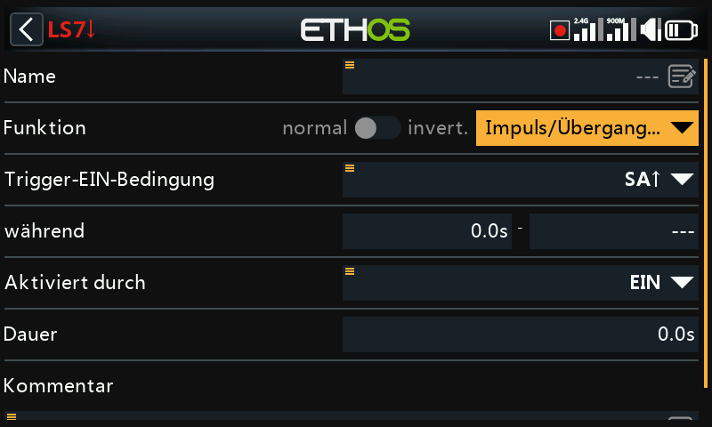

„Flanke“ ist ein Momentanschalter, der für die in „Dauer“ angegebene Zeitspanne WAHR wird, wenn seine Flankenauslösebedingungen erfüllt sind.

##### Option „Flanke steigend“

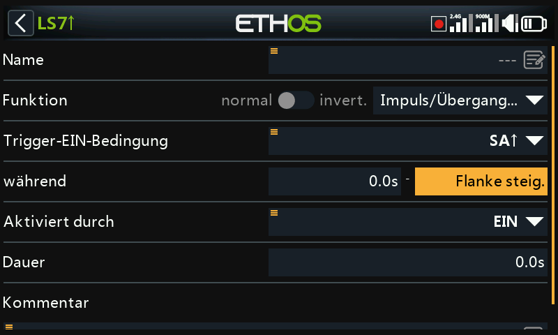

##### Während = '0.0s'

Während besteht aus zwei Teilen \[t1:t2\]. Bei t1 von Während = 0,0s und t2= 'Steigende Flanke' wird der logische Schalter in dem Moment WAHR (für die in 'Dauer' angegebene Zeitspanne), in dem die 'Trigger-Ein-Bedingung' von FALSCH auf WAHR übergeht.

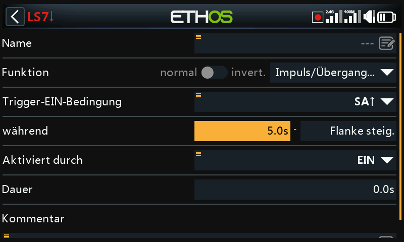

##### Während >= '0,0s

Während besteht aus zwei Teilen \[t1:t2\]. Wenn t1 von ‚Dauer’ ein positiver Wert ist (z. B. 5,0s) und t2= 'Steigende Flanke', wird der logische Schalter 5 Sekunden nach dem Übergang der 'Trigger-EIN-Bedingung' von Falsch auf WAHR (für die unter 'Dauer' angegebene Dauer). Alle weiteren 'Einschaltimpulse' während der Periode t1 werden ignoriert.

##### Option „fallende Flanke

##### während = '0.0s'

Während besteht aus zwei Teilen \[t1:t2\]. Bei ‚während‘ t1=0.0s und t2= '---' (fallende Flanke) wird der logische Schalter in dem Moment WAHR (für die in 'Dauer' angegebene Dauer), in dem die Bedingung für die Auslösung von WAHR auf FALSCH übergeht.

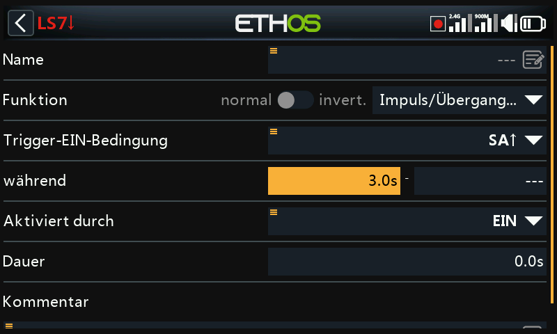

##### Während >= '0,0s

‚während’ besteht aus zwei Teilen \[t1:t2\]. Wenn t1 von ‚während’ ein positiver Wert ist (z.B. 3,0s) und t2= '---' (fallende Flanke), wird der logische Schalter WAHR (für die in 'Dauer angegebene Dauer), wenn die Bedingung für die Auslösung von WAHR zu FALSCH übergeht, nachdem sie mindestens 3 Sekunden lang WAHR war.

##### Option Impuls

‚während’ besteht aus zwei Teilen \[t1:t2\]; wenn sowohl für t1 als auch für t2 Werte eingegeben werden, wird ein Impuls benötigt, um den logischen Schalter auszulösen.

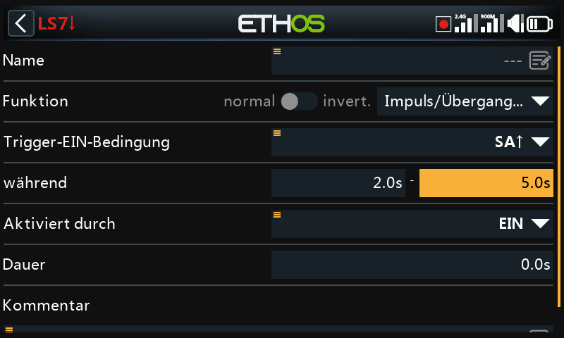

Im obigen Beispiel wird der logische Schalter für den Zeitraum „Dauer“ wahr, wenn die „Trigger-Ein-Bedingung“ von FALSCH auf WAHR wechselt und dann nach mindestens 2 Sekunden, aber spätestens nach 5 Sekunden von WAHR auf FALSCH wechselt.

## Gemeinsame Parameter

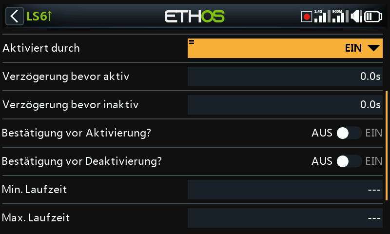

Die Logikschalter haben alle eine Reihe von gemeinsamen Parametern:

### Aktiviert durch

Die Logikschalter können durch den optionalen Parameter „aktiviert durch“ gesteuert werden. Das heißt, wenn die aktive Bedingung WAHR ist, folgt der Ausgang des Logikschalters der Bedingung der Funktion. Ist die aktive Bedingung jedoch FALSCH, wird der Ausgang des Logikschalters ebenfalls auf FALSCH gehalten.

Die Bedingung ‚aktiviert durch‘ kann aus einer der folgenden ausgewählt werden:

-   EIN
-   Schalterstellungen
-   Funktionsschalter
-   Logik-Schalter
-   Trimm-Positionen
-   Telemetrie
-    Flugphasen
-   System-Ereignisse 
  -    Gasstellung halten
  -    Motor aus
  -    Gas aktiv
  -    Telemetrie aktiv
  -    RSSI niedrig
  -    Trainer aktiv
  -    Flug zurücksetzen

Beachten Sie, dass die RS FlipFlop-Funktion weiterhin arbeitet, auch wenn ihr Ausgang durch den Schalter „Aktiv durch“ gesteuert wird. Sobald die aktive Bedingung wieder WAHR wird, wird die Bedingung der Funktion auf den Logikschalterausgang umgeschaltet.

### Verzögerung bevor aktiv

Dieser Wert bestimmt die Zeit, für die die Logikschalterbedingungen WAHR sein müssen, bevor der Logikschalterausgang WAHR wird (nicht relevant für Taktgenerator und Impuls/Übergang...). Die Verzögerung kann bis zu 60,0s betragen.

Bitte beachten Sie dieses Beispiel, in dem die Spannung des Neuron ESC für mindestens x Sekunden unter 4,2 V fällt.

### Verzögerung bevor Inaktivität

In ähnlicher Weise bestimmt dieser Wert die Zeit, für die die Logikschalterbedingungen FALSCH sein müssen, bevor der Logikschalterausgang FALSCH wird (nicht relevant für Taktgenerator und Impuls/Übergang...). Die Verzögerung kann bis zu 60,0s betragen.

### Bestätigung vor Aktivierung

Wenn ein Logikschalter einen Zustandswechsel zu aktiv erkennt, fordert diese Option eine Bestätigung des Benutzers an, bevor der Zustand geändert wird.

Es gibt eine Option zum Abbrechen für Situationen, in denen der Bestätigungsdialog zu häufig angezeigt wird.

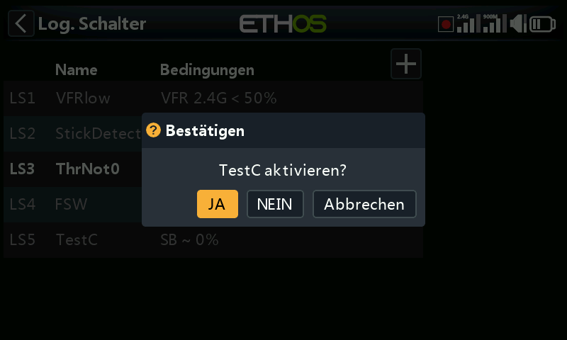

Einige Beispiele für den Einsatz der Funktion:

1. Für Funktionsmodelle, bei denen man sie benutzen kann, bevor man etwas Gefährliches beginnt.

2. Für den NFC-Schalter, wo Sie das Modell vom Sender ausschalten können, könnte es verwendet werden, um eine Bestätigung vor dem Ausschalten zu haben.

### Bestätigung vor Inaktivität

Wenn ein Logikschalter einen Zustandswechsel zu aktiv erkennt, fordert diese Option eine Bestätigung des Benutzers an, bevor der Zustand geändert wird.

Es gibt eine Option zum Abbrechen für Situationen, in denen der Bestätigungsdialog zu häufig angezeigt wird.

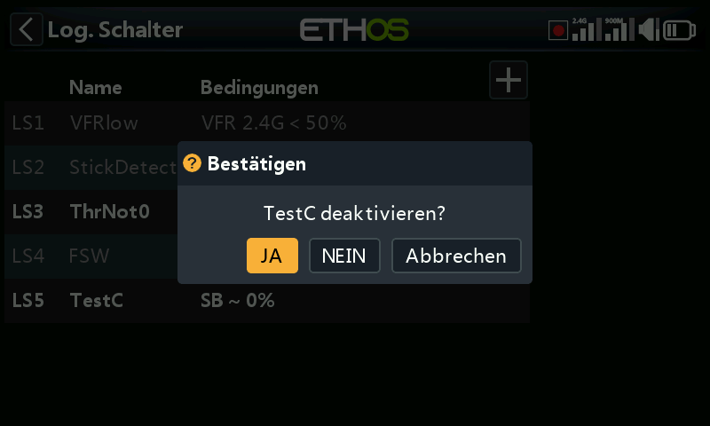

### Min. Laufzeit

Sobald der Logikschalter WAHR wird, bleibt er mindestens für die angegebene Mindestdauer WAHR. Wenn die Dauer der Standardwert „---“ ist, wird der Logikschalter nur für einen Verarbeitungszyklus des Mischers WAHR, was zu kurz ist, um gesehen zu werden, so dass die Bezeichnung des logischen Schalters in der Statuszeile nicht fett wird. Die Dauer kann bis zu 60,0s betragen.

### Max. Laufzeit

Wenn eine maximale Dauer festgelegt wird, bleibt der logische Schalter, sobald er WAHR wird, nur für die angegebene maximale Dauer WAHR. Die Dauer kann bis zu 60,0s betragen.

### Kommentar

Ein Kommentar kann zur Erläuterung der Verwendung oder Funktion hinzugefügt werden, um das Verständnis zu erleichtern. Der Kommentar wird angezeigt, wenn ein Logikschalter zu einem Werte-Widget hinzugefügt wird.

## Logische Schalter - Verwendung mit Telemetrie

Neben den normalen Aktiv-Kategorien gibt es für Logikschalter und Spezialfunktionen die Bedingung „Telemetrie aktiv“ (unter „Systemereignis“), die aktiv ist, wenn Telemetrie empfangen wird.

Wenn die Quelle eines Logikschalters ein Telemetriesensor ist, wird der Logikschalter aktiv, wenn Ihr Sensor aktiv ist.

Achtung!

Wenn ein Logikschalter mit Telemetrie in einen Mischer verwendet wird, muss eine zusätzliche Aktion mit demselben Logikschalter invertiert (d. h. inaktiv) hinzugefügt werden, um sicherzustellen, dass der Mischer auch bei Ausfall der Telemetrie gültige Werte enthält. Denken Sie daran, dass bei einem inaktiven Mischer der Kanalausgang auf Neutral = 0% = 1500us oder Halbgas bei einem Drosselkanal steht!

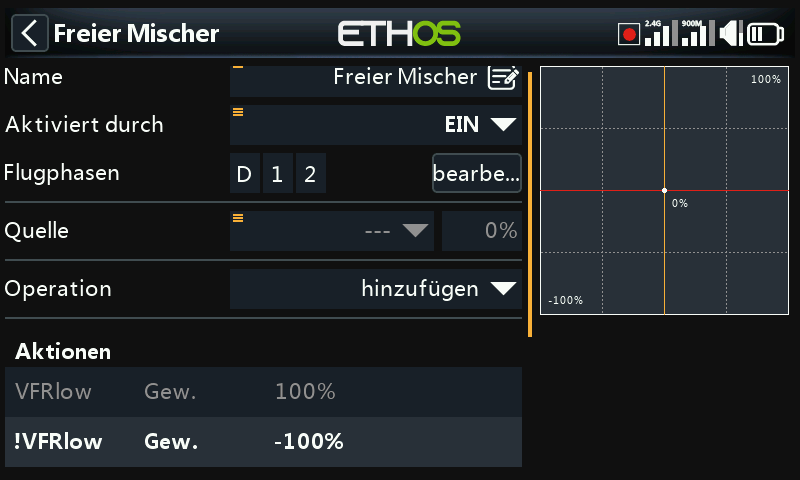

Das obige Beispiel zeigt den hinzugefügten Logikschalter VFRlow sowie dessen Inversen !VFRlow, um sicherzustellen, dass der Mischer immer gültige Werte aufweist.

Alternativ könnten Sie auch eine Offset-Aktion verwenden:

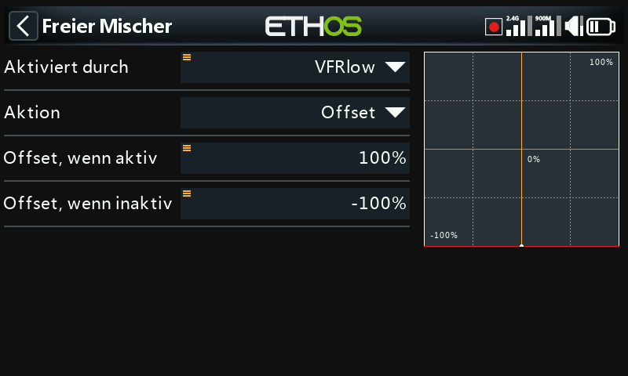

Offset-Aktionen haben standardmäßig zwei Werte: einen für den Fall, dass die Offset-Aktion aktiv ist, und einen für den Fall, dass die Offset-Aktion inaktiv ist. Dies deckt alle Fälle ab.

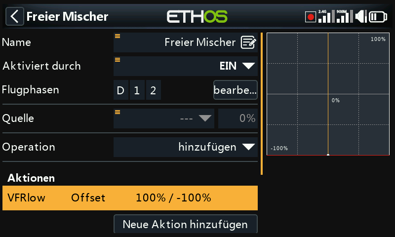

Das obige Beispiel zeigt die Mischer-Zusammenfassungszeile, wobei der Offset immer einen gültigen Wert hat. Die Quelle wurde auf den Sonderwert 0 gesetzt, sodass der Offset zu 0 % hinzugefügt wird und die Mix-Ausgabe +100 % beträgt, wenn VFRlow aktiv ist, oder -100 %, wenn VFRlow inaktiv ist.

## Vergleich der Quellen

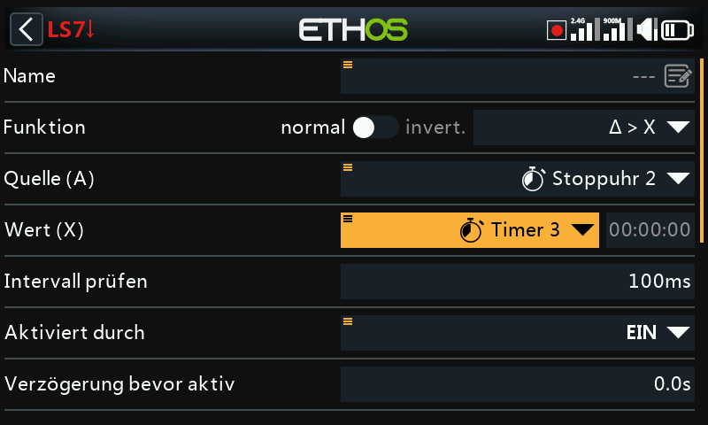

Normalerweise wird die Quelle (A) mit einem festen Wert (X) verglichen. Der Vergleich von zwei Quellen gleichen Formats (d. h. mit denselben Einheiten) ist jedoch zulässig. Zum Beispiel können zwei Zeitgeber, zwei Spannungen oder zwei Drehzahlquellen verglichen werden.

## Option zum Ignorieren von Schülereingaben

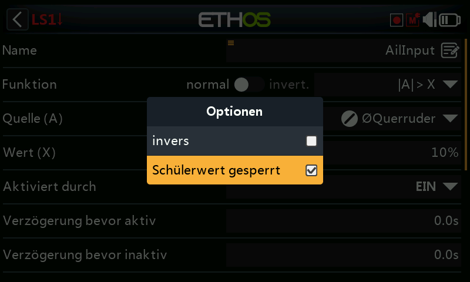

Bei Logikschaltern kann für die Quellen die Option „Schülerwert gesperrt“ festgelegt werden, um alle Quellen zu ignorieren, die über den Schülereingang.

Eine typische Anwendung ist die Konfiguration eines Logikschalters zur Erkennung von Steuerknüppelbewegungen des Lehrer-Senders (z. B. für Querruder und Höhenruder), um bei Problemen sofort eingreifen zu können. Diese Option ist erforderlich, um zu verhindern, dass Steuerbefehle des Schüler-Senders (d. h. des Schülers) den Logikschalter auslösen.

Der Logikschalter wird dann typischerweise in Verbindung mit einem Lehrerschalter verwendet, um die „aktive Bedingung“ der Lehrer-Schüler-Funktion zu aktivieren oder zu deaktivieren.

Bitte beachten Sie die Anleitung 11. Wie man beispielsweise die sofortige Rückübernahme für die Lehrer-Schüler-Funktion konfiguriert.
