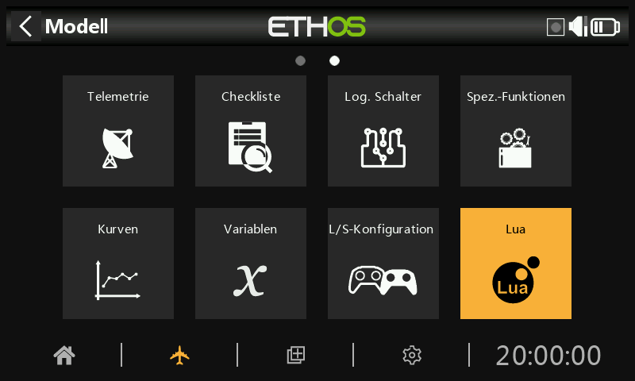
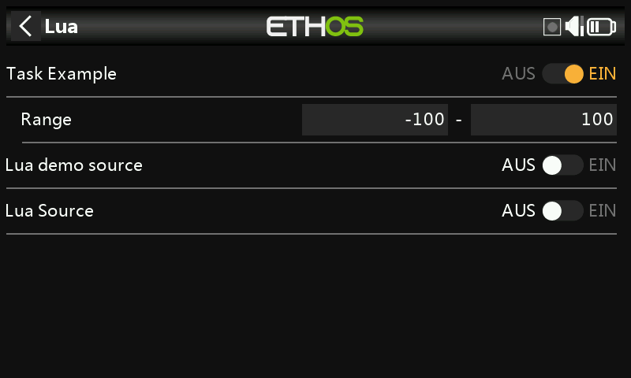

# Lua

Das Lua-Menü wird nur angezeigt, wenn der Benutzer eine Lua-Quelle oder ein Lua-Aufgabenskript im Ordner „scripts/“ auf der SD-Karte oder eMMC installiert hat.

Mit Lua-Skripten ist es möglich, benutzerdefinierte Quellen wie beispielsweise benutzerdefinierte Sensoren zu erstellen oder Aufgaben zu erstellen, die benutzerdefinierte Aktionen ausführen, wie beispielsweise das Protokollieren von Daten in einer Datei nach Beendigung des Fluges.

Nach der Installation sind Lua-Quellen oder -Aufgaben global für jedes Modell verfügbar. Über dieses Menü können dann die jeweiligen Quell- und Aufgabenskripte für das aktive Modell selektiv aktiviert und konfiguriert werden.

Auf der Webseite der ETHOS-Feedback-Community finden Sie einige Beispiel-Lua-Quell- und -Aufgabenskripte, siehe /lua/examples/task und /lua/examples/source.

## LUA-Aufgaben

Für jede einzelne Aufgabe:

### Aufgabe aktivieren

Alle verfügbaren Aufgaben werden aufgelistet. Jede Aufgabe kann für das aktive Modell aktiviert werden.

### Konfiguration der Aufgabe

Wenn eine Aufgabe aktiviert ist, wird ein zugehöriges LUA-Konfigurationsformular angezeigt, damit die Aufgabe für das aktive Modell konfiguriert werden kann. Die Aufgabe verfügt über eine Lese- und eine Schreibfunktion, damit der Benutzer alle Konfigurationsparameter speichern kann.

Im obigen Beispiel hat die Beispielaufgabe einen konfigurierbaren Bereich, der für jedes Modell, das die Aufgabe verwendet, angepasst werden kann.

## LUA***-Quellen***

Für jede einzelne Quelle:

### Quelle aktivieren

Alle verfügbaren LUA-Quellen werden aufgelistet. Jede Quelle kann für das aktive Modell aktiviert werden.

### Konfiguration der Quellen

Wenn eine Quelle aktiviert ist, wird ein zugehöriges Lua-Konfigurationsformular angezeigt, mit dem die Quelle für das aktive Modell konfiguriert werden kann (z. B. Range im obigen Bildschirmfoto für die Aufgabe).

## LUA-Skript-Funktionen

Zu den anwendbaren Lua-Funktionen gehören:

system.registerSource()

system.registerTask()

Weitere Informationen finden Sie im [Ethos LUA Referenzhandbuch](https://www.frsky-rc.com/wp-content/uploads/Downloads/EthosSuite/LuaDoc/index.html).

## Installation

Lua-Quellen und -Tasks werden im Ordner „scripts“ auf der SD-Karte oder eMMC installiert. Bitte beachten Sie den Abschnitt [Skripte](../system-setup/file-manager.md) unter System / Dateimanager.
