# Mischer

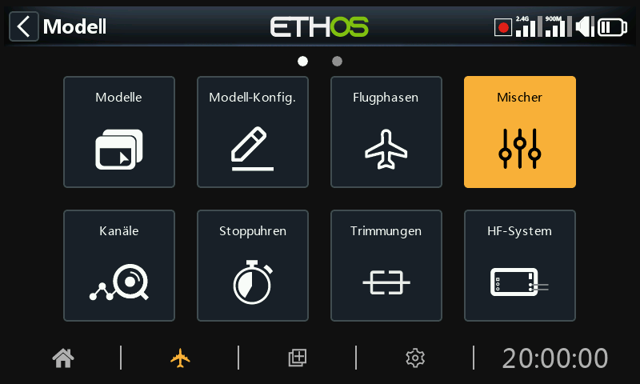

Mischer sind der Kern der Modellprogrammierung in Ethos – hier werden Eingänge
(Steuerknüppel, Schalter, Sensoren, alles, was eine [Quelle](../getting-started/user-interface-and-navigation.md#choosing-a-source)
erreichen kann) auf Ausgangskanäle geleitet, geformt und kombiniert. Pro Modell
können bis zu 120 Mischer definiert werden.

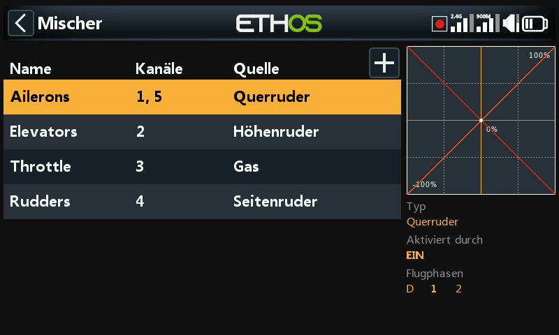

Wurde ein Modell mit dem Assistenten der **Modellauswahl** erstellt, sind die
grundlegenden Mischer (Querruder, Höhenruder, Gas, Seitenruder und was die
Zelle sonst noch benötigt) hier bereits angelegt. Das Auswählen eines Mischers
und Drücken von `ENT` öffnet ein Kontextmenü, um ihn zu bearbeiten, einen neuen
Mischer hinzuzufügen, in die [kanalweise Ansicht](#per-channel-view) zu
wechseln, ihn umzusortieren, zu duplizieren oder zu löschen. Inaktive Mischer
werden ausgegraut dargestellt, und vor dem Löschen wird stets eine Bestätigung
verlangt.

## Aufbau eines Mischers {: #anatomy-of-a-mix }

Jeder Mischer verfügt über denselben Satz an Feldern, unabhängig davon, aus
welcher Kategorie er stammt. Der **Querruder**-Mischer dient hier als
repräsentatives Beispiel – Höhenruder- und Seitenruder-Mischer sind identisch
aufgebaut.

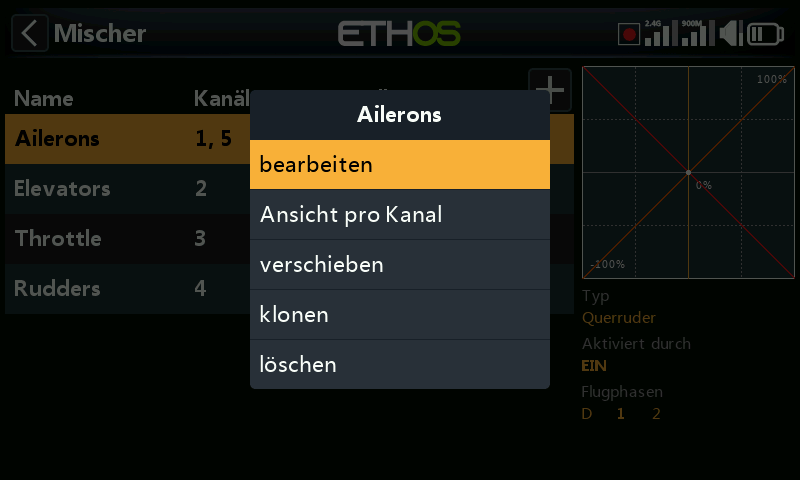

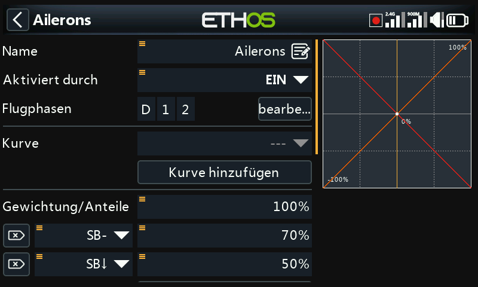

**Name** – standardmäßig der Mischertyp, editierbar.

**Bedingung** – standardmäßig *Immer*. Kann auf eine Schalterstellung, einen
Funktionsschalter, einen logischen Schalter, eine Flugphase, ein Systemereignis
(Gas-Abschaltung/Leerlaufsperre) oder eine Trimmungsposition eingeschränkt
werden; der Mischer wirkt dann nur, solange die Bedingung erfüllt ist.

**Flugphasen** – sind Flugphasen definiert, kann der Mischer zusätzlich auf eine
oder mehrere davon eingeschränkt werden.

**Kurve** – standardmäßig steht eine **Expo**-Kurve zur Verfügung (0 = linear;
positive Werte machen die Reaktion um die Mittelstellung weicher, negative
schärfer):

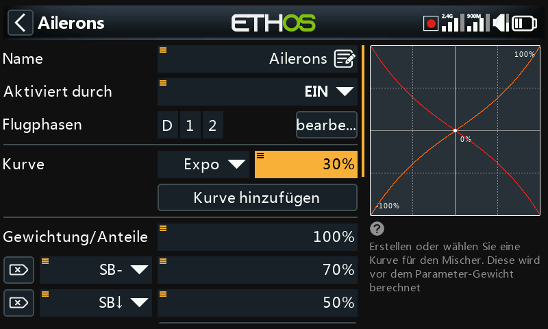

Alternativ kann jede zuvor unter [Kurven](curves.md) definierte Kurve gewählt
werden. Bis zu 6 Kurven lassen sich auf einem Mischer stapeln, jede mit eigener
Bedingung – sind mehrere Bedingungen gleichzeitig erfüllt, gewinnt die in der
Liste weiter oben stehende Kurve. Kurven werden **vor** den Raten angewendet.

**Raten** – eine oder mehrere Gewichtungszeilen, jede optional über einen
Schalter, Funktionsschalter, logischen Schalter, eine Trimmungsposition oder
eine Flugphase freigeschaltet. Die erste Zeile ist der Standard und immer dann
aktiv, wenn die Bedingung keiner anderen Zeile erfüllt ist:

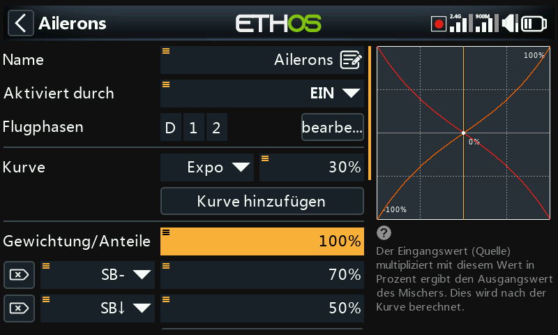

Statt eines festen Prozentwerts kann eine Rate auch von einer
[Quelle](../getting-started/user-interface-and-navigation.md#choosing-a-source)
gesteuert werden – beispielsweise von einem Potentiometer, um die Rate im Flug
anzupassen:

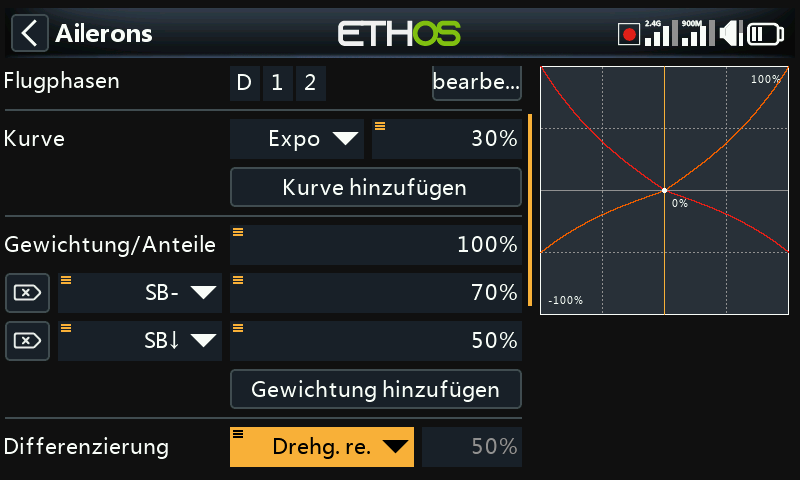

**Differential** (-100 bis 100, Standard 0) – bewirkt mehr Ausschlag in eine
Richtung als in die andere. Bei Querrudern ist dies der klassische Kniff, mehr
Ausschlag nach oben als nach unten zu geben, um das negative Wendemoment zu
verringern. Wird erst angezeigt, wenn der Mischer mehr als einen Ausgangskanal
besitzt; Differential ist zudem nur bei einer Ausgangskonfiguration im Stil
eines V-Leitwerks oder zweier getrennter Querruder sinnvoll.

**Anzahl der Kanäle / Ausgänge** – wie viele Ausgangskanäle dieser Mischer
ansteuert und auf welche physischen Ausgänge sie abgebildet werden:

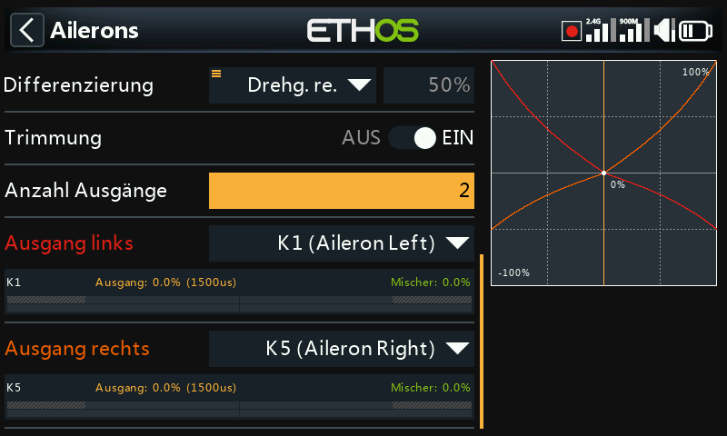

Ein langer Druck auf `ENT` bei einem Ausgangskanal an anderer Stelle in der
Oberfläche (z. B. unter [Ausgänge](outputs.md)) springt direkt auf diese Seite
zurück.

## Der Gas-Mischer

Der Gas-Mischer entspricht einem Querruder-/Höhenruder-/Seitenruder-Mischer
zuzüglich motorspezifischer Sicherheitsoptionen.

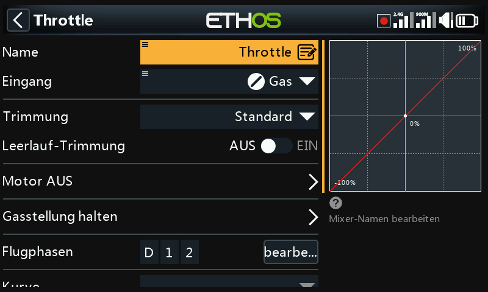

**Eingang** – die Gasquelle, normalerweise der Gasknüppel, aber austauschbar
gegen ein Potentiometer, einen Schieberegler, Schalter, eine Trimmung, einen
Kanal, eine Gyro-Achse, einen Lehrer/Schüler-Kanal, einen Timer oder jede
andere Quelle.

**Leerlauftrimmung** – erlaubt bei Verbrennungsmotoren, die Leerlaufdrehzahl
über eine eigene Trimmung einzustellen, ohne die Vollgasstellung zu verändern.
Bei aktivierter Leerlauftrimmung liegt der Gaskanal bei -75 %, wenn der Knüppel
im unteren Leerlauf steht; die Gastrimmung stellt den Leerlauf dann zwischen
-100 % und -50 % ein:

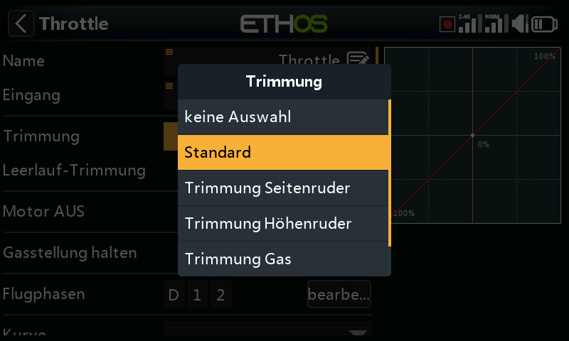

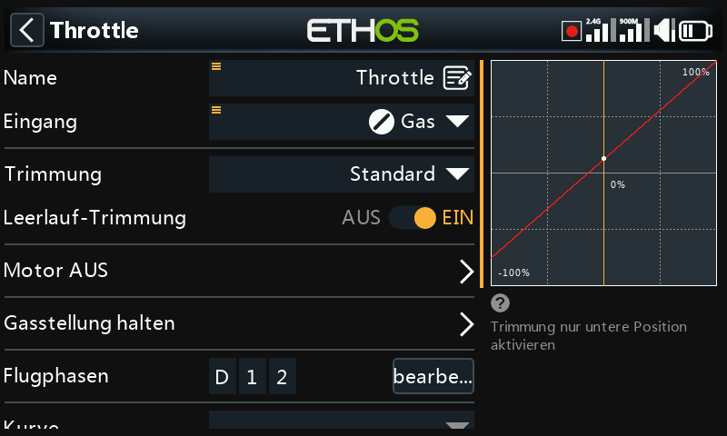

**Gas-Abschaltung** – eine harte Sicherheitsverriegelung: Der Kanal wird erst
aktiv, nachdem der Gasknüppel den Leerlauf durchlaufen hat, sodass ein
versehentliches Umlegen eines Schalters den Motor nicht aus einer
Vollgasstellung heraus anlaufen lassen kann:

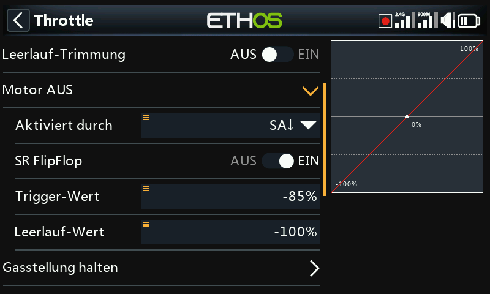

**Leerlaufsperre** – hält den Kanal unabhängig von der Knüppelstellung auf einem
festen Wert, allerdings ohne die Sicherheitsverriegelung der Gas-Abschaltung:

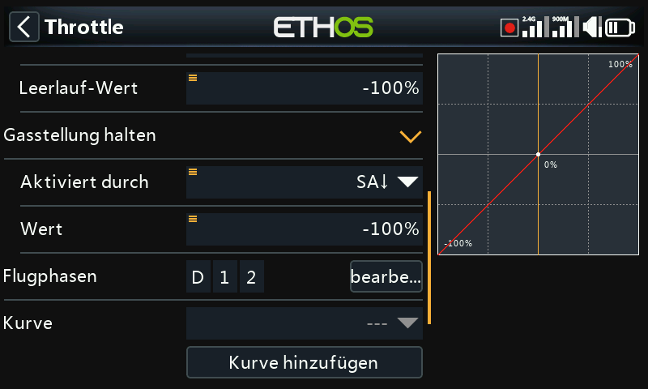

Auch der Gas-Mischer bietet eine eigene Angabe zur Anzahl der Ausgangskanäle,
genau wie jeder andere Mischer:

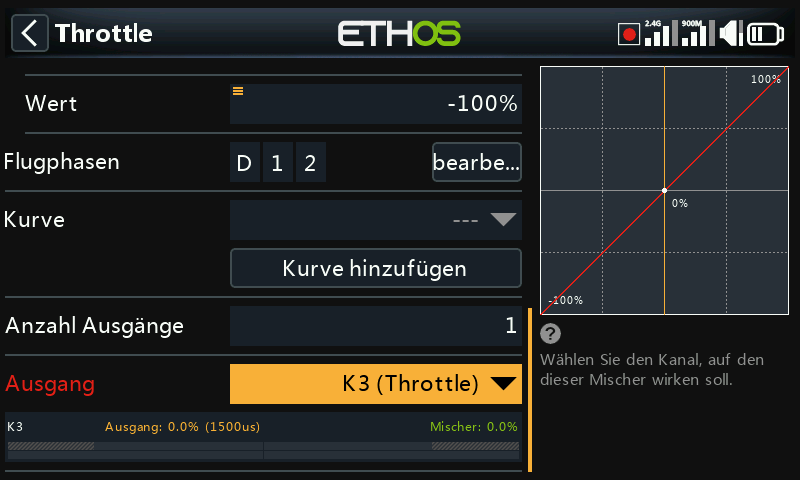

!!! note "Gas-Verriegelung"
    Ethos verlangt, dass der Eingang des Gas-Mischers unabhängig von den
    Einstellungen für Gas-Abschaltung/Leerlaufsperre einmal -100 % durchläuft,
    bevor scharfgeschaltet wird – ein über den Modellauswahl-Assistenten
    erstelltes Modell berücksichtigt dies bereits, von Hand erstellte
    Gas-Mischer sollten es ebenfalls tun.

## Mischerbibliotheken {: #mix-libraries }

Die Bibliothek vordefinierter Mischer im Dialog **Mischer hinzufügen** richtet
sich nach der Modellkategorie, die bei der Modellerstellung gewählt wurde –
Flächenmodell, Segler, Hubschrauber und Multicopter bieten jeweils einen
eigenen Satz:

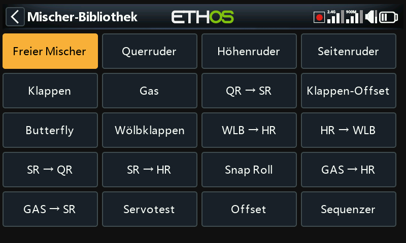

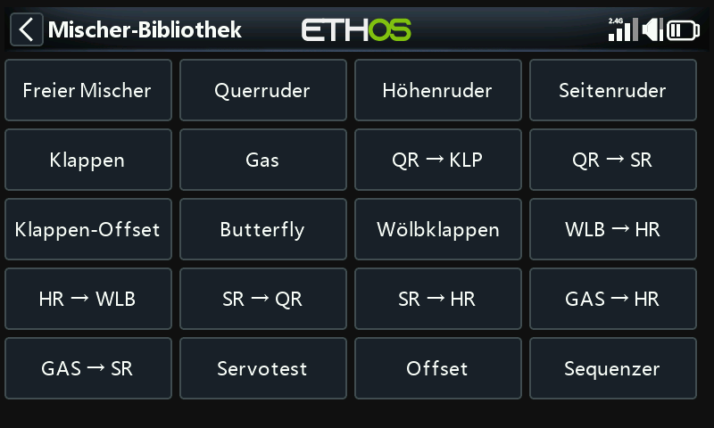

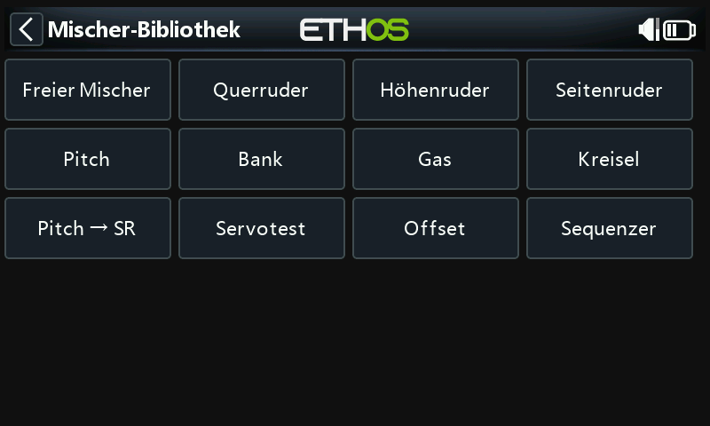

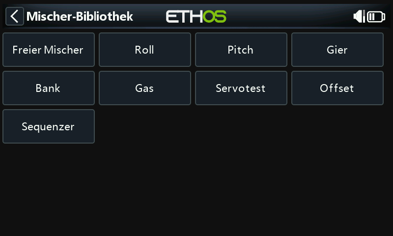

Jede Bibliothek enthält außerdem den **Freien Mischer** – einen
Allzweck-Mischertyp ohne vorgegebenen Ein-/Ausgang, flexibler als die
spezialisierten Einträge, aber mit mehr Einrichtungsaufwand verbunden, um
dasselbe Ergebnis zu erzielen.

## Kanalweise Ansicht {: #per-channel-view }

Sind viele Mischer auf denselben Ausgang gestapelt, lässt sich ihre
Gesamtwirkung in der flachen Tabelle oben nur schwer erkennen. Wählt man einen
Mischer aus und ruft **Nach Kanal anzeigen** auf, werden stattdessen alle
Mischer, die einen Ausgang beeinflussen, gemeinsam gruppiert:

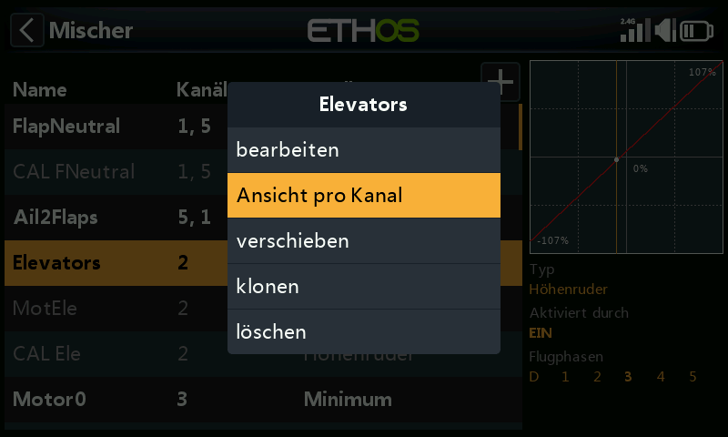

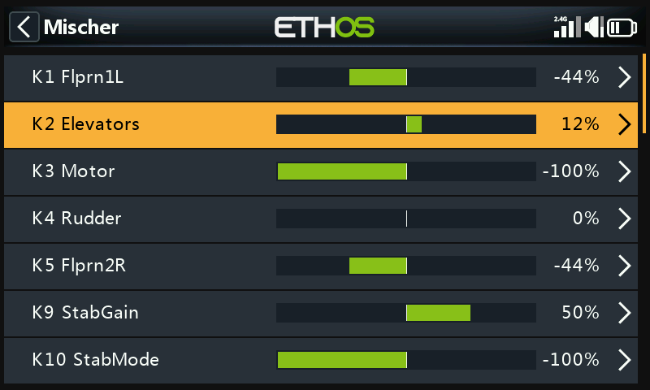

Das Aufklappen der Übersichtszeile eines Kanals zeigt jeden daran beteiligten
Mischer mit seinem aktuellen numerischen und grafischen Ausgangswert – nützlich,
um genau zu prüfen, wie viel ein sekundärer Mischer (z. B. eine
Klappen-Höhenruder-Kompensation) zusätzlich zum primären Knüppeleingang
beisteuert:

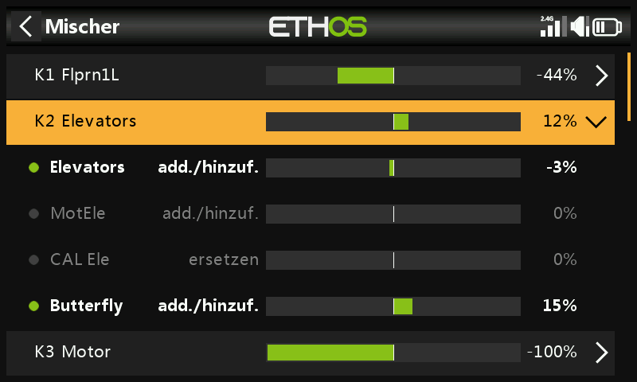

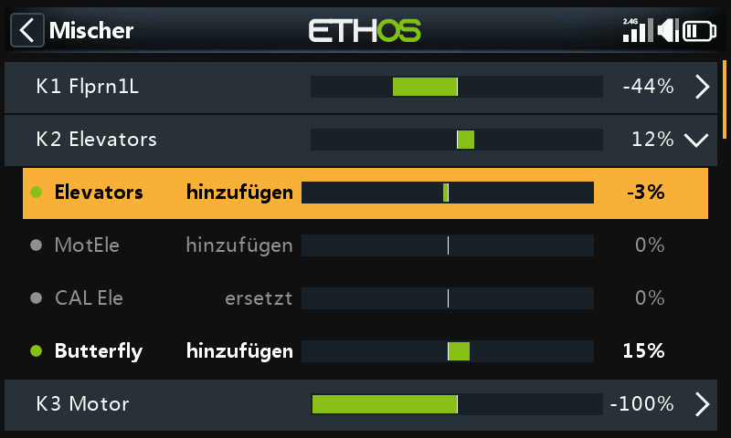

Das Auswählen eines Untermischers anstelle der Übersichtszeile öffnet dasselbe
Kontextmenü wie in der flachen Tabelle (Bearbeiten, zurück zur Tabellenansicht
wechseln, Löschen):

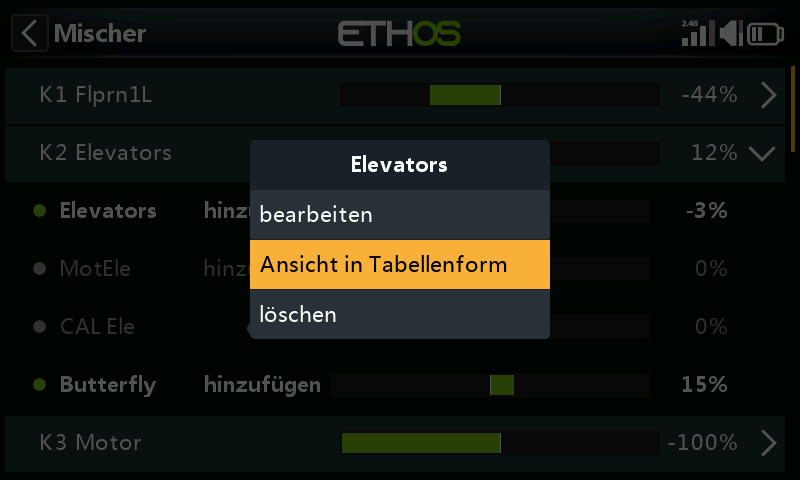

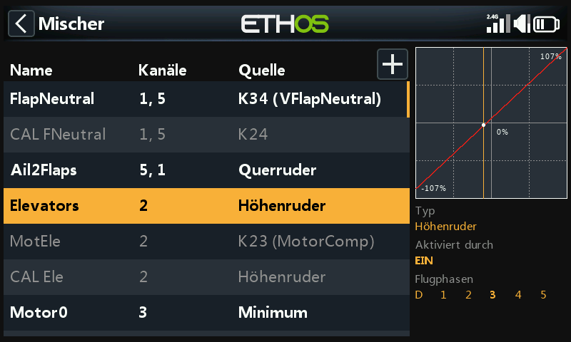
