# Mischer

Die Funktion Mischer ist das Herzstück des Senders. Hier werden die Steuerfunktionen des Modells konfiguriert. Die Mischer-Sektion ermöglicht es, jede der vielen Eingangsquellen nach Wunsch zu mischen oder zu kombinieren und einem der Ausgangskanäle zuzuordnen.

## Übersicht über den Kontrollpfad auf hoher Ebene

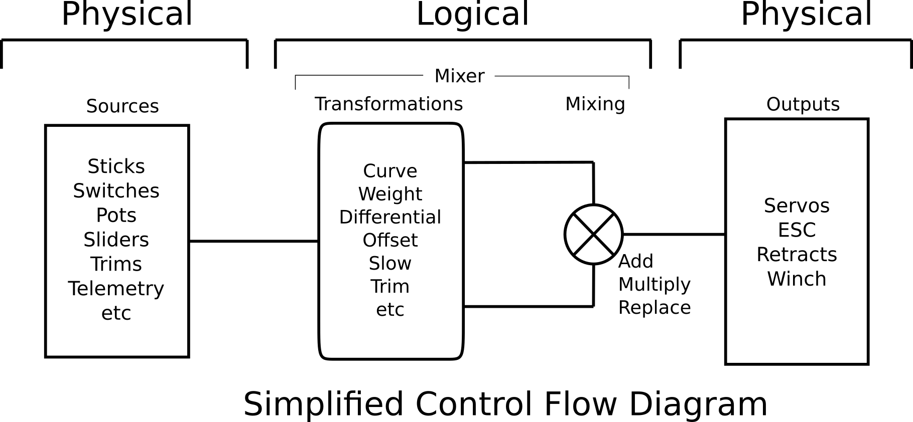

Der Steuerpfad beginnt bei den Hardware-Steuerungen, durchläuft die Programmierlogik in den Mischern und wird schließlich im Menü Kanäle an die mechanischen Eigenschaften des Modells angepasst. Dieser Ansatz geht von einem physikalischen Modell zu einem logischen Modell und dann wieder zurück zu einem physikalischen Modell.

Im Abschnitt Mischer legen wir fest, was unsere verschiedenen Steuerelemente tun sollen. Wir können die Eingänge mit Hilfe von Gewichten, Offsets, Kurven, Differenzierungen oder Langsamkeit transformieren und sie dann nach Bedarf mischen oder kombinieren, wie es erforderlich ist

Das Menü Kanäle ermöglicht dann die Anpassung dieser rein logischen Ausgänge an die mechanischen Eigenschaften des Modells. Er ist die Schnittstelle zwischen der „Logik“ des Setups und der realen Welt mit Servos, Anlenkungen und Steuerflächen sowie Motoren und Messwertgebern.

Ethos verfügt über 120 Mischer für die Programmierung Ihres Modells und 64 Ausgangskanäle. Normalerweise werden die Kanäle mit den niedrigsten Nummern den Servos zugewiesen, da die Kanalnummern direkt den Kanälen im Empfänger zugeordnet sind. Das interne HF-Modul (Radio Frequency) verfügt über bis zu 24 Ausgangskanäle.

Die oberen Kanäle können bei fortgeschrittener Programmierung als „virtuelle Kanäle“ oder bei Verwendung mehrerer HF-Module (intern + extern) und SBus als echte Kanäle verwendet werden. Die Kanalreihenfolge ist eine Frage der persönlichen Vorliebe oder Konvention, oder sie kann vom Empfänger vorgegeben werden. In unserem Beispiel verwenden wir QR HR Gas SR (Querruder, Höhen, Gas, Seitenruder).

Die Quelle oder der Eingang für einen Mischer kann aus analogen Eingängen wie den Knüppeln, Potis und Schiebereglern, den Kippschaltern oder Tastern, beliebigen definierten Logikschaltern, den Trimmschaltern, beliebigen definierten Kanälen, einer Kreiselachse, einem Trainerkanal, eine Stoppuhr, einem Telemetriesensor, einem Systemwert wie der Hauptfunkspannung oder der RTC-Batteriespannung oder einem „speziellen“ Wert wie „Minimum“, „Maximum“ oder 0 gewählt werden.

In diesem Abschnitt kann die Quelle auch konditioniert werden, indem Gewichte/Raten und Offsets definiert und Kurven (z. B. Expo) hinzugefügt werden. Der Mischer kann einem Schalter und/oder Flugphase unterworfen werden, und es kann eine Langsam-Funktion hinzugefügt werden. (Beachten Sie, dass Verzögerungen in den Logikschaltern implementiert sind, da sie mit Schaltern verbunden sind).

Der Mischer-Editor enthält kontextbezogene Hilfeinformationen, die sich dynamisch ändern, wenn die Mischer-Optionen berührt werden. In der ersten Zeile wird die Art des verwendeten Mischers angezeigt, z. B. 'Querruder', 'Höhenruder' oder 'Freier Mischer usw.

Es können bis zu 120 Mischer definiert werden.

Wenn Ihr Modell mit einem der Assistenten zur Modellerstellung in der Funktion „Modellauswahl“ im Systemmenü erstellt wurde, werden die Basismischer angezeigt, wenn Sie auf „Mischer“ tippen.

Darüber hinaus können die gängigsten vordefinierten Mischer sowie frei konfigurierbare Mischer hinzugefügt werden. Im Hauptbildschirm für Mischer (siehe oben) können neue Mischer hinzugefügt werden, indem Sie auf das Symbol „+“ neben den Spaltenüberschriften tippen.

Für jede Steuerung gibt es einen Mischer und eine grafische Anzeige für ihn.

Um einen Mischer zu bearbeiten, tippen Sie auf den Mischer und  erneut, um das Popup-Menü aufzurufen, und wählen Sie dann „bearbeiten“. Weitere Optionen sind das Hinzufügen eines neuen Mischers, das Umschalten auf [die Gruppierungsansicht „Ansicht pro Kanal“](mixes.md) (in einem Abschnitt weiter unten beschrieben), das Verschieben des Mischers nach oben oder unten, das Klonen eines Mischers oder dessen Löschen.

Bitte beachten Sie, dass inaktive Mischer ausgegraut dargestellt werden, um die Fehlersuche zu erleichtern.

Der Sender bittet um eine Bestätigung, bevor es einen Mix löscht, für den Fall, dass eine versehentliche Auswahl getroffen wurde.

## Querruder-, Höhenruder-, Seitenrudermischer

Wir werden die Querruder als Beispiel verwenden, aber die Mischer für Höhen- und Seitenruder sind sehr ähnlich.

### Name

Querruder wurde als Standardname eingegeben, kann aber geändert werden.

### Aktiver Zustand

Die aktive Standardbedingung ist „Immer an“, was für Querruder geeignet ist. Die Bedingung kann durch die Auswahl von Schalter- oder Tastenpositionen, Funktionsschaltern, Flugphasen, Logikschaltern, einem Systemereignis wie Gasabschaltung oder -haltung oder Trimmpositionen festgelegt werden.

### Flugphasen

Wenn im Abschnitt „Flugphasen“ Flugphasen definiert wurden, wird dieser Parameter verfügbar. Der Mischer kann dann von einem oder mehreren Flugphasen abhängig gemacht werden. Klicken Sie auf „Bearbeiten“ und markieren Sie die Kästchen für die Flugphase, in denen diese Mischung aktiv sein muss.

### Kurve

Eine Standardkurvenoption ist Expo, die standardmäßig einen Wert von 0 hat, was bedeutet, dass die Reaktion linear ist (d. h. keine Kurve). Ein positiver Wert macht die Reaktion um 0 herum weicher, während ein negativer Wert die Reaktion schärfer macht. Das obige Beispiel zeigt einen Expo-Wert von 30 %.

Es kann auch eine beliebige zuvor definierte Kurve ausgewählt werden. Der Mischerausgang wird dann durch diese Kurve verändert. Alternativ kann auch eine neue Kurve hinzugefügt werden.

Sie können bis zu 6 Kurven festlegen, jede mit einer Bedingung. Wenn mehr als eine Bedingung erfüllt ist, hat die in der Liste weiter obenstehende Kurve Vorrang. Beachten Sie, dass die Kurve vor der Gewichtung angewendet wird.

### Gewichtung / Anteile

Es können mehrere Gewichtungen oder Anteile definiert werden, die von einer Schalterstellung, einem Funktionsschalter, einem Logikschalter, einer Trimmposition oder einer Flugphase abhängen. Für jede Gewichtung wird eine Zeile hinzugefügt. Die Standardgewichtung (d. h. die erste Zeile) ist aktiv, wenn keiner der anderen Gewichtungen aktiv ist. Auf der linken Seite der definierten Gewichtung befindet sich ein kleines Kreuz innerhalb eines Pfeils, mit dem Sie eine Zeile löschen können. Im obigen Beispiel wurden am Schalter SB drei Gewichtungen eingerichtet.

### Differenzierung (Diff.)

Die Differenzierung ermöglicht unterschiedliche Wege für beide Laufrichtungen der Ruder. Zum Beispiel wird beim Querruder in der Regel ein größerer Querruderausschlag nach oben als nach unten verwendet, um ungünstiges Gieren zu reduzieren und die Kurvenflug-/Handling Eigenschaften zu verbessern. Ein positiver Wert führt dazu, dass die Querruder einen geringeren Abwärtsweg haben, wie in der obigen Grafik zu sehen ist. (Voreinstellung = 0. Bereich -100 bis +100).

In diesem Beispiel wurde mit einem langen Druck auf die Eingabetaste das Dialogfeld zur Auswahl einer Quelle anstelle des voreingestellten festen Werts aufgerufen, in diesem Fall wurde „Drehg. re.“ ausgewählt. Das Diagramm auf der rechten Seite zeigt, dass der Drehgeber auf 50% steht, dies wäre also das Gewicht für die Querruderraten, aber im Flug einstellbar.

Eine Höhenruderdifferenzierung kann für Flugzeuge verwendet werden, die weniger Höhenruder nach unten als nach oben benötigen, typischerweise im Schnellflug.

Beachten Sie, dass der Differential-Parameter nur vorhanden ist, wenn Sie mehr als einen Ausgangskanal haben.

Der Seitenrudermischer hat nur dann den Parameter Differential, wenn das Modell für V-Leitwerk konfiguriert ist.

### Trim

Bietet die Möglichkeit, den zugehörigen Trimmer eines Mischers zu trennen, ohne ihn zu deaktivieren, damit er anderweitig verwendet werden kann.

### Anzahl der Kanäle

Die Kanalanzahl legt fest, wie viele Ausgangskanäle zugewiesen werden. In diesem Beispiel wurden im Assistenten zur Modellerstellung zwei Querruder konfiguriert.

### Ausgang links, Ausgang rechts

Der Modellerstellungsassistent weist den Ausgang links dem Kanal CH1 (Querruder links) zu, da die Standardkanalreihenfolge im Menü „System – Steuerknüppel“ auf AETR (Querruder, Höhenruder, Gas, Seitenruder) eingestellt und „Erste vier Kanäle fixiert“ aktiviert war. Anschließend weist der Wizzard den Ausgang rechts dem Kanal CH5 (Querruder rechts) zu.

Die Standardeinstellung kann bei Bedarf geändert werden. Dabei ist jedoch darauf zu achten, ob und welche Auswirkungen eine Änderung haben könnte. Wenn die Option „Erste vier Kanäle fixiert“ deaktiviert ist, gruppiert der Assistent ähnliche Kanäle, z. B. AAETR statt AETRA.

Beachten Sie, dass Sie mit \[ENT\_lang\] auf dem ausgewählten Ausgangskanal direkt zu dieser Seite in den Abschnitt „Kanäle“  gelangen.

Beachten Sie außerdem, dass die Grafik farblich nach den Ausgängen kodiert ist. Im obigen Beispiel ist Ausgang links rot, was der roten Kurve in der Grafik entspricht, und Ausgang rechts ist orange, was der orangen Kurve in der Grafik entspricht.

## Gasmischer

Der Gasmischer verfügt über Parameter zur Steuerung von Drosselklappenabschaltung und Drosselklappenhaltung. Die Drosselklappe verfügt über eine Sicherheitssperre für die Drosseleingabe, während die Drosselklappe eine einfache Ein/Aus-Funktion hat.

### Eingang

Hier kann die Quelle für den Gasmischer ausgewählt werden. Standardmäßig ist dies der Gasknüppel, kann aber auf einen Analog-, Schalter-, Trimm-, Kanal-, Kreiselachsen-, Trainerkanal-, Stoppuhr- oder Sonderwert geändert werden.

Tippen Sie lange auf \[ENT\] am Eingang, um die Gasoptionen aufzurufen:

#### Eingabeoptionen

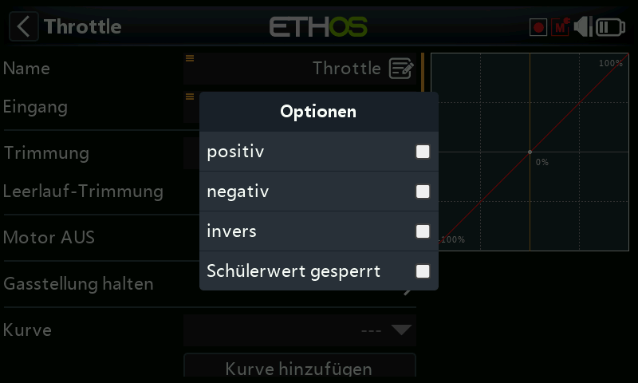

-  Wenn „positiv“ aktiviert ist, wird nur die positive Hälfte des Eingangsreglers in den Mischer eingespeist.
- Wenn „negativ“ aktiviert ist, wird nur die negative Hälfte des Eingangsreglers in den Mischer eingespeist.

Die beiden oben genannten Optionen werden häufig in Oberflächenmodellen verwendet, bei denen der Auslöser sowohl das Gaspedal (positive Hälfte) als auch die Bremse (negative Hälfte) betätigt.

- Aktivieren Sie „invers“, um die Eingabesteuerung umzukehren.
- Durch Aktivieren von „Schülerwert gesperrt“ wird verhindert, dass der Sender des Schülers den Mischer beeinflusst. Weitere Informationen finden Sie im Abschnitt „[Schülerwert gesperrt](logical-switches.md)“.

Lesen Sie bitte auch den Abschnitt „Optionen“ unter [Quellenoptionen](../getting-started/user-interface-and-navigation.md).

### Trim

Ermöglicht die Änderung des Gas-Trimmverhaltens gegenüber der Standardeinstellung.

Sie kann so geändert werden, dass der Gasausgang durch die Trimmtaster für Seitenruder, Höhenruder, Gas und Querruder getrimmt werden kann. Bei der X20 Pro/R/RS und der X18 können auch die Trimmtaster T5 oder T6 zugewiesen werden.

#### Leerlauf-Trimmung

Bei Glüh- und Benzinmotoren wird die Leerlaufdrehzahl mit der „Leerlauf-Trimmung“ eingestellt. Die Leerlaufdrehzahl kann je nach Wetterlage usw. variieren, daher ist es wichtig, eine Möglichkeit zu haben, die Leerlaufdrehzahl anzupassen, ohne die Vollgasposition zu beeinflussen.

Wenn die 'Leerlauf-Trimmung' aktiviert ist, geht der Gaskanal auf eine Leerlaufposition von -75%, wenn der Gasknüppel in der unteren Position steht (siehe die Kanalanzeige unten im Screenshot oben). Mit dem Drosselklappen-Trimmhebel kann dann die Leerlaufdrehzahl zwischen -100% und -50% eingestellt werden. Motor AUS kann dann konfiguriert werden, um den Motor mit einem Schalter abzuschalten.

### Motor AUS

Die Drosselklappenabschaltung verfügt über eine Drosseleingangs-Sicherheitsverriegelung, die sicherstellt, dass der Motor oder die Drosselklappe nur in einer niedrigen Leerlaufposition startet.

In Kombination mit der „Leerlauf-Trimmung“ (siehe oben) kann sie zur Steuerung der Gas- und Leerlaufeinstellungen bei Modellen mit Glüh- oder Benzinantrieb verwendet werden.

#### Aktive Bedingung

Der aktive Zustand kann aus Schalter- oder Tastenpositionen, Funktionsschaltern, Flugphasen, Logikschaltern oder Trimmpositionen gewählt werden.

#### SR FlipFlop

Wenn SR FlipFlop auf EIN steht, wird der Ausgang des Gaskanals auf den Leerlaufausgangswert (Standard -100%) umgeschaltet, sobald die Gasabschaltung aktiv wird.

Wenn der SR FlipFlop auf AUS steht, wird der Ausgang des Gaskanals nur dann auf den 'Leerlauf-Ausgangswert' (Standard -100%) umgeschaltet, wenn der Gasknüppel unter den Auslösewert (Standard -85%) fällt.

#### Trigger-Wert

Der Triggerwert bestimmt den Wert, bei dessen Unterschreitung der Gas-Eingang die Gas-Sicherheitsverriegelung auslöst.

#### Leerlauf-Wert

Sobald die Gas-Abschaltung inaktiv wird, verlässt der Ausgang des Gaskanals den „Leerlaufausgangswert“ nur dann, wenn der Gas-Eingang unter dem Auslösewert liegt. Dadurch wird sichergestellt, dass der Motor nur bei einem niedrigen Gas-Eingangswert anläuft.

Beachten Sie, dass Ethos beim Einschalten sicher startet, auch wenn die Bedingung „Gasabschaltung“ nicht aktiv ist und der Gaseingang nicht auf Minimum steht. Sie müssen den Gaseingang unter den Auslösewert bringen, bevor der Gaskanal aktiviert wird und der Motor bei einem niedrigen Gaseingangswert anlaufen kann.

### Gasstellung halten

Diese Funktion bietet eine einfache Gasfunktion ohne die Sicherheitsverriegelung der obigen Gas-Abschaltung.

Aus Sicherheitsgründen wird bei Elektromotoren dringend empfohlen, anstelle von „Gasstellung halten“ die Option „Motor AUS“ mit ihrer Sicherheitsverriegelung zu verwenden.

#### Aktiviert durch

Der aktive Zustand kann aus Schalter- oder Tastenpositionen, Funktionsschaltern, Flugphasen, Logikschaltern oder Trimmpositionen gewählt werden.

#### Wert

Sobald die Gasstellung-Haltefunktion aktiv ist, wird der eingestellte Wert auf dem Gaskanal ausgegeben. Bei elektrisch betriebenen Modellen ist der Wert für die Drosselklappe normalerweise (-100%).

Der Wert für das Halten des Gaskanals kann auch von einer Quelle stammen.

### Flugphasen

Wenn im Abschnitt „Flugphasen“ Flugphasen definiert wurden, wird dieser Parameter verfügbar. Der Mischer kann dann an einen oder mehrere Flugphasen geknüpft werden.  Klicken Sie auf „Bearbeiten“ und aktivieren Sie die Kontrollkästchen für die Flugphasen, in denen dieser Mischer aktiv sein soll.

### Kurve

Es kann eine Kurve definiert werden, um das Ausgangssignal des Gaskanals anzupassen. Dabei kann auch jede bereits zuvor definierte Kurve ausgewählt werden. Eine typische Anwendung besteht darin, eine Kurve mit Totzone zu definieren, sodass das Ausgangssignal bei -100 verharrt, bis der Gassteuerknüppel ein Stück weit bewegt wurde. Auf diese Weise lassen sich etwaige Probleme bei der Knüppelkalibrierung beheben.

### Anzahl der Kanäle

Die Kanalanzahl legt fest, wie viele Ausgangskanäle zugewiesen werden, standardmäßig 1 für Gas.

## Option „Ansicht pro Kanal“ (Gruppierung von Mischern)

Bei komplexen Mischern kann es schwierig sein, die Auswirkungen anderer Mischer auf einen bestimmten Kanal zu erkennen. Die Option „Ansicht pro Kanal“ ist besonders nützlich bei der Fehlersuche in Ihren Mischern, da alle Mischer, die sich auf den ausgewählten Kanal auswirken, in Gruppen zusammengefasst werden.

In diesem Beispiel werden wir uns den Höhenruderkanal ansehen. Aus der obigen „Tabellenansicht“ der Mischer können wir ersehen, dass das Höhenruder auf Kanal 2 liegt, und dass es weiter unten einen Mischer aus Klappen und Höhenruder gibt, die ebenfalls Kanal 2 als Ausgang hat.

Um die Auswirkungen aller Mischer auf den Höhenruderkanal zu sehen, tippen Sie auf die Höhenrudermischer und wählen Sie im Popup-Dialogfeld „Ansicht pro Kanal“.

Die obige Beispielansicht zeigt, dass zwei Mischer auf diesen Kanal wirken: der eigentliche Höhenruder-Mischer (gesteuert über den Höhenruderknüppel) und ein Butterfly-Mischer, der beim Ausfahren der Wölbklappen eine Höhenruder-Kompensation hinzufügt. Betrachtet man die hervorgehobene Übersichtszeile für Kanal 2 (Höhenruder), so ist zu erkennen, dass der Ausgangswert des Höhenruderkanals bei 12 % liegt. Die Teilmischer zeigen, dass der Höhenruderknüppel aktuell bei -3 % steht, der Butterfly-Mischer jedoch +15 % zum Kanal beisteuert. Eine Betätigung des Wölbklappen-Bedienelements führt zu einer Änderung dieses Kompensationsmischers.

Mit diesem „Ansicht pro Kanal“-Layout lässt sich der Beitrag der verschiedenen Mischungen, die einen Kanal beeinflussen, leicht erkennen, da der Wert jeder Mischung sowohl in grafischer als auch in numerischer Form angezeigt wird.

### Verwaltung der Anzeige 'Ansicht pro Kanal'

#### a) Wechsel zwischen den Kanälen in 'Ansicht pro Kanal'

Wenn Sie auf die Zusammenfassungszeile (oben hervorgehoben) klicken, werden die Sub-Mischer des Kanals ausgeblendet.

Wie oben zu sehen ist, wurden die Sub-Mischer für CH2 HR eingeklappt. Sie können nun nach oben oder unten blättern und einen anderen Kanal auswählen, der erweitert werden soll, um die Mischer anzuzeigen, die zu diesem Kanal beitragen.

#### b) ***Zurückschalten auf 'Tabellenansicht'***

Wenn Sie stattdessen auf einen Submischer klicken, z. B. auf die oben hervorgehobene Zeile, wird ein Popup-Dialogfeld angezeigt, in dem Sie den Mischer bearbeiten, in die Tabellenansicht wechseln oder den Mischer löschen können.

Wenn Sie Tabellenansicht wählen, kehren Sie zur normalen Mischeransicht im Tabellenformat zurück. Alternativ können Sie den markierten Mischer auch bearbeiten oder löschen.

Wir sind zurück in der Tabellenansicht der Mischer.

## Mischer-Bibliotheken

### Motorflugzeug-Bibliothek

Die Liste der verfügbaren vordefinierten Mischer in der Flugzeugbibliothek ist oben dargestellt.

Bitte beachten Sie, dass einige Mischer nur angezeigt werden, wenn die erforderlichen Kanäle im Modell vorhanden sind. Zum Beispiel werden Mischer mit Klappen als Ziel nur angezeigt, wenn gültige Klappen-Konfigurationen definiert sind.

#### Mischer hinzufügen

Im Hauptbildschirm für Mischer (siehe oben) können neue Mischer hinzugefügt werden, indem Sie auf das Symbol „+“ neben den Spaltenüberschriften tippen.

Wählen Sie einen Mischer aus der Liste der verfügbaren vordefinierten Mischer in der Flugzeugbibliothek aus (siehe Screenshot der Bibliothek oben).

In diesem Beispiel wird der freie Mischer verwendet.

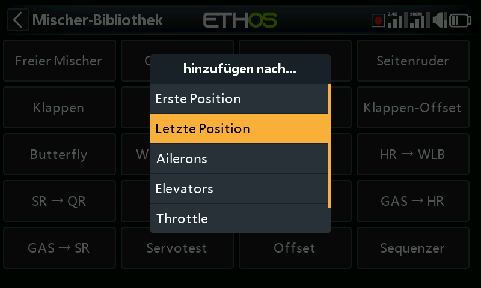

Als nächstes muss die Position für den neuen Mischer gewählt werden, in diesem Beispiel nach „Letzte Position“.

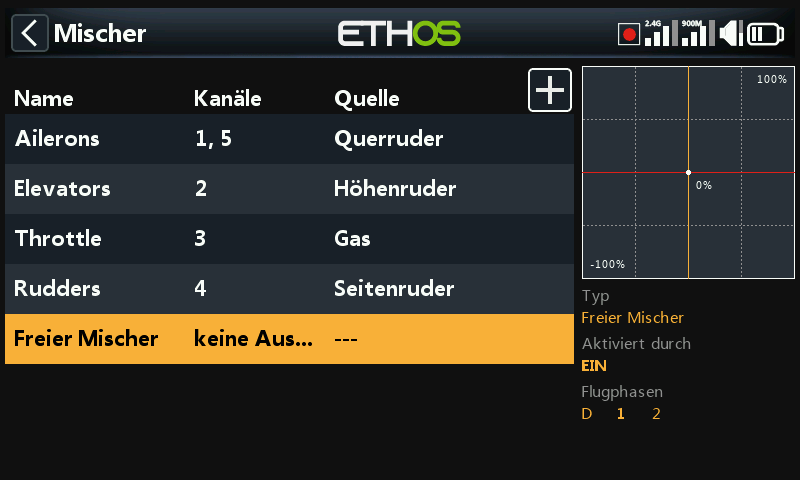

Normalerweise wird der neue Freie Mischer zur Bearbeitung geöffnet, aber wir sind zur Mischeransicht zurückgekehrt, um zu zeigen, dass der Freie Mischer hinzugefügt wurde.

Tippen Sie auf „Freier Mischer“, um das Untermenü „Bearbeiten“ aufzurufen.

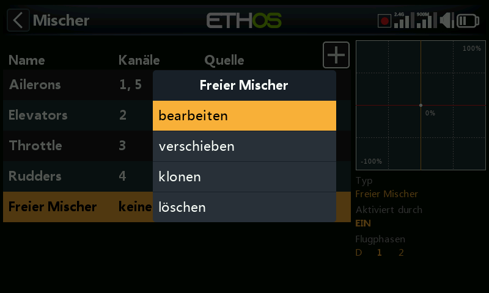

Wählen Sie „Bearbeiten“, um einen neuen Bildschirm mit den Konfigurationsoptionen für den „Freier Mischer“ zu öffnen.

#### Freier Mischer

Freie Mischer sind die Allzweckmischer für alles. Die vordefinierten Mischer sind in gewisser Weise leistungsfähiger, aber auch stärker auf ihre spezifische Anwendung beschränkt. Nicht alle Optionen sind notwendigerweise in freien Mischern verfügbar, aber alles kann mit ihnen gemacht werden, es könnte nur mehr als ein freier Mischer erforderlich sein, um einen einzelnen Spezialmischer zu duplizieren.

Die grafische Anzeige auf der rechten Seite zeigt die Mischerausgabe und die Auswirkungen der vorgenommenen Einstellungsänderungen an.

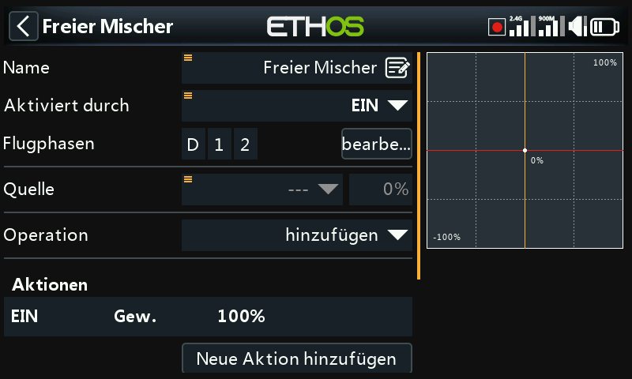

##### Name

Es kann ein beschreibender Name für den Freien Mischer eingegeben werden.

##### aktiviert

Die standardmäßig aktive Bedingung ist „Immer an“. Sie kann durch die Auswahl von Schalter- oder Tastenpositionen, Funktionsschaltern, Flugphasen, Logikschaltern, einem Systemereignis wie Gasabschaltung oder -haltung oder Trimmpositionen bedingt werden.

##### Flugphasen

Wenn im Abschnitt „Flugphasen“ Flugphasen definiert wurden, wird dieser Parameter verfügbar. Der Mischer kann dann von einem oder mehreren Flugphasen abhängig gemacht werden. Klicken Sie auf „Bearbeiten“ und markieren Sie die Kästchen für die Flugphase, in denen diese Mischung aktiv sein muss.

##### Quelle

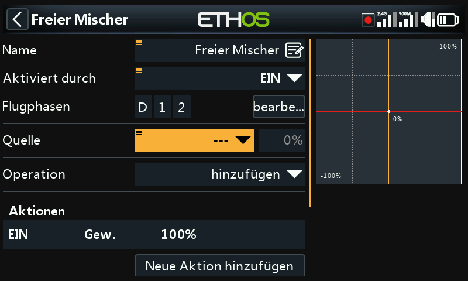

Der Eingang für den Freien Mischer kann eine beliebige Quelle oder sogar ein fester Wert sein.

##### Quellenkategorien

Die Quelle oder Eingabe für diesen Mischer kann aus den folgenden Kategorien ausgewählt werden:

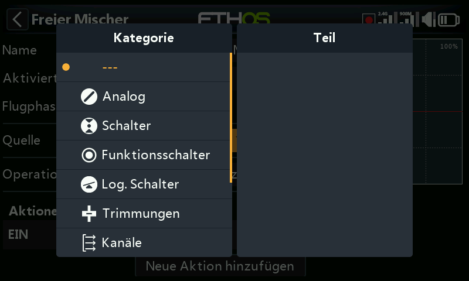

Bitte beachten Sie, dass Kategorien nun durch ein spezielles Symbolpräfix gekennzeichnet sind, um sie von benutzerdefinierten Elementen in Auswahllisten zu unterscheiden. Sobald Sie ein Mitglied in einer Kategorie ausgewählt haben, wird das Kategorie-Symbol vor den Namen des Mitglieds gesetzt. Siehe dazu das folgende Beispiel „Aileron“.

Die Quellenkategorien sind:  
  
a. analoge Eingaben wie Steuerknüppel, Potentiometer und Schieberegler  
b. Kippschalter oder Taster  
c. Funktionsschalter  
d. beliebige definierte Logikschalter  
e. Trimmerschalter  
f. beliebige definierte Kanäle

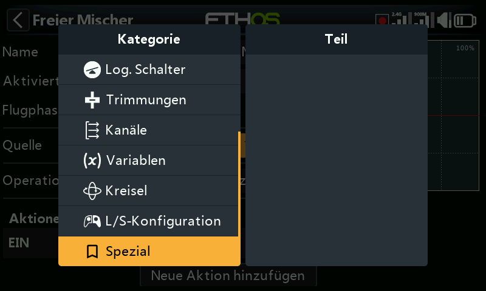

##### Möglichkeit, eine Variable in der „Quellenauswahl“ hinzuzufügen.

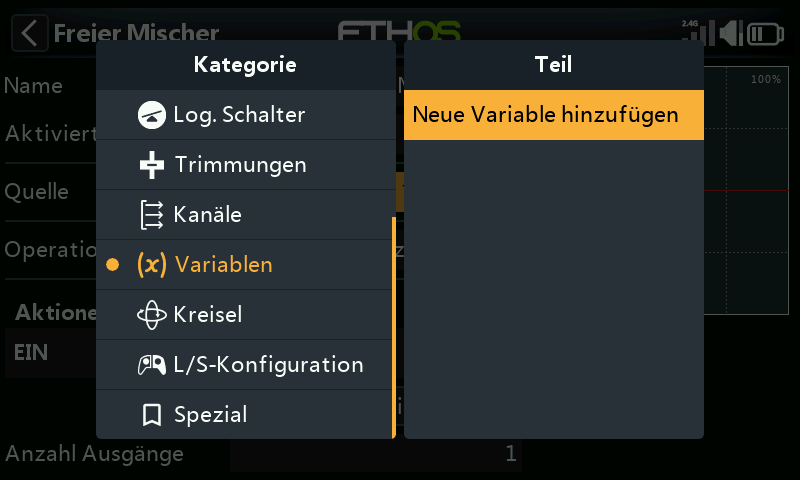

Im Dialogfeld „Quellenauswahl“ kann eine neue Variable angelegt werden.

##### Quelle als fester Wert

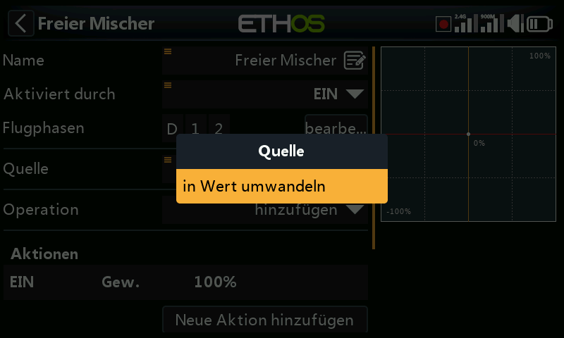

Durch langes Drücken der Eingabetaste auf dem Parameter „Quelle“ wird das Optionsdialogfeld geöffnet, in dem Sie den freien Mischeingang in einen festen Wert umwandeln können.

 section)

(Dies ist zwar einfach, aber Sie sollten stattdessen lieber eine Variable mit einem festen Wert verwenden. Mit Variablen können Sie alle Ihre zentralen Einstellwerte in einem Menü mit aussagekräftigen Namen zusammenfassen. Weitere Informationen finden Sie unter Variablen.[(VARs) ](variables.md)

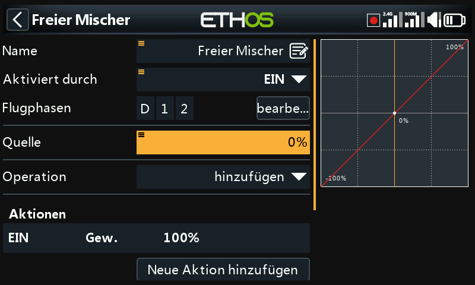

Der feste Wert kann nun angepasst werden.

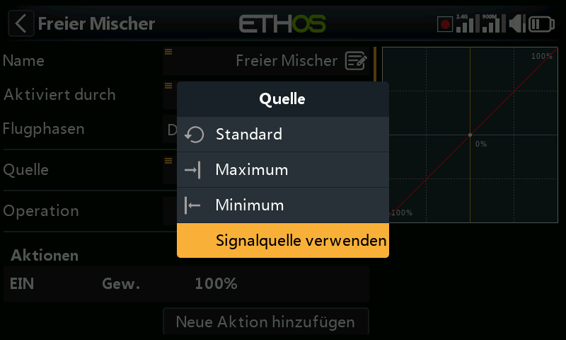

Durch langes Drücken auf den festen Wert können Sie zwischen „Maximum“, „0“, „Minimum“ wählen oder zur Verwendung einer Quelle zurückkehren.

Wir sind wieder bei der Option zur Quellenauswahl angelangt.

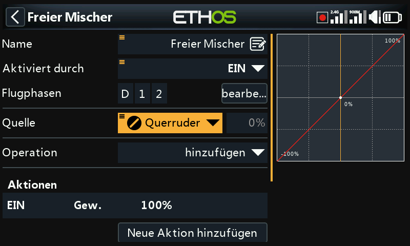

In diesem Beispiel wurde der Querruder-Steuerknüppel als Quelle ausgewählt. Beachten Sie, dass das Symbol für die Kategorie „Analog“ vor „Querruder“ steht.

Beachten Sie, dass der Wert der Quelle neben der Quellenauswahl angezeigt wird, was für die Fehlersuche sehr nützlich ist.

##### Operation

Der Operationstyp legt fest, wie der aktuelle Mischer mit den anderen auf demselben Kanal interagiert. Es gibt drei Funktionstypen:

##### Addition

Die Ausgabe dieses Mischers wird zu allen anderen Mischern auf demselben Ausgangskanal addiert. Bitte beachten Sie, dass Additionsmischungen in beliebiger Reihenfolge erfolgen können (A+B+C = C+B+A).

##### multiplizieren

Das Ergebnis dieses Mischers wird mit dem Ergebnis anderem Mischer auf demselben Ausgangskanal multipliziert.

##### ersetzen

Die Ausgabe dieses Mischers ersetzt das Ergebnis aller anderen Mischer auf demselben Ausgangskanal.

##### sperren

Ein Kanal, der „gesperrt“ ist, kann von keinem anderen Mischer verändert werden, solange der gesperrte Mischer aktiv ist. (Dies ist eine gute Alternative zur Override-Funktion (überschreiben) von OpenTX).

Die Kombination dieser Operationen ermöglicht die Erstellung komplexer mathematischer Operationen.

##### Aktionen

Die freien Mischer sind äußerst flexibel, da bis zu 50 Mischer definiert werden können.

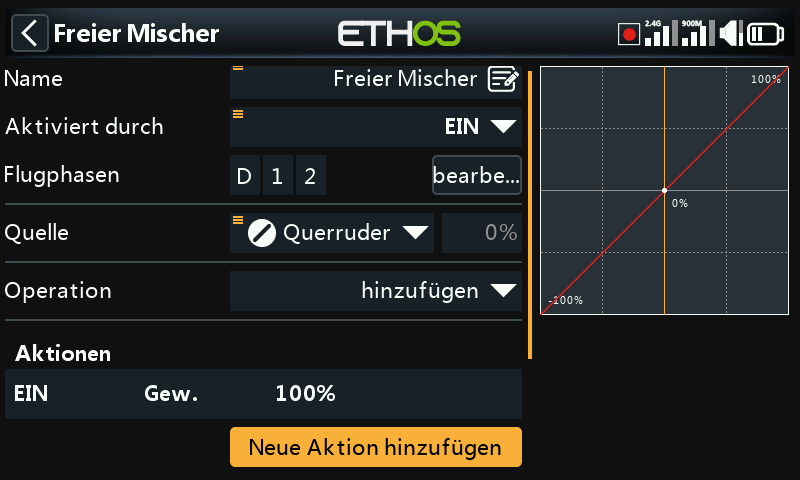

Tippen Sie auf „+ Neue Aktion hinzufügen“, um eine Mischer-Aktion hinzuzufügen.

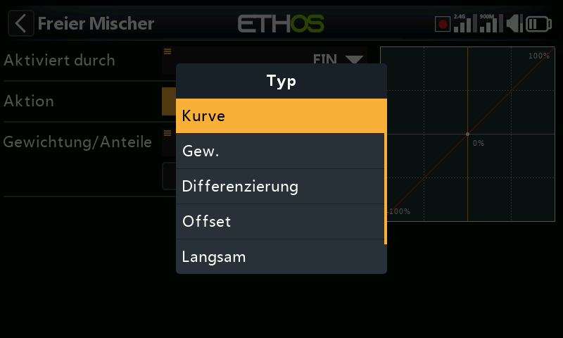

Die verfügbaren Aktionen sind:

- Kurve
- Gewicht
- Differenzierung
- Offset
- Langsam
- Trim

Die Aktionen können kombiniert werden, um z. B. mehrere Gewichtungen mit mehreren Expo-Kurven oder unterschiedliche Gewichte, Differenzierungen usw. zu erstellen.

Die empfohlene Reihenfolge der Aktionen lautet: Langsam, Kurve, Gewichtung, Differential, Offset und dann Trimmung. Diese Reihenfolge sollte eingehalten werden, es sei denn, es gibt einen bestimmten Grund für eine andere Reihenfolge. Beispielsweise möchten Sie möglicherweise einen Offset aus einer Eingabe entfernen. Informationen zum Ändern der Reihenfolge finden Sie im Abschnitt „[Reihenfolge der freien Mischaktionen ändern](mixes.md)“ weiter unten.

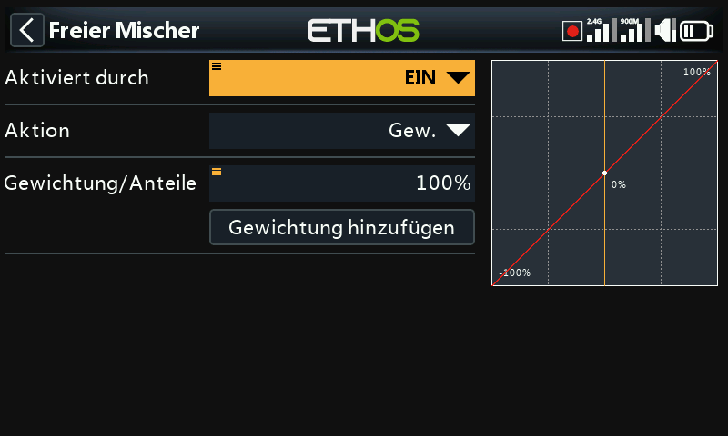

Jede freie Mischeraktion kann ihre eigene „aktive Bedingung“ haben.

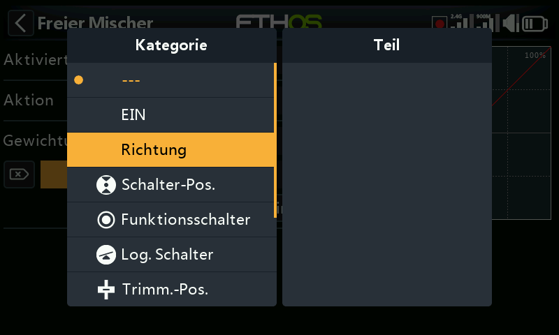

Die standardmäßig aktive Bedingung ist „EIN“. Sie kann durch die Auswahl von Schalter- oder Tastenpositionen, Funktionsschaltern, Flugphasen, Logikschaltern, einem Systemereignis wie z. B. Gas wegnehmen oder halten oder Trimmerstellungen bedingt werden.

Darüber hinaus ist in den aktiven Bedingungen für freie Mischer eine „Richtungs“-Beschränkung verfügbar.

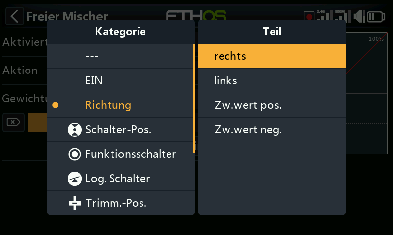

Die verfügbaren Richtungsbeschränkungen sind rechts, links, oben und unten.

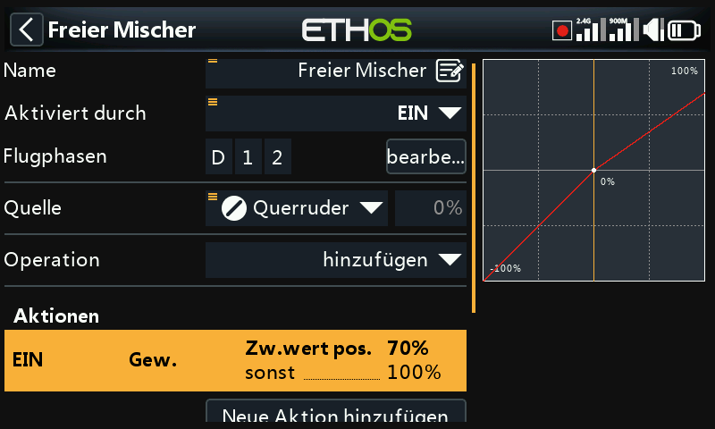

Für unterschiedliche Aufwärts- und Abwärtsgewichte (um die vorherigen „Gewicht nach oben“ und „Gewicht nach unten“ nachzuahmen) können die Bedingungen auf „Oben“ und die Standardeinstellung „Andernfalls“ gesetzt werden. Siehe auch die Gewichtsaktion unten.

##### Aktion Gewichtung

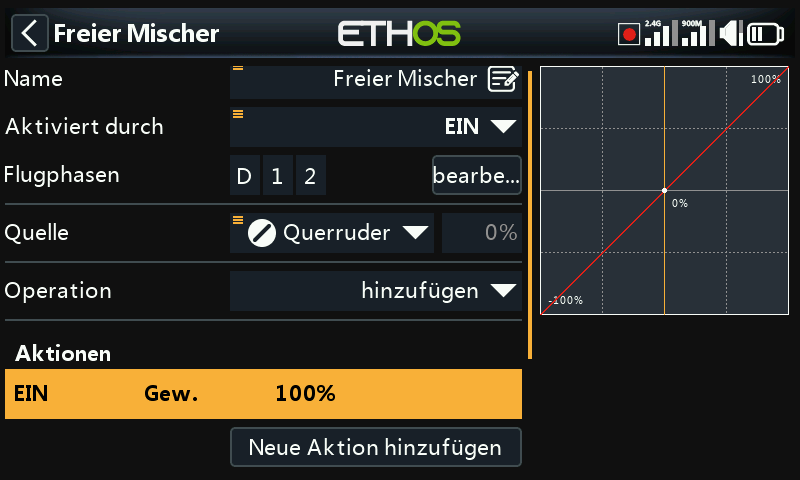

Standardmäßig beginnt der Freie Mischer mit einer „Gewicht“-Aktion von 100 %, die „EIN“ ist. Hinweis: Die Quelle wurde zu Beispielzwecken auf „Querruder“ eingestellt.

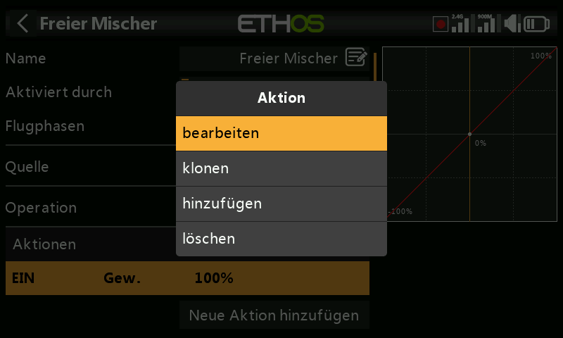

**Das ist wichtig:** Um die Gewichtung des Freien Mischers zu konfigurieren, tippen Sie auf die Standardzeile Gewicht und wählen Sie „bearbeiten“, um Änderungen oder Ergänzungen vorzunehmen. Wenn Sie „eine neue Aktion hinzufügen“ wählen, wird stattdessen eine zweite Aktion „Gewicht“ hinzugefügt.

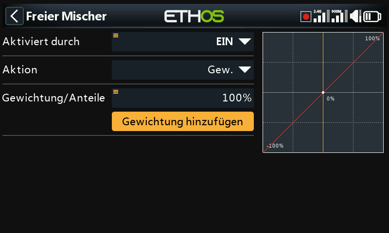

Tippen Sie auf „Gewichtung hinzufügen“, um zusätzliche Gewichtungen hinzuzufügen. Um z.B. mehrere Werte zu erstellen, fügen Sie einfach weitere „Gewichtung“-Aktionen hinzu, die z.B. durch einen Schalter mit 3 Positionen bedingt sind.

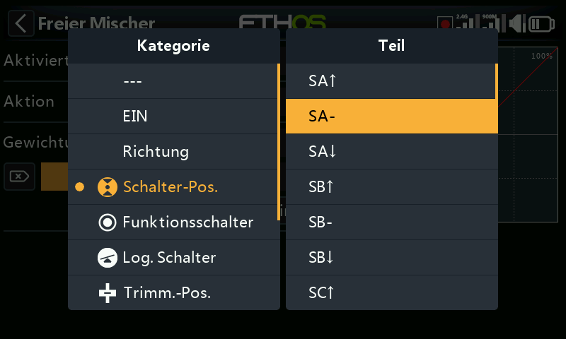

Das obige Beispiel zeigt, dass der Schalter SA- ausgewählt wurde, um die neue Gewichtung bedingt zu machen.

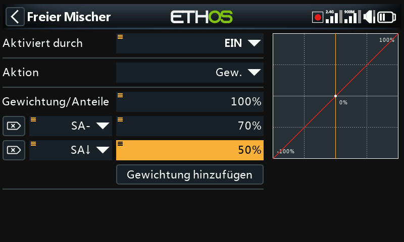

Im obigen Beispiel wurden mit dem Schalter SA zwei zusätzliche Gewichtungen (oder Raten) hinzugefügt.

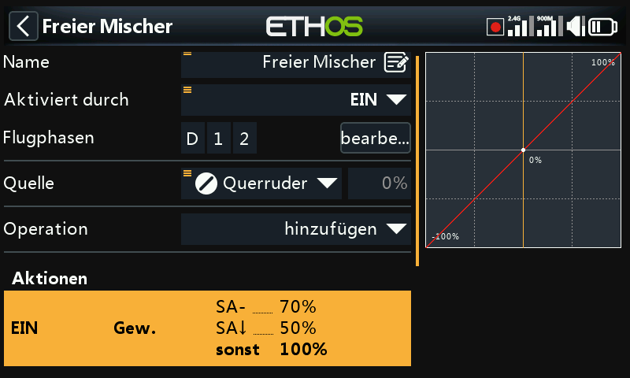

Das Gewichtung beträgt 70 %, wenn sich der Schalter SA in der mittleren Position befindet, und 50 %, wenn sich der Schalter in der unteren Position befindet. Das Gewicht beträgt 100 %, wenn sich der Schalter weder in der mittleren noch in der unteren Position befindet.

##### Kurve

Um im Mischer Kurven hinzuzufügen, wählen Sie „Kurve“ aus dem Dropdown-Menü „Aktionen“.

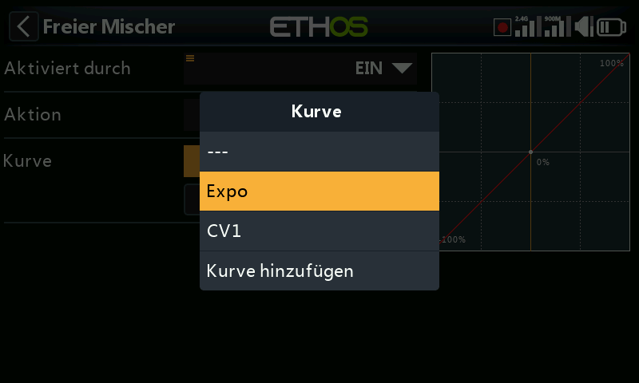

Eine Standardkurvenoption ist Expo, die standardmäßig einen Wert von 0 hat, was bedeutet, dass die Reaktion linear ist (d. h. keine Kurve). Ein positiver Wert macht die Reaktion um 0 herum weicher, während ein negativer Wert die Reaktion schärfer macht.

##### Beispiel für mehrere Expo-'Raten'

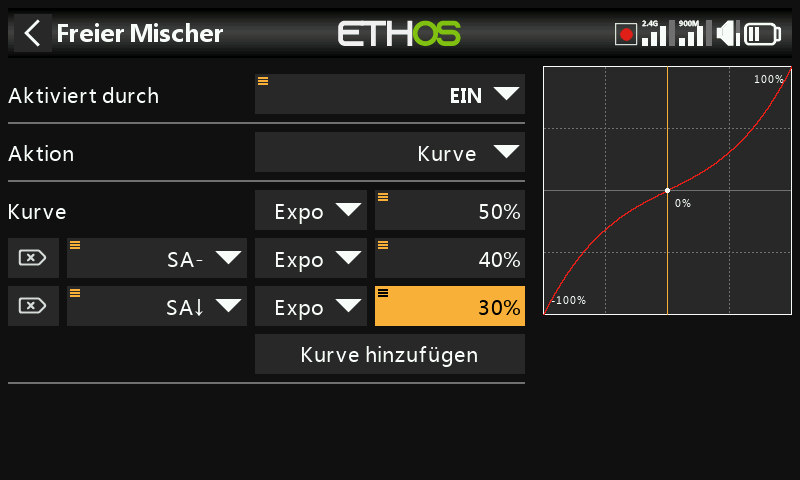

In diesem Beispiel wurden 3 Expo-Raten definiert, um die oben definierten Gewichtungsklassen zu ergänzen.

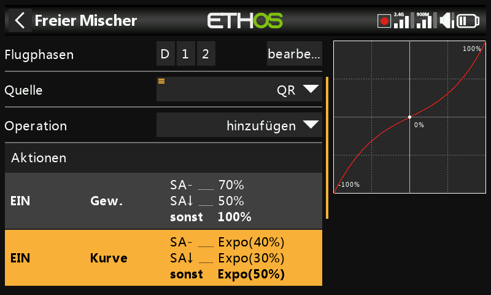

Wenn der SA-Schalter in der mittleren Position steht, beträgt die Gewichtung 70 %, während der Expo 40 % beträgt. Wenn sich der SA-Schalter in der unteren Position befindet, beträgt die Gewichtung 50 % und die Expo-Kurve 30 %. Befindet sich der SA-Schalter in der Standardposition (oben), beträgt die Standardgewichtung 100 % und die Standard-Expo-Kurve 50 %.

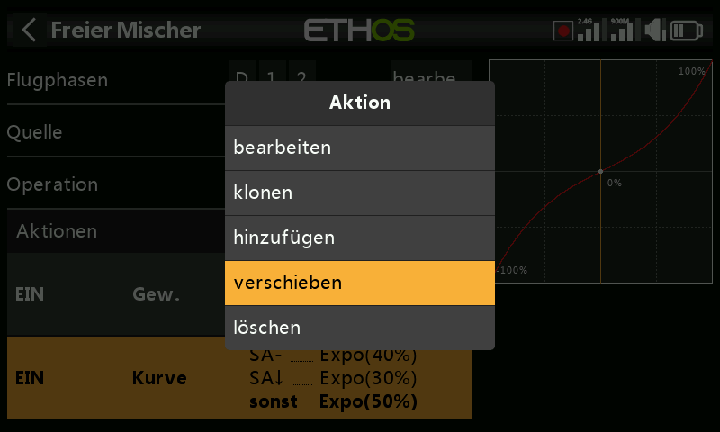

Die empfohlene Reihenfolge der Aktionen ist „Langsam“, „Kurve“, „Gewichtung“, „Differenzierung“, „Offset“ und dann „Trim“, daher verschieben wir unsere Kurvenaktion nach oben, sodass sie vor „Gewichtung“ steht. Tippen Sie auf \[ENT\] auf der markierten Kurvenaktion und wählen Sie dann die Option „verschieben“.

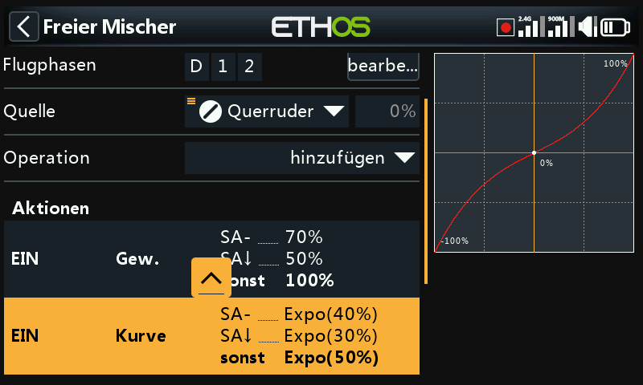

Tippen Sie auf den hervorgehobenen Aufwärtspfeil oder verwenden Sie den Drehgeber, um die Kurvenaktion über das Gewicht zu verschieben.

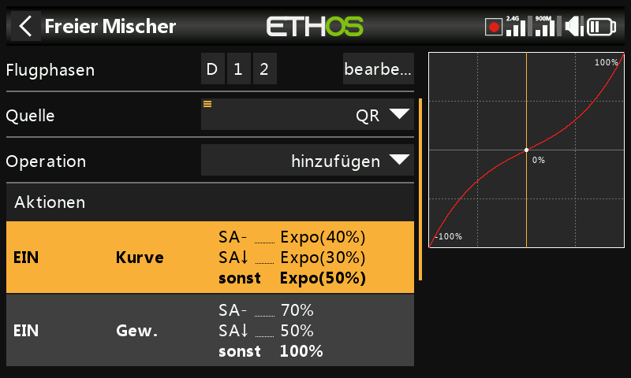

Die Kurvenbewegung befindet sich nun in der ersten Position.

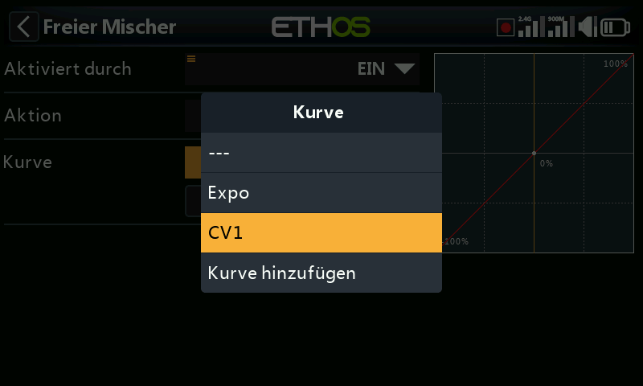

Jede zuvor definierte Kurve kann ebenfalls ausgewählt werden (z. B. CV1 im obigen Beispiel). Der Mischer-Ausgang wird dann durch diese Kurve modifiziert.

Mit dem Freien Mischer und einigen anderen Mischern können Sie bis zu 6 Kurven mit jeweils einer Bedingung festlegen. Wenn mehrere Bedingungen zutreffen, hat die Kurve mit der höheren Position in der Liste Vorrang.

Beachten Sie, dass Kurven vor der Gewichtung angewendet werden.

##### Differential (Diff.)

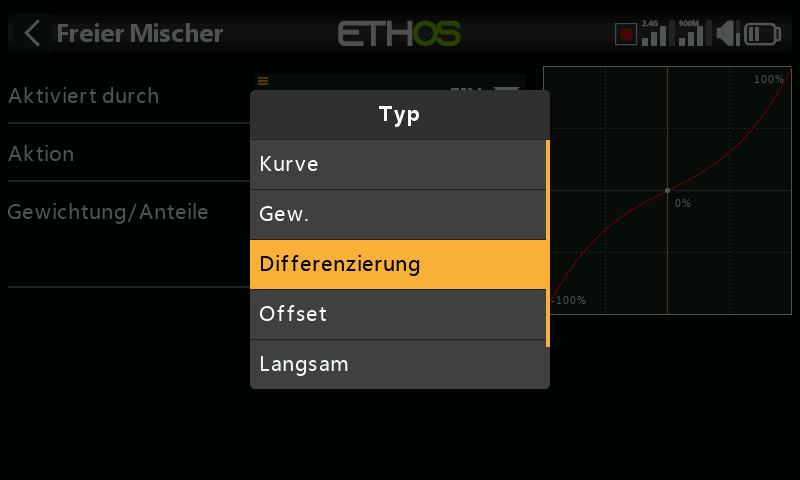

Um eine Differenzierung hinzuzufügen, wählen Sie „Differenzierung“ aus dem Dropdown-Menü „Aktion“.

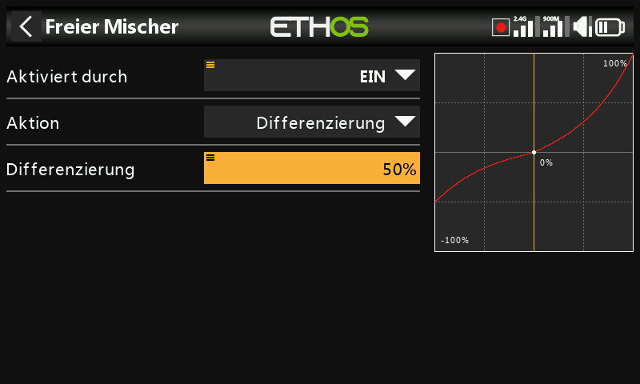

Ein positiver Wert führt dazu, dass der Mischerausgang einen geringeren Abwärtshub hat. (Standardwert = 0. Bereich -100 bis +100). Bei einem Wert von 50% ist der Abwärtshub halb so groß wie der Aufwärtshub, wie im obigen Beispiel zu sehen ist.

Weitere Einzelheiten finden Sie in der Beschreibung der Querrudermischung.

##### Offset

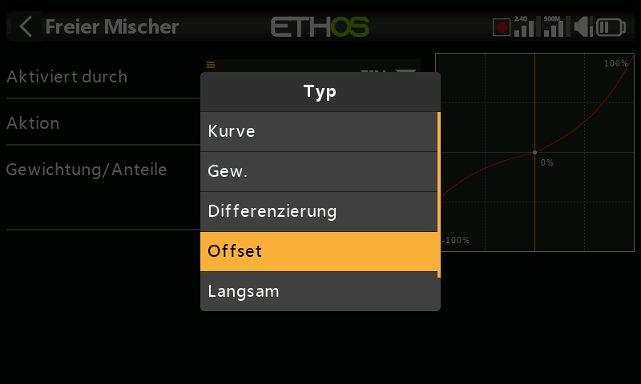

Um im Mischer ein Offset hinzuzufügen, wählen Sie „Offset“ aus dem Dropdown-Menü „Aktion“.

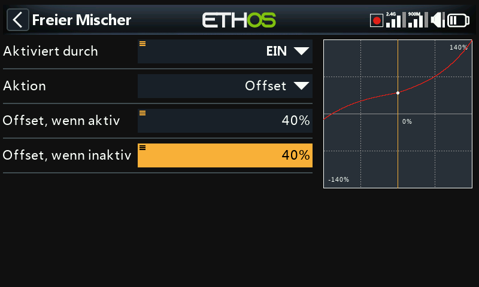

Ein Offset verschiebt den Mischausgang um den hier eingegebenen Offset-Wert nach oben oder unten. Negative Werte sind zulässig.

Es können zwei Offset-Werte definiert werden, einer für den Fall, dass der Freie Mischer aktiv ist, und ein anderer für den Fall, dass der Freie Mischer inaktiv ist.

##### Hinzufügen einer Funktion zu einem Freien Mischer

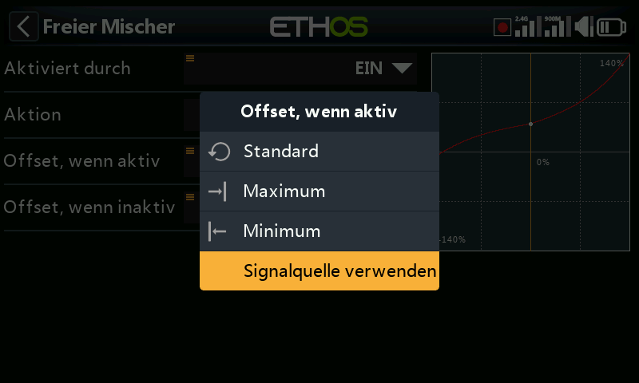

Ein Trimmer kann einem Freien Mischer zugewiesen werden, indem der Trimmer als Quelle (langes Drücken auf das Wertefeld) für den Offset-Parameter verwendet wird.

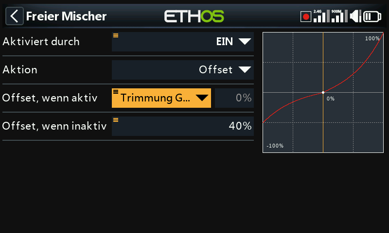

Im obigen Beispiel wurde die Gas-Trimmung als Quelle für die Einstellung des Offsets ausgewählt.

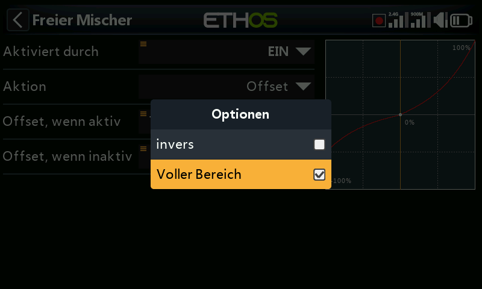

Standardmäßig haben Trimmer einen Bereich von +/- 25 %. Bei Verwendung als Quelle können die Trimmer optional auf den vollen Bereich +/- 100 % geändert werden (drücken Sie lange die Eingabetaste auf der Trimmung).

Die Trimmrichtung kann durch Auswahl von „invers“ geändert werden.

##### Langsam

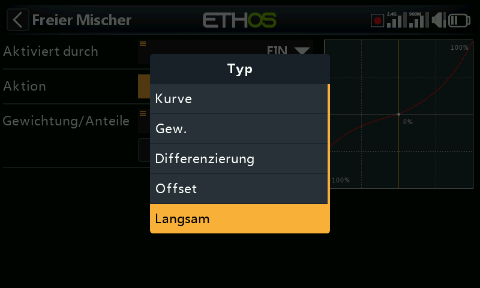

Um eine Aktion hinzuzufügen, die die Reaktion des Mischerausgangs auf die Eingangsänderung verlangsamt, wählen Sie im Dropdown-Menü „Aktionen“ die Option „Langsam“.

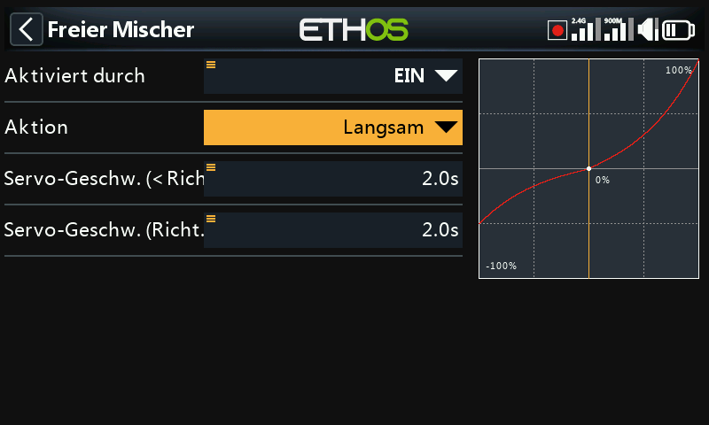

„Langsam“ wird z. B. häufig verwendet, um das Ausfahren der Klappen zu verlangsamen, da ein plötzliche Änderung des Auftriebs zu Steuerungsproblemen führen kann.

Wenn Sie „Langsam“ als erste Aktion angeben, sind die Werte für „Langsam“ die Zeit in Sekunden, die die Ausgabe braucht, um von 0 auf +100% zu gehen (oder sich um 100% zu ändern).

Zum Beispiel:

Aktion 1 - Langsam auf/ab=2s/2s

Aktion 2 - Gewicht=50%

Wenn sich der Eingang von -100% auf +100% ändert,

braucht der Ausgang (2+2)=4s, um von -50% auf +50% zu wechseln.

Folgt hingegen die Aktion „Langsam“ auf die Aktion „Gewichtung/Anteile“, so wird der langsame Übergang proportional kürzer.

Zum Beispiel:

Aktion 1 - Gewicht=50%

Aktion 2 - Langsam auf/ab=2s/2s

Wenn sich der Eingang von -100% auf +100% ändert,

braucht der Ausgang nur (2+2)\*50% = 2s, um von -50% auf +50% zu wechseln.

Für die Auf- und Abwärtsrichtung können unterschiedliche Werte festgelegt werden.

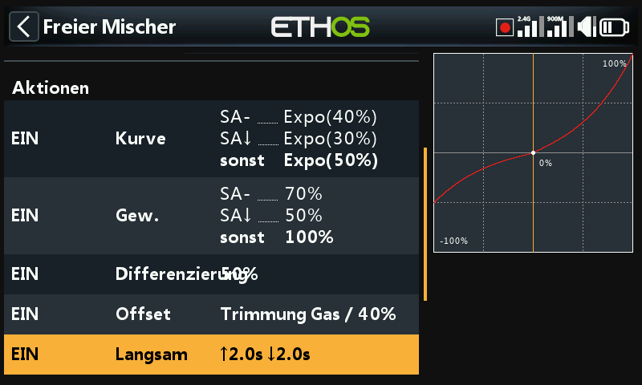

Eine Zusammenfassung der Mischer-Aktionen ist oben abgebildet. Siehe auch die Zusammenfassung unten, in der die Aktion „Langsam“ ganz oben steht.

##### Trimmung

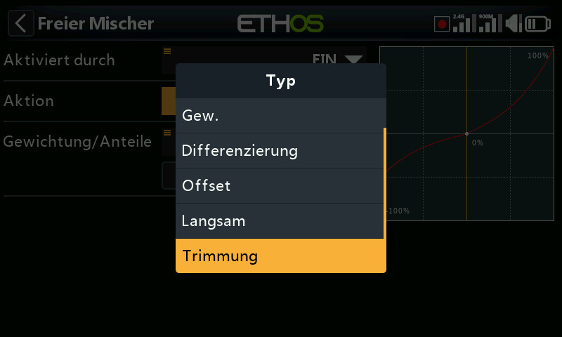

Um dem Mischer eine Trimmung hinzuzufügen, wählen Sie „Trimmung“ aus dem Dropdown-Menü „Aktionen“. Dies ist einfacher als das Hinzufügen des Trimmung unter der Aktion „Offset“.

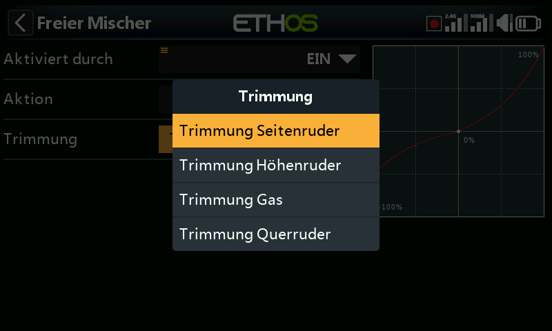

Wählen Sie den zu verwendenden Trimmtaster

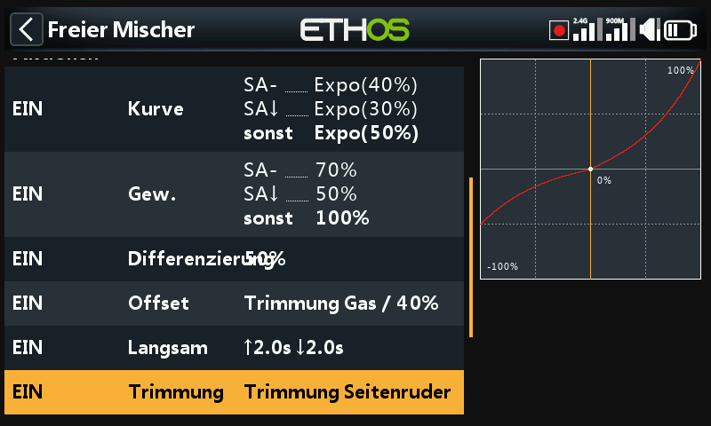

Eine Zusammenfassung aller Mischer-Aktionen finden Sie oben.

##### Neuordnung von freien Mischeraktionen

Wie bereits erwähnt, ist die empfohlene Reihenfolge der Aktionen Langsam, Kurve, Gewicht, Differenzierung, Offset und dann Trimmung. Diese Reihenfolge sollte eingehalten werden, es sei denn, es gibt einen besonderen Grund für die Verwendung einer anderen Reihenfolge. So kann es beispielsweise sein, dass Sie einen Offset von einer Eingabe entfernen möchten.

Da „Gewichtung“ die Standardaktion ist, wenn Sie einen freien Mischer erstellen, werden alle weiteren Aktionen in einer niedrigeren Reihenfolge erstellt, es sei denn, Sie löschen zuerst die Aktion „Gewichtung“. Es ist jedoch einfacher, die Reihenfolge der Mischeraktionen zu ändern, indem Sie die Option „Verschieben“ im Untermenü „Bearbeiten“ verwenden.

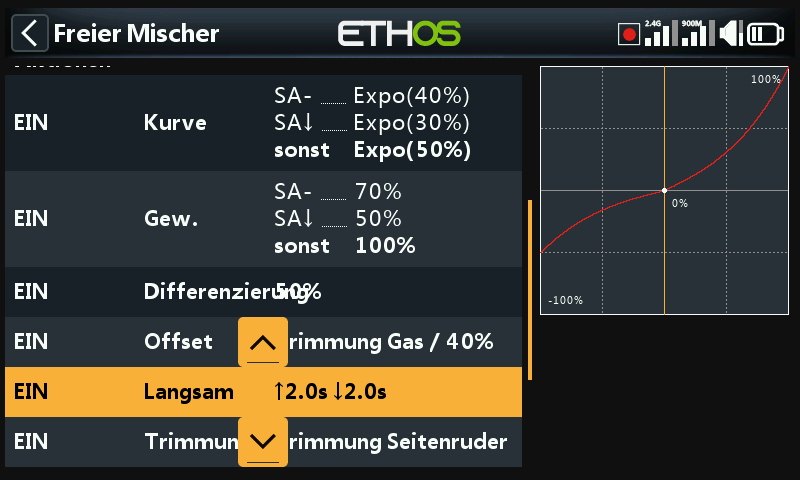

Tippen Sie auf die zu verschiebende Aktion, zum Beispiel die Aktion „Langsam“ im obigen Beispiel, und wählen Sie dann die Option „Verschieben“ im Untermenü „Bearbeiten“. Es erscheinen Verschiebepfeile, mit denen die Aktion in der Reihenfolge nach oben oder unten verschoben werden kann.

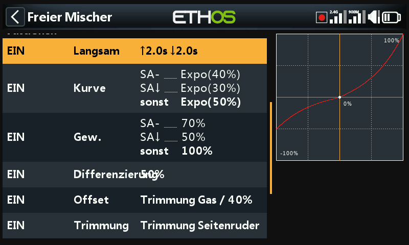

Diese Zusammenfassung zeigt, dass die Aktionen „Langsam“ und „Kurve“ in der Reihenfolge der Aktionen nach oben verschoben wurden.  Beachten Sie, dass „Trimmen“ immer an letzter Stelle stehen sollte.

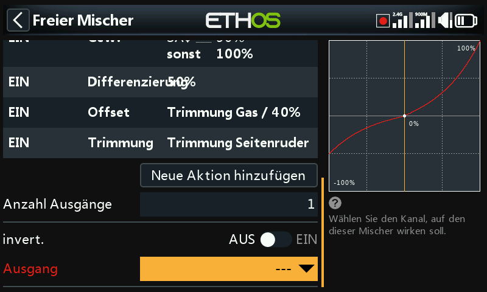

##### Anzahl der Kanäle

Die Kanalanzahl legt fest, wie viele Ausgangskanäle zugewiesen werden.

##### invertiert

Der Ausgang dieses Mischers kann durch Aktivieren dieser Option umgekehrt oder invertiert werden. Bitte beachten Sie, dass die Servoumkehrung unter „Ausgänge“ erfolgen sollte. Diese Option dient dazu, die Logik der Mischung richtig zu gestalten.

##### Ausgänge

##### Es kann ein beliebiger Kanal ausgewählt werden, um den Ausgang dieses Mischers zu belegen. Wenn die Anzahl der Kanäle oben größer als eins ist, muss für jeden Ausgang ein Kanal konfiguriert werden.

#### ***Fortsetzung*** ***der*** ***Flugze******u******g-******Mischerbibliothek***

#### [Querruder, Höhenruder, Seitenruder](mixes.md)

Bitte beachten Sie die detaillierte Beschreibung der [Querruder-Höhenruder-Seitenruder Mischer](mixes.md) oben.

#### Klappen

Der Klappen-Mischer mischt ein Eingangssignal auf einen oder mehrere Kanäle mit individuellen Gewichten. Er bietet auch Optionen zum Verlangsamen und Verringern.

#### Gas

Der Gas-Mischer dient der Motorsteuerung und umfasst die Optionen „Gasabschaltung“ und „Gas halten“. Bitte beachten Sie die ausführliche Diskussion über den [Gas-Mischer](mixes.md) oben.

#### Querruder zu Wölbklappe

Dieser Mischer wird häufig bei Segelflugzeugen verwendet, damit sich die Wölbklappen zusammen mit den Querrudern bewegen, um die Querruderreaktion des Modells zu erhöhen.

#### Querruder zu Seitenruder

Dieser Mischer wird in der Regel verwendet, um das seitliche Abdriften in den Kurven zu verringern. Allerdings ist dieser Mischer nur bei einer bestimmten Fluggeschwindigkeit und Ausrichtung richtig. Es ist besser, zu lernen, die Seitendrift durch manuelle Steuerung des Seitenruders zu korrigieren.

#### Bremsklappen

Der Bremsklappen-Mischer ist ähnlich wie die Butterfly-Mischung unten, außer dass sie durch eine aktive Ein-Aus-Bedingung gesteuert wird.

#### Butterfly

Die Butterfly- oder Krähenbremse wird verwendet, um die Sinkgeschwindigkeit eines Flugzeugs zu steuern. Die Querruder werden so eingestellt, dass sie nur geringfügig nach oben fahren, während die Klappen stark nach unten gehen. Diese Kombination erzeugt einen hohen Luftwiderstand und ist sehr effektiv beim Bremsen und daher ideal für die Steuerung des Landeanflugs. Die Eingabe erfolgt normalerweise über einen Schieberegler (oder den Gasknüppel bei einem Segelflugzeug).

Eine Kompensation ist auch am Höhenruder erforderlich, um ein Aufbäumen des Flugzeugs beim Ausfahren der Klappen zu vermeiden.

Bitte beachten Sie, dass der Mischer einen eingebauten Offset hat, so dass dessen Ausgang in der Klappen-Neutralposition Null ist, d.h. wenn der Gasknüppel (oder die alternative Quelle) in der unteren Position ist, und in der voll ausgefahrenen Klappenposition maximal ist, d.h. in der oberen Position des Gasknüppels (oder der alternativen Quelle). Dieser Offset wird deaktiviert, wenn eine Benutzerkurve hinzugefügt wird, um dieser Kurve volle Kontrolle zu geben.

#### Wölbklappen

Die Wölbklappen-Mischung wird in der Regel verwendet, um eine gewisse Wölbung an den Flügelflächen anzubringen, um den Auftrieb zu erhöhen.

#### Wölbklappe zu Höhenruder

Der Mischer aus Wölbklappe und Höhenruder ist für die Kompensation von Wölbklappen, Sturz und Krähe nützlich, wenn eine individuelle Kompensationskurve erforderlich ist.

#### Höhenruder zu Wölbklappen

Diese auch als Snap Flap bezeichnete Mischung fügt dem Flügel beim Ziehen des Höhenruders eine Wölbung hinzu. Dadurch kann der Flügel effizienter Auftrieb erzeugen, wenn das Flugzeug einen Höhenruder-Befehl erhält.

#### Seitenruder zu Querruder

Dieser Mischer wird verwendet, um das durch das Seitenruder verursachte Gieren im Messerflug auszugleichen.

#### Seitenruder zu Höhenruder

Dieser Mischer kann dazu beitragen, den Messerflug zu verbessern, wenn es Probleme mit der Richtungsstabilität gibt.

#### Snap Roll

Die Snap-Rolle ist ein automatisches Rotationsmanöver in einem überzogenen Zustand. Beim Snap Roll wird ein Flügel abgewürgt, während der andere um die Rollachse beschleunigt wird. Dies führt zu einer plötzlichen Rollbeschleunigung, die Sie nicht einfach durch die Eingabe von Querruder erreichen können. Um diesen Zustand in einem Modell zu erreichen, müssen mehrere Eingaben gemacht werden, einschließlich Höhenruder, Seitenruder und Querruder. Sie können zum Beispiel einen „Inside Left Snap“ ausführen, indem Sie den Mix so programmieren, dass Sie 1 bis 2 Sekunden lang gleichzeitig Höhen-, Seiten- und Querruder nach links geben. Erholen Sie sich von dem Manöver, indem Sie die Steuerknüppel neutralisieren und sofort rechtes Seitenruder hinzufügen, um den Kursverlust zu korrigieren.

#### Gas zu Höhenruder

Dieser Mischer ermöglicht eine Höhenruderkompensation für Flugzeuge, die bei einer Änderung des Gashebels die Neigung ändern.

Bitte beachten Sie, dass der Mischer einen eingebauten Offset hat, so dass dessen Ausgang Null ist, wenn der Gasknüppel in der unteren Position ist, und maximal, wenn der Gasknüppel in der oberen Position ist. Dieser Offset wird deaktiviert, wenn eine Benutzerkurve hinzugefügt wird, um dieser Kurve volle Kontrolle zu geben.

#### Gas zu Seitenruder

Diese Mischung hilft dem Flugzeug, gerade zu fliegen, wenn es Vollgas gibt; sie wird im Allgemeinen benötigt, wenn man eine vertikale Aufwärtslinie fliegt.

Bitte beachten Sie, dass der Mischer einen eingebauten Offset hat, so dass der Ausgang der Mischung Null ist, wenn der Gasknüppel in der unteren Position ist, und maximal, wenn der Gasknüppel in der oberen Position ist. Dieser Offset wird deaktiviert, wenn eine Benutzerkurve hinzugefügt wird, um dieser Kurve die volle Kontrolle zu geben.

#### Testmischer

Dieser Mischer eignet sich hervorragend zum Testen von Servos. Sie enthält eine Bereichseinstellung, sowie Slow Up und Slow Down.

Aus Sicherheitsgründen vermeidet der Test-Mischer Gaskanäle.

#### Offset

Der Offset-Mischer wird verwendet, um einen festen Wert zur Mischung hinzuzufügen, wenn ein Offset erforderlich ist. Eine häufige Anwendung sind Klappen, bei denen der Servohebel in eine Richtung versetzt wird, um den Klappenweg nach unten zu maximieren. Dies führt dazu, dass sich die Klappen bei Servoneutralstellung auf halbem Weg nach unten befinden. Der Offset-Mischer kann dann verwendet werden, um die Klappen in die „Oberflächen-Neutralstellung“ zu bringen, wenn der Ausgang der Klappenmischung Null ist.

#### Sequencer

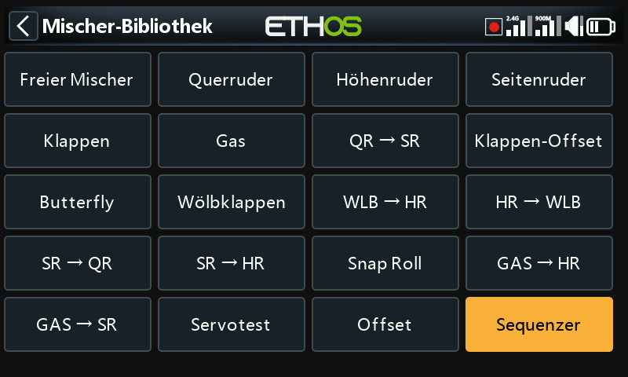

Der Sequenzer-Mischer ermöglicht es, mehrere Kanäle mithilfe programmierbarer Zeitbasen und Kurven vorwärts und rückwärts zu sequenzieren. Dies ist sehr nützlich für die Programmierung von Dingen wie Fahrwerks- und Fahrwerksklappensequenzen. Der Sequenzer wurde mit den notwendigen Bedienelementen ausgestattet, um die Programmierung der Sequenz zu vereinfachen und gleichzeitig uneingeschränkte Flexibilität zu ermöglichen, die nur durch Ihre Vorstellungskraft begrenzt ist.

Bevor Sie mit der Programmierung beginnen, sollten Sie sich überlegen, wie der Sequenzer funktionieren soll.

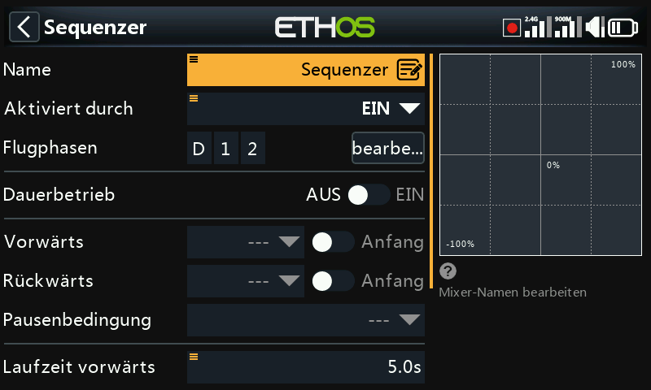

##### Name

Für den Sequenzer-Mischer kann ein beschreibender Name eingegeben werden.

##### Aktiviert durch

Die standardmäßige aktive Bedingung ist „Immer eingeschaltet“. Sie kann durch Auswahl aus Schalter- oder Tastenpositionen, Funktionsschaltern, Flugphasen, Logikschaltern, einem Systemereignis wie Gaswegnahme oder Halten oder Trimmpositionen bedingt gemacht werden.

##### Flugphasen

Wenn im Abschnitt „Flugphasen“ Flugphasen definiert wurden, wird dieser Parameter verfügbar. Der Mischer kann dann an einen oder mehrere Flugphasen geknüpft werden. Klicken Sie auf „Bearbeiten“ und aktivieren Sie die Kontrollkästchen für die Flugphasen, in denen dieser Mischer aktiv sein soll.

##### Schleifenmodus (Dauerbetrieb)

Wenn der Schleifenmodus aktiviert ist, läuft der Sequenzer kontinuierlich vorwärts und rückwärts in einer Schleife. Wenn der Loop-Modus deaktiviert ist, muss die Vorwärts- oder Rückwärtsbedingung erfüllt sein, bevor die entsprechende Sequenz startet.

Ein gutes Anwendungsbeispiel für den Schleifenmodus ist eine Servotester-Sequenz.

##### Vorwärtsbedingung

Die Vorwärtsbedingung startet den Sequenzer in Vorwärtsrichtung. Er läuft dann bis zum Ende der unten angegebenen Vorwärtsdauer, es sei denn, der Parameter „Anfang“ ist auf „EIN“ gesetzt.

##### Anfang

Die Option „Anfang“ ermöglicht es, die Vorwärtslaufsequenz vorzeitig zu beenden, wenn die Rückwärtsbedingung geltend gemacht wird.

##### Rückwärtsbedingung

Der Rückwärtszustand startet den Sequenzer in Rückwärtsrichtung. Er läuft dann bis zum Ende der unten angegebenen Rückwärtsdauer, es sei denn, der Parameter „Anfang“ ist auf „EIN“ gesetzt.

##### Anfang

Die Option „Anfang“ ermöglicht es, die Rückwärtslaufsequenz vorzeitig zu beenden, wenn die Vorwärtsbedingung erfüllt ist.

##### Pausenbedingung

Der Sequenzer kann durch Setzen der Pausenbedingung angehalten werden. Er bleibt im Pausenmodus, bis die Pausenbedingung wieder auf „FALSCH“ gesetzt wird.

##### Laufzeit vorwärts

Die Zeitbasis für die Vorwärtssequenz kann hier konfiguriert werden.

##### Laufzeit rückwärts

Die Zeitbasis für die Rückwärtssequenz kann hier konfiguriert werden. Sie kann sich von der Vorwärtsdauer unterscheiden.

##### Ausgang 1

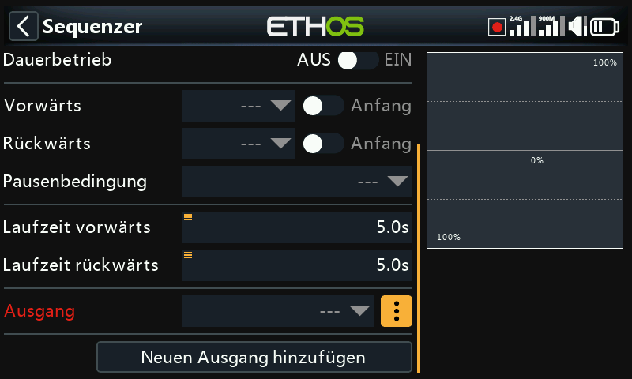

Jeder Kanal kann ausgewählt werden, um die Ausgabe vom Sequenzer zu empfangen.

##### Ausgang 1 Menü

Tippen Sie auf die 3 Punkte, um das Menü mit den Kurvenoptionen zu öffnen.

##### Kurvenoptionen

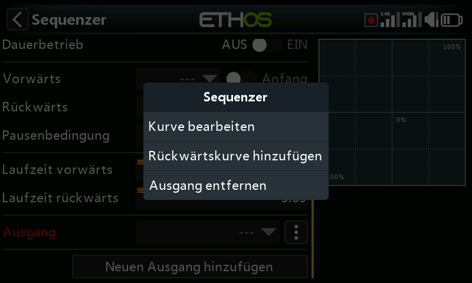

##### Kurve bearbeiten

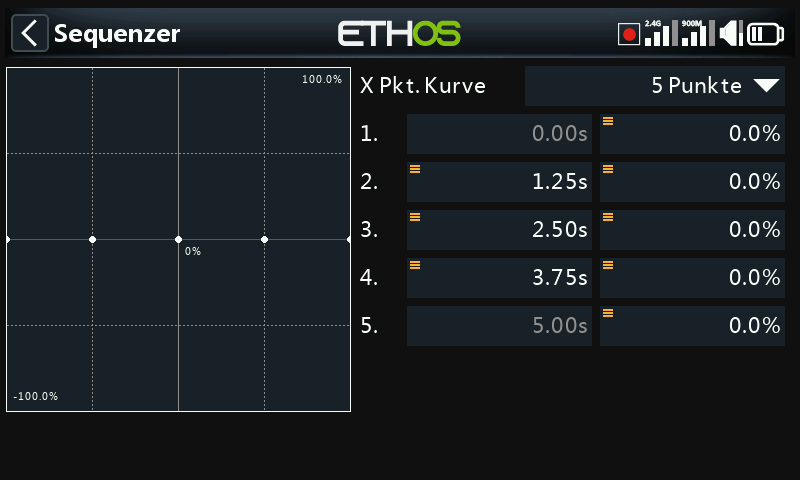

Die Kurve hat standardmäßig 5 Punkte, kann jedoch bis zu 21 Punkte haben. Sowohl die X- als auch die Y-Koordinaten sind konfigurierbar.

##### Eine Rückwärtskurve hinzufügen

Standardmäßig wird für beide Richtungen dieselbe Kurve verwendet, es kann jedoch eine separate Rückwärtskurve hinzugefügt werden.

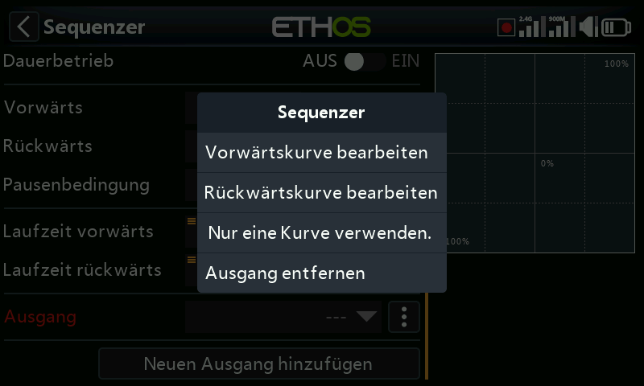

Sobald eine Rückwärtskurve hinzugefügt wurde, können beide Kurven über das Optionsmenü bearbeitet werden.

##### Vorwärtskurve bearbeiten

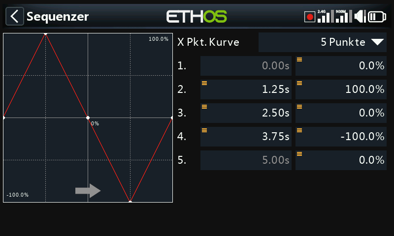

Die Vorwärtskurve kann bearbeitet werden. Bei zwei Kurven zeigt ein Pfeil an, welche gerade bearbeitet wird.

Die oben gezeigte Beispielkurve wäre für die Anwendung in einer Servotester-Sequenz geeignet.

##### Rückwärtskurve bearbeiten

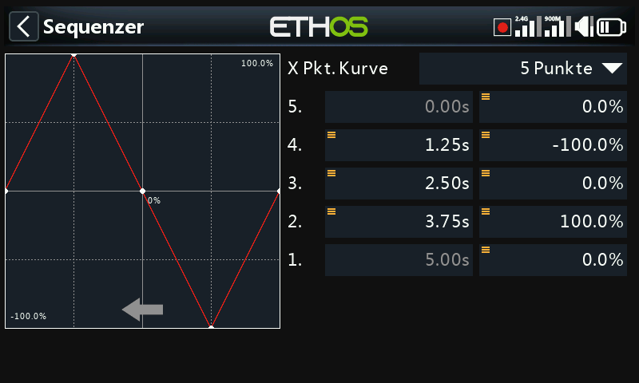

Die Rückwärtskurve kann bearbeitet werden. Bei zwei Kurven zeigt ein Pfeil an, welche Kurve gerade bearbeitet wird.

Wenn die Rückwärtskurve **nach** der Konfiguration der Vorwärtskurve erstellt wird, wird die Vorwärtskurve in die Rückwärtskurve kopiert und kann dann geändert werden.

##### Nur eine Kurve verwenden

Wenn Sie Ihre Meinung ändern, können Sie die Rückwärtskurve entfernen, indem Sie „Nur eine Kurve verwenden“ auswählen.

##### Ausgang entfernen

Der Ausgang kann ebenfalls entfernt werden.

##### Neuen Ausgang hinzufügen

Es können zusätzliche Ausgänge hinzugefügt werden, jeder mit seiner eigenen Kurve(n).

Dadurch kann beispielsweise ein Ausgang die Fahrwerksklappen steuern, während ein anderer das einziehbare Fahrwerk steuert. Mithilfe der Kurven jedes Ausgangs kann eine Sequenz konfiguriert werden, bei der zuerst die Fahrwerksklappen langsam geöffnet werden, dann das einziehbare Fahrwerk ausgefahren wird und schließlich die Klappen wieder geschlossen werden, wobei die Zeitsteuerung so erfolgt, dass für jeden Schritt die richtige Zeit zur Verfügung steht. Die Kurven können mit einer Steigung konfiguriert werden, um die Geschwindigkeit der Ausgangsänderung zu steuern, oder um sofort zu schalten, wenn beispielsweise der Einziehregler seine eigene Betriebsgeschwindigkeit steuert.

Ein Beispiel finden Sie unter „So konfigurieren Sie einen Tür- und Fahrwerkssequenzer“.

### Segelflugzeug-Bibliothek

Die Liste der verfügbaren vordefinierten Mischer in der Segelflieger-Bibliothek ist oben aufgeführt.

Bitte beachten Sie, dass einige Mischer nur angezeigt werden, wenn die erforderlichen Kanäle im Modell vorhanden sind. Beispielsweise werden Mischer mit Klappen als Ziel nur angezeigt, wenn gültige Klappenkonfigurationen definiert sind.  Klappenbezogene Mischer werden in der Mischungsbibliothek angezeigt, wenn Klappen in „Modell bearbeiten“ definiert sind.

#### Freier Mischer

Bitte beachten Sie die Beschreibung des [Freien Mischers ](mixes.md)unter dem Abschnitt Flugzeugbibliothek oben.

#### Querruder, Höhenruder, Seitenruder

#### Bitte beachten Sie die detaillierte Beschreibung der [Quer-Höhen-Seitenruder-Mischer ](mixes.md)oben.

#### Klappen

Der Klappen-Mischer mischt ein Eingangssignal auf einen oder mehrere Kanäle mit individuellen Gewichten. Er bietet auch Optionen zum Verlangsamen und Verringern.

#### Gas

Der Gasmischer dient der Motorsteuerung und umfasst die Optionen Drosselabschaltung und Drosselhalt. Bitte beachten Sie die ausführliche Beschreibung über die [Gasmischung](mixes.md) oben.

#### Querruder zu Wölbklappe

Dieser Mischer wird häufig bei Segelflugzeugen verwendet, damit sich die Wölbklappen zusammen mit den Querrudern bewegen, um die Querruderreaktion des Modells zu erhöhen.

#### Querruder zu Seitenruder

Diese Mischung wird in der Regel verwendet, um das seitliche Schieben in Kurven zu verringern. Allerdings ist dieser Mischer nur bei einer bestimmten Fluggeschwindigkeit und Ausrichtung richtig. Es ist besser, zu lernen, dies durch manuelle Steuerung des Seitenruders zu korrigieren.

#### Klappen-Offset

Der Klappen-Offset-Mischer ist ähnlich wie die Butterfly-Mischung unten, außer dass sie durch eine aktive Ein-Aus-Bedingung gesteuert wird.

#### Butterfly

Die Butterfly- oder Krähenbremse wird verwendet, um die Sinkgeschwindigkeit eines Flugzeugs zu steuern. Die Querruder werden so eingestellt, dass sie nur geringfügig ausschlagen, während die Klappen stark ausschlagen. Diese Kombination erzeugt einen hohen Luftwiderstand und ist sehr effektiv beim Bremsen und daher ideal für die Steuerung des Landeanflugs. Die Eingabe erfolgt normalerweise über einen Schieberegler (oder den Gasknüppel bei einem Segelflugzeug).

Das Höhenruder muss ebenfalls kompensiert werden, um ein Aufbäumen des Flugzeugs zu verhindern, wenn sich dadurch der Auftrieb erhöht.

Bitte beachten Sie, dass der Mischer einen eingebauten Offset hat, so dass dessen Ausgang in der Klappen-Neutralstellung Null ist, d.h. wenn sich der Gashebel (oder die alternative Quelle) in der unteren Position befindet, und in der voll ausgefahrenen Klappenposition, d.h. in der oberen Position des Gashebels (oder der alternativen Quelle), maximal ist. Dieser Offset wird deaktiviert, wenn eine Benutzerkurve hinzugefügt wird, um dieser Kurve volle Kontrolle zu geben.

#### Wölbklappen

Die Wölbklappen werden in der Regel verwendet, um den Flügeln eine gewisse Wölbung zu verleihen, um den Auftrieb zu erhöhen.

#### Wölbklappen zum Höhenruder

Der Mischer aus Wölbklappe und Höhenruder ist für die Kompensation setzen von Wölb-, Störklappen und Butterfly nützlich, wenn eine individuelle Kompensationskurve erforderlich ist.

#### Höhenruder zu Wölbklappen

Dieser, auch als Snap Flap bezeichnete Mischer, fügt dem Flügel beim Ziehen des Höhenruders eine Wölbung hinzu. Dadurch kann der Flügel effizienter Auftrieb erzeugen, wenn das Flugzeug einen Steigen-Befehl erhält.

#### Seitenruder zu Querruder

Dieser Mischer kann verwendet werden, um ruderinduziertes Gieren auszugleichen.

#### Seitenruder zu Höhenruder

Dieser Mischer kann bei Kopplungsproblemen helfen. Sie kann auch zum Hinzufügen einer V-Leitwerks-Differenzierung verwendet werden.

#### Gas zu Höhenruder

Dieser Mischer ermöglicht einen Höhenruderausgleich für Flugzeuge, die bei einer Gasänderung die Neigung ändern.

#### Gas zu Seitenruder

Dieser Mischer hilft dem Flugzeug, gerade zu fliegen, wenn es Vollgas gibt; sie wird im Allgemeinen benötigt, wenn man eine vertikale Aufwärtslinie fliegt.

#### Servotester

Dieser Mischer eignet sich hervorragend zum Testen von Servos. Sie enthält eine Bereichseinstellung, sowie eine langsame Verstellbewegung.

#### Offset

Der Offset-Mischer wird verwendet, um einen festen Wert zum Mischer hinzuzufügen, wenn ein Offset erforderlich ist. Eine häufige Anwendung sind Klappen, bei denen der Servohebel in eine Richtung versetzt wird, um den Klappenweg nach unten zu maximieren. Dies führt dazu, dass sich die Klappen bei Servoneutralstellung auf halbem Weg nach unten befinden. Der Offset-Mischer kann dann verwendet werden, um die Klappen in die „Strack-Neutralstellung“ zu bringen, wenn der Ausgang des Klappenmischers Null ist.

### Heli-Bibliothek

#### Freier Mischer

Bitte beachten Sie die Beschreibung des [Freien Mischers](mixes.md) unter dem Abschnitt Flugzeugbibliothek oben.

#### Querruder, Höhenruder, Seitenruder

Bitte beachten Sie die detaillierte Beschreibung der [Quer-, Höhen-, Seitenrudermischer](mixes.md) oben.

#### Pitch

Der Pitch-Mischer mischt die Pitch-Steuerung (standardmäßig Gasknüppel) mit dem Pitch-Kanal, der normalerweise Kanal 6 ist. Er steuert die kollektive Verstellung.

#### Bank

Bei typischen FBL-Systemen für Hubschrauber ermöglicht der Bank-Modus dem Piloten, während des Fluges zwischen gespeicherten Einstellungen zu wechseln. Durch Zuweisen des Mischer-Eingangs mit einem Dreistellungsschalter können Sie in der Luft zwischen diesen Bänken (in der Regel Bank 0, 1 und 2) wechseln, um Flugparameter schnell zu ändern oder bei Bedarf Rettungsfunktionen zu aktivieren.

#### Gas

Der Gasmischer dient der Motorsteuerung und umfasst die Optionen Drosselabschaltung und Drosselhalt. Bitte beachten Sie die ausführliche Anleitung zum  [Gasmischer](mixes.md) oben.

#### Kreisel

Dieser Mischer wird verwendet, um dem FBL-Regler Verstärkungseinstellungen zu liefern, die z. B. flugphasenabhängig sein können. Der Kreiselkanal ist häufig Kanal 5.

#### Pitch zu Heck

Damit wird dem Heck-Kanal Pitch beigemischt.

#### Servotester

Dieser Mischer eignet sich hervorragend zum Testen von Servos. Sie enthält eine Bereichseinstellung, sowie eine langsame Verstellbewegung.

#### Offset

Der Offset-Mischer wird verwendet, um einen festen Wert zum Mischer hinzuzufügen, wenn ein Offset erforderlich ist.

### Multicopter-Bibliothek

#### Freier Mischer

Bitte beachten Sie die Beschreibung des [Freien Mischers](mixes.md) unter dem Abschnitt Flugzeugbibliothek oben.

#### Querruder, Höhenruder, Seitenruder

Bitte beachten Sie die detaillierte Beschreibung der [Quer-, Höhen-, Seitenrudermischer](mixes.md) oben.

#### Bank

Bei typischen FBL-Systemen für Hubschrauber ermöglicht der Bank-Modus dem Piloten, während des Fluges zwischen gespeicherten Einstellungen zu wechseln. Durch Zuweisen des Mix-Eingangs zu einem Dreistellungsschalter können Sie in der Luft zwischen diesen Bänken (in der Regel Bank 0, 1 und 2) wechseln, um Flugparameter schnell zu ändern oder bei Bedarf Rettungsfunktionen zu aktivieren.

#### Gas

Der Gasmischer dient der Motorsteuerung und umfasst die Optionen Drosselabschaltung und Drosselhalt. Bitte beachten Sie die ausführliche Anleitung zum  [Gasmischer](mixes.md) oben.

#### Servotester

Diese Mischung eignet sich hervorragend zum Testen von Servos. Sie enthält eine Bereichseinstellung, sowie eine langsame Verstellbewegung.

#### Offset

Der Offset-Mischer wird verwendet, um einen festen Wert zum Mischer hinzuzufügen, wenn ein Offset erforderlich ist.
