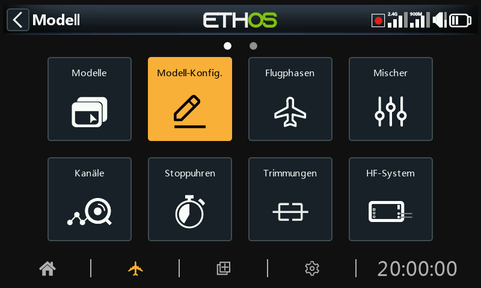
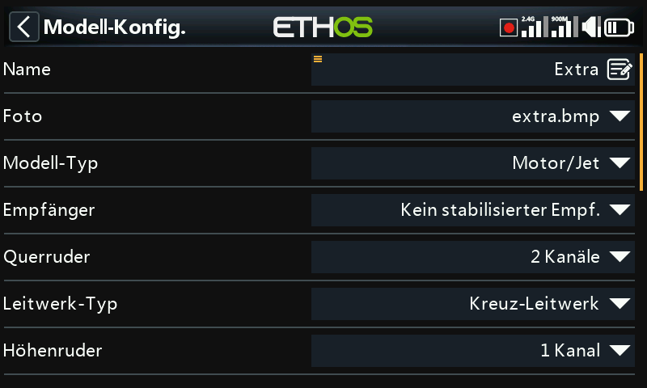
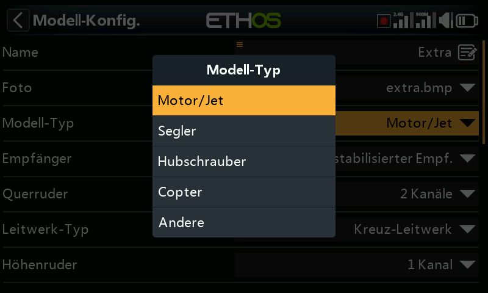
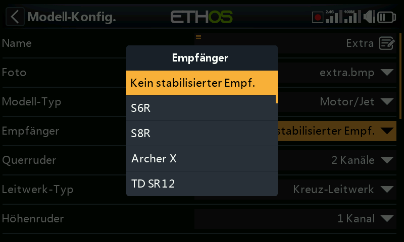
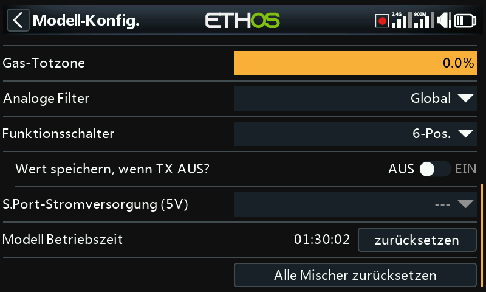
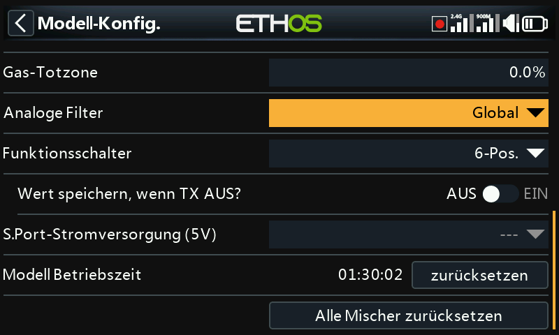
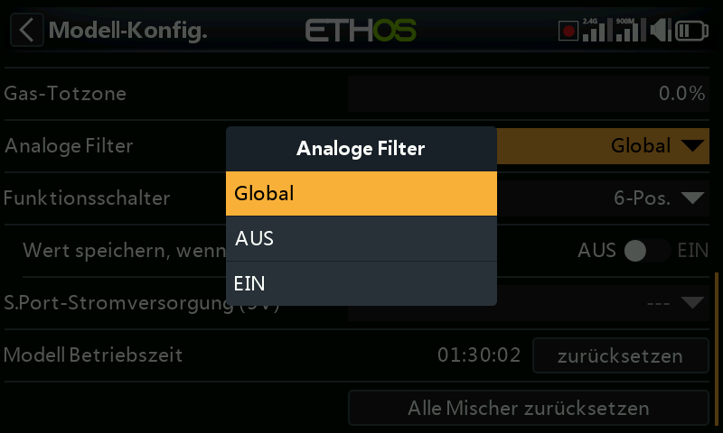
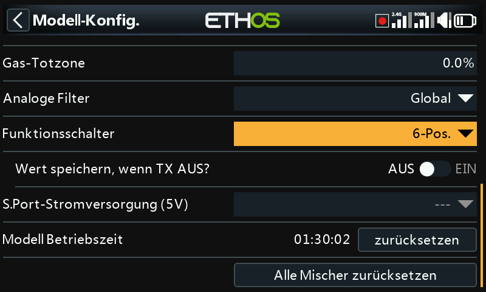
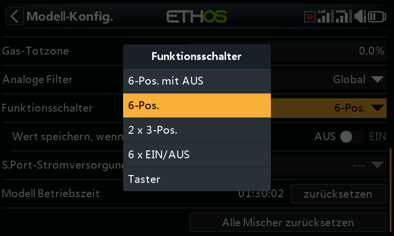
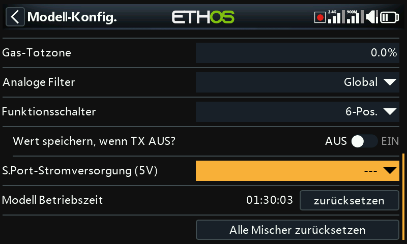

# Modell-Konfig.

Mit der Option „Modell bearbeiten“ können Sie die grundlegenden Parameter des Modells bearbeiten, wie sie vom Assistenten eingerichtet wurden.

## Name, Foto

Das Modell kann umbenannt, das Bild zugewiesen oder geändert werden. Bei der Suche nach einem Bild wird ein Vorschaubild angezeigt, um das Auffinden des richtigen Bildes zu erleichtern.

Die Modell-Bitmaps müssen sich im Ordner [bitmaps/models](../system-setup/file-manager.md) auf der SD-Karte oder dem eMMC befinden.

## Modelltyp

Wenn Sie den Modelltyp ändern, werden alle Mischungen zurückgesetzt.

## Empfänger

Listet die aktuellen Empfängertypen auf, der geändert werden können.

## Kanalzuweisungen

Durch Ändern des Heckrotortyps oder der Taumelscheibe werden alle Mischungen zurückgesetzt. Auf den anderen Kanälen kann die Anzahl der zugewiesenen Ausgangskanäle geändert oder die Zuweisung aufgehoben werden.

## Gas-Totzone

Ermöglicht die Konfiguration einer Gas-Totzone für Nullpunkt-Gas mit Vorwärts- und Rückwärtslauf, um unbeabsichtigte Motorbewegungen zu vermeiden, wenn sich der Steuerknüppel in Neutralstellung befindet.

## Analoger Filter

Es gibt eine globale Analog-Digital-Wandler-Filtereinstellung auf der Seite Hardware unter [Analoge Filter](../system-setup/hardware.md), die das Zittern um die Knüppelmitte verbessern kann. Diese modellspezifische Einstellung kann verwendet werden, um die globale Einstellung außer Kraft zu setzen.

## Funktionsschalter

Die sechs Funktionsschalter stehen überall dort zur Verfügung, wo die Parameter „Aktive Bedingung“ zu finden sind. Bitte beachten Sie, dass sie nicht wie normale Schalter als Quelle verwendet werden können.

### Konfiguration

Sie können wie folgt konfiguriert werden:

#### 6-Pos mit AUS

Das Drücken eines beliebigen Funktionsschalters schaltet diesen Schalter ein. Wird jedoch ein Schalter, der bereits eingeschaltet ist, ein zweites Mal gedrückt, wird er ausgeschaltet, so dass alle sechs Funktionsschalter ausgeschaltet bleiben.

#### 6-POS

Das Drücken eines beliebigen Funktionsschalters schaltet diesen Schalter ein, bis ein anderer Funktionsschalter gedrückt wird, um den neu gedrückten Schalter einzuschalten.

#### 2 x 3-Pos

Unterteilt die 6 Funktionsschalter in zwei 3er-Gruppen, wobei in jeder Gruppe ein Schalter eingeschaltet sein kann.

#### 6 x 2-Pos

Unterteilt die 6 Funktionsschalter in 6 rastende Schalter. Jeder Schalter kann EIN oder AUS sein.

#### Taster

Unterteilt die 6 Funktionsschalter in 6 Momentschalter. Jeder Schalter ist EIN, wenn er gedrückt wird.

### Wert speich. wenn TX AUS

Wenn diese Option aktiviert ist, bleibt der Funktionsschalter in denselben Zustand, wenn der Sender eingeschaltet oder das Modell neu geladen wird.

## S.Port-Anschlussstromversorgung (5V)

Der mittlere Pin („+“) des S.Port-Anschlusses kann wie folgt konfiguriert werden:

- Der mittlere Pin („+“) des S.Port-Anschlusses kann ausgeschaltet bleiben. Verwenden Sie die Option „---“.
- Der mittlere Pin („+“) des S.Port-Anschlusses kann als „Immer an“ konfiguriert werden, um ein Peripheriegerät mit +5V zu versorgen.
- Der mittlere Pin („+“) des S.Port-Anschlusses kann über einen Schalter oder eine andere Quelle angesteuert werden, um ein Peripheriegerät mit +5V zu versorgen.

Es ist darauf zu achten, dass der Ausgang nicht überlastet wird.

## Modelllaufzeit

Der Laufzeit-Stoppuhren des Modells erfasst die Gesamtlaufzeit. Drücken Sie die Reset-Taste, um ihn zurückzusetzen.

## Alle Mischer zurücksetzen

Durch Ausführen von „Alle Mischer zurücksetzen“ werden alle Mischer zurückgesetzt.
