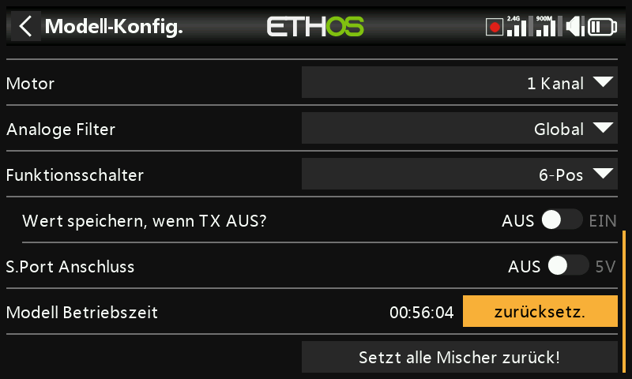
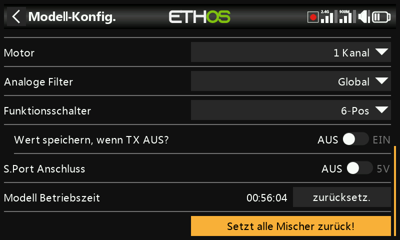

# Modell bearbeiten

Hier werden die Parameter auf Modellebene bearbeitet, die der Assistent
ursprünglich eingerichtet hat — hauptsächlich die Identität, aber auch einige
modellspezifische Überschreibungen und Hilfsfunktionen.

## Name, Bild

Modell umbenennen oder dessen Bild ändern; beim Durchsuchen nach einem Bild
wird eine Vorschau-Miniatur angezeigt.

## Modelltyp

!!! warning
    Das Ändern des Modelltyps setzt **alle** Mischer zurück.

## Kanalzuweisungen

Das Ändern des Leitwerkstyps oder (bei einem Heli) des Taumelscheibentyps
setzt ebenfalls alle Mischer zurück. Bei anderen Kanälen kann die Anzahl der
zugewiesenen Kanäle geändert oder die Zuweisung aufgehoben werden.

## Analogfilter

In [Systemeinstellungen → Hardware](../system-setup/hardware.md) gibt es einen
globalen Analog-Digital-Filter, der ein Zittern um die Knüppelmitte reduzieren
kann; diese modellspezifische Einstellung überschreibt ihn nur für dieses
Modell.

## Funktionsschalter {: #function-switches }

Die sechs Funktionsschalter stehen überall dort zur Verfügung, wo ein
Parameter **Aktive Bedingung** erscheint, können aber — anders als gewöhnliche
Schalter — nicht als allgemeine Quelle verwendet werden. Sie werden als eine
der folgenden Varianten konfiguriert:

- **6-Pos mit OFF** — das Drücken eines Funktionsschalters rastet ihn ein;
  erneutes Drücken *desselben* Schalters schaltet alle sechs aus.
- **6-POS** — das Drücken eines Funktionsschalters rastet ihn ein, bis ein
  *anderer* gedrückt wird, der dann übernimmt.
- **2 × 3-Pos** — teilt die sechs in zwei Gruppen zu je drei auf, mit einem
  aktiven Schalter pro Gruppe.
- **6 × 2-Pos** — sechs unabhängige, einrastende Ein/Aus-Schalter.
- **Momentary** — sechs unabhängige Schalter, jeder nur so lange aktiv, wie er
  gedrückt gehalten wird.
- **Persistent** — falls aktiviert, behält ein Funktionsschalter seinen Zustand
  über das Ausschalten bzw. das Neuladen des Modells hinweg bei, anstatt
  zurückgesetzt zu werden.

## SPort-Anschluss

Der 5V-Pin des S.Port-Anschlusses des Senders kann pro Modell geschaltet
werden — nützlich zum Beispiel zur Stromversorgung eines externen Empfängers
in einer Lehrer/Schüler-Konfiguration.

## Modell-Laufzeit

Erfasst die Gesamtzeit, die dieses Modell geflogen bzw. betrieben wurde.

## Alle Mischer zurücksetzen

Setzt sämtliche Mischer des Modells auf ihren Standardzustand zurück.
