# **Model****le**

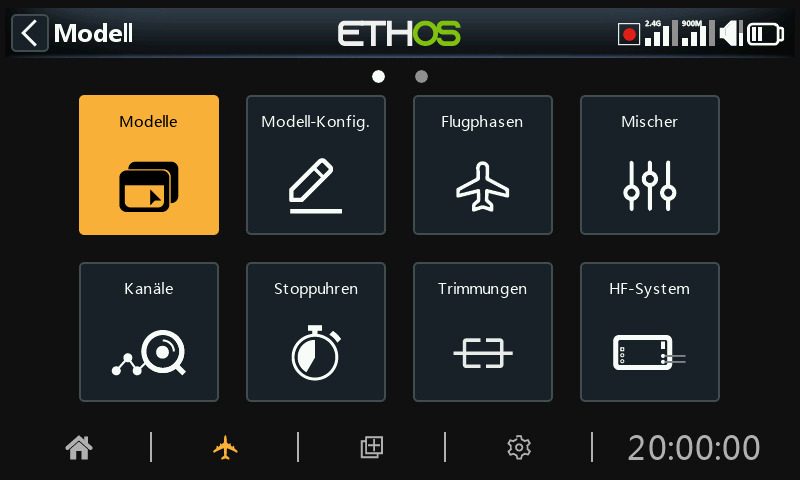

Die Option „Modellauswahl“ wird über das Menü „Modell“ aufgerufen. Sie dient dazu, das aktuelle Modell auszuwählen, ein neues Modell hinzuzufügen, ein Modell zu klonen, ein Modell über Bluetooth zu senden, zu empfangen oder es zu löschen.

## Modellordner verwalten

Mit Ethos können Sie Ihre eigenen Modellordner erstellen, um Ihre Modelle zu kategorisieren und zu gruppieren. Typische Modellordnernamen sind z.B. Flugzeug, Segelflugzeug, Heli, Quad, Warbird, Boot, Auto, Vorlage, Archiv usw.

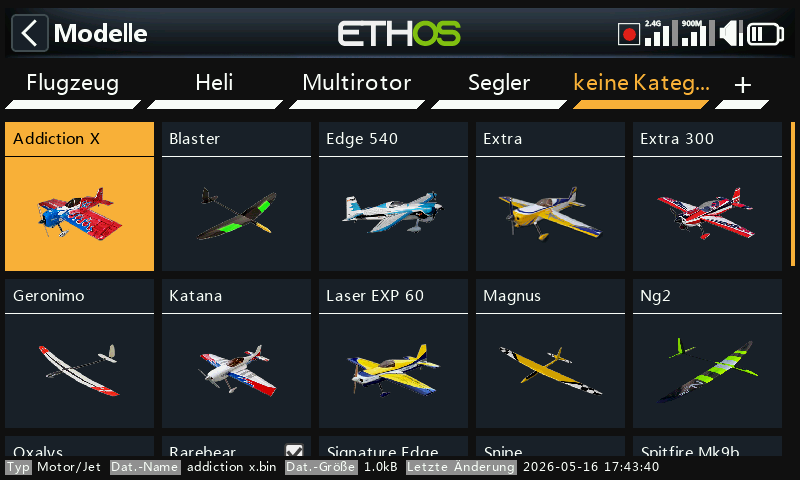

Bis Sie Ihre Ordner erstellt und organisiert haben, erstellt Ethos automatisch den Ordner 'keine Kategorie'. Dies geschieht, wenn Sie auf Ethos Version 1.1.0 alpha 17 oder höher aktualisieren, oder wenn Sie ein Modell aus dem Netz oder von einem Freund in den Ordner \\Models auf der SD- oder eMMC-Karte kopieren. Ethos löscht den Ordner 'keine Kategorie' automatisch, wenn er nicht mehr benötigt wird.

Um Ihren ersten Ordner zu erstellen, tippen Sie auf das „+“ rechts neben der Bezeichnung „keine Kategorie“ oder drücken Sie lange auf die Taste „Seite nach oben/unten“ (PG Up/Down).

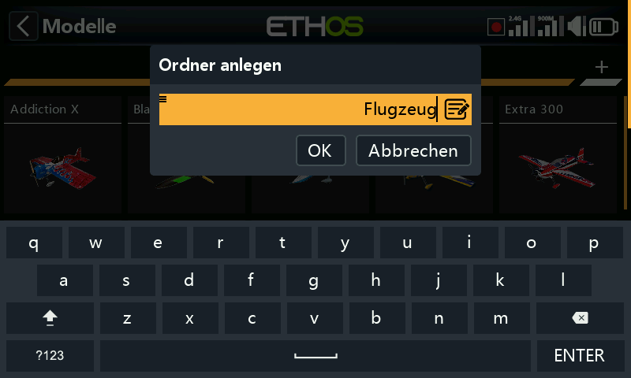

Geben Sie den Namen in das Dialogfeld „Ordner erstellen“ ein und tippen Sie auf „OK“. Die Ordnernamen können bis zu 15 Zeichen lang sein. Wiederholen Sie diesen Vorgang für Ihre anderen Kategorien. Beachten Sie, dass diese Ordner als Unterordner unter dem Ordner „\\models“ auf der SD-Karte oder eMMC angezeigt werden.

Die Ordner der Modellkategorien sind alphabetisch sortiert, aber der Ordner 'keine Kategorie' erscheint immer als letzter in der Liste.

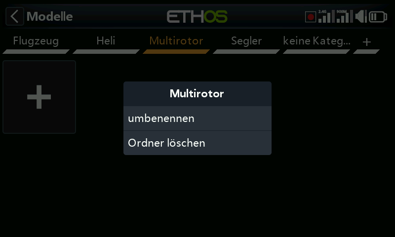

Wenn Sie auf einen Ordnernamen tippen und die Taste PgUp/Dn lang drücken, erscheint ein Dialog, in dem Sie den Ordner umbenennen oder löschen können. Wenn sich in dem zu löschenden Ordner Modelle befanden, legt Ethos diese automatisch im Ordner „'keine Kategorie'“ ab.

## Hinzufügen eines neuen Modells

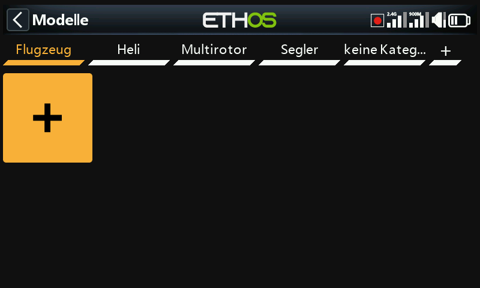

Um ein neues Modell hinzuzufügen, wählen Sie die Modellkategorie aus, unter der Sie das Modell erstellen möchten, und tippen Sie dann auf das \[+\] -Symbol, um ein neues Modell zu erstellen oder um ein Modell von einem anderen Ethos Sender über Bluetooth zu empfangen.

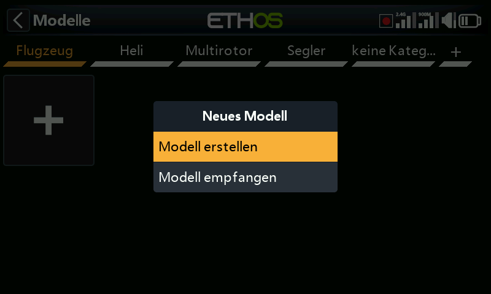

Tippen Sie auf „Modell erstellen“, um den Assistenten für neue Modelle zu starten. (möglicherweise müssen Sie zuerst Ihre Modellkategorien erstellen, siehe oben).

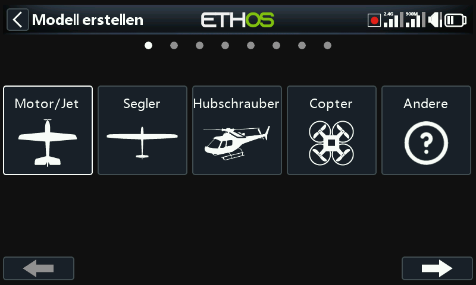

Wählen Sie die Art des Modells aus, das Sie erstellen möchten, und folgen Sie den Anweisungen.

Es gibt Assistenten für:

- Motorflugzeug
- Segelflugzeug
- Hubschrauber
- Multirotor
- Sonstiges

Der Assistent unterstützen Sie bei der grundlegenden Einrichtung für den jeweiligen Modelltyp.

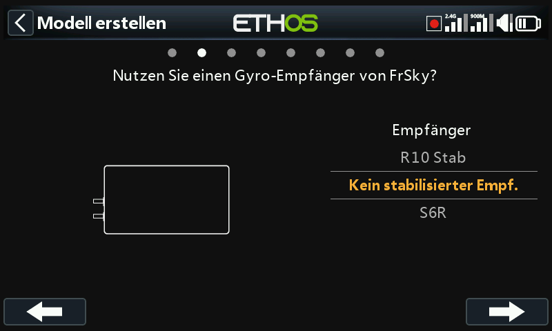

Der Wizard bieten die Möglichkeit, zusätzliche voreingestellte Mischer für stabilisierte FrSky-Empfänger einzurichten, z. B. Verstärkung und Stabilisierungsmodus.

### Keiselstabilisierte Empfänger

Die stabilisierten Empfänger von FrSky erfordern eine bestimmte Kanalreihenfolge, nämlich AETR. Daher sollte die „Kanalreihenfolge” im Menü „Sticks” auf der Standardeinstellung AETR belassen und die Option „Erste vier Kanäle fest” aktiviert werden, um sicherzustellen, dass die vom Assistenten erstellte Kanalreihenfolge zum Empfänger passt.

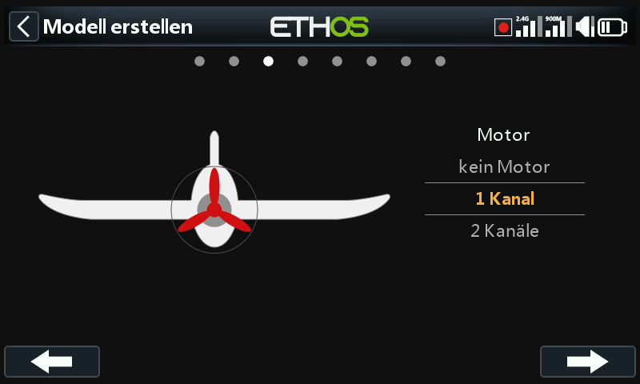

Bei einem Modell vom Typ Motorflugzeug wird als Nächstes die Anzahl der Querruder- und Klappenkanäle ausgewählt.

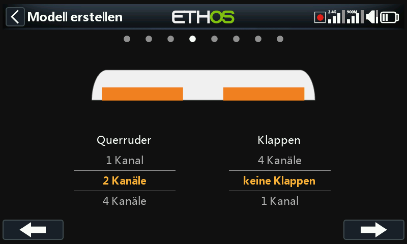

Bei einem Modell vom Typ Flugzeug wird als Nächstes die Anzahl der Querruder- und Klappenkanäle ausgewählt.

Ab Ethos 1.7.0 weisen die neuen Wizards die Kanäle beginnend von links und abwechselnd von außen nach innen zu, wodurch sie mit der Dokumentation des FrSky-Empfängers übereinstimmen.

Für ein einfaches Modell mit 2 Querrudern, 1 Höhenruder, 1 Seitenruder und 1 Motor lautet die Kanalreihenfolge daher wie folgt (vorausgesetzt, die Standard-„Kanalreihenfolge” von AETR und die Option „Erste vier Kanäle fest” sind aktiviert):

CH1 Querruder links

CH2 Höhenruder

CH3 Gas

CH4 Seitenruder

CH5 Querruder rechts

### Aktualisierung der Modelle auf Ethos 26.1.0

Während des Upgrades auf Ethos 26.1.0 können bestehende Modelle an das neue Schema der Zählung von links angepasst werden.

Es gibt drei Szenarien:

a) Bei bestehenden Modellen mit der Standard-Kanalreihenfolge 1.6.x, die von rechts gezählt wird, werden die Mischer neu angeordnet, um sie an das neue Schema anzupassen, bei dem von links gezählt wird. Die Zuweisung der Ausgangskanäle bleibt jedoch unverändert, sodass keine Änderungen an der Verkabelung des Modells erforderlich sind. Nur die Mischer werden in einer neuen Reihenfolge angeordnet, aber die ursprünglichen Zuweisungen der Ausgangskanäle bleiben erhalten, damit das Modell weiterhin korrekt funktioniert. Die Reihenfolge der Mischer lautet beispielsweise:

von

CH1 Querruder rechts

CH2 Höhenruder

CH3 Gas

CH4 Seitenruder

CH5 Querruder links

zu

CH5 Querruder links

CH2 Höhenruder

CH3 Gas

CH4 Seitenruder

CH1 Querruder rechts

b) Bei bestehenden Modellen, deren Kanäle so vertauscht wurden, dass die Zählung von links beginnt, werden die Mischer neu angeordnet, um sicherzustellen, dass die Querruderdifferenzierung weiterhin korrekt funktioniert; die Kanalbelegungen bleiben dabei jedoch unverändert.

c) Bestehende Modelle, deren Kanäle durch Umkehrung der Querruder-Mischung und Umbenennung der Ausgangskanäle vertauscht wurden, funktionieren nach dem Upgrade zwar korrekt, es kommt jedoch zu einem Konflikt bei der Kanalbenennung. Um dies zu beheben, müssen Sie die zuvor vorgenommenen Änderungen zur Umkehrung der Mischung rückgängig machen:

I) Kehren Sie die Querruder-Mischung mit positiven Werten für Gewicht und Differential um.

II) Tauschen Sie die Querruder-Ausgangskanäle mithilfe der „Kanäle tauschen-Funktion” im Menü „Kanäle” gegeneinander aus.

III) Benennen Sie auch die beiden Kanäle entsprechend ihrer korrekten linken und rechten Funktion um.

IV) **Achtung!** Überprüfen Sie nach den Änderungen, ob die Mischer und Ausgangskanäle in der richtigen Reihenfolge funktionieren, wenn der/die Propeller entfernt sind.

Für eine detailliertere Betrachtung der drei Konversionsszenarien verweisen wir auf  Anhang [A – Konvertierung von Ethos-Modellen von 1.6.3 auf 1.7.0](../how-to/converting-1.6-models.md)

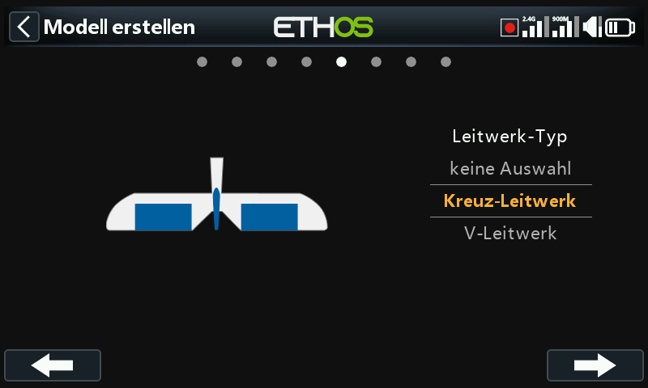

Bei einem Flugzeugmodell wird die Leitwerkskonfiguration zwischen traditionellem Kreuzleitwerk, V-Leitwerk oder keinem Leitwerk (z. B. bei einem Delta- oder Nurflügel) gewählt.

### Delta-Flügel

Ein Höhenruder-Setup kann erreicht werden, indem ein neues Flugzeugmodell mit 2 Querrudern und ohne Leitwerk erstellt wird, was dazu führt, dass die Höhenrudermischung automatisch erstellt wird. Die voreingestellten Mischungsgewichte betragen 50 %, so dass bei gleichzeitiger Anwendung von Quer- und Höhenruder insgesamt 100 % erreicht werden.

Bei einem Deltamodell, das sowohl Quer- als auch Höhenruderflächen hat, lassen Sie den Wizard so arbeiten, als hätte das Modell ein Leitwerk. Er konfiguriert die benötigten Quer- und Höhenruderkanäle, je nach Bedarf mit oder ohne Seitenruder.

Alternativ kann bei Verwendung eines stabilisierten Empfängers die Deltamischung vom Empfänger durchgeführt werden. Im Wizard sollten Sie für diese Situation 1 Querruder und 1 Höhenruder auswählen, da die Höhenrudermischung im Empfänger erfolgt. Bitte lesen Sie das Handbuch für stabilisierte Empfänger für weitere Details.

Bei einem Deltaflügelmodell mit Quer- und Höhenruder, lassen Sie den Wizard so arbeiten, als hätte das Modell ein Heck. Er konfiguriert die benötigten Quer- und Höhenruderkanäle, je nach Bedarf mit oder ohne Seitenruder.

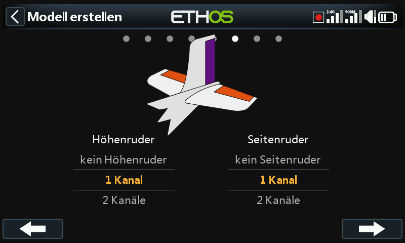

Bei einem Flugzeugmodell, bei dem beispielsweise ein traditionelles Kreuzleitwerk gewählt wurde, kann die Anzahl der Höhenruder- und Seitenruderkanäle konfiguriert werden.

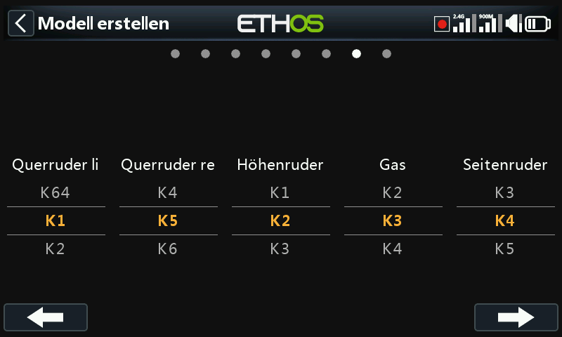

Nachdem Sie die Kanaloptionen eingerichtet haben, können Sie mit dem oben gezeigten Schritt die Modellfunktionen verschiedenen Kanälen neu zuweisen. Der Wizard befolgt die im Menü „Knüppelmodus“ konfigurierte „Kanalreihenfolge“, aber auf diesem Bildschirm können Sie die Kanäle neu zuweisen, wobei zu beachten ist, dass stabilisierte FrSky-Empfänger eine bestimmte Reihenfolge der stabilisierten Kanäle erfordern. Weitere Informationen finden Sie in der Anleitung des Empfängers.

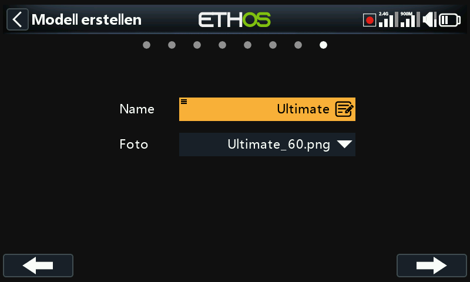

IIm letzten Schritt kann der Modellname definiert und ein Modellbild verknüpft werden. Beachten Sie, dass Modellnamen bis zu 15 Zeichen lang sein können.

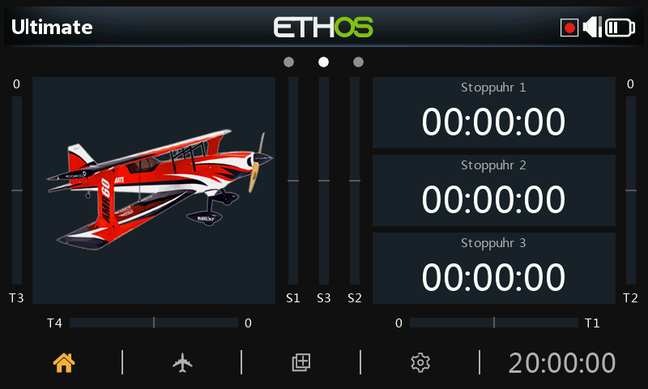

Das neue Modell wurde erstellt.

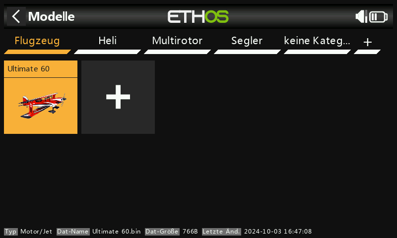

Das erstellte Modell wird in dem benutzerdefinierten Modellkategorie-Ordner angezeigt, der beim Start des Assistenten aktiv war, und wird innerhalb jeder Gruppe alphabetisch sortiert.

Bitte beachten Sie auch das Beispiel „[Grundlegendes Beispiel für ein Flächenflugzeug](../tutorials/basic-fixed-wing.md)“ im Abschnitt „Programmier-Anleitungen“ für ein ausgearbeitetes Beispiel.

## Benennung der Ausgabekanäle im Wizard

Die neuen Modell-Assistenten verwenden die folgenden Regeln für die Kanalbenennung:

- Wenn der Mischer nur einen Ausgang hat, erfolgt keine Nummerierung und kein Namenszusatz.
    - Wenn dier Mischer an den Ausgängen ein abweichendes Verhalten zeigt, benötigen die Ausgangskanäle einen expliziten Namen (z. B. „links“ / „rechts“ für die Querruder).
    - Wenn der Mischer auf allen Ausgängen exakt dieselben Berechnungen durchführt, dann enthält der Name lediglich eine Nummer als Suffix.

## Auswahl eines Modells

Tippen Sie auf „Modelle“, um eine Liste Ihrer Modelle anzuzeigen.

Bitte beachten Sie, dass nach einem Ethos-Versions-Upgrade ETHOS die Modelle einzeln konvertiert, wenn sie über den Modellauswahl-Bildschirm ausgewählt werden. Es ist nicht notwendig, jedes Modell nach einem Update auszuwählen, da die Konvertierung zu einem späteren Zeitpunkt erfolgen kann, wenn sie ausgewählt werden, selbst bei einer späteren Version von Ethos. Es gibt keine spürbare Verzögerung im Konvertierungsprozess, wenn ein Modell ausgewählt wird. Wenn die Konvertierung stattfindet, wird das Datum der letzten Änderung am unteren Rand des Modellauswahlbildschirms auf das aktuelle Datum geändert. Wenn keine Konvertierung erforderlich ist, ändert sich das Datum nur, wenn Sie das Modell bearbeiten.

### Schnellauswahl

Durch langes Berühren oder langes Drücken auf ein Modell-Symbol wird sofort zu diesem Modell gewechselt. Siehe auch „Aktuelles Modell festlegen“ weiter unten.

## Menü Modellverwaltung

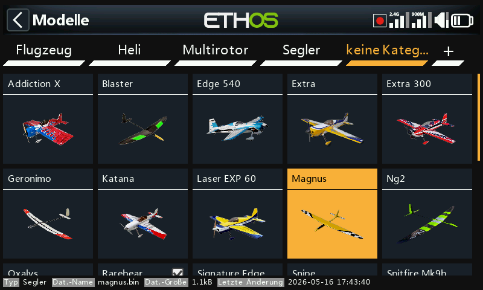

Tippen Sie auf ein Modell, um es zu markieren, und tippen Sie dann erneut darauf, um das Modellverwaltungsmenü aufzurufen.

### Aktuelles Modell auswählen

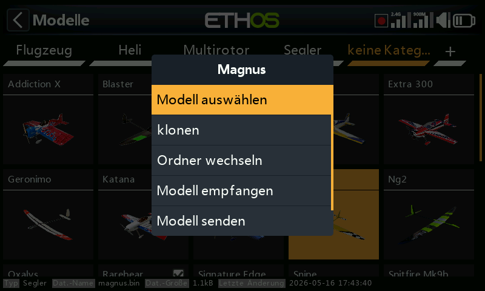

Tippen Sie auf „Modell auswählen“, um das markierte Modell zum aktuellen Modell zu machen.

Alternativ können Sie auch die oben beschriebene Methode „Schnellauswahl“ verwenden.

### Ein Modell klonen

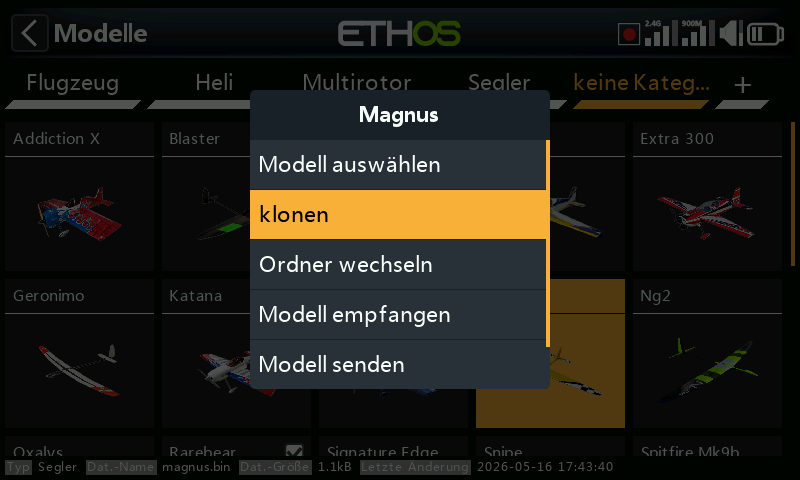

Tippen Sie auf „klonen“, um eine Kopie des markierten Modells zu erstellen.

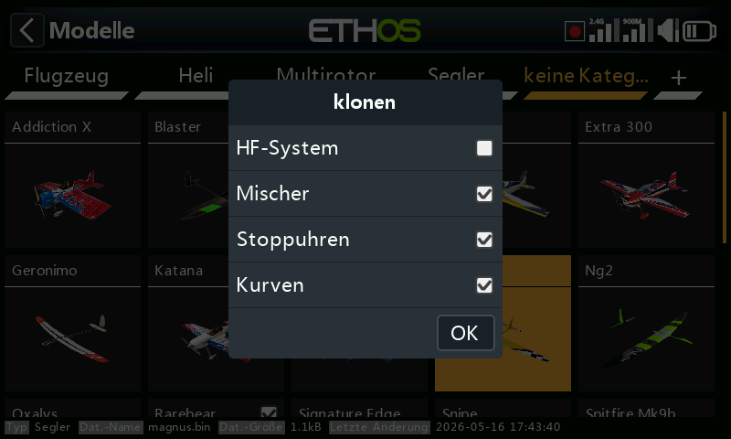

Es öffnet sich ein Dialogfeld, in dem Sie den Klon anpassen können.

Standardmäßig wird das HF-System nicht geklont, d. h. das RF-Modul wird im Klon deaktiviert, aber mit einer anderen Modellnummer versehen. Wenn die Option „HF-System“ ausgewählt ist, wird die HF-Konfiguration einschließlich der Modellnummer geklont.

Die Modellmischer, T Stoppuhren und Kurven werden nicht geklont, wenn diese Option deaktiviert ist. Tippen Sie auf „OK“, um fortzufahren. Nach Abschluss des Vorgangs wird ein Bestätigungsdialogfeld mit der Meldung „Modell erfolgreich geklont!“ angezeigt.

### Ordner wechseln

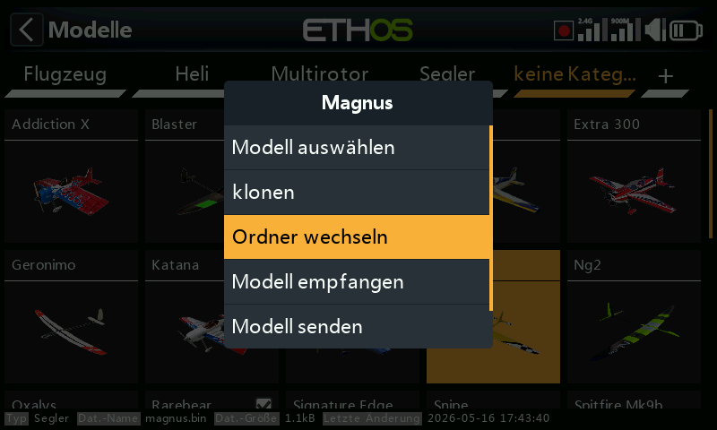

Um ein Modell in einen anderen Ordner zu verschieben, tippen Sie auf das Symbol des Modells und wählen Sie dann im Dialogfeld „Ordner wechseln“ aus.

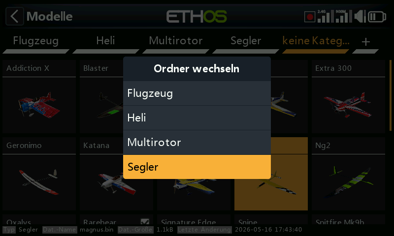

Tippen Sie auf den Ordner, in den Sie ihn verschieben möchten.

### Modell empfangen

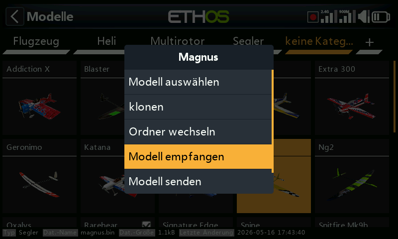

Tippen Sie auf „Modell empfangen“, um den Vorgang zum Empfangen eines Modells von einem anderen Ethos-Sender über Bluetooth zu starten. Bitte beachten Sie, dass „Modell empfangen“ vor „Modell senden“ im sendenden Funkgerät gestartet werden muss.

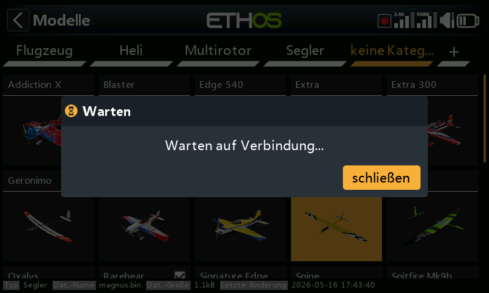

Bis eine Bluetooth-Verbindung gefunden wird, wird der Dialog „Warten auf Verbindung“ angezeigt.

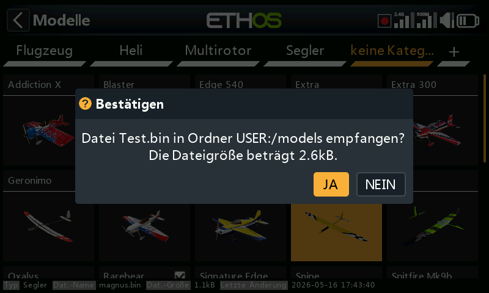

Sobald eine Verbindung hergestellt wurde, wird ein Dialogfeld „Bestätigen“ angezeigt, das auf eine Bestätigung wartet, um fortzufahren.

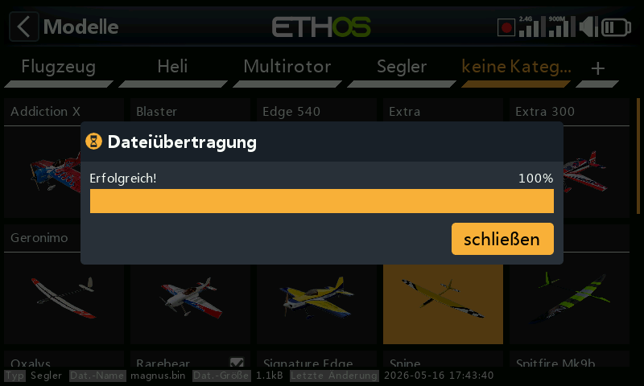

Die Dateiübertragung beginnt und ein Fortschrittsbalken wird angezeigt, gefolgt von einer Erfolgsmeldung nach Abschluss.

### Modell senden

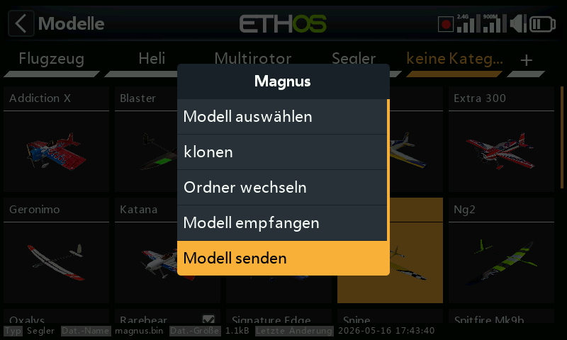

Tippen Sie auf „Modell senden“, um die Übertragung eines Modells über Bluetooth an einen anderen Ethos-Sender zu starten. Bitte beachten Sie, dass „Modell empfangen“ vor „Modell senden“ im sendenden Funkgerät gestartet werden muss.

Bis eine Bluetooth-Verbindung gefunden wird, wird der Dialog „Warten auf Geräte“ angezeigt.

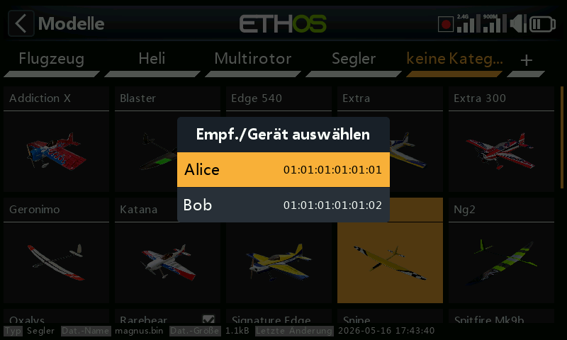

Sobald Geräte gefunden wurden, wird ein Dialogfeld zur Geräteauswahl angezeigt. Wählen Sie das Gerät aus, an das das Modell gesendet werden soll.

Die Dateiübertragung beginnt und ein Fortschrittsbalken wird angezeigt. Nach Abschluss der Übertragung erscheint eine Erfolgsmeldung.

### Löschen

Tippen Sie auf „Löschen“, um ein Modell zu löschen. **Diese Option ist für das aktive Modell nicht verfügbar**.

## Empfang eines Modells von einem anderen Ethos-Sender

Um ein Modell zu erhalten, wählen Sie die Modellkategorie aus, unter der Sie das Modell erstellen möchten, und tippen Sie dann auf das Symbol \[+\].

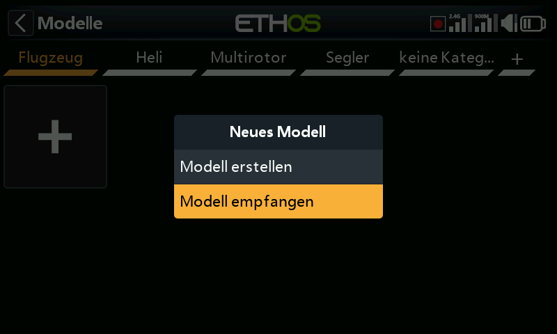

Tippen Sie auf „Modell empfangen“, um den Vorgang zum Empfangen eines Modells von einem anderen Ethos-Sender über Bluetooth zu starten.

Weitere Informationen finden Sie im Abschnitt „[Modell empfangen](model-select.md)“ oben.
