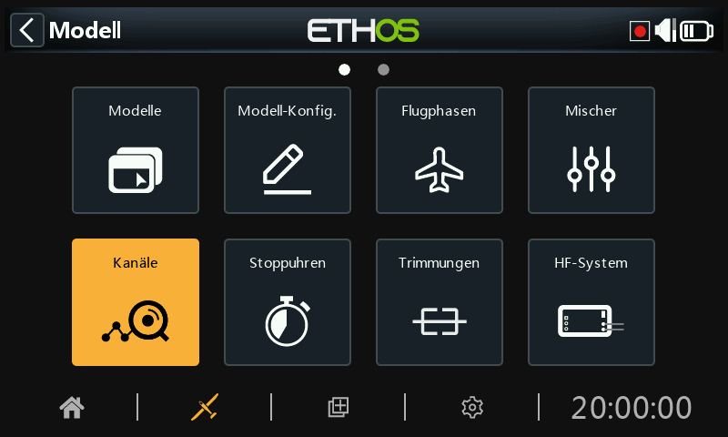
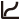
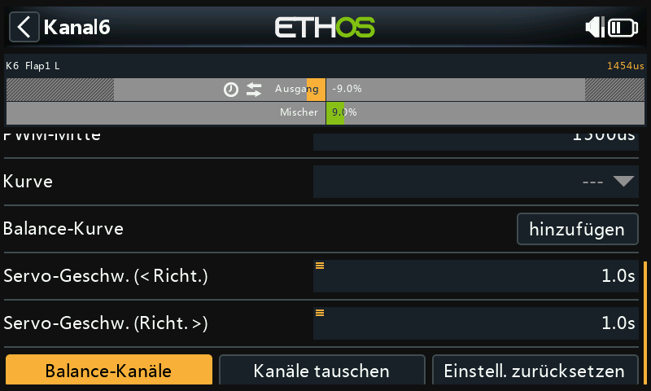

# Kanäle

Der Bereich Kanäle ist die Schnittstelle zwischen der Setup- „Logik“ und der realen Welt mit Servos, Gestängen und Steuerflächen sowie Aktoren und Gebern. In den Mischern haben wir festgelegt, was unsere verschiedenen Steuerungen tun sollen. In diesem Abschnitt können diese rein logischen Ausgänge an die mechanischen Eigenschaften des Modells angepasst werden. Hier konfigurieren wir die minimalen und maximalen Auslenkungen, die Servo- oder Kanalumkehrung und passen den Servo- oder Kanalmittelpunkt mit der PPM-Mittenanpassung an oder fügen mit Subtrim einen Offset hinzu. Wir können auch eine Kurve definieren, um etwaige Probleme bei der Reaktion in der Praxis zu korrigieren. Außerdem gibt es eine Funktion zum Ausgleichen der Kanäle. Die verschiedenen Kanäle sind Ausgänge, beispielsweise entspricht CH1 dem Servostecker Nr. 1 an Ihrem Empfänger (mit den Standardprotokoll-einstellungen).

Obwohl der Sender mit Prozenten als Eingang konfiguriert ist, werden Servos und am Ausgang angeschlossene Geräte durch ein PWM-Signal (Pulsweitenmodulation) in μs (Mikrosekunden) gesteuert. Die Beziehung zwischen den Einheiten ist wie folgt:

−150%	=	732 μs

−100%	=	988 μs

0%	=	1500 μs

100%	=	2012 μs

150%	=	2268 μs

Beachten Sie, dass ein Kanal, dem kein Mischer zugewiesen ist, einen Ausgang bei neutral = 0% = 1500us hat. Das Gleiche gilt, wenn die Mischung(en) eines Kanals inaktiv sind, so dass darauf geachtet werden muss, dass verwendete Kanäle immer eine aktive Mischung haben. Ein Gaskanal bei neutral = 0% = 1500us steht sonst auf Halbgas!!

Der Bildschirm „Kanäle“ zeigt zwei Balkendiagramme für jeden Kanal an. Der untere (grüne) Balken zeigt den Wert aller Mischungen für den Kanal an, während der obere (orangefarbene) Balken den tatsächlichen Wert (in % und µS) des Ausgangs nach der Ausgangsverarbeitung anzeigt, der an den Empfänger gesendet wird. Im obigen Beispiel sehen Sie, dass sowohl die Mischungen als auch die Kanalausgangswerte für CH4 Gas bei -100 % liegen.

Die Minimal- und Maximalwerte des Kanals werden durch die ausgegrauten Bereiche in der oberen (orangefarbenen) Leiste angezeigt. Zur Einstellung dieser Werte siehe den folgenden Abschnitt.  
  
Die Kanäle, die nicht an das HF-Modul ausgegeben werden, sind dunkler hinterlegt.  Im obigen Beispiel werden alle acht Kanäle übertragen, so dass sie einen helleren grauen Hintergrund haben.

Die Symbole , ,  und/oder  erscheinen in der Anzeige eines Kanals, wenn die Standardeinstellungen für [Ausgangsrichtung](outputs.md), [Ausgangskurve](outputs.md), [Langsam auf/ab](outputs.md) geändert wurden oder [Kanäle abgleichen](outputs.md) konfiguriert wurde. Einzelheiten hierzu finden Sie in den jeweiligen Einstellungen weiter unten.

Hinweis: Für einen schnellen Zugriff auf diesen Monitorbildschirm können Sie durch langes Drücken der Eingabetaste von den Bildschirmen „Mischer“ und „Flugphasen“ zu den Ausgängen springen.

## Kanäle einrichten

Tippen Sie auf den zu bearbeitenden oder zu überprüfenden Ausgangskanal.

### Kanal-Vorschau

Eine Kanalvorschau wird oben im Bildschirm „Kanäle einrichten“ angezeigt. Der Wert der Mischungen wird in Grün angezeigt, während der Wert des Kanalausgangs in Orange angezeigt wird (Standardanzeige).

Die minimalen und maximalen Einstellungen für den Kanal werden durch die ausgegrauten Bereiche in der oberen (orangefarbenen) Leiste angezeigt.

### Name

Der Name kann bearbeitet werden.

### Richtung

Ändert die Richtung des Kanalausgangs, typischerweise um die Servorichtung umzukehren.

  Wenn diese Funktion aktiviert ist, wird in der grafischen Darstellung des Kanals ein Doppelpfeil-Symbol angezeigt, siehe CH6 Flaps1L im obigen Screenshot der Kanäle.

Bitte beachten Sie, dass dies keinen Einfluss auf die Mischungen hat, die den Ausgang ansteuern, und auch die Min/Max-Grenzen (siehe unten) nicht vertauscht.

### Min/Max

Die Minimal- und Maximalwerte für den Kanal sind „harte“ Grenzwerte, d.h. sie können nicht überschrieben werden. Sie sollten so eingestellt werden, dass eine mechanische Blockierung vermieden wird. Beachten Sie, dass sie als Verstärkungs- oder „Endpunkt“-Einstellungen dienen, d. h. eine Verringerung dieser Grenzwerte verringert den Übersteuerungsgrad und führt nicht zum Beschneiden. Beachten Sie, dass die Grenzwerte standardmäßig bei +/- 100,0 % liegen, aber hier auf +/- 150,0 % erhöht werden können.

Die Minimal- und Maximaleinstellungen des Kanals werden durch die ausgegrauten Bereiche in der oberen (orangefarbenen) Leiste angezeigt.

#### Warnung

Bei Verwendung eines Redundanzsystems mit SBUS sind Servobewegungen über etwa +/- 125% nicht möglich.

Hinweis: Die Parameter Min/Max haben jeweils einen Bereich von (-150 % bis 0 %) und (0 % bis +150 %). Wenn Sie VARs als Quelle zur Anpassung der Parameter Min/Max verwenden, müssen Sie, sofern der Var-Bereich nicht identisch ist, den zu ignorierenden Var-Bereich festlegen, um unerwartete Werte aufgrund der Bereichskonvertierung zu vermeiden. Weitere Informationen zu dieser Option finden Sie im [Abschnitt „Var-Optionen“](../getting-started/user-interface-and-navigation.md).

Wenn die PWM-Ausgänge des Hauptempfängers mit mehr als 125 % betrieben werden und dieser Empfänger in den Failsafe-Zustand übergeht, werden die dann von einem redundanten Empfänger über SBUS empfangenen Servopositionen auf 125 % begrenzt.

Insbesondere wenn ein Ausgang des Hauptempfängers mehr als 125 % beträgt, wird der Ausgang beim Umschalten auf den redundanten Empfänger auf 125 % geändert.

#### Einrichtungshilfe

Beim Einstellen der Min-/Max-Ausgangsgrenzen wird das einzustellende Ende fett hervorgehoben.

Wenn Sie z. B. den Maximalwert für den Höhenruderkanal einstellen möchten, wird der Maximalwert fett dargestellt, wenn Sie den Höhenruderknüppel leicht nach vorne bewegen, um anzuzeigen, dass dies das einzustellende Ende ist. Wenn Sie den Knüppel zurückbewegen, wird der Minimalwert fett dargestellt.

### Center/Subtrim

Wird verwendet, um einen Offset am Ausgang einzuführen, typischerweise verwendet, um einen Servohebel zu zentrieren. Beachten Sie, dass die Endpunkte nicht betroffen sind.

#### Warnung:

Lassen Sie sich nicht dazu verleiten, Subtrim zu verwenden, um große Offsets hinzuzufügen - dadurch wird eine große Differenz in den Servoreaktionen eingebaut. Der richtige Weg ist, einen Offset-Mischer hinzuzufügen.

### PWM-Mitte

Dies ist ähnlich wie Subtrim, mit dem Unterschied, dass eine hier vorgenommene Einstellung das gesamte Bewegungsband des Servos (einschließlich der harten Grenzen) verschiebt. Diese Einstellung ist auf dem Kanalmonitor nicht sichtbar, da sie effektiv im Servo vorgenommen wird. Der Vorteil der Verwendung von 'PWM Mitte' zur mechanischen Zentrierung der Steuerfläche ist, dass die Zentrierfunktion von der Trimmfunktion getrennt wird.

### Kurve

Ermöglicht die Auswahl einer Expo-Kurve oder einer benutzerdefinierten Kurve zur Konditionierung des Ausgangs. In dem Popup können Sie entweder eine vorhandene Kurve auswählen oder eine neue Kurve hinzufügen. Nach der Konfiguration der Kurve wird eine Schaltfläche Bearbeiten hinzugefügt, mit der Sie die Kurve einfach bearbeiten können.

	Wenn sie aktiviert ist, wird in der Grafikanzeige des Kanals ein Kurvensymbol angezeigt, siehe CH5 Ruder im obigen Screenshot „Kanäle“.

### Balancer-Kurve

Es kann eine Ausgleichskurve hinzugefügt werden, was automatisch geschieht, wenn Sie die Funktion „Balancer-Kanäle“ unten aktivieren. Auf diese Weise können Sie ausgewählte Paare oder eine Gruppe von bis zu 4 Kanälen ausgleichen, um sicherzustellen, dass sie sich synchron bewegen.

### Langsam auf/ab

Die Reaktion des Ausgangs kann in Bezug auf die Eingangsänderung verlangsamt werden. Slow kann zum Beispiel verwendet werden, um Einfahrvorgänge zu verlangsamen, die von einem normalen Proportional-Servo betätigt werden. Der Wert ist die Zeit in Sekunden, die der Ausgang benötigt, um den Bereich von 0 bis +100% abzudecken.

 Nach der Konfiguration wird ein Uhrensymbol in der Grafikanzeige des Kanals angezeigt. Siehe CH6 Flap1 L und CH7 Flap2 R im Screenshot „Kanäle“ oben.

### Servogeschwindigkeit Auf/Ab

Bitte beachten Sie, dass unter den Logikschaltern eine Verzögerungsfunktion verfügbar ist.

### Kanäle tauschen

Mit dieser Funktion können zwei Ausgangskanäle vertauscht werden.

Das Dialogfeld „Kanäle tauschen“ wird geöffnet, wobei der erste Kanal bereits ausgefüllt ist. Wählen Sie den zu vertauschenden Kanal aus und klicken Sie auf OK. Beachten Sie, dass die Vertauschung sofort erfolgt.  Alle Mischer usw. werden entsprechend angepasst.

### Einstellungen zurücksetzen

Das Zurücksetzen der Einstellungen löscht alle Parameter für den Ausgangskanal, wenn dieser nicht mehr benötigt wird. Ein Bestätigungsdialog verhindert ein versehentliches Zurücksetzen.

Dadurch wird vermieden, dass die Einstellungen nicht auf ihre Standardwerte zurückgesetzt werden, wenn der Kanal für etwas anderes verwendet wird.

### Kanäle Balancieren

Mit dieser Funktion können Sie ausgewählte Paare oder eine Gruppe von bis zu 4 Kanälen ausbalancieren, um sicherzustellen, dass sie sich im Gleichklang bewegen. Zum Beispiel können unausgewogene Klappen zu unerwünschtem Rollen führen, während unausgewogene Gashebel bei mehrmotorigen Modellen zu unerwünschtem Gieren führen können.

#### Übersicht

Mit dieser Funktion wird automatisch eine Differenzausgleichskurve für jeden ausgewählten Kanal erstellt. Die Anzahl der Ausgleichspunkte kann gewählt werden. Durch den Vergleich der physischen Positionen der Steuerflächen (z. B. Klappen) an jedem Punkt der Kurven können diese leicht angepasst werden, so dass sie gleich sind. Das Endergebnis sind perfekt nachgeführte Flächen.

#### Voraussetzungen

Vor dem Abgleich der Kanäle sollte dieses empfohlene Verfahren befolgt werden:

1. Stellen Sie die Servolaufrichtung für den korrekten Flächenhub ein.
2. Wenn der Mischer auf neutral steht, verwenden Sie optional PWM-Center, um die Servohebel rechtwinklig einzustellen.
3. Konfigurieren Sie die Min/Max-Grenzen und Subtrim.
4. Konfigurieren Sie alle anderen Kurven.
5. Konfigurieren Sie die Langsam-Funktion.
6. Fahren Sie mit den Ausgleichskanälen fort, um die Steuerflächen an mehreren Punkten des Weges auszugleichen.

#### Verwendung

Öffnen Sie die Bearbeitungsseite für den Kanal ganz links, den Sie ausbalancieren möchten. In diesem Beispiel haben wir Kanal 6 „Flap1 L“ ausgewählt. Scrollen Sie nach unten und tippen Sie auf „Balancer-Kanäle“, um zu beginnen.

Ein Dialogfeld „Kanäle auswählen“ wird geöffnet, in dem die auszugleichenden Kanäle ausgewählt werden können.

Wählen Sie die Kanäle in der Reihenfolge aus, in der Sie sie anzeigen möchten. In unserem Beispiel war CH6 (Flap1 L) bereits markiert, da wir mit diesem Kanal begonnen haben.

Bei Sendern ohne Touchscreen scrollen Sie zu den gewünschten Kanälen und drücken Sie ENT, um sie auszuwählen. Drücken Sie abschließend die Page-Taste, um die OK-Taste zu markieren, und drücken Sie dann ENT, um die Auswahl zu bestätigen.

Die Kanäle werden in der Reihenfolge ihrer Auswahl angezeigt. In diesem Beispiel wurde standardmäßig zuerst CH6 (Flap1 L) ausgewählt, dann haben wir CH7 (Flap2 R) ausgewählt. Die Mischer-Ausgänge werden entlang der X-Achse angezeigt, während die Differenzwerte für die Balanceeinstellung auf der Y-Achse angezeigt werden.

Tippen Sie auf ein Kanaldiagramm (oder scrollen Sie dorthin und drücken Sie ENTER), um die Balancekurve zu bearbeiten. Mit der Taste PAGE können Sie während der Bearbeitung zwischen den Kanälen wechseln.

Der Eingang (angezeigt durch die vertikale weiße Markierungslinie) muss angepasst werden, um den X-Wert vor der Anpassung an einen Kurvenpunkt auszurichten.

##### Menü-Tasten

    Die in den Kanalmischern konfigurierte(n) Quelle(n) kann/können verwendet werden, oder optional jeder andere geeignete Analogeingang. Wenn Sie die Option „Automatischer Analogeingang“ auswählen, wird der erste Knüppel, Schieberegler oder Potentiometer, den Sie bewegen, als Quelle für X verwendet, und zwar nicht nur in der Grafik, sondern auch im Modell.

  Wenn diese Funktion aktiviert ist, wird der nächstgelegene Kurvenpunkt auf der X-Achse automatisch für die Einstellung mit dem Drehgeber ausgewählt, wie im obigen Beispiel.

Der Eingang muss so eingestellt werden, dass der X-Wert mit einem Kurvenpunkt übereinstimmt, bevor die Einstellung vorgenommen wird.

    Durch Antippen des Symbols oder Drücken der ENTER-Taste im Diagramm-Bearbeitungsmodus wird der Sperrmodus ein- und ausgeschaltet. Wenn er aktiviert ist, sind alle Eingaben gesperrt, so dass Sie die Knüppeleingabe loslassen können und die Steuerflächen beobachten können, während Sie Ihre Kurve anpassen.

 Öffnen Sie den Konfigurationsdialog für die gewählten Kanäle. Es ist möglich, die Anzahl der Punkte aller oder nur einiger Kurven zu ändern und zu wählen, ob sie geglättet werden sollen oder nicht.

**?** Mit dieser Schaltfläche rufen Sie die Hilfedatei auf. Sie kann auch mit der MDL-Taste aufgerufen werden.

Im obigen Beispiel wurde die Option Magnet abgewählt. Der einzustellende Kurvenpunkt ist hervorgehoben und kann mit den Tasten „SYS“ und „DISP“ verschoben werden.

Auch hier sollte die Eingabe so eingestellt werden, dass der Cursor (X-Wert) auf einen Kurvenpunkt ausgerichtet ist, bevor die Einstellung vorgenommen wird.

Bis zu 4 Kanäle können gleichzeitig ausgeglichen werden. Auch hier müssen die Kanäle in der Reihenfolge ausgewählt werden, in der sie angezeigt werden sollen, normalerweise von links nach rechts.

#### Balancerkurve überprüfen, bearbeiten oder löschen

Sobald ein Kanal abgeglichen wurde, kann seine Abgleichkurve auf der Konfigurationsseite des Kanals überprüft, bearbeitet oder gelöscht werden.

	Beachten Sie, dass in der Grafikanzeige des Kanals ein Abgleichsymbol angezeigt wird (orangefarbener Balken). Im obigen Beispiel wird auch ein Richtungssymbol angezeigt, das darauf hinweist, dass der Ausgang umgekehrt wurde, was auch aus der Grafik ersichtlich ist, die zeigt, dass die Ausgangsrichtung entgegengesetzt zu der des Mischers ist.
