# Ausgänge

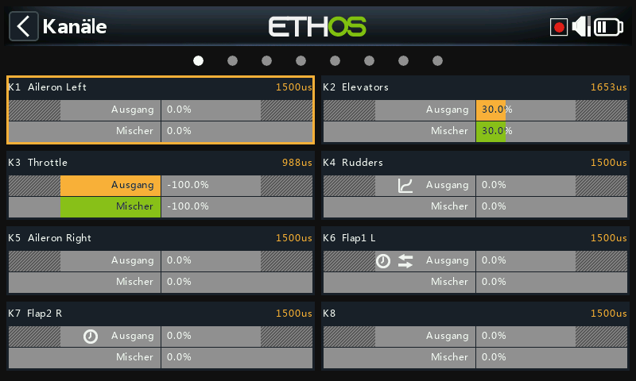

Der Bereich Ausgänge ist die Schnittstelle zwischen der reinen „Logik“ der
[Mischer](mixes.md) und der realen Welt mit Servos, Gestängen und
Steuerflächen sowie Aktoren und Gebern. Hier werden Endpunkte, Umkehrung,
Zentrierung und Korrekturkurven an die mechanischen Eigenschaften des
Modells angepasst. Die verschiedenen Kanäle sind Ausgänge, z. B. entspricht
CH1 dem Servostecker Nr. 1 an Ihrem Empfänger (mit den
Standardprotokolleinstellungen).

Obwohl Ethos mit Prozenten arbeitet, werden Servos letztlich durch ein
PWM-Signal (Pulsweitenmodulation) in µs (Mikrosekunden) gesteuert:

| % | µs |
|---|---|
| −150% | 732 |
| −100% | 988 |
| 0% | 1500 |
| 100% | 2012 |
| 150% | 2268 |

!!! warning
    Ein Kanal, dem **kein aktiver Mischer** zugewiesen ist, hat einen
    Ausgang bei neutral = 0% = 1500 µs — das Gleiche gilt, wenn die
    Mischung(en) eines Kanals inaktiv sind. Es muss daher darauf geachtet
    werden, dass verwendete Kanäle immer eine aktive Mischung haben. Ein
    Gaskanal bei neutral = 0% = 1500 µs steht sonst auf **Halbgas!!**

Der Bildschirm „Ausgänge“ zeigt für jeden Kanal zwei Balkendiagramme an:
Der untere (grüne) Balken zeigt den Wert der Mischer für den Kanal an,
während der obere (orange) Balken den tatsächlichen Wert (in % und µs) des
Ausgangs nach der Ausgangsverarbeitung anzeigt, der an den Empfänger
gesendet wird. Die Minimal- und Maximalwerte werden durch die ausgegrauten
Bereiche in der oberen (orangefarbenen) Leiste angezeigt. Die Kanäle, die
nicht an das HF-Modul ausgegeben werden, sind dunkler hinterlegt. Kleine
Symbole erscheinen in der Anzeige eines Kanals, wenn die
Standardeinstellungen für Richtung, Kurve, Langsam auf/ab oder Kanäle
abgleichen geändert wurden — so lassen sich Kanäle mit abweichenden
Einstellungen auf einen Blick erkennen.

!!! tip
    Für einen schnellen Zugriff auf diesen Monitorbildschirm können Sie
    durch langes Drücken von `ENT` von den Bildschirmen „Mischer“ und
    „Flugphasen“ zu den Ausgängen springen.

## Einen Kanal bearbeiten {: #editing-a-channel }

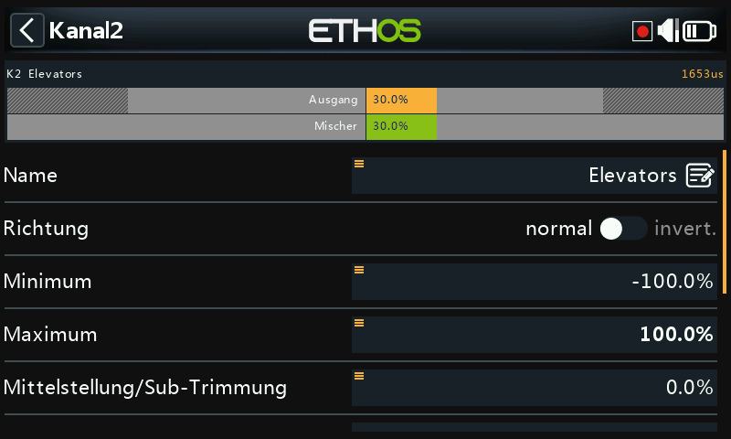
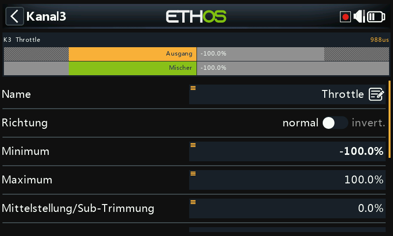

Tippen Sie auf den zu bearbeitenden oder zu überprüfenden Ausgangskanal.
Eine Kanalvorschau wird oben im Bildschirm angezeigt: Der Wert der
Mischungen wird in Grün angezeigt, während der Wert des Kanalausgangs in
Orange angezeigt wird. Eine kleine weiße Markierung kennzeichnet die
Min/Max-Punkte.

- **Name** — der Name kann bearbeitet werden.
- **Richtung** — ändert die Richtung des Kanalausgangs, typischerweise um
  die Servorichtung umzukehren. In der grafischen Darstellung des Kanals
  wird dann ein Doppelpfeil-Symbol angezeigt. Bitte beachten Sie, dass dies
  **keinen** Einfluss auf die Mischungen hat, die den Ausgang ansteuern,
  und auch die Min/Max-Grenzen **nicht** vertauscht.
- **Min/Max** — „harte“ Grenzwerte, d. h. sie können nicht überschrieben
  werden. Sie sollten so eingestellt werden, dass eine mechanische
  Blockierung vermieden wird. Beachten Sie, dass sie als Verstärkungs- oder
  „Endpunkt“-Einstellungen dienen, d. h. eine Verringerung dieser
  Grenzwerte verringert den Servoweg und führt nicht zum Beschneiden.
  Standardmäßig liegen die Grenzwerte bei ±100,0 %, sie können hier aber
  auf ±150,0 % erhöht werden. Beim Einstellen der Min-/Max-Ausgangsgrenzen
  wird das einzustellende Ende fett hervorgehoben (bewegen Sie z. B. den
  Höhenruderknüppel leicht nach vorne, wird der Maximalwert fett
  dargestellt, um anzuzeigen, dass dies das einzustellende Ende ist).

  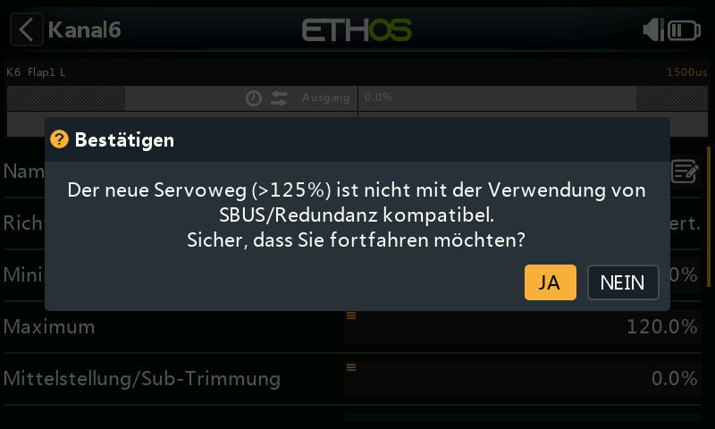

  !!! warning "SBUS-Redundanz"
      Bei Verwendung eines Redundanzsystems mit SBUS sind Servobewegungen
      über etwa ±125 % nicht möglich. Die Min/Max-Parameter selbst haben
      Bereiche von (−150 % bis 0 %) bzw. (0 % bis +150 %) — wenn sie von
      einer [Var](variables.md) angesteuert werden, muss der Var-Bereich
      ignoriert werden (siehe
      [Quellenoptionen](../getting-started/user-interface-and-navigation.md#choosing-a-source)),
      es sei denn, der Var hat einen identischen Bereich; andernfalls
      entstehen durch die Bereichsumwandlung unerwartete Werte. Wenn ein
      Ausgang des Hauptempfängers mehr als 125 % beträgt und dieser
      Empfänger in den Failsafe-Zustand übergeht, wird der über SBUS vom
      redundanten Empfänger übernommene Ausgang auf 125 % begrenzt.

- **Mittelstellung/Subtrim** — wird verwendet, um einen Offset am Ausgang
  einzuführen, typischerweise um einen Servohebel zu zentrieren. Beachten
  Sie, dass die Endpunkte nicht betroffen sind.

  !!! warning
      Lassen Sie sich nicht dazu verleiten, Subtrim zu verwenden, um große
      Offsets hinzuzufügen — dadurch wird eine große Differenz in den
      Servoreaktionen eingebaut. Der richtige Weg ist, für alles, was über
      eine feine Zentrierung hinausgeht, einen **Offset-Mischer**
      hinzuzufügen.

- **PWM-Mitte** — ähnlich wie Subtrim, mit dem Unterschied, dass eine hier
  vorgenommene Einstellung das *gesamte* Bewegungsband des Servos
  (einschließlich der harten Grenzen) verschiebt. Diese Einstellung ist auf
  dem Kanalmonitor nicht sichtbar, da sie effektiv im Servo vorgenommen
  wird. Der Vorteil ist, dass die mechanische Zentrierung von der
  Trimmfunktion getrennt wird.
- **Kurve** — ermöglicht die Auswahl einer Expo-Kurve oder einer
  benutzerdefinierten Kurve (vorhanden oder neu; nach der Konfiguration
  wird eine Schaltfläche **Bearbeiten** hinzugefügt), um Probleme mit dem
  realen Ansprechverhalten zu korrigieren — z. B. um sicherzustellen, dass
  linke und rechte Klappe genau nachgeführt werden. In der Grafikanzeige
  des Kanals wird dann ein Kurvensymbol angezeigt.
- **Langsam auf/ab** — die Reaktion des Ausgangs kann in Bezug auf die
  Eingangsänderung verlangsamt werden. Der Wert ist die Zeit in Sekunden,
  die der Ausgang benötigt, um den Bereich von 0 bis 100 % abzudecken —
  z. B. um Einfahrvorgänge zu verlangsamen, die von einem normalen
  Proportional-Servo betätigt werden. In der Grafikanzeige des Kanals wird
  dann ein Uhrensymbol angezeigt. (Eine **Verzögerungsfunktion**, im
  Unterschied zum langsamen Lauf, ist unter den
  [Logikschaltern](logical-switches.md) verfügbar.)

## Kanäle tauschen {: #swap-channels }

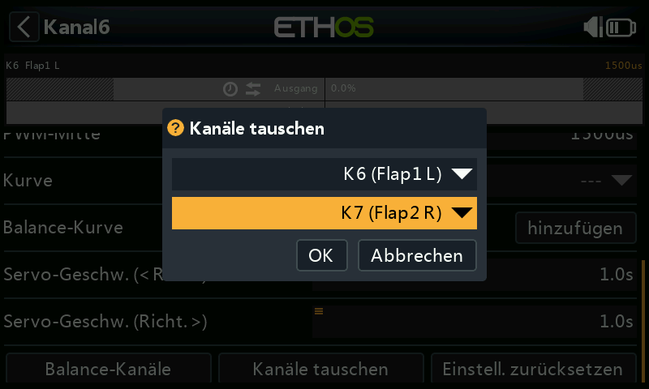
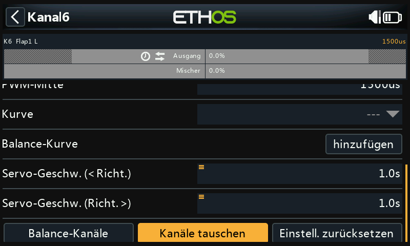

Mit dieser Funktion können zwei Ausgangskanäle vertauscht werden. Das
Dialogfeld wird geöffnet, wobei der erste Kanal bereits ausgefüllt ist;
wählen Sie den zu vertauschenden Kanal aus und bestätigen Sie — die
Vertauschung erfolgt sofort, und alle Mischer, die einen der beiden Kanäle
verwenden, werden entsprechend angepasst.

## Einstellungen zurücksetzen

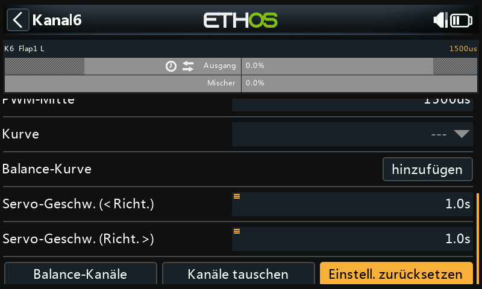

Durch das Zurücksetzen der Einstellungen werden alle Parameter für den
Ausgangskanal auf die Standardwerte zurückgesetzt — nützlich, wenn der
Kanal für etwas anderes verwendet werden soll. Ein Bestätigungsdialog
verhindert ein versehentliches Zurücksetzen.

## Kanäle Balancieren {: #balance-channels }

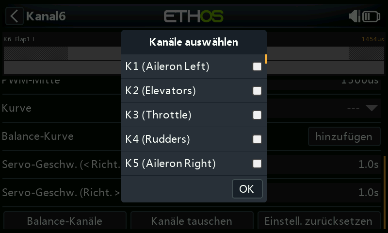
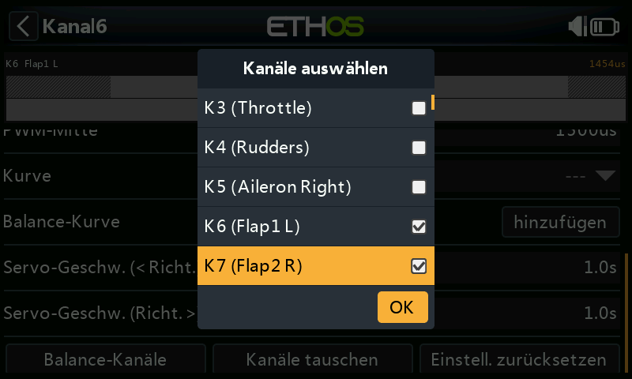

Mit dieser Funktion können Sie ausgewählte Paare oder eine Gruppe von bis
zu 4 Kanälen ausbalancieren, um sicherzustellen, dass sie sich im
Gleichklang bewegen — zum Beispiel können unausgewogene Klappen zu
unerwünschtem Rollen führen, während unausgewogene Gaskanäle bei
mehrmotorigen Modellen zu unerwünschtem Gieren führen können. Ethos
erstellt automatisch eine Differenzausgleichskurve für jeden ausgewählten
Kanal; durch den Vergleich der physischen Positionen der Steuerflächen an
jedem Punkt der Kurven können diese leicht angepasst werden, so dass sie
gleich sind. Das Endergebnis sind perfekt nachgeführte Flächen.

**Vor dem Abgleich** der Kanäle sollte dieses Verfahren befolgt werden:

1. Stellen Sie die Servolaufrichtung für den korrekten Flächenhub ein.
2. Wenn der Mischer auf neutral steht, verwenden Sie optional die
   **PWM-Mitte**, um die Servohebel rechtwinklig einzustellen.
3. Konfigurieren Sie die Min/Max-Grenzen und Subtrim.
4. Konfigurieren Sie alle anderen Kurven.
5. Konfigurieren Sie die Langsam-Funktion.
6. *Danach* gleichen Sie die Steuerflächen an mehreren Punkten des Weges
   aus.

**Verwendung**: Wählen Sie die auszugleichenden Kanäle sowie die
Reihenfolge, in der Sie sie anzeigen möchten —

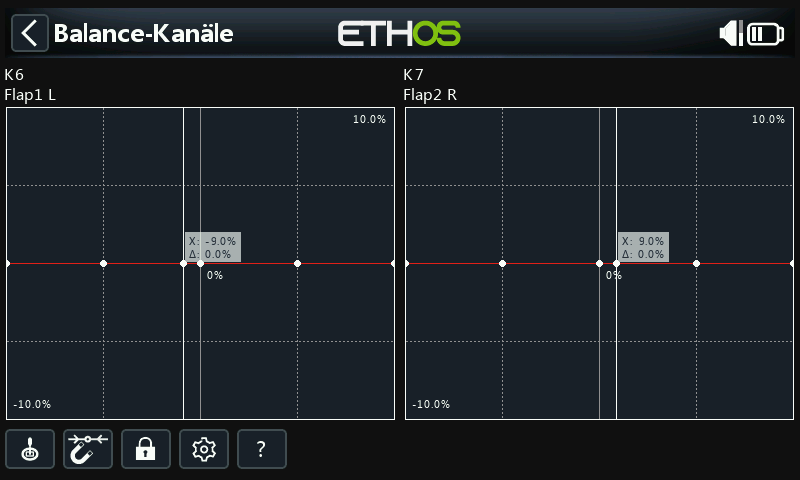

— die Mischerausgänge werden entlang der X-Achsen angezeigt, während die
Differenzwerte der Balanceeinstellung auf den Y-Achsen angezeigt werden.
Tippen Sie auf eine Kanalgrafik (oder blättern Sie zu ihr und drücken Sie
`ENT`), um die Balancekurve zu bearbeiten; mit der `PAGE`-Taste können Sie
während der Bearbeitung zwischen den Kanälen wechseln:

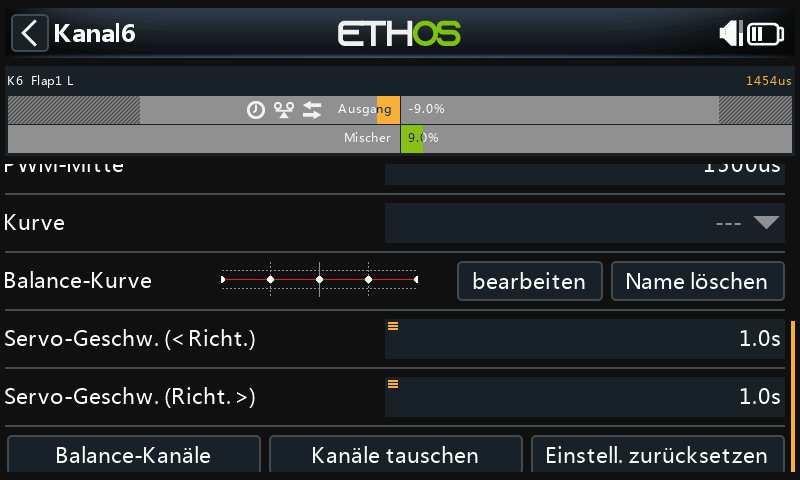

Menü-Tasten:

- **Quelle** — die in den Kanalmischern konfigurierte(n) Quelle(n) kann/
  können verwendet werden, oder optional jeder andere geeignete
  Analogeingang; wenn Sie die Option **Automatischer Analogeingang**
  auswählen, wird der erste Knüppel, Schieberegler oder Potentiometer, den
  Sie bewegen, als Quelle für X verwendet, und zwar nicht nur in der
  Grafik, sondern auch im Modell.
- **Magnet** — wenn diese Funktion aktiviert ist, wird der nächstgelegene
  Kurvenpunkt auf der X-Achse automatisch für die Einstellung mit dem
  Drehgeber ausgewählt:

  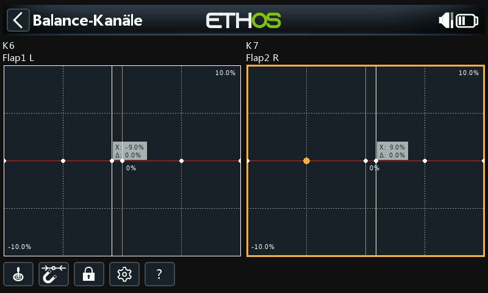
  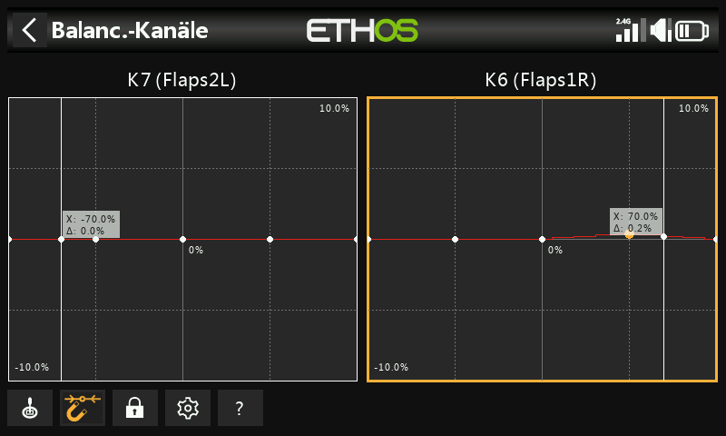

  Der Eingang muss so eingestellt werden, dass der X-Wert mit einem
  Kurvenpunkt übereinstimmt, bevor die Einstellung vorgenommen wird.
- **Sperre** — durch Antippen des Symbols oder Drücken der `ENT`-Taste im
  Diagramm-Bearbeitungsmodus wird der Sperrmodus ein- und ausgeschaltet.
  Wenn er aktiviert ist, sind alle Eingaben gesperrt, so dass Sie die
  Knüppeleingabe loslassen und die Steuerflächen beobachten können, während
  Sie Ihre Kurve anpassen.
- **Konfiguration** — öffnet den Konfigurationsdialog für die gewählten
  Kanäle. Es ist möglich, die Anzahl der Punkte aller oder nur einiger
  Kurven zu ändern und zu wählen, ob sie geglättet werden sollen oder
  nicht.
- **Hilfe** (`?`, ebenso mit der `MDL`-Taste) — ruft die Hilfedatei auf.

**Mehrkanalig**: Bis zu 4 Kanäle können gleichzeitig ausgeglichen werden —

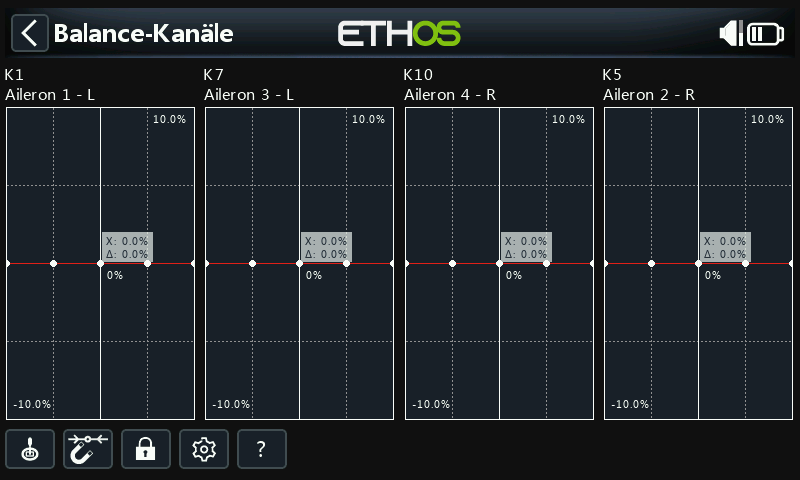

Sobald ein Kanal abgeglichen wurde, kann seine Abgleichkurve auf der
Konfigurationsseite des Kanals überprüft, bearbeitet oder gelöscht werden —
in der Grafikanzeige des Kanals wird dabei ein Abgleichsymbol angezeigt
(gegebenenfalls zusätzlich ein Richtungssymbol, wenn auch diese Einstellung
vom Standard abweicht).
