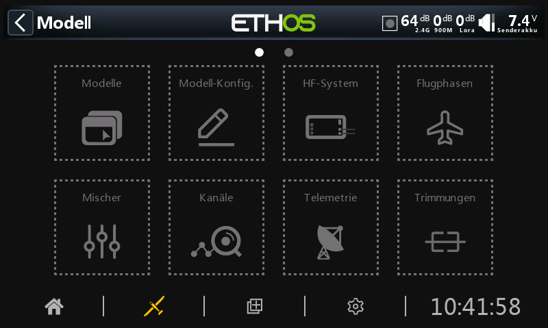
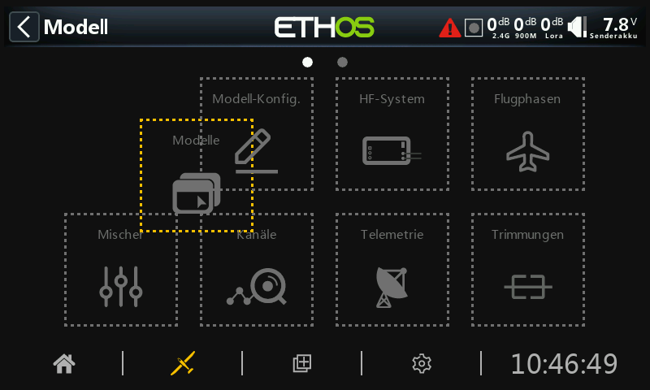

# Neuanordnung des Modellmenüs

Die Menüpunkte des Modells lassen sich nach Ihren Wünschen anordnen. Durch langes Tippen wird diese Option aktiviert. Die Symbole im Modellmenü werden mit gestrichelten Linien angezeigt, um anzuzeigen, dass die Neuanordnungsoption aktiv ist.

Hinweis: Diese Funktion ist bei Sendern ohne Touchscreen nicht verfügbar.

Die Menüpunkte des Modells lassen sich nun beliebig verschieben. Tippen Sie außerhalb der Symbole oder drücken Sie RTN, um die Bearbeitung zu beenden.
