# HF-System

In diesem Abschnitt werden die internen und/oder externen HF-Module konfiguriert, einschließlich der „Registrierungs-ID des Eigentümers“.

## Deaktivieren des HF-Ausgangs

Die internen und externen HF-Module können durch Gedrückt halten der PgUp/Dn Taste beim Einschalten des Systems deaktiviert werden. Dabei erhalten Sie eine Warnung, dass die HF dauerhaft ausgeschaltet ist. Der Schalter für den Zustand der HF-Module bleibt dabei aber weiterhin auf EIN. Startet man den Sender neu wird der Normalzustand wieder hergestellt.

## Registrierungs-ID des Eigentümers (Sender ID)

Die „Sender-ID“ ist eine 8-stellige ID, die einen eindeutigen Zufallscode enthält, der auf Wunsch geändert werden kann. Diese ID wird zur „Registrierungs-ID“, wenn Sie einen Empfänger registrieren (siehe unten). Geben Sie denselben Code in das Feld „Sender -ID“ Ihrer anderen Sender ein, mit denen Sie die Smart Share-Funktion nutzen möchten. Dies muss vor der Erstellung des Modells geschehen, für das Sie die Funktion nutzen möchten.

### Hinweis zur Kompatibilität mit OpenTX und EdgeTX

Die „Sender- ID“ ist mit EdgeTX kompatibel, aber nur teilweise mit OpenTX. Sie muss aus acht Zeichen bestehen und kann eine Mischung aus Großbuchstaben, Kleinbuchstaben und Zahlen, aber keine Sonderzeichen enthalten.

## [Internes Modul TD-ISRM (X18 und X20/S/HD)](rf-system.md)

Für das TD ISRM Pro HF-Modul lesen Sie bitte den Abschnitt Internes Modul TD-ISRM Pro.

### Übersicht

Das interne HF-Modul für die X18- und X20/S/HD-Sender ist ein neues Design, das Tandem-HF-Pfade für 2,4GHz und 900MHz bietet. Es kann in 3 Modi betrieben werden, d.h. ACCESS, ACCST D16 oder TD MODE.

**Achtung!** In diesem Handbuch und in den Menüs der Funkgeräte ist „900M“ ein allgemeiner Begriff, der das verwendete VHF-Band bezeichnet. Die tatsächlichen Betriebsfrequenzen sind 915Mhz für FCC oder 868Mhz für LBT, je nachdem, in welchem Land der Benutzer arbeitet.

### Zustand

Das interne HF-Modul kann ein- oder ausgeschaltet werden.

### Protokoll

Übertragungsprotokoll des internen HF-Moduls. Die Modelle X20/X20S arbeiten im 2,4-GHz-Band und/oder im 900-MHz-Band. Die Protokolle ACCESS und TD (Tandem) können gleichzeitig (oder einzeln) auf dem 2,4-GHz- und/oder dem 900-MHz-Band arbeiten, während der ACCST D16 nur auf dem 2,4-GHz-Band arbeitet. Das Protokoll muss mit dem vom Empfänger unterstützten Typ übereinstimmen, sonst wird das Modell nicht gebunden! Überprüfen Sie nach einem Protokollwechsel sorgfältig den Betrieb des Modells (insbesondere Failsafe!) und vergewissern Sie sich, dass alle Empfängerkanäle wie vorgesehen funktionieren.

#### ACCESS

Im ACCESS-Modus arbeiten die 2,4G- und 900M-HF-Pfade zusammen mit einem Satz von ACCESS-Steuerungen. Es können drei 2,4G-Empfänger oder drei 900M-Empfänger oder eine Kombination aus 2,4G und 900M für insgesamt drei Empfänger registriert und gebunden sein.

Im ACCESS-Modus mit einer Kombination aus 2,4G- und 900M-Empfängern ist die Telemetrie für die 2,4G- und 900M-HF-Verbindungen gleichzeitig aktiv. Die Sensoren werden in der Telemetrie als 2.4G oder 900M identifiziert. Bitte beachten Sie, dass das 2.4G-Band 24 Kanäle unterstützt, während das 900M-Band nur 16 Kanäle unterstützt.

Es gibt eine neue ETHOS-Telemetrie-Empfängerquellenfunktion namens RX. RX gibt die Empfängernummer des aktiven Empfängers an, der Telemetrie sendet. RX ist in der Telemetrie wie jeder andere Sensor für Echtzeitanzeige, Logikschalter, Sonderfunktionen und Datenprotokollierung verfügbar.

Einzelheiten zur Konfiguration finden Sie im Abschnitt [ACCESS](rf-system.md) weiter unten.

#### ACCST D16

Im ACCST D16 wird das HF-Modul zu einem einzigen 2,4G-HF-Pfad.

Bitte beachten Sie den Abschnitt [ACCST D16](rf-system.md) weiter unten.

#### TD

Im TD-Modus befindet sich das HF-Modul in einem Modus mit geringer Latenz und großer Reichweite und nutzt die 2,4G- und 900M-HF-Verbindungen in Tandem, um mit den neuen Tandem-Empfängern zu arbeiten. Tandem unterstützt 24 Kanäle auf beiden Bändern.

Bitte beachten Sie den Abschnitt [TD-Modus](rf-system.md) weiter unten.

### Flex-Firmware-Optionen

Wenn es um die Wahl der Firmware-Version geht, verwenden die meisten Nutzer einfach entweder:

1. die LBT-Version (Listen Before Talk) in der EU, die im 900M-Modus auf 868Mhz        kommuniziert, oder
2. die FCC-Version für den Rest der Welt, die im 900M-Modus auf 915Mhz kommuniziert.

Die Flex-Version bietet jedoch die Möglichkeit, bei Verwendung der Protokolle ACCESS, ACCST D16 oder TD zwischen den beiden zu wechseln.

Die Konfigurationsbildschirme ändern sich wie oben gezeigt.  Unter Typ haben Sie nun zwei Spalten. Die erste Spalte dient zur Auswahl des FrSky-Protokolls (ACCESS, ACCST D16, TD-Modus oder TW-Modus).

Die zweite Spalte dient zur Auswahl von FLEX915M oder FLEX 868M.

Wenn Sie FLEX915M wählen, wechselt das 2,4G-Band zur FCC-Modulation. Wenn Sie FLEX868M wählen, wechselt das 2,4G-Band zur europäischen LBT-Modulation.

Die abgestrahlte Leistung muss an die gewählte Frequenz angepasst werden.

Beide Versionen ermöglichen die Konfiguration verschiedener Leistungsstufen.

**Hinweis für EU-Nutzer:** Die Verwendung von 200 mW und 500 mW ist im 868-MHz-Band erlaubt. Und mit dem letzten TD-Update und HF-Update funktionieren diese Leistungsstufen auch mit Telemetrie. Wenn Sie 25mW wählen, werden die Telemetriedaten über 868MHz gesendet, während bei 200mW oder 500 mW die Telemetriedaten über 2.4G gesendet werden.

Hinweise:

a) mit ACCESS können Sie bis zu drei 900M- oder 2.4G-Empfänger kombinieren

b) die Option ACCST D16 ist nur für 2,4G geeignet

c) im TD-Modus können Sie drei TD-Empfänger verwenden

### Protokoll: ACCESS

ACCESS bestimmt die Art und Weise, wie Empfänger gebunden und mit dem Sender verbunden sind. Der Prozess ist in zwei Phasen unterteilt. Die erste Phase ist die Registrierung des Empfängers bei dem Sender oder den Sendern, mit denen er verwendet werden soll. Die Registrierung muss für jedes Empfänger-Sender-Paar nur einmal durchgeführt werden. Nach der Anmeldung kann ein Empfänger drahtlos mit jedem der angemeldeten Sender gebunden und wieder gebunden werden, ohne dass die Bindungstaste am Empfänger betätigt werden muss.

Nachdem der ACCESS-Modus ausgewählt wurde, müssen die folgenden Parameter eingestellt werden:

#### Modell ID

Wenn Sie ein neues Modell erstellen, wird die Modell-ID automatisch zugewiesen. Die Modell-ID muss eine eindeutige Nummer sein, da die Smart Match-Funktion sicherstellt, dass nur an die richtige Modell-ID gebunden wird. Diese Nummer wird beim Binden an den Empfänger gesendet, so dass dieser nur auf die Nummer antwortet, an die er gebunden wurde. Der Empfängerabgleich ist nach wie vor so wichtig wie vor ACCESS.

Die Modell-ID kann manuell von 00 bis 63 geändert werden, wobei die Standard-ID 1 ist.

Beachten Sie auch, dass die Modell-ID geändert wird, wenn das Modell geklont wird.

#### Kanalbereich:

Da ACCESS bis zu 24 Kanäle unterstützt, wählen Sie normalerweise Ch1-8, Ch1-16 oder Ch1-24 für die Anzahl der zu übertragende Kanäle. Beachten Sie, dass Ch1-16 die Standardeinstellung ist. Die von einem Empfänger empfangenen Kanäle werden in den Empfängeroptionen für jeden Empfänger konfiguriert.

Die Wahl des Sendekanalbereichs wirkt sich auch auf die übertragenen Aktualisierungsraten aus. Acht Kanäle werden alle 7 ms übertragen. Bei Verwendung von mehr als 8 Kanälen sind die Kanalaktualisierungsraten wie folgt:

| Kanalbereich | Update Rate | Bemerkung |
| --- | --- | --- |
| 1-24 | 21ms | Zuerst wird Ch1-8, dann Ch9-16, dann Ch17-24 im Wechsel gesendet |
| 1-16 | 14ms | Zuerst wird Ch1-8, Ch9-16 abwechselnd gesendet |
| 1-8 | 7ms  | Ch1-8 |
| Racing Mode | 4ms | Nur digitale Servos |

#### Racing Mode

Der Rennmodus bietet eine sehr geringe Latenz von 4 ms mit Empfängern wie dem RS. Das HF-Modul und der RS-Empfänger müssen auf v2.1.7 oder höher sein.

Wenn der Kanalbereich auf Ch1-8 eingestellt ist, ist es möglich, eine Quelle (z.B. einen Schalter) zu wählen, die den Rennmodus aktiviert. Sobald der RS-Empfänger gebunden wurde (siehe unten) und der Rennmodus aktiviert wurde, muss der RS-Empfänger neu gestartet werden, damit der Rennmodus wirksam wird.

#### 2.4G

Aktivieren oder deaktivieren Sie das 2.4G RF-Modul.

**Antenne:** Interne oder externe Antenne (am Anschluss ANT1) auswählen. Obwohl die HF-Stufe über einen eingebauten Schutz verfügt, ist es ratsam, sich zu vergewissern, dass eine externe Antenne angebracht wurde, bevor Sie die externe Antenne auswählen. Bitte beachten Sie, dass die Antennenauswahl modellabhängig ist, d.h. bei jedem Modellwechsel stellt ETHOS den Antennenmodus für das jeweilige Modell ein.

#### 900M

Aktivieren oder deaktivieren Sie das 900M RF-Modul.

**Antenn****e**:

Interne oder externe Antenne (am Anschluss ANT2) wählen. Obwohl die HF-Stufe über einen eingebauten Schutz verfügt, ist es ratsam, sich zu vergewissern, dass eine externe Antenne angebracht wurde, bevor Sie die externe Antenne auswählen. Bitte beachten Sie, dass die Antennenauswahl modellabhängig ist, d.h. bei jedem Modellwechsel stellt ETHOS den Antennenmodus für das jeweilige Modell ein.

**Leistung**:

FCC: Wählen Sie die gewünschte HF-Leistung zwischen 10, 25, 100, 200, 500mW, 10mW~1W (selbstanpassend).

LBT: Wählen Sie die gewünschte HF-Leistung zwischen 25mW (Telemetrie über 868MHz), 200mW oder 500mW (Telemetrie über 2,4GHz).

Im ACCESS-Modus arbeiten die 2,4G- und 900M-HF-Pfade zusammen mit einem Satz ACCESS-Steuerungen. Es können drei 2,4G-Empfänger oder drei 900M-Empfänger oder eine Kombination aus 2,4G und 900M für insgesamt drei Empfänger registriert und gebunden sein.

#### Phase Eins: Registrierung

#### Registrierung

1. Wenn Ihr Empfänger noch nicht registriert ist, starten Sie den Registrierungsprozess, indem Sie \[Registrieren\] wählen. Andernfalls fahren Sie mit dem Abschnitt „Binden“ fort.

Ein Meldungsfenster mit der Aufschrift „Warten auf den Empfänger...“ wird mit einer wiederholten Sprachmeldung „Registrieren“ angezeigt.

2. Halten Sie die Bindungstaste des Empfängers gedrückt, schalten Sie den Empfänger ein und warten Sie, bis die roten und grünen LEDs aktiv werden.

Die Meldung 'Warten auf Empfänger...' ändert sich in 'Empfänger verbunden', und das Feld Rx Name wird automatisch ausgefüllt.

3. In diesem Stadium können die Reg.-ID und die UID eingestellt werden:

- Registrierungs-ID: Die 'Sender-ID ist auf Eigentümer- oder Senderebene. Dies sollte ein eindeutiger Code für Ihren Sender und andere Sender sein, der mit Smart Share verwendet werden kann. Sie ist standardmäßig auf den Wert in der oben am Anfang dieses Abschnitts beschriebenen Einstellung „Sender-ID eingestellt, kann aber hier bearbeitet werden. Wenn zwei Sender die gleiche Reg.-ID haben, können Sie Empfänger (mit der gleichen Empfängernummer für ein bestimmtes Modell) zwischen ihnen verschieben, indem Sie einfach den Einschaltvorgang verwenden.
- RX-Name: Wird automatisch ausgefüllt, der Name kann aber auf Wunsch geändert werden. Dies kann nützlich sein, wenn Sie mehr als einen Empfänger verwenden und sich z.B. daran erinnern müssen, dass RX4R1 für Ch1-8 oder RX4R2 für Ch9-16 oder RX4R3 für Ch17-24 ist, wenn Sie später neu binden. Hier kann ein Name für den Empfänger eingegeben werden.
- Die UID wird verwendet, um zwischen mehreren gleichzeitig in einem Modell verwendeten Empfängern zu unterscheiden. Sie kann auf dem Standardwert 0 für einen einzelnen Empfänger belassen werden. Wenn mehr als ein Empfänger in demselben Modell verwendet werden soll, sollte die UID geändert werden, normalerweise 0 für Ch1-8, 1 für Ch9-16 und 2 für Ch17-24. Bitte beachten Sie, dass diese UID nicht vom Empfänger zurück gelesen werden kann, daher ist es ratsam, den Empfänger zu kennzeichnen.

4. Drücken Sie zum Abschluss auf \[Registrieren\]. Es erscheint ein Dialogfeld mit der Meldung „Registrierung ok“. Drücken Sie \[OK\], um fortzufahren.

5. Schalten Sie den Empfänger aus. Zu diesem Zeitpunkt ist der Empfänger registriert, muss aber noch an den zu verwendenden Sender gebunden werden. Er ist jetzt bereit zum Binden.

#### Phase Zwei - Bindung und Moduloptionen

#### Binden

Das Binden von Empfängern ermöglicht es, einen registrierten Empfänger an einen der Sender zu binden, mit denen er in Phase 1 registriert wurde, und er reagiert dann auf diesen Sender, bis er wieder an einen anderen Sender gebunden wird. Führen Sie unbedingt einen Reichweitentest durch, bevor Sie das Modell fliegen.

Warnung - sehr wichtig

Führen Sie den Bindevorgang nicht durch, wenn ein Elektromotor angeschlossen ist oder ein Verbrennungsmotor läuft.

1. Schalten Sie den Empfänger aus.

2. Bestätigen Sie, dass Sie sich im ACCESS-Modus befinden.

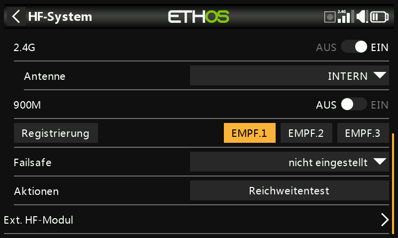

3. Empfänger 1 \[Binden\]: Starten Sie den Bindevorgang, indem Sie \[RX1\] auswählen und dann Binden aus der Dropdown-Liste wählen.

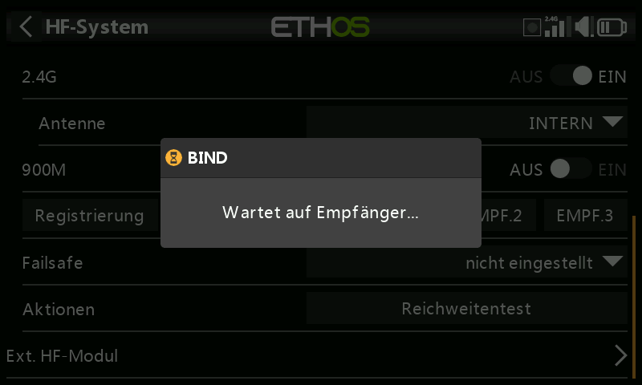

Alle paar Sekunden ertönt ein Sprachsignal mit der Ansage „Binden“, um zu bestätigen, dass Sie sich im Bindungsmodus befinden. Ein Popup-Fenster zeigt „Warten auf Empfänger...“ an.

4. Schalten Sie den Empfänger ein, ohne die F/S-Bindungstaste zu drücken. Es erscheint die Meldung 'Empf./Laufw. auswählen' und der Name des Empfängers, den Sie gerade eingeschaltet haben.

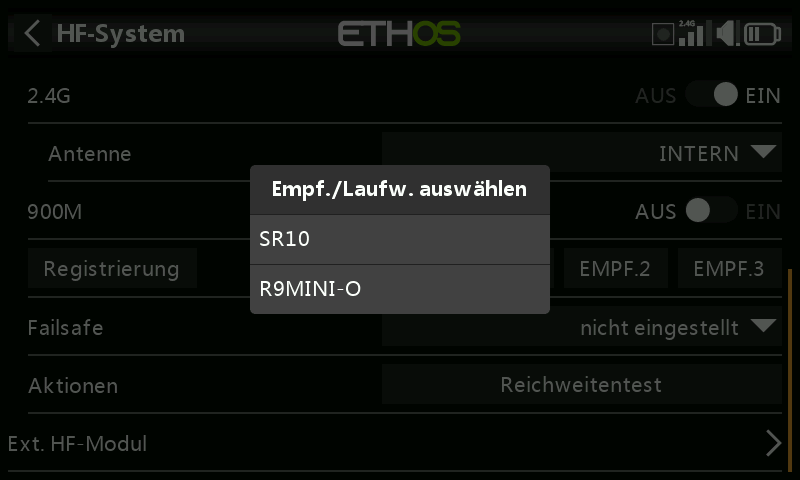

5. Blättern Sie zu dem Namen des Empfängers und wählen Sie ihn aus.

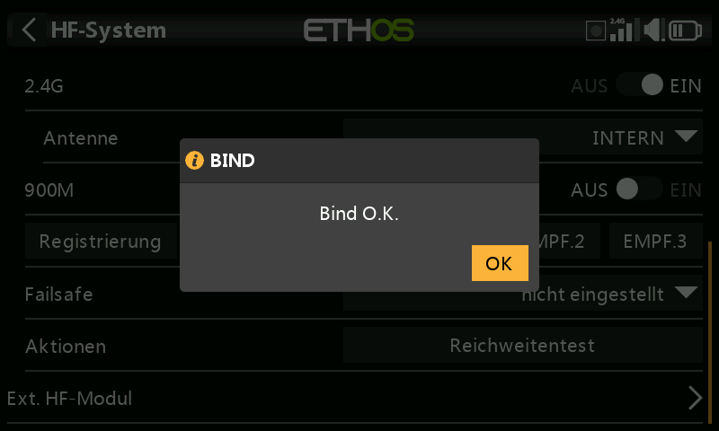

Ein Meldungsfenster zeigt an, dass die Verbindung erfolgreich war. Klicken Sie auf OK.

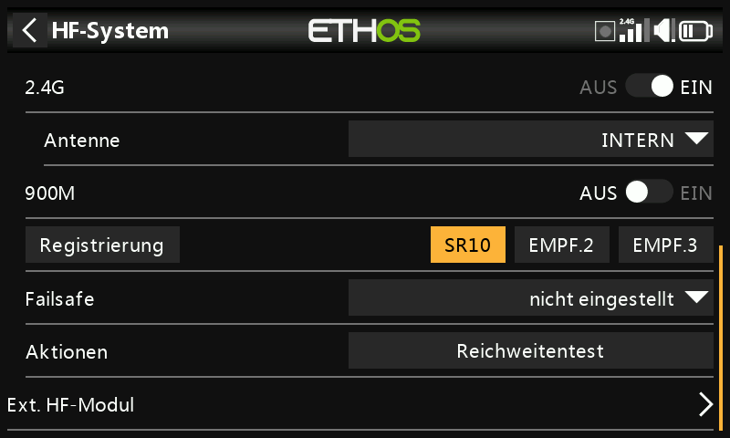

Für den ausgewählten Empfänger wird nun neben RX1 der Name angezeigt.

6. Schalten Sie sowohl den Sender als auch den Empfänger aus.

7. Schalten Sie erst den Sender und dann den Empfänger ein. Wenn die grüne LED am Empfänger leuchtet und die rote LED aus ist, ist der Empfänger mit dem Sender verbunden. Die Bindung zwischen Empfänger und Sendemodul muss nicht wiederholt werden, es sei denn, eines der beiden Module wird ausgetauscht.

Der Empfänger ist nun einsatzbereit. Der Empfänger wird nur von dem Sender, an den er gebunden ist, gesteuert (ohne von anderen Sendern beeinflusst zu werden).

Wiederholen Sie den Vorgang für Empfänger 2 und 3, falls zutreffend.

Siehe auch den Abschnitt Telemetrie für eine Beschreibung zum [RSSI](#Lesezeichen 31).

#### Empfänger-Optionen

Tippen Sie bei eingeschaltetem Empfänger auf die Taste RX1, 2 oder 3, um die Empfängeroptionen und andere Empfängerfunktionen aufzurufen:

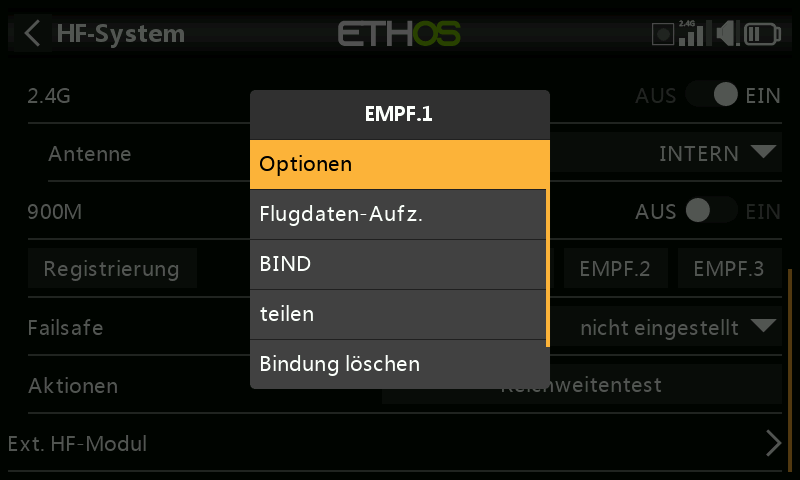

Tippen Sie auf Optionen:

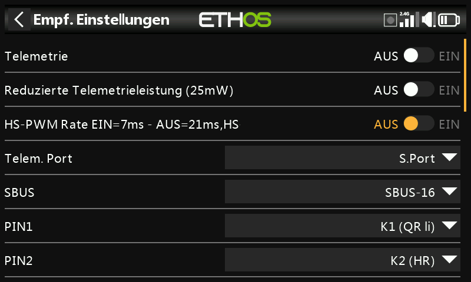

Telemetrie: Die Telemetrie kann für diesen Empfänger deaktiviert werden.

Reduzierte Telemetrieleistung 25mW: Kontrollkästchen zur Begrenzung der Telemetrieleistung auf 25mW (normalerweise 100mW), möglicherweise erforderlich, wenn z.B. Servos durch HF-Störungen in ihrer Nähe gestört werden.

HS-PWM Rate: Die Servo-Aktualisierungsraten werden vollständig durch den Empfänger bestimmt.  Dieses Kontrollkästchen aktiviert eine PWM-Aktualisierungsrate von 7 ms (gegenüber 18 ms (21ms) Standard). Stellen Sie sicher, dass Ihre Servos diese Aktualisierungsrate verarbeiten können.

Einzelheiten zur am Sender eingestellten Aktualisierungsrate finden Sie im Abschnitt [Kanalbereich](rf-system.md) (Zugriff).

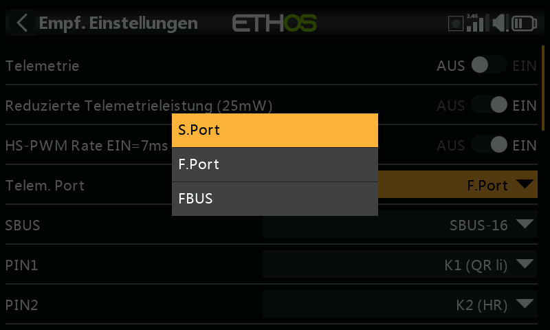

*Telem.* *Port*: Ermöglicht die Auswahl des Smart.Port am Empfänger, um entweder S.Port, F.Port oder das FBUS (F.Port2) Protokoll zu verwenden. Das F.Port-Protokoll wurde zusammen mit dem Betaflight-Team entwickelt, um die separaten SBUS- und S.Port-Signale zu integrieren. FBUS (F.Port2) ermöglicht auch die Kommunikation eines Host-Gerätes mit mehreren Slave-Geräten auf derselben Leitung. Weitere Informationen über das Port-Protokoll finden Sie in der Protokollerklärung auf der offiziellen FrSky-Website.

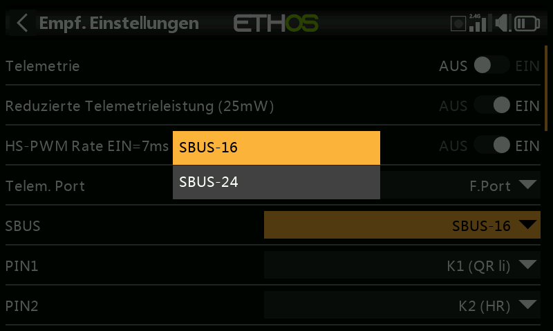

*SBUS**:* Ermöglicht die Auswahl des SBUS-16-Kanal- oder SBUS-24-Kanal-Modus. Beachten Sie, dass alle angeschlossenen SBUS-Geräte den SBUS-24-Modus unterstützen müssen, um das neue Protokoll zu aktivieren. SBUS-24 ist eine FrSky-Entwicklung des SBUS-16 Futaba-Protokolls.

*Kanal-Mapping*: Das Dialogfeld Empfängeroptionen bietet auch die Möglichkeit, Kanäle den Empfängerpins neu zuzuordnen.

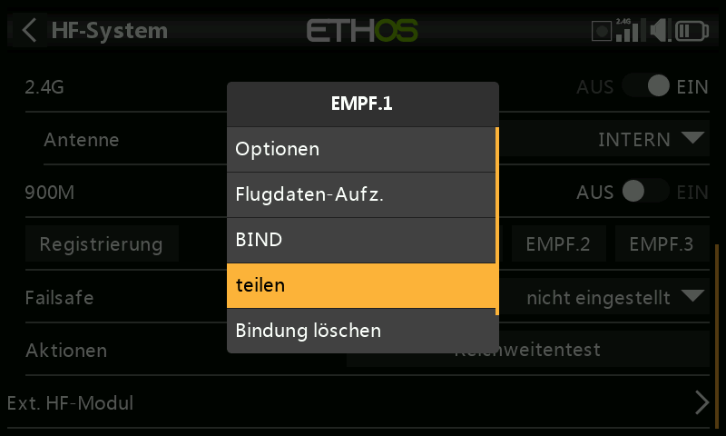

Die ‚teilen’-Funktion bietet die Möglichkeit, den Empfänger auf ein anderen ACCESS-Sender mit einer anderen „Sender-ID“ zu übertragen. Wenn die ‚teilen’-Option angetippt wird, schaltet sich die grüne LED des Empfängers aus.

Navigieren Sie am Zielfunkgerät B zum Abschnitt HF System und Empfänger(n) und wählen Sie BIND. Beachten Sie, dass der ‚teilen’-Prozess den Registrierungsschritt im Sender B überspringt, da die „Sender ID“ von Radio A übertragen wird. Wählen Sie den Namen aus, der Empfänger wird gebunden und seine LED leuchtet grün.

Eine Meldung „Bindung erfolgreich“ wird angezeigt.

Tippen Sie auf OK. Radio B steuert nun den Empfänger. Der Empfänger bleibt an dieses Funkgerät gebunden, bis Sie es ändern.

Drücken Sie die Taste EXIT auf Radio A, um den ‚teilen’-prozess zu beenden.

Der Empfänger kann wieder auf Radio A verschoben werden, indem er erneut an Radio A gebunden wird.

Hinweis: Sie brauchen die Funktion „teilen“ nicht zu verwenden, wenn alle Ihre Sender dieselbe „Sender-ID“ verwenden. Sie können einfach den gewünschten Sender in den Bindungsmodus versetzen, den Empfänger einschalten, den Empfänger im Sender auswählen und es wird mit diesem verbunden. Auf die gleiche Weise können Sie zu einem anderen Sender wechseln. Es ist am besten, wenn Sie beim Kopieren der Modelle die Nummern der Empfänger beibehalten.

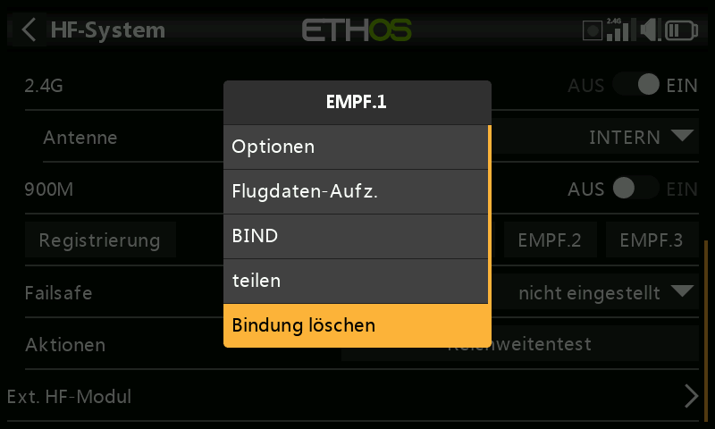

Wenn Sie Ihre Meinung über die gemeinsame Nutzung eines Modells ändern, wählen Sie „Bindung löschen“, um Ihre Bindung zu bereinigen und wiederherzustellen. Schalten Sie den Empfänger ein und er wird an Ihren Sender gebunden.

##### Werkseinstellungen

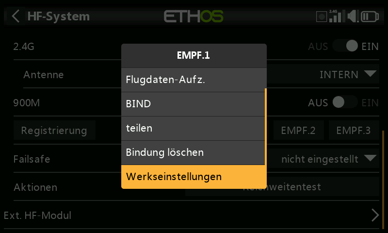

Tippen Sie auf die Schaltfläche Werkseinstellungen, um den Empfänger auf die Werkseinstellungen zurückzusetzen und die UID zu löschen. Der Empfänger ist nicht mehr im Sender registriert.

Beachten Sie, dass durch das Zurücksetzen auf die Werkseinstellungen auch die 6-Achsen-Kalibrierungsdaten auf stabilisierten Empfängern gelöscht werden.

#### Empfängeroptionen (bei ausgeschaltetem Rx)

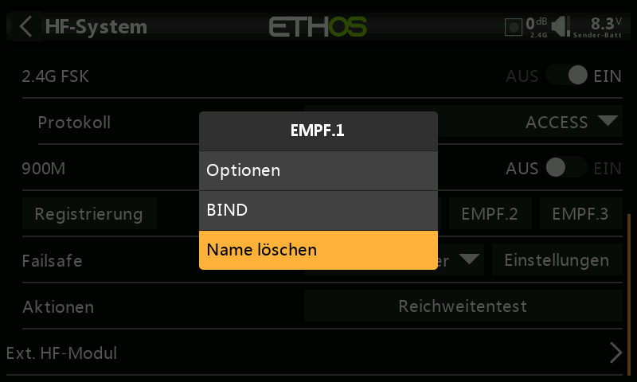

Tippen Sie bei ausgeschaltetem Empfänger auf die Taste RX1, 2 oder 3, um die Empfängeroptionen aufzurufen.

Wenn Sie auf Optionen tippen, versucht das Funkgerät, eine Verbindung herzustellen und wartet auf den Empfänger.

Wenn Sie auf Binden tippen, können Sie zum Beispiel ein Modell, das an einen anderen Sender gebunden war, neu binden.

Wenn Sie auf „Name löschen“ tippen, wird ein Bindungsreset ausgeführt.

#### Hinzufügen eines redundanten Empfängers

Ein zweiter Empfänger kann an einen unbenutzten Steckplatz gebunden werden, z. B. entweder RX2 oder RX3, um bei Empfangsproblemen Redundanz zu gewährleisten. Ein 2.4G- oder 900M-Empfänger kann als Backup für die Redundanz dienen.

Die FrSky-Redundanz für die Steuerung wird immer pro Frame ausgewertet, wobei der beste Frame gewählt wird. Wenn jedoch 2 gute Frames vorhanden sind, wählt der Empfänger den internen guten Frame. Daher kann die Steuerung nach Bedarf bei jedem Frame umschalten (aktive/aktive Ausfallsicherung).

Unser Beispiel unten zeigt einen 900M-Empfänger, der hinzugefügt wurde.

1. Verbinden Sie den SBUS-Out-Anschluss des redundanten Empfängers mit dem SBUS IN-Anschluss des Hauptempfängers.

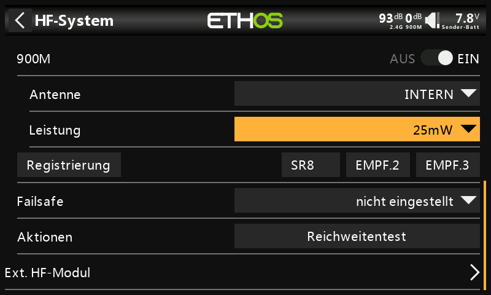

2. Aktivieren Sie das interne HF-Modul des 900M.

2a. Konfigurieren Sie die Antennen- und HF-Leistungsoptionen.

**Antenn****e**:

Interne oder externe Antenne (am Anschluss ANT2) auswählen. Obwohl die HF-Stufe über einen eingebauten Schutz verfügt, ist es ratsam, sich zu vergewissern, dass eine externe Antenne angebracht wurde, bevor Sie die externe Antenne auswählen. Bitte beachten Sie, dass die Antennenauswahl modellabhängig ist, d.h. bei jedem Modellwechsel stellt ETHOS den Antennenmodus für das jeweilige Modell ein.

**Leistung**:

FCC: Wählen Sie die gewünschte HF-Leistung zwischen 10, 25, 100, 200, 500mW, 10mW~1W (selbstanpassend).

LBT: Wählen Sie die gewünschte HF-Leistung zwischen 25mW (Telemetrie über 868MHz), 200mW oder 500mW (Telemetrie über 2,4GHz).

3. Wenn Ihr Empfänger noch nicht registriert wurde, starten Sie den Registrierungsprozess, indem Sie \[Registrieren\] wählen. Andernfalls fahren Sie mit dem Abschnitt „Binden“ fort.

4. Registrieren Sie den neuen Empfänger, z.B. den R9MINI-O.

5. Schalten Sie die Empfänger aus.

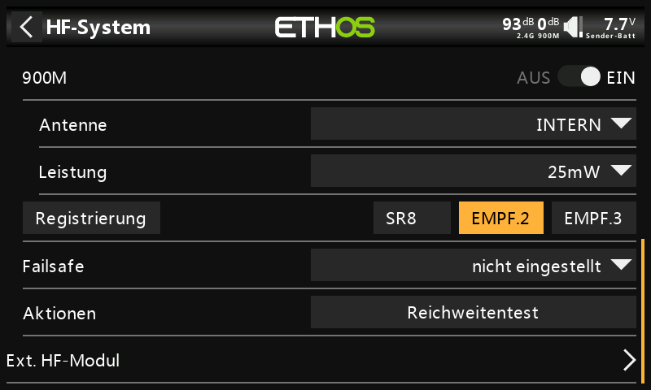

6. Tippen Sie entweder auf die Schaltfläche RX2 oder RX3.

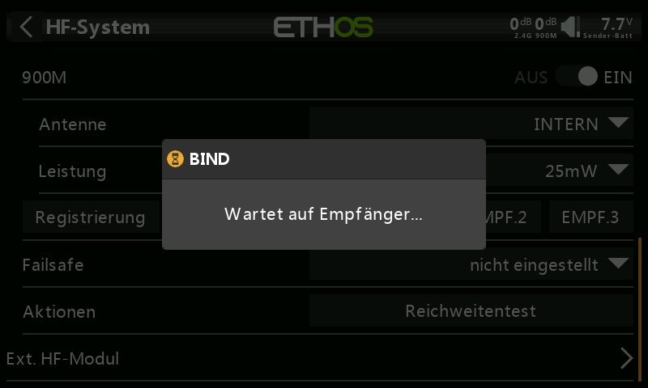

Alle paar Sekunden ertönt eine Sprachansage „Binden“, um zu bestätigen, dass Sie sich im Bindungsmodus befinden. Ein Popup-Fenster zeigt „Warten auf Empfänger...“ an.

7. Schalten Sie die Empfänger ein.

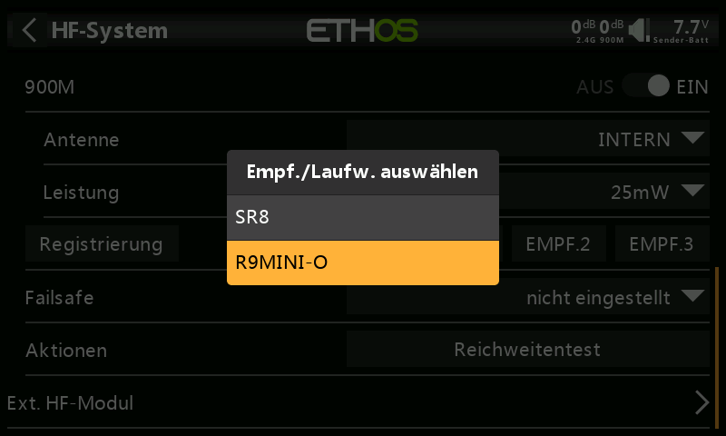

8. Wählen Sie den redundanten Empfänger R9MINI-O.

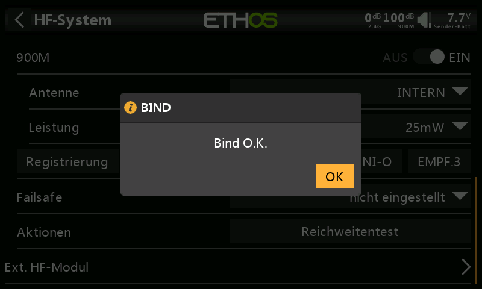

9. Tippen Sie auf OK. Stellen Sie sicher, dass die grüne LED am redundanten Empfänger leuchtet. Der redundante Empfänger ist nun gebunden.

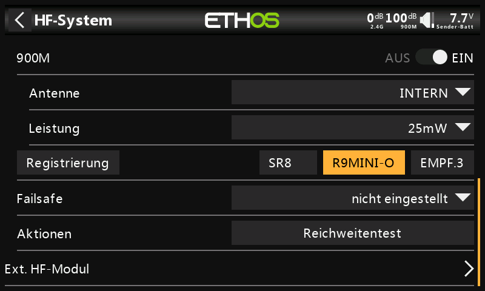

10. Der redundante Empfänger wird nun aufgelistet.

Hinweis: Obwohl es möglich ist, sowohl den Hauptempfänger als auch den redundanten Empfänger an dieselbe UID zu binden, indem Sie sie einzeln einschalten, haben Sie keinen Zugriff auf die Rx-Optionen, solange beide eingeschaltet sind.

#### Failsafe

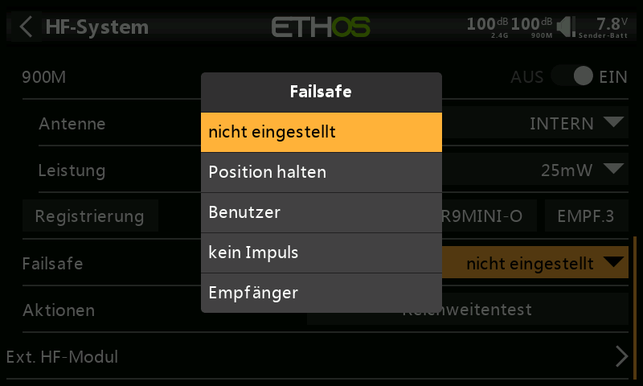

Der Failsafe-Modus bestimmt, was im Empfänger passiert, wenn das Sendersignal verloren geht.

Die Failsafe-Daten werden etwa alle 10 Sekunden vom Sender gesendet. Bitte beachten Sie, dass bei TD-, TW-, AP- und AP Plus-Empfängern die Failsafe-Daten jetzt im Empfänger gespeichert werden, was bedeutet, dass die Failsafe-Einstellungen sofort verfügbar sind, wenn der Empfänger aus irgendeinem Grund neu gestartet wird. Beachten Sie, dass die Failsafe-Funktion nach einem Upgrade von Empfängern mit dieser Funktion zurückgesetzt und überprüft werden muss.

Tippen Sie auf das Dropdown-Feld, um die Failsafe-Optionen anzuzeigen:

##### Position halten

Mit Halten werden die zuletzt empfangenen Positionen beibehalten.

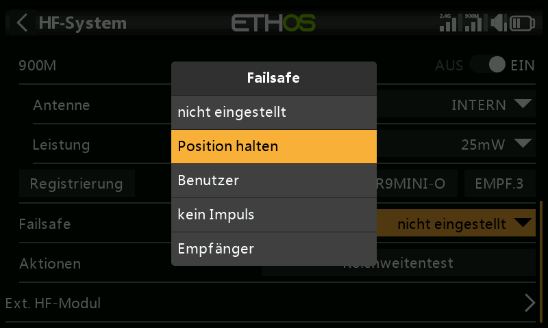

##### Benutzer

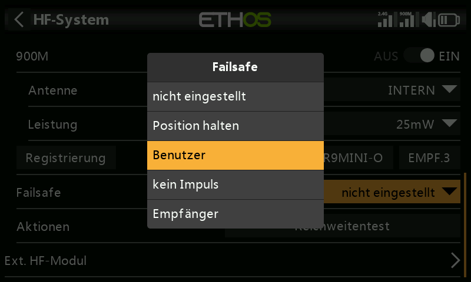

Benutzer ermöglicht die Bewegung der Servos in benutzerdefinierte vordefinierte Positionen. Die Position kann für jeden Kanal separat definiert werden. Für jeden Kanal gibt es die Optionen nicht eingestellt, Position halten, Benutzer oder Kein Impuls. Wenn Benutzer ausgewählt ist, wird der Kanalwert angezeigt. Wenn das Symbol mit dem Pfeil angetippt wird, wird der aktuelle Wert des Kanals verwendet. Alternativ kann ein fester Wert für diesen Kanal eingegeben werden, indem Sie auf den Wert tippen.

##### Kein Impuls

keine Impulse schaltet die Impulse aus (zur Verwendung mit Flugcontrollern, die bei Signalverlust zum Heimat-GPS-Ort zurückkehren).

##### Empfänger

Wenn Sie bei Empfängern der Serie X oder höher „Empfänger“ wählen, können Sie die Failsafe-Funktion im Empfänger einstellen.

*Warnung:* Achten Sie darauf, die gewählten Failsafe-Einstellungen sorgfältig zu testen, insbesondere die Kanäle, die bei stabilisierten Empfängern den Kreisel steuern.

#### Reichweitentest

Eine Reichweitenkontrolle sollte auf dem Flugplatz durchgeführt werden, wenn das Modell flugbereit ist.

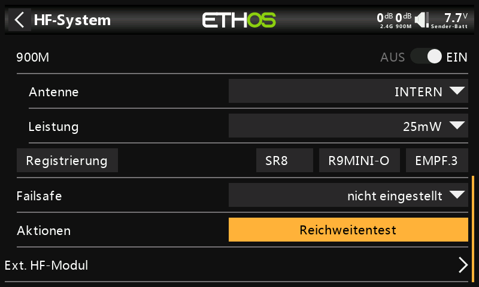

Der Reichweitentest wird durch dessen Auswahl aktiviert.

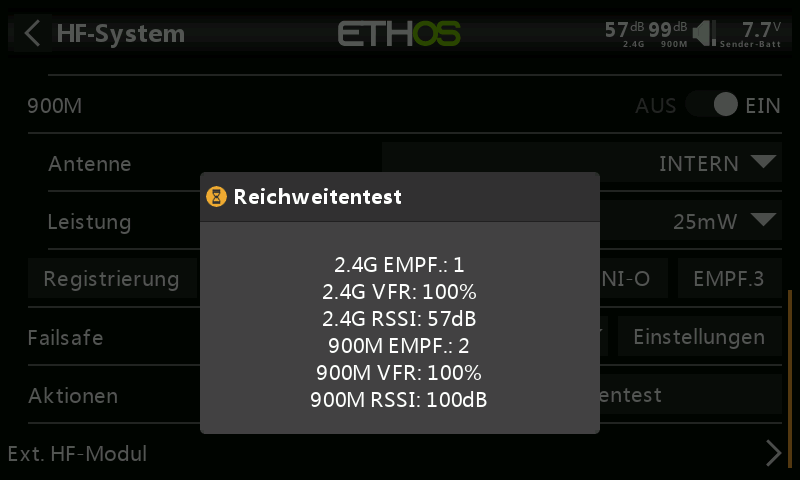

Alle paar Sekunden ertönt die Sprachansage „Reichweitentest“, um zu bestätigen, dass Sie sich in diesem Modus befinden. Ein Popup-Fenster zeigt die Empfängernummer sowie die VFR%- und RSSI-Werte an, um das Verhalten der Empfangsqualität zu bewerten. Wenn die Reichweitenprüfung aktiv ist, wird die Sendeleistung reduziert, was wiederum die Reichweite für den Reichweitentest verringert. Der FrSky-Reichweitentest-Pegel ist 0,1mW (-10dB) nicht 1mW (0dB)  
Der Normalpegel beträgt +18dB +2dB für die Antennen = +20dB  
  
Unter idealen Bedingungen, bei denen sich sowohl der Sender als auch der Empfänger 1 m über dem Boden befinden, sollten Sie frühestens in einem Abstand von etwa 30 m einen kritischen Alarm erhalten.

Derzeit liefert ACCESS im Reichweitentestmodus Reichweitendaten für jeweils einen Empfänger auf der 2,4G-Verbindung und einen Empfänger auf der 900M-Verbindung. Wenn Sie drei 2,4G-Empfänger registriert und als Empfänger 1, 2 und 3 gebunden haben, ist einer der Empfänger der aktive Telemetrieempfänger und seine Nummer wird vom RX-Sensor als 0, 1 oder 2 angezeigt. Dies ist der Empfänger, der die RSSI- und VFR-Daten sendet. Wenn Sie diesen Empfänger ausschalten, wird der nächste Empfänger zum aktiven Telemetrieempfänger in der Priorität 0, 1 und dann 2. Jeder der drei Empfänger kann auf seine Reichweite überprüft werden, indem die anderen Empfänger ausgeschaltet werden.

RX Index 0 = Empfänger 1

RX Index 1 = Empfänger 2

RX Index 2 = Empfänger 3

Bitte lesen Sie auch den Abschnitt Telemetrie für eine Diskussion über [VFR- und RSSI](#Lesezeichen 31)-Werte.

### Protokoll: ACCST D16

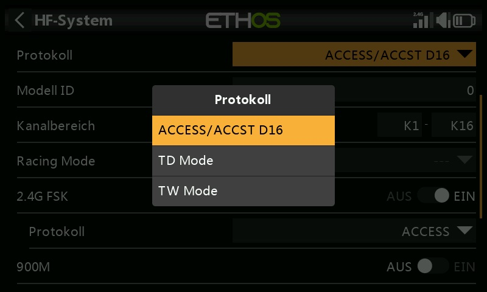

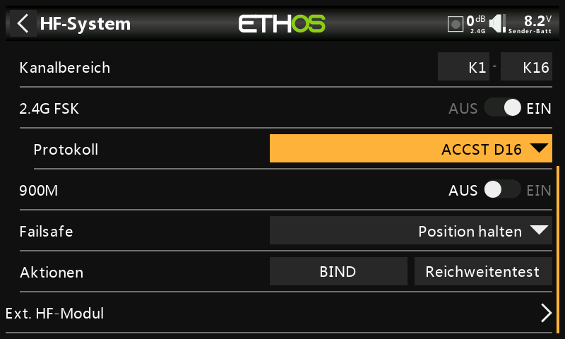

Der Modus ACCST D16 ist für die ACCST 16-Kanal-Zwei-Wege-Vollduplex-Übertragung, auch bekannt als „X“-Modus. Zur Verwendung mit den alten Empfängern der „X“-Serie.

#### Modell ID

Wenn Sie ein neues Modell erstellen, wird die Modell-ID automatisch zugewiesen. Die Modell-ID muss eine eindeutige Nummer sein, da die Funktion Model Match sicherstellt, dass nur an die richtige Modell-ID gebunden wird. Diese Nummer wird beim Binden an den Empfänger gesendet, so dass dieser nur auf die Nummer antwortet, an die er gebunden wurde. Die Model-ID kann manuell geändert werden.

#### Kanalbereich

Sie können wählen, welche der internen Kanäle des Senders tatsächlich übertragen werden. Im D16-Modus können Sie zwischen 8 Kanälen mit Datenübertragung alle 9 ms und 16 Kanälen mit Datenübertragung alle 18 ms wählen.

Bitte beachten Sie, dass die Servo-Aktualisierungsraten vollständig durch den Empfänger bestimmt werden. Für ACCST lesen Sie bitte im Handbuch Ihres Empfängers nach, wie Sie den 9ms HS (High PWM-Speed) Modus auswählen. Stellen Sie sicher, dass Ihre Servos diese Aktualisierungsrate verarbeiten können.

#### 2.4G

ACCST D16 arbeitet mit 2.4G, daher ist der 2.4G HF-Bereich standardmäßig eingeschaltet.

Interne oder externe Antenne (am Anschluss ANT1) wählen. Obwohl die HF-Stufe über einen eingebauten Schutz verfügt, ist es ratsam, sich zu vergewissern, dass eine externe Antenne angebracht wurde, bevor Sie die externe Antenne auswählen. Bitte beachten Sie, dass die Antennenauswahl modellabhängig ist, d.h. bei jedem Modellwechsel stellt ETHOS den Antennenmodus für das jeweilige Modell ein.

#### Binden

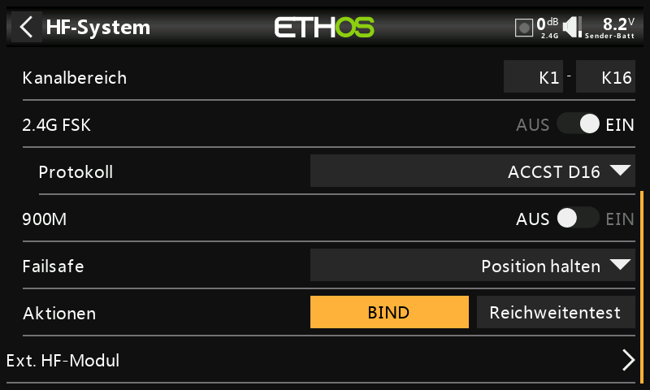

1. Starten Sie den Bindungsvorgang, indem Sie \[Binden\] wählen. Ein Sprachsignal wird alle paar Sekunden „Binden“ ansagen, um zu bestätigen, dass Sie sich im Bindemodus befinden. Im D16-Modus öffnet sich während des Bindevorgangs ein Popup-Menü, in dem Sie den Betriebsmodus des Empfängers auswählen können. Die Optionen beziehen sich auf die PWM-Ausgänge und gelten für Empfänger, die die Auswahl zwischen diesen 4 Optionen über Jumper unterstützen. Stellen Sie sicher, dass die Firmware des Empfängers und des HF-Moduls diese Option unterstützt. Ist dies nicht der Fall, muss ein regulärer Bindevorgang mit der F/S-Taste durchgeführt werden (siehe Handbuch des Empfängers).

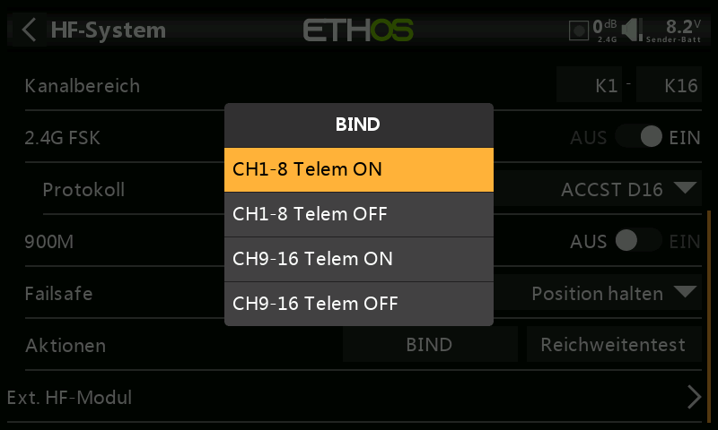

Es gibt 4 Modi mit den Kombinationen von Telemetrie ein/aus und Kanal 1-8 oder 9-16. Dies ist nützlich, wenn Sie zwei Empfänger zur Redundanz verwenden oder mehr als 8 Servos mit zwei Empfängern anschließen möchten.

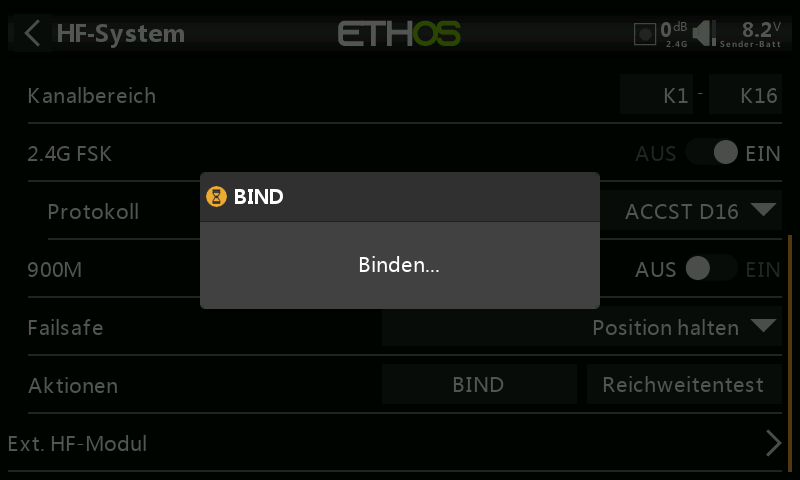

2. Schalten Sie den Empfänger ein und versetzen Sie ihn in den Bindemodus gemäß den Anweisungen des Empfängers. (In der Regel halten Sie dazu die F/S-Taste am Empfänger während des Einschaltens gedrückt).

3. Die rote und die grüne LED leuchten auf. Die grüne LED erlischt, und die rote LED blinkt, wenn der Bindevorgang abgeschlossen ist.

4. Tippen Sie auf OK am Sender, um den Bindevorgang zu beenden, und schalten Sie den Empfänger aus und wieder ein.

5. Wenn die grüne LED am Empfänger leuchtet und die rote LED nicht leuchtet, ist der Empfänger mit dem Sender verbunden. Die Bindung zwischen Empfänger und Sendermodul muss nicht wiederholt werden, es sei denn, eines der beiden Module wird ausgetauscht. Der Empfänger wird nur von dem Sender, an den er gebunden ist, gesteuert (ohne von anderen Sendern beeinflusst zu werden).

Warnungen - sehr wichtig

Führen Sie den Bindevorgang nicht durch, wenn ein Elektromotor angeschlossen ist oder ein Verbrennungsmotor läuft.

#### Failsafe

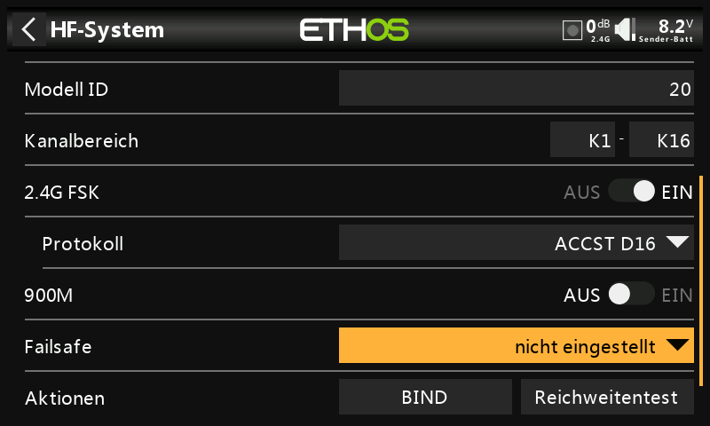

Der Failsafe-Modus bestimmt, was am Empfänger passiert, wenn das Sendersignal verloren geht.

Tippen Sie auf das Dropdown-Feld, um die Failsafe-Optionen anzuzeigen:

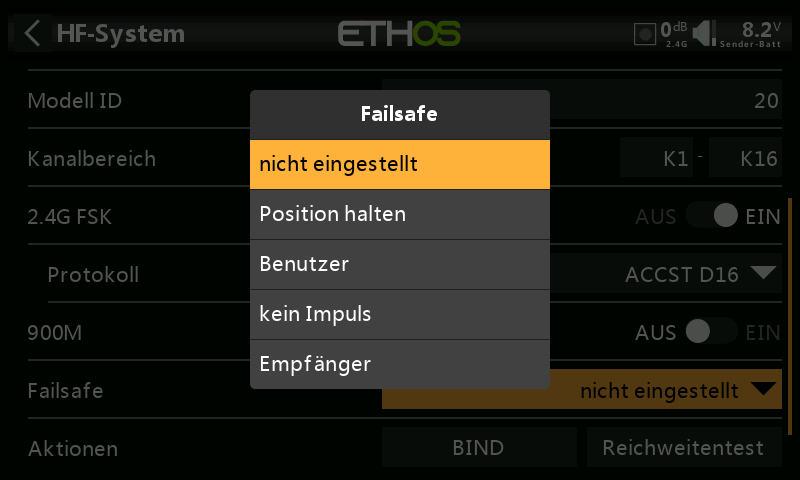

Mit Halten werden die zuletzt empfangenen Positionen beibehalten.

Benutzerdefiniert ermöglicht die Bewegung der Servos in benutzerdefinierte vordefinierte Positionen. Die Position kann für jeden Kanal separat definiert werden. Für jeden Kanal gibt es die Optionen nicht eingestellt, Position halten, Benutzer oder kein Impuls. Wenn Benutzerdefiniert ausgewählt ist, wird der Kanalwert angezeigt. Wenn das Symbol mit dem Pfeil angetippt wird, wird der aktuelle Wert des Kanals verwendet. Alternativ kann ein fester Wert für diesen Kanal eingegeben werden, indem Sie auf den Wert tippen.

keine Impulse schaltet die Impulse aus (zur Verwendung mit Flugcontrollern, die bei Signalverlust zum Heimat-GPS-Ort zurückkehren).

Wenn Sie bei Empfängern der Serie X oder höher „Empfänger“ wählen, können Sie die Failsafe-Funktion im Empfänger einstellen.

**Warnung:** Achten Sie darauf, die gewählten Failsafe-Einstellungen sorgfältig zu testen – insbesondere die Kanäle, die bei stabilisierten Empfängern den Kreisel steuern.

#### Reichweitentest

Eine Reichweitenkontrolle sollte auf dem Flugplatz durchgeführt werden, wenn das Modell flugbereit ist.

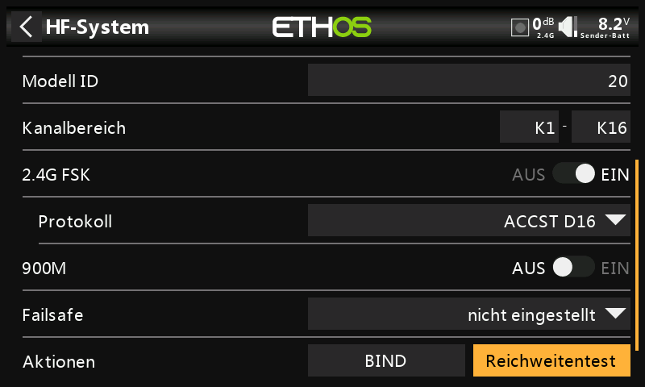

Die Reichweitenkontrolle wird durch Auswahl von „Reichweitentest“ aktiviert.

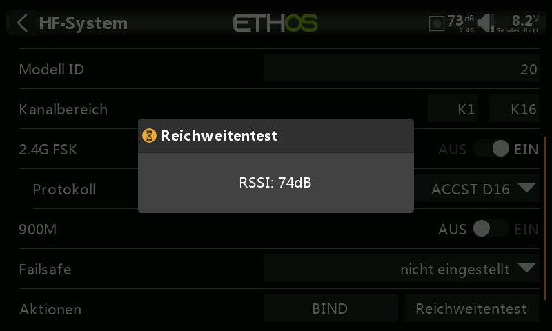

Alle paar Sekunden ertönt die Sprachansage „Reichweitentest“, um zu bestätigen, dass Sie sich in diesem Modus befinden. Ein Popup-Fenster zeigt die Empfängernummer sowie die VFR%- und RSSI-Werte an, um das Verhalten der Empfangsqualität zu bewerten. Wenn die Reichweitenprüfung aktiv ist, wird die Sendeleistung reduziert, was wiederum die Reichweite für die Reichweitenvorteils verringert.

Der FrSky-Reichweitentest-Pegel ist 0,1mW (-10dB) und nicht 1mW (0dB)  
Der Normalpegel beträgt +18dB +2dB für die Antennen = +20dB.

Unter idealen Bedingungen, wenn sich sowohl der Sender als auch der Empfänger 1 m über dem Boden befinden, sollten Sie erst in einem Abstand von etwa 30 m einen kritischen Alarm erhalten.

Weitere Informationen zu [VFR- und RSSI](#Lesezeichen 31)-Werten finden Sie im Abschnitt Telemetrie.

### Protokoll: TD Mode

Im TD-Modus arbeiten die Empfänger auf zwei Bändern gleichzeitig. Während der Signal- und Telemetrieübertragung findet ein ständiger Vergleich der Datenpaketqualität zwischen beiden Bändern statt, so dass immer das bessere Datenpaket eines der beiden Bänder verwendet wird, um sicherzustellen, dass die Übertragung immer optimal ist.

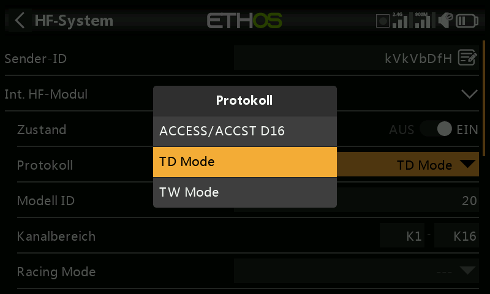

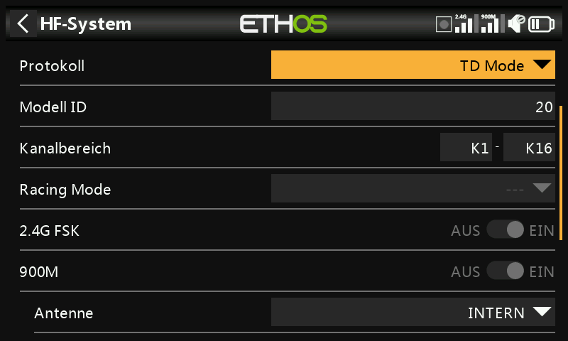

ACCESS und TD MODE ändern die Art und Weise, wie Empfänger gebunden und mit dem Sender verbunden werden. Der Vorgang ist in zwei Phasen unterteilt. Die erste Phase ist die Registrierung des Empfängers bei dem Funkgerät oder den Funkgeräten, mit denen er verwendet werden soll. Die Registrierung muss für jedes Empfänger-Sender-Paar nur einmal durchgeführt werden. Nach der Registrierung kann ein Empfänger drahtlos mit jedem der Funkgeräte, mit denen er registriert ist, verbunden und wieder verbunden werden, ohne dass die Bindungstaste am Empfänger betätigt werden muss.

Nach Auswahl des TD-MODUS müssen die folgenden Parameter eingestellt werden:

#### Modell ID

Wenn Sie ein neues Modell erstellen, wird die Modell-ID automatisch zugewiesen. Die Modell-ID muss eine eindeutige Nummer sein, da die Smart Match-Funktion sicherstellt, dass nur an die richtige Modell-ID gebunden wird. Diese Nummer wird beim Binden an den Empfänger gesendet, so dass dieser nur auf die Nummer antwortet, an die er gebunden wurde. Der Empfängerabgleich ist nach wie vor so wichtig wie vor ACCESS.

Die Modell-ID kann manuell geändert werden. Beachten Sie auch, dass die Modell-ID geändert wird, wenn das Modell geklont wird.

#### Kanalbereich:

Da Tandem 24 Kanäle unterstützt, wählen Sie normalerweise Ch1-8, Ch1-16, Ch1-24; Ch9-16 oder Ch17-24 für den einzurichtenden Empfänger. Beachten Sie, dass Kanal 1-16 die Standardeinstellung ist.

#### Racing Mode

Der Rennmodus bietet eine sehr niedrige Latenzzeit von 4 ms mit Empfängern wie TD MX.

Wenn der Kanalbereich auf Ch1-8 eingestellt ist, ist es möglich, eine Quelle (z.B. einen Schalter) auszuwählen, die den Rennmodus aktiviert. Sobald der Empfänger gebunden wurde (siehe unten) und der Rennmodus aktiviert wurde, muss der Empfänger erneut mit Strom versorgt werden, damit der Rennmodus wirksam wird.

#### 2.4G

Das 2.4G RF-Modul ist bereits aktiviert.

**Antenne:** Interne oder externe Antenne (am Anschluss ANT1) auswählen. Obwohl die HF-Stufe über einen eingebauten Schutz verfügt, ist es ratsam, sich zu vergewissern, dass eine externe Antenne angebracht wurde, bevor Sie die externe Antenne auswählen. Bitte beachten Sie, dass die Antennenauswahl modellabhängig ist, d.h. bei jedem Modellwechsel stellt ETHOS den Antennenmodus für das jeweilige Modell ein.

#### 900M

Das 900M RF-Modul ist bereits aktiviert.

**Antenn****e**:

Interne oder externe Antenne (am Anschluss ANT2) auswählen. Obwohl die HF-Stufe über einen eingebauten Schutz verfügt, ist es ratsam, sich zu vergewissern, dass eine externe Antenne angebracht wurde, bevor Sie die externe Antenne auswählen. Bitte beachten Sie, dass die Antennenauswahl modellabhängig ist, d.h. bei jedem Modellwechsel stellt ETHOS den Antennenmodus für das jeweilige Modell ein.

Leistung

FCC: Wählen Sie die gewünschte HF-Leistung zwischen 10, 25, 100, 200, 500mW, 10mW~1W (selbstanpassend).

LBT: Wählen Sie die gewünschte HF-Leistung zwischen 25mW (Telemetrie über 868MHz), 200mW oder 500mW (Telemetrie über 2,4GHz).

Im TD-MODE-Modus arbeiten die 2,4G- und 900M-HF-Pfade im Tandem mit einem Satz von ACCESS-Steuerungen. Es können drei Tandem-Empfänger registriert werden.

#### Phase Eins: Registrierung

#### Registrieren:

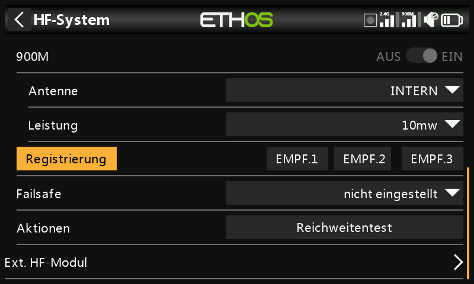

1. Wenn Ihr Empfänger noch nicht registriert ist, starten Sie den Registrierungsprozess, indem Sie \[Registrieren\] wählen. Andernfalls fahren Sie mit dem Abschnitt „Binden“ fort.

Ein Meldungsfenster mit der Aufschrift „Warten auf den Empfänger...“ wird mit einer wiederholten Sprachmeldung „Registrieren“ angezeigt.

2. Während Sie die Bindungstaste gedrückt halten, schalten Sie den Empfänger ein und warten Sie, bis die roten und grünen LEDs aktiv werden.

Die Meldung 'Warten auf Empfänger...' ändert sich in 'Empfänger verbunden', und das Feld Rx Name wird automatisch ausgefüllt.

3. In diesem Stadium können die Registrierungs-ID und die UID eingestellt werden:

- Sender-ID: Die Sender-ID ist auf Eigentümer- oder Senderebene. Dies sollte ein eindeutiger Code für Ihren Sender sein, der mit Smart Share verwendet werden kann. Sie ist standardmäßig auf den Wert in der oben am Anfang dieses Abschnitts beschriebenen Einstellung „Sender-ID des Eigentümers“ eingestellt, kann aber hier bearbeitet werden. Wenn zwei Sender die gleiche ID haben, können Sie die Empfänger (mit der gleichen Empfängernummer für ein bestimmtes Modell) zwischen ihnen hin- und herschieben, indem Sie einfach den Bindungsprozess beim Einschalten verwenden.
- RX-Name: Wird automatisch ausgefüllt, der Name kann aber auf Wunsch geändert werden. Dies kann nützlich sein, wenn Sie mehr als einen Empfänger verwenden und sich merken müssen, welcher an welche Kanäle gebunden ist.
- Die UID wird verwendet, um zwischen mehreren gleichzeitig in einem Modell verwendeten Empfängern zu unterscheiden. Sie kann für einen einzelnen Empfänger auf dem Standardwert 0 belassen werden. Wenn mehr als ein Empfänger in demselben Modell verwendet werden soll, sollte die UID geändert werden. Bitte beachten Sie, dass diese UID nicht vom Empfänger zurück gelesen werden kann, weshalb es sinnvoll ist, den Empfänger zu kennzeichnen.

4. Drücken Sie zum Abschluss auf \[Registrieren\]. Ein Dialogfeld mit der Meldung „Registrierung OK“ wird angezeigt. Drücken Sie \[OK\], um fortzufahren.

5. Schalten Sie den Empfänger aus. Zu diesem Zeitpunkt ist der Empfänger registriert, muss aber noch an den zu verwendenden Sender gebunden werden. Er ist jetzt bereit zum Binden.

#### Phase Zwei - Bindung und Moduloptionen

#### Binden

Das Binden von Empfängern ermöglicht es, einen registrierten Empfänger an einen der Sender zu binden, mit denen er in Phase 1 registriert wurde, und er reagiert dann auf diesen Sender, bis er wieder an einen anderen Sender gebunden wird. Führen Sie unbedingt einen Reichweitentest durch, bevor Sie das Modell fliegen.

Warnung - sehr wichtig

Führen Sie den Bindevorgang nicht durch, wenn ein Elektromotor angeschlossen ist oder ein Verbrennungsmotor läuft.

1. Schalten Sie den Empfänger aus.

2. Vergewissern Sie sich, dass Sie sich im TD-MODUS befinden.

3. Empfänger 1 \[Binden\]:

Starten Sie den Bindungsprozess, indem Sie RX1 auswählen.

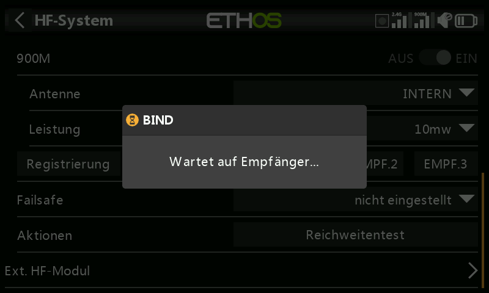

4. Ein Sprachsignal wird alle paar Sekunden „Binden“ ansagen, um zu bestätigen, dass Sie sich im Bindemodus befinden. Ein Popup-Fenster zeigt „Warten auf Empfänger...“.

5. Schalten Sie den Empfänger ein, ohne die F/S-Bindungstaste zu berühren.

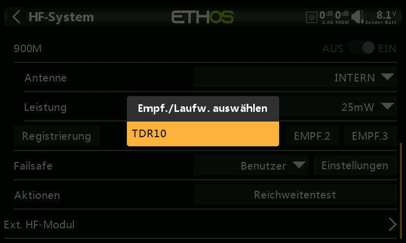

6. Es erscheint die Meldung „Gerät auswählen“ und der Name des Empfängers, den Sie gerade eingeschaltet haben. Blättern Sie zu dem Namen des Empfängers und wählen Sie ihn aus.

Es wird eine Meldung angezeigt, dass die Bindung erfolgreich war.

7. Schalten Sie sowohl den Sender als auch den Empfänger aus.

8. Schalten Sie erst den Sender und dann den Empfänger ein. Wenn die grüne LED am Empfänger leuchtet und die rote LED aus ist, dann ist der Empfänger mit dem Sender verbunden. Die Bindung zwischen Empfänger und Sendemodul muss nicht wiederholt werden, es sei denn, eines der beiden Module wird ausgetauscht.

Der Empfänger wird nur von dem Sender, an den er gebunden ist, gesteuert (ohne von anderen Sendern beeinflusst zu werden).

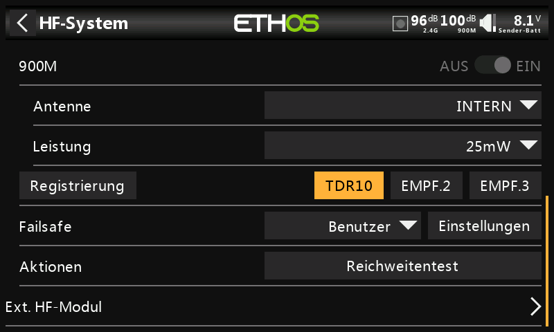

Der ausgewählte Empfänger zeigt nun den Namen anstelle von Empf.1 an.

Beachten Sie, dass sowohl das 2.4G- als auch das 900M-Band in einem Arbeitsgang gebunden werden. Der Empfänger ist nun einsatzbereit.

Wiederholen Sie den Vorgang für Empfänger 2 und 3, falls zutreffend.

Siehe auch den Abschnitt Telemetrie für eine Erläuterung zum [RSSI](#Lesezeichen 31).

#### Empfänger Optionen

Tippen Sie auf einen gebundenen Empfänger, um die Empfängeroptionen aufzurufen:

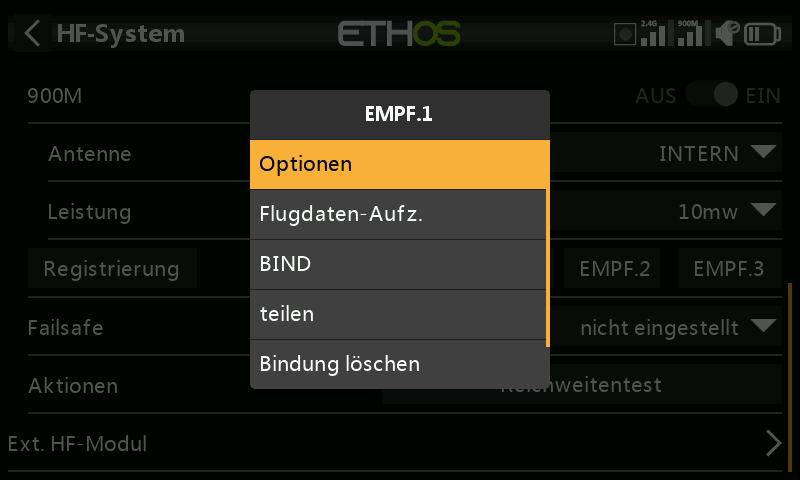

Tippen Sie auf Optionen:

*Telemetrie:* Die Telemetrie kann für diesen Empfänger deaktiviert werden.

*Reduzierte Telemetrie-Leistung 25mW:* Kontrollkästchen zur Begrenzung der Telemetrie-Leistung auf 25mW (normalerweise 100mW), möglicherweise erforderlich, wenn z. B. Servos durch HF in ihrer Nähe gestört werden.

*HS-PWM Rate:* Aktivieren Sie das Kontrollkästchen, um eine PWM-Aktualisierungsrate von 7 ms (gegenüber 20 ms Standard) zu aktivieren. Stellen Sie sicher, dass Ihre Servos diese Aktualisierungsrate verarbeiten können.

*SBUS:* Ermöglicht die Auswahl des SBUS-16-Kanal- oder SBUS-24-Kanal-Modus. Beachten Sie, dass alle angeschlossenen SBUS-Geräte den SBUS-24-Modus unterstützen müssen, um das neue Protokoll zu aktivieren. SBUS-24 ist eine FrSky-Entwicklung des SBUS-16 Futaba-Protokolls.

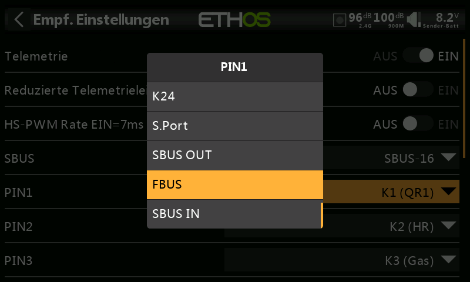

*Pin1 auf Pin(**xx**):* Das Dialogfeld Empfängeroptionen bietet auch die Möglichkeit, Kanäle den Empfängerpins neu zuzuordnen. Darüber hinaus kann jeder Ausgangsanschluss den Protokollen Smart Port, SBUS Out oder FBUS (früher bekannt als F.Port2) neu zugewiesen werden. Außerdem kann der Ausgangsanschluss 1 als SBUS-Eingang neu zugewiesen werden.

Das F.Port-Protokoll wurde zusammen mit dem Betaflight-Team entwickelt, um die separaten SBUS- und S.Port-Signale zu integrieren. FBUS (F.Port2) ermöglicht auch die Kommunikation zwischen einem Host-Gerät und mehreren Slave-Geräten auf derselben Leitung. Weitere Informationen über das Port-Protokoll finden Sie in der Protokollerklärung auf der offiziellen FrSky-Website.

##### Flugdatenaufzeichnung (Blackbox des Empfängers)

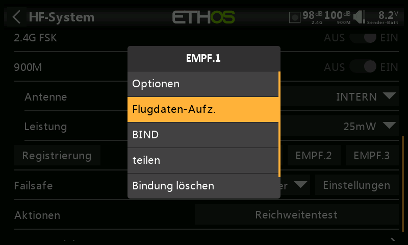

Liefert ein Protokoll über den Zustand des Empfängers.

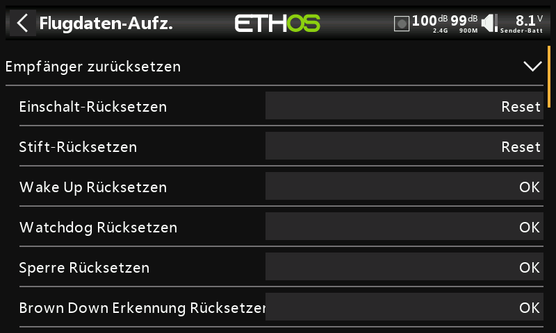

Einschalt-Rücksetzen, Stift-Rücksetzen und die Ergebnisse von aufwachen, Überwachungszeitgeber, Blockiererkennung und Erkennung von Spannungsaus-fällen.

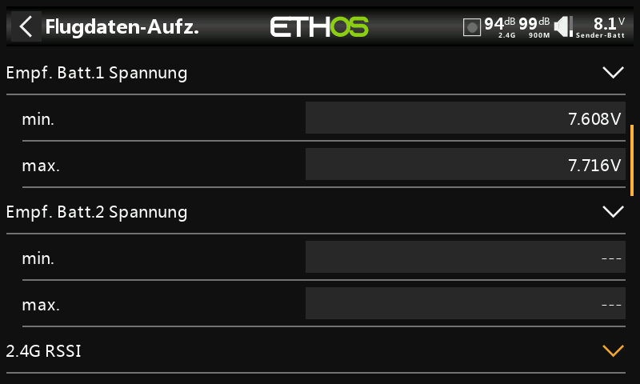

Minimal- und Maximalwerte der Spannungen von Empfänger 1 und 2 (falls vorhanden) seit dem Einschalten.

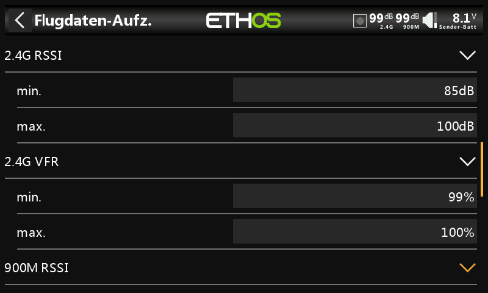

Minimal- und Maximalwerte der 2.4G RSSI und VFR (Valid Frame Rate) Pegel seit dem Einschalten.

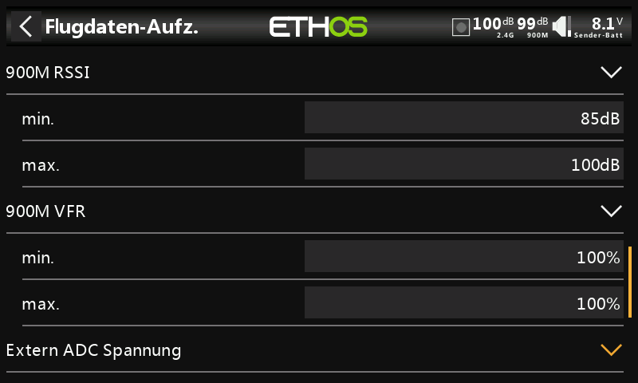

Minimal- und Maximalwerte von 900M RSSI und VFR (Valid Frame Rate) seit dem Einschalten.

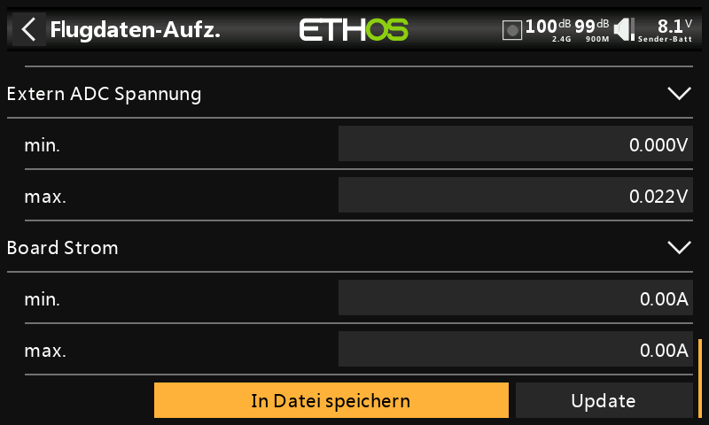

Minimal- und Maximalwerte des analogen Eingangsports AIN und der Strom auf der Empfängerplatine seit dem Einschalten.

##### In Datei speichern

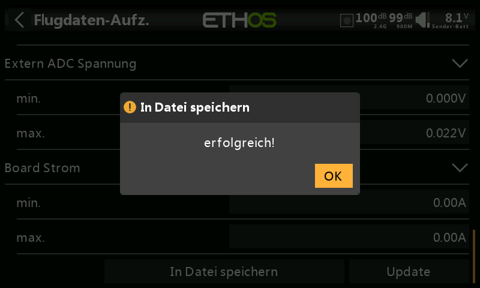

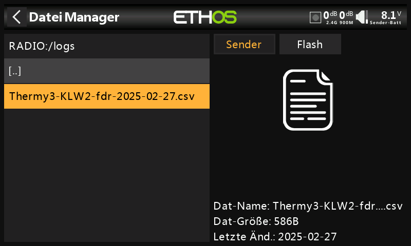

Tippen Sie auf „In Datei speichern“, um die Daten in einer .csv-Datei im Ordner „Logs“ zu speichern. Die Datei kann mit einem Texteditor, z. B. mit LibreOffice oder Notepad++, gelesen werden.

##### Update

Tippen Sie auf die Schaltfläche Update, um die Daten des Flugdatensatzes zu aktualisieren.

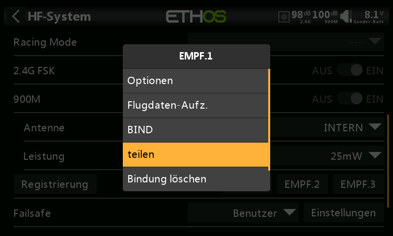

Die ‚teilen’-Funktion bietet die Möglichkeit, den Empfänger auf einen anderen Tandem-Sender mit einer anderen „Sender-ID“ zu übertragen. Wenn die ‚teilen’-Funktion angetippt wird, schaltet sich die grüne LED des Empfängers aus.

Navigieren Sie am Zielradio B zum Abschnitt HF System und Empfänger(n) und wählen Sie Bind. Beachten Sie, dass der teilen’-Prozess den Registrierungsschritt auf Sender B überspringt, da die 'Sender-ID' vom Sender A übertragen wird. Der Empfängername vom Quell-Sender wird angezeigt. Wählen Sie den Namen aus, der Empfänger wird gebunden und seine LED leuchtet grün.

Eine Meldung „Bindung erfolgreich“ wird angezeigt.

Tippen Sie auf OK. Sender B steuert nun den Empfänger. Der Empfänger bleibt an diesen Sender gebunden, bis Sie es ändern.

Drücken Sie die Taste EXIT auf Radio A, um den Teile-Prozess zu beenden.

Sie können den Empfänger wieder an Sender A binden, indem Sie ihn erneut an diesen binden.

Hinweis: Sie brauchen „teilen“ nicht zu verwenden, wenn alle Ihre Sender die gleiche „Sender ID“ Nummer verwenden. Sie können einfach den gewünschten Sender in den Bindungsmodus versetzen, den Empfänger einschalten, den Empfänger im Funkgerät auswählen und es wird sich mit diesem Sender verbinden. Auf die gleiche Weise können Sie zu einem anderen Sender wechseln. Es ist am besten, wenn Sie beim Kopieren der Modelle die Nummern der Empfänger beibehalten.

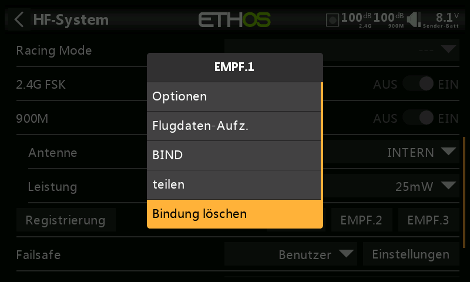

Wenn Sie Ihre Meinung über die gemeinsame Nutzung eines Modells ändern, wählen Sie „Bindung löschen“, um Ihre Bindung zu bereinigen und wiederherzustellen. Schalten Sie den Empfänger ein und er wird an Ihren Sender gebunden.

##### Werkseinstellungen

Tippen Sie auf die Schaltfläche Werkseinstellungen, um den Empfänger auf die Werkseinstellungen zurückzusetzen und die UID zu löschen. Der Empfänger wird beim Sender abgemeldet.

#### Empfängeroptionen (bei ausgeschaltetem Rx)

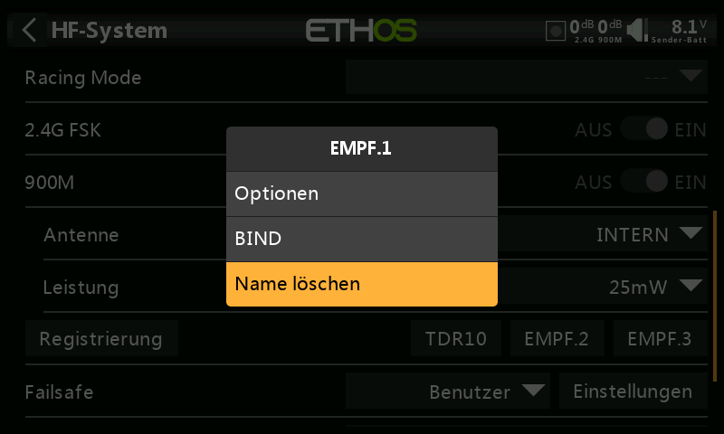

Tippen Sie bei ausgeschaltetem Empfänger auf die Taste RX1, 2 oder 3, um die Empfängeroptionen aufzurufen.

Wenn Sie auf Optionen tippen, versucht das Funkgerät eine Verbindung herzustellen und wartet auf den Empfänger.

Wenn Sie auf Binden tippen, können Sie zum Beispiel ein Modell, das an einen anderen Sender gebunden war, neu binden.

Wenn Sie auf Name löschen tippen, wird ein Bindungsreset ausgeführt.

### Failsafe

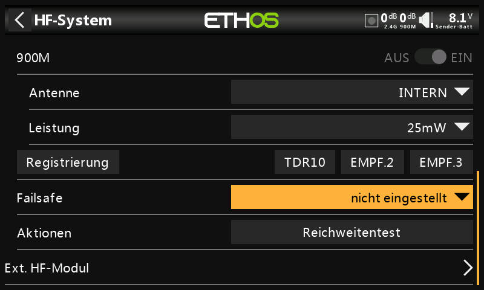

Der Failsafe-Modus bestimmt, was am Empfänger passiert, wenn das Sendersignal verloren geht.

Die Failsafe-Daten werden etwa alle 10 Sekunden vom Sender gesendet. Bitte beachten Sie, dass bei TD-, TW-, AP- und AP Plus-Empfängern die Failsafe-Daten jetzt im Empfänger gespeichert werden, was bedeutet, dass die Failsafe-Einstellungen sofort verfügbar sind, wenn der Empfänger aus irgendeinem Grund neu gestartet wird. Beachten Sie, dass die Failsafe-Funktion nach einem Upgrade von Empfängern mit dieser Funktion zurückgesetzt und überprüft werden muss.

Tippen Sie auf das Dropdown-Feld, um die Failsafe-Optionen anzuzeigen:

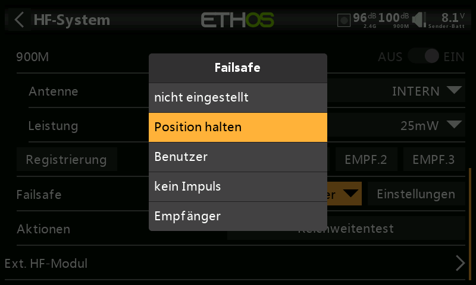

#### Position halten

Mit Halten werden die zuletzt empfangenen Positionen beibehalten.

#### Benutzer

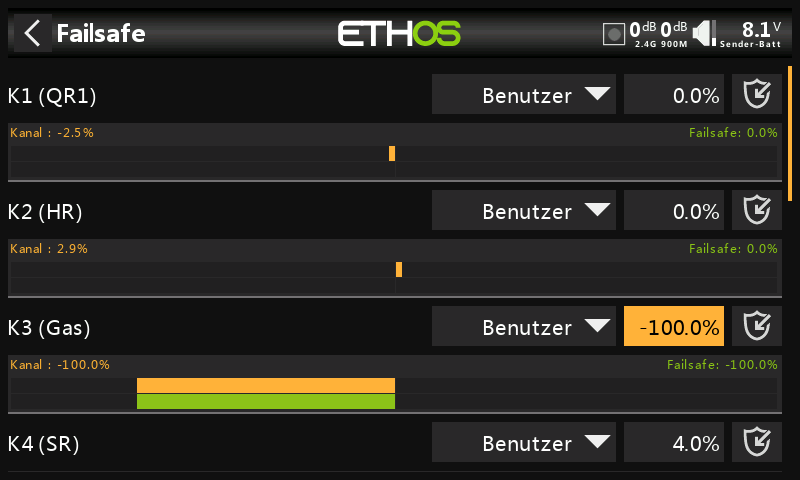

Benutzerdefiniert ermöglicht die Bewegung der Servos in benutzerdefinierte vordefinierte Positionen. Die Position kann für jeden Kanal separat definiert werden. Für jeden Kanal gibt es die Optionen nicht eingestellt, Position Halten, Benutzer oder kein Impuls. Wenn Benutzerdefiniert ausgewählt ist, wird der Kanalwert angezeigt. Wenn das Symbol mit dem Pfeil angetippt wird, wird der aktuelle Wert des Kanals verwendet. Alternativ kann ein fester Wert für diesen Kanal eingegeben werden, indem Sie auf den Wert tippen.

#### kein Impuls

Kein Impuls schaltet die Impulse aus (zur Verwendung mit Flugcontrollern, die bei Signalverlust zum Heimat-GPS zurückkehren).

#### Empfänger

Wenn Sie bei Empfängern der Serie X oder höher „Empfänger“ wählen, können Sie die Failsafe-Funktion im Empfänger einstellen.

*Warnung:* Achten Sie darauf, die gewählten Failsafe-Einstellungen sorgfältig zu testen – insbesondere die Kanäle, die bei stabilisierten Empfängern den Kreisel steuern.

### Reichweitentest

Eine Reichweitenkontrolle sollte auf dem Flugplatz durchgeführt werden, wenn das Modell flugbereit ist.

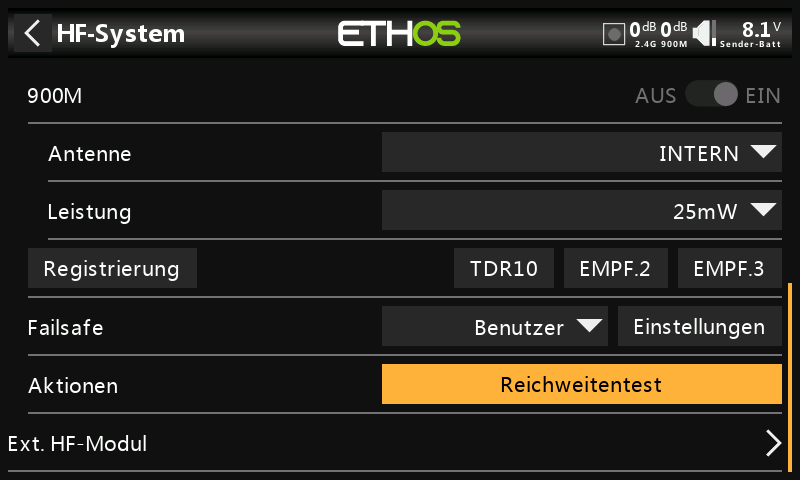

Die Reichweitenprüfung wird durch Auswahl von „Reichweitentest“ aktiviert.

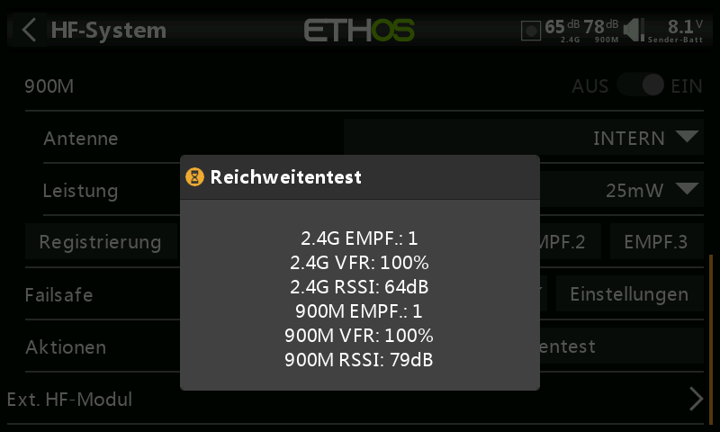

Alle paar Sekunden ertönt die Sprachansage „Reichweitentest“, um zu bestätigen, dass Sie sich in diesem Modus befinden. Ein Popup-Fenster zeigt die Empfängernummer sowie die VFR %- und RSSI-Werte an, um das Verhalten der Empfangsqualität zu bewerten. Wenn die Reichweitenprüfung aktiv ist, wird die Sendeleistung reduziert, was wiederum die Reichweite für die Reichweitentests verringert.

Der FrSky Range Check Level ist 0,1mW ( -10dB) und nicht 1mW ( 0dB)  
Der Normalpegel beträgt +18dB +2dB für die Antennen = +20dB.

Unter idealen Bedingungen, wenn sich sowohl der Sender als auch der Empfänger 1 m über dem Boden befinden, sollten Sie erst in einem Abstand von etwa 30 m einen kritischen Alarm erhalten.

Derzeit liefert TD MODE im Reichweitentestmodus Reichweitentestdaten für jeweils einen Empfänger auf der 2,4G-Verbindung und einen Empfänger auf der 900M-Verbindung. Wenn Sie drei 2,4G-Empfänger registriert und als Empfänger 1, 2 und 3 gebunden haben, ist einer der Empfänger der aktive Telemetrieempfänger und seine Nummer wird vom RX-Sensor als 0, 1 oder 2 angezeigt. Dies ist der Empfänger, der die RSSI- und VFR-Daten sendet. Wenn Sie diesen Empfänger ausschalten, wird der nächste Empfänger zum aktiven Telemetrieempfänger in der Priorität 0, 1 und dann 2. Jeder der drei Empfänger kann auf seine Reichweite überprüft werden, indem die anderen Empfänger ausgeschaltet werden.

RX Index 0 = Empfänger 1

RX Index 1 = Empfänger 2

RX Index 2 = Empfänger 3

Bitte lesen Sie auch den Abschnitt Telemetrie zu den Erläuterungen für [VFR- und RSSI](#Lesezeichen 31)-Werte.

## Internes Modul TD-ISRM Pro (X20 Pro/R/RS)

Informationen zum TD ISRM HF-Modul finden Sie im Abschnitt [Internes Modul TD-ISRM](rf-system.md).

### Übersicht

Das TD-ISRM Pro HF -Board bietet dreifache HF-Pfad-Redundanz unter Verwendung von 2.4G FSK, 2.4G LoRa und 900M (LoRa), was einen neuen Weg in der HF-Leistung darstellt.

#### FSK

FSK ist eine Art der FM (Frequenzmodulation), bei der das Modulationssignal diskrete Werte annimmt und die Ausgangsfrequenz auf eine Reihe vorgegebener diskreter Frequenzwerte verschiebt. Besteht die Information nur aus zwei Werten (binär), werden sie manchmal als Markierungs- und Leerzeichenfrequenzen bezeichnet.

#### LoRa

LoRa ist eine drahtlose Modulationstechnik, die von der Chirp Spread Spectrum (CSS) Technologie abgeleitet ist. Es kodiert Informationen auf Funkwellen mit Chirp-Impulsen - ähnlich der Art und Weise, wie Delphine und Fledermäuse kommunizieren! Die modulierte LoRa-Übertragung ist robust gegenüber Störungen und kann über große Entfernungen empfangen werden.

Auf der ISRM-Platine befinden sich drei separate abgeschirmte HF-Bereiche:

- Das TWIN-HF-Teil ist 2,4G FSK- und 2,4G LoRa-fähig. 
- Der 2,4G ACCESS-Funkbereich unterstützt ACCESS und ACCST D16 und wird auch für Tandem verwendet. 
- Der 900M ACCESS HF-Abschnitt wird ebenfalls für Tandem verwendet und bietet außerdem Redundanz mit anderen Empfängern.

Mit drei HF-Sektionen können viele verschiedene Modi und Konfigurationen gewählt werden.

**Achtung!** In diesem Handbuch und in den Sendermenüs ist „900M“ ein allgemeiner Begriff, der das verwendete VHF-Band bezeichnet. Die tatsächlichen Betriebsfrequenzen sind 915Mhz für FCC oder 868Mhz für LBT, je nachdem, in welchem Land der Benutzer arbeitet.

#### TD-ISRM Pro Modus

##### ACCESS/ACCST D16

Im ACCESS-Modus arbeiten die 2,4G- und 900M-HF-Pfade mit einem Satz von ACCESS-Steuerungen zusammen. Es können drei 2,4G-Empfänger oder drei 900M-Empfänger oder eine Kombination aus 2,4G und 900M für insgesamt drei Empfänger registriert und gebunden sein.

Im ACCESS-Modus mit einer Kombination aus 2,4G- und 900M-Empfängern ist die Telemetrie für die 2,4G- und 900M-HF-Verbindungen gleichzeitig aktiv. Die Sensoren werden in der Telemetrie als 2.4G oder 900M identifiziert. Bitte beachten Sie, dass das 2.4G-Band 24 Kanäle unterstützt, während das 900M-Band 16 Kanäle unterstützt.

Die ACCST-Option bietet ACCST D16 mit einer 900M-Empfängeroption für Redundanz.

Siehe den Abschnitt ACCESS/ACCST D16 unten.

##### TD Tandem-Dual-Band 2.4G/900M

Im TD-Modus befindet sich das HF-Modul in einem Modus mit geringer Latenz und großer Reichweite, wobei die 2,4G- und 900M-HF-Verbindungen im Tandem mit bis zu drei Tandem-Empfängern genutzt werden. Tandem unterstützt 24 Kanäle auf beiden Bändern.

Dieser Modus ähnelt dem TD-Modus des X20. Einzelheiten zur Einrichtung finden Sie im Abschnitt über den [TD-Modus](rf-system.md).

##### TW 2.4G TWIN/900M.

Im TW-Modus gibt es eine 2,4G-FSK- und eine 2,4G-LoRa-HF-Verbindung zur Verwendung mit bis zu drei TWIN-Empfängern. Es gibt eine 900M-Empfängeroption für Redundanz über die SBUS IN/OUT-Ports. Dadurch wird die Zuverlässigkeit des HF-Signals weiter erhöht, insbesondere in Szenarien, die RC-Operationen über große Entfernungen beinhalten.

Siehe den Abschnitt [TW-Modus](rf-system.md) weiter unten.

##### TD-Pro

Zur Verwendung mit zukünftigen FrSky TD-Pro Empfängern.

Es gibt eine ETHOS-Telemetrieempfänger-Quellenfunktion namens RX. RX liefert die Empfängernummer des aktiven Empfängers, der Telemetrie sendet. RX ist in der Telemetrie wie jeder andere Sensor für die Echtzeitanzeige und in den Logikschaltern, Sonderfunktionen und der Datenprotokollierung verfügbar.

Einzelheiten zur Konfiguration finden Sie in den folgenden Abschnitten.

### ACCESS/ACCST D16

Im ACCESS/ACCST D16-Modus können die 2,4G- und 900M-HF-Pfade mit einem Satz von Bedienelementen zusammenarbeiten.

#### ACCESS 2.4G mit einer 900M-Empfangsoption für Redundanz

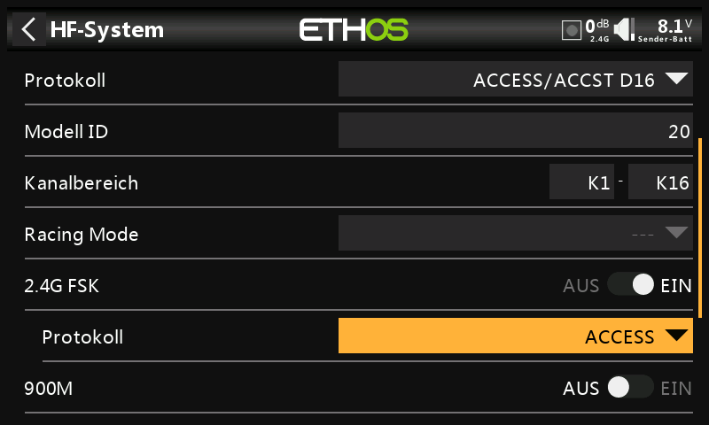

Dieser Modus ist vergleichbar mit dem ACCESS-Modus in X20. Es können insgesamt bis zu drei ACCESS- oder 900M-Empfänger gebunden werden. Bitte lesen Sie den Abschnitt [X20 ACCESS](rf-system.md) zur Einrichtung Details.

#### ACCST D16 mit einer 900M-Empfängeroption für Redundanz

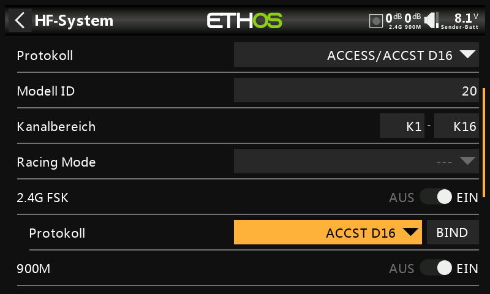

Dieser Modus wird nur von der X20 Pro unterstützt. Ein ACCST D16-Empfänger kann in Verbindung mit einem redundanten 900M-Empfänger verwendet werden.

##### Model ID

Wenn Sie ein neues Modell erstellen, wird die Modell-ID automatisch zugewiesen. Die Modell-ID muss eine eindeutige Nummer sein, da die Funktion Model Match sicherstellt, dass nur an die richtige Modell-ID gebunden wird. Diese Nummer wird beim Binden an den Empfänger gesendet, so dass dieser nur auf die Nummer antwortet, an die er gebunden wurde. Die Model-ID kann manuell geändert werden.

##### Kanalbereich

Sie können wählen, welche der internen Kanäle des Senders tatsächlich übertragen werden. Im D16-Modus können Sie zwischen 8 Kanälen mit Datenübertragung alle 9 ms und 16 Kanälen mit Datenübertragung alle 18 ms wählen.

Bitte beachten Sie, dass die Servo-Aktualisierungsraten vollständig durch den Empfänger bestimmt werden. Für ACCST lesen Sie bitte in Ihrem Empfängerhandbuch nach, wie Sie den 9ms HS (High PWM-Speed) Modus auswählen. Stellen Sie sicher, dass Ihre Servos diese Aktualisierungsrate verarbeiten können.

##### Racing Mode

Der Racingmodus wird für ACCST nicht unterstützt.

##### 2.4G FSK

Aktivieren oder deaktivieren Sie das 2.4G RF-Modul.

##### Protokoll

Wählen Sie ACCST D16.

##### Bind

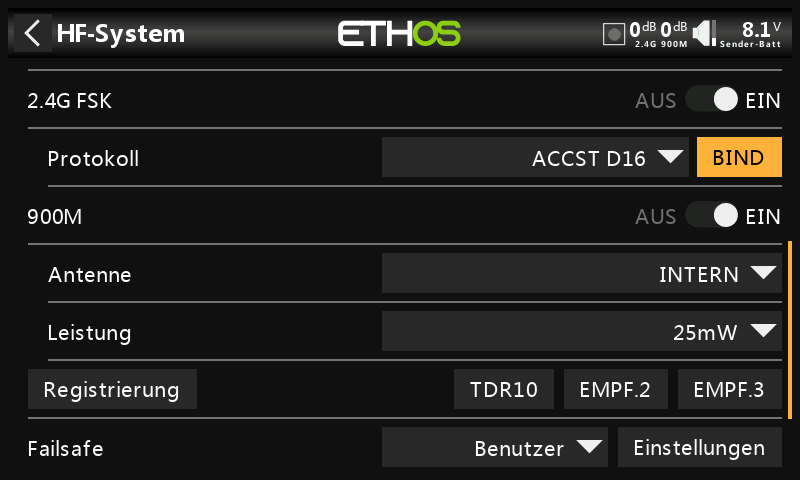

Bitte beachten Sie, dass das Modul 900M eingeschaltet ist.

1. Starten Sie den Bindungsvorgang, indem Sie \[Binden\] wählen. Ein Sprachsignal wird alle paar Sekunden „Binden“ ansagen, um zu bestätigen, dass Sie sich im Bindungsmodus befinden.

Im D16-Modus öffnet sich während des Bindevorgangs ein Popup-Menü, das die Auswahl des Betriebsmodus des Empfängers ermöglicht. Es gibt 4 Modi mit den Kombinationen von Telemetrie ein/aus und Kanal 1-8 oder 9-16. Dies ist nützlich, wenn Sie zwei Empfänger zur Redundanz verwenden oder mehr als 8 Servos mit zwei Empfängern anschließen möchten.

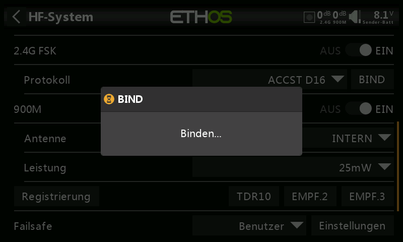

2. Schalten Sie den Empfänger ein und versetzen Sie ihn in den Bindemodus gemäß den Anweisungen des Empfängers. (In der Regel halten Sie dazu die F/S-Taste am Empfänger während des Einschaltens gedrückt).

3. Die rote und die grüne LED leuchten auf. Die grüne LED erlischt, und die rote LED blinkt, wenn der Bindevorgang abgeschlossen ist.

4. Tippen Sie auf OK am Sender, um den Bindevorgang zu beenden und den Empfänger einzuschalten.

5. Wenn die grüne LED am Empfänger dauerhaft leuchtet und die rote LED nicht leuchtet, ist der Empfänger mit dem Sender verbunden. Die Bindung zwischen Empfänger und Sendermodul muss nicht wiederholt werden, es sei denn, eines der beiden Module wird ausgetauscht. Der Empfänger wird nur von dem Sender, an den er gebunden ist, gesteuert (ohne von anderen Sendern beeinflusst zu werden).

Warnungen - sehr wichtig

Führen Sie den Bindevorgang nicht durch, wenn ein Elektromotor angeschlossen ist oder ein Verbrennungsmotor läuft.

##### Antenne

Interne oder externe Antenne (am Anschluss ANT2) auswählen. Obwohl die HF-Stufe über einen eingebauten Schutz verfügt, ist es ratsam, sich zu vergewissern, dass eine externe Antenne angebracht wurde, bevor Sie die externe Antenne auswählen. Bitte beachten Sie, dass die Antennenauswahl modellabhängig ist, d.h. bei jedem Modellwechsel stellt ETHOS den Antennenmodus für das jeweilige Modell ein.

##### Leistung

Wählen Sie die gewünschte HF-Leistung zwischen 25 und 100 mW.

##### Hinzufügen eines redundanten 900M-Empfängers.

Die FrSky-Redundanz für die Steuerung wird immer pro Frame (Datenpaket) ausgewertet, wobei der beste Frame gewählt wird. Bei 2 guten Frames wählt der Empfänger jedoch den internen guten Frame. Daher kann die Steuerung bei jedem Frame nach Bedarf umschalten (aktive/aktive Ausfallsicherung).

##### 900M

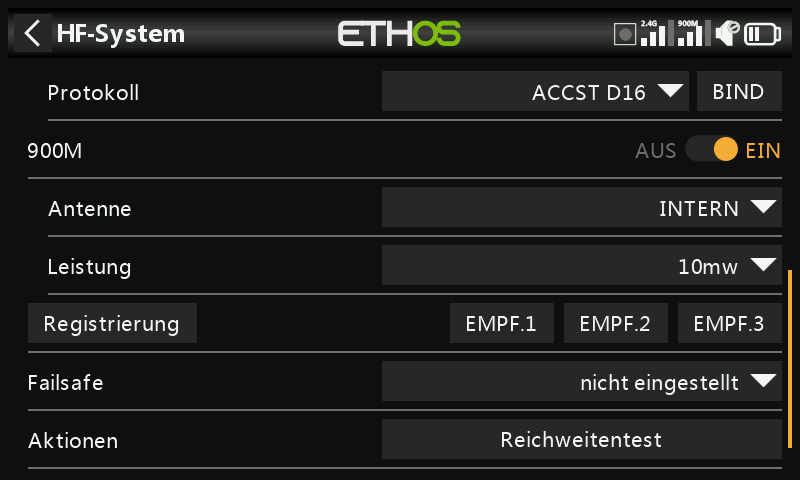

Verbinden Sie den SBUS Out-Anschluss des redundanten Empfängers mit dem SBUS IN-Anschluss des Hauptempfängers.

Stellen Sie sicher, dass das 900M HF-Modul aktiviert ist.

##### Leistung

FCC: Wählen Sie die gewünschte HF-Leistung zwischen 10, 25, 100, 200, 500mW, 10mW~1W (selbstanpassend).

LBT: Wählen Sie die gewünschte HF-Leistung zwischen 25mW (Telemetrie über 868MHz), 200mW oder 500mW (Telemetrie über 2,4GHz).

##### Registrierung

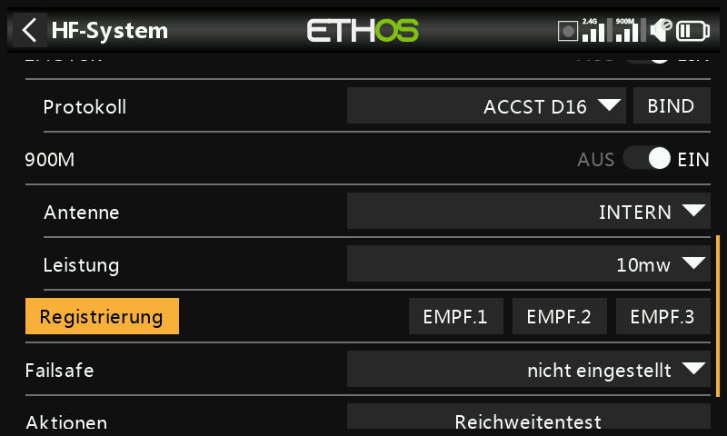

Wenn Ihr Empfänger noch nicht registriert wurde, starten Sie den Registrierungsprozess, indem Sie \[Registrieren\] wählen. Die Schritte sind die gleichen wie die im Abschnitt [ACCESS ](rf-system.md)beschriebenen.

Schalten Sie die Empfangsgeräte aus.

##### Binden

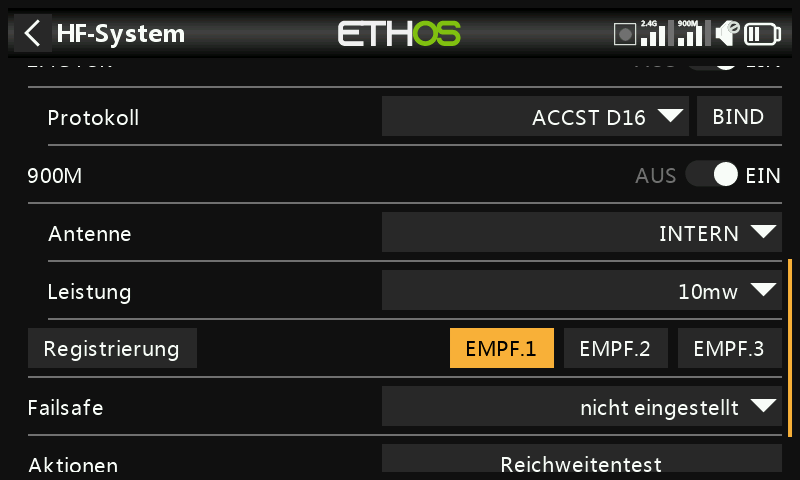

Tippen Sie auf „Binden“, um den 900M-Empfänger zu binden.

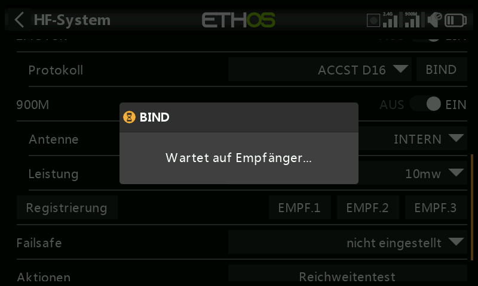

Alle paar Sekunden ertönt die Sprachansage „Binden“, um zu bestätigen, dass Sie sich im Bindemodus befinden. Ein Popup-Fenster zeigt „Warten auf Empfänger...“.

Schalten Sie die Empfänger ein.

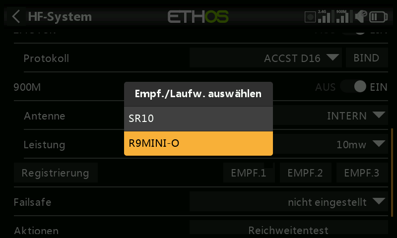

Wählen Sie den redundanten Empfänger R9MINI-O.

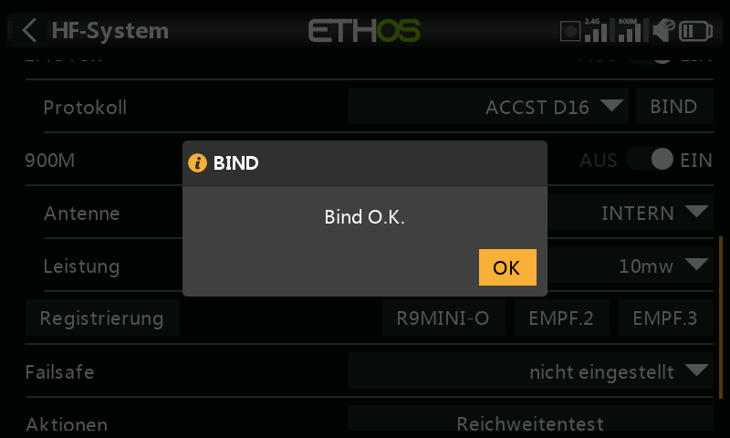

Tippen Sie auf OK. Stellen Sie sicher, dass die grüne LED am redundanten Empfänger leuchtet. Der redundante Empfänger ist nun gebunden.

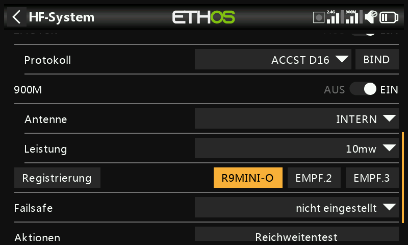

Der redundante Empfänger wird nun aufgelistet.

##### Empfänger Optionen

Die Empfängeroptionen ähneln denen, die im Abschnitt ACCESS behandelt wurden.

##### Werkseinstellung

Tippen Sie auf die Schaltfläche Werkseinstellung, um den Empfänger auf die Werkseinstellungen zurückzusetzen und die UID zu löschen. Der Empfänger ist nun nicht mehr registriert.

#### Failsafe

Die Failsafe-Optionen sind ähnlich wie die im Abschnitt ACCESS behandelten.

#### Reichweitentest

Die Optionen für die Bereichsprüfung ähneln denen, die im Abschnitt ACCESS behandelt wurden.

#### Nur ACCST D16

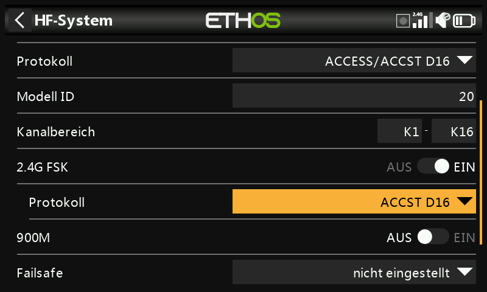

Wenn die Option 900M ausgeschaltet ist, ist nur der Modus ACCST D16 aktiv.

##### Model ID

Wenn Sie ein neues Modell erstellen, wird die Modell-ID automatisch zugewiesen. Die Modell-ID muss eine eindeutige Nummer sein, da die Funktion Model Match sicherstellt, dass nur an die richtige Modell-ID gebunden wird. Diese Nummer wird beim Binden an den Empfänger gesendet, so dass dieser nur auf die Nummer antwortet, an die er gebunden wurde. Die Model-ID kann manuell geändert werden.

##### Kanalbereich

Sie können wählen, welche der internen Kanäle des Senders tatsächlich übertragen werden. Im D16-Modus können Sie zwischen 8 Kanälen mit Datenübertragung alle 9 ms und 16 Kanälen mit Datenübertragung alle 18 ms wählen.

Bitte beachten Sie, dass die Servo-Aktualisierungsraten vollständig durch den Empfänger bestimmt werden. Für ACCST lesen Sie bitte im Handbuch Ihres Empfängers nach, wie Sie den 9ms HS (High PWM Speed) Modus auswählen. Stellen Sie sicher, dass Ihre Servos diese Aktualisierungsrate verarbeiten können.

##### Racing Mode

Der Racingmodus wird für ACCST nicht unterstützt.

##### 2.4G FSK

Aktivieren Sie das 2.4G HF-Modul.

##### Protokoll

Wählen Sie ACCST D16.

##### Antenne

Interne oder externe Antenne (am Anschluss ANT2) auswählen. Obwohl die HF-Stufe über einen eingebauten Schutz verfügt, ist es ratsam, sich zu vergewissern, dass eine externe Antenne angebracht wurde, bevor Sie die externe Antenne auswählen. Bitte beachten Sie, dass die Antennenauswahl modellabhängig ist, d.h. bei jedem Modellwechsel stellt ETHOS den Antennenmodus für das jeweilige Modell ein.

##### 900M

Das interne HF-Modul des 900M ist ausgeschaltet.

##### Failsafe

Die Failsafe-Optionen sind ähnlich wie die im Abschnitt ACCESS behandelten.

##### Aktionen

##### Binden

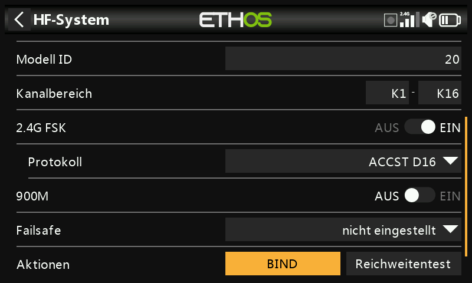

1. Starten Sie den Bindungsvorgang, indem Sie \[Binden\] wählen. Ein Sprachsignal wird alle paar Sekunden „Binden“ ansagen, um zu bestätigen, dass Sie sich im Bindungsmodus befinden.

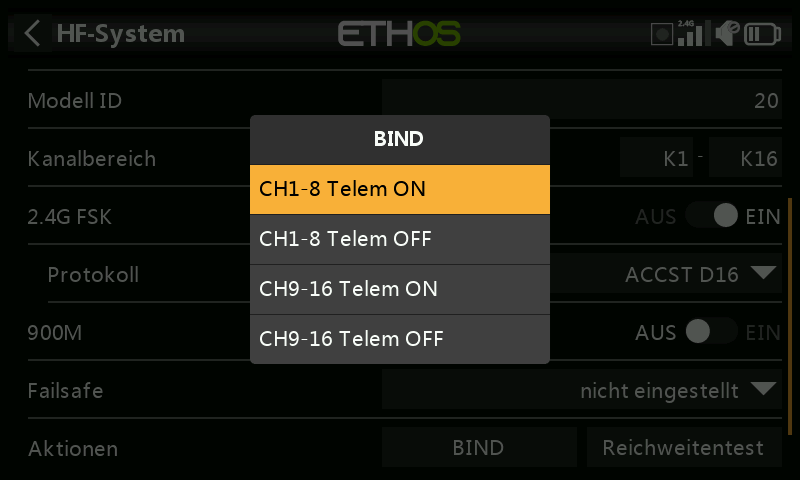

Im D16-Modus öffnet sich während des Bindevorgangs ein Popup-Menü, das die Auswahl des Betriebsmodus des Empfängers ermöglicht. Es gibt 4 Modi mit den Kombinationen von Telemetrie ein/aus und Kanal 1-8 oder 9-16. Dies ist nützlich, wenn Sie zwei Empfänger zur Redundanz verwenden oder mehr als 8 Servos mit zwei Empfängern anschließen möchten.

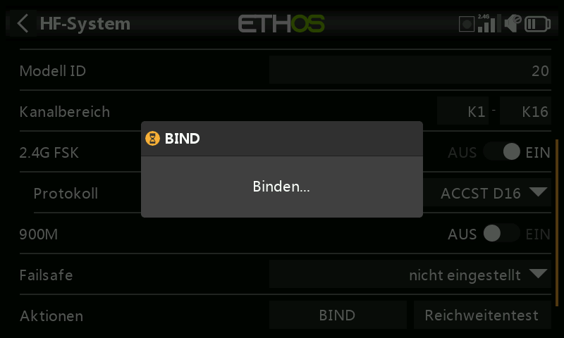

2. Schalten Sie den Empfänger ein und versetzen Sie ihn in den Bindemodus gemäß den Anweisungen des Empfängers. (In der Regel halten Sie dazu die Failsafe-Taste am Empfänger während des Einschaltens gedrückt).

3. Die rote und die grüne LED leuchten auf. Die grüne LED erlischt, und die rote LED blinkt, wenn der Bindevorgang abgeschlossen ist.

4. Tippen Sie auf OK am Sender, um den Bindevorgang zu beenden, und schalten Sie den Empfänger aus und dann wieder ein.

5. Wenn die grüne LED am Empfänger leuchtet und die rote LED nicht leuchtet, ist der Empfänger mit dem Sender verbunden. Die Bindung zwischen Empfänger und Sendermodul muss nicht wiederholt werden, es sei denn, eines der beiden Module wird ausgetauscht. Der Empfänger wird nur von dem Sender, an den er gebunden ist, gesteuert (ohne von anderen Sendern beeinflusst zu werden).

Warnungen - sehr wichtig

Führen Sie den Bindevorgang nicht durch, wenn ein Elektromotor angeschlossen ist oder ein Verbrennungsmotor läuft.

##### Reichweitentest

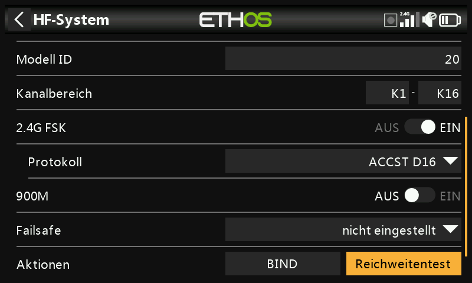

Die Reichweitentest wird durch Auswahl der Aktion „Reichweitentest“ aktiviert.

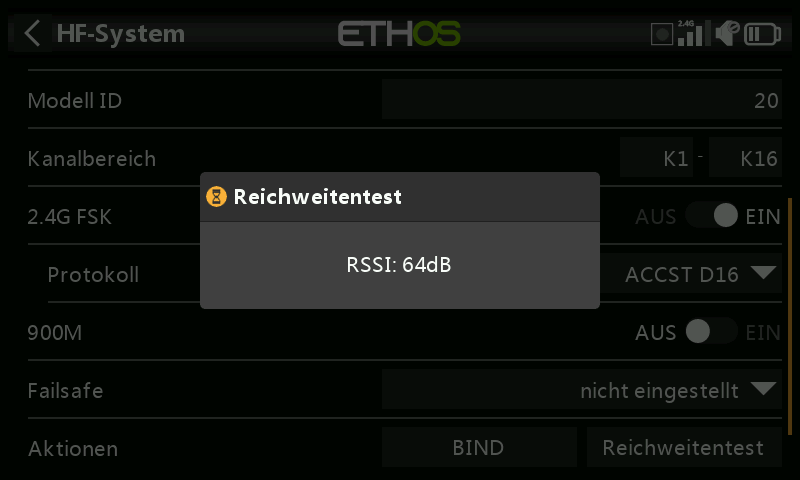

Alle paar Sekunden ertönt die Sprachansage „Reichweitentest“, um zu bestätigen, dass Sie sich im Modus „Reichweitentest“ befinden. Ein Popup-Fenster zeigt die Empfängernummer sowie die VFR%- und RSSI-Werte an, um das Verhalten der Empfangsqualität zu bewerten. Wenn die Reichweitenprüfung aktiv ist, wird die Sendeleistung reduziert, was wiederum die Reichweite für die Reichweitentests verringert. Unter idealen Bedingungen, wenn sich sowohl das Funkgerät als auch der Empfänger in 1 m Höhe über dem Boden befinden, sollten Sie erst in einem Abstand von etwa 30 m einen kritischen Alarm erhalten.

Weitere Informationen zu [VFR- und RSSI](#Lesezeichen 31)-Werten finden Sie im Abschnitt Telemetrie.

### ***TW******-***Modus

Im TW-Modus gibt es eine 2,4G-FSK- und eine 2,4G-LoRa-Funkverbindung für die Verwendung mit bis zu drei TWIN-Empfängern sowie eine 900M-Empfängeroption für Redundanz (über die SBUS IN/OUT-Anschlüsse).

Es können drei TW-Empfänger registriert und gebunden sein oder drei 900M-Empfänger registriert und gebunden sein oder eine Kombination aus TW und 900M für eine Gesamtzahl von drei Empfängern.

Im TW-Modus mit einer Kombination aus 2,4G FSK- und 2,4G LoRa- und 900M-Empfängern ist die Telemetrie für die 2,4G- und 900M-HF-Verbindungen gleichzeitig aktiv. Die Sensoren werden in der Telemetrie als 2.4G oder 900M identifiziert. Bitte beachten Sie, dass das 2,4G-Band 24 Kanäle unterstützt, während das 900M-Band 16 Kanäle unterstützt.

Einzelheiten zur Konfiguration finden Sie in den folgenden Abschnitten.

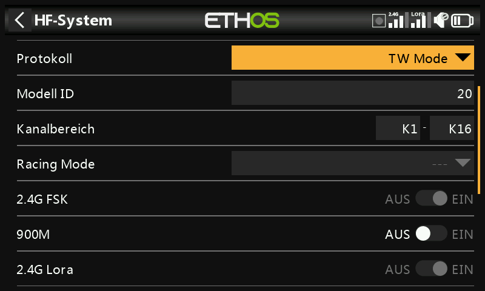

### Typ

Übertragungsmodus des internen HF-Moduls. Der Modus muss mit dem vom Empfänger unterstützten Typ übereinstimmen, sonst wird das Modell nicht gebunden! Überprüfen Sie nach einem Moduswechsel sorgfältig den Betrieb des Modells (insbesondere Failsafe!) und vergewissern Sie sich, dass alle Empfängerkanäle wie vorgesehen funktionieren.

### Type: ***TW-Mod******us***

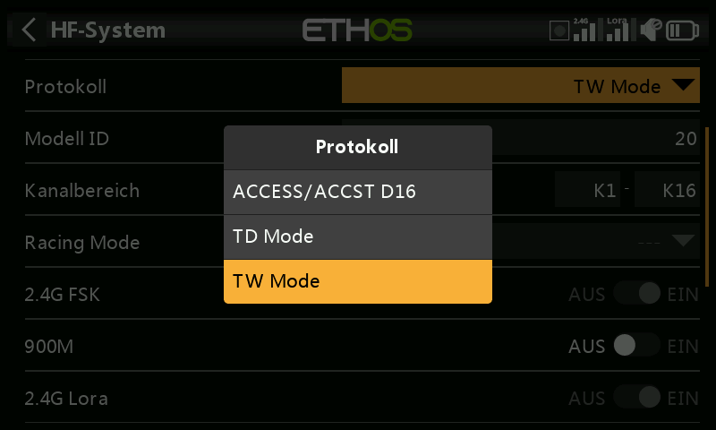

Die Art und Weise, wie Empfänger an den Sender gebunden und mit ihm verbunden werden, ist in zwei Phasen unterteilt. Die erste Phase ist die Registrierung des Empfängers bei dem Funkgerät oder den Funkgeräten, mit denen er verwendet werden soll. Die Registrierung muss für jedes Empfänger-Sender-Paar nur einmal durchgeführt werden. Nach der Registrierung kann ein Empfänger drahtlos mit jedem der Funkgeräte, mit denen er registriert ist, verbunden und wieder verbunden werden, ohne dass die Bindungstaste am Empfänger betätigt werden muss.

Nachdem der TW-Modus ausgewählt wurde, müssen die folgenden Parameter eingestellt werden:

#### Model ID

Wenn Sie ein neues Modell erstellen, wird die Modell-ID automatisch zugewiesen. Die Modell-ID muss eine eindeutige Nummer sein, da die Smart Match-Funktion sicherstellt, dass nur an die richtige Modell-ID gebunden wird. Diese Nummer wird beim Binden an den Empfänger gesendet, so dass dieser nur auf die Nummer antwortet, an die er gebunden wurde. Der Empfängerabgleich ist immer noch so wichtig wie eh und je.

Die Modell-ID kann manuell von 00 bis 63 geändert werden, wobei die Standard-ID 1 ist.

Beachten Sie auch, dass die Modell-ID geändert wird, wenn das Modell geklont wird.

#### Kanalbereich:

Da TW bis zu 24 Kanäle unterstützt, wählen Sie normalerweise Ch1-8, Ch1-16 oder Ch1-24 für die Anzahl der zu übertragende Kanäle. Beachten Sie, dass Ch1-16 die Standardeinstellung ist. Die Kanäle, die von einem Empfänger empfangen werden, werden in den Empfängeroptionen für jeden Empfänger konfiguriert.

Die Wahl des Senderkanalbereichs wirkt sich auch auf die übertragenen Aktualisierungsraten aus. Acht Kanäle werden alle 7 ms übertragen. Bei Verwendung von mehr als 8 Kanälen sind die Kanalaktualisierungsraten wie folgt:

| Kanalbereich | Update Rate | Anmerkungen |
| --- | --- | --- |
| 1-24 | 21ms | Ch1-8, dann Ch9-16, dann Ch17-24 im Wechsel gesendet |
| 1-16 | 14ms | Ch1-8, Ch9-16, abwechselnd gesendet |
| 1-8 | 7ms  | Ch1-8 |
| Racing Mode | 4ms | Nur digitale Servos |

#### Racing Mode

Der Rennmodus bietet eine sehr geringe Latenz von 4 ms mit Empfängern wie TW MX.

Wenn der Kanalbereich auf Ch1-8 eingestellt ist, ist es möglich, eine Quelle (z. B. einen Schalter) auszuwählen, die den Rennmodus aktiviert. Nachdem der Empfänger gebunden wurde (siehe unten) und der Rennmodus aktiviert wurde, muss der Empfänger erneut mit Strom versorgt werden, damit der Rennmodus wirksam wird.

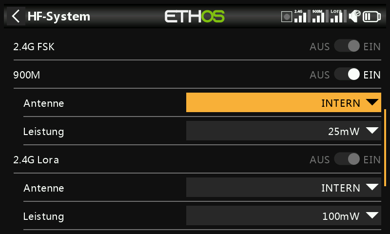

#### 2.4G FSK

Aktivieren oder deaktivieren Sie den 2.4G FSK-Teil des internen HF-Moduls.

##### Antenne

Interne oder externe Antenne (am Anschluss ANT2) auswählen. Obwohl die HF-Stufe über einen eingebauten Schutz verfügt, ist es ratsam, sich zu vergewissern, dass eine externe Antenne angebracht wurde, bevor Sie die externe Antenne auswählen. Bitte beachten Sie, dass die Antennenauswahl modellabhängig ist, d.h. bei jedem Modellwechsel stellt ETHOS den Antennenmodus für das jeweilige Modell ein.

#### 900M

Aktivieren oder deaktivieren Sie den 900M-Teil des internen HF-Moduls.

##### Antenne

Das 900M HF-Modul arbeitet nur mit der internen Antenne.

**Leistung**:

FCC: Wählen Sie die gewünschte HF-Leistung zwischen 10, 25, 100, 200, 500mW, 100mW~1W (selbstanpassend).

LBT: Wählen Sie die gewünschte HF-Leistung zwischen 25mW (Telemetrie über 868MHz), 200mW oder 500mW (Telemetrie über 2,4GHz).

#### 2.4G ***Lo******R******a***

Aktivieren oder deaktivieren Sie den 2.4G-Teil des internen HF-Moduls.

##### Antenne

Interne oder externe Antenne (am Anschluss ANT1) wählen. Obwohl die HF-Stufe über einen eingebauten Schutz verfügt, ist es ratsam, sich zu vergewissern, dass eine externe Antenne angebracht wurde, bevor Sie die externe Antenne auswählen. Bitte beachten Sie, dass die Antennenauswahl modellabhängig ist, d.h. bei jedem Modellwechsel stellt ETHOS den Antennenmodus für das jeweilige Modell ein.

##### Leistung

Wählen Sie die gewünschte HF-Leistung zwischen 25 und 100 mW.

Im TW-Modus arbeiten die 2,4G-FSK- und 2,4G-LoRa- und die 900m-HF-Pfade mit einem Satz von Steuerelementen zusammen. Es können drei TW-Empfänger registriert und gebunden sein oder drei 900M-Empfänger registriert und gebunden sein oder eine Kombination aus TW und 900M für insgesamt drei Empfänger.

#### Phase Eins: Registrierung

#### Registrierung

1. Wenn Ihr Empfänger noch nicht registriert ist, starten Sie den Registrierungsprozess, indem Sie \[Registrieren\] wählen. Andernfalls fahren Sie mit dem Abschnitt „Binden“ fort.

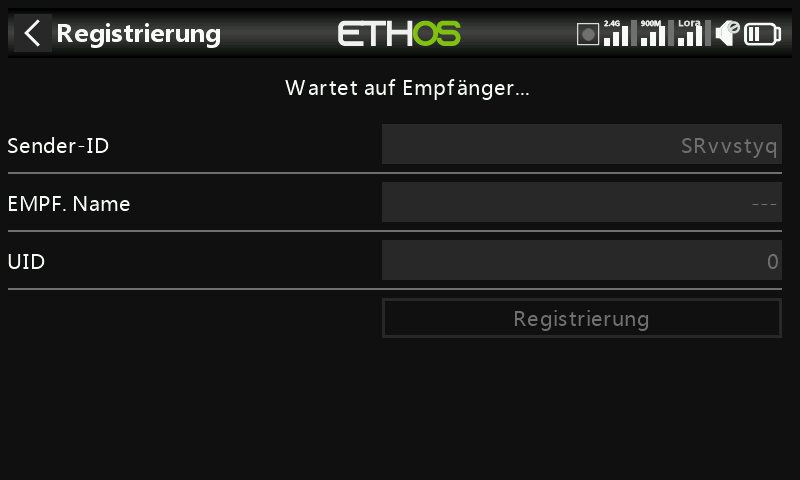

Ein Meldungsfenster mit der Aufschrift „Warten auf Empfänger...“ wird mit einer wiederholten Sprachmeldung „Registrieren“ angezeigt.

2. Während Sie die Bindungstaste gedrückt halten, schalten Sie den Empfänger ein und warten Sie, bis die roten und grünen LEDs aktiv werden.

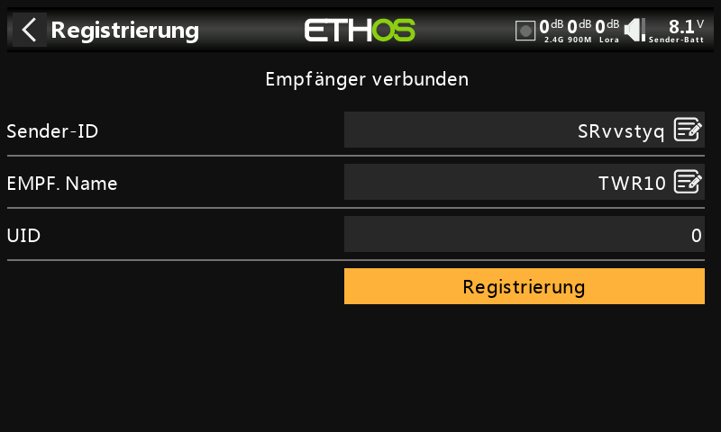

Die Meldung „Warten auf Empfänger...“ ändert sich in „Empfänger verbunden“, und das Feld Rx Name wird automatisch ausgefüllt.

3. In diesem Stadium können die Registrierungs-ID und die UID festgelegt werden:

- Sender-ID: Die Sender-ID ist auf Eigentümer- oder Senderebene. Dies sollte ein eindeutiger Code für Ihr Funkgerät und andere Sender sein, die mit Smart Share verwendet werden sollen. Sie ist standardmäßig auf den Wert in der oben am Anfang dieses Abschnitts beschriebenen Einstellung „Sender-ID des Eigentümers“ eingestellt, kann aber hier bearbeitet werden. Wenn zwei Sender die gleiche ID haben, können Sie Empfänger (mit der gleichen Empfängernummer für ein bestimmtes Modell) zwischen ihnen verschieben, indem Sie einfach den Einschaltvorgang verwenden.
- RX-Name: Wird automatisch ausgefüllt, aber der Name kann auf Wunsch geändert werden. Dies kann nützlich sein, wenn Sie mehr als einen Empfänger verwenden und sich z.B. daran erinnern müssen, dass RX4R1 für Ch1-8 oder RX4R2 für Ch9-16 oder RX4R3 für Ch17-24 ist, wenn Sie später neu binden. Hier kann ein Name für den Empfänger eingegeben werden.
- Die UID wird verwendet, um zwischen mehreren gleichzeitig in einem Modell verwendeten Empfängern zu unterscheiden. Sie kann auf dem Standardwert von 0 für einen einzelnen Empfänger belassen werden. Wenn mehr als ein Empfänger im selben Modell verwendet werden soll, sollte die UID geändert werden, normalerweise 0 für Ch1-8, 1 für Ch9-16 und 2 für Ch17-24. Bitte beachten Sie, dass diese UID nicht vom Empfänger zurück gelesen werden kann, daher ist es ratsam, den Empfänger zu beschriften.

4. Drücken Sie zum Abschluss auf \[Registrieren\]. Es erscheint ein Dialogfeld mit der Meldung „Registrierung ok“. Drücken Sie \[OK\], um fortzufahren.

5. Schalten Sie den Empfänger aus. Der Empfänger ist nun registriert, muss aber noch an den zu verwendenden Sender gebunden werden. Er ist jetzt bereit zum Binden.

#### Phase Zwei - Bindung und Moduloptionen

#### Binden

Das Binden von Empfängern ermöglicht es, einen registrierten Empfänger an einen der Sender zu binden, mit denen er in Phase 1 registriert wurde, und er reagiert dann auf diesen Sender, bis er wieder an einen anderen Sender gebunden wird. Führen Sie unbedingt einen Reichweitentest durch, bevor Sie das Modell fliegen.

Warnung - sehr wichtig

Führen Sie den Bindevorgang nicht durch, wenn ein Elektromotor angeschlossen ist oder ein Verbrennungsmotor läuft.

1. Schalten Sie den Empfänger aus.

2. Stellen Sie sicher, dass Sie sich im TW-Modus befinden.

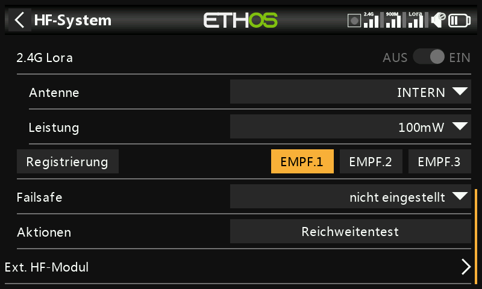

3. Empfänger 1 \[Binden\]: Starten Sie den Bindevorgang, indem Sie \[RX1\] auswählen und dann Binden aus der Dropdown-Liste wählen. Alle paar Sekunden ertönt die Sprachansage „Binden“, um zu bestätigen, dass Sie sich im Bindungsmodus befinden. In einem Popup-Fenster wird 'Warten auf Empfänger...' angezeigt.

4. Schalten Sie den Empfänger ein, ohne die F/S-Bindungstaste zu berühren. Es erscheint die Meldung „Gerät auswählen“ und der Name des Empfängers, den Sie gerade eingeschaltet haben.

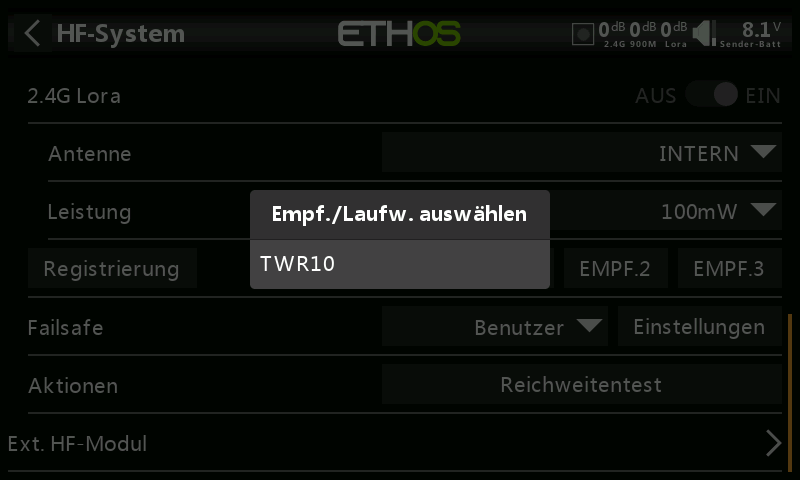

5. Blättern Sie zu dem Namen des Empfängers und wählen Sie ihn aus.

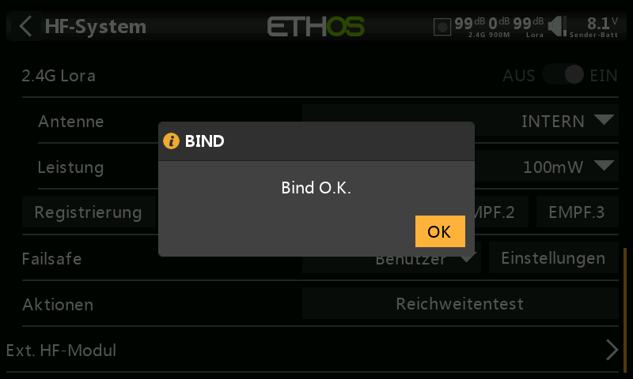

Ein Meldungsfenster zeigt an, dass das Binden erfolgreich war.

6. Schalten Sie sowohl den Sender als auch den Empfänger aus.

7. Schalten Sie erst den Sender und dann den Empfänger ein. Wenn die blaue LED am Empfänger leuchtet und die rote LED aus ist, ist der Empfänger mit dem Sender verbunden. Die Bindung zwischen Empfänger und Sendemodul muss nicht wiederholt werden, es sei denn, eines der beiden Module wird ausgetauscht.

Der Empfänger wird nur von dem Sender, an den er gebunden ist, gesteuert (ohne von anderen Sendern beeinflusst zu werden).

Der ausgewählte Empfänger zeigt nun für RX1 den Namen daneben an:

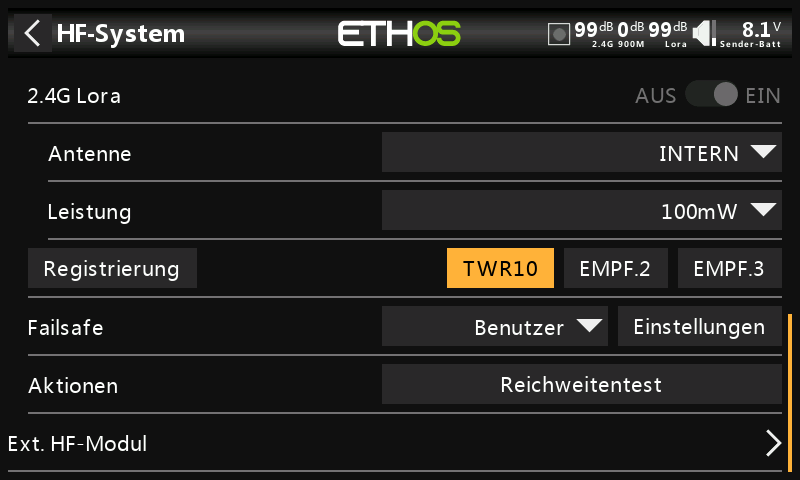

Der Empfänger ist nun einsatzbereit.

Wiederholen Sie den Vorgang für Empfänger 2 und 3, falls sie vorhanden sind.

Siehe auch den Abschnitt Telemetrie für eine Diskussion über [RSSI](#Lesezeichen 31).

#### Empfänger Optionen

Tippen Sie auf die Schaltfläche RX1, RX2 oder RX3, um die Empfängeroptionen aufzurufen:

Tippen Sie auf Optionen:

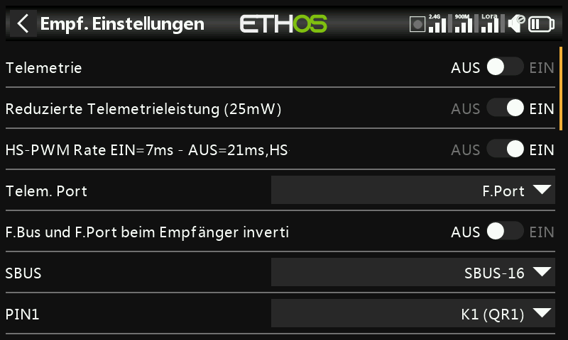

*T**elemetrie:* Die Telemetrie kann für diesen Empfänger deaktiviert werden

*Reduzierte Telemetrie-Leistung 25mW:* Kontrollkästchen zur Begrenzung der Telemetrie-Leistung auf 25mW (normalerweise 100mW), möglicherweise erforderlich, wenn z.B. Servos durch HF-Störungen in ihrer Nähe gestört werden.

*High PWM-Speed:* Die Servo-Update-Raten werden vollständig vom Empfänger bestimmt.  Dieses Kontrollkästchen aktiviert eine PWM-Aktualisierungsrate von 7ms (gegenüber 18ms Standard). Stellen Sie sicher, dass Ihre Servos diese Aktualisierungsrate verarbeiten können.

Einzelheiten zur am Sender eingestellten Aktualisierungsrate finden Sie im Abschnitt [Kanalbereich (TW)](rf-system.md).

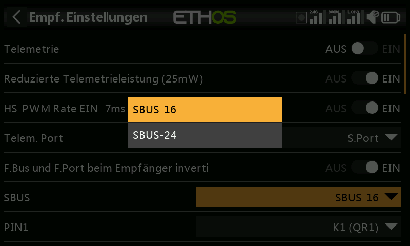

*SBUS:* Ermöglicht die Auswahl des SBUS-16-Kanal- oder SBUS-24-Kanal-Modus. Beachten Sie, dass alle angeschlossenen SBUS-Geräte den SBUS-24-Modus unterstützen müssen, um das neue Protokoll zu aktivieren. SBUS-24 ist eine FrSky-Entwicklung des SBUS-16 Futaba-Protokolls.

*Kanalzuordnung:* Der Empfänger-Optionen-Dialog bietet auch die Möglichkeit, die Funkkanäle den Empfängerpins neu zuzuordnen.

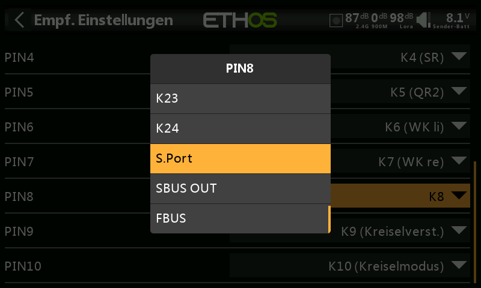

P*in1-12 Optionen:* Ermöglicht die Neuzuordnung von Senderkanälen zu den Empfängerpins. Darüber hinaus kann jeder Ausgangsanschluss den Protokollen Smart Port, SBUS Out oder FBUS (früher bekannt als F.Port2) neu zugewiesen werden.

Das F.Port-Protokoll wurde zusammen mit dem Betaflight-Team entwickelt, um die separaten SBUS- und S.Port-Signale zu integrieren. FBUS (F.Port2) ermöglicht auch die Kommunikation zwischen einem Host-Gerät und mehreren Slave-Geräten auf derselben Leitung. Weitere Informationen über das Port-Protokoll finden Sie in der Protokollerklärung auf der offiziellen FrSky-Website.

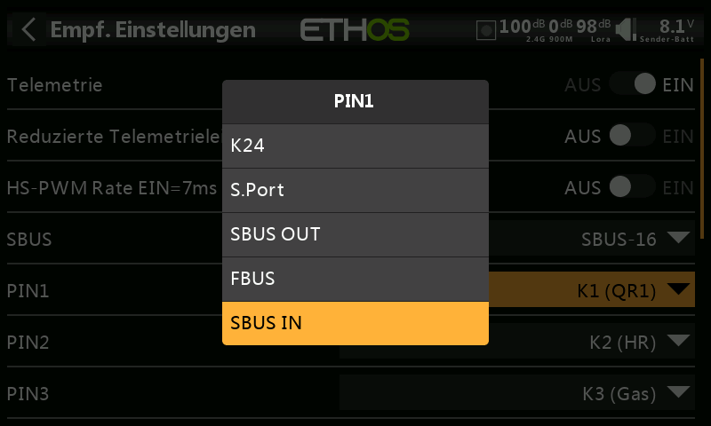

Pin 1 kann auch mit SBUS IN belegt werden. Bitte beachten Sie im obigen Beispiel, dass die Kanäle um einen Kanal nach unten verschoben wurden, um Platz für SBUS IN auf Port 1 zu schaffen (CH1 Aileron1 liegt auf Pin 2).

##### Flugdatenaufzeichnung (Blackbox des Empfängers)

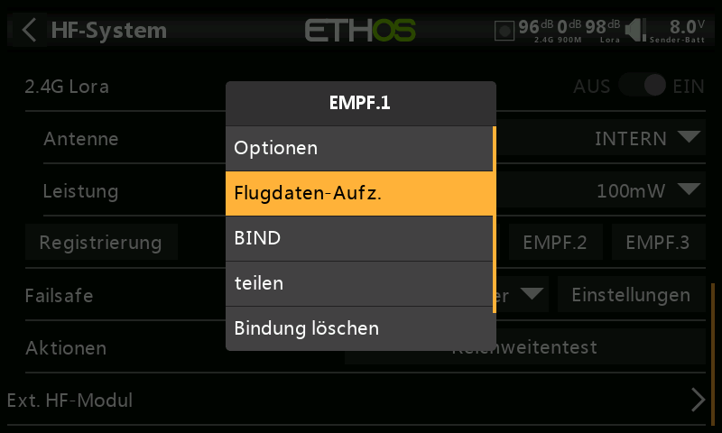

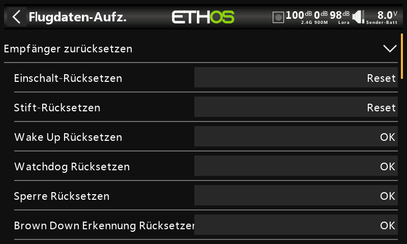

Liefert ein Protokoll über den Zustand des Empfängers, einschließlich Zurücksetzen beim Einschalten, Zurücksetzen der Ausgangspins und Ergebnisse von Wakeup, Watchdog-Timer, Verriegelungserkennung und Erkennung der Unterbrechung der Stromversorgung.

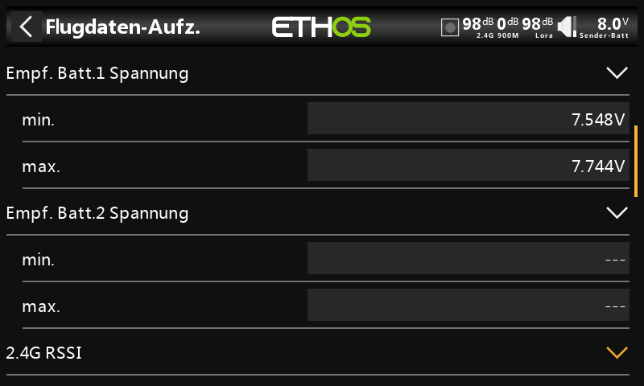

Minimal- und Maximalwerte der Spannungen von Empfänger 1 und 2 (falls vorhanden) seit dem Einschalten.

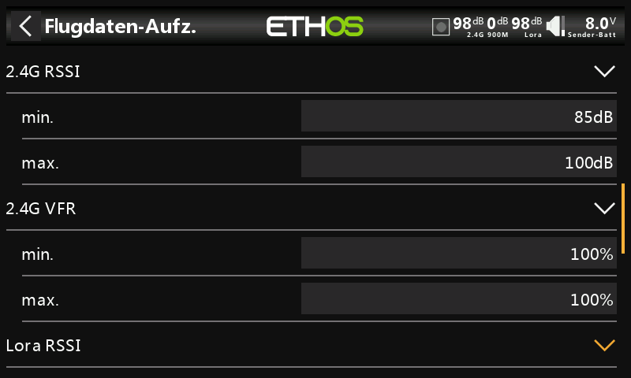

Minimal- und Maximalwerte der 2.4G RSSI und VFR (Valid Frame Rate) Pegel seit dem Einschalten.

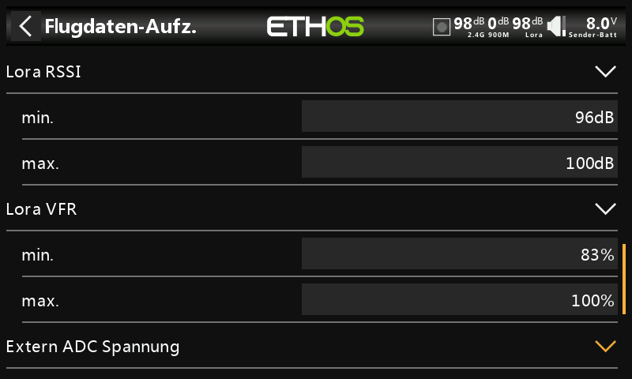

Minimal- und Maximalwerte von 900M RSSI und VFR (Valid Frame Rate) seit dem Einschalten.

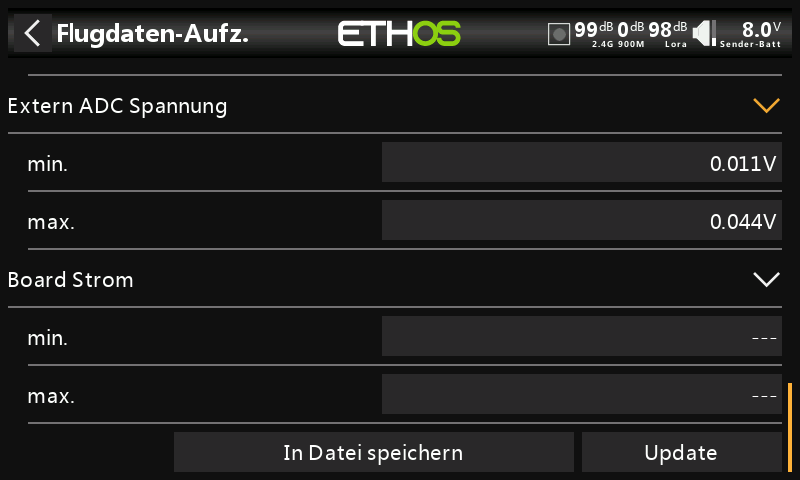

Minimal- und Maximalwerte des analogen Eingangsports AIN und der Strom auf der Empfängerplatine seit dem Einschalten.

##### In Datei speichern

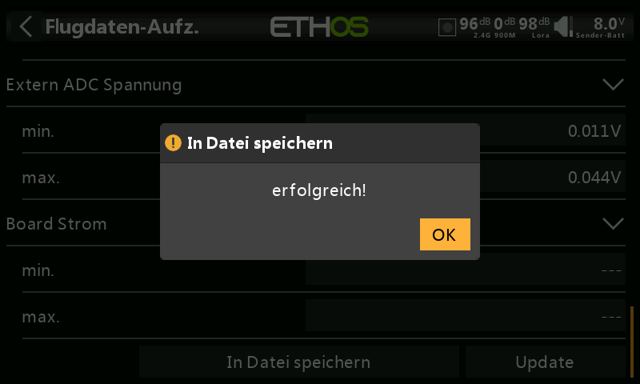

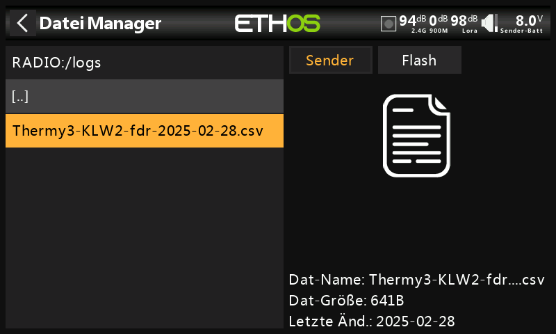

Tippen Sie auf „In Datei speichern“, um die Daten in einer .csv-Datei im Ordner „Logs“ zu speichern. Die Datei kann mit einem Texteditor oder z. B. mit LibreOffice gelesen werden.

##### Update

Tippen Sie auf die Schaltfläche Aktualisieren, um die Daten des Flugdatensatzes zu aktualisieren.

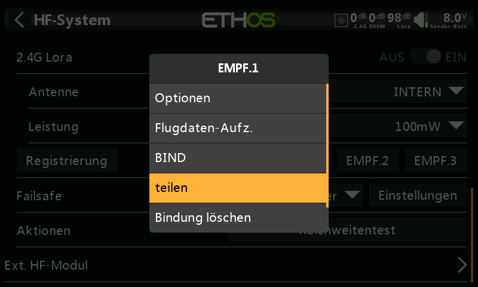

Die Teilen-Funktion bietet die Möglichkeit, den Empfänger auf einen anderen TW-Modus fähigen Sender mit einer anderen „Sender-ID“ zu übertragen. Wenn die Teilen-Option angetippt wird, schaltet sich die grüne LED des Empfängers aus.

Navigieren Sie am Zielsender B zum Modus HF System TW und Empfänger(n) und wählen Sie Bind. Beachten Sie, dass der Teilen Prozess den Registrierungsschritt auf Sender B überspringt, da die „Sender-ID“ von Sender A übertragen wird. Der Empfängername vom Quellsender wird angezeigt. Wählen Sie den Namen aus, der Empfänger wird gebunden und seine LED leuchtet grün.

Eine Meldung „Bindung erfolgreich“ wird angezeigt.

Tippen Sie auf OK. Sender B steuert nun den Empfänger. Der Empfänger bleibt an dieses Radio gebunden, bis Sie es ändern.

Drücken Sie die Taste EXIT auf Sender A, um den Teilen Prozess zu beenden.

Sie können den Empfänger wieder an Sender A binden, indem Sie ihn erneut an Sender A binden.

Hinweis: Sie brauchen „Teilen“ nicht zu verwenden, wenn alle Ihre Sender die gleiche „Sender ID“-Nummer verwenden. Sie können einfach den gewünschten Sender in den Bindungsmodus versetzen, den Empfänger einschalten, den Empfänger im Sender auswählen und er wird sich mit ihm verbinden. Auf die gleiche Weise können Sie zu einem anderen Sender wechseln. Es ist am besten, wenn Sie beim Kopieren der Modelle die Nummern der Empfänger beibehalten.

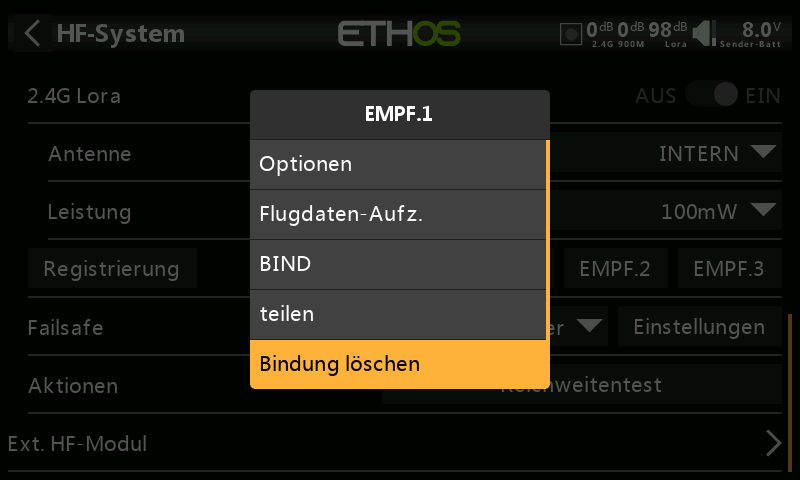

Wenn Sie Ihre Meinung über die gemeinsame Nutzung eines Modells ändern, wählen Sie „Bindung zurücksetzen“, um Ihre Bindung zu bereinigen und wiederherzustellen. Schalten Sie den Empfänger ein und er wird an Ihren Sender gebunden.

##### Werkseinstellungen

Tippen Sie auf die Schaltfläche Zurücksetzen, um den Empfänger auf die Werkseinstellungen zurückzusetzen und die UID zu löschen. Der Empfänger ist nicht mehr im Sender registriert.

#### Hinzufügen eines redundanten Empfängers

Ein zweiter Empfänger kann an einen unbenutzten Steckplatz gebunden werden, z.B. entweder RX2 oder RX3, um bei Empfangsproblemen Redundanz zu bieten.

Die FrSky-Redundanz für die Steuerung wird immer pro Frame ausgewertet, wobei der beste Frame gewählt wird. Bei 2 guten Frames wählt der Empfänger jedoch den internen guten Frame. Daher kann die Steuerung bei jedem Frame nach Bedarf umschalten (aktive/aktive Ausfallsicherung).

In unserem Beispiel unten wird ein 900M-Empfänger hinzugefügt.

1. Verbinden Sie den SBUS Out-Anschluss des redundanten Empfängers mit dem SBUS IN-Anschluss des Hauptempfängers.

Bitte beachten Sie, dass Sie eventuell einen Empfängeranschluss der Funktion SBUS IN neu zuordnen müssen. Bitte lesen Sie dazu den Abschnitt [Kanalzuordnung](rf-system.md).

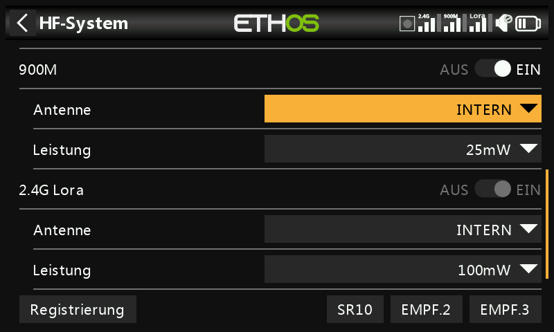

2. Aktivieren Sie das interne 900M RF-Modul. Beachten Sie, dass das 900M HF-Modul nur mit der internen Antenne funktioniert.

2a. Konfigurieren Sie die HF-Leistungsoptionen.

**Leistung**:

FCC: Wählen Sie die gewünschte HF-Leistung zwischen 10, 25, 100, 200, 500mW, 100mW~1W (selbstanpassend).

LBT: Wählen Sie die gewünschte HF-Leistung zwischen 25mW (Telemetrie über 868MHz), 200mW oder 500mW (Telemetrie über 2,4GHz).

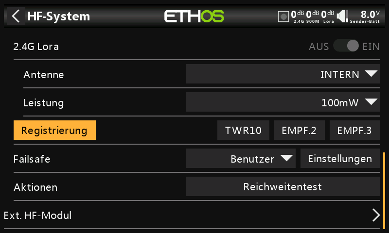

3. Wenn Ihr Empfänger noch nicht registriert wurde, starten Sie den Registrierungsprozess, indem Sie \[Registrieren\] wählen. Andernfalls fahren Sie mit dem Abschnitt „Binden“ fort.

4. Registrieren Sie den neuen Empfänger, z.B. den R9MINI-O.

5. Schalten Sie die Empfänger aus.

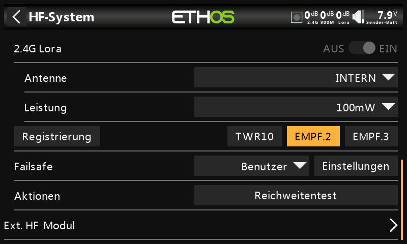

6. Tippen Sie auf „Binden“ in der Zeile RX2 oder RX3.

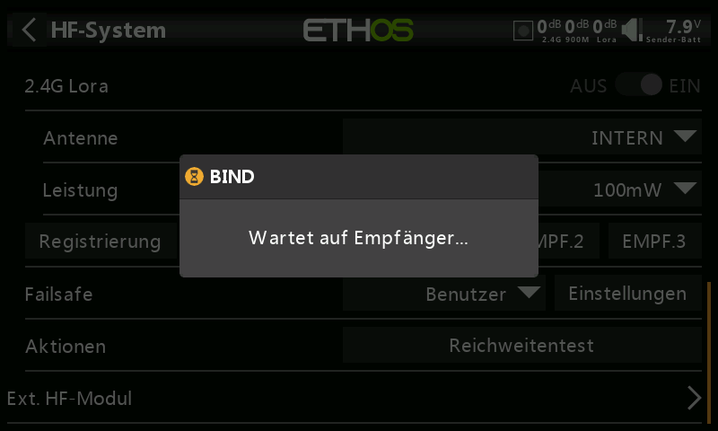

Alle paar Sekunden ertönt die Sprachansage „Binden“, um zu bestätigen, dass Sie sich im Bindemodus befinden. Ein Popup-Fenster zeigt „Warten auf Empfänger...“ an.

7. Schalten Sie die Empfänger ein.

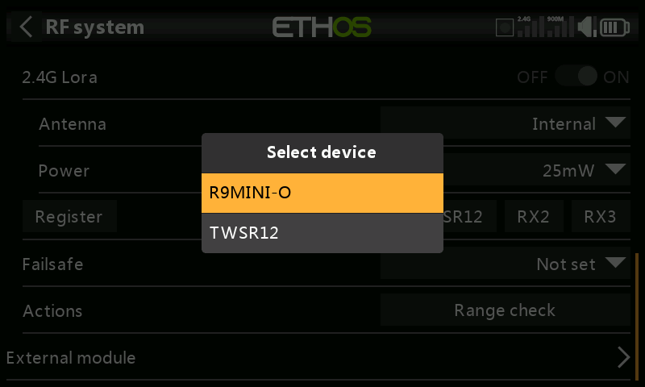

8. Wählen Sie den redundanten Empfänger R9MINI-O.

9. Tippen Sie auf OK. Stellen Sie sicher, dass die grüne LED am redundanten Empfänger leuchtet. Der redundante Empfänger ist nun gebunden.

10. Der redundante Empfänger wird nun aufgelistet, z. B. der R9MINI-O oben.

Hinweis: Obwohl es möglich ist, sowohl den Hauptempfänger als auch den redundanten Empfänger an dieselbe UID zu binden, indem Sie sie einzeln einschalten, haben Sie keinen Zugriff auf die Rx-Optionen, solange beide eingeschaltet sind.

### Failsafe

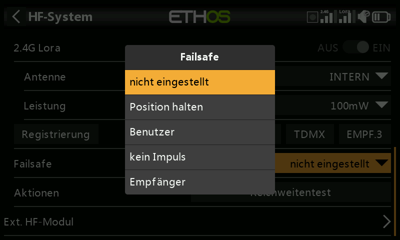

Der Failsafe-Modus bestimmt, was beim Empfänger passiert, wenn das Sendersignal verloren geht.

Die Failsafe-Daten werden etwa alle 10 Sekunden vom Sender gesendet. Bitte beachten Sie, dass bei TD-, TW-, AP- und AP Plus-Empfängern die Failsafe-Daten jetzt im Empfänger gespeichert werden, was bedeutet, dass die Failsafe-Einstellungen sofort verfügbar sind, wenn der Empfänger aus irgendeinem Grund neu gestartet wird.

Tippen Sie auf das Dropdown-Feld, um die Failsafe-Optionen anzuzeigen:

#### Benutzer

Benutzerdefiniert ermöglicht das Bewegen der Servos in benutzerdefinierte vordefinierte Positionen. Die Position kann für jeden Kanal separat definiert werden. Für jeden Kanal gibt es die Optionen Nicht eingestellt, Position halten, Benutzer oder kein Impuls. Wenn Benutzerdefiniert ausgewählt ist, wird der Kanalwert angezeigt. Wenn das Symbol mit dem Pfeil angetippt wird, wird der aktuelle Wert des Kanals verwendet. Alternativ kann ein fester Wert für diesen Kanal eingegeben werden, indem Sie auf den Wert tippen.

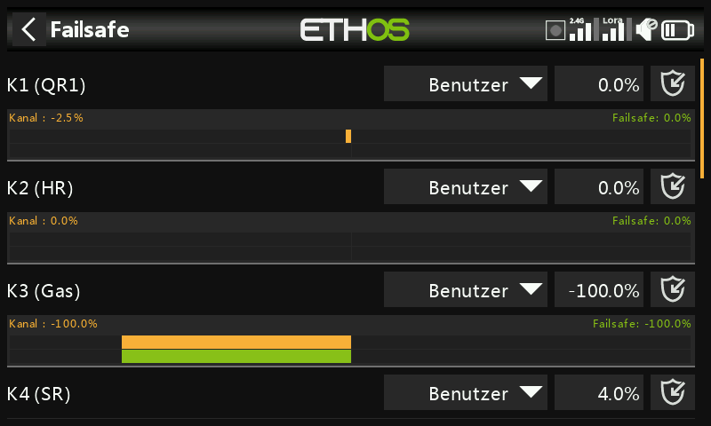

#### Position halten

Mit Position halten werden die zuletzt empfangenen Positionen beibehalten.

#### Kein Impuls

Keine Impulse schaltet die Impulse aus (zur Verwendung mit Flugcontrollern, die bei Signalverlust zum Heimat-GPS-Ort zurückkehren).

#### Empfänger

Wenn Sie bei Empfängern der Serie X oder höher „Empfänger“ wählen, können Sie die Failsafe-Funktion im Empfänger einstellen.

*Warnung:* Achten Sie darauf, die gewählten Failsafe-Einstellungen sorgfältig zu testen – insbesondere die Kanäle, die bei stabilisierten Empfängern den Kreisel steuern.

### Reichweitentest

Eine Reichweitenkontrolle sollte auf dem Flugplatz durchgeführt werden, wenn das Modell flugbereit ist.

Die Bereichsprüfung wird durch Auswahl von „Bereichsprüfung“ aktiviert.

Alle paar Sekunden ertönt die Sprachansage „Reichweitentest“, um zu bestätigen, dass Sie sich in diesen Modus befinden. Ein Popup-Fenster zeigt die Empfängernummer sowie die VFR%- und RSSI-Werte an, um das Verhalten der Empfangsqualität zu bewerten. Wenn die Reichweitenprüfung aktiv ist, wird die Sendeleistung reduziert, was wiederum die Reichweite für den Reichweitentest verringert. Unter idealen Bedingungen, wenn sich sowohl der Sender als auch der Empfänger 1 m über dem Boden befinden, sollten Sie erst in einem Abstand von etwa 30 m einen kritischen Alarm erhalten.

Derzeit liefert TW im Reichweitentestmodus Reichweitentestdaten für jeweils einen Empfänger auf der 2,4G-Verbindung und einen Empfänger auf der 900M-Verbindung. Wenn Sie drei 2,4G-Empfänger registriert und als Empfänger 1, 2 und 3 gebunden haben, ist einer der Empfänger der aktive Telemetrieempfänger und seine Nummer wird vom RX-Sensor als 0, 1 oder 2 angezeigt. Dies ist der Empfänger, der die RSSI- und VFR-Daten sendet. Wenn Sie diesen Empfänger ausschalten, wird der nächste Empfänger zum aktiven Telemetrieempfänger in der Priorität 0, 1 und dann 2. Jeder der drei Empfänger kann auf seine Reichweite überprüft werden, indem die anderen Empfänger ausgeschaltet werden.

RX-Index 0 = Empfänger 1

RX-Index 1 = Empfänger 2

RX-Index 2 = Empfänger 3

Bitte lesen Sie auch den Abschnitt Telemetrie für eine Beschreibung der [VFR- und RSSI](#Lesezeichen 31)-Werte.

## Externes HF-Modul - FrSky

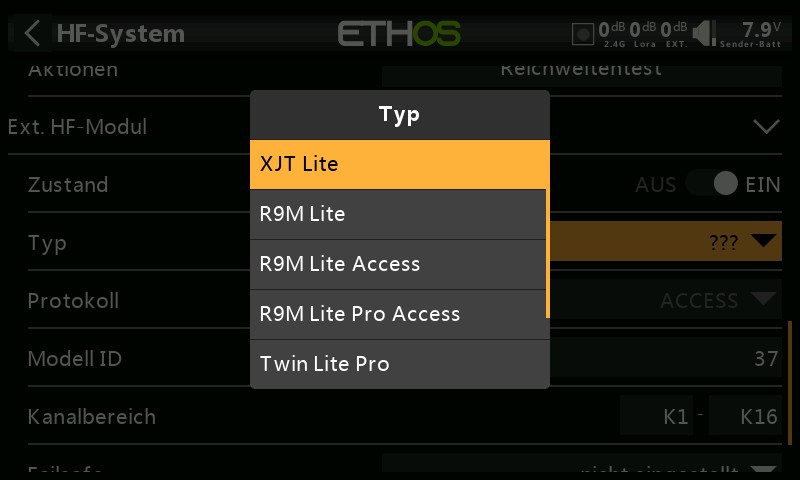

Derzeit werden die folgenden externen FrSky-Module unterstützt: XJT Lite, R9M Lite, R9M Lite Access, R9M Lite Pro Access, TWIN Lite Pro, PPM und SBUS. Für Module von Drittanbietern lesen Sie bitte den nächsten Abschnitt.

Die externen Module können in den Modi ACCESS, ACCST D16, ELRS oder TWIN MODE betrieben werden. Informationen zu Modulen von Drittanbietern finden Sie im nächsten Abschnitt.

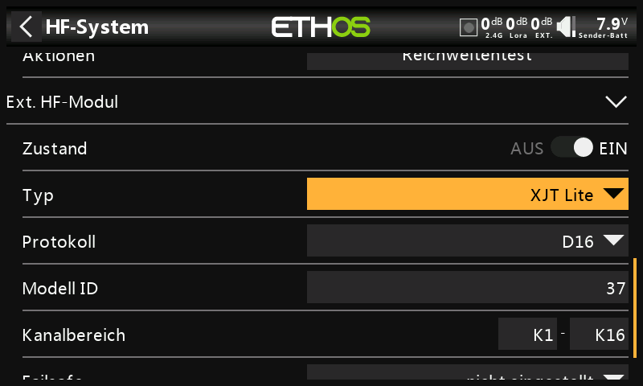

### Zustand

Das externe Modul kann ein- oder ausgeschaltet sein.

### Typ: XJT Lite

#### Protokoll

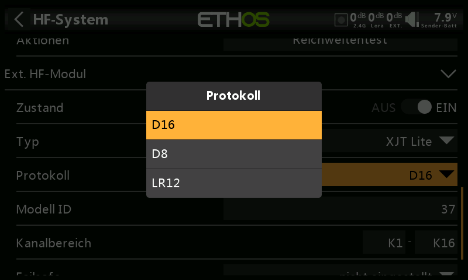

Der XJT Lite kann in den Modi D16 (bis zu 16 Kanäle), D8 (bis zu 8 Kanäle) oder LR12 (bis zu 12 Kanäle) betrieben werden.

### Typ: R9M Lite

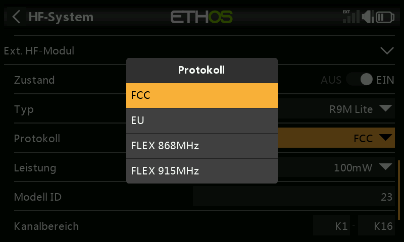

#### Protokoll

Der R9M Lite kann in den folgenden Modi betrieben werden:

| Mode | HF-Betriebsfrequenz | HF-Leistung |
| --- | --- | --- |
| FCC | 915MHz | 100mW (mit Telemetrie) |
| EU | 868MHz | 25mW (mit Telemetrie) / 100mW (ohne Telemetrie) |
| FLEX 868MHz | einstellbar | 100mW (mit Telemetrie) |
| FLEX 915MHz | einstellbar | 100mW (mit Telemetrie) |

### Typ: R9M Lite ACCESS

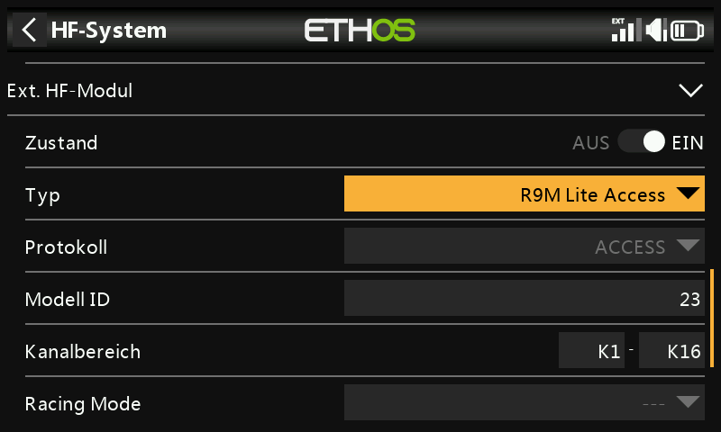

#### Protokoll

Das R9M Lite ACCESS arbeitet im ACCESS-Modus.

### Typ: R9M Lite Pro ACCESS

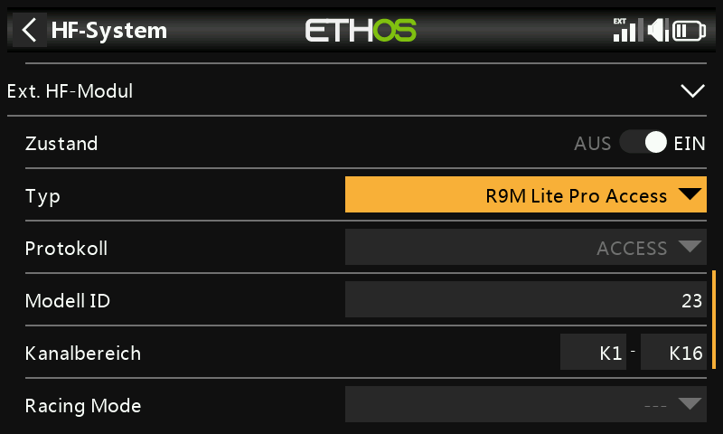

#### Protokoll

Das R9M Lite Pro ACCESS arbeitet im ACCESS-Modus.

| Mode | HF-Betriebsfrequenz | HF-Leistung |
| --- | --- | --- |
| FCC | 915MHz | 10mW / 100mW / 500mW / 100mW~1W (selbst anpassend) |
| EU | 868MHz | Telemetrie-Modus (25mW) / ohne-Telemetrie-Modus (200mW / 500mW) |

### Typ: TWIN Lite Pro

Twin Lite PRO ist ein leistungsfähiges HF-Modul, das ETHOS-fähigen Sender ermöglicht, sich mit den Empfängern der TW-Serie zu verbinden und die dualen 2,4G-Frequenzen des TW-Protokolls gleichzeitig auf demselben Empfänger zu unterstützen. Das TW Aktiv-Aktiv-Protokoll unterscheidet sich von den allgemeinen Aktiv-Standby-Redundanzlösungen (bei denen ein Empfänger nur dann die Signalsteuerung übernimmt, wenn sich der andere im Failsafe-Modus befindet). Mit dem TW-Protokoll sind zwei 2,4G-Frequenzbänder auf dem Modul und dem Empfänger der TW-Serie gleichzeitig aktiv.

Das HF-Modul verfügt über zwei externe 2.4G-Antennen, die HF-montiert sind, um im Vergleich zu einem Einzelantennendesign eine multidirektionale und breitere Abdeckung für Sendesignale zu bieten. Dank dieser Merkmale kann das Twin-System eine geringere Latenzzeit und eine höhere Zuverlässigkeit bei einer schnelleren Datenrate bieten, auf die man sich verlassen kann.

Neben dem TW-Modus unterstützt dieses Modul auch die Modi ACCST D16, ACCESS und ELRS 2.4G. Dies bedeutet, dass die Benutzer von einer breiten Palette an kompatiblen Empfängeroptionen profitieren können, die sie beim Bau des RC-Modells auswählen und an die sie sich binden können. Das Twin Lite Pro Modul bietet belastbare HF-Leistungsoptionen von bis zu 500mW, konstruiert mit dem CNC-gefrästen Metallmodulgehäuse, das die Wärmeableitung unterstützt. Dieses System kann eine stabile Fernsteuerung über Dutzende von Kilometern bei langen Arbeitszeiten gewährleisten.

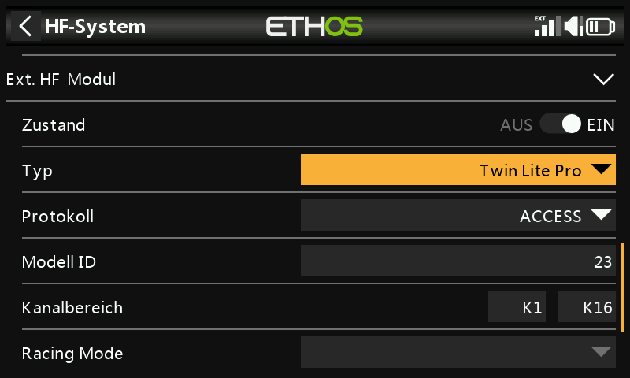

#### Zustand

Das externe Modul kann ein- oder ausgeschaltet sein.

#### Protokoll

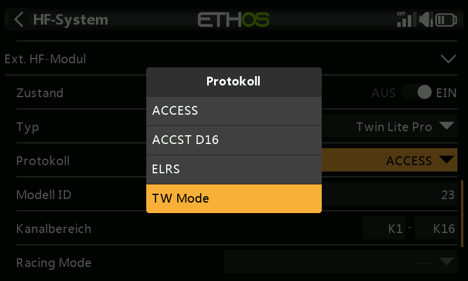

Übertragungsmodus des TWIN Lite Pro HF-Moduls. Zusätzlich zum TW-Modus unterstützt dieses Modul auch die Modi ACCST D16, ACCESS und ELRS 2.4G.

Der Modus muss mit dem vom Empfänger unterstützten Typ übereinstimmen, sonst wird das Modell nicht gebunden! Überprüfen Sie nach einer Modusänderung sorgfältig den Betrieb des Modells (insbesondere Failsafe!) und stellen Sie sicher, dass alle Empfängerkanäle wie vorgesehen funktionieren.

#### Protokoll: TW-Mode

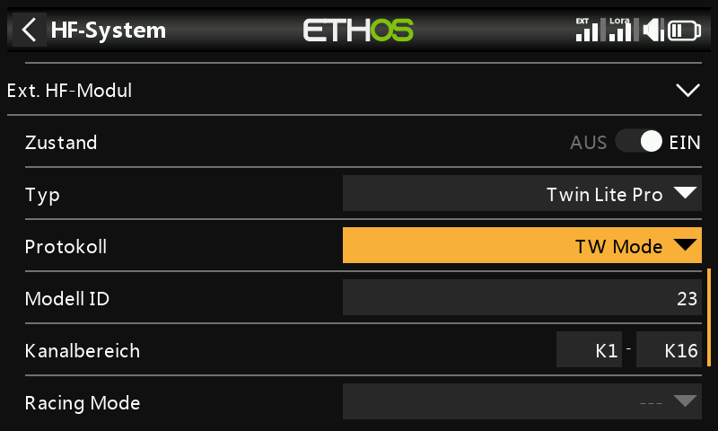

In Bezug auf die Bindung ähnelt der TW-Modus der ACCESS-Methode, da die Empfänger gebunden und mit dem Sender verbunden werden. Der Vorgang ist in zwei Phasen unterteilt. Die erste Phase ist die Registrierung des Empfängers bei dem Funkgerät oder den Funkgeräten, mit denen er verwendet werden soll. Die Registrierung muss für jedes Empfänger-Sender-Paar nur einmal durchgeführt werden. Nach der Registrierung kann ein Empfänger drahtlos mit jedem der Funkgeräte, mit denen er registriert ist, gebunden und wieder gebunden werden, ohne dass die Bindungstaste am Empfänger betätigt werden muss.

Nach Auswahl des TW-Modus müssen die folgenden Parameter eingestellt werden:

##### Model ID

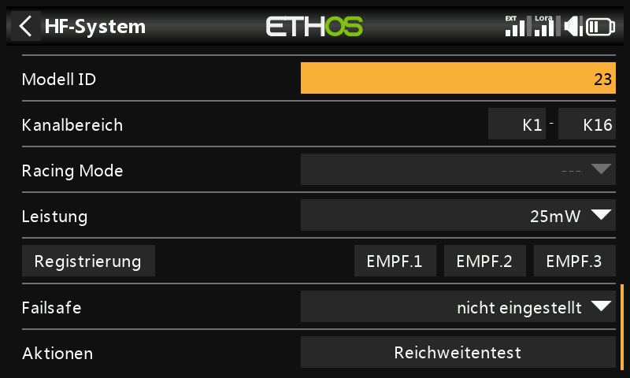

Wenn Sie ein neues Modell erstellen, wird die Modell-ID automatisch zugewiesen. Die Modell-ID muss eine eindeutige Nummer sein, da die Smart Match-Funktion sicherstellt, dass nur an die richtige Modell-ID gebunden wird. Diese Nummer wird beim Binden an den Empfänger gesendet, so dass dieser nur auf die Nummer antwortet, an die er gebunden wurde. Die Model-ID kann manuell geändert werden. Beachten Sie auch, dass die Modell-ID geändert wird, wenn das Modell geklont wird.

##### Kanal Bereich:

Da der TW-Modus bis zu 24 Kanäle unterstützt, wählen Sie normalerweise Ch1-8, Ch1-16 oder Ch1-24 für die Anzahl der zu übertragende Kanäle. Beachten Sie, dass Ch1-16 die Standardeinstellung ist. Die Kanäle, die von einem Empfänger empfangen werden, werden in den Empfängeroptionen für jeden Empfänger konfiguriert.

Die Wahl des Senderkanalbereichs wirkt sich auch auf die übertragenen Aktualisierungsraten aus. Acht Kanäle werden alle 7 ms übertragen. Bei Verwendung von mehr als 8 Kanälen sind die Kanalaktualisierungsraten wie folgt:

| Kanal Bereich | Aktualisierungsrate | Anmerkungen |
| --- | --- | --- |
| 1-24 | 21ms | Ch1-8, dann Ch9-16, dann Ch17-24 im Wechsel gesendet |
| 1-16 | 14ms | Ch1-8, Ch9-16, abwechselnd gesendet |
| 1-8 | 7ms  | Ch1-8 |
| Racingmodus | 4ms | Nur digitale Servos |

##### Racingmodus

Der Rennmodus bietet eine sehr niedrige Latenz von 4 ms mit Empfängern wie TW MX. Das RF-Modul und der RS-Empfänger müssen auf v2.1.7 oder höher sein.

Wenn der Kanalbereich auf Ch1-8 eingestellt ist, ist es möglich, eine Quelle (z. B. einen Schalter) auszuwählen, die den Rennmodus aktiviert. Nachdem der RS-Empfänger gebunden wurde (siehe unten) und der Rennmodus aktiviert wurde, muss der RS-Empfänger erneut mit Strom versorgt werden, damit der Rennmodus wirksam wird.

##### Sendeleistung

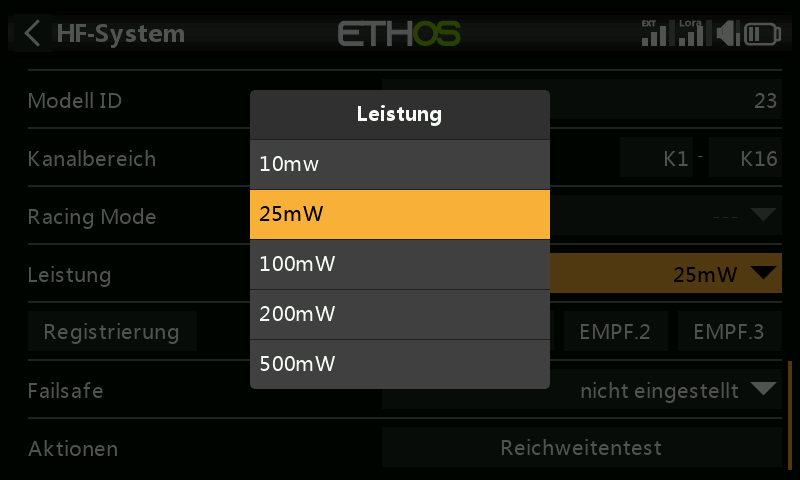

Wählen Sie die gewünschte HF-Leistung zwischen 10, 25, 100, 200 und 500 mW.

##### Phase Eins: Registrierung

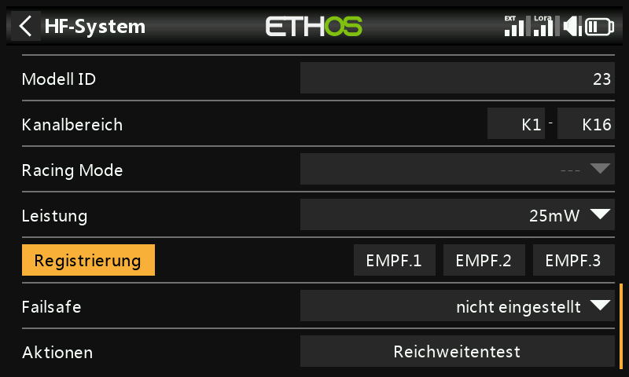

1. Wenn Ihr Empfänger noch nicht registriert ist, starten Sie den Registrierungsprozess, indem Sie \[Registrieren\] wählen. Andernfalls fahren Sie mit dem Abschnitt „Binden“ fort.

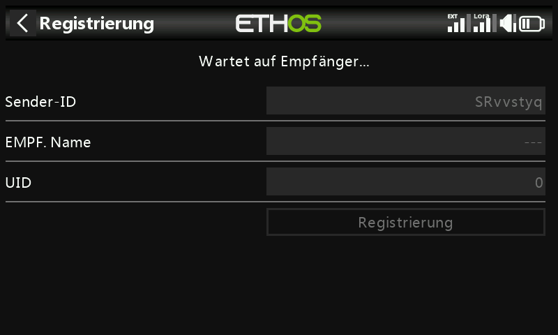

Ein Meldungsfenster mit der Aufschrift „Warten...“ erscheint mit einem wiederholten Sprachsignal „Registrieren“.

2. Während Sie die Bindungstaste gedrückt halten, schalten Sie den Empfänger ein und warten Sie, bis die roten und grünen LEDs aktiv werden.

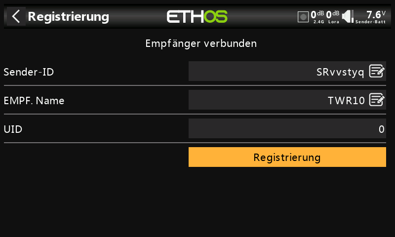

Die Meldung „Warten...“ ändert sich in „Empfänger Verbunden“, und das Feld Rx Name wird automatisch ausgefüllt.

3. In diesem Stadium können die Registrierungs-ID und die UID festgelegt werden:

-   Sender-ID: Die Sender ID ist auf Eigentümer- oder Senderebene. Dies sollte ein eindeutiger Code für Ihren und andere Sender sein, die mit Smart Share verwendet werden sollen. Sie ist standardmäßig auf den Wert in der oben am Anfang dieses Abschnitts beschriebenen Einstellung für die Registrierungs-ID des Eigentümers eingestellt, kann aber hier bearbeitet werden. Wenn zwei Funkgeräte die gleiche ID haben, können Sie Empfänger (mit der gleichen Empfängernummer für ein bestimmtes Modell) zwischen ihnen verschieben, indem Sie einfach den Einschaltvorgang verwenden.
-   RX-Name: Wird automatisch ausgefüllt, aber der Name kann auf Wunsch geändert werden. Dies kann nützlich sein, wenn Sie mehr als einen Empfänger verwenden und sich z.B. daran erinnern müssen, dass RX4R1 für Ch1-8 oder RX4R2 für Ch9-16 oder RX4R3 für Ch17-24 ist, wenn Sie später neu binden. Hier kann ein Name für den Empfänger eingegeben werden.
-   Die UID (Empfänger-Nr.) wird verwendet, um zwischen mehreren gleichzeitig in einem Modell verwendeten Empfängern zu unterscheiden. Sie kann auf dem Standardwert 0 für einen einzelnen Empfänger belassen werden. Wenn mehr als ein Empfänger im selben Modell verwendet werden soll, sollte die UID geändert werden, normalerweise 0 für Ch1-8, 1 für Ch9-16 und 2 für Ch17-24. Bitte beachten Sie, dass diese UID nicht vom Empfänger zurück gelesen werden kann, daher ist es ratsam, den Empfänger zu beschriften.

4. Drücken Sie zum Abschluss auf \[Registrieren\].

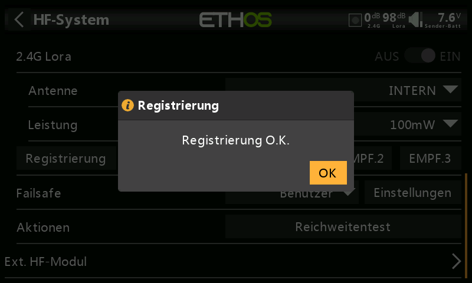

5. Es erscheint ein Dialogfeld mit der Meldung „Registrierung ok“. Drücken Sie \[OK\], um fortzufahren.

6. Schalten Sie den Empfänger aus. Zu diesem Zeitpunkt ist der Empfänger registriert, muss aber noch an den zu verwendenden Sender gebunden werden.

##### Phase Zwei - Bindung und Moduloptionen

Das Binden von Empfängern ermöglicht es, einen registrierten Empfänger an einen der Sender zu binden, mit denen er in Phase 1 registriert wurde, und er reagiert dann auf diesen Sender, bis er wieder an einen anderen Sender gebunden wird. Führen Sie unbedingt einen Reichweitentest durch, bevor Sie das Modell fliegen.

Empfängernummer: Bestätigen Sie die Empfängernummer, unter der das Modell betrieben werden soll. Der Empfängerabgleich ist immer noch so wichtig wie vor ACCESS.  Die Empfängernummer definiert das Verhalten der Smart Match-Funktion. Diese Nummer wird beim Binden an den Empfänger gesendet, der dann nur auf die Nummer antwortet, an die er gebunden wurde. Die Modell-ID kann manuell geändert werden.

##### Bind

Warnung - sehr wichtig

Führen Sie den Bindevorgang nicht durch, wenn ein Elektromotor angeschlossen ist oder ein Verbrennungsmotor läuft.

1. Schalten Sie den Empfänger aus.

2. Vergewissern Sie sich, dass Sie sich im ACCESS-Modus befinden.

3. Empfänger 1 \[Binden\]: Starten Sie den Bindevorgang, indem Sie \[RX1\] wählen und dann Binden aus der Dropdown-Liste auswählen. Alle paar Sekunden ertönt die Sprachansage „Binden“, um zu bestätigen, dass Sie sich im Bindemodus befinden. In einem Popup-Fenster wird „Warten auf Empfänger...“ angezeigt.

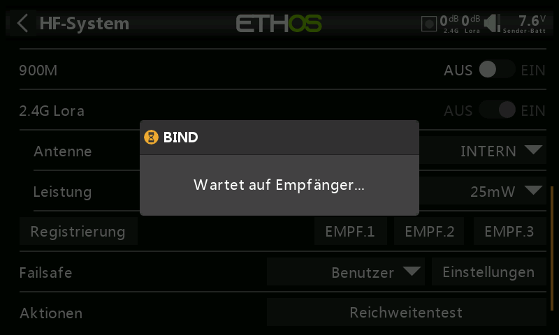

4. Schalten Sie den Empfänger ein, ohne die F/S-Bindungstaste zu berühren. Es erscheint die Meldung „Gerät auswählen“ und der Name des Empfängers, den Sie gerade eingeschaltet haben.

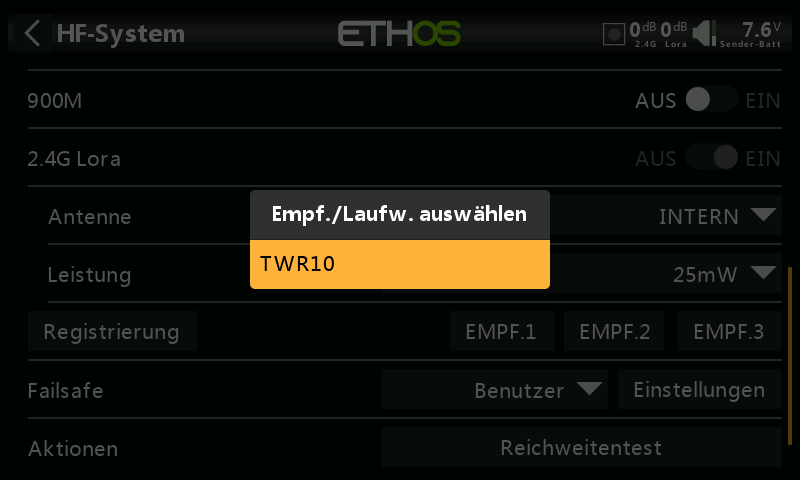

5. Navigieren Sie zu dem Namen des Empfängers und wählen Sie ihn aus. Es wird eine Meldung angezeigt, dass die Bindung erfolgreich war.

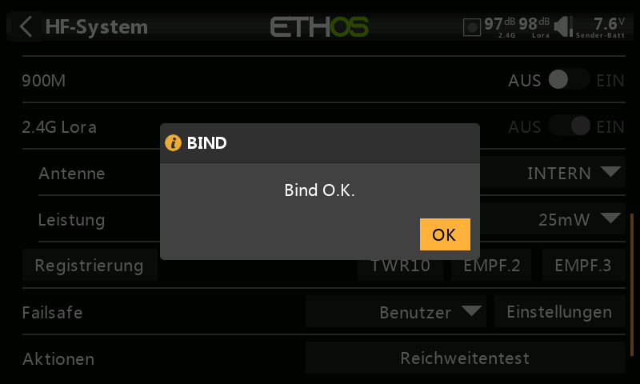

6. Schalten Sie sowohl den Sender als auch den Empfänger aus.

7. Schalten Sie erst den Sender und dann den Empfänger ein. Wenn die grüne LED am Empfänger leuchtet und die rote LED aus ist, ist der Empfänger mit dem Sender verbunden. Die Bindung zwischen Empfänger und Sendemodul muss nicht wiederholt werden, es sei denn, eines der beiden Module wird ausgetauscht.

Der Empfänger wird nur von dem Sender, an den er gebunden ist, gesteuert (ohne von anderen Sendern beeinflusst zu werden).

Der ausgewählte Empfänger zeigt nun für RX1 den Namen daneben an: TDMX

Der Empfänger ist nun einsatzbereit.

Wiederholen Sie den Vorgang für Empfänger 2 und 3, falls zutreffend.

Siehe auch den Abschnitt Telemetrie für eine Erläuterung über [RSSI](#Lesezeichen 31).

##### Empfänger-Optionen

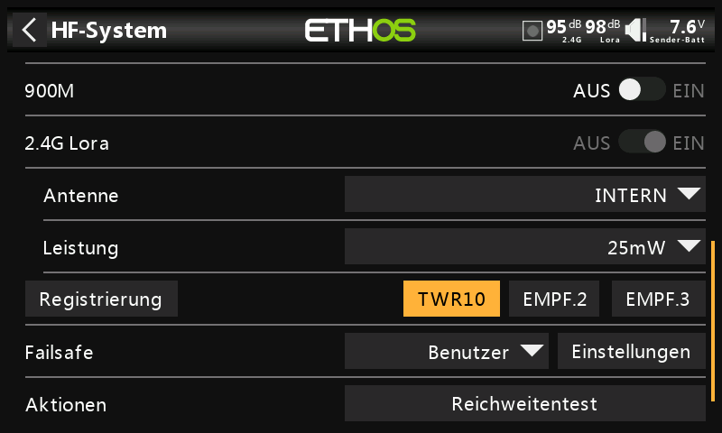

Tippen Sie auf die Schaltfläche RX1, RX2 oder RX3, um die Empfängeroptionen aufzurufen:

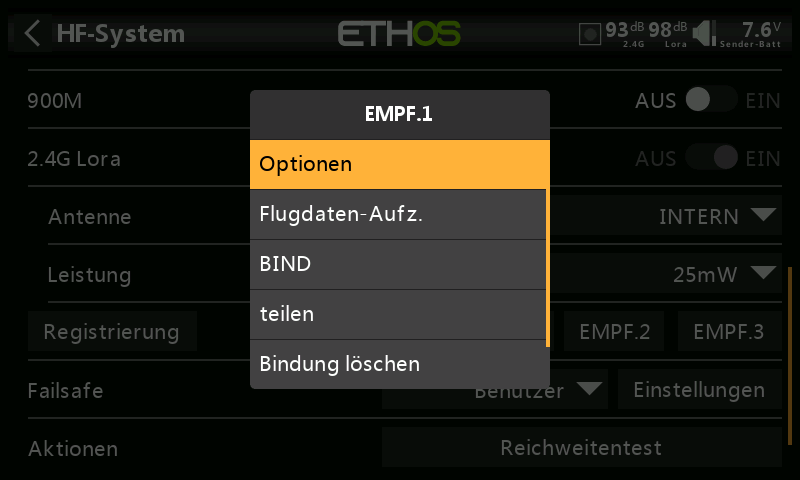

Tippen Sie auf Optionen:

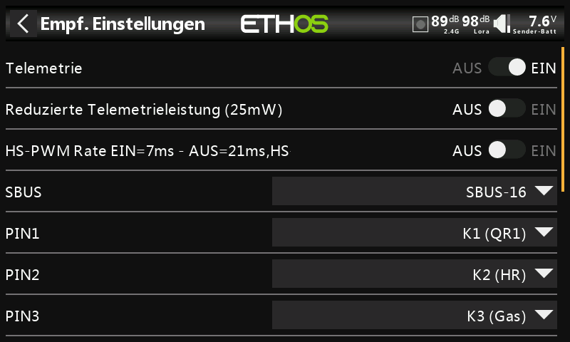

##### Optionen

*Telemetrie 25mW:* Kontrollkästchen zur Begrenzung der Telemetrie-Leistung auf 25mW (normalerweise 100mW), möglicherweise erforderlich, wenn z.B. Servos durch HF-Störungen in ihrer Nähe gestört werden.

*High PWM-Speed:* Die Servo-Update-Raten werden vollständig vom Empfänger bestimmt.  Dieses Kontrollkästchen aktiviert eine PWM-Aktualisierungsrate von 7ms (gegenüber 18ms Standard). Stellen Sie sicher, dass Ihre Servos diese Aktualisierungsrate verarbeiten können.

Einzelheiten zur am Sender eingestellten Aktualisierungsrate finden Sie im Abschnitt [Kanalbereich (Access)](rf-system.md).

*Port:* Ermöglicht die Auswahl des Smart.Port am Empfänger, um entweder S.Port, F.Port oder das FBUS (F.Port2) Protokoll zu verwenden. Das F.Port-Protokoll wurde zusammen mit dem Betaflight-Team entwickelt, um die separaten SBUS- und S.Port-Signale zu integrieren. FBUS (F.Port2) ermöglicht auch die Kommunikation eines Host-Gerätes mit mehreren Slave-Geräten auf derselben Leitung. Weitere Informationen über das Port-Protokoll finden Sie in der Protokollerklärung auf der offiziellen FrSky-Website.

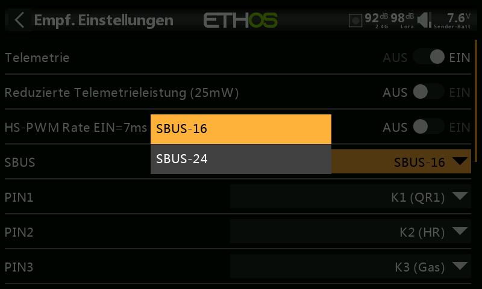

*SBUS:* Ermöglicht die Auswahl des SBUS-16-Kanal- oder SBUS-24-Kanal-Modus. Beachten Sie, dass alle angeschlossenen SBUS-Geräte den SBUS-24-Modus unterstützen müssen, um das neue Protokoll zu aktivieren. SBUS-24 ist eine FrSky-Entwicklung des SBUS-16 Futaba-Protokolls.

*Kanalzuordnung:* Der Empfänger-Optionen-Dialog bietet auch die Möglichkeit, die Kanäle den Empfänger-Pins neu zuzuordnen.

##### Flugdatenaufzeichnung

Protokoll über den Zustand des Empfängers, einschließlich Zurücksetzen beim Einschalten, Zurücksetzen der Ausgangspins und Ergebnisse des Aufwachens, des Watchdog-Timers, der Verriegelungserkennung und der Erkennung eines Stromausfalls.

##### Teilen

Die „Teilen“-Funktion bietet die Möglichkeit, den Empfänger auf einen anderen ACCESS-Sender mit einer anderen „Sender-ID“ zu übertragen. Wenn die „Teilen“-Option angetippt wird, schaltet sich die grüne LED des Empfängers aus.

Navigieren Sie am Sender B zum Abschnitt HF System und Empfänger(n) und wählen Sie Bind. Beachten Sie, dass der „Teilen“-Prozess den Registrierungsschritt auf Radio B überspringt, da die „Sender-ID“ vom Sender A übertragen wird. Wählen Sie den Namen aus, der Empfänger wird gebunden und seine LED leuchtet grün.

Eine Meldung „Bindung erfolgreich“ wird angezeigt.

Tippen Sie auf OK. Sender B steuert nun den Empfänger. Der Empfänger bleibt an ihm gebunden, bis Sie es ändern.

Drücken Sie die Taste EXIT auf Sender A, um den Freigabeprozess zu beenden.

Der Empfänger kann wieder auf Sender A verschoben werden, indem er erneut an Sender A gebunden wird.

Hinweis: Sie brauchen die Funktion „Teilen“ nicht zu verwenden, wenn alle Ihre Sender dieselbe „Sender-ID“ verwenden. Sie können einfach den gewünschten Sender in den Bindungsmodus versetzen, den Empfänger einschalten, den Empfänger im Sender auswählen und es wird mit diesem verbunden. Auf die gleiche Weise können Sie zu einem anderen Sender wechseln. Es ist am besten, wenn Sie beim Kopieren der Modelle die Nummern der Empfänger beibehalten.

##### Bindung zurücksetzen

Wenn Sie Ihre Meinung über die gemeinsame Nutzung eines Modells ändern, wählen Sie „Bindung zurücksetzen“, um Ihre Bindung zu bereinigen und wiederherzustellen. Schalten Sie den Empfänger ein und er wird an Ihren Sender gebunden.

##### Werkseinstellungen

Tippen Sie auf die Schaltfläche Zurücksetzen, um den Empfänger auf die Werkseinstellungen zurückzusetzen und die UID zu löschen. Der Empfänger ist nicht mehr im Sender registriert.

#### Failsafe

Der Failsafe-Modus bestimmt, was beim Empfänger passiert, wenn das Sendersignal verloren geht.

Die Failsafe-Daten werden etwa alle 10 Sekunden vom Sender gesendet. Bitte beachten Sie, dass bei TD-, TW-, AP- und AP Plus-Empfängern die Failsafe-Daten jetzt im Empfänger gespeichert werden, was bedeutet, dass die Failsafe-Einstellungen sofort verfügbar sind, wenn der Empfänger aus irgendeinem Grund neu gestartet wird.

Tippen Sie auf das Dropdown-Feld, um die Failsafe-Optionen anzuzeigen:

#### Benutzer

#### Benutzerdefiniert ermöglicht das Bewegen der Servos in benutzerdefinierte vordefinierte Positionen. Die Position kann für jeden Kanal separat definiert werden. Für jeden Kanal gibt es die Optionen Nicht eingestellt, Position halten, Benutzer oder kein Impuls. Wenn Benutzerdefiniert ausgewählt ist, wird der Kanalwert angezeigt. Wenn das Symbol mit dem Pfeil angetippt wird, wird der aktuelle Wert des Kanals verwendet. Alternativ kann ein fester Wert für diesen Kanal eingegeben werden, indem Sie auf den Wert tippen.

#### Position halten

Mit Position halten werden die zuletzt empfangenen Positionen beibehalten.

##### Kein Impuls

Keine Impulse schaltet die Impulse aus (zur Verwendung mit Flugcontrollern, die bei Signalverlust zum Heimat-GPS zurückkehren).

##### Empfänger

Wenn Sie bei Empfängern der Serie X oder höher die Option „Empfänger“ wählen, können Sie die Failsafe-Funktion im Empfänger einstellen.

***Warnung:*** Testen Sie die gewählten Failsafe-Einstellungen unbedingt sorgfältig.

##### Reichweitentest

Eine Reichweitenkontrolle sollte auf dem Flugplatz durchgeführt werden, wenn das Modell flugbereit ist.

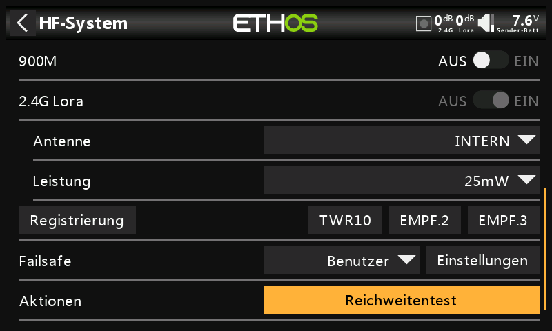

Die Reichweitenprüfung wird durch Auswahl von „Reichweitentest“ aktiviert. Alle paar Sekunden ertönt eine Sprachansage „Reichweitentest“, um zu bestätigen, dass Sie sich in diesem Modus befinden. Ein Popup-Fenster zeigt die Empfängernummer sowie die VFR%- und RSSI-Werte an, um das Verhalten der Empfangsqualität zu bewerten. Wenn die Reichweitenprüfung aktiv ist, wird die Sendeleistung reduziert, was wiederum die Reichweite für den Reichweitentest verringert. Unter idealen Bedingungen, wenn sich sowohl der Sender als auch der Empfänger 1 m über dem Boden befinden, sollten Sie erst in einem Abstand von etwa 30 m einen kritischen Alarm erhalten.

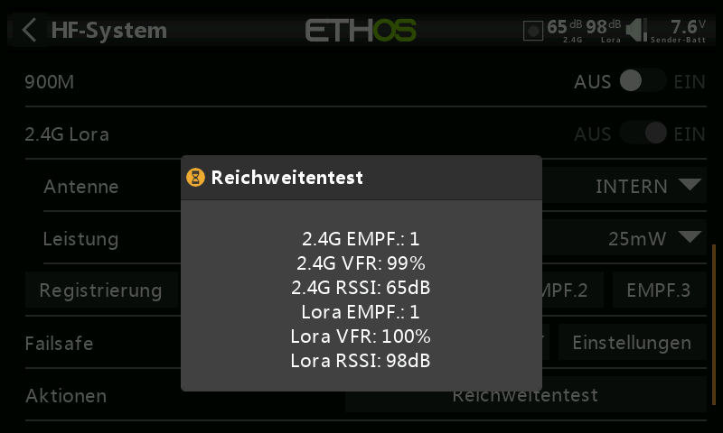

Gegenwärtig liefert der TW-Modus im Bereichsprüfungsmodus Bereichsprüfungsdaten für jeweils einen Empfänger, wobei beide 2,4G-Verbindungen angezeigt werden. Wenn Sie drei Empfänger registriert und als Empfänger 1, 2 und 3 gebunden haben, wird einer der Empfänger der aktive Telemetrieempfänger sein und seine Nummer wird vom RX-Sensor als 0, 1 oder 2 angezeigt. Dies ist der Empfänger, der die RSSI- und VFR-Daten sendet. Wenn Sie diesen Empfänger ausschalten, wird der nächste Empfänger zum aktiven Telemetrieempfänger in der Priorität 0, 1 und dann 2. Jeder der drei Empfänger kann auf seine Reichweite überprüft werden, indem die anderen Empfänger ausgeschaltet werden.

RX-Index 0 = Empfänger 1

RX-Index 1 = Empfänger 2

RX-Index 2 = Empfänger 3

Bitte lesen Sie auch den Abschnitt Telemetrie für eine Diskussion über [VFR- und RSSI](#Lesezeichen 31)-Werte.

#### Typ: ELRS

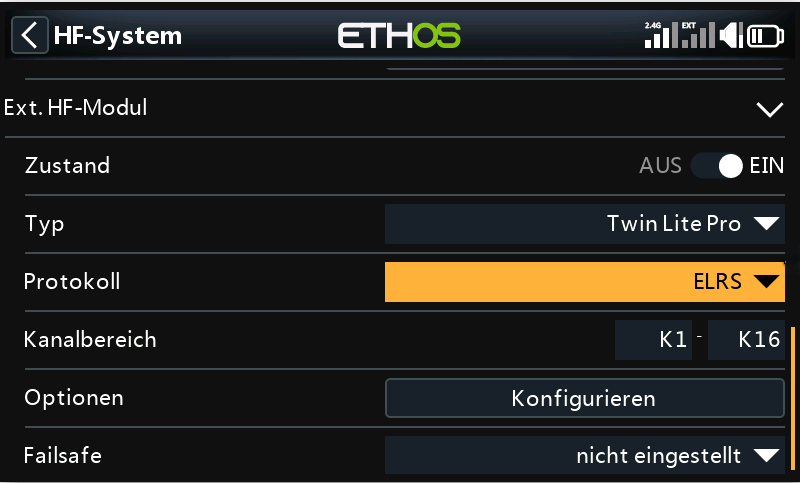

Das ELRS-Protokoll unterstützt das Open-Source-Projekt ExpressLRS. ExpressLRS 2.4G zielt darauf ab, eine umfassende Leistung in Bezug auf Geschwindigkeit, Latenz und Reichweite zu erreichen.

Wenn Sie ein echtes ELRS-Modul verwenden (und nicht das TWIN Lite Pro HF-Modul im ELRS-Modus), müssen Sie das ELRS-LUA-Skript in scripts/elrs installieren, bevor Sie ELRS als Moduloption erhalten.

##### Kanalbereich

Zwölf Kanäle werden unterstützt. Weitere Einzelheiten zu den Konfigurationsoptionen finden Sie im Abschnitt „Umschaltmodus“ weiter unten.

##### Einstellen - Konfiguration

##### Packet Rate

Mit der Paketrate kann ein Kompromiss zwischen Reichweite und Latenzzeit gefunden werden. Eine höhere Paketrate führt zu einer geringeren Latenz, allerdings auf Kosten der Reichweite.

##### Telemetrie-Verhältnis

Das Telemetrieverhältnis bestimmt, wie oft Telemetriedaten gesendet werden. Zum Beispiel bedeutet 1:64, dass Telemetriedaten alle 64 Pakete gesendet werden. Die Optionen sind 1:128, 1:64, 1:32, 1:16, 1:8, 1:4 und 1:1.

##### Modus wechseln

Die Einstellung Modus wechseln steuert, wie die AUX-Kanäle AUX1-AUX8 (Kanal 5 bis 12) an den Empfänger gesendet werden. Die ersten 4 Hauptkanäle sind immer 10-Bit. Die Optionen sind Hybrid und Wide.

Im Hybrid-Modus werden die meisten Kanäle nur 2- oder 3-Positionen haben, um die Latenz zu verringern.

Die Option „Wide“ macht Ihre Kanäle zu 64 oder 128 Bit, was für die meisten Dinge eine ausreichende Auflösung ist.

Beachten Sie, dass AUX1 (Kanal 5) für die Scharfschaltung gedacht ist und daher immer eine zweite Position hat. Niedrige Position (1000) zum Entschärfen und hohe Position (2000) zum Scharfschalten.

##### Modell Match

Wenn diese Funktion aktiviert ist, stellt sie sicher, dass das richtige Modell ausgewählt wurde.

##### TX-Leistung

##### Dynamische Leistung

Wenn Sie die Option Dynamische Leistung aktivieren, kann das System die Ausgangsleistung automatisch in Abhängigkeit von VFR und RSSI anpassen, was die Lebensdauer der Batterie verlängern kann. Dazu muss jedoch die Telemetrie aktiviert sein.

##### Leistung

Die verfügbaren Leistungseinstellungen sind 10mW, 25mW, 50mW, 100mW, 250mW, 500mW oder 1000mW.

##### ELRS-Telemetrie

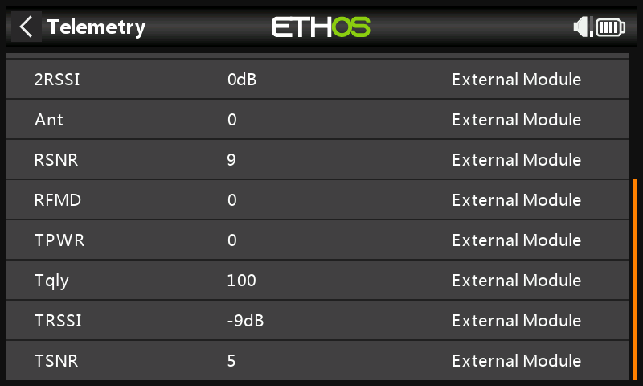

Die beiden obigen Screenshots zeigen die typischen Sensoren, die von einem ELRS-Empfänger empfangen werden.

### Typ: PPM

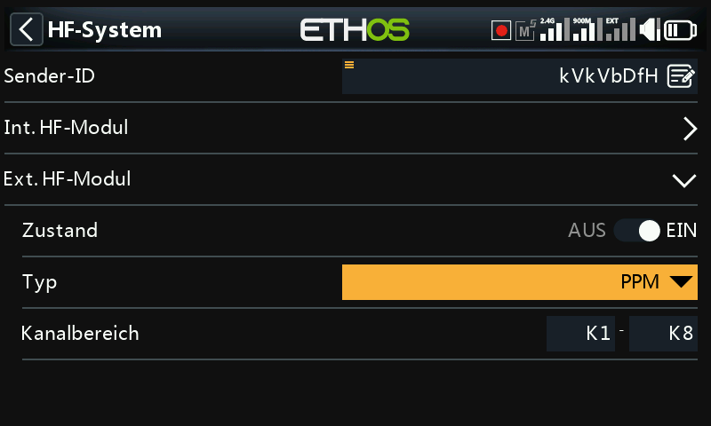

Das externe HF-Modul kann im PPM-Modus betrieben werden. Einzelheiten zur Konfiguration eines Schülers über den PPM-Ausgang am PXX OUT-Pin im externen Modulschacht finden Sie im Abschnitt „[Externes Modul](trainer.md)“ unter „Modell/Lehrer/Schüler“.

##### Kanalbereich

Standardmäßig werden die Kanäle 1 bis 8 übertragen.

### Typ: SBUS

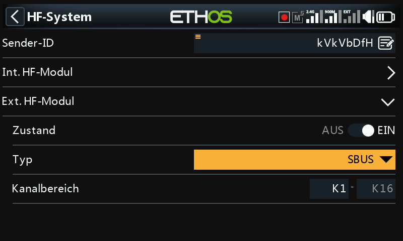

Das externe HF-Modul kann im SBUS-Modus betrieben werden. Einzelheiten zur Konfiguration eines Schülers mit SBUS Out am PXX OUT-Pin im externen Modulschacht finden Sie im Abschnitt „[Externes Modul](trainer.md)“ unter „Modell/Schüler“.

##### Kanalbereich

Standardmäßig werden im SBUS-Modus 16 Kanäle übertragen.

### Typ: Lehrer (PPM)

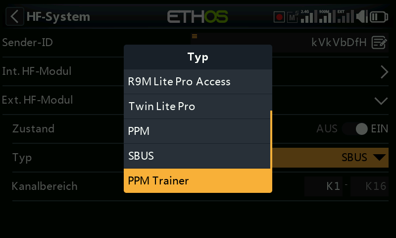

Das externe HF-Modul kann so konfiguriert werden, dass es im PPM-Modus als „Lehrer“ fungiert.

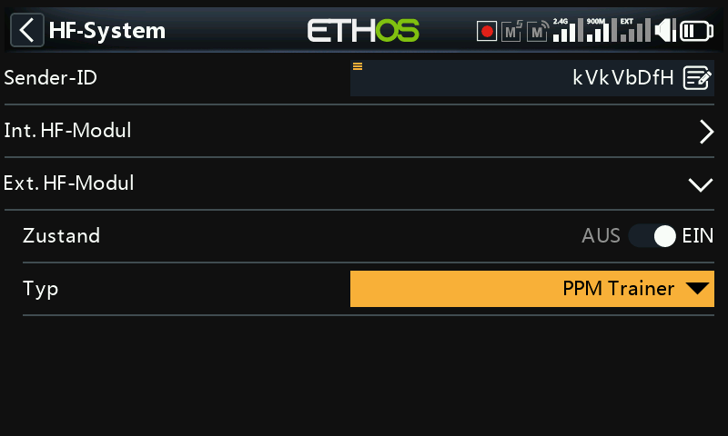

##### Lehrer Konfiguration

Weitere Informationen zur Konfiguration des Lehrer-Modus finden Sie im Abschnitt „Lehrer-Konfiguration“.

##### Anschlüsse für externe Module

Bitte beachten Sie die unten angegebenen Anschlussdetails für das externe Modul für die Option SBUS (Lehrer).

Ebenso bietet die Lehrer-PPM-Option einen PPM-Eingang am PXX IN-Pin im externen Modulschacht, der mit einem älteren Empfänger mit CPPM-Ausgang ähnlich wie die unten beschriebene SBUS-Option verwendet werden kann.

### Typ: Lehrer-Schülerbetrieb/Lehrer (SBUS)

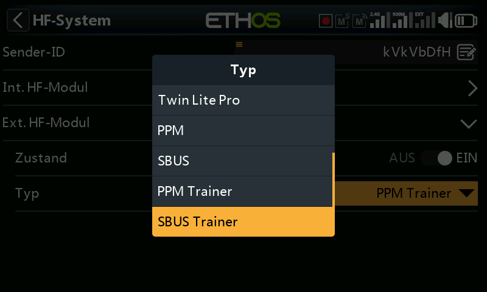

Das externe HF Modul kann so konfiguriert werden, dass es im SBUS-Modus als „Lehrer“ fungiert.

##### Lehrer-Konfiguration

Weitere Informationen zur [Konfiguration des Lehrer-Modus](trainer.md) finden Sie im Abschnitt „Lehrer-Konfiguration“.

##### Anschlüsse für externe Module

Diese Option bietet einen SBUS-Eingang am PXX IN-Pin im externen Modulschacht. Dadurch kann ein FrSky-Empfänger mit SBUS-Ausgang (z. B. Archer RS oder ähnliches) im Modulschacht installiert werden, der als Empfangsende einer drahtlosen Trainerverbindung dient, um JEDE FrSky-Funkfernsteuerung als Buddy-Box mit dem X20 zu verbinden.

Die Slave- oder Schülerfernsteuerung wird dann mit diesem Empfänger verbunden und sendet wie gewohnt. Während die Lehrer-Funktion aktiv ist, können die empfangenen Kanäle das Modell steuern.

##### Pinbelegungsschema für ein externes Modul

## Externe HF-Module - Drittanbieter

### Typ

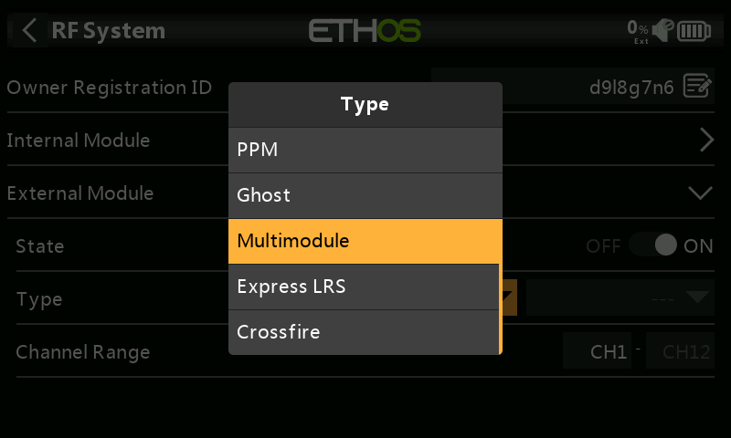

Derzeit werden die externen HF-Module Ghost, Multimodule, Express LRS und Crossfire unterstützt. Die Unterstützung für weitere Module von Drittanbietern wird in Zukunft folgen.

Die Unterstützung für Module von Drittanbietern muss vom Benutzer installiert werden und wird erreicht, indem der Benutzer ein LUA-Skript installiert, das die Modulunterstützung zu ETHOS hinzufügt. Dieser Mechanismus wird immer erforderlich sein, um Module von Drittanbietern und die vom Benutzer installierten Lua-Skripte zu verwenden. Die Auswahl für die Module von Drittanbietern erscheint nur als Auswahl auf dem HF-Bildschirm, nachdem das LUA-Skript installiert wurde.

Weitere Informationen finden Sie im Beitrag [Externe Module von Drittanbietern ](https://www.rcgroups.com/forums/showpost.php?p=49550649&postcount=18844)im X20- und Ethos-Thread auf rcgroups sowie im Abschnitt [Skripte für externe Module](../system-setup/file-manager.md), wo Sie die LUA-Skripte für die Installation der unterstützten Module von Drittanbietern finden.

#### Multimodule

Ethos unterstützt das Flashen des IRX4 Lite Multimoduls.

Kopieren Sie die Multimodul-Firmware-Datei in den Ordner „Firmware“ auf dem Sender und verwenden Sie dann den Dateimanager, um die Datei zu suchen. Tippen Sie auf den markierten Dateinamen und wählen Sie „Flash externes Multimodul“. Das Flashen beginnt, wobei der Fortschritt in einem Balkendiagramm angezeigt wird.
