# Spezial-Funktionen

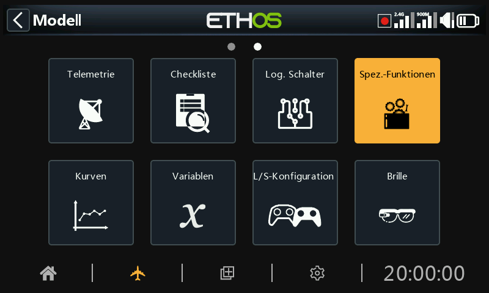

Spezialfunktionen können für die Wiedergabe von Werten, Tönen usw. konfiguriert werden. Es werden bis zu 100 Spezialunktionen unterstützt.

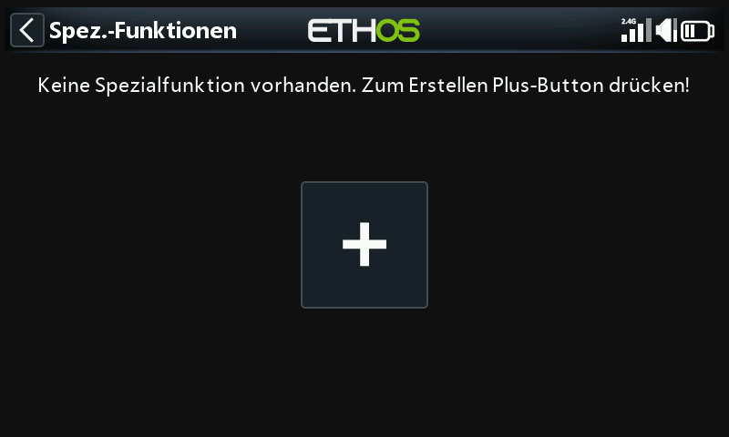

Es gibt keine voreingestellten Spezialfunktionen. Tippen Sie auf die Schaltfläche „+“ im anfänglich leeren Menü, um eine Spezialfunktion hinzuzufügen.

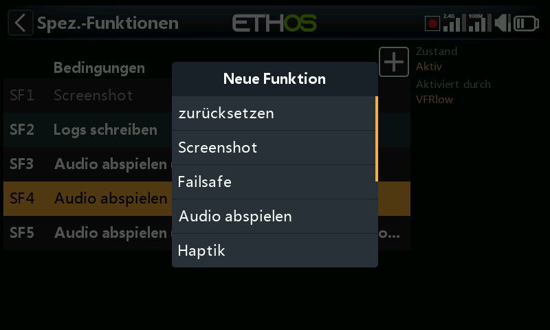

Sobald Sonderfunktionen definiert wurden, wird durch Antippen einer dieser Funktionen das oben abgebildete Popup-Menü angezeigt, über das Sie diese Sonderfunktion bearbeiten, verschieben, kopieren/einfügen, klonen oder löschen können.

Wenn Sie „Verschieben“ wählen, werden Pfeiltasten angezeigt, mit denen Sie die Sonderfunktion nach oben oder unten verschieben können.

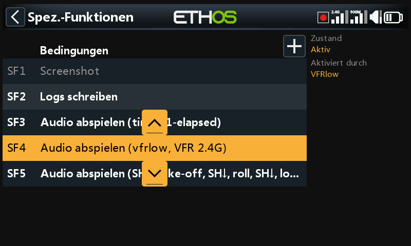

## Vorhandene Funktionen

Derzeit werden die folgenden Sonderfunktionen unterstützt:

- zurücksetzen
- Screenshot
- Failsafe
- Audio abspielen
- Haptik
- schreibe Logs
- Text abspielen (nur Sender mit Text to Speech- (TTS) Funktion)
- Weiter zum Bildschirm
- Bildschirm sperren
- Modell laden
- Vario abspielen

### SF – Allgemeine Parameter

Die folgenden Parameter sind allen Spezialfunktionen gemeinsam:

#### Zustand

Diese Spezialfunktion aktivieren oder deaktivieren.

#### Aktiviert durch

Die Spezialfunktion kann dauerhaft aktiviert sein oder durch Schalterstellungen, Funktionsschalter, Flugphasen, Logikschalter, Trimmpositionen oder Flugphasen ausgelöst werden.  
  
Um beispielsweise die Umkehrung des Schalters “SG-nach oben” auszuwählen, halten Sie die Eingabetaste gedrückt, während Sie den Schalternamen auswählen, und aktivieren Sie im Popup das Kontrollkästchen „negativ“. Der Schalterwert ändert sich dann zu „!SG-nach oben“. Dies bedeutet, dass die Sonderfunktion aktiv ist, wenn sich der Schalter SG nicht in der oberen Position befindet.

#### Global

Bei Auswahl der Option „Global“ wird die Spezialfunktion allen bestehenden Modellen sowie jedem künftig neu erstellten Modell hinzugefügt. Sollte ein bestehendes Modell bereits über diese Funktion verfügen, wird die globale Funktion als zusätzliche, neue Funktion ergänzt. Das Deaktivieren der globalen Funktion bei einem beliebigen Modell entfernt diese Funktion ausnahmslos von allen Modellen – mit Ausnahme des aktuell ausgewählten Modells.  
  
Globale Spezialfunktionen werden in der Datei „radio.bin“ gespeichert, wohingegen lokale Funktionen in der jeweiligen Modelldatei abgelegt sind. Folglich bleiben sie auch nach dem Löschen eines Modells erhalten und kennen kein Konzept eines „Originals“.

### Aktion: zurücksetzen

Bitte beachten Sie auch die oben aufgeführten „Vorhandene Funktionen“.

#### zurücksetzen

Die folgenden Kategorien können zurückgesetzt werden:

-	Flugdaten: setzt sowohl die Telemetrie als auch die Stoppuhren zurück

-   Stoppuhren alle: Setzt alle 8 Stoppuhren zurück.

-   Stoppuhr: Einzelne Stoppuhren können zurückgesetzt werden.

-   Telemetrie: Einzelne Sensoren können zurückgesetzt werden.

Bitte beachten Sie, dass die Optionen „Zurücksetzen: Flugdaten“, „Zurücksetzen: Gesamte Telemetrie“ und „Zurücksetzen: Telemetriesensor“ auch sämtliche roten Punkt-Warnungen für „Sensor verloren“ oder „Sensorkonflikt“ löschen. Bitte beachten Sie die [Warnmeldungen zu verlorenen Sensoren / Konflikten](telemetry.md).

### Aktion: Screenshot

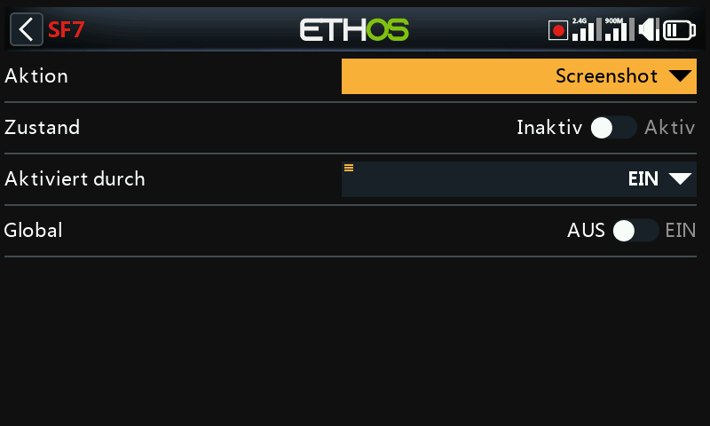

Speichert einen Screenshot im PNG-Format an folgendem Speicherort:

SD-Karte (Laufwerksbuchstabe)/Screenshots/ oder

RADIO (Laufwerksbuchstabe)/Screenshots/

Bitte beachten Sie auch die oben aufgeführten „Vorhandene Funktionen “.

### Aktion: Failsafe

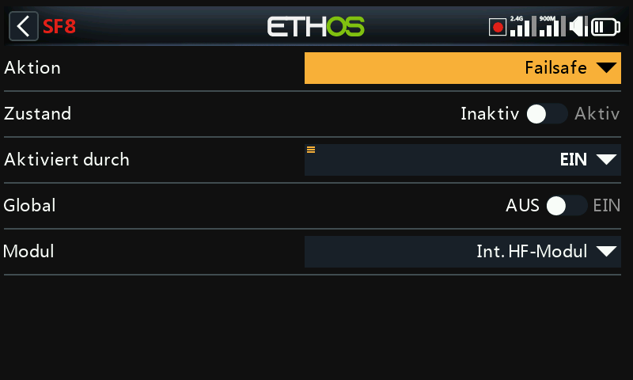

Bitte beachten Sie auch die oben aufgeführten „Vorhandene Funktionen“.

#### Zustand

Sobald die Funktion aktiviert wird, werden alle aktuellen Kanalwerte aus dem Menü „Kanäle“ in die Failsafe-Einstellungen kopiert, an den Empfänger gesendet und anschließend etwa alle 10 Sekunden erneut übertragen.

Bitte beachten Sie auch die [Failsafe](rf-system.md)-Einstellungen.

#### Modul

Wählen Sie aus, ob die Failsafe-Funktion über das interne oder das externe HF-Modul eingestellt werden soll.

### Aktion: ***AUDIO abspielen***

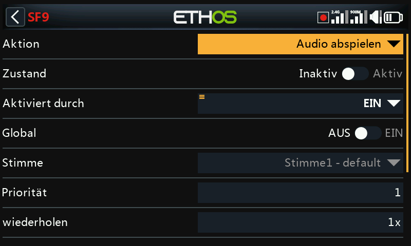

Diese Spezialfunktion dient dazu, Audiodateien oder die Werte ausgewählter Quellen mithilfe eines Sequenzers wiederzugeben. Es lässt sich eine Sequenz von bis zu 100 „Datei abspielen“- und/oder „Wert ansagen“-Befehlen konfigurieren, die nacheinander ausgeführt werden.

Bitte beachten Sie auch die oben aufgeführten „Vorhandene Funktionen “.

#### Stimme

In Ethos können bis zu 3 Stimmen konfiguriert werden. Wählen Sie die Stimme aus, die für dieses „Audio abspielen“ verwendet werden soll.

Weitere Informationen zur Konfiguration von benutzerdefinierten Stimmen und Systemstimmen finden Sie im Abschnitt [Auswahl der Stimmen](../system-setup/general.md) unter Allgemein.

#### Priorität

Die Prioritätsfunktion in „Audio abspielen“ stellt sicher, dass alle „Systemwarnungen“ sofort wiedergegeben werden.

Die Einträge „Audio abspielen“ haben standardmäßig die Priorität 1 (Standard). Daher unterbrechen alle Systemwarnungen mit der Priorität 0 alle Vorgänge mit einer niedrigeren Priorität (d. h. einer höheren Zahl).

#### wiederholen

Der Audiodatei kann einmal abgespielt oder mit der hier eingegebenen Frequenz bis zu 600s wiederholt werden.

#### Nicht beim Start

Wenn diese Option aktiviert ist, wird der Sprachtext beim Starten nicht abgespielt.

#### zurücksetzen

Wenn diese Option aktiviert ist und sich eine Sequenz im Status „Wartezeit“ oder „Wartebedingung“ befindet (oder diesen erreicht), wird die Sequenz zurückgesetzt. Wenn die „Aktive Bedingung“ weiterhin „Wahr“ ist, wird die Sequenz erneut abgespielt.

#### Sequenz

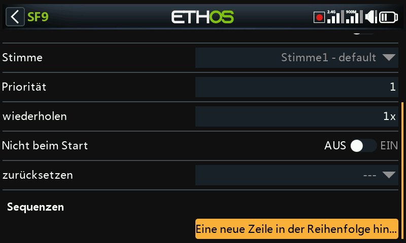

Bitte beachten Sie auch die oben aufgeführten „Vorhandene Funktionen “.

Die verfügbaren Aktionen sind:

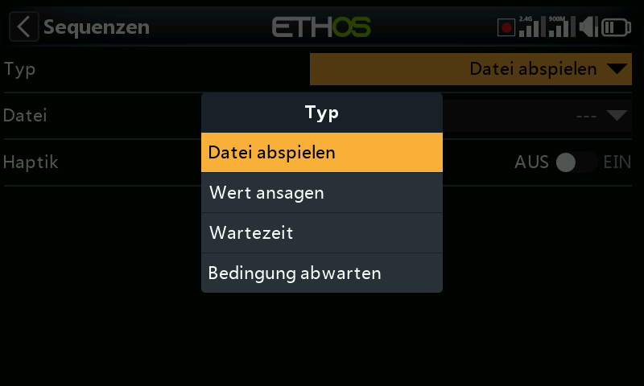

##### Datei abspielen

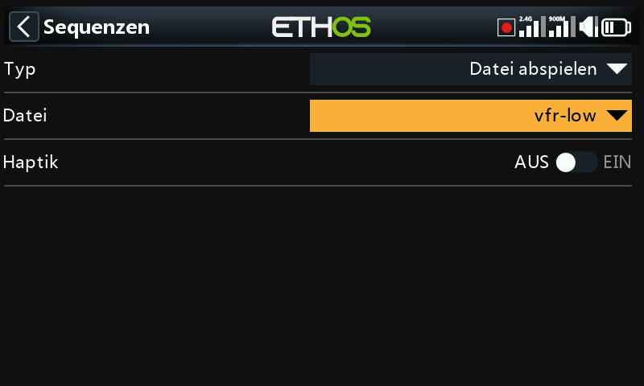

Datei abspielen gibt die ausgewählte Audiodatei wieder.

Einzelheiten über den Speicherort der Dateien usw. finden Sie im Abschnitt „Benutzer-Sounddateien“ unter „[Auswahl der Stimmen](../system-setup/general.md)“.

##### Wert ansagen

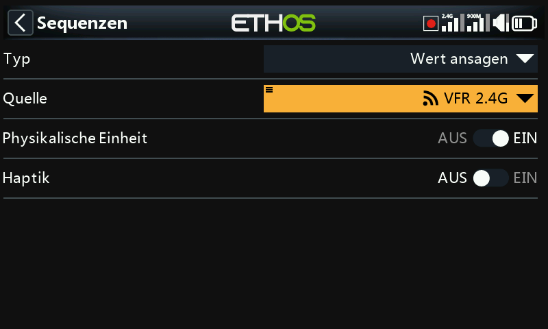

Wert ansagen gibt den Wert der ausgewählten Quelle wieder. Die Quelle kann aus einer der folgenden Quellen stammen:

-   Analog, d. h. Knüppel, Taster oder Schieberegler
    -   Schalter
    -   Logische Schalter
    -   Trimmungen
    -   Kanäle
    -   Kreisel
    -   L/S Konfiguration
    -   Trainer
    -   Stoppuhren
    -   Telemetrie

##### Wartezeit

Wartezeit fügt eine Verzögerung für die erforderliche Zeit ein, bis zu 10 Minuten.

##### Bedingung abwarten

Die Wartebedingung hält an, bis die Wartebedingung erfüllt ist.

#### Beispiele

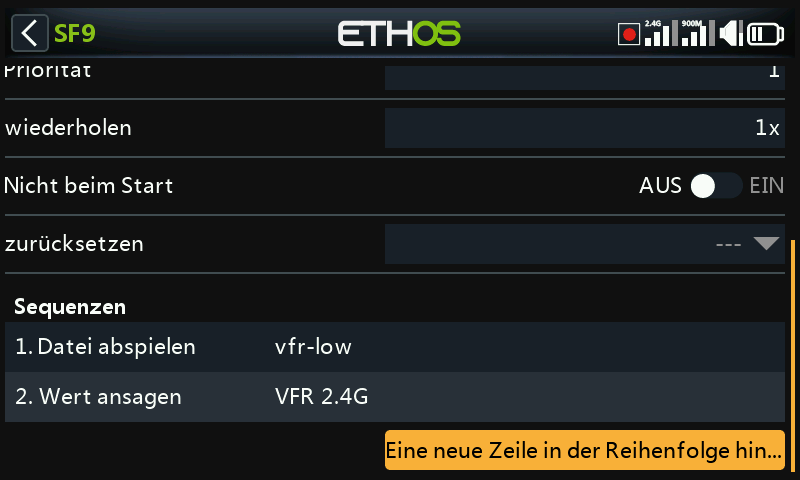

Im obigen Beispiel ist die aktive Bedingung der Logikschalter VFRlow. Wenn er aktiv wird, wird mit „Datei abspielen“ eine VFR-Niedrigwarnungs-Tondatei namens „vfrlow.wav“ abgespielt, gefolgt von „Wert abspielen“, die den (von der Telemetrie) aufgezeichneten minimalen VFR-Wert wiedergibt.

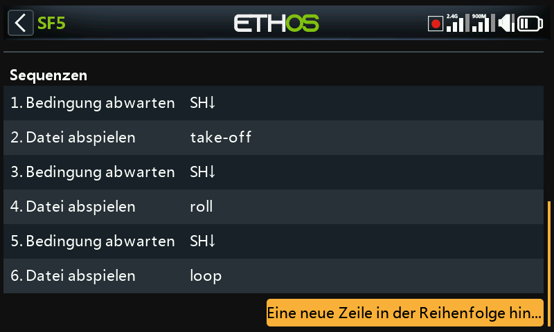

Dieses Beispiel zeigt die Verwendung der „Wartebedingung“, um die Sequenz anzuhalten, bis der Schalter SH in die untere Position gebracht wird.

#### Verwaltung der Sequenzen

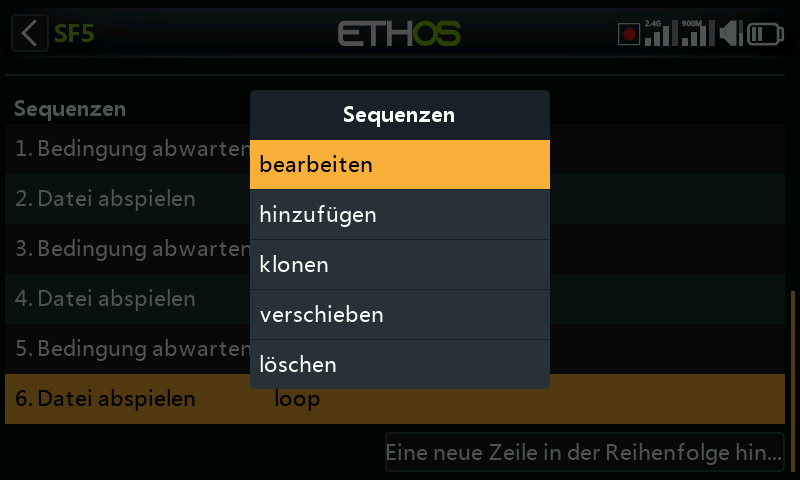

Wenn Sie auf eine Sequenzzeile tippen, wird ein Dialogfeld angezeigt, in dem Sie die Zeile bearbeiten, eine neue Zeile hinzufügen, klonen, die Zeile nach oben oder unten verschieben oder die Zeile löschen können.

### Aktion: Haptik

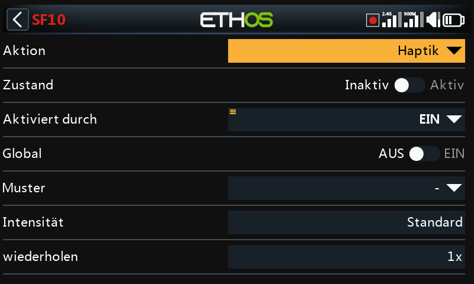

Diese spezielle Funktion weist haptische Vibrationen zu.

Bitte beachten Sie auch die oben aufgeführten „Vorhandene Funktionen “.

#### Vibrationsmuster

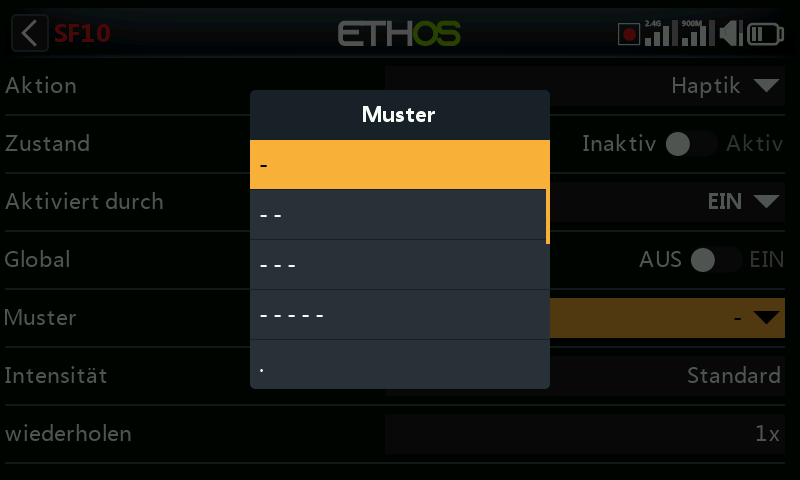

Legt das Muster der Haptik fest. Die Optionen sind einfach, doppelt, dreifach, fünffach und sehr kurz.

#### Intensität

Wählen Sie die Stärke der haptischen Vibration, zwischen 1 und 10. Die Standardeinstellung ist 5.

#### Repeat

Die Haptik kann einmalig oder in der hier eingegebenen Häufigkeit wiederholt werden.

#### Haptikmotoren auswählen

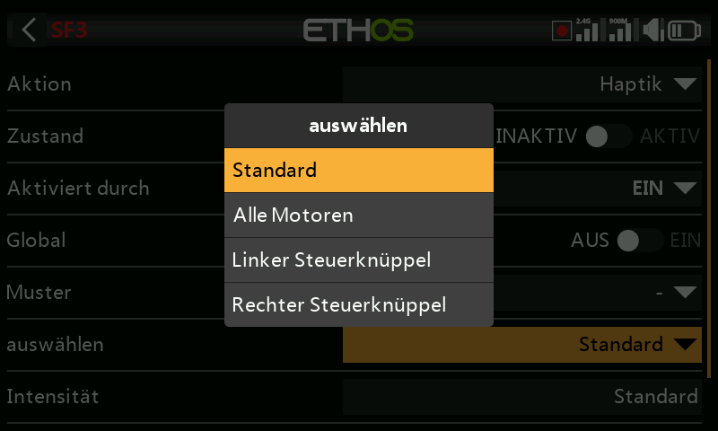

Der X20 Pro AW und der X20RS verfügen über Optionen für haptische Feedback-Motoren für die Steuerknüppel.

Beachten Sie, dass der X20 Pro und der X20R durch den Einbau von MC20R-Haptik-Steuerknüppel aufgerüstet werden können. Informationen zum Aktivieren dieser Option finden Sie unter „Aktivieren von Haptik-Steuerknüppel-Upgrades“.

Sie können zwischen folgenden Optionen wählen:

• Standard (interne haptische Rückmeldung)

• Alle Motoren

• Haptische Rückmeldung für linken Steuerknüppel

• Haptische Rückmeldung für rechten Steuerknüppel

### Aktion: Logs schreiben

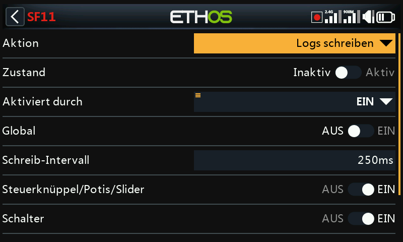

Diese Spezialfunktion dient dazu, die periodische Protokollierung von Steuerknüppeln/Potentiometern/Schiebereglern, Schaltern, Logikschaltern und Kanalwerten in eine .csv-Datei zu konfigurieren.

Logdateien werden im „.csv“-Format im Ordner „Logs“ auf der SD-Karte oder dem eMMC-Speicher abgelegt. Uhrzeit und Datum der Systemuhr werden gemeinsam mit den Daten protokolliert; sie sind von entscheidender Bedeutung, um die Daten durch eine Unterteilung der Log-Einträge in Sitzungen sinnvoll interpretieren zu können.

#### Schreibe Intervall

Das Schreibintervall für die Protokolle ist vom Benutzer zwischen 50 und 1000 ms einstellbar.

#### Steuerknüppel/Potis/Sliders

Ermöglicht die Protokollierung von Knüppel/Potis/Sliders.

#### Schalter

Aktiviert die Protokollierung von Schaltern.

#### Logische Schalter

Ermöglicht die Protokollierung der Logikschalter.

#### Kanäle

Ermöglicht die Protokollierung der an das HF-Modul gesendeten Kanäle.

#### Log Viewer

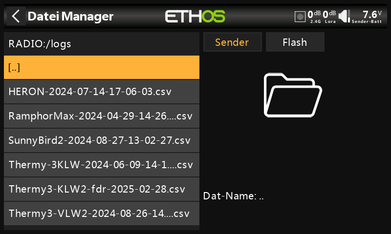

Um Protokolldateien anzuzeigen, navigieren Sie mit dem Datei-Explorer zum Ordner /Logs auf der eMMC oder der SD-Karte, tippen Sie dann auf die gewünschte Protokolldatei und wählen Sie öffnen.

1. Die Protokolldatei wird in den Speicher eingelesen, kann aber während des Lesens abgebrochen werden.

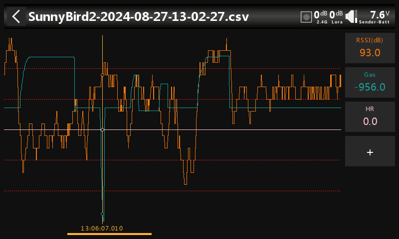

2. Wählen Sie die Kanäle aus, die auf der rechten Seite angezeigt werden sollen. In diesem Beispiel wurden die Kanäle „Gas“ und „Höhenruder“ ausgewählt. RSSI ist standardmäßig ausgewählt.

Mit der Taste \[DISP\] wird der Fokus auf die erste Schaltfläche in der rechten Spalte gesetzt.

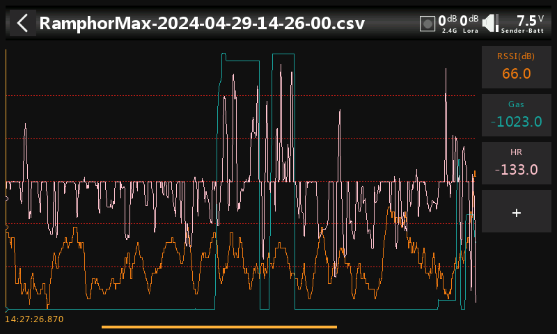

3. Die Anzeige kann mit dem Drehgeber oder durch Wischen nach links oder rechts verschoben werden. Der obige Screenshot wurde im Vergleich zum vorherigen Screenshot nach links verschoben.

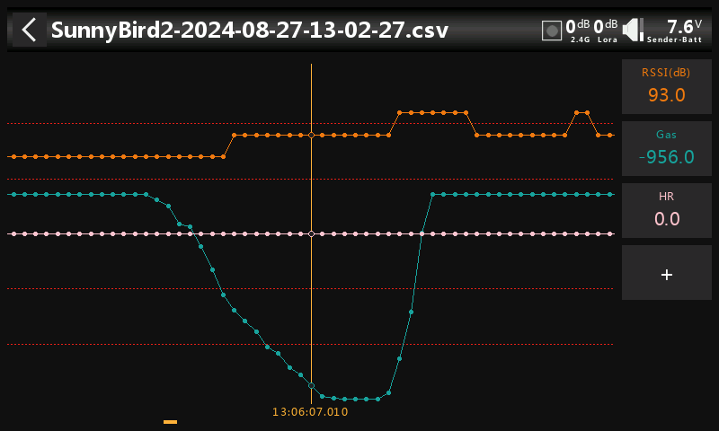

4. Die Anzeige kann durch Drehen des Drehgebers bei gedrückter PgUp/Dn-Taste (Seitentaste) vergrößert oder verkleinert werden.

### Aktion: Text abspielen (nur Sender mit Text to Speech- (TTS) Funktion)

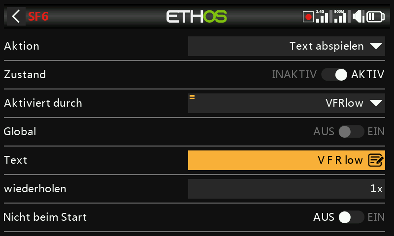

Diese Spezialfunktion nutzt einen internen Hardware-TTS-Prozessor (Text-To-Speech), um aus dem vom Benutzer eingegebenen Text gesprochenen Text zu erzeugen, anstatt zuvor vorbereitete .wav-Dateien abzuspielen.

Bitte beachten Sie auch die oben aufgeführten „Allgemeine Parameter“.

#### Text

Die vom Benutzer angegebene Textfolge, die in Sprache umgewandelt und abgespielt werden soll. Die Verwendung von Großbuchstaben führt dazu, dass das Wort Buchstabe für Buchstabe buchstabiert wird, z. B. wird „OFF“ als O-F-F wiedergegeben. Wenn Sie Kleinbuchstaben verwenden, sagt TTS, dass Sie das Wort „aus“ sagen möchten.

#### wiederholen

Der Sprachtext kann einmal abgespielt oder in der hier eingegebenen Häufigkeit wiederholt werden.

#### Nicht beim Start

Wenn diese Option aktiviert ist, wird der Sprachtext beim Starten nicht abgespielt.

### Aktion: Weiter zum Bildschirm

Mit dieser Spezialfunktion wird die Anzeige auf eine ausgewählte Seite umgeschaltet.

Bitte beachten Sie auch die oben aufgeführten „Allgemeine Parameter“.

#### Bildschirm

Wählen Sie die anzuzeigende Sender-Bildschirmseite aus.

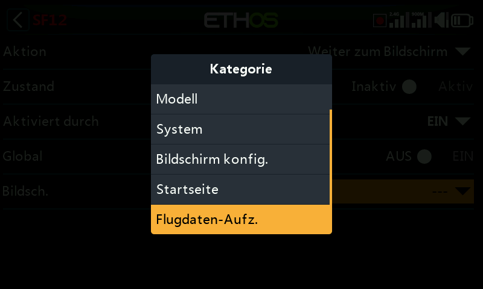

Der Zielbildschirm kann eine beliebige Modell-, System- oder Konfigurationsbildschirmseite, die Startseite oder die „Flugdatenaufzeichnung“ für den ausgewählten Empfänger sein.

### Action: Bildschirm sperren

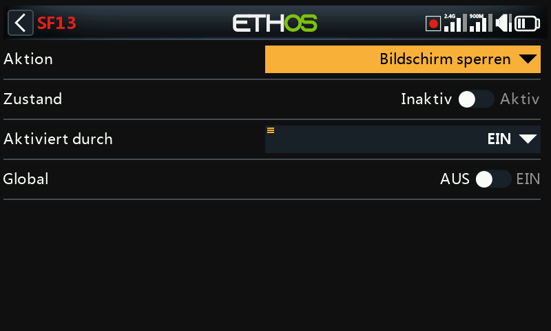

Mit dieser Spezialfunktion wird der Touchscreen gesperrt, um eine versehentliche Bedienung zu verhindern.

Bitte beachten Sie, dass die Funktion „Bildschirm sperren“ auch durch gleichzeitiges Drücken von \[ENT\] und \[Page\] für 1 Sekunde auf dem Startbildschirm verfügbar ist.

Bitte beachten Sie auch die oben aufgeführten „Allgemeine Parameter“.

### Action: Modell laden

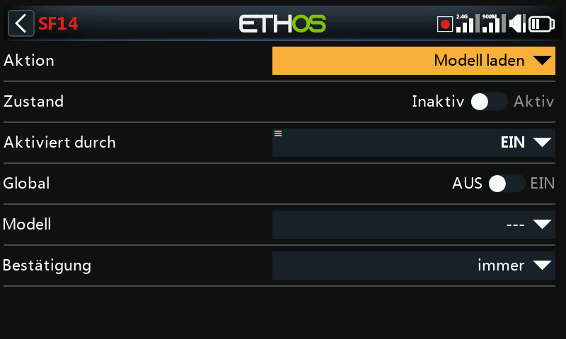

Mit dieser Spezialfunktion wird ein bestimmtes Modell geladen, wenn die „Aktiv-Bedingung“ erfüllt ist.

Bitte beachten Sie auch die oben aufgeführten „Allgemeine Parameter“.

#### Modell

Wählen Sie das gewünschte Modell, das geladen werden soll und bestätigen Sie mit ‚Enter’

#### Bestätigung

Wählen Sie aus, ob und wie die Bestätigung erfolgen soll.

### Aktion: Vario abspielen

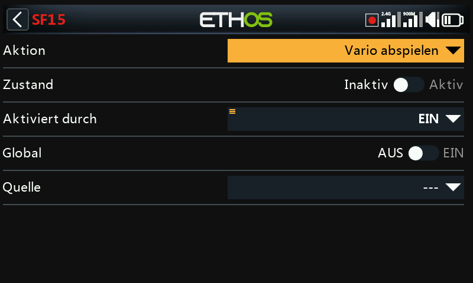

Ermöglicht die Auswahl einer Quelle für das Vario.

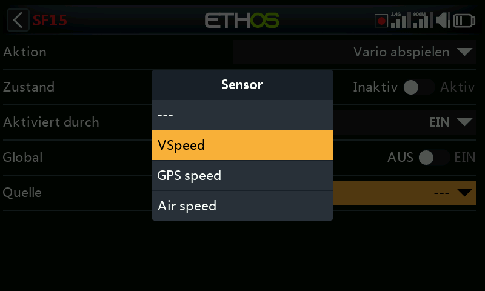

Die Vorgabe ist normalerweise der VSpeed-Sensor des FrSky Varios, aber jeder Sensor mit der Einheit m/s kann verwendet werden.

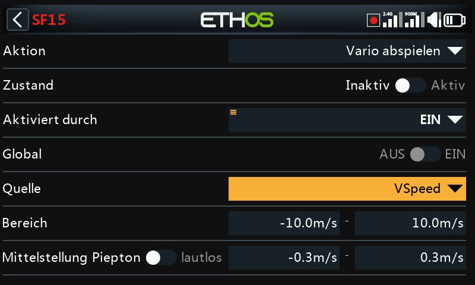

Sobald die Quelle ausgewählt wurde, erscheinen die Parameter Bereich und Zentrum.

#### Bereich

Die voreingestellte Steig- oder Sinkgeschwindigkeit beträgt +/- 10m/s, kann aber auf bis zu +/- 17m/s erhöht werden.

Wenn die Steigrate über dem unten angegebenen Mittelwert liegt, erhöht sich die Tonhöhe der Vario-Pieptöne linear, bis der maximale Bereichswert erreicht ist. Die Tonhöhe bei maximaler Steigrate kann im [Abschnitt Vario](../system-setup/general.md) der Audioeinstellungen konfiguriert werden.

Der Ton ist kontinuierlich, wenn die Steigrate sinkt. Die Tonhöhe nimmt linear ab, bis der minimale Reichweitenwert erreicht ist.

#### Mittelstellung

Der Standardbereich, der eine Steigrate von Null definiert, beträgt +/- 0,3m/s, kann aber auf bis zu +/- 2m/s erhöht werden.

Die Tonhöhe der Vario-Pieptöne ist konstant, wenn die Steigrate zwischen diesen Mittelwerten liegt. Die Tonhöhe bei einer Steigrate von Null kann im [Abschnitt Vario](../system-setup/general.md) der Audioeinstellungen konfiguriert werden.

Die Signaltöne können durch Umschalten von 'Piepton' auf 'lautlos' stumm geschaltet werden.
