# Telemetrie

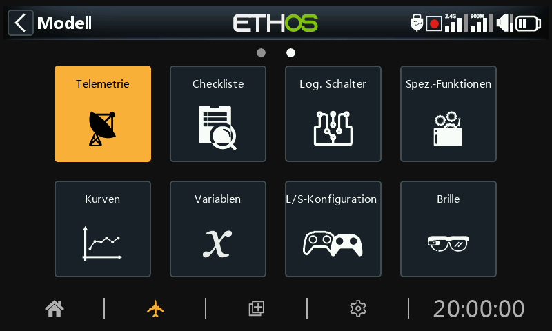

FrSky bietet ein sehr umfassendes Telemetriesystem. Die Leistung der Telemetrie hat das RC-Hobby auf eine ganz neue Ebene gehoben und ermöglicht viel mehr Raffinesse und eine viel reichere Erfahrung im Modellbau.

## Smart Port Telemetrie

Die Sensoren der FrSky-Serie sind ohne Hub konzipiert. Smart Port (S.Port) verwendet einen dreiadrigen physikalischen Bus, der aus GND (V-), V+ und Signal besteht. S.Port-Telemetriegeräte werden in beliebiger Reihenfolge aneinandergereiht und an den S.Port-Anschluss kompatibler Empfänger der Serien X und S und später angeschlossen. Der Empfänger kann über diese Verbindung mit vielen kompatiblen Geräten eine Halbduplex-Kommunikation mit einer Rate von 57600 bps (F.Port und FBUS sind schneller) mit wenigen oder keinen manuellen Einstellungen erreichen.

### Physikalische ID

Smart Port unterstützt bis zu 28 Geräte einschließlich des Host-Receivers. Jedes Gerät muss eine eindeutige physikalische ID haben, um sicherzustellen, dass es bei der Kommunikation nicht zu Konflikten kommt. Physikalische IDs können zwischen 00 hex und 1B hex (zwischen 00 und 27 dezimal) liegen.

| Dec. | Hex | Physische Standard-ID |  | Dec. | Hex | Physische Standard-ID |
| --- | --- | --- | --- | --- | --- | --- |
| 00 | 00 | Vario |  | 14 | 0E |  |
| 01 | 01 | FLVSS |  | 15 | 0F |  |
| 02 | 02 | Current |  | 16 | 10 | SD1 |
| 03 | 03 | GPS |  | 17 | 11 |  |
| 04 | 04 | RPM |  | 18 | 12 | VS600 |
| 05 | 05 | SP2UART (Host) |  | 19 | 13 |  |
| 06 | 06 | SP2UART (Remote) |  | 20 | 14 |  |
| 07 | 07 | FAS-xxx |  | 21 | 15 |  |
| 08 | 08 | TBD(SBEC) |  | 22 | 16 | Gas Suite |
| 09 | 09 | Air Speed |  | 23 | 17 | FSD |
| 10 | 0A | ESC |  | 24 | 18 | Gateway |
| 11 | 0B |  |  | 25 | 19 | Redundanz Bus |
| 12 | 0C | XACT Servo |  | 26 | 1A | SxR |
| 13 | 0D |  |  | 27 | 1B | Bus Master |

In der obigen Tabelle sind die Standard-Physikalische IDs der FrSky S.Port-Geräte aufgeführt. Bitte beachten Sie, dass, wenn Sie mehr als eines dieser Geräte haben, die Physikalische ID der doppelten Geräte geändert werden muss, um sicherzustellen, dass jedes Gerät in der S.Port-Kette eine eindeutige Physikalische ID hat.

### Anwendungs-ID

Jeder Sensor kann mehrere Anwendungs-IDs haben, eine für jeden gesendeten Sensorwert. Die physikalische ID und die Anwendungs-ID sind unabhängig und nicht miteinander verbunden. Der Variometersensor hat beispielsweise nur eine physikalische ID (Standardwert 00), aber zwei Anwendungs-IDs: eine für die Höhe (0100) und die andere für die vertikale Geschwindigkeit (0110).

Ein weiteres Beispiel ist der FLVS-Lipo-Spannungssensor, der eine physikalische ID (Standardwert 01) und eine Anwendungs-ID für Spannung (0300) hat. Wenn Sie zwei FLVS-Sensoren verwenden möchten, um zwei 6S-Lipo-Packs zu überwachen, müssen Sie die Gerätekonfiguration verwenden, um die physikalische ID des zweiten FLVS auf einen leeren Steckplatz (z. B. 0F hex) zu ändern, und auch die Anwendungs-ID von z. B. 0300 auf 0301 ändern. Da die Physikalische ID und die Anwendungs-ID unabhängig voneinander sind und in keinem Zusammenhang stehen, müssen beide geändert werden. Die physikalische ID muss für die ausschließliche Kommunikation mit dem Host-Empfänger geändert werden, und die Anwendungs-ID muss geändert werden, damit der Empfänger zwischen den Daten von Lipo 1 und 2 unterscheiden kann.

Hinweis: Bei speziellen Anwendungen ist es möglich, dass Sensoren mit derselben Anwendungs-ID und unterschiedlichen physikalischen IDs vorhanden sind, wenn die Sensorkonfliktwarnung deaktiviert ist. Bitte lesen Sie im Abschnitt [Sensorkonfliktwarnung](../system-setup/alerts.md) nach, wie Sie die Warnung deaktivieren können.

| Sensor | Anwendungs-ID | Parameter |
| --- | --- | --- |
| Vario | 010x | Höhe |
|  | 011x | Steigrate Vario |
| FLVSS Lipo Voltage Sensor | 030x | Lipo Spannung |
| FAS100S Current Sensor | 020x | Strom |
|  | 021x | VFAS |
|  | 040x | Temperatur 1 |
|  | 041x | Temperatur 2 |
| XAct Servo | 680x | Strom, Spannung, Temperatur |

Oben finden Sie einige Beispiele für Anwendungs-IDs. Bitte beachten Sie, dass der Parameter Anwendungs-ID in Gerätekonfiguration eine Dropdown-Liste mit 4 Ziffern zur Auswahl bietet; die vierte Ziffer ist standardmäßig 0, kann aber in einem Bereich von 0 bis F hex (0, 1, 2, 3, 4, 5, 6, 7, 8, 9, A, B, C, D, E, F) geändert werden, um sicherzustellen, dass alle Anwendungs-IDs eindeutig sind.

Bitte beachten Sie auch Folgendes:

a) Ein Gerät kann mehr als einen Bereich von Anwendungs-IDs haben, siehe zum Beispiel den Stromsensor oben.

b) Wenn zwei redundante Empfänger mit ihren S.Port-Telemetrieanschlüssen verbunden sind, werden Pakete für einen bestimmten Sensor, die von einem der beiden Empfänger empfangen werden, zusammengeführt, auch wenn der redundante Empfänger auf einem anderen Band oder Modul ist.

### S.Port Hauptmerkmale:

Jeder über Telemetrie empfangene Wert wird als separater Sensor behandelt, der seine eigenen Eigenschaften hat, z. B.

-     den Sensorwert
- die S.Port Physikalische ID-Nummer und die Data-ID (auch bekannt als                 Applikation ID)
-     den Namen des Sensors (editierbar)
-     die Maßeinheit
-     die Anzahl der Dezimalstellen
-     die Option zur Protokollierung auf der SD-Karte oder eMMC

Der Sensor hält auch seinen Minimal-/Maximalwert fest.

Wie bereits erwähnt, können mehr als ein Sensor desselben Typs angeschlossen werden, aber die Physikalische ID muss in „Sensorkonfiguration“ (oder mit der FrSky AirLink App oder SBUS Servo Changer SCC) geändert werden, um sicherzustellen, dass jeder Sensor in der S.Port-Kette eine eindeutige Physikalische ID hat. Beispiele sind ein Sensor für jede Zelle in einem 2 x 6S Lipo oder die Überwachung einzelner Motorströme in einem Mehrmotorenmodell.

Ein und derselbe Sensor kann dupliziert werden, z. B. mit unterschiedlichen Einheiten oder für Berechnungen wie absolute Höhe, Höhe über dem Startpunkt, Entfernung usw.

Jeder Sensor kann einzeln mit einer speziellen Funktion zurückgesetzt werden, so dass Sie zum Beispiel Ihren Höhenoffset auf Ihren Startpunkt zurücksetzen können, ohne dass alle anderen Min-/Max-Werte verloren gehen.

Einmal eingerichtete FrSky-Sensoren werden automatisch erkannt, sobald das gesamte System eingeschaltet wird. Bei der Erstinstallation müssen sie jedoch manuell „gesucht“ werden, damit das System sie erkennt.

Telemetriesensoren können

- in Sprachansagen abgespielt werden
- in berechneten Sensoren verwendet werden
- in logischen Schaltern für Alarme usw. werden
- in Vars verwendet werden
- in Mischungen für proportionale Aktionen verwendet werden
- in benutzerdefinierten Telemetrie-Bildschirmen angezeigt werden
- direkt auf der Telemetrie-Einrichtungsseite angezeigt werden, ohne dass ein benutzerdefinierter Telemetrie-Bildschirm konfiguriert werden muss

Die Anzeigen werden aktualisiert, sobald Daten empfangen werden und ein Verlust der Sensorkommunikation erkannt wird.

## FBUS-Steuerung und Telemetrie

Das FBUS-Protokoll (früher F.Port 2.0) ist ein aktualisiertes Protokoll, das SBUS für die Steuerung und S.Port für die Telemetrie in einer Leitung integriert. Dieses neue Protokoll ermöglicht es einem Host-Gerät, auf einer Leitung mit mehreren Slave-Geräten zu kommunizieren. So werden z.B. FBUS-Servos über eine auf einer verketteten Verbindung gesteuert und gleichzeitig ihre Servo-Telemetrie über dieselbe Verbindung zurück an den Empfänger gesendet. Alle FBUS-Geräte, die an einen Empfänger (Host) angeschlossen sind, können drahtlos über den Sender mit diesem Protokoll konfiguriert werden.

Die FBUS-Baudrate beträgt 460.800 bps, während F.Port bei 115.200 und S.Port bei 57.600 bps liegt. Allein diese Tatsache macht die drei Protokolle inkompatibel zueinander.

## Telemetriefunktionen in ACCESS

Die Ein-Empfänger-Telemetrie mit ACCESS funktioniert genauso wie zuvor mit ACCST.

### Telemetrie mit mehreren Empfängern

ACCESS Trio Steuerung bietet die Möglichkeit, drei Empfänger für jeden HF-Pfad in ACCESS-Sendern zu registrieren und zu binden. Die drei Empfänger sind im HF-Menü des Senders an die Positionen RX1, RX2 und RX3 gebunden, so dass ein individueller Zugriff auf die Empfänger möglich ist, um die Anschlussstifte zuzuordnen und andere Änderungen am Empfänger vorzunehmen.

ACCESS hat normalerweise einen eingehenden Telemetriepfad für jede HF-Verbindung oder eine Verbindung für jedes HF-Modul. Eine Ausnahme bilden die Tandemsysteme mit einem HF-Modul, das über einen 2,4- und einen 900m-Abschnitt für zwei HF-Pfade verfügt. Der Empfänger der Telemetriequelle kann sich während eines Fluges je nach HF-Bedingungen ändern. ETHOS verfügt über einen RX-Sensor, der die Telemetriequelle in Echtzeit anzeigt und die Daten des RX-Sensors aufzeichnet.

Die gebräuchlichste Anwendung mit S.Port wäre die Verkettung der S.Port-Sensorkette mit allen 3 Empfängern, die sich eine gemeinsame Stromversorgung teilen sollten.

- Registrieren und binden Sie die Empfänger (siehe Modell-Setup).
- Verbinden Sie die Smart Ports des Sensors und des Empfängers in einer Reihenschaltung (Daisy Chain).
- Erkennen Sie neue Sensoren (siehe [Telemetrie-Setup](#Lesezeichen 38)), und prüfen Sie sorgfältig, ob die Smart Port-Umschaltung korrekt funktioniert.

Die Telemetriequelle wird je nach aktivem RX automatisch umgeschaltet. Der interne RX-Sensor zeigt die ID des aktiven RX an, der Telemetrie sendet, d. h. RX1, RX2 oder RX3.

Wenn die Telemetriequelle des Empfängers wechselt, wird die Verknüpfung der S.Ports des Empfängers automatisch die Telemetrie von über S.Port angeschlossenen externen Sensoren fortsetzen. Bitte beachten Sie jedoch, dass die internen Sensoren des Empfängers nicht verbunden werden. Die Sensordaten RSSI, VFR, RxBatt, ADC2 und RX(n) werden für den Quell-Empfänger gesendet, so dass sie sich je nach Quelle ändern.

Gleichzeitige Telemetrie von drei Empfängern wird später folgen. Weitere Entwicklungen in diesem Bereich sind zu erwarten.

### Sensor-Typen:

#### 1. Interne Sensoren

FrSky-Sender und -Empfänger verfügen über integrierte Telemetriefunktionen zur Überwachung der Stärke des vom Modell empfangenen Signals.

Signalstärkeanzeige des Empfängers (RSSI): Ein Wert, der vom Empfänger Ihres Modells an den Sender übermittelt wird und angibt, wie stark das Signal ist, das vom Modell empfangen wird. Es können Warnungen eingerichtet werden, die Sie warnen, wenn der Wert unter einen Mindestwert fällt, was bedeutet, dass Sie Gefahr laufen, außerhalb der Reichweite zu fliegen. Zu den Faktoren, die die Signalqualität beeinflussen, gehören externe Störungen, zu große Entfernungen, schlecht ausgerichtete oder beschädigte Antennen usw.

Die Standardalarme für die Modi ACCESS, TD und TW sind 35 für „RSSI NIEDRIG“ und 32 für „RSSI KRITISCH“. Der Kontrollverlust tritt ein, wenn der RSSI-Wert auf etwa 28 fällt.

##### Individueller RSSI-Alarm pro Band

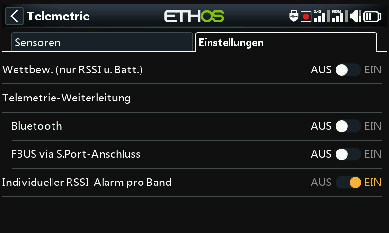

Bei Verwendung der TD- oder TW-Protokolle gibt es auf der Registerkarte „Einstellungen“ die Option, individuelle RSSI-Sprachwarnungen für jedes Band zu erhalten.

Wenn diese Option deaktiviert ist, erhalten Sie nur eine RSSI-Warnung (niedrig oder kritisch) pro internem oder externem HF-Modul. Die ETHOS-Logik überwacht, dass beide RSSIs unter dem eingestellten Schwellenwert liegen, bevor die Warnmeldung ausgegeben wird. Es wird auch eine Warnung ausgegeben, wenn keine RSSI-Sensoren entdeckt werden.

Wenn diese Option aktiviert ist, erhalten Sie bei einem TD-Empfänger RSSI-Warnungen für jedes verwendete Band, d. h. 2,4G und 900M. Bei einem TW-Empfänger erhalten Sie RSSI-Warnungen für jedes verwendete Band, d. h. 2.4FSK und 2.4LoRa und 900M.

Die Standardalarme für ACCESS sind ebenfalls 35 für „RSSI schwach“ und 32 für „RSSI kritisch“. Der Kontrollverlust tritt ein, wenn der RSSI-Wert auf etwa 28 fällt.

Die Standardalarme für ACCST sind 45 bzw. 42. Der Kontrollverlust tritt ein, wenn der RSSI-Wert für ACCST auf etwa 38 fällt.

Die Warnung, wenn die Telemetrie vollständig verloren gegangen ist, wird als „Telemetrie verloren“ angekündigt. Beachten Sie, dass weitere Alarme NICHT ertönen, da die Telemetrieverbindung ausgefallen ist und der Sender Sie nicht mehr vor einem RSSI oder einem anderen Alarmzustand warnen kann. In dieser Situation ist es ratsam, umzukehren und das Problem zu untersuchen.

Beachten Sie, dass bei zu geringem Abstand zwischen Sender und Empfänger (weniger als 1 m) der Empfänger überlastet werden kann, was zu einer störenden Alarmschleife „Telemetrie verloren“ - „Telemetrie wiederhergestellt“ führt.

RSSI ist weniger wertvoll als VFR, um den Zustand der Kontrollverbindung zu bestimmen, aber es ist ein guter Näherungswert für die effektive Reichweite der Verbindung.

Vor ACCESS V2.1 basierte RSSI auf einer Kombination aus der empfangenen Signalstärke und der Rate der verlorenen Framen. Verlorene Frame wurden nun aus der RSSI-Berechnung entfernt und als neuer Sensor VFR (Valid Frame Rate) hinzugefügt, um ein Maß für die Verbindungsqualität zu erhalten.

VFR ist die Anzahl der gültigen Datenpakete pro 100 empfangene Pakete.

Es kann eine Warnung eingerichtet werden, die Sie warnt, wenn die VFR unter einen Mindestwert fällt, was bedeutet, dass die Verbindungsqualität gefährlich niedrig wird. Der Standardwert für die „Warnung bei niedrigem Wert“ ist 50.

Empfänger wie der TD (2.4 FSK und 900m) und TW (2.4 FSK und 2.4 LoRa) haben jeweils zwei RSSI- und zwei VFR-Telemetrie-Streams und Warnungen. Derzeit überwacht die ETHOS-Logik, dass beide VFRs unter dem Schwellenwert liegen, bevor die Warnmeldung ausgegeben wird.

##### Rx VFR

Beachten Sie, dass die TD-, TW-, AP- und AP Plus-Empfänger einen neuen Telemetriewert „Rx VFR“ haben. Je nach Empfängertyp sehen Sie eine VFR für FSK, eine VFR für Lora, eine VFR für 900M sowie die neue RX VFR.

Der Rx VFR bezieht seine Daten von FSK oder Lora oder 900M, je nachdem, von welchem Band Frames empfangen werden. Auch wenn ein Frame nur auf einem Band empfangen wird, wird er als auf Rx-Ebene empfangen betrachtet.

Ein weiterer interner Standardsensor ist die Spannung mit dem der Empfänger versorgt wird.

Einige Empfänger unterstützen einen zweiten analogen Spannungseingang, der in der Telemetrie als Sensor ADC2 verfügbar ist. Die Empfänger haben dafür die Aufschrift ‚AIN2‘

#### 2. „Externe“ Sensoren

Das aktuelle FrSky-Telemetriesystem nutzt die FrSky Smart Port-Sensoren. Die telemetriefähigen Empfänger der X- und S-Serie und späterer Serien verfügen über die Smart Port-Schnittstelle. Mehrere Smart-Port-Sensoren können in Reihe geschaltet werden, wodurch das System einfach zu implementieren ist. Die meisten Empfänger verfügen auch über einen oder beide A1/A2-Analogeingänge, die für die Überwachung der Batteriespannung usw. nützlich sind.

## Telemetrie-Einstellungen

### Übersicht

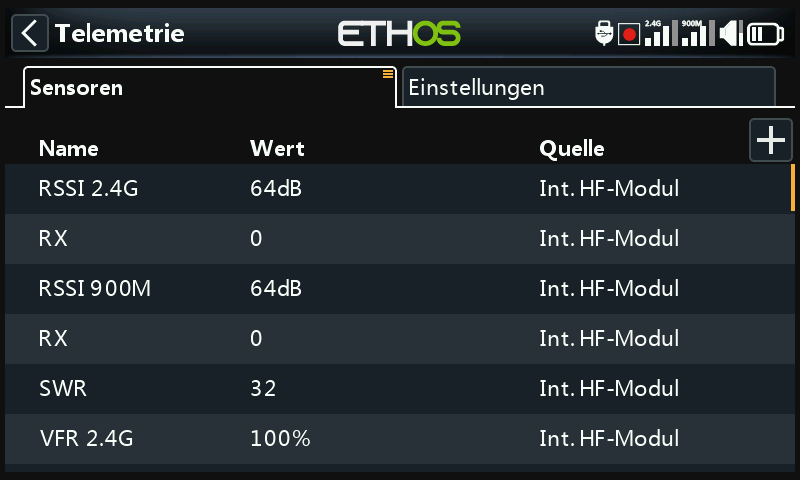

In „Telemetrie“ gibt es zwei Registerkarten.

### Registerkarte „Sensoren“

Die Registerkarte „Sensoren“ dient dazu, neue Sensoren zu erkennen, selbst erstellte und berechnete Sensoren hinzuzufügen sowie Sensoren zu bearbeiten. Es werden bis zu 100 Sensoren unterstützt.

Es können berechnete Sensoren hinzugefügt werden, darunter Verbrauch, Entfernung und Strecke (Trip), Multi-Lipo, Prozent, Leistung und Benutzerdefiniert.

Zu den Bearbeitungsoptionen für Sensoren gehören die Datenerfassung und die Konfiguration von Schwellenwerten. Nach der Erkennung der Sensoren wird für 2,4 GHz bzw. 900 MHz eine individuelle Beschreibung angezeigt, sodass die Sensorwerte systemweit genutzt werden können.

#### Registerkarte „Einstellungen“

Über die Registerkarte „Einstellungen“ können Sie den Modus „Nur Wettkampf“ aktivieren, Bluetooth für die Übertragung von Telemetriedaten einschalten sowie für TD- und TW-Empfänger die Funktion „Individueller RSSI-Alarm pro Band“ aktivieren. Weitere Informationen finden Sie unten unter „[Registerkarte‚ Einstellungen](telemetry.md)“.

### Optionen auf der Registerkarte „Sensoren“

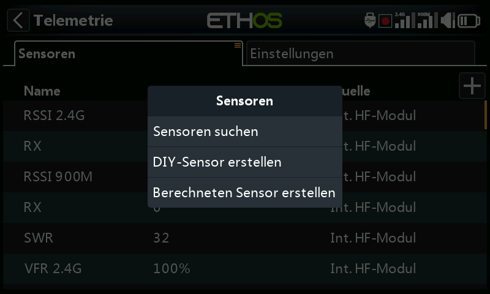

Tippen Sie auf die Schaltfläche „+“ rechts auf der Registerkarte „Sensoren“, um das Optionsfenster zu öffnen.

Neue Sensoren suchen

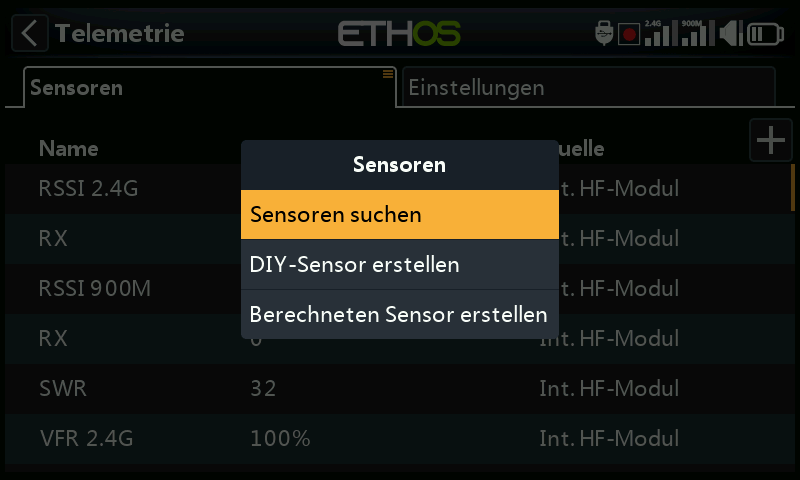

Sobald die Sensoren angeschlossen sind, das Sendermodul und der Empfänger gekoppelt wurden und mit Strom versorgt werden, tippen Sie auf „Sensoren suchen“, um nach verfügbaren neuen Sensoren zu suchen.

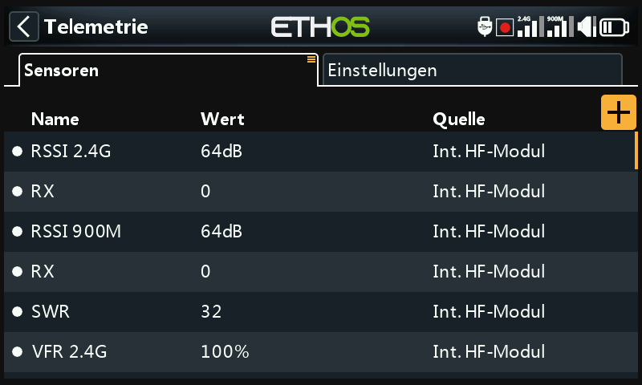

Während der Erkennung werden automatisch alle gefundenen Sensoren auf dem Bildschirm angezeigt. Sobald alle Sensoren erkannt wurden, sollte der Erkennungsvorgang beendet werden. Bitte beachten Sie dazu die Option „Erkennung beenden“ weiter unten.

Ein blinkender weißer Punkt in der linken Spalte zeigt an, dass Sensordaten empfangen werden; wenn keine Daten empfangen werden, wird der Wert rot angezeigt. Wie oben erwähnt, werden bis zu 100 Sensoren unterstützt.

Der obige Beispielbildschirm zeigt die „internen“ und externen Sensoren eines SR10Pro-Empfängers, und zwar:

RSSI 2.4G (Receiver Signal Strength Indicator)

RX 0: Es gibt eine neue ETHOS-Telemetrieempfänger-Quellenfunktion namens RX. RX liefert die Empfängernummer des aktiven Empfängers, der Telemetrie sendet. RX ist in der Telemetrie wie jeder andere Sensor für Echtzeitanzeige, Logikschalter, Sonderfunktionen und Datenprotokollierung verfügbar.

RSSI 900M (Receiver Signal Strength Indicator)

RX 0: Siehe oben.

SWR, Antennen-SWR-Wert bei Verwendung einer externen Antenne

VFR 2.4G, der Prozentsatz der gültigen Datenpaket-Rate des 2,4-GHz-Empfängers

VFR 900M, der Prozentsatz der gültigen Datenpaket-Rate des 900-MHz-Empfängers

Weitere Sensoren können sein:

VFR 900M, der Prozentsatz der gültigen Datenpackete des 900M-Empfängers

RxBatt, die Messung der Empfängerbatteriespannung

ADC2, der analoge Spannungseingang des Empfängers

R.Winkel, der Roll-Winkel des Empfängers

P.Winkel, der Pitch-Winkel des Empfängers

AccY, die Beschleunigung in der Y-Achse des Empfängers

AccZ, die Beschleunigung in der Z-Achse des Empfängers

AccX, die Beschleunigung in der X-Achse des Empfängers

Beachten Sie, dass für jeden Sensor auch Minimal- und Maximalwerte definiert sind, auch wenn diese in der Sensorliste nicht angezeigt werden. Wenn beispielsweise „Höhe“ definiert ist, stehen auch „Höhe-“ und „Höhe+“ für die minimale und maximale Höhe zur Verfügung. Weitere Informationen finden Sie unter „[Sensoroptionen](../getting-started/user-interface-and-navigation.md)“.

Die Sensorerkennung muss für jedes Modell und bei jeder Hinzufügung eines neuen Sensors durchgeführt werden.

##### Anzeige für Sensor verloren/Konflikten

Wenn ein Sensor verloren geht, erscheint neben dem Sensor ein roter Punkt anstelle des normalerweise blinkenden weißen Punkts, der anzeigt, dass Telemetriedaten für den Sensor empfangen werden.

Bei einem Sensorkonflikt erscheint zudem ein roter Punkt neben dem/den Sensor(en). Ein Sensorkonflikt tritt auf, wenn die physikalische ID oder die Anwendungs-ID nicht eindeutig ist. Weitere Informationen finden Sie in den obigen Abschnitten.

Die Warnmeldungen mit dem roten Punkt werden nur durch einen Sensor- oder Telemetrie-Reset gelöscht. (Beachten Sie, dass ein Flug-Reset auch die Telemetrie zurücksetzt.)

##### Sensorsuche beenden

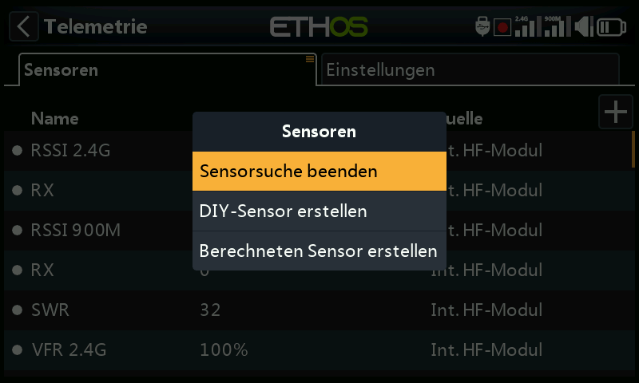

Sobald alle Sensoren erkannt wurden, tippe auf der Registerkarte „Sensoren“ auf die Schaltfläche „+“ und anschließend auf „Sensorsuche beenden“, um den Erkennungsvorgang abzuschließen.

#### Alle Sensoren löschen:

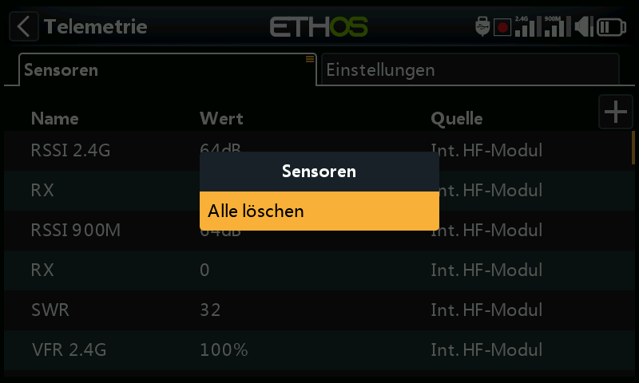

Tippen Sie auf die Registerkarte „Sensoren“, um die Option „Alle löschen“ aufzurufen. Nach der Bestätigung werden alle Sensoren gelöscht, sodass Sie von vorne beginnen können.

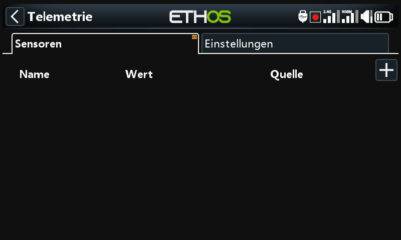

Alle Sensoren wurden gelöscht. Tippen Sie auf die Schaltfläche „+“ rechts auf der Registerkarte „Sensoren“, um den Optionsdialog zu öffnen, und wählen Sie dann „Neue Sensoren suchen“, um von vorn zu beginnen (siehe oben).

#### Bearbeiten und Konfigurieren von Sensoren

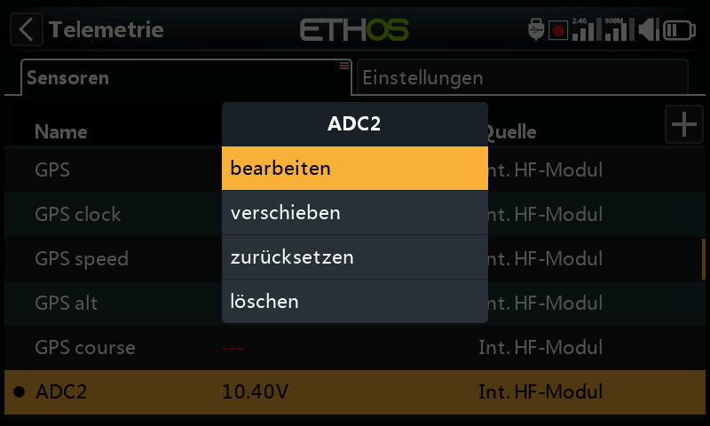

Tippen Sie auf einen Sensor und wählen Sie dann „Bearbeiten“ aus dem Popup-Dialog, um die Sensoreinstellungen zu bearbeiten. Wählen Sie alternativ „Verschieben“, um die Sensoren neu anzuordnen, „Zurücksetzen“, um den Sensor zurückzusetzen oder „Löschen“, um ihn zu entfernen.

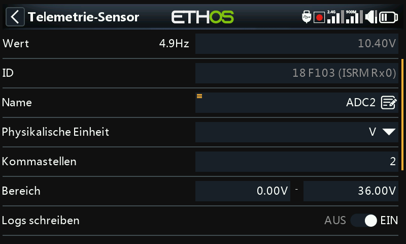

##### Wert

Zeigt den aktuellen Sensormesswert sowie die Aktualisierungsrate des Sensors an.

##### ID

Die ID ist die physische ID des Sensors und die Anwendungs-ID. Die ID des sendenden Empfängers wird ebenfalls angezeigt.

##### Name

Der Sensorname, der bearbeitet werden kann (Analogeingang ADC2 in diesem Beispiel).

##### Physikalische Einheit

Die Maßeinheit (in diesem Beispiel Volt).

##### Kommastellen

Die Anzahl der Nachkommastellen.

##### Bereich

Der untere und obere Grenzwert eines Bereichs kann als fester Wert für die Skalierung festgelegt werden. Dies wird meist verwendet, wenn ein Telemetriewert als Quelle für einen Kanal verwendet wird. Dadurch kann der Bereich auf die gewünschte Skala eingestellt werden. (Bei den neueren FrSky-Empfängern hat der Analogeingang einen Bereich von 0-36 V.)

##### Schreibe Logs

Wenn diese Option aktiviert ist, werden die Sensordaten auf der SD-Karte oder eMMC gespeichert.

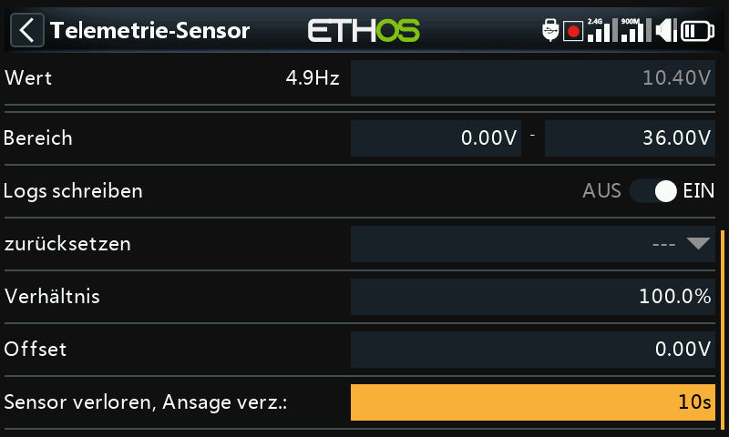

##### Zurücksetzen

Eine Quelle kann so konfiguriert werden, dass sie den Sensor zurücksetzt. Bitte beachten Sie, dass durch das Zurücksetzen auch sämtliche Warnmeldungen (rote Punkte) der Kategorien „Sensor verloren“ oder „Sensorkonflikt“ gelöscht werden. Bitte lesen Sie hierzu den Abschnitt „[Warnmeldungen: Sensor verloren/Konflikt](telemetry.md)“.

##### Warnverzögerung bei Sensorverlust

Bei der Einstellung „Warnung deaktiviert“ wird die Warnung bei Sensorverlust unterdrückt. Alternativ kann eine Verzögerung von 1 bis 30 Sekunden eingestellt werden, mit einer Voreinstellung von 10s. Auf diese Weise können kurze Ausfälle herausgefiltert werden, aber man muss sich der Risiken bewusst sein.

Die Audiomeldung „Sensor verloren“ wird nur einmal abgespielt, wenn mehrere Sensoren gleichzeitig verloren gehen.

Für die Empfängersensoren ist diese Warnung standardmäßig deaktiviert, da sie intern sind und ein Verlust unwahrscheinlich ist.

#### Sensorspezifische Warnungen

Das Bearbeitungsmenü kann z. B. je nach Sensor variieren:

##### ADC2

Bitte beachten Sie das obige Bildschirmbeispiel.

##### Verhältnis

Das Verhältnis kann angepasst werden, um die Skala des Sensoreingangs zu korrigieren.

##### Offset

In ähnlicher Weise kann ein Offset eingeführt werden.

##### RSSI

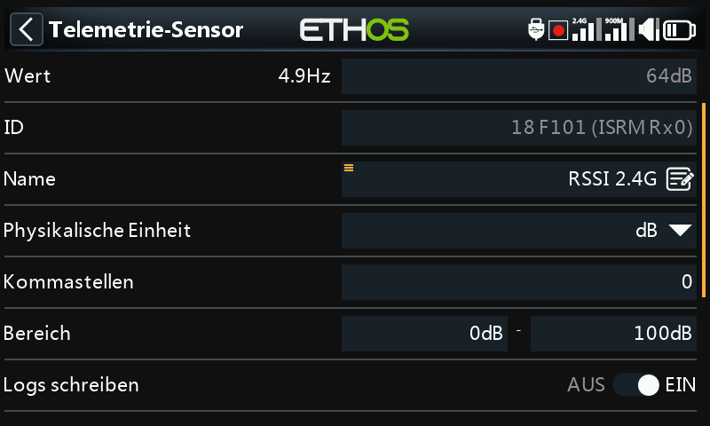

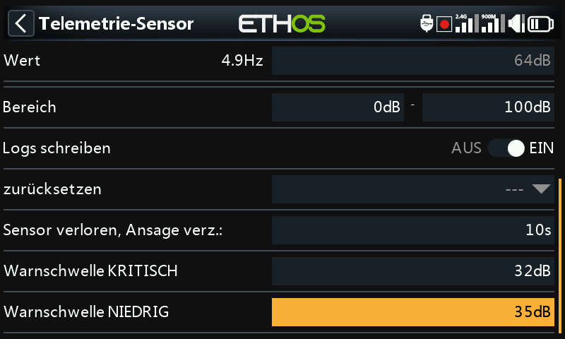

##### Kritischer Wert

Einige Sensoren, wie z. B. RSSI, verfügen über integrierte Warnmeldungen. RSSI verfügt über zwei Warnmeldungen, wobei die erste die Einstellung des kritischen Wertes ist.

##### Warnung bei niedrigem Wert

Der zweite Alarm ist die Einstellung des Schwellenwerts für einen zu niedrigen RSSI-Wert.

Eine Erläuterung der RSSI-Warnungen finden Sie im Abschnitt [RSSI-Warnungen](#Lesezeichen 31).

##### VFR

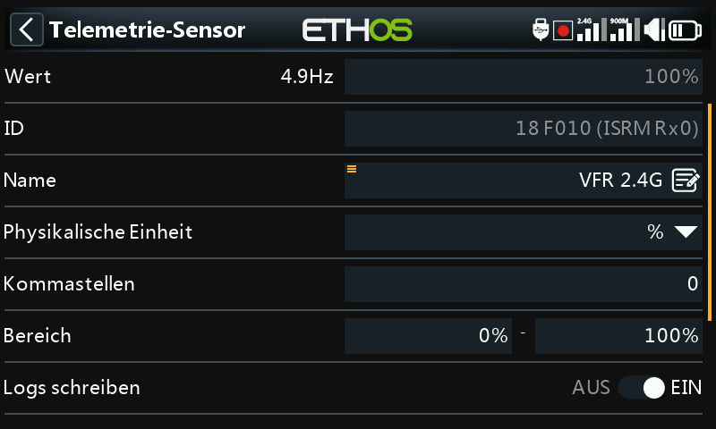

VFR ist die Anzahl der gültigen Datenpakete pro 100 Pakete für den Empfänger.

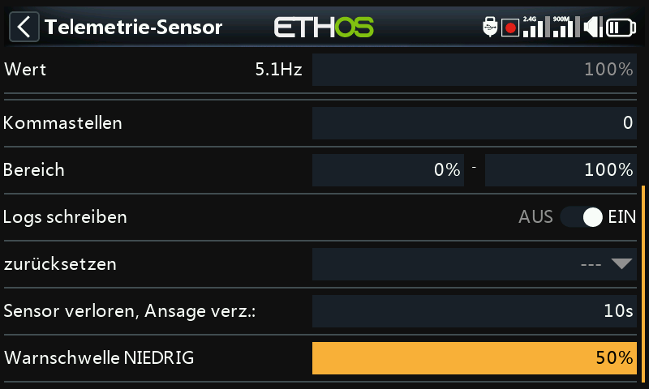

##### Warnschwelle „Niedrig“

Der VFR-Sensor verfügt über eine Schwelleneinstellung für niedrige Werte. Der Standardalarm liegt bei 50 %. Werte darunter zeigen an, dass sich die Verbindungsqualität auf ein besorgniserregendes Niveau verschlechtert hat.

##### Steigrate Vario

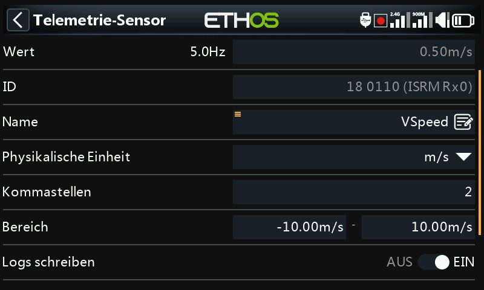

Steigrate Vario ist die von einem Variosensor gemessene vertikale Geschwindigkeit des Modells.

##### Wert

Zeigt den aktuellen Sensormesswert sowie die Aktualisierungsrate des Sensors an.

##### ID

Die ID ist die physische ID des Sensors und die Anwendungs-ID. Die ID des sendenden Empfängers wird ebenfalls angezeigt.

##### Name

Der Sensorname, der bearbeitet werden kann (in diesem Beispiel VSpeed).

##### Physikalische Einheit

Die Maßeinheit (in diesem Beispiel m/s).

##### Kommastellen

Die Anzahl der Nachkommastellen

##### Bereich

Der Standardbereich beträgt +/- 10m/s, kann aber auf bis zu +/- 100m/s erhöht werden.

##### Schreibe Logs

Wenn diese Option aktiviert ist, werden die Sensordaten auf der SD-Karte oder eMMC gespeichert.

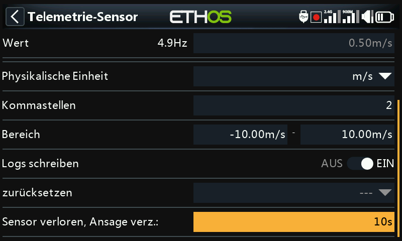

##### Zurücksetzen

Eine Quelle kann zum Zurücksetzen des Sensors konfiguriert werden.

##### Warnverzögerung bei Sensorverlust

Bei der Einstellung „Warnung deaktiviert“ wird die Warnung „Sensor verloren“ unterdrückt. Alternativ kann eine Verzögerung von 1 bis 10 Sekunden eingestellt werden, wobei der Standardwert 5 Sekunden beträgt. Auf diese Weise können kurze Ausfälle herausgefiltert werden, doch muss man sich der Risiken bewusst sein.

Für die Empfänger-Sensoren ist diese Warnung standardmäßig deaktiviert, da es unwahrscheinlich ist, dass sie verloren gehen, da er intern ist.“

Hinweis: Die Vario bezogenen Einstellungen befinden sich jetzt in der Sonderfunktion „[Vario abspielen](special-functions.md)“.

#### DIY-Sensor erstellen

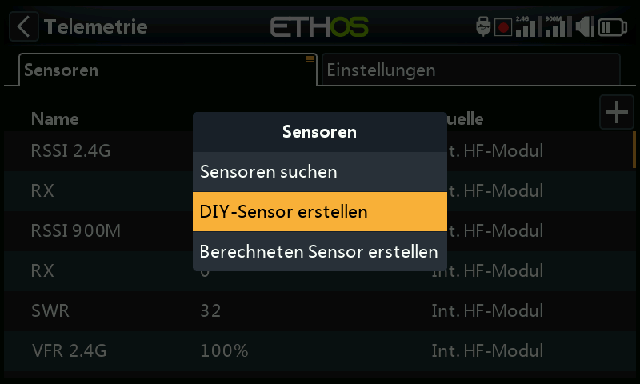

Tippen Sie auf die Schaltfläche „+“ rechts auf der Registerkarte „Sensoren“, um das Optionsfenster zu öffnen. Wählen Sie anschließend „DIY-Sensor erstellen“, um einen selbstgebauten Sensor oder einen Sensor eines Drittanbieters hinzuzufügen.

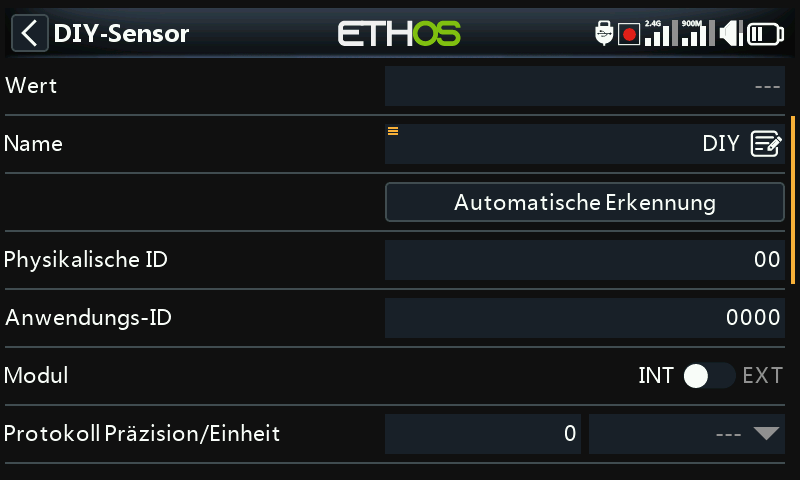

##### Wert

Empfangener Sensorwert.

##### Name

Der Sensorname, der bearbeitet werden kann.

##### Erkennung automatisch

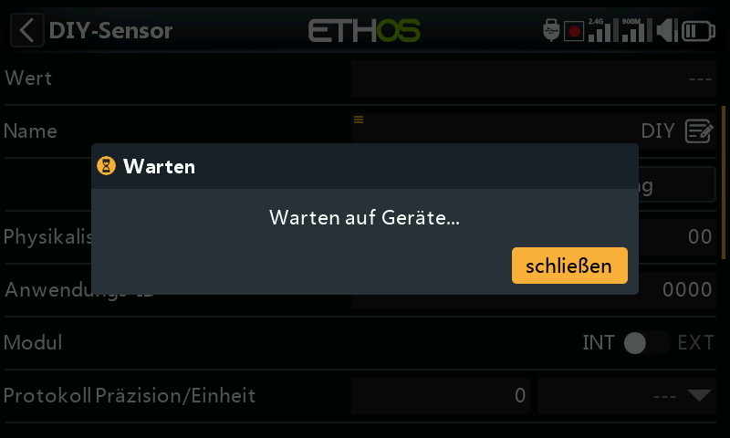

Die Funktion „Automatisch erkennen“ versucht, Ihren Sensor zu finden. Wenn er bereits erkannt wurde, wird er von „Automatisch erkennen“ nicht gefunden. Wenn ein anderer Sensor nicht erkannt wurde, wird er ebenfalls in der Liste angezeigt.

##### Physikalische ID

Zweistellige physische ID des Sensors. Diese wird von Auto Detect ausgefüllt, falls ausgewählt.

##### Anwendungs-ID

Vierstellige Anwendungs-ID des Sensors. Diese wird von „Automatisch erkennen“ ausgefüllt, falls ausgewählt.

##### Modul

Ermöglicht die Auswahl eines internen oder externen HF-Moduls. Falls ausgewählt, wird dieses Feld mit „Automatisch erkennen“ ausgefüllt.

##### Protokoll Dezimalstellen / Einheit

Ermöglicht die Einstellung der Genauigkeit für das Eingangsprotokoll von 0 bis 3 Dezimalstellen. Außerdem können hier die Maßeinheiten ausgewählt werden.

##### Bildschirm Dezimalstellen / Einheit

Ermöglicht die Einstellung der anzuzeigenden Genauigkeit, von 0 bis 3 Dezimalstellen. Hier können auch die Maßeinheiten für die Anzeige ausgewählt werden.

##### Bereich

Der untere und obere Grenzwert eines Bereichs kann als fester Wert für die Skalierung festgelegt werden. Dies wird meist verwendet, wenn ein Telemetriewert als Quelle für einen Kanal verwendet wird. Dadurch kann der Bereich auf die gewünschte Skala eingestellt werden.

##### Verhältnis

Das Standardverhältnis von 100 % kann geändert werden, um die empfangenen Messwerte zu korrigieren.

##### Offset

Der Standard-Offset von 0 kann geändert werden, um empfangene Messwerte zu korrigieren.

##### schreibe Logs

Wenn diese Option aktiviert ist, werden die Sensordaten auf der SD-Karte oder eMMC gespeichert. Die Protokolle sind standardmäßig aktiviert.

##### Zurücksetzen

Eine Quelle kann so konfiguriert werden, dass sie den Sensor zurücksetzt. Bitte beachten Sie, dass durch das Zurücksetzen auch sämtliche Warnmeldungen (rote Punkte) der Kategorien „Sensor verloren“ oder „Sensorkonflikt“ gelöscht werden. Bitte lesen Sie hierzu den Abschnitt „[Warnmeldungen: Sensor verloren / Konflikt](telemetry.md)“.

##### Warnverzögerung bei Sensorverlust

Die Einstellung „Nicht eingestellt“ unterdrückt die Warnung bei Sensorverlust. Alternativ kann eine Verzögerung von 1 bis 10 Sekunden eingestellt werden, mit einer Voreinstellung von 5s. Auf diese Weise können kurze Ausfälle herausgefiltert werden, aber die Risiken müssen berücksichtigt werden.

#### Berechnende Sensoren erstellen

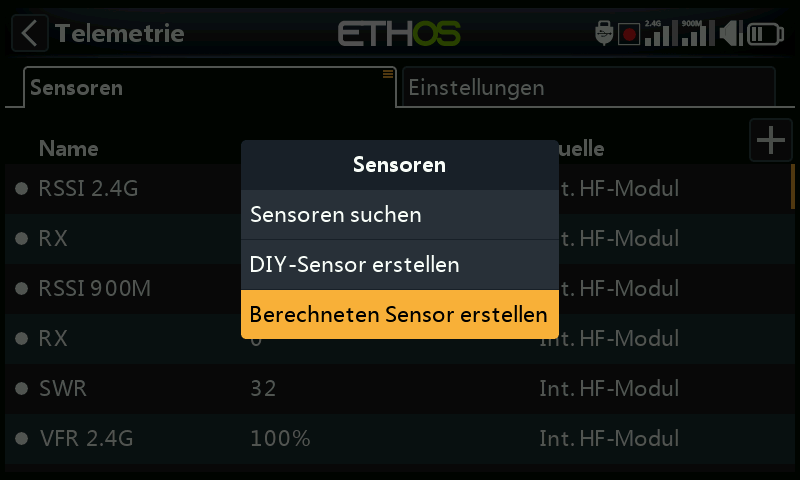

Tippen Sie auf die Schaltfläche „+“ rechts neben der Registerkarte „Sensoren“, um das Optionsfenster zu öffnen. Wählen Sie dann „Berechneten Sensor erstellen“, um einen berechneten Sensor hinzuzufügen.

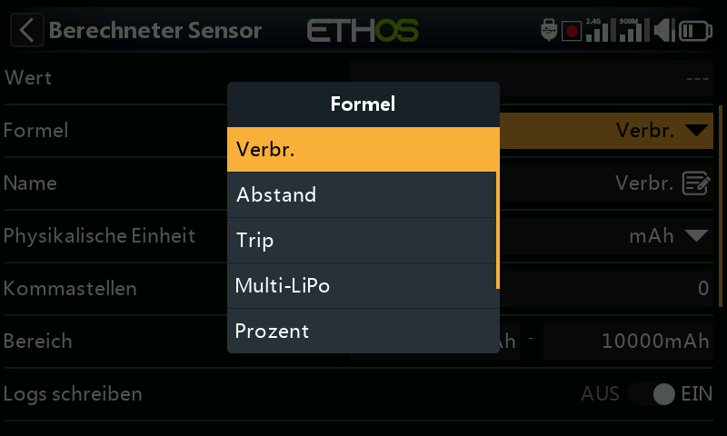

Es können berechnete Sensoren hinzugefügt werden, darunter Verbrauch, Entfernung, Trip, Multi-Lipo, Prozent, Leistung und Benutzerdefiniert.

##### Sensor für den Verbrauch

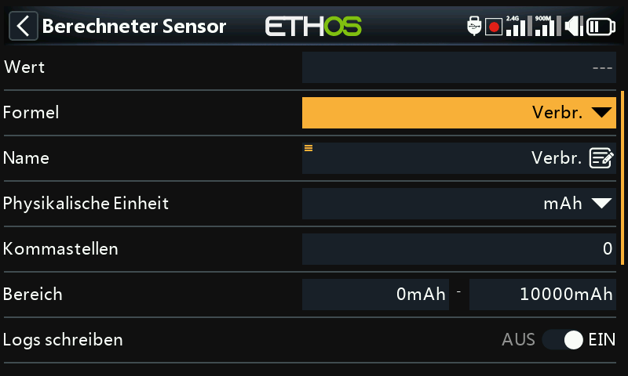

Der Sensor zur Verbrauchsberechnung ermöglicht die Berechnung der von Ihrem Motor verbrauchten Energie anhand eines Stromsensors wie der FAS-Serie.

##### Wert

Zeigt den aktuellen Wert des ausgewählten Sensors an (siehe Quelle unten).

##### Formel

Wählen Sie die Formel „Verbrauch“.

##### Name

Der Sensorname, der bearbeitet werden kann.

##### Physikalische Einheit

Die Messung kann in mAh oder Ah erfolgen.

##### Kommastellen

Die Anzeige kann zwischen 0 und 4 Nachkommastellen haben.

##### Bereich

Der Bereich kann von 0 bis zu einem Maximum von 1000Ah reichen.

##### schreibe Logs

Wenn diese Option aktiviert ist, werden die Sensordaten auf der SD-Karte oder eMMC gespeichert. Die Protokolle sind standardmäßig aktiviert.

##### Reset

Eine Quelle kann zum Zurücksetzen des Sensors konfiguriert werden.

##### Quelle

Wählen Sie nach der Erkennung der angegebenen Sensoren Ihren aktuellen Sensor aus.

##### Wert speich. wenn TX AUS?

„Dauerhaft“ ermöglicht die Speicherung des Sensorwerts im Speicher, wenn der Sender ausgeschaltet oder das Modell gewechselt wird, und wird bei der nächsten Verwendung des Modells neu geladen.

Mit der Schaltfläche zurücksetz. können Sie den Sensor zurücksetzen, während Sie sich im Bearbeitungsbildschirm befinden.

##### Abstand Sensor

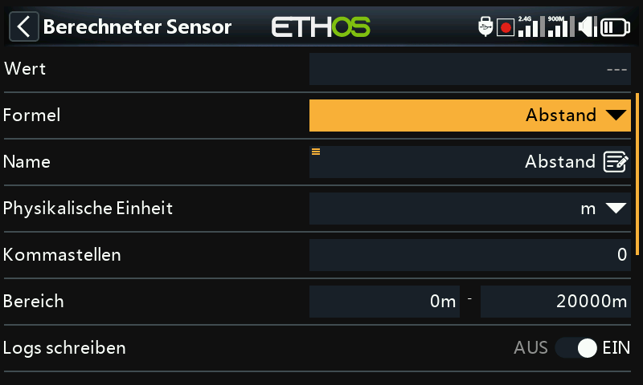

Mit dem Sensor für die Berechnung der Entfernung kann die zurückgelegte Entfernung anhand eines GPS-Sensors berechnet werden.

##### Wert

Zeigt den aktuellen Wert des ausgewählten Sensors an (siehe Quelle unten).

##### Formel

Wählen Sie die Formel Abstand.

##### Name

Der Sensorname, der bearbeitet werden kann.

##### Physikalische Einheit

Die Messung kann in cm, m, km oder Fuß erfolgen.

##### Kommastellen

Die Anzeige kann zwischen 0 und 4 Nachkommastellen haben.

##### Bereich

Die Reichweite kann zwischen 0 und maximal 20 km betragen.

##### Schreibe Logs

Die Protokolle werden auf die SD-Karte oder eMMC in den Ordner Logs geschrieben, wenn sie aktiviert sind.

##### zurücksetzen

Eine Quelle kann zum Zurücksetzen des Sensors konfiguriert werden.

##### GPS-Quelle

Nachdem Sie die Sensoren gefunden haben, wählen Sie Ihren GPS-Sensor aus.

##### Flughöhe Quelle

Nachdem Sie die Sensoren gefunden haben, wählen Sie Ihren Höhensensor aus.

Verwendet man keine Flughöhe, so ist ergibt sich die Entfernung über Grund (2D), wird ein Höhensensor verwendet ergibt es die direkte Entfernung zum Modell (3D).

##### Wert speich. Wenn TX AUS?

„EIN“ ermöglicht die Speicherung des Sensorwerts im Speicher, wenn der Sender ausgeschaltet oder das Modell gewechselt wird, und wird bei der nächsten Verwendung des Modells neu geladen.

Mit der Schaltfläche Zurücksetzen können Sie den Sensor zurücksetzen, während Sie sich im Bearbeitungsbildschirm befinden.

##### Trip Sensor

Mit dem Sensor „Berechnung der zurückgelegten Strecke“ kann die kumulierte Entfernung zwischen GPS-Koordinaten von einem GPS-Sensor berechnet werden.

##### Wert

Zeigt den aktuellen Wert des ausgewählten Sensors an (siehe Quelle unten).

##### Formel

Wählen Sie die Formel Trip.

##### Name

Der Sensorname, der bearbeitet werden kann.

##### Physikalische Einheit

Die Messung kann in cm, m, km oder Fuß erfolgen.

##### Kommastellen

Die Anzeige kann zwischen 0 und 4 Nachkommastellen haben.

##### Bereich

Die Reichweite kann zwischen 0 und maximal 1000km betragen.

##### Schreibe Logs

Die Protokolle werden auf die SD-Karte oder eMMC in den Ordner Logs geschrieben, wenn sie aktiviert sind.

##### Reset

Eine Quelle kann zum Zurücksetzen des Sensors konfiguriert werden.

##### zurücksetzen

Nachdem Sie die Sensoren gefunden haben, wählen Sie Ihren GPS-Sensor aus.

##### Wert speich. Wenn TX AUS?

„EIN“ ermöglicht die Speicherung des Sensorwertes im Speicher, wenn das Funkgerät ausgeschaltet oder das Modell gewechselt wird, und wird bei der nächsten Verwendung des Modells neu geladen.

Mit der Schaltfläche zurücksetz. können Sie den Sensor zurücksetzen, während Sie sich im Bearbeitungsbildschirm befinden.

##### Multi Lipo Sensor

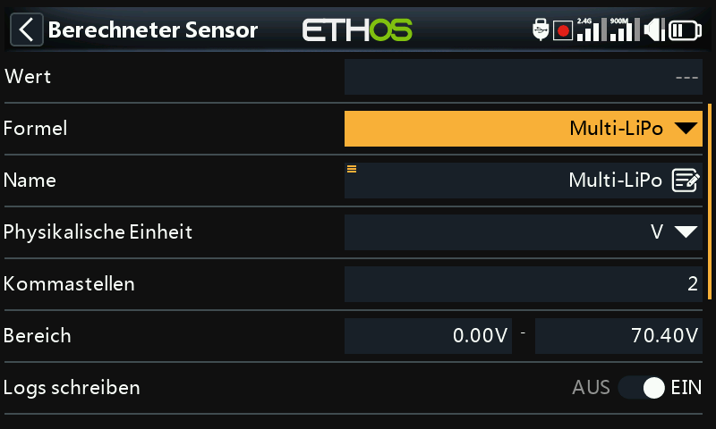

Der berechnete Multi-LiPo-Sensor ermöglicht die Kaskadierung von bis zu 4 Lipo-Sensoren zur Überwachung von LiPos mit mehr als 8S.

##### Wert

Zeigt den aktuellen Wert des ausgewählten Sensors an (siehe Quelle unten).

##### Formel

Wählen Sie die Formel Multi Lipo.

##### Name

Der Sensorname, der bearbeitet werden kann.

##### Physikalische Einheit

Die Messung kann in Volt oder mV erfolgen.

##### Kommastellen

Die Anzeige kann zwischen 0 und 4 Nachkommastellen haben.

##### Bereich

Der Bereich kann von 0 bis zu einem Maximum von 70,40V (für 8S) reichen.

##### Schreibe Logs

Die Protokolle werden auf die SD-Karte oder eMMC in den Ordner Logs geschrieben, wenn sie aktiviert sind.

##### Zurücksetz.

Eine Quelle kann zum Zurücksetzen des Sensors konfiguriert werden.

##### Anzahl

Die Anzahl der zu konfigurierenden Lipo-Sensoren.

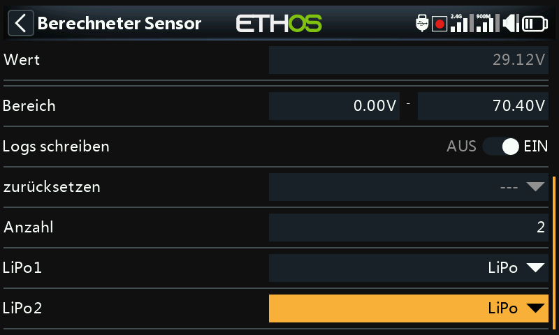

##### LiPo1, LiPo2, bis LiPo'n'

Wählen Sie die Lipo-Sensoren in der richtigen Reihenfolge aus, von der niedrigen zur hohen Zelle.

Um S.Port-Überschneidungen zu vermeiden, müssen bei den zusätzlichen Lipo-Sensoren sowohl die physikalischen als auch die Anwendungs-IDs mit Hilfe des Lipo Voltage Setup Tools im Sensor Konfig.-Menü geändert werden. Es ist auch ratsam, sie einzeln Sensoren suche zu lassen und den Sensornamen zu ändern, um sie voneinander unterscheiden zu können.

##### Prozent Sensor

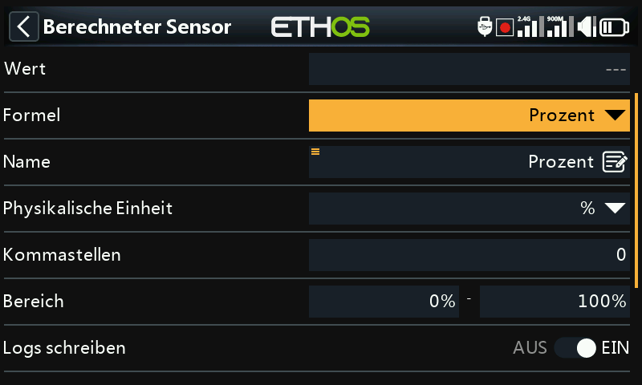

Mit dem Sensor „Prozent berechnet“ können die Sensorwerte in einen Prozentsatz umgerechnet werden.

##### Wert

Zeigt den aktuellen Wert des ausgewählten Sensors an (siehe Quelle unten).

##### Formel

Wählen Sie die Formel Prozent.

##### Name

Der Sensorname, der bearbeitet werden kann.

##### Physikalische Einheit

Die Messung kann in ‚%‘ erfolgen.

##### Kommastellen

Die Anzeige kann zwischen 0 und 4 Nachkommastellen haben.

##### Bereich

Die Spanne kann zwischen 0 % und 100 % liegen.

##### schreibe Logs

Die Protokolle werden auf die SD-Karte oder eMMC in den Ordner Logs geschrieben, wenn sie aktiviert sind.

##### zurücksetzen

Eine Quelle kann zum Zurücksetzen des Sensors konfiguriert werden.

##### Sensor

Nach dem Suchen von Sensoren wählen Sie den Sensor aus, der in einen Prozentsatz umgewandelt werden soll.

Invers

Ermöglicht die Umkehrung der Quelle, um z. B. den verbleibenden Prozentsatz anzuzeigen.

##### Sensor Leistung

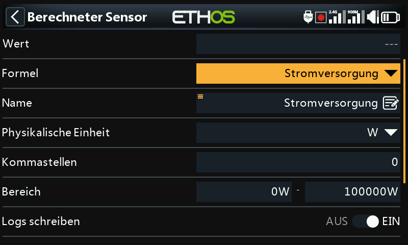

Mit dem Sensor „Berechnete Leistung“ kann die Leistung aus einer Spannungs- und einer Stromquelle berechnet werden.

##### Wert

Zeigt die aktuelle Leistungsberechnung der ausgewählten Sensoren an (siehe Strom und Spannung unten).

##### Formel

Wählen Sie die Formel Leistung.

##### Name

Der Sensorname, der bearbeitet werden kann.

##### Physikalische Einheit

Die Einheiten können mW oder 'W' sein.

##### Kommastellen

Die Anzeige kann zwischen 0 und 4 Nachkommastellen haben.

##### Bereich

Der Bereich kann von 0 bis zu 1000000W betragen.

##### schreibe Logs

Die Protokolle werden auf die SD-Karte oder eMMC in den Ordner Logs geschrieben, wenn sie aktiviert sind.

##### Zurücksetzen

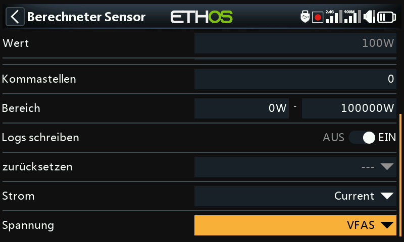

Ermöglicht das Zurücksetzen des Sensors.

##### Strom

Nachdem Sie die Sensoren gefunden haben, wählen Sie den Sensor aus, der für den Strom verwendet werden soll.

##### Spannung

Nachdem Sie die Sensoren gefunden haben, wählen Sie den Sensor aus, der für die Spannung verwendet werden soll.

##### Benutzerdefinierter Sensor

Mit dem benutzerdefinierten berechneten Sensor kann ein benutzerdefinierter Sensor aus mehreren Quellen berechnet werden.

##### Wert

Zeigt den aktuell berechneten Wert des benutzerdefinierten Sensors an.

##### Formel

Wählen Sie die Formel Benutzer.

##### Name

Der Sensorname, der bearbeitet werden kann.

##### Physikalische Einheit

Die Einheiten sind wählbar zwischen 'mV', 'V', 'mA', 'A', 'mAh', 'Ah, 'mW', 'W', 'cm', 'm', 'km' 'ft', 'cm/s', 'm/s', m/min', 'ft/s', 'ft/min', 'km/h', 'mph', 'knots', '°C', '°F', '%', 'us', 'ms', 's', 'm', 'h', 'dB', 'dBm', 'Hz', 'MHz', 'g', '°', 'rad', 'ml', 'ml/m', 'ml/p', 'r/m', 'Pa', 'kPa', 'MPa', 'bar' und 'PSI'.

##### Kommastellen

Die Anzeige kann zwischen 0 und 4 Nachkommastellen haben.

##### Bereich

Der Bereich kann von -1000000000 bis zu 1000000000 reichen.

##### Schreibe Logs

Die Protokolle werden auf die SD-Karte oder eMMC in den Ordner Logs geschrieben, wenn sie aktiviert sind.

##### zurücksetzen

Ermöglicht das Zurücksetzen des Sensors.

##### Quelle

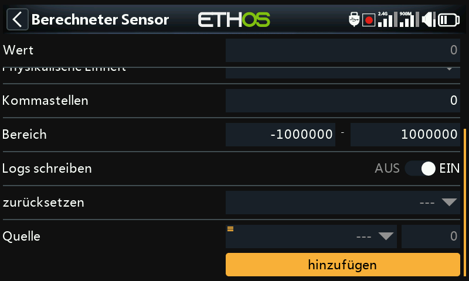

Nachdem Sie die Sensoren gefunden haben, wählen Sie den ersten Sensor aus, der für die Berechnung verwendet werden soll.

Klicken Sie dann auf „add/hinzuf.“, um bei Bedarf weitere Berechnungslinien hinzuzufügen.

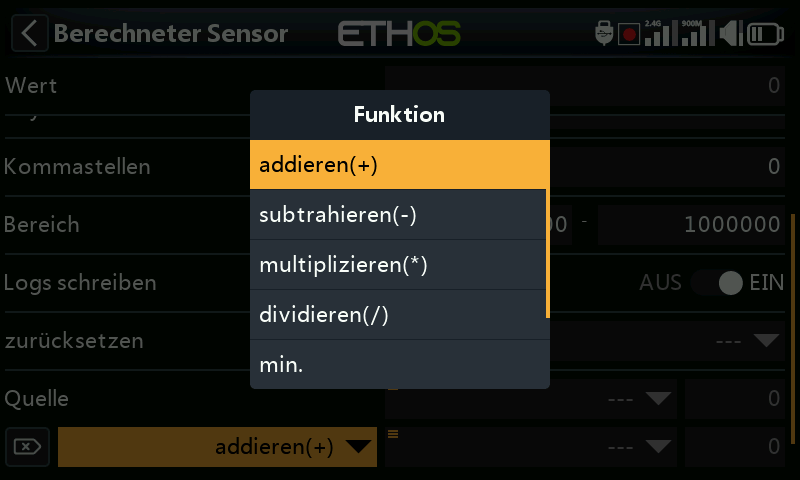

Die folgenden mathematischen Operatoren sind verfügbar:

- Addieren (+)
- Subtrahieren (-)
- Multiplizieren (x)
- Dividieren (/)
- Min
- Max
- Sqrt (Quadratwurzel)

##### Beispiele

##### Leistungssensor

Der benutzerdefinierte Sensor hat den Namen MaxPower erhalten.

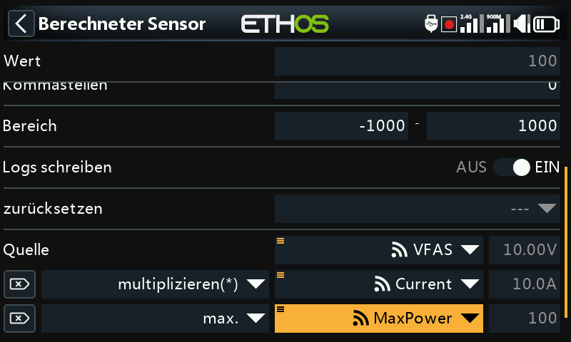

In dem obigen einfachen Beispiel wurden ein Spannungssensor VFAS und ein Stromsensor Current multipliziert, um die Leistung zu berechnen. Dann wurde eine Max-Funktion hinzugefügt, indem der Stromwert unseres benutzerdefinierten Sensors „MaxPower“ zur Berechnung des Höchstwerts herangezogen wurde. Das Feld „Wert“ zeigt 288 W an, was der Höchstwert war, der während des Tests erreicht wurde.

##### Arithmetik mit einer Konstante

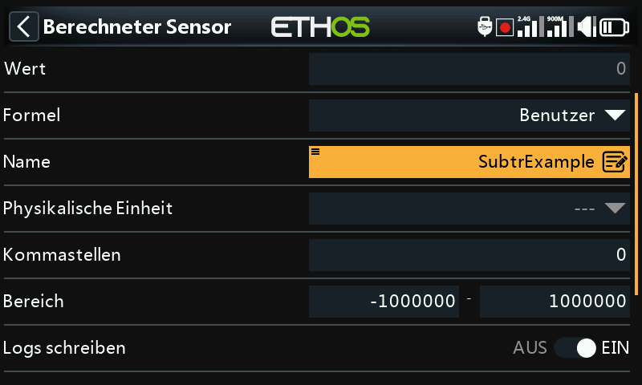

Der benutzerdefinierte Sensor wurde SubtrExample (Subtraktionsbeispiel) genannt.

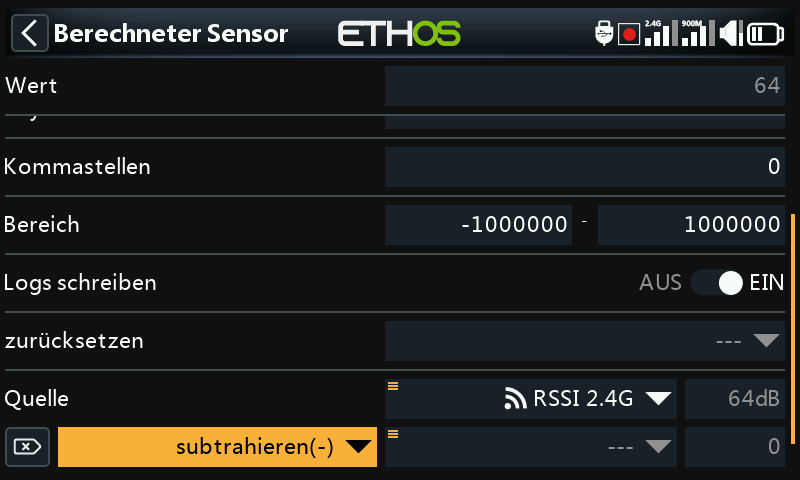

Die Quelle wurde auf „RSSI 2.4G“ eingestellt. Beachten Sie, dass der RSSI-Wert 64 dB beträgt.

Fügen Sie dann eine Aktion hinzu und wählen Sie „Subtrahieren“.

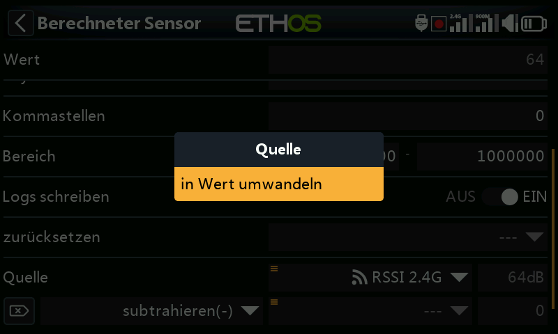

Blättern Sie zur Quelle für diese Aktionszeile, drücken Sie lange die Eingabetaste und wählen Sie dann „In Wert umwandeln“.

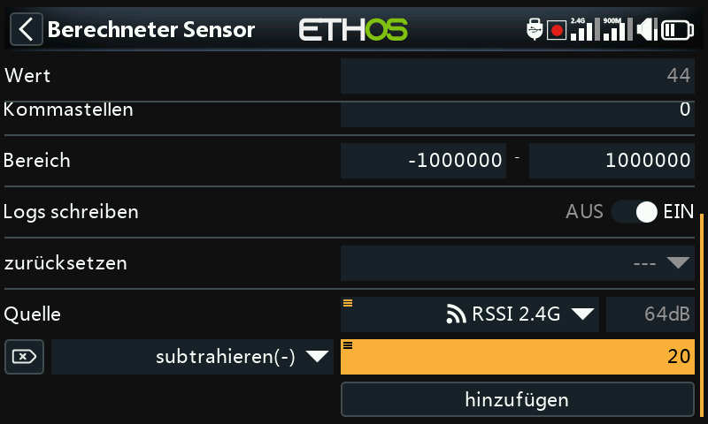

Sie können nun den Wert (der jetzt eine Konstante ist) bearbeiten, der in der Funktion Subtrahieren verwendet werden soll.

Der Wert zeigt nun 44 dB an, das Ergebnis der Subtraktion von 20 vom ursprünglichen Quellwert von 64 dB.

##### Interner Berechnungswert einer Quelle

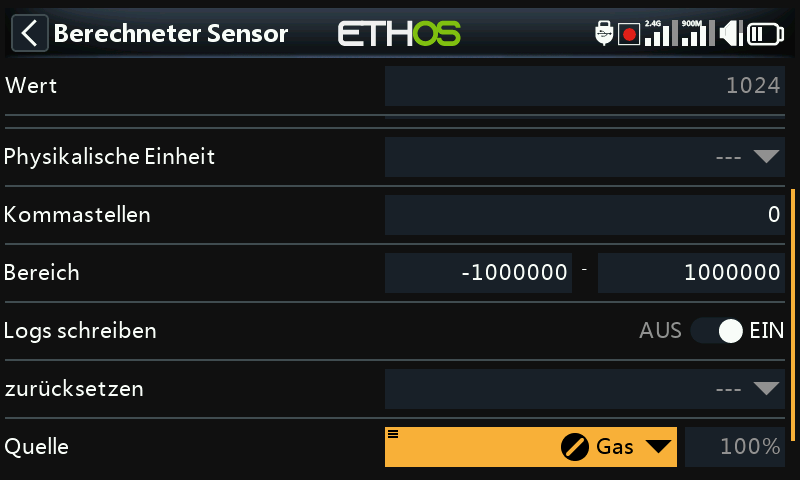

Dieses Beispiel soll lediglich den internen Berechnungswert einer Quelle zeigen. Wir werden einen benutzerdefinierten berechneten Sensor verwenden, dessen Quelle auf Gas eingestellt ist. Wenn das Gas auf 100 % steht, können wir sehen, dass der interne Wert +1024 beträgt.

Wenn die Drosselklappe auf -100% steht, liegt der interne Wert bei -1024. Der interne Wert einer Quelle liegt also zwischen +/-1024, wenn die Quelle auf +/-100% steht.

### Registerkarte „Einstellungen“

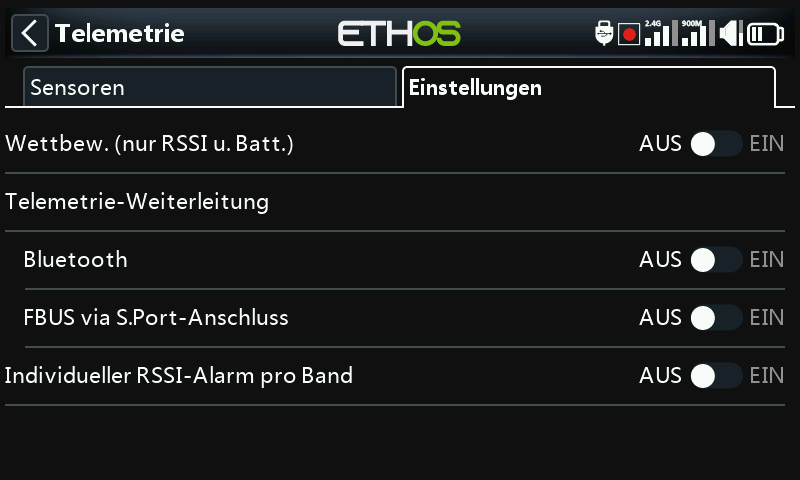

Über die Registerkarte „Einstellungen“ kann der Modus „Nur Wettbewerb (nur RSSI u, Batt.)“ aktiviert, die Telemetrieweiterleitung konfiguriert und eine „Individuelle RSSI-Warnung pro Band“ für TD- und TW-Empfänger aktiviert werden.

#### Wettbewerb (nur RSSI und Akku)

Ethos verfügt über einen Wettbewerbsmodus, in dem Sie die Telemetrie für bestimmte lokale Wettbewerbe deaktivieren können, bei denen der Einbau von Telemetriesensoren erlaubt ist, sofern diese deaktiviert sind. Dabei werden Sensordaten zum Verbindungsstatus wie RSSI und Rx-Batteriestand unterstützt.

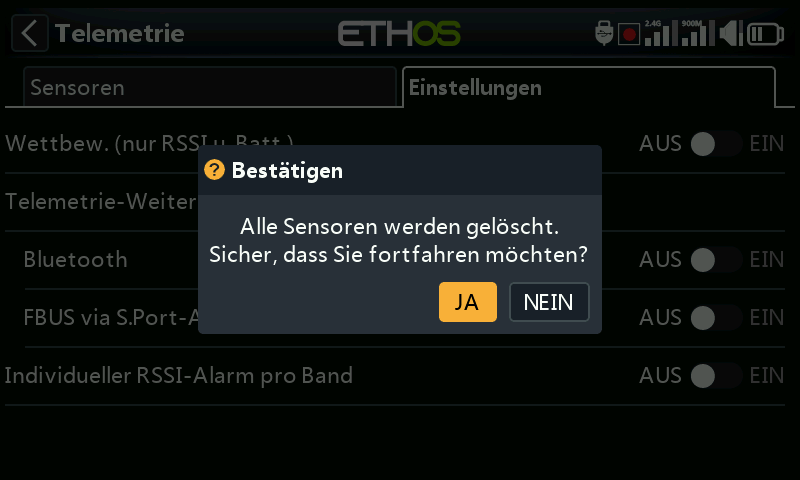

Wenn Sie diesen Modus aktivieren, werden alle Sensoren mit Ausnahme von RSSI und RxBatt gelöscht. Das Sender muss neu gestartet werden, bevor die Sensoren bei deaktivierter Einstellung erneut erkannt werden können.

#### Telemetrie-Weiterleitung

Die Telemetrie kann via Bluetooth oder mit dem FBUS-Protokoll über den S.Port-Anschluss weitergeleitet werden.

#### Bluetooth

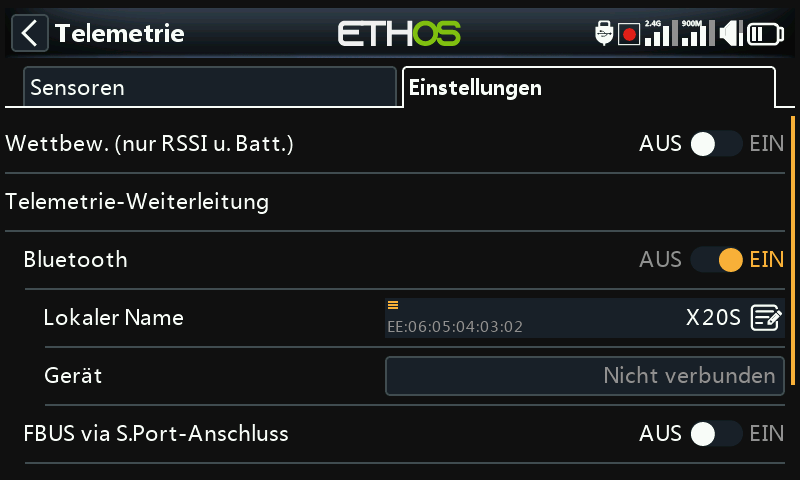

Im Bluetooth-Telemetriemodus kann der Sender mit der FrSky FreeLink-App zusammenarbeiten, um Telemetriedaten auf Ihrem Mobiltelefon anzuzeigen. Die FreeLink-App kann auch zur Konfiguration von FrSky-Geräten wie den stabilisierten Empfängern verwendet werden.

##### FBUS über S.Port-Anschluss

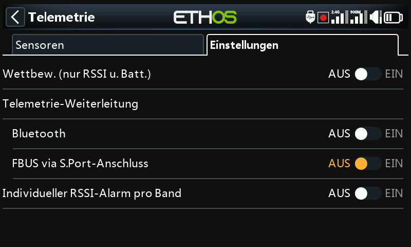

Die Telemetrie kann auch im FBUS-Format über den S.Port-Anschluss oben am Sender weitergeleitet werden.

#### Individueller RSSI-Alarm pro Band

Bei Verwendung der TD- oder TW-Protokolle besteht die Möglichkeit, individuelle RSSI-Sprachwarnungen für jedes Band zu empfangen. Weitere Informationen finden Sie im obigen Abschnitt zum RSSI.
