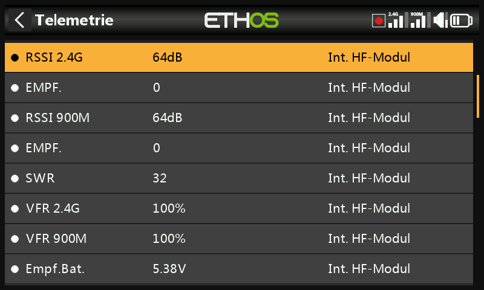
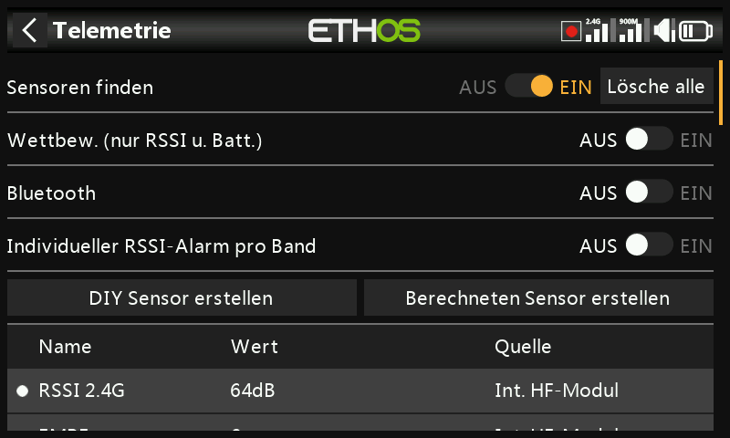
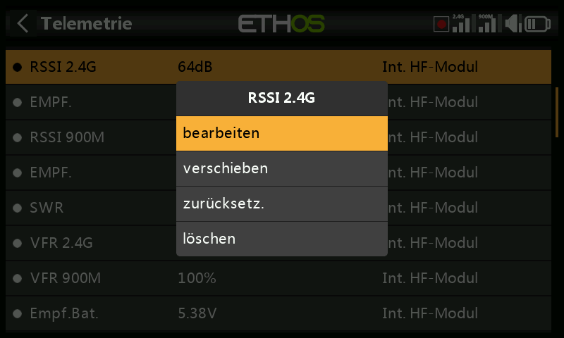

# Telemetrie

Die Telemetrie überträgt Informationen vom Modell zurück zum Piloten —
Verbindungsqualität (RSSI, VFR), Spannungen und Ströme sowie alles, was ein
angeschlossener Sensor sonst meldet (GPS-Position, Höhe usw.). Pro Modell
werden bis zu 100 Sensoren unterstützt; Suchen und Konfigurieren erfolgt hier,
*angezeigt* wird die Telemetrie jedoch über [Widgets auf
Anzeigebildschirmen](../displays/index.md), die separat unter Bildschirme
konfigurieren eingerichtet werden.

## Funktionsweise der FrSky-Telemetrie {: #how-frsky-telemetry-works }

Die Sensoren der FrSky-Serie sind ohne Hub konzipiert: **Smart Port (S.Port)**
verwendet einen dreiadrigen Bus (GND, V+, Signal), der in beliebiger Reihenfolge
aneinandergereiht und an den S.Port-Anschluss kompatibler Empfänger der Serien X
und S und später angeschlossen wird und im Halbduplex-Betrieb mit 57.600 bps
arbeitet (F.Port und FBUS sind schneller).

- **Physikalische ID** — bis zu 28 Geräte (einschließlich des Empfängers) teilen
  sich den Bus, jedes benötigt eine eindeutige Physikalische ID (00–1B hex).
  FrSky-Geräte werden mit sinnvollen Standardwerten ausgeliefert (z. B.
  Vario = 00, FLVSS = 01, Current = 02, GPS = 03) — werden zwei gleiche Geräte
  angeschlossen, muss die Physikalische ID des zweiten über die
  [Gerätekonfiguration](../system-setup/devices.md) geändert werden.
- **Anwendungs-ID** — unabhängig von der Physikalischen ID: Ein Sensor kann
  mehrere Werte melden, jeder mit eigener Anwendungs-ID. Ein Vario hat nur eine
  Physikalische ID, aber zwei Anwendungs-IDs (Höhe, vertikale Geschwindigkeit);
  ein FLVSS hat eine Physikalische ID und eine Anwendungs-ID (Spannung). Wenn
  Sie zwei 6S-Lipo-Packs mit zwei FLVSS-Sensoren überwachen möchten, müssen beim
  zweiten **beide** IDs geändert werden — die Physikalische ID für die
  ausschließliche Kommunikation auf dem Bus und die Anwendungs-ID, damit der
  Empfänger zwischen den Daten von Lipo 1 und Lipo 2 unterscheiden kann (z. B.
  `0300` → `0301`). Üblicherweise wird die vierte Hex-Ziffer variiert, 0–F.

  !!! note
      Sensoren mit derselben Anwendungs-ID und unterschiedlichen Physikalischen
      IDs sind nur zulässig, wenn die
      [Sensorkonfliktwarnung](../system-setup/alerts.md) deaktiviert ist — eine
      spezielle Anwendung, nicht der Regelfall.

Jeder über Telemetrie empfangene Wert wird als separater Sensor behandelt: Wert,
Physikalische ID und Anwendungs-ID, ein editierbarer Name, die Maßeinheit, die
Anzahl der Dezimalstellen, die Option zur Protokollierung auf der SD card sowie
eigene Minimal-/Maximalwerte. Einmal eingerichtete Sensoren werden bei jedem
Einschalten automatisch erkannt, bei der Erstinstallation müssen sie jedoch
**manuell** gesucht werden. Ein einmal erkannter Sensor kann in Sprachansagen
abgespielt, in [berechneten Sensoren](#calculated-sensors), in [logischen
Schaltern](logical-switches.md), in [Vars](variables.md) oder in
[Mischungen](mixes.md) verwendet, in benutzerdefinierten Telemetrie-Bildschirmen
angezeigt oder direkt auf dieser Telemetrie-Einrichtungsseite abgelesen werden,
ohne dass ein Bildschirm konfiguriert werden muss.

**FBUS** (früher F.Port 2.0) geht noch einen Schritt weiter und integriert SBUS
für die Steuerung und S.Port für die Telemetrie mit 460.800 bps in einer Leitung
(gegenüber 115.200 bei F.Port und 57.600 bei S.Port — allein diese Bitraten
machen die drei Protokolle untereinander inkompatibel); zudem kann ein Host-Gerät
auf dieser einen Leitung mit mehreren Slave-Geräten kommunizieren, die sich alle
drahtlos über den Sender konfigurieren lassen.

### Telemetrie mit mehreren Empfängern (ACCESS Trio)

Mit bis zu drei unter [RF
System](rf-system.md#registering-and-binding-a-receiver-access) registrierten
Empfängern kann jeder gebundene Empfänger über RX1, RX2 und RX3 individuell
konfiguriert werden (Anschlussstifte zuordnen usw.). Normalerweise gibt es einen
eingehenden Telemetriepfad pro HF-Verbindung — eine Ausnahme bilden die
Tandem-/TD-Systeme, die 2,4 GHz und 900 MHz als zwei Pfade auf einem Modul
betreiben. Der Empfänger der Telemetriequelle kann sich während eines Fluges je
nach HF-Bedingungen ändern; der Sensor **RX** zeigt in Echtzeit an, welcher
Empfänger gerade Telemetrie sendet, und zeichnet dies auf.

Die gebräuchlichste Anwendung: die S.Port-Sensorkette mit allen drei Empfängern
verketten, die sich eine gemeinsame Stromversorgung teilen sollten, dann jeden
Empfänger registrieren und binden und die Sensoren wie gewohnt suchen lassen —
die Telemetriequelle wird je nach aktivem RX automatisch umgeschaltet, und die
Daten *externer* S.Port-Sensoren werden transparent fortgesetzt. (Die internen
Sensoren des Empfängers — RSSI, VFR, RxBatt, ADC2 und RX selbst — werden auf
diese Weise nicht verbunden; sie werden stets für den Quell-Empfänger gesendet.
Gleichzeitige Telemetrie von allen drei Empfängern ist geplant, aber noch nicht
verfügbar.)

## Sensoren zur Verbindungsqualität

- **RSSI** (Receiver Signal Strength Indicator) — gibt an, wie stark das vom
  Modell empfangene Signal ist. Standardalarme: **ACCESS**/**TD**/
  **TW** 35 („RSSI NIEDRIG") / 32 („RSSI KRITISCH"), der Kontrollverlust tritt
  bei etwa 28 ein; **ACCST** 45 / 42, Kontrollverlust bei etwa 38. Ist die
  Telemetrie vollständig verloren gegangen, wird dies als „Telemetrie verloren"
  angekündigt — ab diesem Punkt **ertönen keine weiteren Alarme**, da die
  Telemetrieverbindung ausgefallen ist und der Sender nichts mehr auswerten kann;
  in dieser Situation ist es ratsam, umzukehren. (Bei zu geringem Abstand
  zwischen Sender und Empfänger (weniger als ca. 1 m) kann der Empfänger
  überlastet werden, was zu einer störenden Alarmschleife „Telemetrie verloren" —
  „Telemetrie wiederhergestellt" führt; das ist kein echter Fehler.) RSSI ist ein
  guter Näherungswert für die effektive Reichweite der Verbindung, VFR ist jedoch
  der zuverlässigere Indikator für die Verbindungsqualität.

  

  TD-Empfänger melden ein RSSI pro Band (2.4G, 900M); TW-Empfänger ebenfalls
  eines pro Band (2.4FSK, 2.4LoRa, 900M) — aktivieren Sie **Individueller
  RSSI-Alarm pro Band**, um für jedes Band eigene Sprachalarme statt einer
  kombinierten Warnung zu erhalten:

  

- **VFR** (Valid Frame Rate) — die Anzahl der gültigen Datenpakete pro 100
  empfangene Pakete; ab ACCESS V2.1 der Ersatz dafür, die verlorenen Frames in
  die RSSI-Berechnung einzurechnen. Der Standardwert für die **Warnung bei
  niedrigem Wert** ist 50 %.

  

  TD- und TW-Empfänger haben jeweils zwei VFR-Telemetrie-Streams (einen pro
  Band); **Rx VFR** (bei TD-, TW-, AP- und AP-Plus-Empfängern) zählt stattdessen
  jeden gültigen Frame, unabhängig davon, über welches Band er empfangen wurde —
  der Wert, den man im Auge behalten sollte, wenn nur ein einziger VFR-Wert
  verfolgt wird.

- **RxBatt** — die Spannung, mit der der Empfänger versorgt wird.
- **ADC2** — ein zweiter analoger Spannungseingang, bei Empfängern, die ihn
  unterstützen.
- **SWR** — der SWR-Wert der Antenne bei Verwendung einer externen Antenne.
- Lage- und Beschleunigungssensoren, sofern unterstützt: **R.Winkel**,
  **P.Winkel**, **AccX/Y/Z**.

Zu jedem numerischen Sensor werden zudem automatisch die Min-/Max-Sensoren
`<name>-`/`<name>+` angelegt, auch wenn sie in der Sensorliste nicht angezeigt
werden.

## Sensoren finden {: #discovering-sensors }

Sobald alles gebunden und eingeschaltet ist, aktivieren Sie **Sensoren finden** —
ein blinkender Punkt (oder ein rot angezeigter Wert, wenn noch keine Daten
empfangen werden) markiert jeden Sensor, sobald er gefunden wird, und der
Bildschirm wird automatisch mit allen gefundenen Sensoren aufgefüllt. Die
Sensorerkennung muss **für jedes Modell** und jedes Mal, wenn ein neuer Sensor
hinzugefügt wird, durchgeführt werden.

- Stellen Sie „Sensoren finden" anschließend wieder auf **AUS**.
- **Lösche alle** löscht alle Sensoren, so dass Sie neu beginnen können.

  

- **Wettbewerb (nur RSSI und Batterie)** reduziert die Telemetrie auf RSSI und
  RxBatt — für lokale Wettbewerbe, in denen nur Sensordaten zum
  Verbindungsstatus zulässig sind. Das Funkgerät muss ausgeschaltet werden,
  bevor die Sensoren wiedergefunden werden können, wenn diese Einstellung auf
  „Aus" gestellt ist.

  

- Im Telemetriemodus **Bluetooth** kann der Sender mit der FrSky FreeLink-App
  arbeiten, die Telemetriedaten live anzeigt und außerdem FrSky-Geräte wie die
  stabilisierten Empfänger konfigurieren kann.

  

## Sensor bearbeiten {: #editing-a-sensor }

Tippen Sie auf einen Sensor und wählen Sie **bearbeiten**, **verschieben**,
**zurücksetzen** oder **löschen**. Übliche Felder: **Wert** (nur lesbar), **ID**
(Physikalische ID und Anwendungs-ID sowie der sendende Empfänger), **Name**,
**Physikalische Einheit**, **Kommastellen**, **Bereich** (feste Grenzwerte für
die Skalierung — vor allem relevant, wenn der Sensor als Quelle für einen Kanal
verwendet wird), **schreibe Logs**, **zurücksetzen** (eine Quelle, die diesen
Sensor zurücksetzt) und **Warnverzögerung bei Sensorverlust** (ganz deaktivierbar
oder 1–30 s, Voreinstellung 10 s, um kurze Ausfälle herauszufiltern — man muss
sich der Risiken eines zu hohen Werts bewusst sein; die Audiomeldung „Sensor
verloren" wird nur einmal abgespielt, wenn mehrere Sensoren gleichzeitig verloren
gehen; für die Empfängersensoren ist diese Warnung standardmäßig deaktiviert, da
sie intern sind und ein Verlust unwahrscheinlich ist).

Bei manchen Sensoren kommen eigene Felder hinzu:

- **ADC2** — **Verhältnis** und **Offset** zur Korrektur der Skala.

  

- **RSSI** — die Schwellenwerte **Kritischer Wert** und **Warnung bei niedrigem
  Wert**.
- **VFR** — **Warnung bei niedrigem Wert** (Standard 50 %).
- **Steigrate Vario** (vertikale Geschwindigkeit vom Variosensor) — **Bereich**
  bis ±100 m/s (Standard ±10 m/s). Die Vario bezogenen Einstellungen befinden
  sich jetzt in der [Sonderfunktion „Vario abspielen"](special-functions.md) und
  nicht mehr hier.

  

## DIY- und Fremdsensoren

Mit **DIY Sensor erstellen** können Sie einen selbstgebauten Sensor oder einen
Sensor eines Drittanbieters manuell hinzufügen: **Erkennung automatisch** (füllt
Physikalische ID, Anwendungs-ID und Modul nach Möglichkeit automatisch aus) oder
manuelle Eingabe, dazu **Protokoll Dezimalstellen / Einheit** (Genauigkeit des
Eingangsprotokolls, 0 bis 3 Dezimalstellen, und dessen Maßeinheit) und
**Bildschirm Dezimalstellen / Einheit** (unabhängig von denen des Protokolls),
zusammen mit denselben Feldern **Bereich**/**Verhältnis**/**Offset**/**schreibe
Logs**/**zurücksetzen**/**Warnverzögerung bei Sensorverlust** wie bei jedem
anderen Sensor.

## Berechnete Sensoren {: #calculated-sensors }

Leiten Sie einen neuen Sensor aus einem oder mehreren vorhandenen Sensoren ab:

- **Verbrauch** — die verbrauchte Energie, berechnet anhand eines Stromsensors
  (z. B. der FAS-Serie). Einheit mAh oder Ah, Bereich bis maximal 1000 Ah.

  

- **Abstand** — anhand einer GPS-Quelle (plus einer Höhenquelle für die direkte
  Entfernung zum Modell). Einheiten cm, m, km oder Fuß, bis maximal 20 km.

  

- **Trip** — die kumulierte Entfernung zwischen aufeinanderfolgenden
  GPS-Koordinaten. Gleiche Einheiten, bis maximal 1000 km.

  

- **Multi LiPo** — kaskadiert zwei oder mehr Lipo-Spannungssensoren zur
  Überwachung von Packs mit mehr als 6S (bis 67,2 V/8S). Wählen Sie die
  Lipo-Sensoren in der richtigen Reihenfolge von der niedrigen zur hohen Zelle
  aus; bei jedem zusätzlichen Lipo-Sensor müssen zuvor **sowohl** die
  Physikalische als auch die Anwendungs-ID in der
  [Gerätekonfiguration](../system-setup/devices.md) geändert werden (das dortige
  Lipo Voltage Setup Tool hilft dabei), die Sensoren einzeln nacheinander
  gesucht und umbenannt werden, um sie voneinander unterscheiden zu können.

  

- **Prozent** — rechnet die Sensorwerte in einen Prozentsatz von 0 bis 100 % um,
  mit der Option **Invers** (z. B. um den *verbleibenden* Prozentsatz statt des
  verbrauchten anzuzeigen).

  

- **Leistung** — die Leistung aus einer **Strom**- und einer **Spannungs**quelle,
  bis 1.000.000 W.

  

- **Benutzer** — eine beliebige Formel, verkettet aus einer oder mehreren
  Quellen.

Jeder berechnete Sensor verfügt außerdem über **Wert speich. wenn TX AUS?**
(„Dauerhaft" speichert den Sensorwert beim Ausschalten oder Modellwechsel und
lädt ihn bei der nächsten Verwendung des Modells neu) sowie eine Schaltfläche
**zurücksetz.** direkt im Bearbeitungsbildschirm.

### Benutzerdefinierte Sensoren

Ausgehend von einer Quelle können mit **add./hinzuf.** weitere
Berechnungslinien angehängt werden: **addieren(+)**, **subtrahieren(-)**,
**multiplizieren(*)**, **dividieren(/)**, **min.**, **max.**, **Sqrt**
(Quadratwurzel). Die Einheiten sind aus einer langen Liste wählbar, die
Spannung, Strom, Kapazität, Leistung, Entfernung, Geschwindigkeit, Zeit,
Temperatur, Prozent, Winkel, Druck und mehr umfasst; Bereich −1.000.000 bis
1.000.000, 0 bis 4 Nachkommastellen.

!!! example "Spitzenleistung"
    Multiplizieren Sie einen Spannungssensor (`VFAS`) mit einem Stromsensor
    (`Current`) und fügen Sie dann eine **Max**-Funktion hinzu, die den
    aktuellen Wert des benutzerdefinierten Sensors selbst (`MaxPower`) zur
    Berechnung des Höchstwerts heranzieht — 288 W in diesem Beispieldurchlauf:

    

!!! example "Arithmetik mit einer Konstante"
    Die Quelle wurde auf `RSSI 2.4G` eingestellt (Anzeige 64 dB), dann eine
    **subtrahieren**-Aktion hinzugefügt; blättern Sie zur Quelle dieser
    Aktionszeile, drücken Sie lange die Eingabetaste und wählen Sie **in Wert
    wandeln**, um sie in eine bearbeitbare Konstante (20) anstelle einer
    Live-Quelle umzuwandeln — das Ergebnis ist konstant 44 dB (64 − 20):

    
    

!!! note "Der interne Berechnungswert einer Quelle"
    Jede [Quelle](../getting-started/user-interface-and-navigation.md#choosing-a-source)
    hat einen internen Ganzzahlbereich von ±1024, der ihrem angezeigten Bereich
    von ±100 % entspricht — direkt sichtbar, wenn man die Quelle eines
    benutzerdefinierten Sensors beispielsweise auf Gas einstellt: Bei 100 %
    Gas beträgt der interne Wert **+1024**, bei −100 % **−1024**.

    
    
