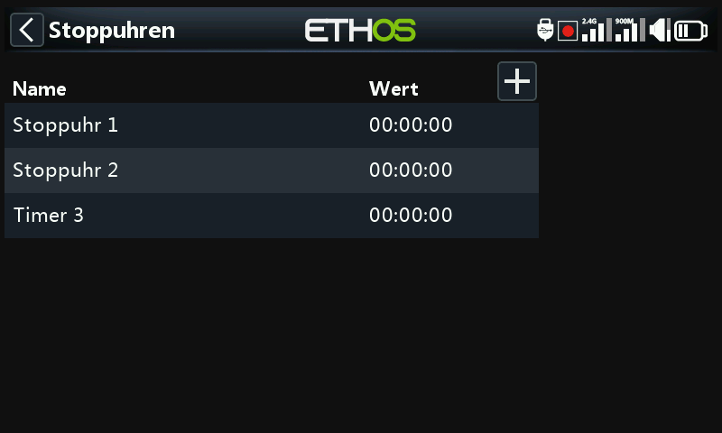
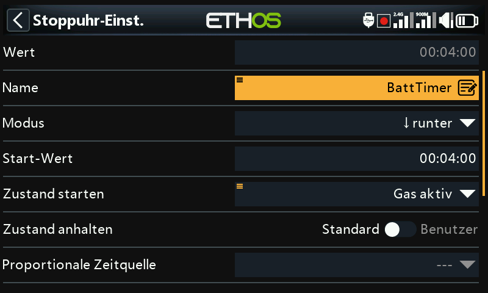
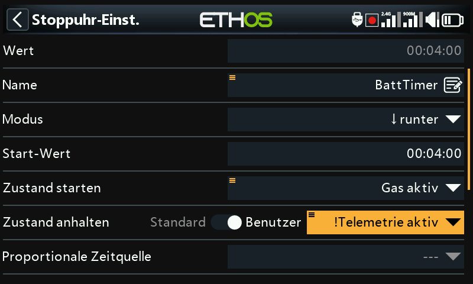
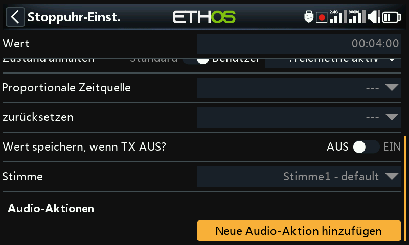
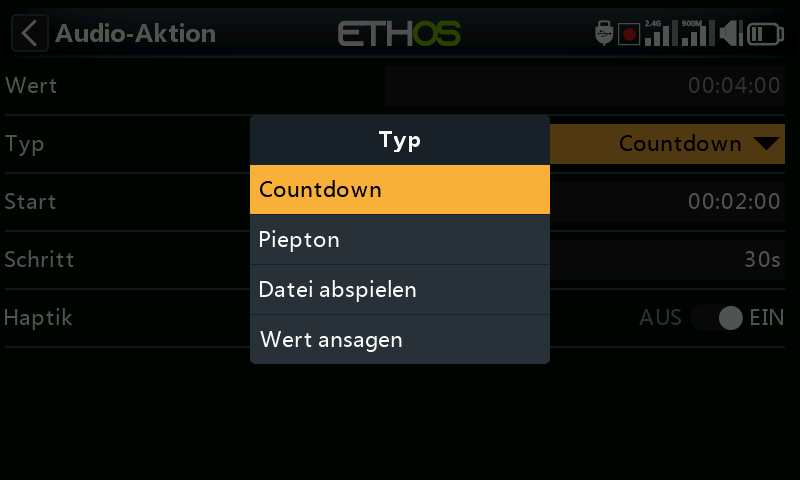
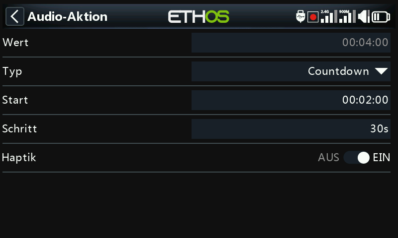
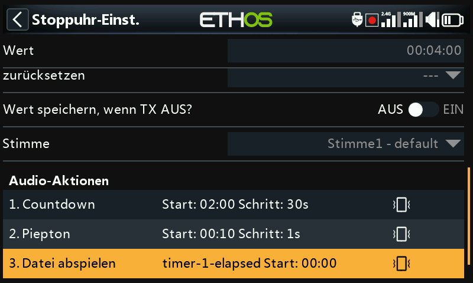
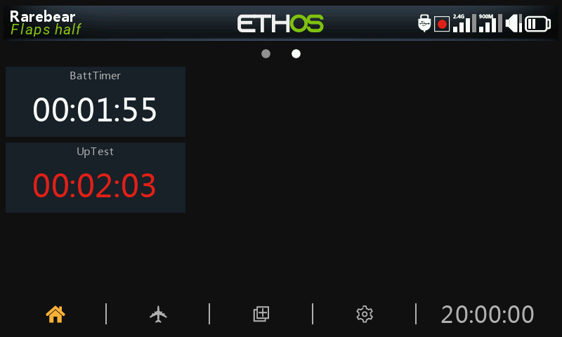

# Stoppuhren

Es gibt acht vollständig programmierbare Timer, die entweder vorwärts oder
rückwärts zählen können. Eine neue Stoppuhr wird über das Symbol **+** neben
den Spaltenüberschriften oder darunter über **Hinzufügen** angelegt. Durch
Berühren einer beliebigen Stoppuhr wird ein Popup-Fenster mit Optionen zum
Zurücksetzen oder Bearbeiten dieser Stoppuhr, zum Hinzufügen einer neuen oder
zum Verschieben oder Kopieren/Einfügen angezeigt.

## Gemeinsame Felder (rückwärts und vorwärts zählend)

- **Wert** — zeigt den aktuellen Wert des Timers an.
- **Name** — ermöglicht die Benennung des Timers.
- **Mode** — **aufwärts** oder **abwärts** zählen.
- **Start Wert** (nur beim Rückwärtszählen) — der Wert, von dem aus der Timer
  auf Null herunterzählt.
- **Alarmwert** (nur beim Hochzählen) — der Wert, bei dem die Stoppuhr abläuft;
  sie zählt weiter, der Wert wird in den Uhren-Widgets jedoch rot angezeigt.
- **Zustand starten** — die Startbedingung startet den Timer. Wenn die
  **Stoppbedingung** auf der Standardeinstellung bleibt, startet und stoppt der
  Timer nur mit der Startbedingung. Andernfalls startet der Timer, wenn die
  Start-Bedingung zuerst WAHR wird, und läuft dann weiter.
- **Zustand anhalten** — wenn diese Bedingung nicht „Standard“ ist, steuert sie
  die Stoppuhr, sobald diese läuft: Die Stoppuhr wird angehalten, wenn die
  Stopp-Bedingung WAHR ist, läuft aber weiter, wenn sie FALSCH ist. Im
  folgenden Beispiel wird die Stoppuhr gestartet, wenn `ThrottleActive` WAHR
  wird, und angehalten, wenn die Telemetrie nicht mehr aktiv ist:

  

- **Proportionale Zeitquelle** — bei der Einstellung `---` zählt der Timer in
  Echtzeit. Jede andere Quelle (z. B. der Gasknüppel oder sogar der Gaskanal)
  steuert die Geschwindigkeit des Timers: Bei −100 % wird die Stoppuhr
  angehalten, bei +100 % zählt sie in Echtzeit, bei Zwischenwerten zählt sie
  proportional.
- **Zurücksetzen** — die Stoppuhr kann durch die Stellung von Schaltern,
  Funktionsschaltern, Logikschaltern oder Trimmschaltern zurückgesetzt werden;
  sie bleibt so lange zurückgesetzt, wie die Rücksetzbedingung gültig ist.
- **Wert speichern, wenn TX AUS?** — die Stoppuhr wird im Speicher gehalten,
  wenn der Sender ausgeschaltet oder das Modell gewechselt wird. Der Wert wird
  bei der nächsten Verwendung des Modells wieder geladen.
- **Stimme** — legt fest, welches
  [Sprachpaket](../system-setup/general.md#audio-settings) diese Stoppuhr
  ansagt.

## Audio-Aktionen

Audio-Aktionen sind sehr leistungsfähig und flexibel, so dass der
Stoppuhr-Alarm genau nach den Anforderungen des Benutzers konfiguriert werden
kann. Jede Aktion hat einen Typ — **Countdown** (per Stimme), **Signalton
Countdown** (mit Pieptönen anstelle der Stimme), **Datei abspielen** oder
**Wert ansagen** — sowie:

- **Start** — der Wert, ab dem diese Countdown-Aktion beginnt.
- **Schritt** — die Intervalle, in denen der Timerwert angesagt wird, bis zu
  10 Minuten (600 s).
- **Haptik** — die Ansagen werden durch haptisches Feedback begleitet.

Eine typische Kombination aus drei Audio-Aktionen:

1. Countdown per Sprache ab 2:00 Restzeit, alle 30 s, mit haptischem Feedback.
2. Signalton-Countdown ab 0:10 Restzeit, jede Sekunde, mit haptischem Feedback.
3. Eine benutzerdefinierte Audiodatei (z. B. `timer-1-elapsed`), die beim
   Ablauf abgespielt wird, mit haptischem Feedback.

Weitere Audio-Aktionen können über **Hinzufügen** ergänzt werden. Bitte
beachten Sie, dass die Liste nach Prioritäten geordnet sein sollte, wobei die
**höchste Priorität am Ende der Liste** steht.

Siehe auch das
[Anzeige-Widget Timer-Log](../displays/index.md#widget-types) für ein
laufendes Protokoll vergangener Stoppuhrläufe.

