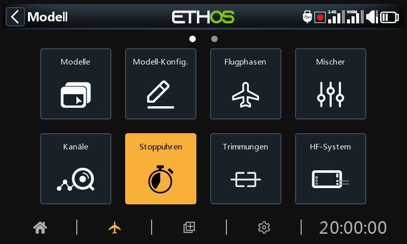
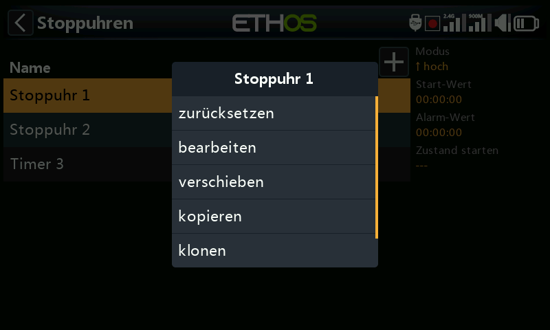
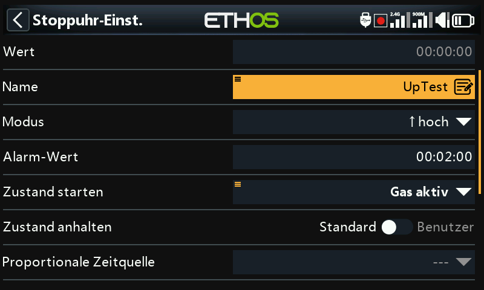

# Stoppuhren

Es gibt 8 vollständig programmierbare Stoppuhren, die entweder vorwärts oder rückwärts zählen können.

Im Hauptbildschirm für Stoppuhren (siehe oben) können neue Stoppuhren  hinzugefügt werden, indem Sie auf das Symbol „+“ neben den Spaltenüberschriften tippen.

Wenn Sie auf eine Stoppuhr-Zeile tippen, wird ein Popup-Fenster mit Optionen zum Zurücksetzen oder Bearbeiten der Stoppuhr oder zum Verschieben oder Kopieren/Einfügen der Stoppuhr angezeigt.

## Countdown-Stoppuhr

### Wert

Zeigt den aktuellen Wert der Stoppuhr an.

### Name

Ermöglicht die Benennung der Stoppuhr.

### Mode

Die Stoppuhr kann aufwärts oder **abwärts** zählen.

### Start Wert

Wenn die Stoppuhr auf Rückwärts zählen eingestellt wurde, ist der Startwert der Wert, von dem aus die Stoppuhr auf Null herunterzählt.

### Zustand starten

Die Startbedingung startet die Stoppuhr. Wenn die Stoppbedingung unten auf die Standardeinstellung gesetzt ist, startet und stoppt die Stoppuhr nur mit der Startbedingung. Wenn die Stopp-Bedingung unten nicht „Standard“ ist, dann startet die Stoppuhr, wenn die Start-Bedingung zuerst WAHR wird, und läuft dann weiter.

### Zustand anhalten

Wenn die Stopp-Bedingung „Standard“ ist, wird die Stoppuhr nur durch die Start-Bedingung gesteuert.

Wenn es nicht „Standard“ ist, steuert die Stopp-Bedingung die Zeitschaltuhr, sobald diese läuft. Die Stoppuhr wird angehalten, wenn die Stopp-Bedingung WAHR ist, läuft aber weiter, wenn die Stopp-Bedingung FALSCH ist.

Im obigen Beispiel wird sie gestartet, wenn Gas aktiv WAHR wird, und wird angehalten, wenn die Telemetrie nicht mehr aktiv ist.

### Proportionale Zeitquelle

Bei der Einstellung '---' zählt die Stoppuhr in Echtzeit. Wenn eine proportionale Zeitquelle ausgewählt ist, wird die Geschwindigkeit der Stoppuhr von dieser Quelle gesteuert, z.B. vom Gasknüppel oder sogar vom Gaskanal. Wenn der Gaswert -100% ist, wird die Stoppuhr angehalten. Ist der Gaswert +100%, zählt sie in Echtzeit. Bei Zwischenwerten zählt die Stoppuhr proportional.

### zurücksetzten

Die Stoppuhr kann durch die Stellung von Schaltern, Funktionsschaltern, Logikschaltern oder Trimmschaltern zurückgesetzt werden. Es ist zu beachten, dass sie so lange zurückgesetzt bleibt, wie die Rücksetzbedingung gültig ist.

### Wert speichern, wenn TX AUS?

Wenn „Wert speichern, wenn TX AUS?“ auf „EIN“ gesetzt ist, wird die Stoppuhr im Speicher gehalten, wenn der Sender ausgeschaltet oder das Modell gewechselt wird. Der Wert wird bei der nächsten Verwendung des Modells wieder geladen.

### Stimme

Wählen Sie die Stimme aus, die für Sprachansagen verwendet werden soll. Weitere Informationen finden Sie im Abschnitt „[Auswahl der Stimmen](../system-setup/general.md)“.

### Audio-Aktionen

Audio-Aktionen sind sehr leistungsfähig und flexibel, so dass der Stoppuhr-Alarm genau nach den Anforderungen des Benutzers konfiguriert werden kann.

Klicken Sie auf „Neue Audioaktion hinzufügen“.

Wählen Sie die gewünschte Audioaktion aus, z. B. „Sekunden zählen“ im obigen Beispiel.

#### Start

Der Startwert ist der Wert, ab dem diese Countdown-Aktion beginnt.

#### Schritt

Der Schrittwert legt die Intervalle fest, in denen der Wert der Stoppuhr angesagt werden soll. Der Schrittwert kann bis zu 10 Minuten (600 Sekunden) betragen.

#### Haptik

Wenn diese Funktion aktiviert ist, werden die Ansagen durch haptisches Feedback begleitet.

Zu den Audio-Aktionsarten gehören „Sekunden zählen“ (per Sprache), „Signalton“ (mit Signaltönen anstelle von Sprache), „Datei abspielen“ und „Wert abspielen“.

In diesem Beispiel wurden drei Audio-Aktionen konfiguriert:

1. Zunächst wird alle 30 Sekunden eine Countdown-Warnung ausgegeben, die bei noch verbleibenden 2 Minuten beginnt. Die Warnung erfolgt in Form einer Sprachausgabe, und es wurde auch eine haptische Rückmeldung aktiviert.
2. Zweitens ertönt ab 10 Sekunden vor Ablauf ein Signalton, danach wird jede Sekunde ein Signalton abgespielt. Die haptische Rückmeldung wurde ebenfalls aktiviert.
3. 3. Zuletzt wird eine benutzerdefinierte Audiodatei „timer-1-elapsed” abgespielt, wenn die Stoppuhr abgelaufen ist (d. h. Null erreicht hat), begleitet von einer haptischen Rückmeldung.

Weitere Audio-Aktionen können durch Berühren der Schaltfläche „Hinzufügen“ hinzugefügt werden. Bitte beachten Sie, dass die Liste nach Prioritäten geordnet sein sollte, wobei die höchste Priorität am Ende der Liste steht.

## Stoppuhr zum Hochzählen

### Wert

Zeigt den aktuellen Wert der Stoppuhr an.

### Name

Ermöglicht die Benennung der Stoppuhr.

### Mode

Die Stoppuhr kann aufwärts oder abwärts zählen.

### Alarmwert

Wenn die Stoppuhr auf Hochzählen eingestellt wurde, legt der Parameter Alarmwert den Wert fest, bei dem sie abläuft. Die Stoppuhr zählt weiter, aber der Wert wird im Uhren-Widgets rot angezeigt.

### ***Z******ustand starten***

Die angegebene Startbedingung startet die Stoppuhr. Wenn die Stoppbedingung unten auf die Standardeinstellung gesetzt ist, startet und stoppt dier Stoppuhr nur mit der Startbedingung. Wenn die Stopp-Bedingung unten nicht „Standard“ ist, dann startet die Stoppuhr, wenn die Start-Bedingung zuerst WAHR wird, und läuft dann weiter.

### ***Zustand*** ***anhalten***

Wenn die Stoppbedingung „Standard“ ist, wird die Zeitschaltuhr nur durch die Startbedingung gesteuert.

Wenn sie nicht „Standard“ ist, steuert die Stopp-Bedingung die Zeitschaltuhr, sobald diese läuft. Die Zeitschaltuhr wird angehalten, wenn die Anhaltebedingung WAHR ist, läuft aber weiter, wenn die Anhaltebedingung FALSCH ist.

### Proportionale Zeitquelle

Bei der Einstellung '---' zählt die Stoppuhr in Echtzeit. Wenn eine proportionale Zeitquelle ausgewählt ist, wird dessen Geschwindigkeit von dieser Quelle gesteuert, z.B. dem Gasknüppel oder sogar dem Gaskanal. Wenn der Gashebelwert -100% beträgt, wird die Stoppuhr angehalten. Wenn der Gaswert +100% beträgt, zählt sie in Echtzeit. Bei Zwischengaswerten wird proportional gezählt.

### Zurücksetzen

Die Stoppuhr kann durch Schalterstellungen, Funktionsschalter, Logikschalter oder Trimmschalterstellungen zurückgesetzt werden. Beachten Sie, dass die Stoppuhr im Reset gehalten wird, solange die Reset-Bedingung gültig ist.

### Wert speich. wenn TX AUS

Wenn „Wert speichern, wenn TX AUS?“ auf „EIN“ gesetzt ist, wird der Stoppuhrwert im Speicher gespeichert, wenn der Sender ausgeschaltet oder das Modell gewechselt wird. Der Wert wird bei der nächsten Verwendung des Modells neu geladen.

### Stimme

Wählen Sie die Stimme aus, die für Sprachansagen verwendet werden soll. Weitere Informationen finden Sie im Abschnitt „[Auswahl der Stimmen](../system-setup/general.md)“.

### Audio-Aktionen

Die Audio-Aktionen sind sehr leistungsfähig und flexibel, so dass die Stoppuhr-Warnungen genau nach den Anforderungen des Benutzers konfiguriert werden können.

In diesem Beispiel wurden drei Audio-Aktionen konfiguriert:

1. Zunächst wird alle 30 Sekunden ein Countdown bis zum Alarmwert, der bei einer verbleibenden Minute beginnt, ausgegeben. Die Warnung erfolgt durch Sprache und haptische Rückmeldung wurde ebenfalls aktiviert.
2. Zweitens ertönt ab 10 Sekunden vor Ablauf ein Warnton, danach wird jede Sekunde ein Warnton abgespielt. Die haptische Rückmeldung wurde ebenfalls aktiviert.
3. Schließlich wird eine benutzerdefinierte Audiodatei „timer-2-elapsed“( Stoppuhr-2-abgelaufen') abgespielt, wenn die Stoppuhr bei Erreichen des Alarmwertes abläuft, begleitet von haptischem Feedback.

Weitere Audio-Aktionen können durch Berühren der Schaltfläche „Hinzufügen“ hinzugefügt werden. Bitte beachten Sie, dass die Liste nach Prioritäten geordnet sein sollte, wobei die höchste Priorität am Ende der Liste steht.
