# Lehrer/Schüler-Konfiguration

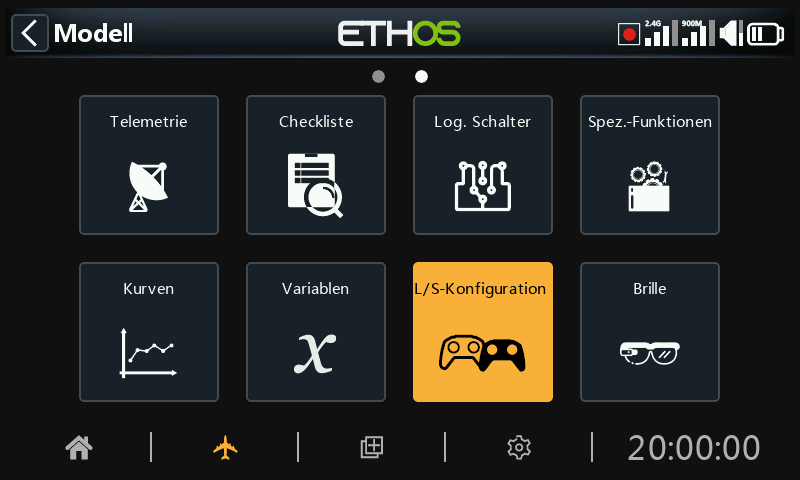

Die Lehrer/Schüler-Funktion (L/S-Funktion) kann als Lehrer oder Schüler konfiguriert werden. Im Lehrer-Modus können bis zu 16 Steuerelemente vom Slave- oder Schülersender an den Master- oder Lehrersender übertragen werden, wenn die „Aktiv“-Bedingung aktiviert ist. Im Schüler-Modus wird eine konfigurierbare Anzahl von Kanälen an den Lehrer übertragen.

Es gibt 5 Methoden zur Konfiguration von L/S-Verbindungen, die gleichzeitig in jede Richtung verwendet werden können:

- L/S-Kabel
    - Bluetooth
    - SBUS am externen Modulanschluss
    - PPM am externen Modulanschluss (dieser kann nicht gleichzeitig mit SBUS am externen Modul verwendet werden).
    - SBUS am S.Port-Anschluss des Funkgeräts

Das oben Genannte kann auch für andere Anwendungen verwendet werden, beispielsweise für ein Head-Tracking-Modul, das Signale sendet, die der Sender zur Steuerung der FPV-Kameraansicht verwendet.

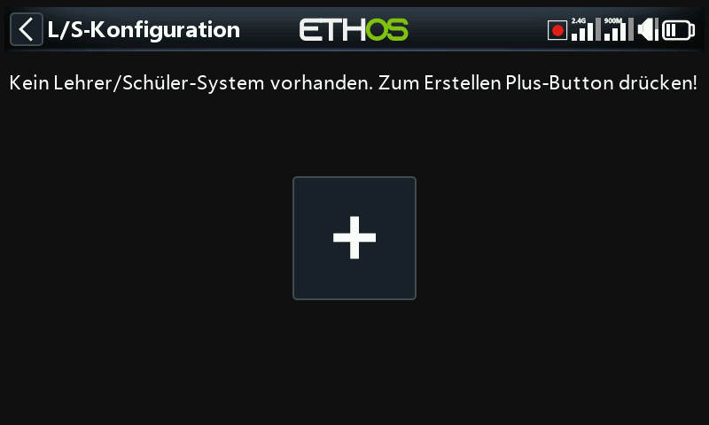

Es sind keine Lehrer/Schüler-Verbindungen voreingestellt. Tippen Sie auf die Schaltfläche „+“, um einen neuen Lehrer/Schüler-Verbindungen hinzuzufügen.

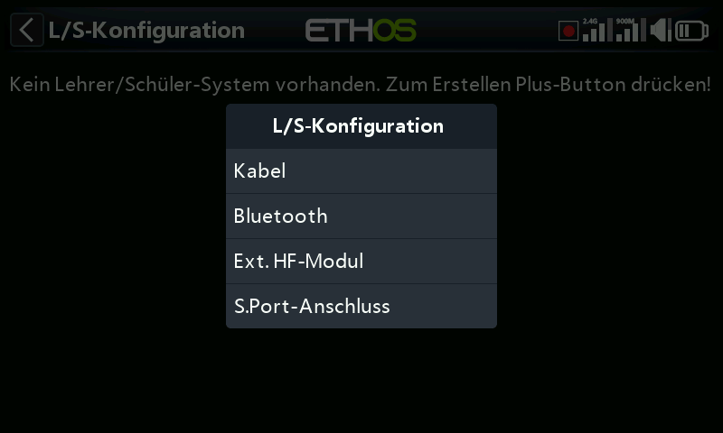

Wählen Sie die Verbindungsmethode aus den vier aufgeführten Optionen aus

.

## L/S-Kabel

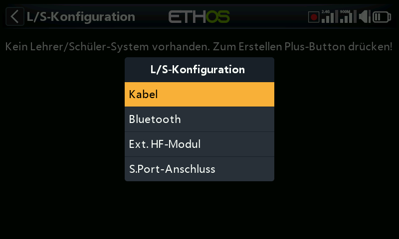

Tippen Sie auf die Option „Kabel“, um eine L/S-Verbindung über ein physisches Kabel zu konfigurieren. Dabei sollte es sich um ein 3,5-mm-Mono-Audiokabel handeln.

### Zustand

Die Funktion des L/S-Kabels kann deaktiviert werden. Dadurch kann der Benutzer jeweils nur eine L/S-Registerkarte aktivieren, während die verschiedenen Konfigurationen erhalten bleiben.

### L/S-Modis

#### Schüler

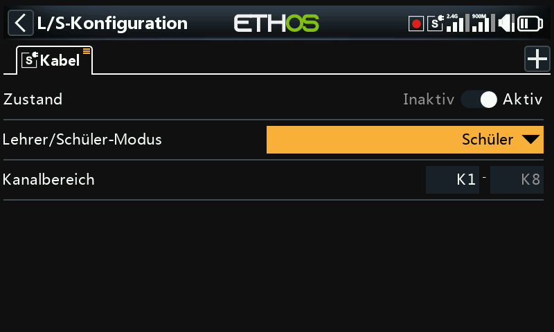

Der Standardmodus für ein L/S-Kabel ist Schüler.

##### Kanalbereich

Es werden acht Kanäle übertragen, wobei die Startkanalnummer konfigurierbar ist.

#### Lehrer

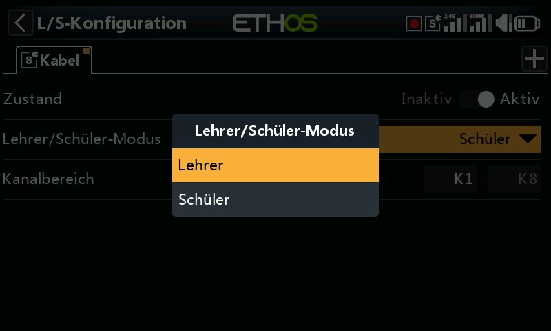

Der TL/S-Kabelmodus kann auf Lehrer umgestellt werden, um den Sender für den Ausbilder (Lehrer) zu konfigurieren.

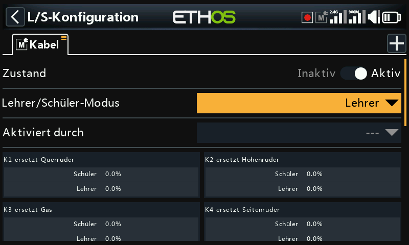

##### L/S-Lehrer-Konfiguration

Weitere Informationen zur Konfiguration des „Aktivzustands“ im L/S-Lehrer-Modus sowie der Schüler-Kanäle finden Sie im folgenden Abschnitt zur [Konfiguration des LS-Lehrers](trainer.md).

#### L/S-Kabel-Optionen

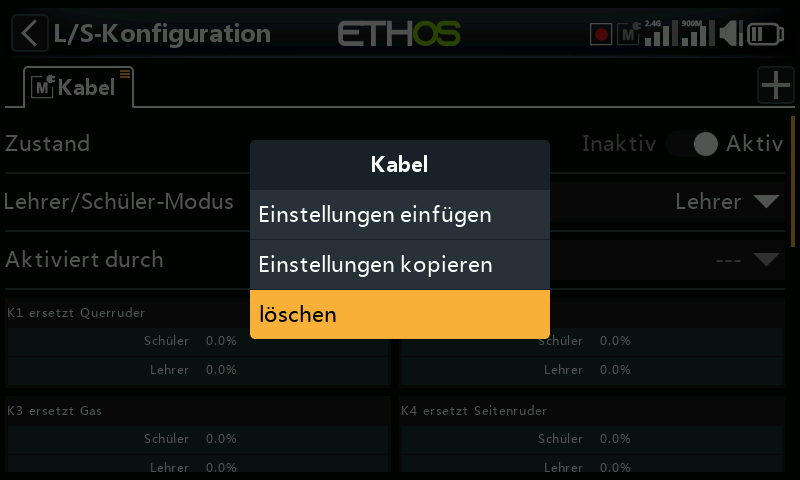

Durch Antippen des Reiters „Trainerkabel“ werden die Reiteroptionen angezeigt.

Wenn ein L/S-Kabel-Lehrer konfiguriert wurde, stehen die Optionen zum Kopieren und Einfügen zur Verfügung. Dadurch können die Einstellungen des L/S-Lehrers zwischen den verschiedenen L/S-Methoden kopiert und eingefügt werden.

Schließlich gibt es noch eine Löschoption, mit der die Registerkarte „L/S-Konfiguration Kabel“ gelöscht werden kann.

## Bluetooth

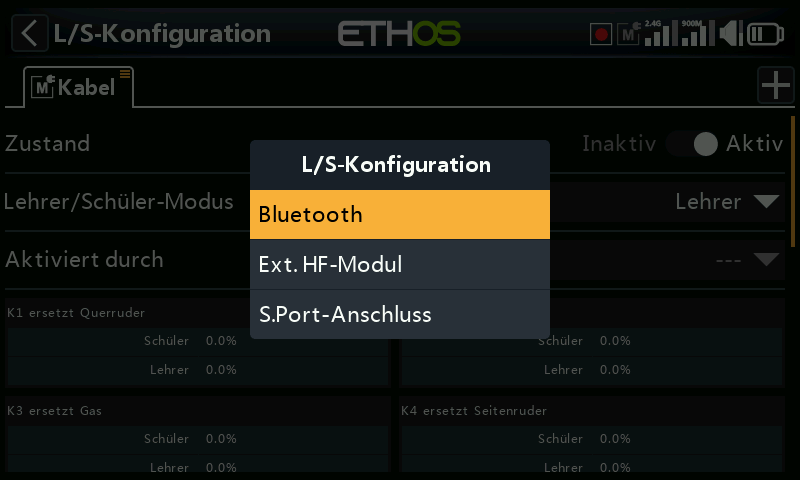

Wählen Sie die Option „Bluetooth“, um eine L/S-Verbindung über Bluetooth zu konfigurieren.

### Zustand

Die Bluetooth-L/S-Funktion kann deaktiviert werden. Dadurch kann der Benutzer jeweils nur eine L/S-Registerkarte aktivieren, wobei die verschiedenen Konfigurationen erhalten bleiben.

### L/S-Modis

#### Schüler

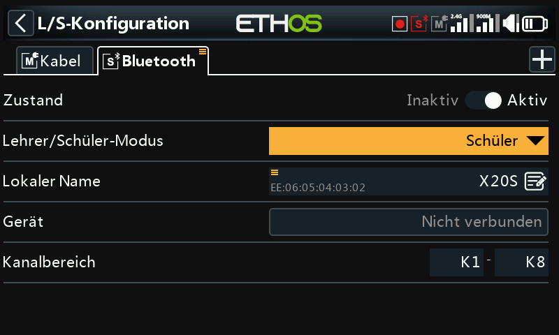

Der Standard-Trainer-Modus für Bluetooth ist „Schüler“.

##### Lokaler Name

##### Lokale Adresse

Dies ist die lokale Bluetooth-Adresse des Senders.

Dies ist der lokale Bluetooth-Name, der auf verbundenen Geräten angezeigt wird. Standardmäßig wird das Sendergerätemodell verwendet, dieser Name kann hier jedoch geändert werden.

##### Gerät

Details zur Bluetooth-Verbindung.

##### Kanalbereich

Standardmäßig werden die ersten acht Kanäle übertragen, dies ist jedoch konfigurierbar.

#### Lehrer

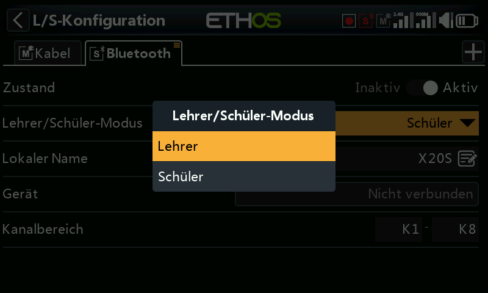

Der Bluetooth-L/S-Modus kann auf „Lehrer“ umgestellt werden, um den Sender für den Lehrer zu konfigurieren.

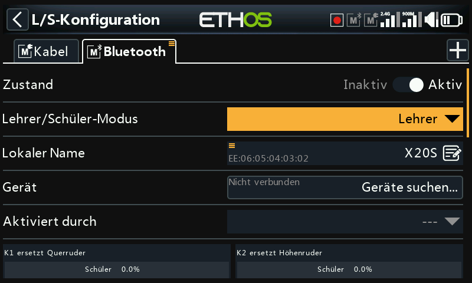

##### Lokaler Name

##### Lokale Adresse

Dies ist die lokale Bluetooth-Adresse des Senders.

Dies ist der lokale Bluetooth-Name, der für die verbundenen Geräten angezeigt werden. Standardmäßig wird das Sendermodell verwendet, dieser Name kann hier jedoch geändert werden.

##### Gerät

##### Suchen

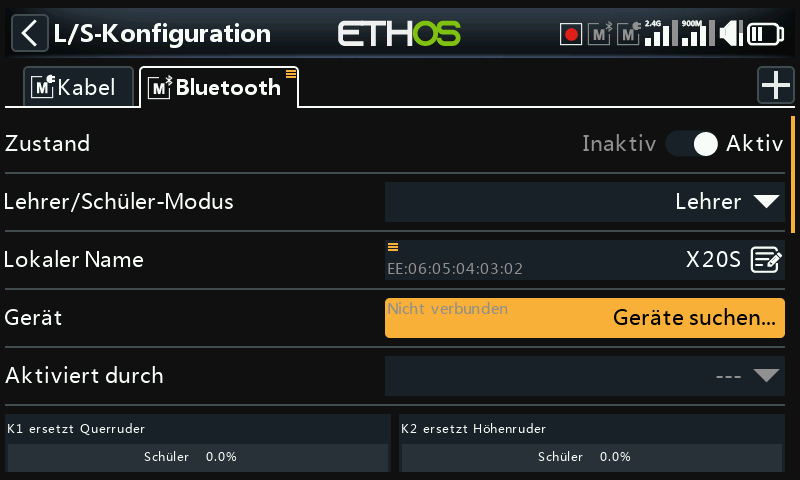

Tippen Sie auf „Geräte suchen“, um den Sender in den Bluetooth-Suchmodus zu versetzen.

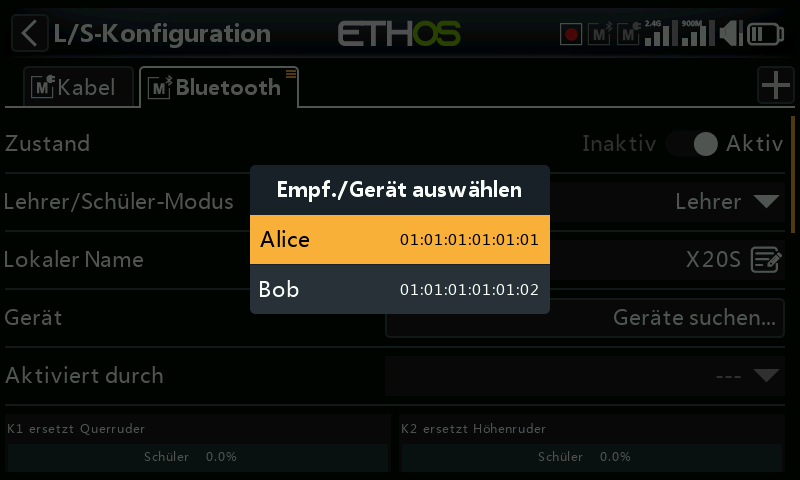

Die gefundenen Geräte werden in einem Popup-Dialog mit der Aufforderung zur Geräteauswahl angezeigt. Wählen Sie die Bluetooth-Adresse aus, die dem als Trainingspartner zu verwendenden Sender entspricht.

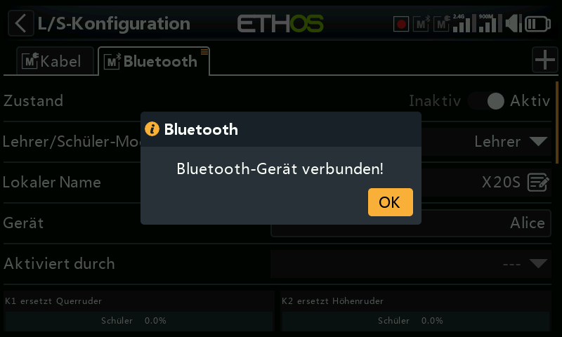

Das ausgewählte BT-Gerät wurde verbunden.

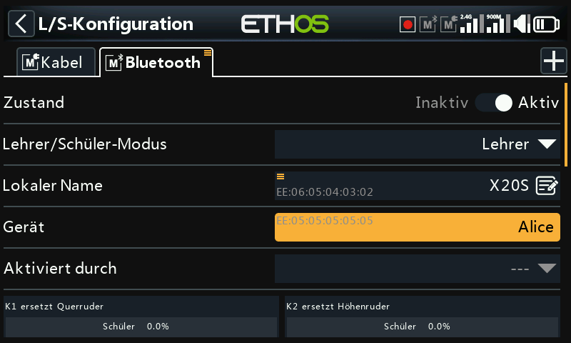

Sobald ein BT-Gerät gefunden und verbunden wurde, wird die Bluetooth-Adresse des gewünschten Geräts in der Gerätezeile angezeigt.

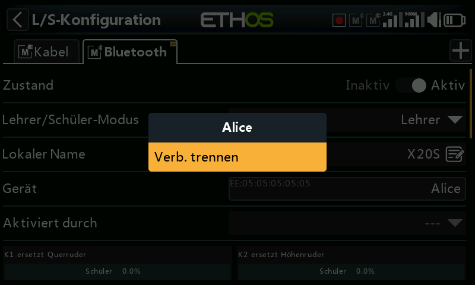

##### Trennen

Tippen Sie auf das Gerät, um die Option „Trennen“ anzuzeigen.

#### Konfiguration des L/S-Lehrers

##### Aktiver Zustand

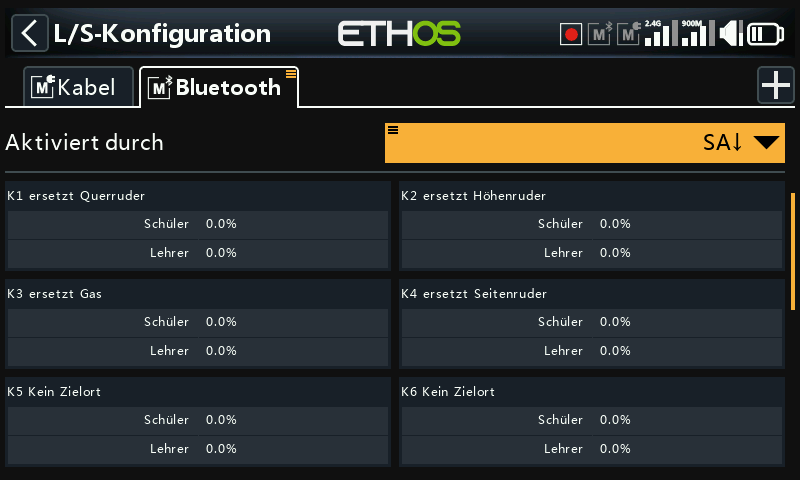

Die Steuerung des Modells kann über einen Schalter oder Taster, einen Funktionsschalter, einen Logikschalter, eine Trimmposition oder einer Flugphase auf die Fernsteuerung des Schülers übertragen werden.

##### Lehrer-Kanäle

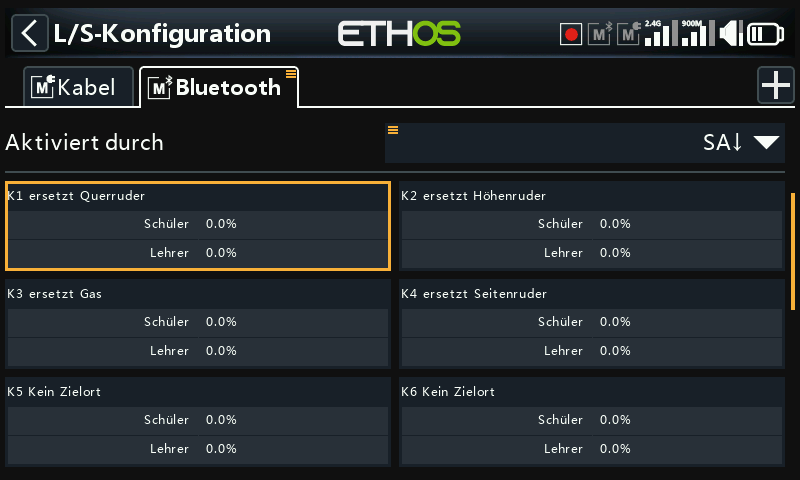

Bis zu 16 Bedienelemente können vom Schülersender auf den Lehrersender übertragen werden, wenn die oben eingestellte „Aktivbedingung“ aktiv ist.

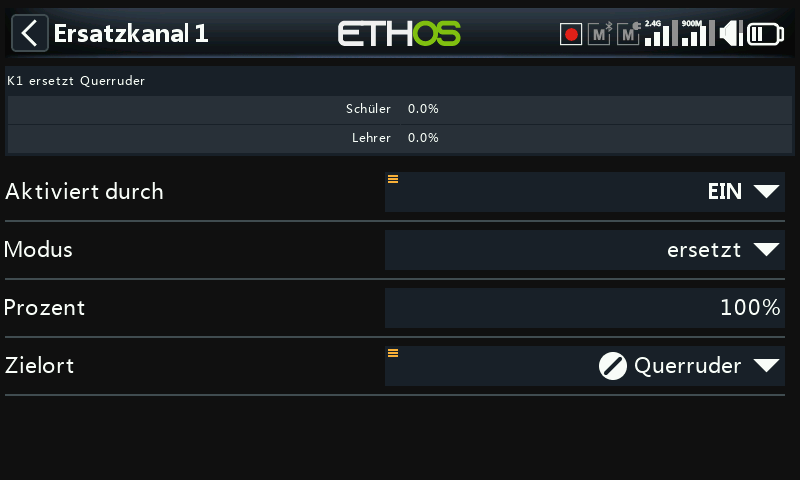

Tippen Sie auf die einzelnen Kanäle, um sie individuell zu konfigurieren.

##### Aktiviert durch

Jeder einzelne Schüler-Kanal kann auch über die ausgewählte Quelle gesteuert werden. So kann beispielsweise die Höhenrudereingabe des Schülers während eines Fluges deaktiviert werden.

##### Modus

##### AUS

Deaktiviert den Kanal für die Nutzung durch den Schüler.

##### Hinzufügen

Wählt den additiven Modus aus, in dem Lehrer- und Schüler-Signale addiert werden, sodass sowohl Lehrer als auch Schüler die Funktion ausführen können.

##### Ersetzen

Die Steuerung durch den Lehrersender wird auf den Schüler übertragen, sodass dieser die volle Kontrolle hat, solange der „Aktivzustand“ aktiv ist. Dies ist der normale Betriebsmodus.

##### Prozent

Normalerweise auf 100 % eingestellt, kann aber zur Skalierung des Schüler-Eingangs geändert werden.

##### Ziel

Ordnet den Kanal des Schülersenders der entsprechenden Funktion zu.

### Option zum Ignorieren von Schüler-Eingaben

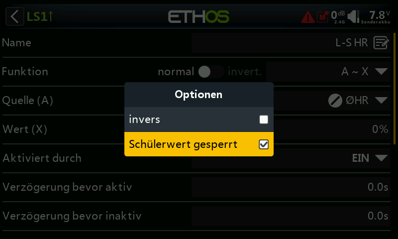

Bei Logikschaltern kann diese Option so eingestellt sein, dass Eingaben des Schülers ignoriert werden. Ein typisches Anwendungsbeispiel ist ein Logikschalter, der die Bewegungen der Steuerknüppel des Lehrer-Senders (z. B. eines Querruderknüppels) erkennt, um bei Störungen sofort eingreifen zu können. Diese Option ist erforderlich, um zu verhindern, dass die Eingaben der Schülerknüppel den Logikschalter auslösen.

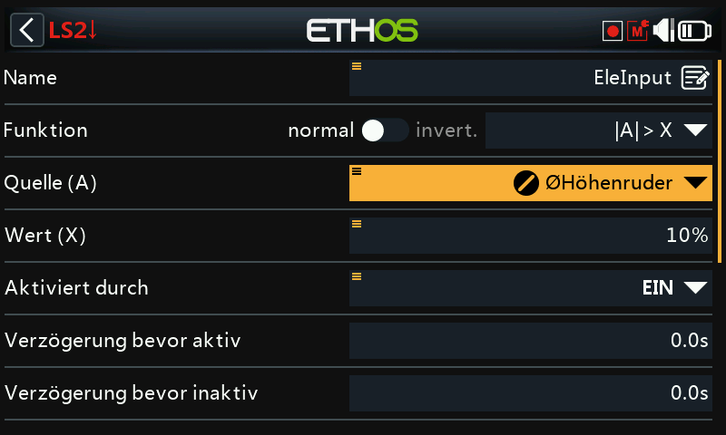

Das kleine Symbol mit dem durchgestrichenen Kreis zeigt an, dass die Quelle für das Querruder die Querrudereingaben des Schülersenders ignoriert.

### Bluetooth-Schüler-Optionen

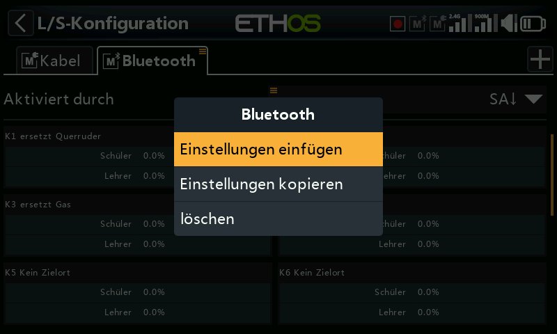

Durch Antippen des Reiters „Bluetooth“ werden die Bluetooth-Optionen angezeigt.

Wenn ein Bluetooth-Lehrer konfiguriert wurde, stehen die Optionen zum Kopieren und Einfügen zur Verfügung. Dadurch können die Lehrer-Einstellungen des Lehrers zwischen den verschiedenen L/S-Methoden kopiert und eingefügt werden.

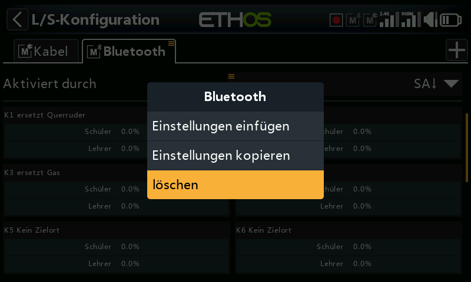

Schließlich gibt es noch eine Löschoption, um den Bluetooth-Konfigurationsreiter zu löschen.

## Externe Module

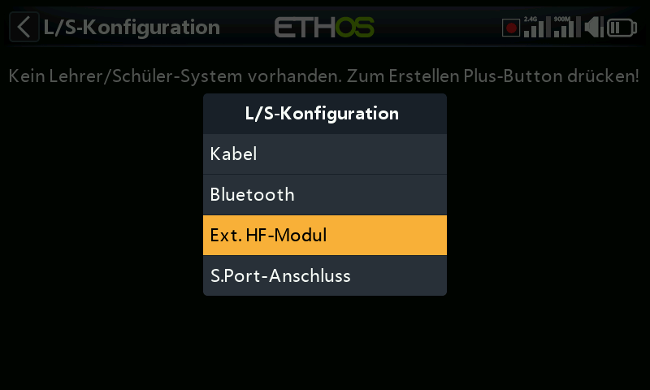

Wählen Sie die Option „Externes Modul“, um eine L/S-Verbindung mithilfe eines externen Moduls zu konfigurieren.

### Zustand

Die Funktion des externen L/S-Moduls kann deaktiviert werden. Dadurch kann der Benutzer jeweils nur eine L/S-Registerkarte aktivieren, während die verschiedenen Konfigurationen erhalten bleiben.

### L/S-Modi

#### Schüler

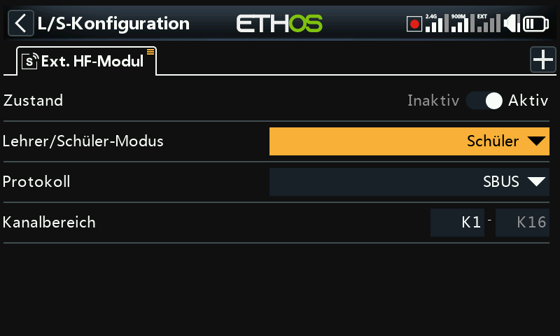

Der Standard-L/S-Modus für ein externes Modul ist Schüler.

##### Protokoll

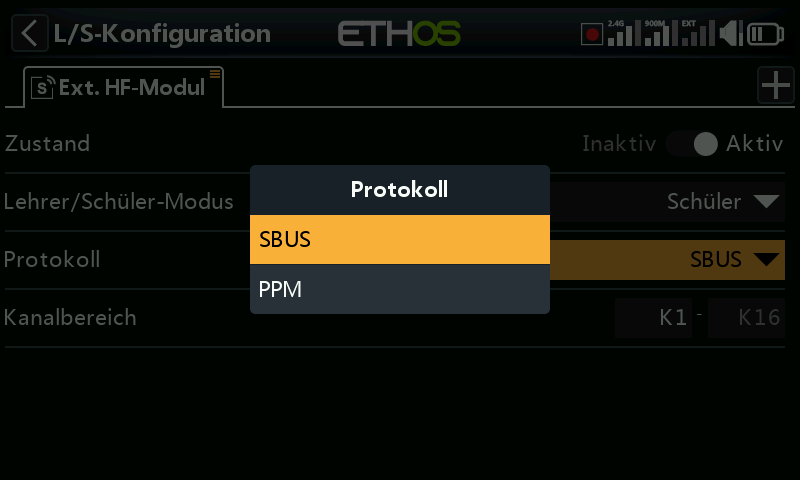

Für eine Schüler-Verbindung über die externe Modulschnittstelle auf der Rückseite des Senders stehen 2 Protokolloptionen zur Verfügung:

##### SBUS

Weitere Informationen zur Konfiguration der Schnittstelle für das externe Modul für den Anschluss eines SBUS-Trainers finden Sie im Abschnitt „[SBUS](#Lesezeichen 85)“ unter „Model/HF-System“.

##### PPM\`

Einzelheiten zur Konfiguration der externen Modulschnittstelle für eine PPM-Trainerverbindung finden Sie im Abschnitt [PPM ](#Lesezeichen 86)unter Modell /HF-System.

##### Kanalbereich

Mit SBUS werden 16 Kanäle übertragen. Mit PPM werden acht Kanäle übertragen, wobei die Startkanalnummer konfigurierbar ist.

#### Master

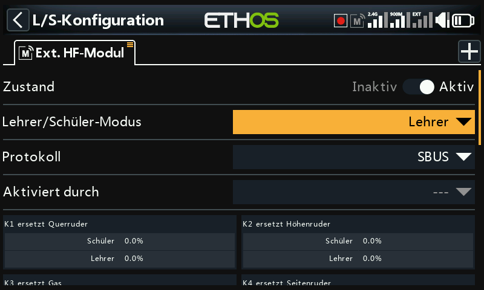

##### Protokoll

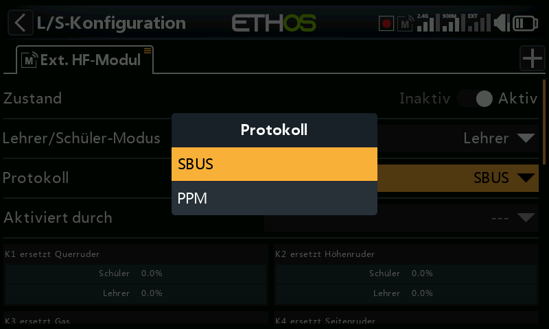

Es gibt zwei Protokolloptionen für eine L/S-Verbindung über die Schnittstelle für externe Module auf der Rückseite des Senders:

##### Lehrer (SBUS)

Weitere Informationen zur Konfiguration der Schnittstelle für das externe Modul für einen SBUS-Trainer-Anschluss finden Sie im Abschnitt „[Trainer-Master (SBUS)](#Lesezeichen 87)“ unter „Modell/HF-System“.

##### Lehrer (PPM)

Weitere Informationen zur Konfiguration der Schnittstelle für externe Module für den Anschluss eines PPM-Trainers finden Sie im Abschnitt „[Trainer-Master (PPM)](#Lesezeichen 88)“ unter „Model/HF-System“.

##### Lehrer-Konfiguration

Weitere Informationen zur Konfiguration des „Aktivzustands“ im Lehrer-Modus sowie der Schüler-Kanäle finden Sie im folgenden Abschnitt zur [Konfiguration des L/S-Lehrers](trainer.md).

#### Lehrer Kabeloptionen

Durch Antippen des Reiters „S.Port-Anschluss“ werden die Reiteroptionen angezeigt.

Wenn ein Lehrer konfiguriert wurde, stehen die Optionen zum Kopieren und Einfügen zur Verfügung. Dadurch können die L/S-Einstellungen zwischen den Lehrermethoden kopiert und eingefügt werden.

Schließlich steht eine Löschoption zur Verfügung, um die Registerkarte „Bluetooth-Konfiguration“ zu löschen.

## S.Port-Anschluss

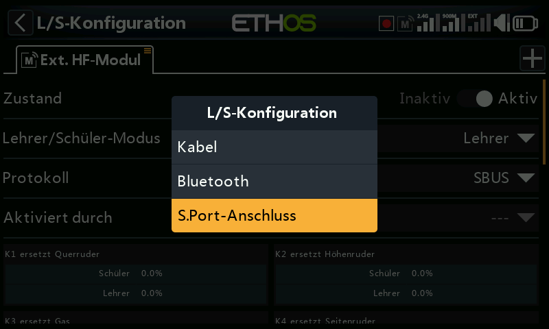

Wählen Sie die Option „S.Port-Anschluss“, um eine L/S-Verbindung über den S.Port-Anschluss an der Oberseite des Funkgeräts einzurichten.

### Zustand

Die L/S-Funktion am S.Port-Anschluss kann deaktiviert werden. Dadurch kann der Benutzer jeweils nur eine L/S-Registerkarte aktivieren, während die verschiedenen Konfigurationen erhalten bleiben.

### L/S-Modi

#### Schüler

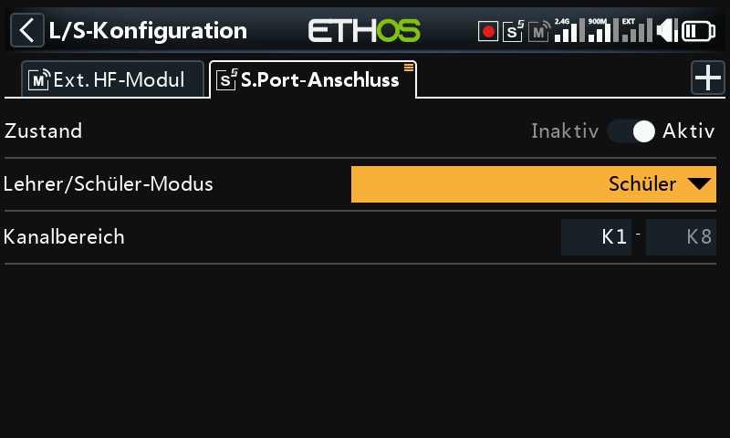

Der Standardmodus für einen S.Port-Anschluss für L/S ist „Schüler“.

##### Kanalbereich

Standardmäßig werden die ersten acht Kanäle übertragen, dies ist jedoch konfigurierbar.

#### Lehrer

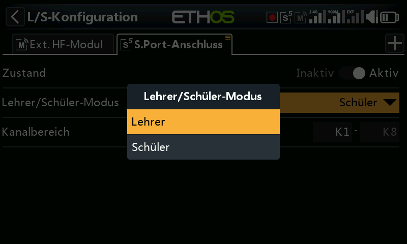

Der S.Port-Anschluss kann in den L/S-Modus „Lehrer“ versetzt werden, um den Sender für den Lehrer zu konfigurieren.

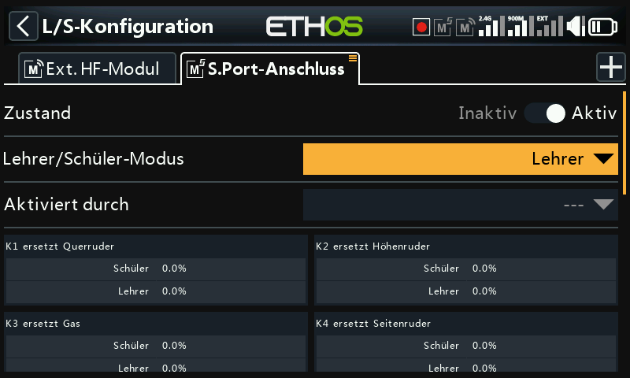

##### Lehrer-Konfiguration

Weitere Informationen zur Konfiguration des „Aktivzustands“ im L/S-Lehrer-Modus sowie der Schüler-Kanäle finden Sie im folgenden Abschnitt zur [Konfiguration des L/S Lehrers](trainer.md).

#### Lehrer-Kabel-Optionen

Wenn Sie auf die Registerkarte „S.Port-Anschluss“ tippen, werden die Optionen dieser Registerkarte angezeigt.

Wenn ein L/S-Lehrer konfiguriert wurde, stehen die Optionen „Kopieren“ und „Einfügen“ zur Verfügung. Auf diese Weise können die Einstellungen des Lehrers zwischen den L/S-Methoden kopiert und eingefügt werden.

Schließlich steht eine Löschoption zur Verfügung, um die Registerkarte „S-Port-Anschluss“ zu löschen.
