# Trainer

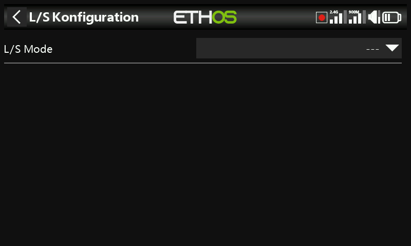

Standardmäßig ausgeschaltet. Legen Sie den Sender als **Master** (Sender des
Lehrers, der bis zu 16 Steuersignale vom Schüler empfängt) oder als **Slave**
(Sender des Schülers, der eine konfigurierbare Anzahl von Kanälen an den
Lehrer sendet) fest.

## Master-Modus

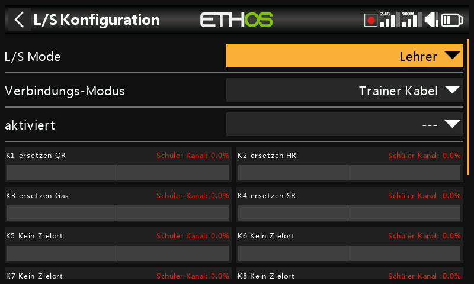

### Verbindungsmodus

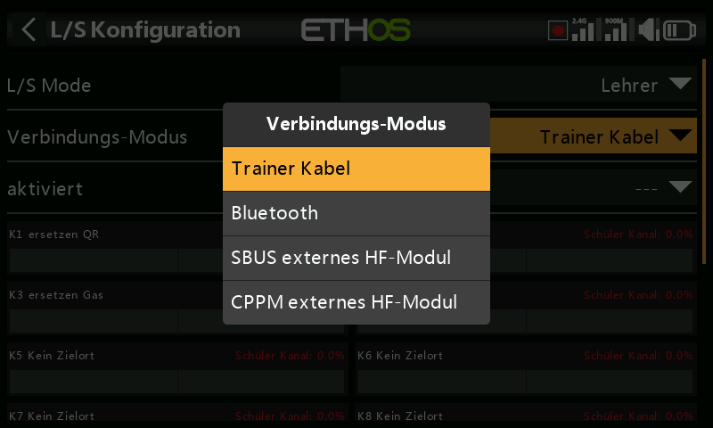

- **Trainerkabel** — ein 3,5-mm-Mono-Audiokabel zwischen den beiden Sendern.
- **Bluetooth** —

  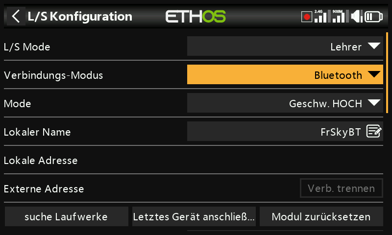

  - **Modus** — normal oder hohe Geschwindigkeit; verwenden Sie die hohe
    Geschwindigkeit für geringere Latenz, sofern beide Sender dies
    unterstützen.

    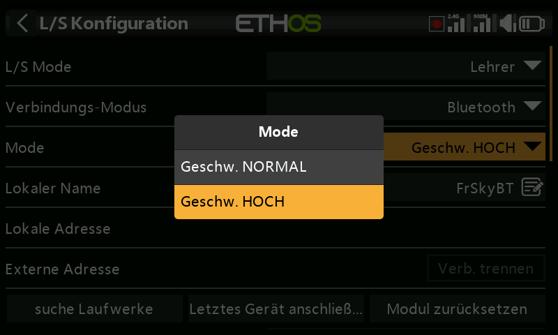

  - **Lokaler Name** — der BT-Name, der anderen Geräten angezeigt wird
    (Standard `FrSkyBT`, änderbar).
  - **Lokale Adresse** — die Bluetooth-Adresse dieses Senders.
  - **Gegenstellen-Adresse** — die Adresse des gekoppelten Senders, sobald
    die Verbindung hergestellt ist.
  - **Geräte suchen** (nur im Master-Modus) — sucht nach Geräten in der
    Umgebung:

    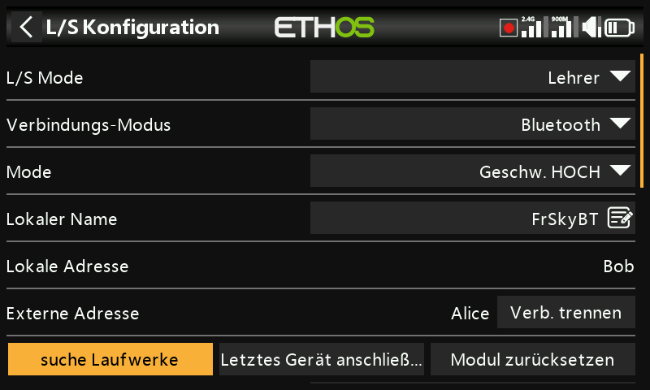
    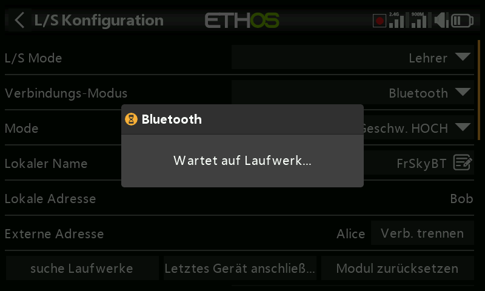
    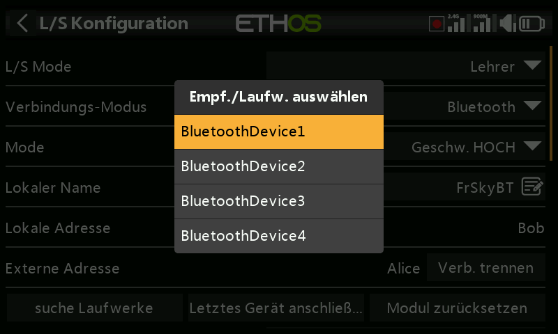
    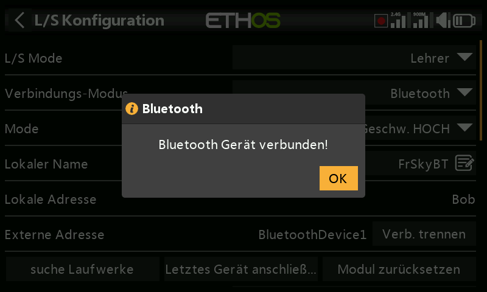

  - **Letztes Gerät verbinden** / **Modul zurücksetzen** — erneute
    Verbindung zur vorherigen Kopplung herstellen oder die Konfiguration
    des Bluetooth-Moduls vollständig löschen.

- **Externes SBUS-Modul** — ein SBUS-Eingang am PXX-IN-Pin des externen
  Modulschachts, um einen FrSky-Empfänger mit SBUS-Ausgang (z. B. Archer RS)
  als Empfangsseite einer drahtlosen Verbindung anzuschließen — dadurch kann
  **jeder** FrSky-Sender als Schülerseite (Buddy-Box) dienen, sofern er an
  diesen Empfänger gebunden ist.
- **Externes CPPM-Modul** — dasselbe Prinzip über einen CPPM-Eingang, für
  einen älteren Empfänger mit CPPM-Ausgang.

### Aktivierungsbedingung

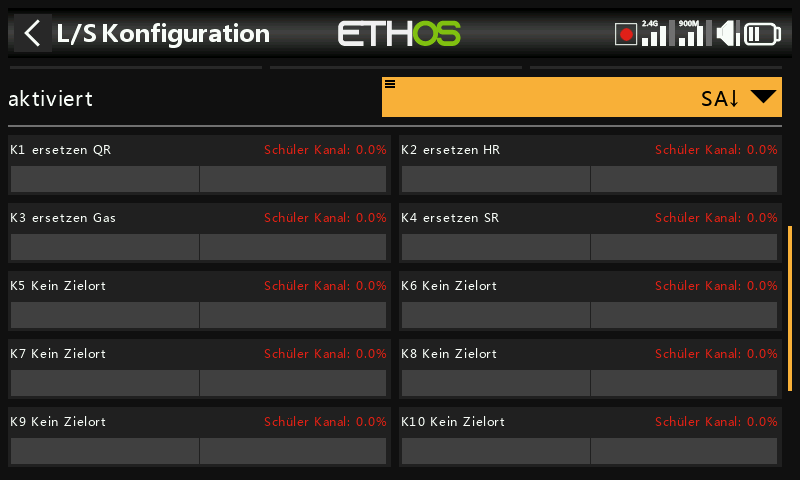

Ein Schalter/Taster, Funktionsschalter, logischer Schalter, eine
Trimmposition oder eine Flugphase, die im aktiven Zustand die Kontrolle an
den Schüler übergibt.

### Trainer-Kanäle

Bis zu 16 Kanäle können vom Schüler zum Master übertragen werden, solange die
Aktivierungsbedingung erfüllt ist. Tippen Sie auf einen Kanal, um ihn
einzeln zu konfigurieren:

- **Aktivierungsbedingung** — eine kanalspezifische Übersteuerung, z. B. um
  während eines Teils der Trainingseinheit nur die Höhenruder-Eingabe des
  Schülers zu deaktivieren.
- **Modus** — **OFF** (für den Trainerbetrieb deaktiviert), **Add** (die
  Signale von Master und Schüler werden addiert, sodass beide gleichzeitig
  auf das Steuer einwirken können) oder **Replace** (der normale Modus — der
  Schüler hat im aktiven Zustand die volle Kontrolle über diesen Kanal).
- **Prozent** — skaliert die Eingabe des Schülers, normalerweise 100 %.
- **Ziel** — auf welche Funktion der Kanal des Schülers abgebildet wird.

Siehe [Anleitung: Sofortige Rückübernahme](../how-to/instant-takeback.md) für
ein durchgearbeitetes Beispiel, wie ein Lehrer die Kontrolle per Schalter
sofort zurückholt, sowie [Trainereingabe
ignorieren](../getting-started/user-interface-and-navigation.md#choosing-a-source),
um die Knüppelbewegung des Schülers von einem logischen Schalter
auszuschließen, der die eigenen Steuerknüppel des Lehrers überwacht.

## Slave-Modus

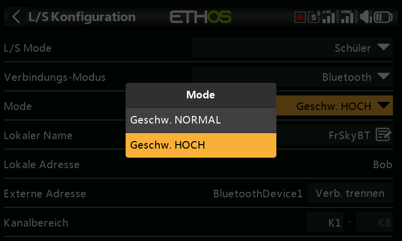

- **Verbindungsmodus** — dieselbe Auswahl aus Trainerkabel, Bluetooth oder
  externem SBUS-/CPPM-Modul wie beim Master (mit denselben Bluetooth-Feldern
  **Modus**/**Lokaler Name**/**Lokale Adresse**/**Gegenstellen-Adresse**).

  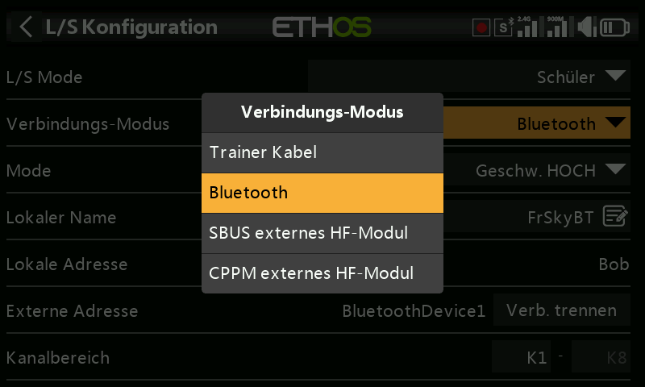

- **Kanalbereich** — welcher Bereich der Kanäle dieses Senders an den Master
  gesendet wird.

  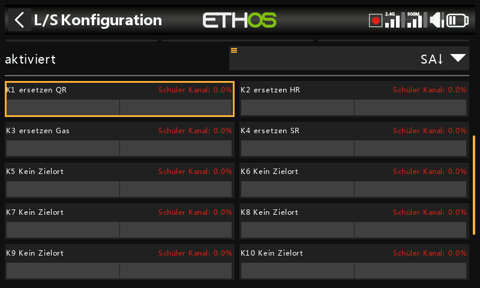
  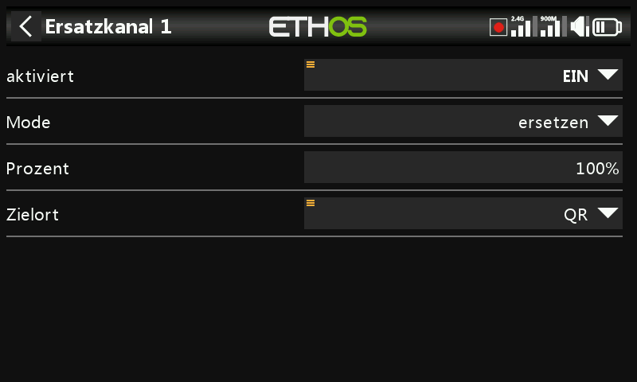
