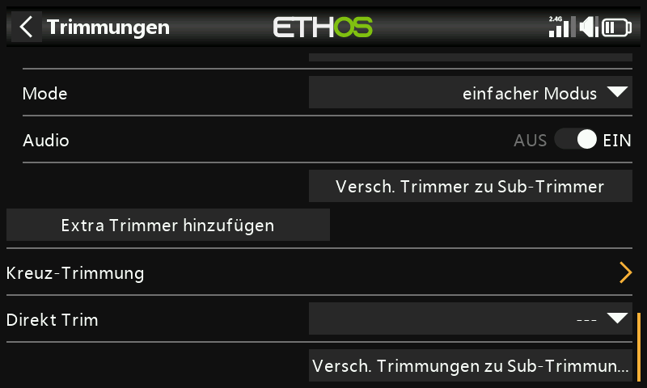

# Trimmungen

Im Bereich Trimmungen können Sie für jeden Steuerknüppel den Trimmbereich,
die Trimmschrittgröße und das Trimmverhalten konfigurieren; hier können auch
Cross-Trimm und Instant-Trimm eingestellt werden. Der **X20 Pro/R/RS** und
der **X18** verfügen über die zwei zusätzlichen Trimmtaster **T5**/**T6**,
die für Anpassungen während des Fluges über die vier Hauptknüppel hinaus
sehr nützlich sind:

Für jeden Knüppel gibt es eine eigene, unabhängige Reihe von
Trimmeinstellungen.

## Trimm-Einstellungen {: #trim-settings }

- **Bereich** — der Standard-Trimmbereich beträgt +/- 25 %, er kann bis zum
  vollen Knüppelbereich von ±100 % verändert werden. Beachten Sie, dass auf
  dem Hauptdisplay der Standard-Trimmbereich als −100 bis 100 angezeigt
  wird; bei einem Trimmbereich von 100 % wird −400 bis 400 angezeigt (d. h.
  das Vierfache des normalen Trimmbereichs).

  !!! warning
      Bei einem größeren Bereich ist Vorsicht geboten, da ein zu langes
      Halten des Trimmtasters so viel Trimmung hinzufügen kann, dass Ihr
      Modell nicht mehr fliegbar ist.

- **Schritt** — Größe der Trimmschritte: **Extra fein**, **Fein**,
  **Mittel**, **Grob**, **Exponentiell** (feine Schritte in der Nähe der
  Mitte, grobe Schritte weiter außen) oder **Benutzerdefiniert** (der
  Trimmschritt wird als Prozentsatz pro Klick angegeben).

  

  | Schritt | µs pro Klick (Bereich 25 %) |
  |---|---|
  | Extra fein | 0,5 |
  | Fein | 1 |
  | Mittel | 2 |
  | Grob | 4 |
  | Exponentiell | 0,3–16 |

  Bei benutzerdefinierten Trimmungen und einem Standardbereich von 25 %:
  Schrittweite 1 % = 1 µs pro Klick, Schrittweite 100 % = 128 µs pro Klick.
  Bei einem Bereich von 100 %: Schrittweite 1 % = 5 µs pro Klick,
  Schrittweite 100 % = 512 µs pro Klick.

## Modus

Standardmäßig sind die Trimmungen immer eingeschaltet, aber mit **Mode**
lässt sich dieses Verhalten ändern. Die Trimmungen werden auf 0
zurückgesetzt, wenn der Modus geändert wird.

- **AUS** — die Trimmung ist vollständig deaktiviert.

  

  Bei Elektromodellen ist die Gastrimmung beispielsweise nicht erforderlich
  und kann durch Einstellen des Modus auf AUS deaktiviert werden. Die
  freigewordene Trimmung kann dann
  [zum Einstellen einer Var verwendet werden](variables.md).

- **einfacher Modus** — es gibt nur einen Trimmwert für jedes
  Steuerelement, so dass der Trimmwert für alle Flugphasen gleich ist. Dies
  ist in der Regel für die Querruder- und Seitenrudertrimmung geeignet, da
  sich diese Trimmungen normalerweise nicht zwischen den Flugphasen
  unterscheiden.

  

- **Trimmung je Flugphase** — die Trimmung wirkt sich nur auf die aktive
  Flugphase aus. Diese Option wird normalerweise für die
  Höhenrudertrimmung verwendet, da die erforderliche Höhenrudertrimmung
  typischerweise für jede Flugphase unterschiedlich ist, z. B. aufgrund von
  Unterschieden in der Flügelwölbung — in der Tat ist dies oft der
  Hauptgrund für die Einführung von Flugphasen überhaupt.

  

- **Benutzer** — im benutzerdefinierten Modus kann das Trimmverhalten
  vollständig angepasst werden, aufgebaut aus **Aktionen**, die Sie selbst
  hinzufügen.

### Benutzerdefiniertes Trimmverhalten

Jede Aktionszeile besteht aus einer Bedingung und einer der folgenden
Optionen:

- **nicht ausgewählt** — deaktiviert die Trimmung selektiv unter dieser
  Bedingung (anstatt sie mit Mode = AUS vollständig abzuschalten).

  
  

- **normal** (Standard) — gewöhnliches Trimmverhalten.
- **Gleichwertig (mit einem anderen Trimmer)** — die Trimmung für diese
  Bedingung ist exakt gleich der Trimmung einer anderen Bedingung.

  

- **Offset + (weiterer Trimm)** — die Trimmung für diese Bedingung wird zur
  Trimmung einer anderen Bedingung hinzugefügt.

  

**Beispiel für Offsettrimmung** — ein Segelflugzeug mit einer
Basis-Höhenrudertrimmung für **Reiseflug** sowie davon abhängigen
Trimmungen für **Speed** und **Thermal**:

1. Trimmen Sie das Höhenruder in der Standard-Flugphase (Reiseflug) für den
   Horizontalflug.
2. Fügen Sie eine Aktion hinzu: **Offset + Standard** mit der Bedingung
   `FM5(Speed)`. Wenn der FM5(Speed)-Modus ausgewählt ist, werden alle
   Trimmeinstellungen als Offset zum Basis-Trimmwert im Reiseflug
   gespeichert — die Trimmung ist damit separat, aber dennoch abhängig von
   der Basistrimmung.

   

3. Fügen Sie auf die gleiche Weise eine zweite Aktion hinzu:
   **Offset + Standard** mit der Bedingung `FM4(Thermal)`. (Sobald die erste
   Aktion existiert, werden im Dropdown-Dialog zusätzlich die Optionen
   `gleich FM5(Speed)` und `Offset + FM5(Thermal)` angezeigt, da nun auch
   auf diese Aktion Bezug genommen werden kann.)

   

Wenn Ihre Basistrimmung für den Reiseflug später geändert werden muss, weil
Sie die Schwerpunktlage des Flugzeugs geändert haben, werden die abhängigen
Trimmeinstellungen für Speed und Thermal automatisch um den gleichen Betrag
geändert, da es sich um Offsets auf diesen Wert und nicht um unabhängige
Werte handelt.

- **Audio** — für jede Trimmung kann Audio deaktiviert werden, wenn die
  Standardansagen nicht gewünscht sind, z. B. wenn die Trimmung
  umfunktioniert wurde.

## Extra Trimmer

Mit **Extra Trimmer hinzufügen** wird eine Trimmung über die vier
Standardknüppel (und T5/T6) hinaus erstellt: **Name**, die Quellen für
**hoch**/**runter** zur Ansteuerung sowie dieselben Optionen für
**Bereich**, **Schritt**, **Mode** und **Audio** wie oben.

## Kreuz-Trimmung

Legt fest, welcher Trimmtaster tatsächlich welchen Steuerknüppel trimmt —
erlaubt also, die Trimmung eines Knüppels über ein anderes physisches
Trimmelement als üblich anzusteuern. (T5/T6 stehen nur beim X20 Pro und
X18 zur Verfügung.)

## Instant-Trimm {: #instant-trim }

Solange aktiv, werden die aktuellen Knüppelpositionen in die entsprechenden
Standardtrimmungen (und Kreuz-Trimmungen) übernommen. Legen Sie diese
Funktion am besten auf einen Schalter, der erreichbar ist, ohne die Knüppel
loszulassen — im geraden Horizontalflug ausgelöst, setzt sie die
Trimmungen sofort, anstatt bei stark verstellten Trimmungen wiederholt
einen Trimmtaster betätigen zu müssen. Deaktivieren Sie sie nach dem
Trimmflug wieder, um die Trimmungen später nicht versehentlich zu
verstellen.

!!! note
    Der Instant-Trimm ist nur aktiv, solange eine der Hauptansichten
    angezeigt wird.

## Trimmungen zu Sub-Trimmungen verschieben

Nach dem Austrimmen auf Horizontalflug wird der Trimmwert eines Kanals
(z. B. Höhenruder) in dessen [Sub-Trimm](outputs.md)-Einstellung übernommen
und die angezeigte Trimmung auf null zurückgesetzt — eine saubere
Möglichkeit, später zu prüfen, ob sich die Flugtrimmung verändert hat.

Bei Verwendung von Flugphasen kann ein Kanal mehrere relevante Trimmwerte
besitzen, während der Sub-Trimm im Bereich Ausgänge eine einzige globale
Einstellung für alle Flugphasen ist. Diese Funktion berücksichtigt das: Sie
übernimmt die Trimmung der **aktuell ausgewählten** Flugphase in den
Sub-Trimm, setzt diese Trimmung zurück und passt die Trimmungen *aller
anderen* Flugphasen desselben Kanals kompensierend an — sodass die
tatsächliche Ruderstellung in jeder Flugphase insgesamt unverändert bleibt.

!!! tip
    Führen Sie dies aus Konsistenzgründen immer aus derselben
    „Basis“-Flugphase heraus aus (z. B. Reiseflug bei einem Segelflugzeug) —
    solange Sie das tun, kann der Vorgang gefahrlos wiederholt werden.

Große Trimm- oder Sub-Trimmwerte führen zu sehr asymmetrischen Ausschlägen
— besser, die Ursache mechanisch zu beheben. Ziel sind Anlenkungen im
90°-Winkel bei neutralen Rudern (Ausnahme sind Wölbklappen, bei denen man
etwas Ausschlag nach oben gegen mehr Ausschlag nach unten eintauscht);
anschließend lässt sich mit **PWM center** exakt auf 90° feinjustieren,
sobald die Anlenkung nahe dran ist.
