# Trimmungen

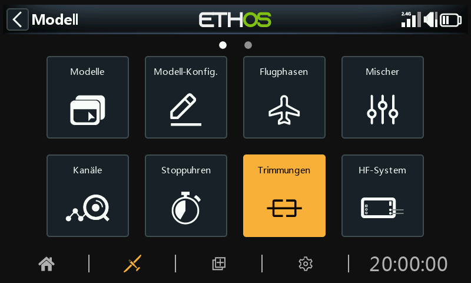

Im Bereich Trimmungen können Sie den Trimmbereich und die Trimmschrittgröße konfigurieren oder ein benutzerdefiniertes Trimmverhalten für jeden der 4 Steuerknüppel festlegen. Hier können auch Cross-Trimm und Instant-Trimm konfiguriert werden.

Der X20 Pro/R/RS und der X18 verfügen über die zwei zusätzliche Trimmtaster T5 und T6, die für Anpassungen während des Fluges sehr nützlich sind.

Zusätzliche Trimmungen können nach Bedarf konfiguriert werden.

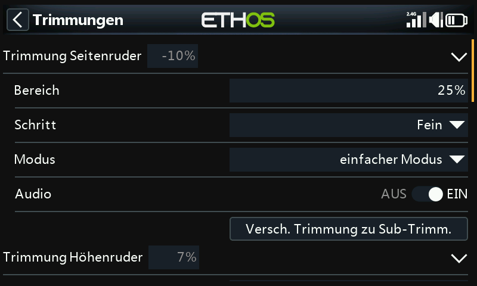

Für jeden Knüppel gibt es eine Reihe von Trimmeinstellungen.

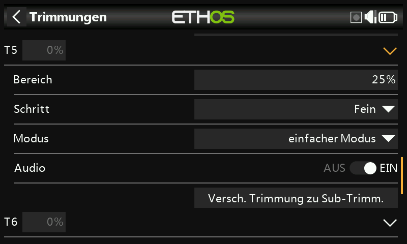

Der X20 Pro und der X18 ist mit den zwei zusätzliche Trimmtastern T5 und T6 ausgestattet.

## Trimm-Einstellungen

### Bereich

Der Standard-Trimmbereich beträgt +/- 25%. Der Bereich kann so verändert werden, dass er den vollen Knüppelbereich von 100 % abdeckt. Bei dieser Option ist Vorsicht geboten, da ein zu langes Halten des Trimmtasters so viel Trimmung hinzufügen kann, dass Ihr Modell nicht mehr fliegbar ist.

Beachten Sie, dass auf dem Hauptdisplay der Standard-Trimmbereich als -100 bis 100 angezeigt wird. Bei einem Trimmbereich von 100 % wird -400 bis 400 angezeigt (d.h. das Vierfache des normalen Trimmbereichs).

### Schritt

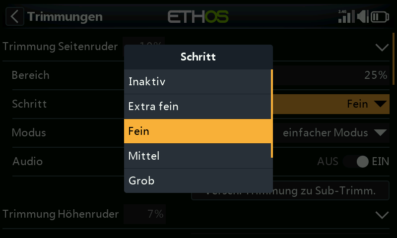

Mit dem Parameter „Schritt“ können Sie die Trimmung deaktivieren oder die Größe der Trimmschritte konfigurieren, von „Extra fein“ über „Fein“, „Mittel“, „Grob“, „Exponentiell“ und „Benutzerdefiniert“. Die Einstellung Exponentiell ergibt feine Schritte in der Nähe der Mitte und grobe Schritte weiter außen. Bei der Einstellung Benutzerdefiniert kann der Trimmschritt als Prozentsatz angegeben werden.

Bei einem Standardbereich von 25 % sind die Trimmschritte pro Klick wie folgt:

Extra fein	0.5us

Fein	1us

Mittel	2us

Grob	4us

Exponential	0.3us bis 16us

Bei benutzerdefinierten Trimmungen und einem Standardbereich von 25 % sind die Trimmschritte pro Klick wie folgt:

Schrittweite 1%	    1us

Schrittweite 100%	128us pro Schritt

Bei benutzerdefinierten Trimmungen und einem Bereich von 100 % sind die Trimmschritte pro Klick:

Schrittweite 1%	    5us

Schrittweite 100%	512us pro Schritt

### Modus

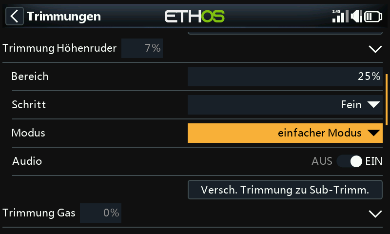

Standardmäßig sind die Trimmungen immer eingeschaltet, aber die Optionen für das Trimmverhalten können so konfiguriert werden, dass das Trimmverhalten je nach den verschiedenen Bedingungen geändert wird.

Hinweis: Die Trimmungen werden auf 0 zurückgesetzt, wenn der Modus geändert wird.

Es gibt vier Modi für das Trimmverhalten:

#### AUS

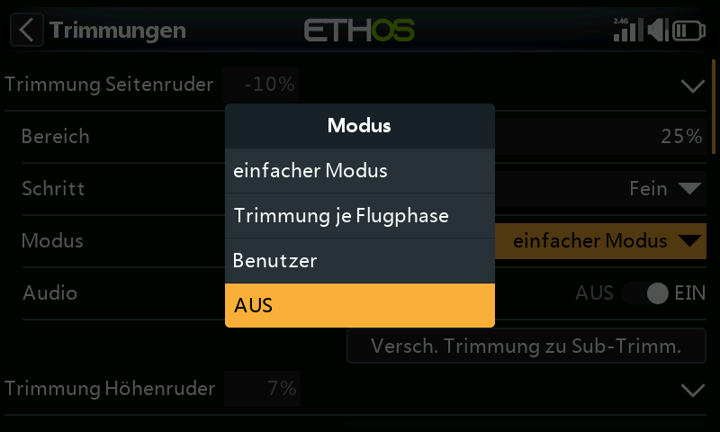

Wenn der Trimm-Modus auf AUS gesetzt ist, ist die Trimmung deaktiviert.

Bei Elektromodellen ist die Gastrimmung beispielsweise nicht erforderlich und kann durch Einstellen des Modus auf AUS deaktiviert werden. Die Trimmung kann dann zum Einstellen einer Var verwendet werden, siehe dazu den Abschnitt „[Verwendete Trimmung](variables.md)“ im Abschnitt „Var“.

#### Einfacher Modus

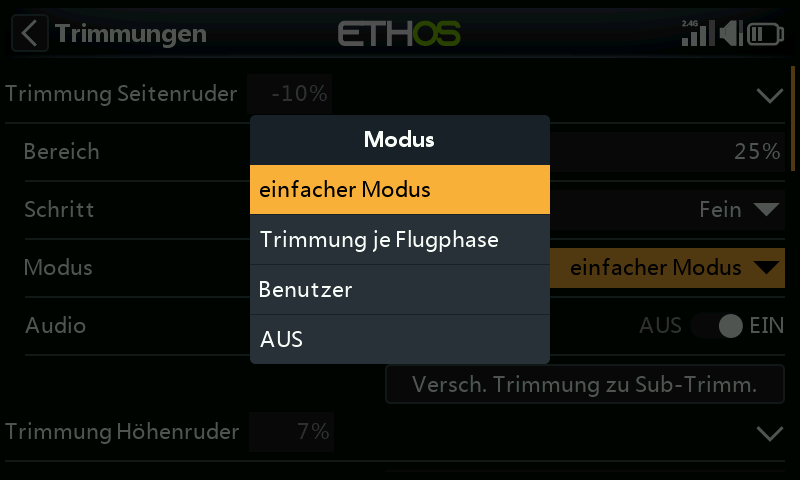

Im Einfachen Modus gibt es nur einen Trimmwert für jedes Steuerelement, so dass der Trimmwert für alle Flugphasen gleich ist. Dies ist in der Regel für die Querruder- und Seitenrudertrimmung geeignet, da sich diese Trimmungen in der Regel nicht zwischen den Flugphasen unterscheiden.

#### Trimmung je Flugphase

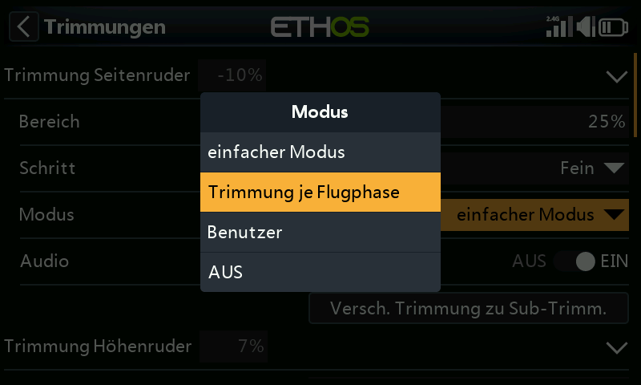

#### Benutzer

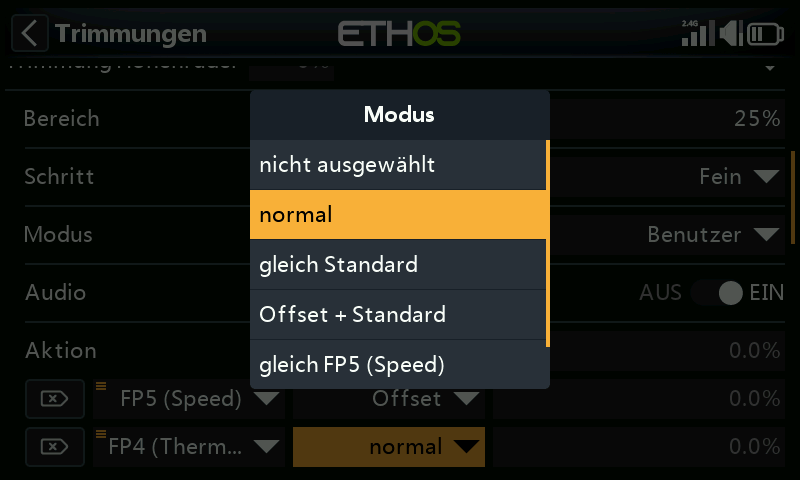

Im benutzerdefinierten Modus kann das Trimmverhalten angepasst werden

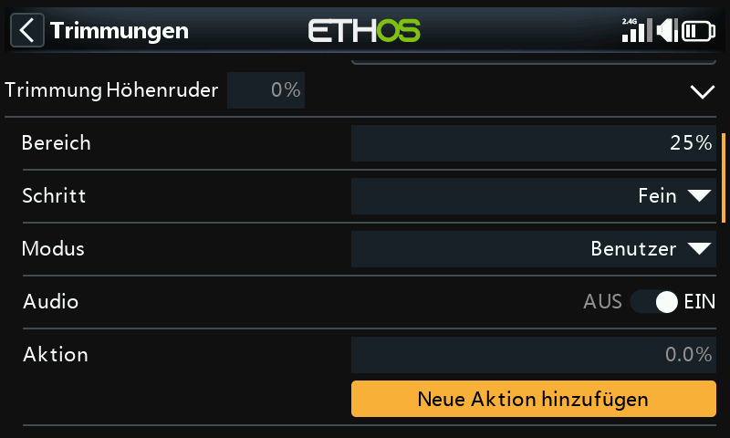

Sobald der benutzerdefinierte Modus ausgewählt wurde, erscheint ein neues Dialogfeld „Aktion“. Klicken Sie auf „Eine Aktion hinzufügen“.

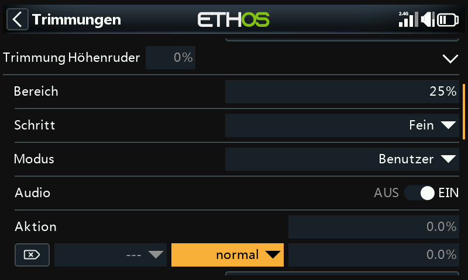

Es wird eine neue Aktion hinzugefügt.

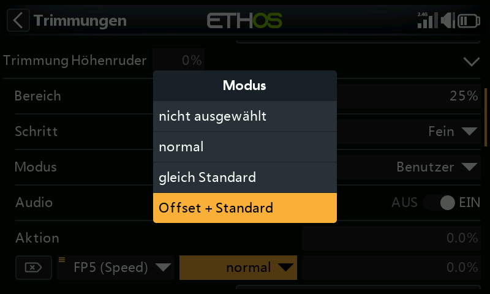

Die anfänglichen Verhaltensoptionen sind:

-     - nicht ausgewählt
-     - normal (Standard)
-     - gleich Standard 
-     - Offset + Standard

Die einzelnen Optionen werden im Folgenden beschrieben.

##### Deaktivieren der Trimmung

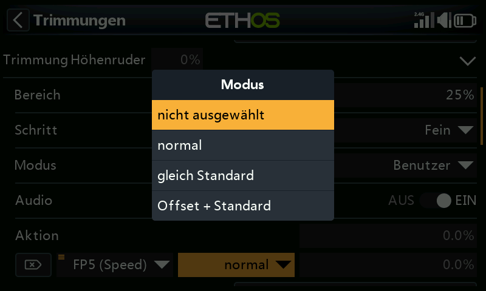

Trimmungen können selektiv deaktiviert werden, indem die Option „nicht ausgewählt“ konfiguriert wird.

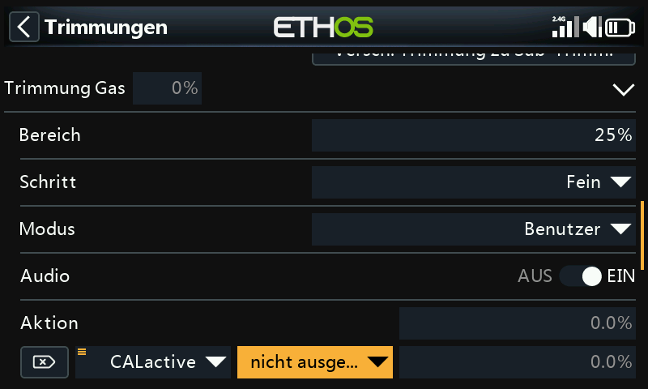

Trimmungen können selektiv deaktiviert werden, indem man von „EIN“ zum gewünschten Zustand wechselt. Um eine Trimmung vollständig zu deaktivieren, setzen Sie den Trimm-Modus wie oben beschrieben auf AUS.

##### Gleichwertig (mit einem anderen Trimmer)

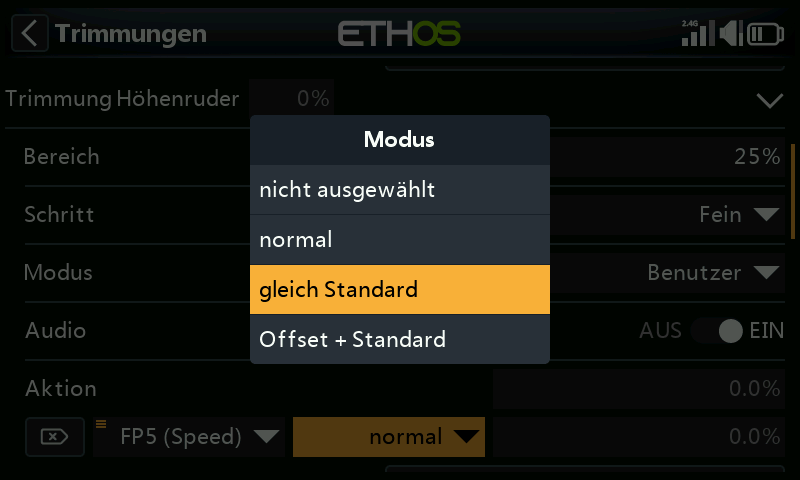

Die Trimmung für eine bestimmte Bedingung kann so konfiguriert werden, dass sie gleich der Trimmung einer anderen Bedingung ist.

##### Offset + (weiterer Trimm)

Die Trimmung für eine bestimmte Bedingung kann so konfiguriert werden, dass sie zur Trimmung einer anderen Bedingung hinzugefügt wird.

##### Beispiel für Offsettrimmung

Bei vielen Modellen möchten Sie eine Basis-Höhenrudertrimmung für das Fliegen im Standardmodus und dann abhängige Höhenrudertrimmungen für andere Flugphasen haben.

Bei Segelflugzeugen zum Beispiel ist die Voreinstellung normalerweise ein Flugphase namens Reiseflug, bei dem das Höhenruder zuerst für den Horizontalflug getrimmt wird.

Dann wollen Sie abhängige Höhenrudertrimmungen in anderen Flugphasen wie Speed und Thermal. Wir werden ein neues Verhalten für die Modi „Geschwindigkeit“ und „Thermik“ hinzufügen.

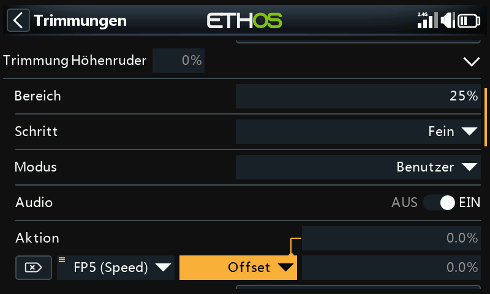

Wir konfigurieren das erste Verhalten als 'Offset + Standard' mit der Bedingung 'FM5(Speed)'. Wenn der FM5(Speed)-Modus ausgewählt ist, werden alle Trimmeinstellungen als Offset zum Basismodus-Trimmwert in FM0(Reiseflug) gespeichert. Daher ist die Trimmung in FM5(Speed) separat, aber auch abhängig von der Basistrimmung.

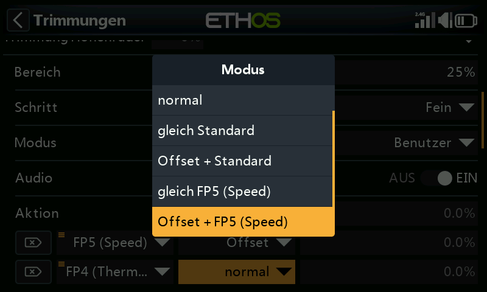

Beachten Sie, dass bei der Konfiguration des zweiten Verhaltens jetzt zusätzliche Optionen „Gleiche FM5(Geschwindigkeit)“ und „Offset + FM5(Thermik)“ im Dropdown-Dialog angezeigt werden. Diese sind auf das erste Verhalten zurückzuführen, das wir oben konfiguriert haben.

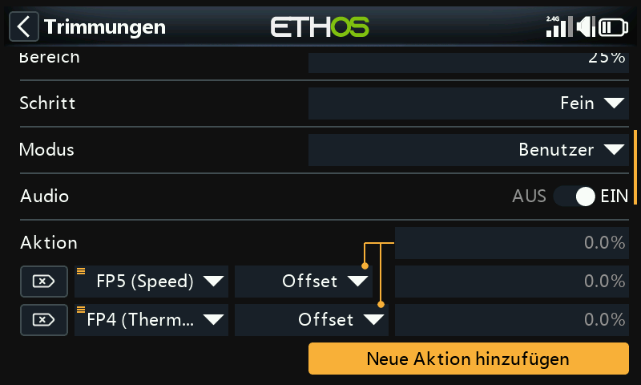

Ähnlich wie im ersten Fall konfigurieren wir das zweite Verhalten als „Offset + Standard“ mit der Bedingung „FM4(Thermal)“. Wenn der FM4(Thermal)-Modus ausgewählt ist, werden alle Trimmeinstellungen als Offset zum Basismodus-Trimmwert in FM0(Reiseflug) gespeichert. Daher ist die Trimmung in FM4(Thermik) separat, aber auch abhängig von der Basistrimmung.

Wenn Ihre Basistrimmung für den Reiseflug geändert werden muss, weil Sie die Schwerpunktlage des Flugzeugs geändert haben, werden die abhängigen Trimmeinstellungen für Geschwindigkeit und Thermik ebenfalls um den gleichen Betrag geändert.

### Audio

Für jede Trimmung kann Audio deaktiviert werden, wenn die Standardansagen nicht gewünscht sind, z. B. wenn die Trimmung umfunktioniert wurde.

### Trimmen auf Subtrimmen verschieben

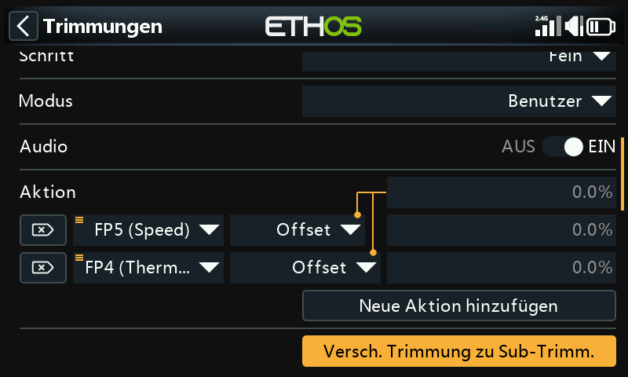

Nachdem Sie Ihr Modell für den Horizontalflug getrimmt haben, können Sie mit dieser Funktion den erforderlichen Trimmwert (z. B. für das Höhenruder) in die Subtrim-Einstellung in „Channels“ (Kanäle) übertragen und die Trimmung im Hauptbildschirm auf die Nullposition zurücksetzen. So können Sie leicht überprüfen, ob sich Ihre Flugtrimmungen nicht verschoben haben.

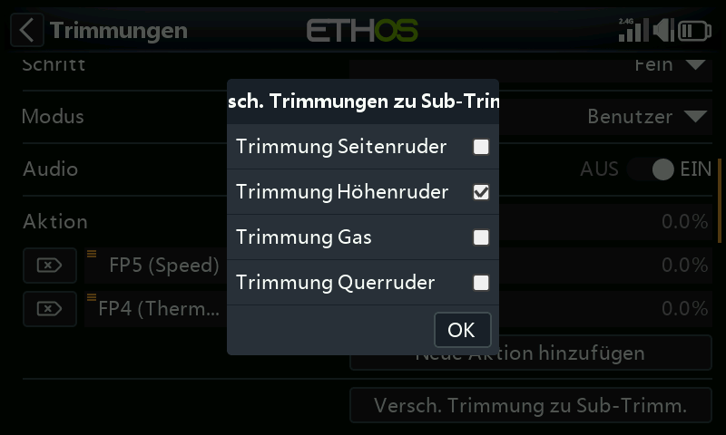

Bei der Option „Trimmung zu Subtrimmung verschieben“ für die Höhenrudertrimmung ist standardmäßig „Höhenrudertrimmung“ ausgewählt. Es können weitere Trimmungen hinzugefügt werden, oder Sie können die Master-Option „Trimmungen zu Subtrimmungen verschieben“ unten verwenden, die standardmäßig alle Trimmungen auswählt.

## Extra Trimmer

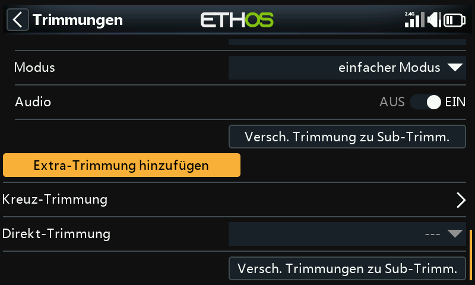

Extra Trimmer können durch Tippen auf die Schaltfläche „Extra Trimmer hinzufügen“ erstellt werden.

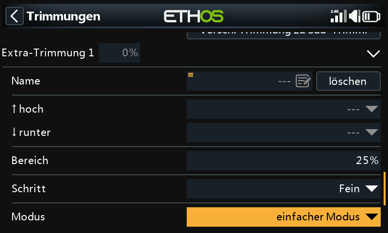

### Name

Der neue Trimmer kann benannt werden.

### hoch

Wählen Sie die Quelle aus, die für die Erhöhung des Trimmwerts verwendet werden soll.

### runter

Wählen Sie die Quelle aus, die zur Verringerung des Trimmwerts verwendet werden soll.

### Bereich

Bitte beachten Sie die Bereichs-Beschreibung für die Standardausstattungen oben.

### Schritt

Bitte beachten Sie die obige Schrittweiten-Beschreibung für die Standardausstattungen.

### Mode

Bitte beachten Sie die Beschreibung zur Konfiguration des Verhaltens der Standardleisten oben.

### Audio

Für jeden Trimmer kann die Ansage deaktiviert werden, wenn die Standardansagen nicht gewünscht sind, z.B. wenn die Verkleidung umfunktioniert wurde.

## Kreuz-Trimmung

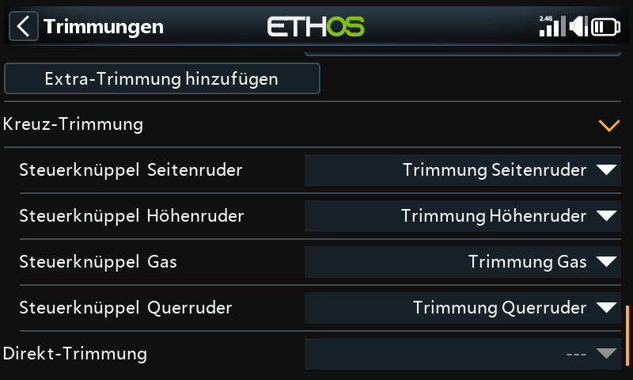

Für jeden Trimmknüppel können Kreuztrimmungen eingerichtet werden, so dass Sie für jeden Knüppel festlegen können, welcher Trimmschalter verwendet werden soll. (Die Trimmungen T5 und T6 sind nur für den X20 Pro, X20R(S) und den X18 verfügbar).

## Direkt Trim

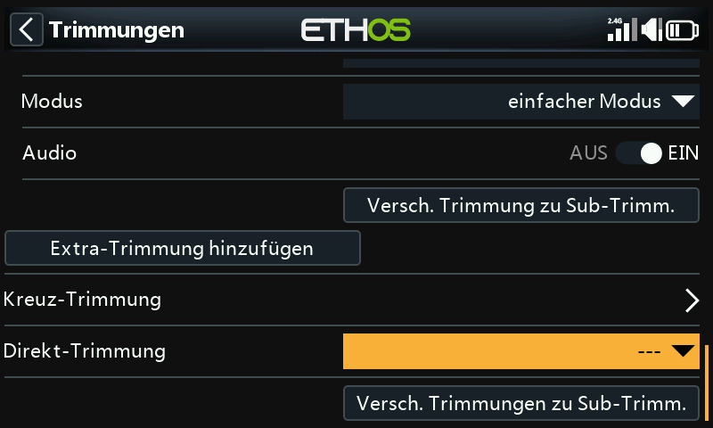

Wenn diese Funktion aktiv wird, addiert sie die aktuellen Knüppelpositionen zu den jeweiligen Trimmwerten für die Standardtrimmung (auch Quertrimmung). Am besten weisen Sie die Funktion einem Schalter zu, den Sie erreichen können, ohne die Steuerknüppel loszulassen, damit Sie die Trimmungen im Geradeausflug sofort einstellen können. Dadurch wird vermieden, dass Sie die Trimmschalter mehrmals betätigen müssen, wenn die Trimmung nicht stimmt. Diese Einstellung sollte nach dem Trimmflug deaktiviert werden, damit die Trimmung nicht versehentlich wieder verstellt wird.

Bitte beachten Sie, dass das sofortige Trimmen nur aktiv ist, wenn Sie sich in einer der Hauptansichten befinden.

## Verschiebe Trimmung nach Subtrim

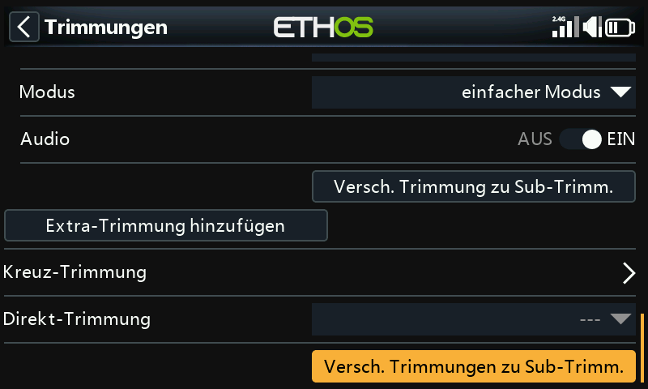

Nachdem Sie Ihr Modell für den Horizontalflug getrimmt haben, können Sie mit dieser Funktion den gewünschten Trimmwert (z.B. für das Höhenruder) in die Subtrimm-Einstellung unter „Kanäle“ verschieben und die Trimmung im Hauptbildschirm auf die Nullposition zurücksetzen. Auf diese Weise können Sie leicht überprüfen, ob sich Ihre Flugtrimmungen nicht verändert haben.

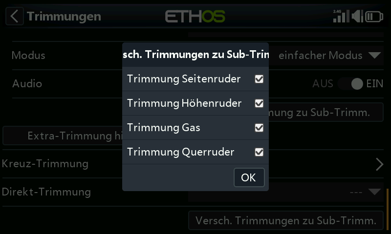

Überprüfen Sie die Trimmwerte, die auf die Sub-Trimmung übertragen werden sollen. Möglicherweise möchten Sie die Gastrimmung abwählen.

Bei der Verwendung von Flugphasen kann mehr als ein Trimmwert für jeden Kanal in Betracht kommen. Der Parameter Subtrim in den „Kanälen“ ist eine globale Einstellung, die für alle Flugphasen gilt, während die Trimmwerte je nach Flugphase variieren können. Daraus folgt, dass die Verschiebung der Trimmung in einer Flugphase in die globale Subtrimmung eine Anpassung der Trimmungen in den anderen Flugphasen erfordern kann. Daher übernimmt die Funktion die Trimmung der aktuell ausgewählten Flugphase, überträgt ihren Inhalt in die Subtrimmung, setzt die Trimmung zurück und passt die betroffenen Trimmungen aller anderen Flugphasen an. Am Ende des Tages sollten die Steuerflächenpositionen in jeder Flugphase die gleichen sein wie vor der Operation 'Trimmung zu Subtrimmung'.

Große Trimm- oder Subtrimmwerte können sich aufgrund der daraus resultierenden stark asymmetrischen Ausschläge nachteilig auswirken. Es wäre ratsam, das Problem mechanisch zu korrigieren. Es sollten alle Anstrengungen unternommen werden, um 90 Grad an den Anlenkungen zu erreichen, wenn sich die Flächen in der Neutralstellung befinden, mit Ausnahme der Klappen, bei denen man den Weg in Aufwärtsrichtung opfert, um den Weg in Abwärtsrichtung zu maximieren. Nachdem man die Anlenkungen so nahe wie möglich an 90 Grad gebracht hat, sollte PWM-Center verwendet werden, um sie genau auf 90 Grad zu bringen.

Es ist kein Problem, die Trimmung mit der Subtrimmung zu wiederholen, aber Sie sollten konsequent sein und immer in der gleichen Flugphase, d.h. in Ihrer „Basis“-Flugphase, arbeiten. Bei einem Segelflugzeug ist z.B. die Reiseflugphase normalerweise die Basisflugphase und diejenige, der zuerst getrimmt wird.
