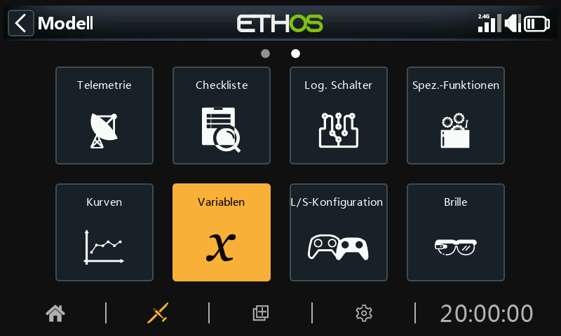

# Variable (Vars)

Variablen (Vars) können verwendet werden, um die Einstellungsparameter eines Modells so zu benennen und zu speichern, dass sie an anderer Stelle in der Senderprogrammierung, einschließlich der Mischer, referenziert werden können. Vars kann man sich als Container vorstellen, die Informationen enthalten.

Sie wurden in einem eigenen Abschnitt untergebracht, was eine saubere Trennung zwischen den Konfigurationsdaten eines Modells und der Programmierlogik ermöglicht. Das bedeutet, dass Sie alle Ihre Setup-Einstellungen an einem Ort mit aussagekräftigen Namen zentralisieren können, wo sie leicht zu finden und zu bearbeiten sind, ohne dass Sie zwischen Dutzenden von Mischern oder anderen Konfigurationselementen hin- und herspringen und zu dem entsprechenden Parameter blättern müssen.

Vars können feste Werte (d.h. Konstanten) enthalten, oder sie können mit benutzerdefinierbaren Grenzen einstellbar sein, um zu vermeiden, dass falsche Werte einen Absturz verursachen. Jede Var kann je nach den konfigurierten aktiven Bedingungen (z. B. Flugphasen) mehrere Werte enthalten. Aktionen können so konfiguriert werden, dass sie ihren Wert ändern, z. B. durch Verwendung einer umgewidmeten Trimmung für eine Anpassung während des Fluges oder durch Addieren/Subtrahieren/Multiplizieren/Dividieren von Eingaben. Die Variablen bleiben zwischen den Sitzungen bestehen.

Vars sind auch äußerst nützlich, wenn ein Einstellwert an mehreren Stellen verwendet werden soll. Zum Beispiel kann ein Segelflugzeug an jedem Flügel geteilte Querruder haben, von denen die inneren bei der Landung als Klappen verwendet werden können. Während des normalen Fluges wirken jedoch alle vier Flächen als Querruder und sollten daher eine gemeinsame Differenzierungseinstellung haben, um ein ungünstiges Gieren beim Wenden auszugleichen, was durch die Verwendung einer Var erreicht werden kann.

Variablen können den normalen numerischen Wert in allen Parametern mit der Funktion „Optionen“ ersetzen, die durch das Menüsymbol (Hamburger-Symbol) gekennzeichnet ist. Siehe dazu den [Abschnitt „Optionen](../getting-started/user-interface-and-navigation.md)“.

Es sind 64 Vars verfügbar.

Es gibt keine Standard-Variablen. Tippen Sie auf die Schaltfläche „+“, um eine neue Variable hinzuzufügen.

Sobald die Variablen definiert sind, wird durch Antippen einer Liste von Variablen ein Dialogfeld angezeigt, in dem Sie die markierte Variable bearbeiten, verschieben, kopieren/einfügen, klonen oder löschen können.

## Hinzufügen von Vars

### Wert

Zeigt den aktuellen Wert der Var.

### Name

Erlaubt die Benennung der Var.

### Kommentar

Zum besseren Verständnis kann ein Kommentar zur Erklärung der Verwendung oder Funktion hinzugefügt werden.

### Bereich

Der untere und obere Grenzwert eines Bereichs kann auf eine Dezimalstelle innerhalb von +/- 500 % eingestellt werden, um den Wert des Var innerhalb definierter Grenzen zu halten.

### Wert

#### Feste Werte

Vars kann einen einzelnen festen Wert (d. h. eine Konstante) mit einer Dezimalstelle enthalten, wie im obigen Beispiel.

#### Mehrere oder variable Werte

Wählen Sie „Neuen Wert hinzufügen“, um einen neuen Wert zu einer Var hinzuzufügen.

Jede Var kann je nach den konfigurierten aktiven Bedingungen (z. B. Flugphasen) mehrere Werte annehmen. Im obigen Beispiel hat Var12 einen Wert von 9%, wenn der Thermikflugphase FM4 aktiv ist. Wenn die Speed- Flugphase FM5 aktiv ist, hat Var12 einen Wert von -3%.

Beachten Sie, dass ein Bereich zwischen -10% und +15% festgelegt wurde, um größere Werte als gewünscht zu vermeiden.

Die Variablen bleiben zwischen den Sitzungen bestehen.

### Aktionen

#### Es können verschiedene Aktionen hinzugefügt werden, z.B. zur Wiederverwendung von Trimmungen oder zur Durchführung von Berechnungen.

#### Wiederverwendete Trimmung

Eine der Trimmer kann wiederverwendet werden, um den Wert eines Var anzupassen.

Im obigen Beispiel wurde eine Aktion definiert, um die Gas-Trimmung für die Tiefenruderkompensation nur während der Landeflugphase FM3 zu verwenden. Es wurde ein Bereich von 0 - 25% festgelegt, um den Var in einem vernünftigen Rahmen zu halten. Es kann ein Trimmschrittwert mit einer Dezimalstelle definiert werden, z.B. 1,0% im obigen Beispiel.

Wiederverwendete Trimmungen werden nur für diese spezifische aktive Bedingung verwendet. Zu allen anderen Zeiten arbeiten sie gemäß ihrer normalen Funktion.

#### Arithmetische Operationen

Aktionen können auch eingestellt werden auf:

- Der Var einen bestimmten Wert zuweisen
- Addieren (+) zu der Var
- Subtrahieren (-) von der Var
- Multiplizieren (\*) der Var mit dem Parameter
- Dividieren (/) der Var durch den Parameter
- Anwenden eines Prozentsatzes auf die Var
- Min
- Max

Die Aktionen werden durch Eingaben gesteuert.

Im obigen Beispiel weist der Funktionsschalter FS1(Flanke) der Var einen Wert von 40 % zu, und FS3 (Flanke) erhöht seinen Wert bei jedem Tastendruck um 2, bis das Maximum des Bereichs erreicht ist, und FS2 (Flanke) verringert seinen Wert ebenfalls um 2, bis das Minimum des Bereichs erreicht ist. Bitte beachten Sie, dass die Flankenoption ausgewählt werden muss (langer Druck auf den FS), damit die Aktion nur ausgeführt wird, wenn der Funktionsschalter seinen Zustand ändert.

## Vars entfernen

Durch das Entfernen eines VAR werden alle seine Verwendungen gleichzeitig in den VAR-Wert konvertiert.
