# Variablen

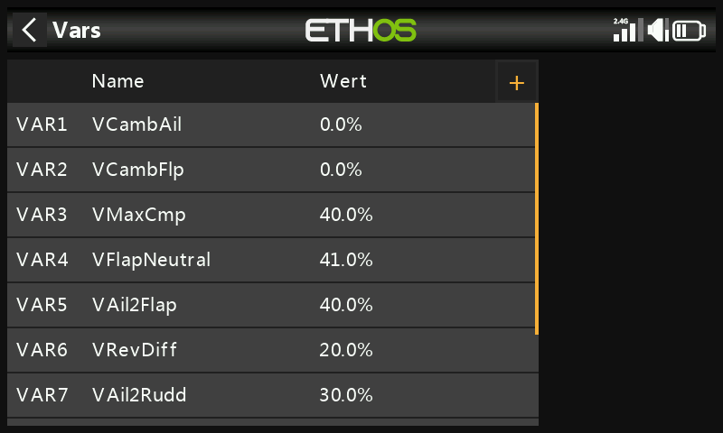

Variablen („Vars“) sind benannte Container für modelleigene
Einstellwerte, die an jeder anderen Stelle der Programmierung
referenziert werden können – auch in [Mischern](mixes.md). Da sie in
einem eigenen Bereich abgelegt werden, sind die *Konfigurationsdaten*
eines Modells von seiner *Programmierlogik* getrennt: Anstatt Dutzende
von Mischern zu durchsuchen, um einen Wert zu finden und anzupassen,
steht alles an einer Stelle unter einem aussagekräftigen Namen. Es
werden bis zu 64 Vars unterstützt; standardmäßig ist keine vorhanden.
Mit **+** fügen Sie eine Var hinzu; durch Antippen einer vorhandenen
Var erhalten Sie **bearbeiten**/**verschieben**/**kopieren**/**klonen**/**löschen**.

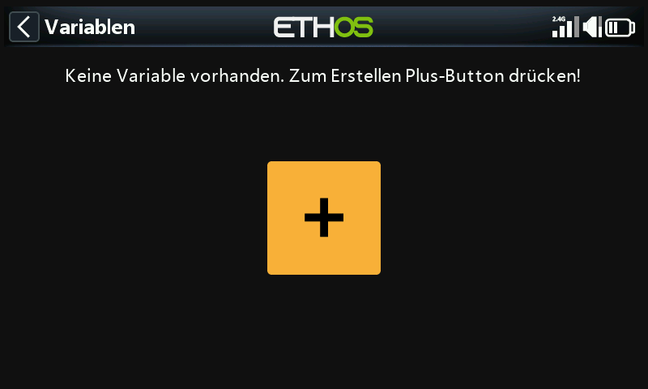

Eine Var kann eine feste Konstante enthalten oder innerhalb
benutzerdefinierter Grenzen verstellbar sein (damit unsinnige Werte
keinen Absturz verursachen), und sie kann pro aktiver Bedingung
(z. B. pro Flugphase) einen *unterschiedlichen* Wert annehmen. Die Werte
bleiben über Sitzungen hinweg erhalten. Eine Var kann überall dort
anstelle eines gewöhnlichen numerischen Werts verwendet werden, wo die
[Optionen-Funktion](../getting-started/user-interface-and-navigation.md#the-options-feature)
verfügbar ist (die Felder mit dem Hamburger-Symbol).

!!! example
    Ein Segler mit geteilten Querrudern (die inneren Sektionen dienen
    zugleich als Landeklappen) soll überall dort, wo alle vier Ruder als
    Querruder arbeiten, ein einziges gemeinsames Querruder-Differential
    verwenden – eine Var, die diesen einen Wert enthält und aus jedem
    betroffenen Mischer referenziert wird, hält ihn konsistent und muss
    nur an einer Stelle abgestimmt werden.

## Eine Var hinzufügen

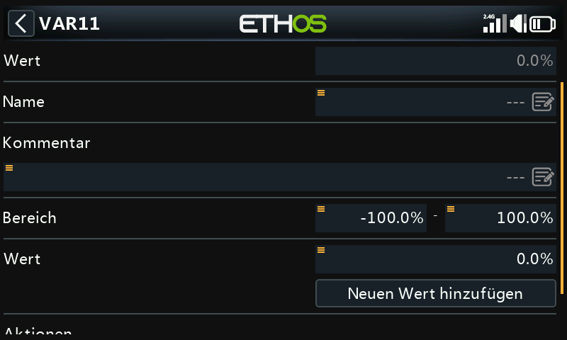

- **Wert** — aktueller Wert (reine Anzeige, nicht editierbar).
- **Name** — Ermöglicht die Benennung der Var.
- **Kommentar** — Freitext zur Erläuterung des Zwecks.
- **Bereich** — untere/obere Grenze (eine Kommastelle, innerhalb
  ±500 %), die der Wert der Var niemals überschreiten kann.

### Werte

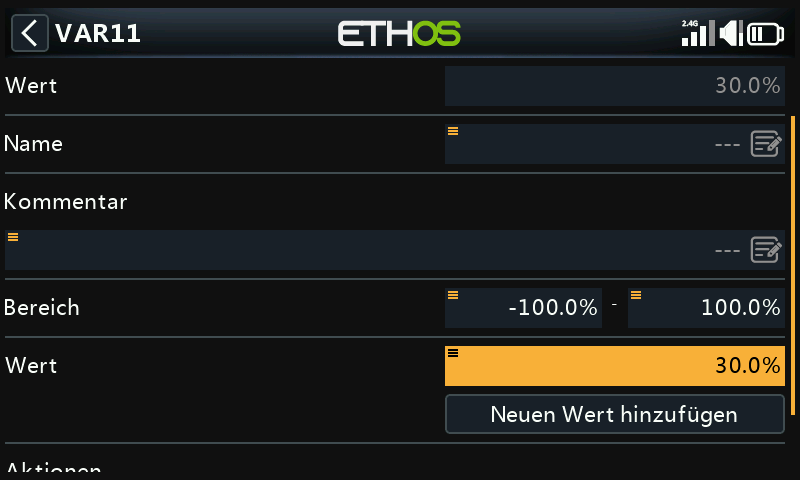

- **Fest** — eine einzelne Konstante mit einer Kommastelle.
- **Mehrfach/variabel** — mit **Neuen Wert hinzufügen** wird pro aktiver
  Bedingung ein Wert angelegt. Beispiel: `Var12` liefert 9 %, solange die
  Flugphase Thermik (FM4) aktiv ist, und −3 %, solange Speed (FM5) aktiv
  ist, wobei der Bereich auf −10 %…+15 % begrenzt ist, sodass keiner der
  Werte sinnvolle Grenzen überschreiten kann:

  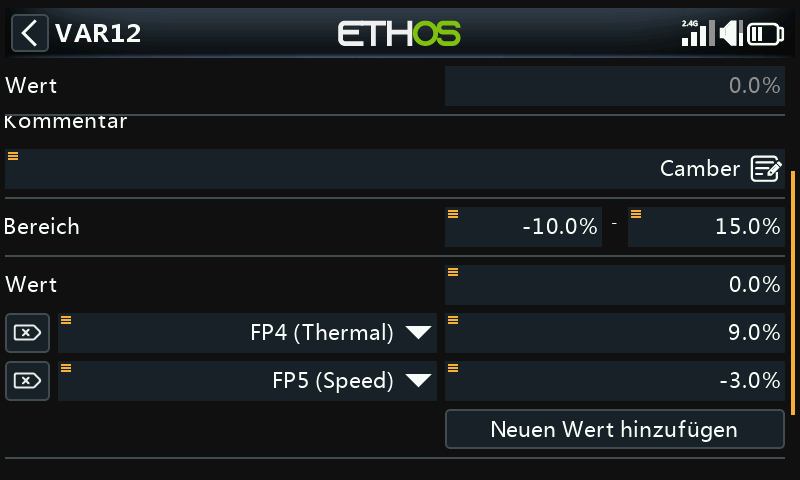
  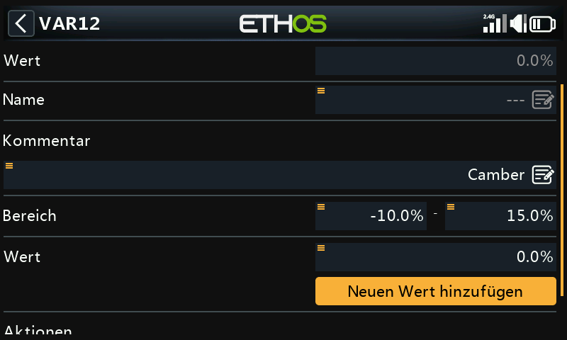

### Aktionen

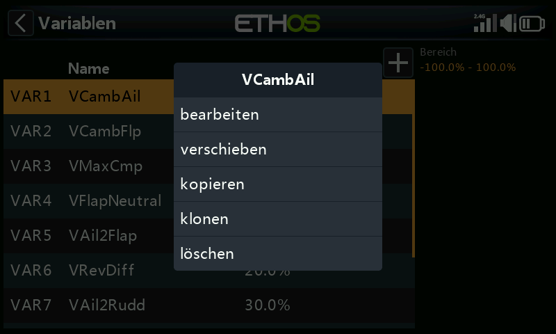
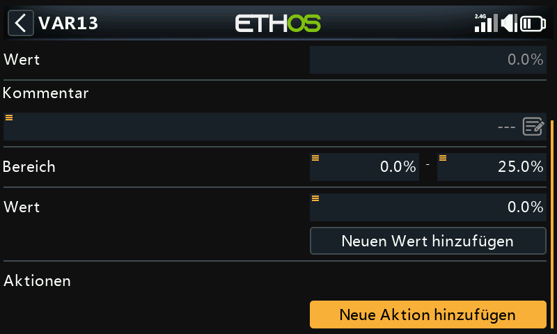

Aktionen verändern den Wert einer Var im Zeitverlauf, gesteuert durch
einen Eingang.

**Umgewidmete Trimmung** — übergibt eine der physischen Trimmungen der
Verstellung dieser Var anstelle ihrer normalen Funktion, üblicherweise
beschränkt auf eine aktive Bedingung:

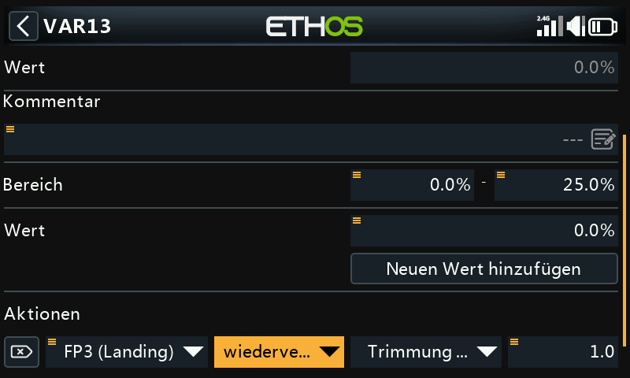
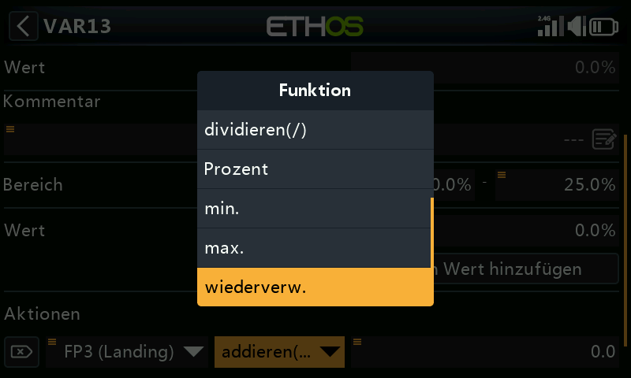

!!! example
    Die Gastrimmung wird zur Verstellung einer Var für die
    Wölbklappenkompensation umgewidmet, allerdings nur, solange die
    Flugphase Landung (FM3) aktiv ist, mit dem Bereich 0–25 % und einer
    Schrittweite von 1,0 % pro Klick. Außerhalb dieser aktiven Bedingung
    übernimmt die Trimmung automatisch wieder ihre gewöhnliche Funktion.

**Arithmetische Aktionen** — gesteuert durch einen beliebigen Eingang:

- **Zuweisen** — setzt die Var auf einen bestimmten Wert.
- **Addieren** / **Subtrahieren** / **Multiplizieren** / **Dividieren** —
  Rechenoperationen mit dem aktuellen Wert.
- **Prozent** — wendet einen Prozentsatz des steuernden Eingangs an.
- **Min** / **Max** — begrenzt die Var gegenüber dem steuernden Eingang.

  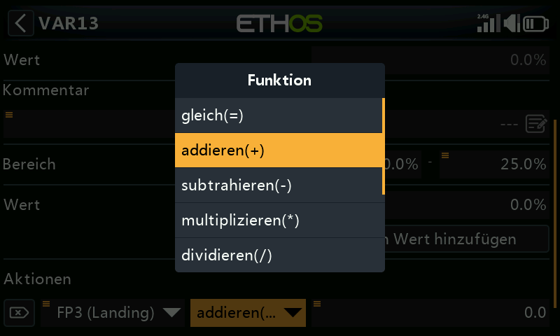

!!! example
    `FS3(edge)` weist einer Var direkt 40 % zu; `FS1(edge)` addiert bei
    jedem Druck 2 (begrenzt auf das Maximum des Bereichs); `FS2(edge)`
    subtrahiert bei jedem Druck 2 (begrenzt auf das Minimum des Bereichs).
    Die Option **Flanke** („Edge“, langes Drücken auf den
    Funktionsschalter) ist hier entscheidend – ohne sie würde die Aktion
    fortlaufend ausgelöst, solange der Schalter gehalten wird, statt
    einmal pro Betätigung.

  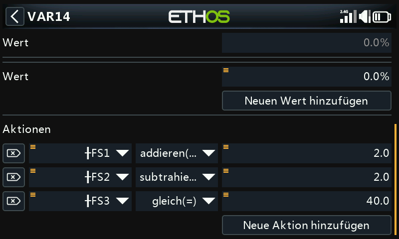
