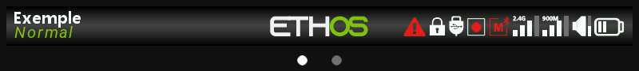

# Symbolleisten

Zwei permanent sichtbare Leisten rahmen jeden Bildschirm in Ethos ein – gleichermaßen den Startbildschirm wie die Menüs.

## Obere Leiste

Zeigt von links nach rechts: Name/Symbol des aktuellen Modells, Status der HF-Verbindung, RSSI, Akku-/Spannungswerte von Sender und Empfänger sowie die Uhrzeit – konfigurierbar unter [Systemeinstellungen — Allgemein](../system-setup/general.md).

## Untere Leiste

Eine Balkendiagramm-Anzeige der Ausgangskanäle in Echtzeit – dieselben Informationen wie beim [Widget „Kanäle“](../displays/index.md#widget-types), stets verfügbar, unabhängig davon, welcher Anzeigebildschirm gerade aktiv ist.
