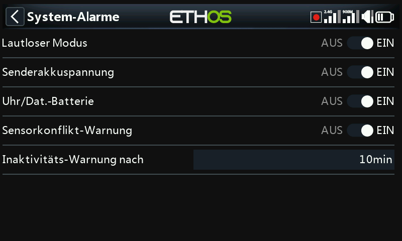

# Warnungen

Vier senderweite Warnungen, jede einzeln zuschaltbar – unabhängig von den
modellspezifischen [Sonderfunktionen](../model-setup/special-functions.md)
und [logischen Schaltern](../model-setup/logical-switches.md), die Sie
selbst anlegen.

- **Stummer Modus** – eine Sprachansage beim Einschalten, wenn diese
  Prüfung aktiv ist und [Allgemein → Audio-Modus](general.md) auf Stumm
  gesetzt ist, als Erinnerung daran, dass der Sender stummgeschaltet ist.
- **Hauptspannung** – „Radio battery is low“, wenn der Hauptakku des
  Senders unter den in [Akku](battery.md) eingestellten Schwellwert
  **Unterspannung** fällt.
- **RTC-Spannung** – „RTC battery is low“, wenn die RTC-Knopfzelle unter
  2,5 V fällt (Standardschwellwert). Die Datenaufzeichnung ist auf die
  Echtzeituhr angewiesen; eine ungültige Zeit macht Logdateien schwer
  lesbar, insbesondere beim Unterscheiden einzelner Flugsitzungen. Diese
  Warnung kann vorübergehend stummgeschaltet werden, während man auf den
  Austausch der Batterie wartet, sollte aber nicht dauerhaft deaktiviert
  bleiben.
- **Warnung bei Sensorkonflikt** – erkennt in Konflikt stehende
  Telemetrie-Sensor-IDs. Ein Deaktivieren lohnt sich nur, wenn Sie
  Sensoren verwenden, die nicht der S.Port-Spezifikation entsprechen.
- **Inaktivität** – eine Sprachansage „Prolonged inactivity“ (zusätzlich
  ein Vibrationsimpuls, falls die Lautstärke heruntergeregelt ist),
  nachdem der Sender länger als die eingestellte Zeit ungenutzt geblieben
  ist – standardmäßig 10 Minuten.
